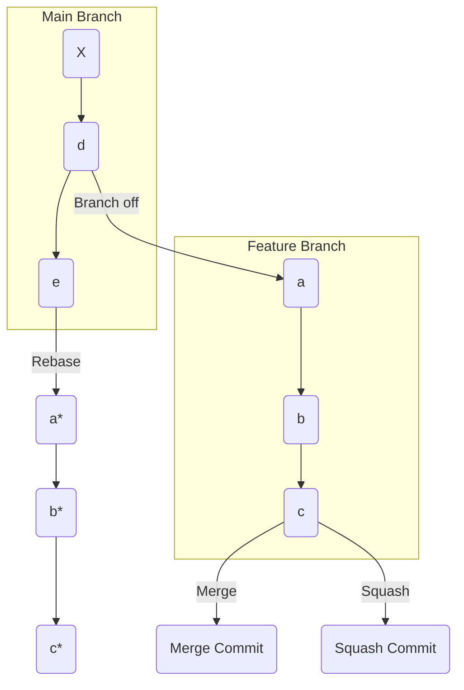

# Git Merge vs. Rebase vs. Squash: A Comprehensive Technical Guide

---

## 1. Main Concepts (Overview Section)

This documentation will guide you through the practical and conceptual differences between three essential Git strategies for integrating changes: **git merge**, **git rebase**, and **squash commits**. We’ll explore:
- How feature and main branches diverge and the necessity of keeping them in sync.
- The mechanics and implications of using **git merge** to combine branches.
- The process and effects of **git rebase** for rewriting commit history.
- The role of **squash commits** in producing a concise, linear commit history.
- Real-world use cases, trade-offs, and best practices for each approach.
- Analogies and examples to clarify concepts and help you choose the right strategy for your team and workflow.

---

## 2. Detailed Conceptual Flow (Core Documentation)

### Understanding Branch Divergence

In collaborative Git projects, branching is fundamental. Imagine you have a **main** branch representing production-ready code and a **feature** branch for new development. As work progresses, both branches can accumulate unique commits—like branches of a tree growing in different directions. For instance, your feature branch might have commits `a`, `b`, and `c`, while the main branch receives `d` and `e`. Eventually, you’ll need to reconcile these differences to deliver new features and keep your codebase healthy.

### Synchronizing Branches: Merge and Rebase

#### **Git Merge: Weaving Branches Together**

The **merge** command integrates changes from one branch (e.g., main) into another (e.g., feature), producing a new _merge commit_ that ties their histories together. This is akin to tying two ropes together with a visible knot—a point in history showing where the branches joined. Merge preserves the full context and sequence of all changes, maintaining a rich, branching commit history.

For example, if your feature branch has diverged from main, running `git merge main` on the feature branch will:
- Incorporate all new commits from main (`d`, `e`) into feature.
- Create a new merge commit that marks the convergence point.

#### **Git Rebase: Streamlining History**

**Rebase** takes a different approach. Instead of weaving branches together, it _moves_ the entire sequence of commits from your feature branch and reapplies them on top of the latest commit from main. This rewrites history, making it look as though your feature work started from the current tip of main, yielding a clean, linear history.

So, `git rebase main` will:
- Temporarily remove commits `a`, `b`, `c` from feature.
- Fast-forward feature to include all changes from main.
- Sequentially reapply `a`, `b`, and `c` on top of the latest commit from main.

This process eliminates the “knots” (merge commits) and can make history easier to follow, especially in large, collaborative projects.

### Integrating Feature Branches Back to Main

After your feature is complete, you’ll want to merge it into main. There are three common strategies:

#### 1. **Merge Commit into Main**

Merging the feature branch into main (with `git merge feature`) creates a new merge commit, preserving all the detailed commit history and the structure of how the branches evolved. This method is transparent but can clutter history with many merge commits—especially in active projects with frequent feature branches.

#### 2. **Rebase and Fast-Forward Merge**

You can **rebase** your feature branch onto main, then perform a _fast-forward merge_. This means the main branch simply moves forward to include the new commits, without generating a merge commit. The result is a straight, linear history—like a rope with no knots. This approach is favored for its clarity and simplicity, especially when tracking the evolution of code is more valuable than seeing the precise points where branches joined.

#### 3. **Squash Commits**

With **squash commits**, all the individual changes from your feature branch are condensed into a single commit before merging into main. This keeps the main branch’s history exceptionally clean—each feature or bugfix appears as a single commit—while still allowing you to retain detailed commit logs in the feature branch itself. However, the granularity of individual commits is lost in main, making it harder to trace incremental progress after the fact.

**Squash merging** is widely used in platforms like GitHub, where you can choose to “Squash and merge” a pull request, producing a succinct, readable main branch history.

---

## 3. Simple & Analogy-Based Examples

**Simple Example:**
Suppose you start feature development from main at commit X.

- Main progresses: X → d → e
- Feature progresses: X → a → b → c

**Using Merge:**
- Merging main into feature creates a merge commit:  
  History:  
  ```
  main: X → d → e
                 \
  feature:        a → b → c
                        /
             merge commit (ties histories together)
  ```

**Using Rebase:**
- Rebasing feature onto main:  
  ```
  main: X → d → e → a* → b* → c*
  ```
  (`a*`, `b*`, `c*` are new commits, replayed on top of e)

**Using Squash:**
- Squashing feature before merging:  
  ```
  main: X → d → e → [Feature: a+b+c as one commit]
  ```

**Analogy Section: The Rope and Knots**

Imagine your project history as a rope. Each branch is a strand, and every time you merge, you tie a knot connecting the strands—this is a merge commit. Over time, many knots make the rope thick and tangled, but every twist is documented.

Rebasing, on the other hand, untwists the rope and lays the strands parallel, making it look like one continuous piece. Squashing takes all the twists and compresses them into a single, neat segment, hiding the individual twists inside.

---

## 4. Use in Real-World System Design

### Common Patterns and Use Cases

- **Merge:**  
  Ideal for open-source projects or teams that value seeing a complete, unaltered history of how branches interact. It preserves context for troubleshooting and for understanding why certain changes were made.

- **Rebase:**  
  Preferred in organizations valuing a clean, linear history—such as enterprise repositories with strict audit requirements or teams that engage in frequent code reviews. Rebasing makes it easier to understand how features have evolved over time.

- **Squash:**  
  Best for projects where main branch clarity is paramount and the details of individual feature commits are less critical. Popular on GitHub, it allows each feature to be tracked as a single commit, aiding release management and rollbacks.

### Design Decisions Influenced

- **Code Review**: Linear histories from rebasing or squashing make code review and blame tracing easier.
- **Troubleshooting**: Merge histories preserve all context, helpful when tracking down bugs introduced during complex integrations.
- **Release Management**: Squash merges make releases simpler, as each feature is a single, atomic commit.

### Trade-Offs and Challenges

- **Merge**
  - **Pros**: Full history, context for all changes, easy to see how branches relate.
  - **Cons**: History can become cluttered with merge commits, making it harder to read.
  - **Example**: Large open-source projects like Linux use merges to preserve detailed provenance.

- **Rebase**
  - **Pros**: Clean history, easier to follow, simplifies linear progression.
  - **Cons**: Rewriting history can cause problems if not coordinated among team members; can make debugging harder when original branch structure is lost.
  - **Example**: Internal business apps where codebase clarity is prioritized.

- **Squash**
  - **Pros**: Main branch stays clean, each feature/bugfix is a single commit.
  - **Cons**: You lose granular commit information in the main branch; harder to trace changes within a feature after the fact.
  - **Example**: GitHub workflows where pull requests are squashed and merged.

### Best Practices and Anti-Patterns

- **Best Practices**
  - Use **merge** when you need to preserve history for auditing or open collaboration.
  - Use **rebase** for local cleanup before merging, but avoid rebasing shared branches.
  - Use **squash** for simple features or when you want concise main branch history.

- **Anti-Patterns**
  - Rebasing public/shared branches can cause confusion and conflicts for collaborators.
  - Squashing everything can obscure important incremental changes.
  - Excessive merging can make history dense and hard to follow.

---

## 5. Optional: Advanced Insights

### Deeper Insights

- **Interactive Rebase**: Allows you to reorder, edit, or drop commits before merging—a powerful tool for preparing clean, logical commit sequences.
- **Merge Commits in Code Archaeology**: While merges clutter history, they can be invaluable for understanding integration points and resolving regressions.
- **Rebase vs. Merge in Continuous Integration (CI)**: CI pipelines often prefer rebased or squashed branches for predictable, testable main histories.

### Comparisons and Edge Cases

- **Cherry-pick vs. Rebase**: Both can move commits across branches, but cherry-pick is selective whereas rebase is wholesale.
- **Rebasing with Conflicts**: Each commit is reapplied in order, requiring conflict resolution at each step—can be time-consuming for large features.

---

## Summary Diagram



---

# Conclusion

The choice between **git merge**, **git rebase**, and **squash commits** shapes your project’s history, clarity, and collaboration dynamics. Each approach offers distinct advantages and trade-offs, and no single method suits every workflow. Evaluate your team’s needs—clarity, auditability, or simplicity—and adopt the strategy that best supports your development lifecycle. Remember: understanding the underlying mechanics and history models makes you a more effective and collaborative engineer.