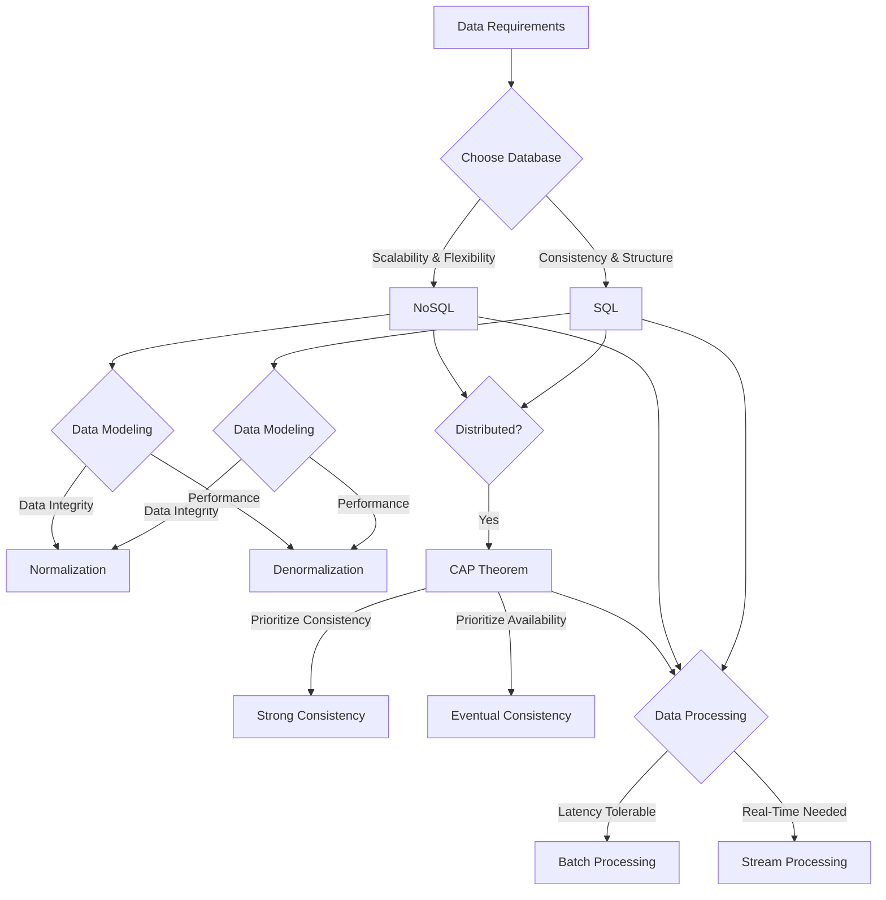

# System Design Was HARD – Until You Knew the Trade-Offs

---

## 1. Main Concepts (Overview Section)

This documentation explores the foundational trade-offs that drive architectural decisions in system design, especially as they relate to data management and processing. Through a progressive narrative, we will examine:

- **SQL vs. NoSQL Databases:** Contrasting consistency, structure, scalability, and flexibility.
- **Normalization vs. Denormalization:** Balancing data integrity against performance and scalability in database modeling.
- **CAP Theorem in Distributed Systems:** Understanding the inescapable trade-offs between consistency, availability, and partition tolerance.
- **Consistency Spectrum:** Exploring strong and eventual consistency, and what they mean for user experience and system design.
- **Batch vs. Stream Processing:** Weighing efficiency and simplicity against immediacy and responsiveness.
- **Real-World Applications:** How these trade-offs shape the evolution and design of modern, large-scale systems.

By the end, you'll understand not only what these trade-offs are, but how and why they influence real-world engineering choices.

---

## 2. Detailed Conceptual Flow (Core Documentation)

### Introduction: The Art of Trade-Offs in System Design

System design is fundamentally about making choices—each with its own set of benefits and drawbacks. No solution is universally “best”; the optimal design is always context-dependent, shaped by your application's goals and constraints. Nowhere is this more apparent than in the domain of data management and processing, where every design decision ripples through to impact scalability, performance, integrity, and user experience.

### SQL vs. NoSQL Databases: Structure, Consistency, and Scalability

The first major trade-off surfaces at the level of data storage. **SQL databases** (such as PostgreSQL or MySQL) are built around structured schemas—predefined tables and relationships—which enforce **strong consistency** and **data integrity**. This design not only ensures that your data is always reliable and queries are robust, but it also makes transaction handling straightforward. However, this rigidity comes at a cost: scaling horizontally (i.e., spreading data across many servers) is challenging, and modifying schemas can be cumbersome as your application evolves.

In contrast, **NoSQL databases** (like MongoDB, Cassandra, or DynamoDB) invert these priorities. They often relax consistency guarantees and offer more flexible, schema-less data models, making it easier to scale out and adapt to changing requirements. But this flexibility means you may lose some query sophistication, and there’s a higher risk of encountering temporary inconsistencies in your data.

In practice, the choice between SQL and NoSQL is not about "better or worse," but about fit:  
- Do you need strong transactional guarantees and complex queries? **SQL** is likely your tool of choice.
- Do you anticipate massive scale, rapidly evolving data models, or need to distribute data globally? **NoSQL** solutions may serve you better.

#### Example:  
Consider an online banking system. Here, strong consistency is non-negotiable—every cent must be accounted for. SQL shines in such settings.  
Contrast this with a social media platform, where millions of posts and likes must be handled in real time. Here, NoSQL's scalability and flexibility often outweigh the need for immediate consistency.

### Database Modeling: Normalization vs. Denormalization

Once you’ve chosen a database paradigm, the next set of trade-offs appears in how you structure your data. **Normalization**—organizing data into separate tables to eliminate redundancy—ensures data integrity, minimizes storage needs, and maintains a clean, logically consistent model. Each fact is stored in only one place, reducing the risk of data anomalies.

Yet, as systems grow, the cost of performing JOIN operations (combining data from multiple tables) increases, impacting performance. For high-traffic applications, this can become untenable.

**Denormalization** is the deliberate act of duplicating data across tables or documents to optimize query performance. By storing data in a more "pre-joined" format, you can serve common queries faster, at the cost of more complex write operations and potential consistency headaches—since the same data now lives in multiple places.

Most large-scale systems evolve from normalized designs to selectively denormalized models, as their scaling and performance requirements grow. Data integrity and simplicity give way to the demands of speed and scale.

#### Example:  
A reporting dashboard that aggregates user activity may denormalize user profiles and activity logs into a single table, allowing for instant readouts at the expense of more complicated updates when user data changes.

### Trade-Offs in Distributed Systems: The CAP Theorem

When data must be distributed across multiple nodes or locations, **the CAP theorem** comes into play. This theorem asserts that a distributed system can provide only two out of the following three guarantees at any given time:
- **Consistency:** Every read receives the most recent write.
- **Availability:** Every request receives a response, even if some nodes are down.
- **Partition Tolerance:** The system continues to operate even if network failures (partitions) split communication between nodes.

During a network partition, you must choose: either reject requests to preserve consistency, or serve stale data to remain available.  
- **Banking systems** usually prioritize consistency—better to deny a transaction than risk an incorrect balance.
- **Social networks** may prioritize availability—better to temporarily show an old post than prevent users from accessing the service.

### The Consistency Spectrum: Strong vs. Eventual Consistency

Consistency in distributed systems is not all-or-nothing. **Strong consistency** ensures that as soon as data is written, all users see the update immediately, regardless of which node they access. This requires heavy coordination between nodes and can slow the system under high load.

**Eventual consistency** relaxes this guarantee: updates propagate over time, so some users might briefly see stale data. This model is much more scalable and resilient, but it introduces complexity in handling cases where up-to-date information is critical.

The choice depends on business requirements. For mission-critical data where accuracy is paramount, strong consistency is essential. For applications where slight delays are acceptable, eventual consistency unlocks performance and scale.

#### Example:  
Amazon’s shopping cart uses eventual consistency—if your cart update is delayed by a second, that’s acceptable. But your bank account should never show a delayed balance update.

### Data Processing Paradigms: Batch vs. Stream Processing

Finally, how we process data introduces another axis of trade-offs. **Batch processing** collects data over time and processes it in large chunks, optimizing for computational efficiency and simplicity. However, this introduces latency—users may wait minutes or hours for their data to be reflected.

**Stream processing** operates on data in real time, enabling immediate insights and reactions. This is essential for use cases like fraud detection or live analytics. However, it’s much harder to guarantee correctness, as data may arrive out of order or at unpredictable times, requiring sophisticated state management.

Hybrid architectures are common: for example, a system may use stream processing for alerts and monitoring, while relying on batch processing for in-depth, periodic analysis.

---

## 3. Simple & Analogy-Based Examples

To make these concepts more intuitive, let’s use an analogy: **a busy library**.

- **SQL databases** are like a library with a strict cataloging system. Every book is meticulously placed, and the catalog always reflects the exact inventory. This makes finding a specific book easy and reliable, but if you want to add a new genre or rearrange shelves, it takes effort and coordination.
- **NoSQL databases** resemble a lending library. Books can be borrowed or returned to any shelf, and the system is flexible about new genres or formats. Sometimes, the catalog may be momentarily out of sync (e.g., a book is on the “New Arrivals” shelf before being logged), but patrons can access materials more easily.

When organizing the library:
- **Normalization** is like having a single copy of each book and referencing it in the catalog. Efficient and orderly, but if the library is crowded and everyone needs the same book, there’s a bottleneck.
- **Denormalization** is like placing popular books in several locations. Patrons find them faster, but the staff must work harder to keep all copies up to date.

For the **CAP theorem**:  
Imagine a power outage cuts off part of the library (a network partition). The staff can either refuse to lend any books until the catalog is restored (consistency), or allow lending with the risk that the catalog is temporarily inaccurate (availability).

**Batch processing** is like sorting all returned books at the end of the day—efficient, but books aren’t available until the next morning. **Stream processing** is putting each book back on the shelf as soon as it’s returned—instant, but requires more coordination.

---

## 4. Use in Real-World System Design

Understanding these trade-offs is central to building robust, scalable systems:

- **Common Patterns and Use Cases:**  
  - E-commerce platforms often use SQL for transactional data (orders, payments) and NoSQL for product catalogs or user sessions.
  - Social networks employ denormalization to serve feeds quickly, accepting the overhead of keeping data in sync.
  - Streaming platforms blend batch (for analytics) and stream processing (for recommendations or abuse detection).

- **Design Decisions Influenced by Trade-Offs:**  
  - Startups may begin with normalized SQL schemas for simplicity, then introduce denormalization and caching as they scale.
  - Global applications must decide between immediate consistency (with higher latency) or eventual consistency (with possible staleness) when replicating data across continents.

- **Trade-Offs and Challenges:**  
  - *PROS of Normalization:* Data integrity, easier maintenance.  
    *CONS:* Slower queries at scale.  
  - *PROS of Denormalization:* Fast reads.  
    *CONS:* Harder writes, risk of inconsistency.
  - *PROS of SQL:* Reliable, expressive queries.  
    *CONS:* Difficult to scale horizontally.
  - *PROS of NoSQL:* Flexible, scalable.  
    *CONS:* Weaker consistency, less powerful queries.
  - *PROS of Batch Processing:* Efficiency, simplicity.  
    *CONS:* High latency.
  - *PROS of Stream Processing:* Real-time insights.  
    *CONS:* Complexity, correctness challenges.

- **Anti-Patterns to Avoid:**  
  - Over-denormalizing early, leading to unmanageable complexity.
  - Blindly choosing eventual consistency where correctness is critical.
  - Mixing batch and stream logic without clear boundaries, creating maintenance headaches.

---

## 5. Optional: Advanced Insights

- **Hybrid Approaches:** Many systems employ polyglot persistence—using both SQL and NoSQL databases for different needs. For example, Netflix and Amazon use multiple data stores tailored to workload requirements.
- **Consistency Models:** Beyond strong and eventual consistency, there are intermediate models (like causal or session consistency) that balance correctness and performance.
- **Edge Cases:**  
  - In distributed systems, "split-brain" scenarios (where two network partitions both accept writes) can cause irreconcilable data divergence without careful protocol design.
  - Write amplification in denormalized systems can become a bottleneck, especially during bursty workloads.
- **Comparisons:**  
  - NewSQL databases attempt to blend SQL’s consistency and structure with NoSQL’s scalability.
  - Lambda and Kappa architectures offer frameworks for hybrid batch/stream processing.

---

### Flow Diagram: Trade-Offs in Data Management & Processing

---

## Analogy Section: Recap

- **SQL vs. NoSQL:** The meticulously organized library vs. the flexible lending library.
- **Normalization/Denormalization:** Single copy of a book vs. popular books shelved in multiple places.
- **CAP Theorem:** Power outage—do we halt lending or risk catalog mistakes?
- **Batch/Stream Processing:** Sorting books at day’s end vs. immediate reshelving.

---

## Conclusion

System design is the discipline of balancing competing priorities. Every architectural choice—whether about databases, data modeling, consistency, or processing—entails a set of trade-offs. The best engineers are those who grasp these trade-offs and align their decisions with the unique requirements of their application. There are no perfect solutions, only those that best fit the problem at hand. Understanding and embracing these trade-offs will empower you to build scalable, reliable, and performant systems.

---