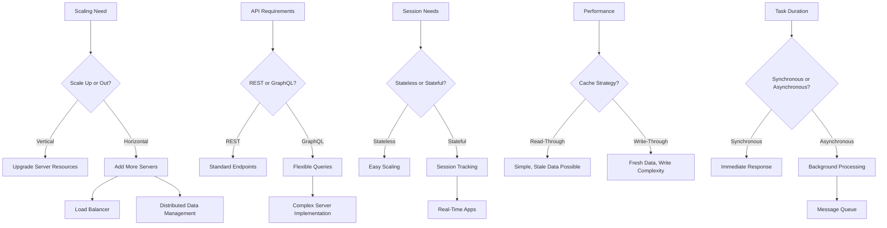

---

# System Design Was HARD – Until You Knew the Trade-Offs, Part 2

## 1. Main Concepts (Overview Section)

In this section, we will explore essential system design trade-offs that shape how scalable, reliable, and maintainable systems are built. The key topics covered include:

- **Scaling Approaches:** Vertical vs. horizontal scaling and their implications.
- **API Design Choices:** REST APIs versus GraphQL, and the trade-offs each brings.
- **State Management:** Stateless versus stateful architectures, and when each is appropriate.
- **Caching Strategies:** Read-through versus write-through caching, focusing on data freshness and complexity.
- **Processing Models:** Synchronous and asynchronous request handling, and the impact on user experience and system complexity.
- **Real-world Applications:** How these trade-offs manifest in system architecture, common patterns, and anti-patterns.

By the end of this documentation, you'll understand how these trade-offs interact and how to make informed architectural decisions as your system evolves.

---

## 2. Detailed Conceptual Flow (Core Documentation)

### 2.1. The Nature of System Design: Navigating Trade-Offs

System design is fundamentally about making choices—each with its own set of benefits and drawbacks. As systems grow, the need to balance simplicity, scalability, performance, and reliability becomes crucial. The core of mature system design lies in understanding these trade-offs and applying them judiciously to meet real-world requirements.

---

### 2.2. Scaling Systems: Vertical vs. Horizontal

**Scaling** is the process of increasing a system's capacity to handle more load. The first major decision is whether to scale **vertically** or **horizontally**.

- **Vertical Scaling** involves upgrading existing servers—adding more CPU, memory, or storage. This approach is straightforward: no code changes are needed, and resource upgrades can provide immediate performance gains. However, vertical scaling has a ceiling: hardware improvements become increasingly expensive and eventually reach physical or economic limits.

- **Horizontal Scaling** means adding more servers and distributing the load among them. This model offers virtually unlimited growth and can improve **fault tolerance** (the system's ability to continue operating despite failures). However, it introduces complexity:
  - **Load balancing**: ensuring requests are evenly distributed.
  - **Data consistency**: keeping information synchronized across servers.
  - **Distributed challenges**: such as network partitions and server failures.

The essential trade-off here is between **simplicity and scalability**. Vertical scaling is easy but limited; horizontal scaling is powerful but demands more engineering effort.

#### Example and Analogy

Imagine a restaurant. Vertical scaling is like hiring a better chef and buying bigger ovens—helpful, but only to a point. Horizontal scaling is like opening more branches and coordinating between them—more reach, but more to manage.

---

### 2.3. API Design: REST vs. GraphQL

A system’s interface for communication—its API—shapes how effectively clients interact with backend services.

- **REST APIs** are the default for most new applications. They follow HTTP conventions and present resources as endpoints (e.g., `/users`, `/orders`). REST is mature, well-understood, and maps directly to CRUD operations.

  Over time, REST's limitations emerge:
  - Clients may need to make multiple round trips to gather related data.
  - The number of endpoints grows as UI requirements become more specific.
  - Clients often receive more data than is necessary for their needs.

- **GraphQL** was created to address these pain points. It allows clients to specify exactly what data they require and retrieve it in a single request. This flexibility empowers front-end teams and reduces over-fetching.

  Yet, GraphQL introduces new complexities:
  - Server-side implementation becomes more complex.
  - Deeply nested queries can create performance bottlenecks.
  - Security risks arise from unbounded query complexity.

The choice is rarely about which is "best," but about which aligns with your system's maturity and requirements. REST is ideal for simple public APIs and CRUD operations; GraphQL excels when front-end needs diverge and autonomy is essential.

#### Example and Analogy

Consider ordering food: REST is like a fixed menu—you order predefined meals. GraphQL is like a custom kitchen—you specify every ingredient, but the kitchen must handle more complex requests.

---

### 2.4. State Management: Stateless vs. Stateful Architectures

**State** refers to information retained between requests. In web systems, the **stateless** approach is often preferred:

- **Stateless** services do not remember anything about previous requests. Each interaction is independent. This design simplifies scaling and fault tolerance: any server can handle any request.

However, some applications require **stateful** design:

- **Stateful** services retain information about users or sessions. This is essential for:
  - Game servers (tracking player positions).
  - Chat/WebSocket servers (maintaining persistent connections).
  - Trading platforms (tracking transaction state).

In practice, modern systems blend both approaches: stateless services handle general operations; specialized stateful components serve real-time or session-based needs.

#### Example and Analogy

A stateless system is like a vending machine: each purchase is independent. A stateful system is like a bank teller who remembers your account details throughout your visit.

---

### 2.5. Caching Strategies: Read-Through vs. Write-Through

**Caching** accelerates data access by storing frequently used data in fast-access storage. How and when to update the cache is a key trade-off:

- **Read-through caching**: On a cache miss, the system fetches data from the database, stores it in the cache, and returns it. This is simple and works well for data that doesn’t change frequently.
  - **Problem:** If data changes in the database but the cache isn’t updated, users might see stale (outdated) information.

- **Write-through caching**: Whenever data is updated, both the cache and the database are updated simultaneously. This ensures data freshness but adds complexity to write operations.

The choice depends on how critical data freshness is. For inventory or financial systems, stale data can have serious consequences, making write-through caching more appropriate.

#### Example and Analogy

Read-through is like checking a library’s card catalog—if the book isn’t listed, you check the shelves, then update the catalog. Write-through is like updating the catalog and the shelf together whenever a new book arrives.

---

### 2.6. Processing Models: Synchronous vs. Asynchronous

**Synchronous processing** means a client waits for the server to complete the operation before getting a response. This is predictable and simple for quick operations.

**Asynchronous processing** is used for long-running tasks. The server quickly acknowledges the request and processes it in the background, often notifying the client when done. This improves user experience but requires more infrastructure, such as:

- Message queues to manage requests.
- Tracking and reporting task status.
- Handling retries and errors.

Hybrid approaches are common: fast tasks are synchronous, while resource-intensive tasks are handled asynchronously.

#### Example and Analogy

Synchronous is like waiting in line at a coffee shop—the barista serves you before moving on. Asynchronous is like ordering at a kiosk, getting a ticket, and being notified when your drink is ready.

---

## 3. Simple & Analogy-Based Examples

Here, let's summarize the analogies used to reinforce understanding:

- **Vertical vs. Horizontal Scaling:** Upgrading a chef and kitchen (vertical) vs. opening more restaurant branches (horizontal).
- **REST vs. GraphQL:** Ordering from a fixed menu (REST) vs. specifying custom ingredients (GraphQL).
- **Stateless vs. Stateful:** Using a vending machine (stateless) vs. interacting with a bank teller (stateful).
- **Caching Strategies:** Updating a library’s catalog only after looking for a book (read-through) vs. updating both the catalog and shelf at once (write-through).
- **Synchronous vs. Asynchronous Processing:** Waiting in line for coffee (synchronous) vs. placing an order and being called when ready (asynchronous).

---

## 4. Use in Real-World System Design

### Scaling Patterns and Trade-Offs

- **Vertical scaling** is suitable for small-scale applications and rapid prototyping, where simplicity is valued, and scaling needs are moderate.
- **Horizontal scaling** is necessary for high-traffic applications (e.g., e-commerce, social media), but demands investment in load balancing, distributed data storage, and monitoring.

  **Best Practice:** Design stateless services to facilitate horizontal scaling from the start.

### API Design Choices

- **REST** is ideal for public APIs, microservices, and CRUD-heavy applications. Its predictability aids documentation and onboarding.
- **GraphQL** is preferred for complex front-ends (e.g., single-page apps, mobile apps) where data requirements vary. However, misuse can lead to N+1 query problems or security risks.

  **Anti-Pattern:** Overengineering with GraphQL when REST suffices, or exposing unbounded GraphQL queries without safeguards.

### State Management

- **Stateless** designs are standard for web APIs and microservices, enabling easy scaling and failover.
- **Stateful** components are essential for real-time features like multiplayer gaming, chat, or collaborative editing.

  **Pattern:** Use stateless services for most operations, delegating specialized stateful handling to dedicated subsystems.

### Caching

- **Read-through caching** is simple and efficient for read-heavy workloads where stale data is tolerable.
- **Write-through caching** is necessary for systems like banking, reservations, or online sales where correctness is paramount.

  **Trade-Off:** Write-through increases write latency and complexity; use only when consistency requirements demand it.

### Processing Models

- **Synchronous** methods are best for fast, user-facing actions.
- **Asynchronous** processing is critical for batch jobs, file processing, or notification systems.

  **Pattern:** Hybrid approaches (e.g., synchronous for CRUD, async for reporting) yield the best balance.

### Failure to manage these trade-offs can lead to:

- Scalability bottlenecks (vertical scaling-only systems).
- API sprawl and maintenance headaches (REST endpoints for every front-end permutation).
- Data consistency bugs (improper caching).
- Poor user experience (long waits due to synchronous processing of slow tasks).

---

## 5. Advanced Insights

### Deep Dive: Choosing API Paradigms

- **REST** and **GraphQL** are not mutually exclusive; some systems expose both, using REST for stable, public endpoints and GraphQL for internal, front-end-driven development.
- **GraphQL**'s flexibility can impact backend performance. Tools like query complexity analysis and batching resolvers are vital for robust GraphQL APIs.

### Distributed Systems Complexity

- **Horizontal scaling** exposes teams to distributed system problems: network partitions, consensus, and eventual consistency.
- **Stateless designs** help, but real-world systems often need "sticky sessions" or distributed caches, which reintroduce complexity.

### Caching Edge Cases

- **Cache invalidation** is one of the "two hard things in computer science." In multi-region deployments, keeping caches in sync becomes a challenge, often requiring distributed cache solutions like Redis with replication.

### Async Processing Pitfalls

- **Message queues** (e.g., RabbitMQ, Kafka) are central to async architectures but can introduce back-pressure, ordering issues, and delivery guarantees (at-least-once, exactly-once) that must be managed.

---

## ⚙️ Flow Diagram: System Design Trade-Offs Overview

---

# Summary

System design is an evolving discipline, shaped by a series of carefully chosen trade-offs. Mastering the implications of scaling methods, API paradigms, state management, caching, and processing models is essential for building robust, scalable, and user-friendly applications. By understanding and anticipating the consequences of each architectural choice, engineers can craft systems that not only meet today's demands but are adaptable for tomorrow's growth and complexity.

---