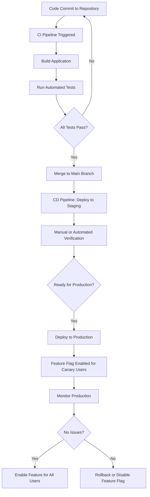

# CI/CD: Continuous Integration and Continuous Delivery/Deployment  
*Comprehensive Technical Documentation*

---

## 1. Main Concepts (Overview Section)

This documentation covers the essential concepts and real-world considerations of **CI/CD**—an automation-driven approach to software development and deployment. You’ll learn:

- **What CI/CD is** and how it streamlines building, testing, and deploying software.
- **The distinction between CI (Continuous Integration) and CD (Continuous Delivery/Deployment)**, including their unique roles, practices, and challenges.
- **Key tools** used throughout the process, ranging from source control to build and deployment automation.
- **Testing strategies** and their impact on productivity and code quality.
- **Deployment strategies** like feature flags and canary releases, particularly for large-scale or stateless systems.
- **Limitations and trade-offs** when applying CI/CD to complex or stateful systems.
- **Best practices, real-world system design patterns, common pitfalls, and anti-patterns** to avoid.
- **Analogies and examples** to intuitively anchor these concepts.

---

## 2. Detailed Conceptual Flow (Core Documentation)

### Introduction: The Essence of CI/CD

Modern software development aspires to deliver high-quality features rapidly and reliably. This is the core promise of **CI/CD**—or **Continuous Integration** and **Continuous Delivery/Deployment**. Instead of waiting for long, manual release cycles, CI/CD automates the journey from a developer’s code commit to running software in production, reducing human error and accelerating the feedback loop.

But while the headline benefits—faster releases and fewer bugs—are attractive, the reality of implementing CI/CD in production systems is nuanced. Understanding how each component fits and the practical challenges involved is key to reaping its rewards.

---

### Continuous Integration (CI): Merging Early, Testing Often

**Continuous Integration (CI)** is the practice of frequently merging all developers’ working copies to a shared central repository, under the watchful eye of automated checks. Whenever a developer pushes new code, an automated workflow is triggered on a **CI server** (like GitHub Actions, Jenkins, or CircleCI). This workflow typically:

1. **Builds the application**: Compiles source code, packages dependencies, and prepares artifacts.
2. **Runs automated tests**: Executes unit, integration, and sometimes end-to-end tests to validate correctness.
3. **Checks quality gates**: May include static analysis, code style checks, or security scans.

If any step fails, the workflow halts, preventing problematic code from reaching the main branch. This “fail fast” approach ensures that errors are caught early, while the context is fresh and fixes are easier.

A robust CI pipeline is only as good as its **automated test suite**. High test coverage—meaning a large portion of the code is exercised by tests—reduces the risk of undetected bugs. However, maintaining effective, non-flaky (reliable) tests with meaningful coverage is a significant, ongoing investment. Extensive tests increase confidence but also lengthen build times, potentially slowing developer feedback. Striking the right balance is crucial: enough coverage to catch real issues, but not so much as to throttle velocity.

#### Tooling Foundations

- **Source Code Management**: Version control systems like GitHub form the backbone, storing not just source code, but also test scripts and build configurations.
- **CI Orchestration**: Tools such as GitHub Actions, BuildKite, Jenkins, CircleCI, and Travis CI manage the automated build and test process.
- **Test Frameworks**: Language-specific tools (e.g., Jest for JavaScript unit tests, Playwright/Cypress for integration testing) automate validation of code behavior.
- **Build Tools**: Platform-dependent (e.g., Gradle for Java, Webpack or newer entrants for JavaScript) these tools compile and bundle code, readying it for deployment.

---

### Continuous Delivery and Deployment (CD): Automating the Path to Production

**Continuous Delivery (CD)** extends CI by automating the packaging and staging of software so that it’s ready for release at any time. **Continuous Deployment** goes a step further: every successful change is automatically pushed to production, without human intervention.

While CI is now ubiquitous and relatively straightforward to implement, true CD—especially **continuous deployment**—is more complex and less commonly achieved in practice. The main challenges stem from the diversity of production environments and the criticality of minimizing risk.

#### Where CD Shines: Stateless Systems

Stateless services—like API and web server tiers—are generally ideal candidates for continuous deployment. Because they do not retain persistent state between requests, they can be rolled back quickly and safely if issues are detected. With robust **production monitoring** in place, teams can confidently deploy changes rapidly, knowing that problems can be identified and remediated swiftly.

#### Risk Mitigation Techniques

To further reduce deployment risk, teams employ strategies such as:

- **Feature Flags**: Code for new features is deployed but kept inactive behind configuration toggles. This allows teams to decouple deployment from feature release, enabling quick rollbacks by simply disabling the flag rather than reverting code.
- **Canary Deployments**: New code is rolled out to a small, controlled group of users (power users or internal staff) before full-scale deployment. This exposes changes to real-world usage while limiting impact in case of defects—a practice especially valuable for products with vast user bases.

#### CD’s Limits: Stateful Systems

For complex, stateful systems—like database clusters or components managing persistent sessions—continuous deployment is rare. These systems pose higher risks: data integrity, schema migrations, and long-lived connections complicate safe, automatic rollouts. As such, deployments here are typically scheduled, manual, and overseen by specialized platform teams.

#### CD Tooling

The same orchestration tools used for CI (e.g., GitHub Actions, BuildKite, Jenkins) often support CD pipelines. For infrastructure-centric deployments, especially in containerized environments, tools like **Argo CD** (for Kubernetes) help manage and automate deployment workflows.

---

## 3. Simple & Analogy-Based Examples

To clarify these concepts, let’s explore a simple example and a broad analogy.

### Example: A Web Application’s Journey

Suppose a developer adds a new login feature to a web application:

1. **Push to GitHub**: The code is committed and pushed to the shared repository.
2. **CI Pipeline**: GitHub Actions triggers an automated workflow:
   - The application is built.
   - Unit and integration tests are run using Jest and Cypress.
   - If all checks pass, the code is merged into the main branch.
3. **CD Pipeline**: The new build is deployed automatically to a staging environment.
   - After further verification, deployment proceeds to production.
   - The login feature is controlled by a feature flag, initially disabled.
   - The team enables the flag for internal staff (canary users) to test in production.
   - Once validated, the flag is enabled for all users.

### Analogy: The Automated Factory Assembly Line

Imagine software delivery as a **factory assembly line**:

- **CI is the quality control** at each station. As each component arrives, it’s automatically checked for defects before moving forward. If a flaw is found, the line stops, and the issue is fixed right away, preventing faulty products from accumulating.
- **CD is the conveyor belt to shipping**. Once an item passes all checks, it’s automatically packaged and sent to the customer, sometimes even as soon as it’s ready. For delicate or high-value items (stateful systems), extra checks or manual sign-offs are required before shipping.

This assembly line ensures consistent, reliable output with minimal manual intervention—mirroring the goals and mechanisms of CI/CD in software.

---

## 4. Use in Real-World System Design

### Patterns and Use Cases

- **Microservices**: CI/CD is highly effective for stateless microservices, enabling small, independent teams to deploy frequently with low coordination overhead.
- **Feature Delivery**: Teams can safely test new features in production using feature flags, reducing the risk and overhead of rollbacks.
- **Large-Scale Web Products**: Canary deployments allow safe, incremental rollouts, essential for systems serving millions of users.

### Design Decisions Influenced by CI/CD

- **Test Coverage vs. Speed**: Deciding how much test coverage is sufficient without bogging down developer productivity.
- **State Management**: Designing systems to be stateless wherever possible to maximize the benefits of automated deployment.
- **Rollback Strategies**: Implementing mechanisms (like feature flags or blue-green deployments) that allow quick reversions in case of failure.

### Trade-offs and Challenges

- **Test Suite Maintenance**: High coverage is valuable but increases build time and maintenance overhead. Flaky tests reduce trust in the pipeline and can block releases.
- **Complex Deployments**: Stateful systems (databases, session stores) often require manual processes and cannot be as easily automated.
- **Tooling Fragmentation**: Particularly in JavaScript ecosystems, the proliferation of build and test tools can complicate configuration and maintenance.

### Best Practices

- **Automate Early, Fail Fast**: Automate as much as possible, but ensure quality gates catch issues before they reach production.
- **Monitor Everything**: Strong production observability is essential for safe, automated deployments.
- **Invest in Test Quality**: Flaky or slow tests undermine the value of CI/CD.

### Anti-Patterns to Avoid

- **Neglecting Test Maintenance**: Outdated or unreliable tests lead to wasted time and brittle deployments.
- **Over-automating State Changes**: Blindly automating complex, stateful changes can result in catastrophic failures.
- **Ignoring Rollback Mechanisms**: Always plan for failure; deployments must be reversible.

---

## 5. Optional: Advanced Insights

### CI/CD vs. Traditional Release Processes

Traditional release cycles rely on long-lived feature branches, manual QA, and infrequent, high-risk deployments. CI/CD inverts this by encouraging continuous, incremental integration and deployment, reducing the size and risk of each change.

### Competing Strategies: Blue-Green Deployments

In addition to canary releases, **blue-green deployments** maintain two production environments (blue and green). Traffic is switched from one to the other after deployment, allowing instant rollback if issues arise.

### Edge Cases

- **Database Schema Migrations**: Safe, automated schema changes require migration frameworks and sometimes dual-schema support for zero-downtime deployments.
- **Stateful Connection Draining**: For WebSocket servers, deployments must gracefully handle long-lived connections to avoid disrupting users.

---

## 6. Analogy Section: CI/CD Concepts Through a Single Analogy

Think of a **restaurant kitchen**:

- **CI** is like the prep station—every ingredient is checked for freshness and prepped before it’s allowed on the cooking line. If something fails (e.g., spoiled vegetables), it’s caught before it ever reaches the pan.
- **CD** is the process of plating and sending dishes to customers. For simple dishes (stateless systems), meals go straight to the table as soon as they’re ready. For complex, special-order dishes (stateful systems), the chef may double-check everything or get approval before serving.
- **Feature Flags** are akin to “secret menu” items: the kitchen can prepare them ahead of time, but only serve them to specific customers when ready.
- **Canary Deployments** are like taste-testing a new recipe with staff before rolling it out to all patrons, minimizing the risk of a bad experience.

---

## 7. Flow Diagram: CI/CD Pipeline Overview

---

## 8. PROs and CONs with Practical Examples

**PROs:**
- **Rapid Feedback:** Developers know quickly if their changes break things (e.g., a typo in a login function triggers a failing test within minutes).
- **Reduced Human Error:** Automated deployments catch issues that might slip through manual processes.
- **Incremental Releases:** Small, frequent updates reduce the risk and complexity of each deployment.

**CONs:**
- **Setup and Maintenance Overhead:** Building and maintaining reliable pipelines and tests is a significant investment.
- **Not One-Size-Fits-All:** Complex stateful systems still require manual steps or careful orchestration.
- **Test Flakiness:** Unstable tests can block progress or erode trust in automation.

*Example*: A team automates deployment for their API service but keeps manual approvals for database migrations, balancing speed and safety.

---

## 9. Conclusion

**CI/CD** empowers teams to deliver better software, faster—when thoughtfully applied. Its value is maximized in stateless, well-tested systems, especially when paired with risk-mitigation techniques like feature flags and canary deployments. However, its adoption must be tailored to system complexity, with careful attention to test quality, rollback strategies, and the inevitable trade-offs between speed and reliability.