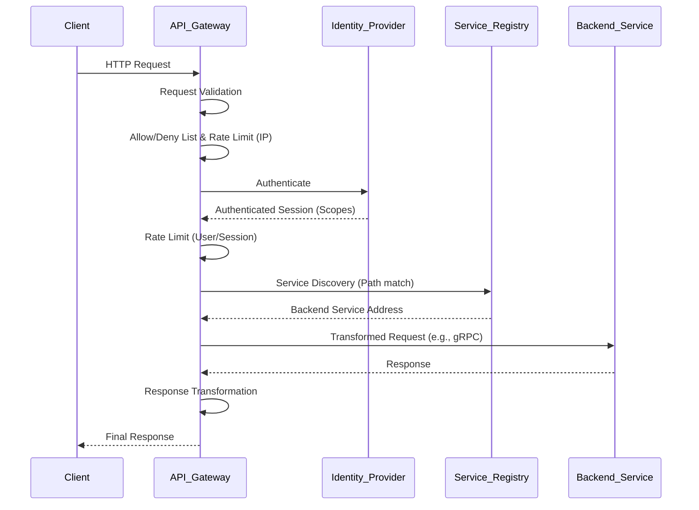

# API Gateway: Comprehensive Technical Documentation

---

## 1. Main Concepts (Overview Section)

This document provides a detailed exploration of the **API Gateway** pattern in modern distributed systems. The following major concepts and subtopics are covered:

- **Definition and Role of an API Gateway**  
  What an API gateway is, its place in architecture, and why it’s needed.

- **Key Functions Provided by API Gateways**  
  Including authentication, security, load balancing, protocol translation, service discovery, monitoring, logging, analytics, billing, and caching.

- **Request Flow Through an API Gateway**  
  Step-by-step progression of a client request from entry to backend and back.

- **Operational and Deployment Considerations**  
  High-availability, global distribution, and resilience.

- **Analogies and Intuitive Examples**  
  Real-world comparisons to solidify understanding.

- **Practical Use in System Design**  
  Application in real-world architectures, best practices, trade-offs, and anti-patterns.

- **Advanced Insights**  
  Deeper technical considerations and edge cases.

---

## 2. Detailed Conceptual Flow (Core Documentation)

### Introduction: The Need for an API Gateway

In large-scale, distributed system architectures—especially those built on microservices—clients often need to interact with many backend services. Direct communication between clients and these services introduces complexity, security risks, and operational challenges. This is where an **API gateway** becomes essential: it acts as a single, unified entry point for all client requests, abstracting away the complexity of the backend and centralizing cross-cutting concerns.

### Core Functions of an API Gateway

At its core, an API gateway sits between external clients and internal services. Its responsibilities are numerous, and understanding these is crucial to appreciating its value.

#### 1. **Authentication and Security Policy Enforcement**

Rather than every backend service handling authentication (verifying identity) and authorization (checking permissions), the API gateway centralizes this logic. When a client request arrives, the gateway validates credentials—often consulting an external identity provider. This ensures only authenticated and authorized users can access sensitive resources.

#### 2. **Load Balancing and Circuit Breaking**

API gateways distribute incoming requests across multiple instances of backend services, balancing the load and improving reliability. Circuit breaking is another resilience pattern: if a backend service is failing or overloaded, the gateway can temporarily "break the circuit"—rejecting or rerouting requests to avoid cascading failures.

#### 3. **Protocol Translation and Service Discovery**

Clients and backend services may use different communication protocols. The gateway translates client-friendly protocols (like HTTP/REST or GraphQL) into backend-optimized ones (like gRPC or Thrift). It also uses service discovery to dynamically locate which service instance should handle each request, based on the request's path or other attributes.

#### 4. **Monitoring, Logging, Analytics, and Billing**

The gateway is an ideal place to aggregate logs, gather metrics, and monitor traffic. It can analyze usage patterns for analytics or billing purposes and provide a single vantage point for operational observability.

#### 5. **Caching**

For performance, the gateway can cache frequent responses—reducing load on backend services and speeding up client interactions.

### Client Request Flow: Step-by-Step

Let’s walk through the typical lifecycle of a client request via the API gateway:

**1. Client Request Initiation**  
The client (web app, mobile app, or third-party system) sends a request—usually HTTP-based (REST, GraphQL, etc.)—to the API gateway.

**2. Request Validation**  
The gateway first checks the incoming request for well-formedness, required fields, and compliance with expected formats.

**3. Security Checks (Allow/Deny Lists, Rate Limiting)**  
It examines attributes like the caller’s IP address and HTTP headers. Based on allow/deny lists, it may block or accept requests. Initial rate limiting is also performed here—preventing abuse by limiting request rates per IP or user.

**4. Authentication and Authorization**  
The gateway consults an identity provider (such as OAuth, SAML, or custom solutions) to authenticate the user. The provider returns an authenticated session, detailing the user’s permissions (scopes).

**5. Post-Authentication Rate Limiting**  
A second, more granular rate-limiting check occurs—this time tied to the authenticated identity, ensuring users cannot exceed their permitted usage.

**6. Service Discovery**  
Using service discovery mechanisms (like service registries), the gateway determines which backend service (and instance) should handle the request. This is often based on URL paths or request attributes.

**7. Protocol and Payload Transformation**  
If necessary, the gateway transforms the request into the protocol understood by the backend (e.g., converting HTTP/REST to gRPC). It then forwards the request.

**8. Response Handling and Transformation**  
When the backend returns a response, the gateway may transform it back (e.g., from gRPC to HTTP/JSON) and forwards it to the client.

**9. Observability and Error Handling**  
Throughout this process, the gateway logs events, tracks errors, and may trigger circuit breakers to protect struggling services.

### High Availability and Global Deployment

Given its central role, the API gateway is a critical single point of failure. To ensure high availability and low latency, gateways are typically deployed across multiple regions—sometimes even globally, using cloud providers’ infrastructure to get as close to clients as possible.

---

## 3. Simple & Analogy-Based Examples

### Simple Example: E-Commerce Platform

Imagine an online store with separate microservices for inventory, payments, and user profiles. A mobile app user wants to buy a product. Instead of the app talking directly to each microservice (which would require detailed knowledge of each one and handling security for each), it sends a single request to the API gateway. The gateway authenticates the user, checks their permissions, determines which service(s) need to be called, forwards requests accordingly (possibly translating protocols), and combines responses as needed.

### Analogy: The Airport Security Checkpoint

Think of the API gateway as the **main security checkpoint at an airport**:

- All passengers (clients) must pass through the checkpoint (gateway) to access the terminals (backend services).
- The checkpoint verifies each passenger’s identity and boarding pass (authentication and authorization).
- It checks for prohibited items and ensures compliance with rules (security policy enforcement).
- If a terminal is crowded or closed (backend service unavailable), the checkpoint reroutes passengers or delays entry (circuit breaking, load balancing).
- It keeps records of who passes through and when (logging, monitoring).
- If many passengers need the same information (e.g., gate locations), the checkpoint can provide it directly without asking the staff repeatedly (caching).

---

## 4. Use in Real-World System Design

### Common Patterns and Use Cases

- **Microservices Architectures**: API gateways are almost mandatory when services are split for scalability and maintainability.
- **Mobile Backend as a Service (MBaaS)**: Mobile apps access all backend functionality through a gateway, simplifying client code.
- **Third-Party Integrations**: When exposing APIs to partners, gateways provide a single, secure point of access.

### Design Decisions

- **Centralizing Cross-Cutting Concerns**: By moving authentication, rate limiting, logging, and monitoring to the gateway, backend services can focus on business logic.
- **Protocol Abstraction**: Gateways allow backend teams to choose the best protocol for their service without exposing clients to complexity.
- **Versioning and Deprecation**: Gateways can route different API versions, making it easier to evolve services.

### Trade-offs and Challenges

- **Single Point of Failure**: If not properly replicated and distributed, the gateway becomes a bottleneck or risk.
- **Latency Overhead**: Every request passes through an extra hop, adding a small delay.
- **Complexity**: Gateways themselves can become complex, especially when overloaded with too many responsibilities.
- **Security Risks**: The gateway is a high-value target; compromise here can expose the entire backend.

#### Practical Example: Netflix API Gateway

Netflix’s API gateway routes billions of requests per day, enforcing security, providing device-specific APIs, and enabling rapid backend evolution. However, they also encountered challenges with gateway complexity and have since moved toward a more decentralized, “BFF” (Backend-for-Frontend) model in some cases.

### Best Practices

- **Deploy for High Availability**: Use active-active deployments across regions.
- **Limit Responsibilities**: Avoid “God Gateway” anti-patterns where all business logic is centralized.
- **Monitor and Alert**: Leverage the gateway’s vantage point for observability but ensure the system scales with traffic.

### Anti-Patterns to Avoid

- **Monolithic Gateway**: Overloading the gateway with all business logic leads to maintainability and scalability issues.
- **Neglecting Backpressure**: Failing to implement circuit breakers and rate limiting can allow backend overload and cascading failures.

---

## 5. Optional: Advanced Insights

### Expert Considerations

- **Decentralized Gateways and BFFs**: In large organizations, it may be beneficial to have specialized gateways for different clients (e.g., web, mobile), each exposing a tailored API.
- **Edge vs. Internal Gateways**: Sometimes an “edge” gateway handles client-facing requests, while internal gateways manage inter-service communication.
- **Service Mesh vs. API Gateway**: Service meshes (like Istio) focus on service-to-service communication, while API gateways focus on client-to-backend mediation. They can complement or overlap depending on the architecture.

### Edge Cases

- **Protocol Transformation Pitfalls**: Converting between protocols (e.g., REST to gRPC) can introduce subtle bugs—such as data loss, mapping errors, or performance issues.
- **Stateful vs. Stateless Gateways**: Most gateways are stateless for scalability, but some scenarios (like session affinity) may require stateful behavior.

---

### Flow Diagram: API Gateway Request Flow

---

## Analogy Section: Key Concepts Mapped

- **API Gateway = Airport Security Checkpoint**: Central point for entry, validation, and routing.
- **Authentication = Passport Control**: Ensures only valid travelers proceed.
- **Rate Limiting = Ticket Scanning**: Only so many people can pass in a given time.
- **Service Discovery = Finding the Right Gate**: Determines where each traveler should go.
- **Protocol Translation = Language Interpreter**: Makes sure everyone is understood regardless of language.
- **Circuit Breaking = Closing a Terminal**: Temporarily shuts down access if there’s a problem.
- **Caching = Information Desk**: Answers common questions without needing to consult each department.
- **Monitoring/Logging = CCTV Cameras/Logs**: Keeps records for safety and improvement.

---

## Conclusion

An **API gateway** is not just a routing or proxy component—it is the linchpin of modern, scalable, and secure distributed architectures. By centralizing cross-cutting concerns, abstracting backend complexities, and offering resilience, it empowers teams to build robust, evolvable systems. However, thoughtful design and operational discipline are essential to harness its benefits without introducing new bottlenecks or risks.

---