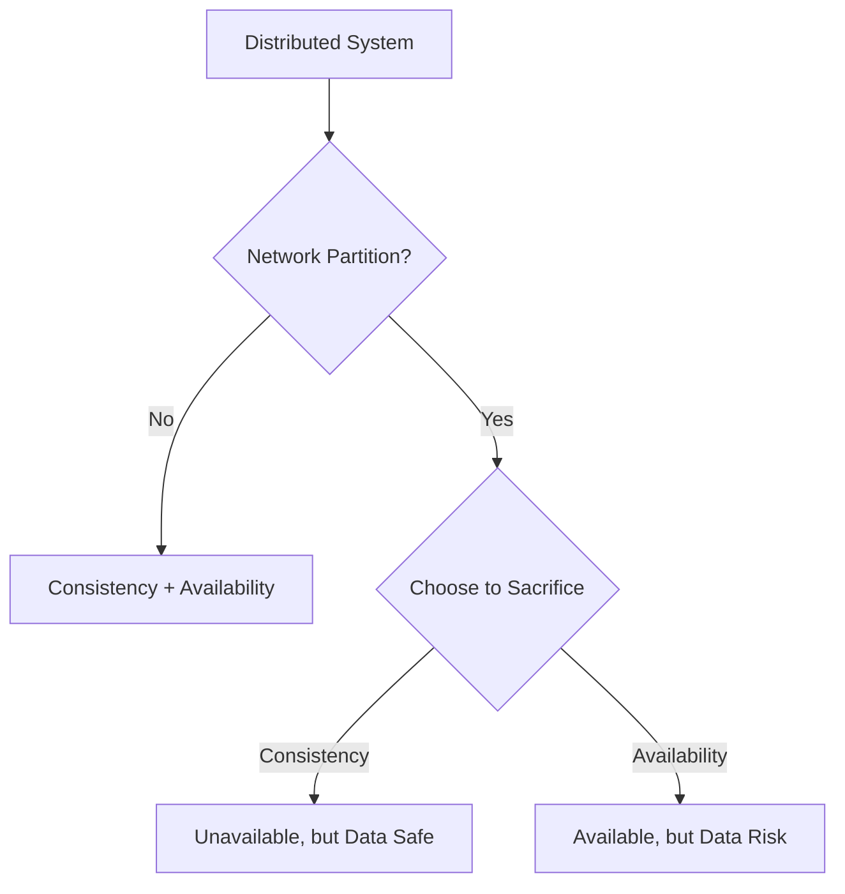

# CAP Theorem in Distributed Systems: A Comprehensive Overview

## 1. Main Concepts (Overview Section)

In this documentation, you will learn:

- **Introduction to the CAP Theorem:** Understanding its core principles and why it matters in distributed system design.
- **Defining the Three Pillars:** Consistency, Availability, and Partition Tolerance, including how they interact.
- **Network Partitions:** What they are, why they occur, and their impact on distributed systems.
- **Trade-offs in System Design:** How systems must choose between consistency and availability during partitions.
- **Illustrative Examples:** Practical scenarios—from banking to social media—that demonstrate CAP in action.
- **Real-world Design Patterns and Challenges:** How CAP influences architectural decisions, the limitations of the theorem, and nuanced, hybrid solutions.
- **Analogy-based Understanding:** Intuitive analogies to anchor comprehension of each concept.
- **Advanced Insights:** Nuances, anti-patterns, and directions for further study.

---

## 2. Detailed Conceptual Flow (Core Documentation)

### Introduction: The Essence of CAP Theorem

Distributed systems, by their very nature, are composed of multiple nodes (computers or processes) working together over a network. While this architecture brings scalability and resilience, it also introduces complex challenges, especially when things go wrong. The **CAP theorem**—a foundational concept in distributed computing—articulates the inherent trade-offs every designer faces in this context.

Simply put, the CAP theorem states that in the presence of a **network partition** (a communication breakdown between nodes), a distributed system can provide only two out of three guarantees: **Consistency**, **Availability**, and **Partition Tolerance**. The theorem is a lens through which system designers evaluate and prioritize system behavior during failures.

---

### Exploring the Three Pillars

#### Consistency

**Consistency** ensures that every read from the system reflects the most recent write, no matter which node a client connects to. In a consistent system, all users see the same data at the same time. Imagine checking your bank balance on two different ATMs: consistency means both display the exact same number, always.

#### Availability

**Availability** is the guarantee that every request to the system receives a (non-error) response, regardless of the state of any individual node. Even if some nodes cannot communicate, the system strives to process all incoming requests. Returning to the ATM example, availability means you can always withdraw or deposit money, as long as you reach an ATM.

#### Partition Tolerance

**Partition Tolerance** is the system’s ability to continue operating despite arbitrary network failures that prevent some nodes from communicating. In a partitioned network, messages between parts of the system might be delayed or dropped, but the system must still function as best it can. Think of a bank’s network being split by a cable cut: partition tolerance is the bank’s ability to keep serving customers on both sides of the split.

---

### Network Partitions: The Inevitable Challenge

A **network partition** arises when the communication between nodes breaks down—due to hardware failure, misconfiguration, or network congestion. When this happens, nodes on one side of the partition can’t reach those on the other. The CAP theorem becomes most relevant in this scenario, because, during partitions, you must choose between:

- **Consistency:** All nodes agree on the same data, even if that means some cannot respond to requests.
- **Availability:** All nodes keep serving requests, even if this risks inconsistent data.

---

### The Trade-off: Consistency vs. Availability Under Partition

Let’s ground this in a concrete example:

#### Banking Scenario

Imagine a small bank with two ATMs. There’s no central database; instead, both ATMs store the account balance and synchronize updates over the network.

- **Normal Operation:** Both ATMs communicate seamlessly. When a customer deposits or withdraws money, both ATMs update their records and always show the same balance.

- **Partition Occurs:** Suddenly, a network problem arises; the ATMs can’t talk to each other.

  - **If the bank chooses Consistency:** Both ATMs refuse to process deposits or withdrawals until they can synchronize again. This prevents the account from going below zero but makes ATMs temporarily unavailable—customers are frustrated.

  - **If the bank chooses Availability:** Each ATM allows deposits and withdrawals independently. Now, both ATMs could let the same customer withdraw the full balance, resulting in a negative balance when the network is restored—data inconsistency.

This is the essence of the CAP theorem: **during a partition, you must pick one—consistency or availability—to sacrifice**.

#### Social Media Scenario

Consider a social platform where multiple users comment on a post.

- **During a partition:** Two users in different network segments comment at the same time.
  - **Prioritize Availability:** Both comments are accepted, but users may temporarily see different versions of the comment thread.
  - **Prioritize Consistency:** Commenting may be disabled until the network is restored.

For many social apps, temporary inconsistencies are acceptable; users would rather keep interacting than wait for perfect consistency.

---

### Hybrid and Nuanced Strategies

Real-world systems rarely take an all-or-nothing approach. For example, our bank might:

- Allow balance inquiries during a partition but block withdrawals or deposits.
- Permit small withdrawals but block large transactions until synchronization is restored.

The **complexity of reconciliation** after a partition varies. Simple data structures, like a single bank balance, are easier to reconcile than collaborative documents (e.g., Google Docs) where simultaneous edits can create complex, conflicting histories.

---

## 3. Simple & Analogy-Based Examples

**Analogy: The Split Library**

Imagine a library with two branches sharing a single list of books. If the connecting road is closed (network partition), each branch must choose:

- Only loan books if both branches can update the list (consistency), meaning sometimes you have to refuse a patron.
- Keep loaning books independently (availability), risking both branches lending out the same book, leading to confusion when the road reopens.

**Simple Example:**

- **Consistency-first:** ATMs lock operations during network issues; nobody can withdraw or deposit money, but the balance never goes negative.
- **Availability-first:** ATMs keep operating; customers can transact, but the risk is two people withdrawing the same money, causing an overdraft.

---

## 4. Use in Real-World System Design

### Design Decisions Influenced by CAP

- **Banking, Finance, and E-commerce:** These systems often prioritize consistency. Data errors can have severe consequences (e.g., overdrafts, double-spending).
- **Social Networks, Messaging, and Collaboration Tools:** These systems often prioritize availability. Users expect to keep interacting, even if data is briefly inconsistent.
- **Hybrid Approaches:** Many systems use a combination: e.g., "eventual consistency" models, read-only or limited-write modes during partitions, or differentiated handling based on operation criticality.

### Common Patterns and Use Cases

- **Eventual Consistency:** Data might be temporarily inconsistent, but will reconcile when the partition heals (e.g., DNS, some NoSQL databases).
- **Strong Consistency:** Operations block or fail if consistency cannot be guaranteed (e.g., traditional RDBMS clusters).
- **Partition-Tolerant and Available (AP):** Systems like DynamoDB, Cassandra.
- **Partition-Tolerant and Consistent (CP):** Systems like HBase, ZooKeeper.

### Trade-offs and Challenges

- **Consistency vs. User Experience:** Strict consistency may block users, hurting engagement. Availability may lead to temporary confusion or errors.
- **Reconciliation Complexity:** Merging divergent data after a partition can be straightforward (sums, counters) or extremely hard (document edits, financial ledgers).
- **Real-world Imperfection:** The strictness of CAP (absolute availability, absolute consistency) is rare in practice. Systems often operate in shades of gray.

#### Best Practices

- **Understand Business Requirements:** What’s more important—never losing a transaction, or always being responsive?
- **Design for Reconciliation:** Make it easy to merge divergent histories, or minimize the chance of conflicts.
- **Communicate Guarantees Clearly:** Users and developers must know what to expect during failures.
- **Avoid Hidden Assumptions:** Don’t assume network failures are rare—design for them.

#### Anti-patterns to Avoid

- **Ignoring Partitions:** Assuming network failures "won’t happen" leads to catastrophic data loss.
- **Over-engineering Consistency:** Sacrificing availability excessively when your application doesn’t require strict consistency.
- **Poor Reconciliation Mechanisms:** Failing to design for conflict resolution leads to data corruption.

---

## 5. Advanced Insights

### The Nuances of Consistency and Availability

CAP theorem’s all-or-nothing framing is an oversimplification. In reality:
- **Consistency and availability exist on a spectrum.** Systems may offer "read-your-writes," "monotonic reads," or "eventual consistency," each with trade-offs.
- **Latency and Consistency:** Even outside partitions, increasing consistency often increases latency—a topic explored in the PACELC theorem.

### Comparing Similar Concepts

- **BASE vs. ACID:** BASE (Basically Available, Soft state, Eventual consistency) is a common approach in AP systems, contrasting with ACID (Atomicity, Consistency, Isolation, Durability) in CP systems.

### Edge Cases

- **Short-lived partitions** may be masked with retries or queues.
- **Long-lived partitions** require user-visible decisions—either degraded functionality or risk of inconsistency.

---

## Flow Diagram: CAP Trade-off in Distributed Systems

---

## Conclusion

The **CAP theorem** is a vital mental model for understanding the limitations and trade-offs in distributed system design. It reminds us that, during network partitions, we must choose between data consistency and system availability. Real-world systems blend these choices, seeking optimal trade-offs for their domain. While CAP is a starting point, practical system design demands a deeper, nuanced understanding of consistency models, reconciliation strategies, and user expectations. Always design with failure in mind—and make your trade-offs explicit.