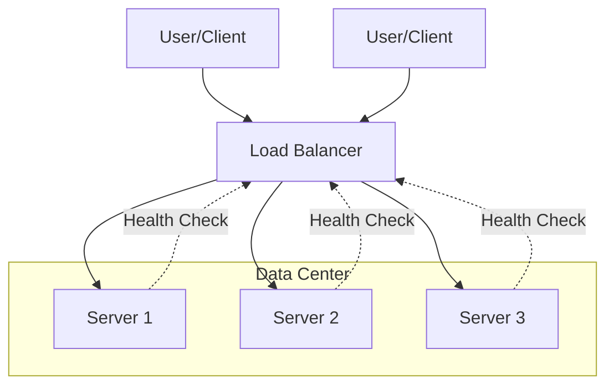

# Technical Documentation: Understanding Load Balancers

---

## 1. Main Concepts (Overview Section)

This documentation provides a comprehensive walkthrough of load balancers—crucial infrastructure components that ensure scalable, reliable, and performant applications. The following key ideas will be covered:

- **Fundamental Role of Load Balancers:** What a load balancer does and why it's essential.
- **Benefits and Core Functions:** Scalability, fault tolerance, performance, and availability.
- **Types of Load Balancers:** Hardware, software, cloud-based, and global server load balancers.
- **Network Layer Classification:** Layer 4 vs. Layer 7 load balancing, their mechanisms, and use cases.
- **Traffic Distribution Algorithms:** Round robin, sticky sessions, weighted approaches, hashing, least connections, and least time.
- **Metrics and Monitoring:** Key indicators for health, performance, and troubleshooting.
- **Analogy Section:** Everyday metaphors to solidify understanding of complex concepts.
- **Real-World Applications:** Common system design patterns, best practices, trade-offs, and anti-patterns.
- **Advanced Insights (Optional):** Nuanced comparisons, edge cases, and expert considerations.

---

## 2. Detailed Conceptual Flow (Core Documentation)

### The Essential Purpose of Load Balancers

At the heart of any scalable, reliable web application or distributed system lies a load balancer. Think of it as a skilled traffic director, standing at the entrance to your system, efficiently determining which server should handle each incoming request from users or clients. By distributing traffic across multiple backend servers, the load balancer prevents any single server from becoming overloaded, which could degrade performance or cause outages.

But the role of a load balancer extends far beyond simple traffic distribution. It enables horizontal scalability—allowing you to seamlessly add or remove servers as demand fluctuates—while also enhancing fault tolerance. If one server fails, the load balancer can reroute traffic to healthy servers, ensuring continuous service availability. This mechanism is foundational for delivering consistent performance and reliability, regardless of traffic spikes or infrastructure issues.

### Types of Load Balancers

Load balancers are implemented in various forms, each suited to different operational needs and environments:

- **Hardware Load Balancers:** Purpose-built physical appliances, often found in large enterprise data centers. These devices offer high performance, stability, and specialized networking features, but at a significant cost and with less flexibility. They are ideal for environments with stringent performance and reliability requirements.

- **Software Load Balancers:** Applications that run on general-purpose servers or virtual machines. Software load balancers are more affordable and adaptable, allowing organizations to deploy them in diverse scenarios—from small-scale web apps to cloud-native architectures.

- **Cloud-based Load Balancers:** Managed services provided by cloud vendors (e.g., AWS Elastic Load Balancer, Google Cloud Load Balancer). These remove the operational burden of setup, maintenance, and scaling, letting teams focus on the application itself while benefiting from the infrastructure expertise of the provider.

- **Global Server Load Balancers (GSLB):** These operate at an even higher level, orchestrating traffic across geographically distributed data centers. GSLB solutions ensure users are routed to the closest or healthiest region, reducing latency and offering cross-region failover to optimize global availability.

### Network Layer Classification: L4 vs. L7 Load Balancing

Load balancers are also categorized by the OSI network layer at which they operate, influencing their capabilities and ideal use cases:

#### Layer 4 Load Balancers (Transport Layer)

Operating at the transport layer, Layer 4 (L4) load balancers use information such as IP addresses and TCP/UDP ports to direct traffic. They do not inspect the contents (payload) of the packets, which makes them extremely fast and efficient. L4 load balancing is best suited for scenarios where simple distribution and high throughput are paramount, such as routing raw TCP or UDP traffic.

#### Layer 7 Load Balancers (Application Layer)

Layer 7 (L7) load balancers work at the application layer, typically handling HTTP and HTTPS protocols. They analyze the actual content of each request—including HTTP headers, URLs, cookies, or other data—allowing for sophisticated routing decisions. For example, they might direct users to different backend pools based on the requested path or user session.

L7 load balancers often handle SSL/TLS termination, decrypting incoming traffic before forwarding it to backend servers. This centralizes security management and reduces the computational burden on individual servers.

### Global Server Load Balancers (GSLB): Worldwide Traffic Distribution

In globally distributed systems, GSLBs play a key role by routing users to the nearest or most responsive data center. Utilizing techniques such as DNS-based routing and Anycast networking, GSLBs consider user proximity, server health, and regional capacity to optimize both performance and resilience across continents.

### Traffic Distribution Algorithms

The efficiency and fairness of load distribution depend on the algorithm chosen:

- **Round Robin:** The most straightforward method, where requests are assigned to each server in sequential order, looping back to the start after reaching the end.

- **Sticky Sessions (Session Affinity):** Ensures that all requests from a particular client are directed to the same server, often via cookies or tracking the client's IP. This is vital for applications maintaining server-side session data, though it can introduce scaling and state management challenges.

- **Weighted Round Robin:** Assigns weights to each server based on their capacity. More powerful servers handle a larger share of requests, optimizing resource utilization.

- **IP/URL Hashing:** Uses a hash function on the client’s IP address or requested URL to consistently route requests to the same server. This stateless approach is particularly effective when caching content, as it ensures cache hits for repeated requests.

- **Least Connections:** Sends new requests to the server currently handling the fewest active connections, balancing load dynamically in real time.

- **Least Time:** Routes requests to the server with the lowest response time or quickest processing, further enhancing user experience during variable load conditions.

### Monitoring and Metrics

Operational excellence with load balancers depends on vigilant monitoring. Key metrics include:

- **Traffic Metrics:** Request rates and connection counts, providing a pulse of system demand.
- **Performance Metrics:** Response times, latency, and throughput, indicating user experience quality.
- **Health Metrics:** Results from periodic health checks (e.g., HTTP checks, TCP pings) on backend servers, highlighting failures or degradation before they impact users.
- **Error Metrics:** HTTP error rates, dropped connections, and other anomalies that can reveal issues in the application or infrastructure.

Together, these metrics enable proactive management, troubleshooting, and capacity planning.

---

## 3. Simple & Analogy-Based Examples

### Everyday Analogy: The Airport Check-In Desk

Imagine an airport with multiple check-in desks (servers) and a single supervisor (load balancer) directing passengers (requests) to desks. The supervisor ensures that each desk has a manageable queue and none is overwhelmed. When one desk is busy or closed (server down), the supervisor reroutes passengers to available desks, keeping the process smooth and efficient. Some passengers (sticky sessions) may be directed to the same desk if they have special requirements (session data), while others are sent to the least busy desk (least connections) or the one that processes passengers quickest (least time).

### Simple Example: Scaling a Web Application

Consider a popular online store. During a holiday sale, user traffic surges. A load balancer sits in front of several web servers. As users browse and place orders, the load balancer distributes requests so no single server becomes a bottleneck. If one server crashes, the load balancer detects this through health checks and stops routing traffic to it, ensuring uninterrupted shopping for users.

---

## 4. Use in Real-World System Design

### Common Patterns and Use Cases

- **Horizontal Scaling:** Load balancers allow systems to scale out by adding more servers, rather than scaling up (increasing the power of a single server).
- **High Availability:** By detecting failed servers and rerouting traffic, load balancers support continuous uptime.
- **Microservices and API Gateways:** L7 load balancers route requests to different services based on URLs or headers, enabling modular architectures.
- **SSL Offloading:** Centralizing SSL termination at the load balancer simplifies certificate management and enhances backend performance.

### Design Decisions and Trade-Offs

- **Layer Selection:** L4 offers speed and efficiency but limited routing logic. L7 provides advanced features at the cost of higher resource consumption.
- **Sticky Sessions vs. Statelessness:** Sticky sessions simplify some application logic but complicate scaling and failover. Stateless architectures, though more complex to build, are easier to scale horizontally.
- **Global vs. Local Load Balancing:** GSLBs are essential for global applications but add complexity in handling data replication and consistency across regions.
- **Algorithm Choice:** Round robin is simple but may not account for server differences. Weighted and least connections approaches optimize resource use but require accurate, up-to-date metrics.

### Best Practices

- Regularly monitor and tune health checks to detect failures rapidly without causing false positives.
- Prefer stateless application designs when possible to simplify scaling and failover.
- In cloud environments, leverage managed load balancer services to reduce operational overhead.
- Always plan for SSL/TLS certificate management, especially in L7 scenarios.

### Anti-Patterns to Avoid

- Relying on sticky sessions in auto-scaling environments, leading to uneven load and stateful bottlenecks.
- Deploying hardware load balancers for small-scale or cloud-native applications, incurring unnecessary cost and complexity.
- Neglecting to monitor and act on critical health and error metrics, risking undetected outages.

---

## 5. Optional: Advanced Insights

### Expert Considerations

- **Comparing L4 and L7 Load Balancers:** While L4 is protocol-agnostic and efficient, L7 enables deep inspection and advanced routing but requires more processing power and can become a bottleneck under heavy load.
- **Edge Cases:** In global architectures, DNS-based GSLBs can be impacted by DNS caching, causing users to be routed to unavailable regions. Anycast can mitigate this but requires BGP expertise.
- **SSL/TLS Management:** Centralized SSL termination can create a single point of failure if not properly designed, necessitating rigorous high availability planning at the load balancer layer.

---

## Flow Diagram: Load Balancer in Action

---

## Analogy Section: Mapping Load Balancer Concepts

- **Load Balancer:** Like a restaurant host seating guests at the right tables.
- **L4 vs. L7:** L4 is like sorting mail by zip code; L7 is like reading the letter and delivering it based on its content.
- **Sticky Sessions:** Comparable to assigning a regular customer to their favorite table every time.
- **Weighted Distribution:** Like giving more guests to a larger table that can handle more people.
- **Health Checks:** Like the host checking which tables are clean and ready before seating guests.
- **GSLB:** Like a travel agent booking you a flight to the nearest available holiday resort based on your location.

---

## Conclusion

A load balancer is far more than a traffic router—it is the backbone of modern, scalable, and resilient system architectures. Careful selection and configuration of load balancing strategies, informed by application needs and operational realities, empower organizations to deliver high-performance, always-available services to users worldwide. By understanding the nuances of types, layers, algorithms, and operational metrics, engineers can design systems that stand the test of scale, failure, and growth.