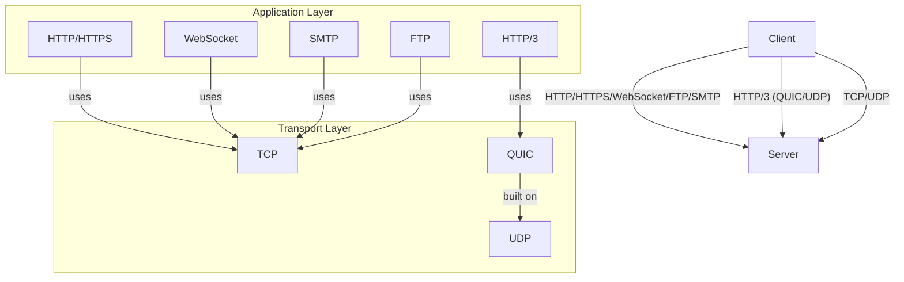

---

# Most Popular Network Protocols: Comprehensive Technical Overview

---

## 1. Main Concepts (Overview Section)

This documentation will guide you through the foundational network protocols that power the modern Internet, explaining their core mechanisms and significance. You will learn about:

- **HTTP**: The basic protocol for web communication.
- **HTTPS & TLS**: Secure communication on the web.
- **HTTP/3 & QUIC**: Next-generation web protocol for speed and reliability.
- **WebSocket**: Real-time, bidirectional communication for interactive applications.
- **Transport Foundation – TCP & UDP**: The essential transmission protocols underlying most network traffic.
- **SMTP & FTP**: Protocols for email transfer and file movement.
- **Comparative Analysis & Real-World Design**: Trade-offs, use cases, patterns, and best practices.
- **Unified Analogy**: A cohesive analogy that ties all protocols together for intuitive understanding.

---

## 2. Detailed Conceptual Flow (Core Documentation)

### The Backbone: HTTP

At the heart of web communication is **HTTP (HyperText Transfer Protocol)**. Every time you load a website, your browser (the client) sends an HTTP request to a server—asking for resources such as web pages, images, or data from an API. The server responds with both the requested content (the response body) and a status code. These status codes—like `200 OK` (success), `404 Not Found` (resource missing), or `500 Internal Server Error` (server malfunction)—indicate the outcome of the request.

HTTP defines several **methods** that instruct the server on the desired action:
- **GET** retrieves data.
- **POST** submits new data (like forms).
- **PUT** updates existing data.
- **DELETE** removes resources.

This request-response model forms the basis for web applications, APIs, and nearly all client-server interactions online.

### Securing Communication: HTTPS and TLS

As the Internet grew, so did the need for **secure communication**. Enter **HTTPS (HyperText Transfer Protocol Secure)**, which wraps HTTP traffic within **Transport Layer Security (TLS)**. 

TLS works much like two people agreeing on a secret code before conversing in public; it establishes an encrypted channel so that even if someone intercepts the data, it's unreadable. Beyond just scrambling data (encryption), TLS also authenticates the server, thwarting attackers from impersonating legitimate services—a defense against "man-in-the-middle" attacks.

This security underpinning is critical for sensitive exchanges—think online banking, shopping, or any site handling personal data. A correctly configured HTTPS setup is now standard practice and is considered essential for trust and data protection.

### The Next Leap: HTTP/3 and QUIC

While HTTP and HTTPS served well, their reliance on the underlying **TCP (Transmission Control Protocol)** introduced some performance bottlenecks, especially for mobile and real-time applications. 

**HTTP/3** addresses these issues by leveraging **QUIC**, a modern transport protocol that runs atop **UDP (User Datagram Protocol)** instead of TCP. Unlike TCP, which requires a series of handshakes and can cause delays if packets are lost (a phenomenon called "head-of-line blocking"), QUIC allows multiple data streams simultaneously without such blocking. If one stream encounters a lost packet, others proceed unhindered.

QUIC further speeds up connections by combining cryptographic setup and transport negotiation into a single handshake. For clients reconnecting to known servers, QUIC enables "zero round-trip time" resumption, making repeated connections feel instantaneous. Importantly, QUIC encrypts not only user data, but all transport metadata—making eavesdropping even harder.

### Real-Time Magic: WebSocket

Traditional HTTP, even with its advances, is fundamentally unidirectional and request-driven: clients ask, servers answer. However, modern applications—from chat apps to collaborative documents—demand instant, bidirectional updates.

**WebSocket** fills this gap by establishing a persistent, two-way channel over a single TCP connection. After a brief "handshake" phase (which cleverly reuses the HTTP infrastructure), WebSocket allows both client and server to send messages at any time, with minimal overhead. This makes it ideal for real-time applications: chat, gaming, financial dashboards, and more. WebSocket connections can also be encrypted using TLS, ensuring privacy and security.

### The Transport Pillars: TCP and UDP

All the above protocols rely on the **transport layer**, which defines how data packets move between devices.

- **TCP** is the workhorse for web traffic. It prioritizes reliability—ensuring that data arrives intact and in order. It achieves this with error-checking, retransmissions for lost packets, and congestion control to adapt to network conditions. This reliability comes at the cost of speed, due to additional overhead and connection setup.
  
- **UDP** is TCP’s lighter, faster sibling. It sends packets with minimal ceremony—there’s no guarantee of delivery or order, but it’s much quicker and has less overhead. Applications like online gaming, voice calls, IoT devices, and live video prefer UDP, accepting a bit of data loss in exchange for low latency. However, to ensure data integrity, protocols like QUIC add their own checks atop UDP.

### Essential Application Protocols: SMTP and FTP

Beyond web and real-time data, the Internet relies on specialized protocols for email and file transfers.

- **SMTP (Simple Mail Transfer Protocol)** is the standard for sending email between servers. Proper SMTP configuration is crucial for reliable mail delivery and avoiding spam blacklists.
- **FTP (File Transfer Protocol)** enables efficient uploading and downloading of files between hosts. Despite the rise of modern alternatives, FTP remains vital in industries like finance, where batch file workflows are common.

---

## 3. Simple & Analogy-Based Examples

**Unified Analogy: The Internet as a Delivery City**

Imagine a sprawling city where countless packages (data) are sent and received every second:

- **HTTP** is like a courier company handling specific delivery requests (“Please fetch my package from address X and bring it to me”).
- **HTTPS** is the same courier, but now every package is locked in a tamper-proof, coded box (encryption), and the courier verifies their identity before delivery (authentication).
- **HTTP/3 with QUIC** is an upgraded courier service that uses motorcycles (UDP) instead of cars (TCP)—they can weave through traffic swiftly, deliver multiple packages in parallel, and if one hits a detour, the rest keep moving.
- **WebSocket** is like a private, dedicated phone line between you and the package sender—you can both talk freely and instantly, rather than waiting for the courier to come back and forth.
- **TCP** is the city’s regulated, reliable highway: every vehicle follows strict rules, deliveries are tracked, and lost packages are resent.
- **UDP** is the network of side streets: fast and direct, but sometimes a package might get lost or misrouted.
- **SMTP** is the city’s postal service for letters (emails), ensuring messages hop between sorting centers before reaching your mailbox.
- **FTP** is the moving company: when you need to transfer boxes of files between buildings, you call them.

---

## 4. Use in Real-World System Design

### Patterns and Use Cases

- **Web Applications**: Rely on HTTP/HTTPS for fetching resources and APIs. Choosing HTTPS is essential for any application handling user data.
- **Real-Time Apps**: Use WebSocket for chat, online gaming, collaborative editing, or live dashboards. WebSockets offer instant, two-way updates.
- **High-Performance/Low-Latency**: Leverage HTTP/3+QUIC or custom UDP-based protocols for streaming, video conferencing, or scenarios where speed and resilience to packet loss matter.
- **Email Infrastructure**: SMTP is the foundation for systems sending or relaying email (transactional notifications, newsletters).
- **File Workflows**: FTP still underpins many batch-oriented data transfers in finance, healthcare, and enterprise integrations.

### Design Decisions and Trade-Offs

#### HTTP vs. HTTPS
- **PRO**: HTTPS secures data, protects against eavesdropping and tampering.
- **CON**: Slight computational overhead for encryption; requires certificate management.
- **Best Practice**: Always use HTTPS for production traffic, even for public websites (SEO and browser trust depend on it).

#### TCP vs. UDP
- **TCP PRO**: Guarantees delivery and order—critical for most business and transactional applications.
- **TCP CON**: Slower due to connection setup and congestion control.
- **UDP PRO**: Minimal delay; ideal for time-sensitive data (games, voice, video).
- **UDP CON**: No guarantee of delivery; needs custom integrity/error handling.
- **Best Practice**: Use TCP unless application requires ultra-low latency and can tolerate some loss.

#### HTTP/3 (QUIC)
- **PRO**: Faster connections, less impact from packet loss, seamless network switching (e.g., mobile devices moving between Wi-Fi and cellular).
- **CON**: Not universally supported; troubleshooting can be more complex.
- **Best Practice**: Enable HTTP/3 if your server and client stack supports it, especially for global, mobile-facing services.

#### WebSocket
- **PRO**: Real-time, low-overhead, persistent connections.
- **CON**: Requires careful scaling and connection management; not cacheable like HTTP.
- **Best Practice**: Use for genuinely interactive features; avoid for simple, one-way updates.

#### SMTP & FTP
- **SMTP PRO**: Ubiquitous, reliable for email delivery.
- **SMTP CON**: Spam prevention and deliverability challenges; needs careful configuration.
- **FTP PRO**: Efficient for bulk file movement.
- **FTP CON**: Lacks built-in encryption (use FTPS/SFTP for security); can be hard to audit.
- **Best Practice**: Always secure FTP with encryption; monitor SMTP reputation and use authentication.

### Anti-Patterns

- **Serving production traffic over plain HTTP**: Exposes users to interception and attacks.
- **Using WebSocket for all communication**: Increases complexity and resource usage; better reserved for real-time needs.
- **Neglecting UDP error handling**: Leads to silent data loss.
- **Relying on unencrypted FTP/SMTP**: Risks data breaches.

---

## 5. Optional: Advanced Insights

### Protocol Comparison Table

| Protocol   | Layer          | Reliable | Ordered | Encrypted | Bidirectional | Use Case Example           |
|------------|---------------|----------|---------|-----------|---------------|----------------------------|
| HTTP       | Application   | Yes (via TCP) | Yes     | No (unless HTTPS) | No            | Web browsing, APIs         |
| HTTPS      | Application   | Yes      | Yes     | Yes       | No            | Secure web, banking        |
| HTTP/3     | Application   | Yes (via QUIC) | Yes     | Yes       | No            | Fast web, mobile apps      |
| WebSocket  | Application   | Yes      | Yes     | Optional  | Yes           | Chat, games, live updates  |
| TCP        | Transport     | Yes      | Yes     | No        | Yes           | Most web traffic           |
| UDP        | Transport     | No       | No      | No        | Yes           | Voice, video, gaming       |
| SMTP       | Application   | Yes      | Yes     | No (unless SMTPS) | No | Email transmission          |
| FTP        | Application   | Yes      | Yes     | No (unless FTPS/SFTP) | No | File transfer              |

### Edge Cases and Considerations

- **QUIC (HTTP/3) and NAT traversal:** QUIC improves performance but can be blocked by strict firewalls or NAT devices that are UDP-unfriendly.
- **WebSocket scaling:** Large-scale deployments require load balancers that support sticky sessions or connection multiplexing.
- **SMTP spam filtering:** Misconfigured SMTP can cause legitimate emails to be caught in spam traps or blacklists.

---

## Network Protocols: Conceptual Flow Diagram

---

## Conclusion

Understanding these protocols—and their respective strengths, weaknesses, and ideal use cases—empowers engineers to architect systems that are not only performant but also secure and reliable. Whether building a real-time chat, a high-traffic API, or a global e-commerce site, selecting and configuring the right network protocol is foundational to robust system design.

---
