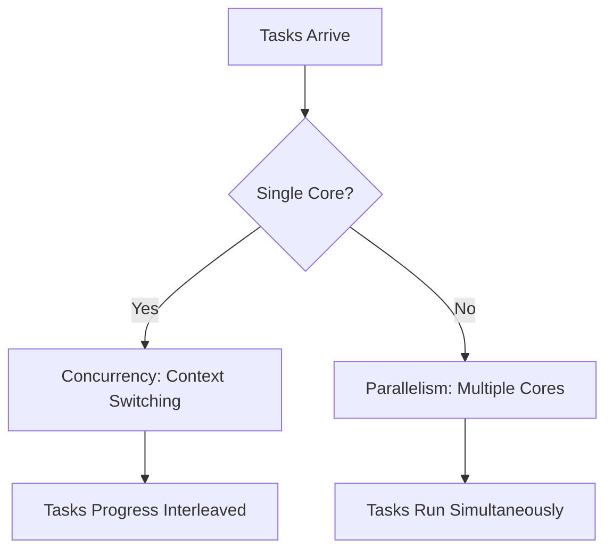

# Concurrency vs. Parallelism: A Comprehensive Guide

---

## 1. Main Concepts (Overview Section)

In this documentation, we’ll demystify the critical concepts of **concurrency** and **parallelism** in system design. You will learn:

- **What concurrency and parallelism are** and how they differ.
- **How each concept works** at the hardware and software levels.
- **Real-world analogies and examples** to cement understanding.
- **Practical applications** in web servers, machine learning, video rendering, and big data.
- **How concurrency enables parallelism** and their interplay in efficient system design.
- **Best practices and common pitfalls** when applying these concepts.
- **Advanced insights** into trade-offs, overhead, and design considerations.

---

## 2. Detailed Conceptual Flow (Core Documentation)

### Introduction: The Need for Efficient Task Management

Modern applications are expected to be fast and responsive, handling multiple activities—such as user interactions, file operations, and network communications—often all at once. Achieving this efficiency relies on understanding two foundational concepts: **concurrency** and **parallelism**.

---

### Concurrency: Managing Multiple Tasks

**Concurrency** refers to a system’s ability to deal with multiple tasks at the same time, even if only one is actually being processed in any given instant. It is primarily about **task management**, not simultaneous execution.

#### How Concurrency Works

Imagine a single chef in a kitchen preparing several dishes. The chef chops vegetables for one dish, stirs a pot for another, and flips a pancake for a third, switching rapidly between them. Although only one action happens at a time, all dishes slowly progress toward completion.

This is exactly how a CPU handles concurrent tasks: it **rapidly switches** between different operations, a process known as **context switching**. The operating system saves the current task’s state, loads the next one, and so on, creating the **illusion** of simultaneous progress.

#### Context Switching and Overhead

With each switch, the CPU must **save and restore** task-specific information. While this enables responsiveness, frequent switching introduces overhead—time during which no actual work is done. If there are too many tasks or switches, performance can degrade.

---

### Parallelism: Simultaneous Execution

**Parallelism** is about **doing many things at once**—executing multiple tasks **simultaneously** on different processing units (e.g., CPU cores).

#### How Parallelism Works

Returning to our kitchen analogy, now imagine two chefs. One chops vegetables while the other cooks meat. Both activities proceed at the same time, so the meal is prepared faster.

In computing, parallelism divides work among multiple CPU cores, each handling a separate task or a portion of a larger task, reducing overall completion time.

---

### Comparing Concurrency and Parallelism

- **Concurrency**: Multiple tasks are **in progress**, but not necessarily at the same moment. It’s about structure and coordination.
- **Parallelism**: Multiple tasks are **executing at the same time**. It’s about actual simultaneous computation.

While concurrency is possible on a single core (via context switching), parallelism requires multiple cores or processors.

---

### When to Use Each: IO-Bound vs. CPU-Bound Tasks

#### Concurrency for IO-Bound Operations

Tasks that involve **waiting**, such as disk or network operations, benefit from concurrency. For instance, a web server handling multiple client requests can continue processing other requests while waiting for a database query to return, keeping the system responsive.

#### Parallelism for CPU-Bound Operations

Tasks that require heavy computation—such as video rendering or data analysis—are **CPU-bound**. Dividing these tasks into independent subtasks and running them on separate cores (parallelism) leads to significant performance gains.

---

### Real-World Examples

- **Web Applications**: Use concurrency to manage user inputs, database queries, and background jobs smoothly.
- **Machine Learning**: Employ parallelism to train models faster by splitting data and computation across many cores or machines.
- **Video Rendering**: Parallelism processes multiple frames or segments simultaneously.
- **Big Data (Hadoop, Spark)**: Parallelism enables rapid processing of large datasets by distributing work.

---

### The Relationship: Concurrency Enables Parallelism

Concurrency and parallelism are distinct but related. Concurrency is about *structuring* a program to handle many tasks efficiently, providing the foundation for parallel execution. Once tasks are made independent (via concurrency), they can be dispatched to multiple cores for parallel processing.

A concurrent design does not guarantee parallelism, but it makes parallelism possible.

---

## 3. Simple & Analogy-Based Examples

### Chef Analogy Revisited

- **Concurrency**: One chef switching between multiple dishes—none finish instantly, but all make progress.
- **Parallelism**: Multiple chefs each working on their own dish at the same time—meals are ready sooner.

### Simple Code Example

Suppose a web server must handle three user requests:

- **Concurrent Approach**: On a single-core server, the server alternates between requests, processing a bit of each in turn. While waiting for the database in one request, it can process another.
- **Parallel Approach**: On a server with three cores, each core can handle one request independently, all at the same time.

---

## 4. Use in Real-World System Design

### Common Patterns and Use Cases

- **Event Loops (Node.js)**: Use concurrency to serve thousands of clients with a single thread, relying on non-blocking IO.
- **Thread Pools**: Enable parallelism by distributing tasks among multiple threads, each possibly running on a different core.
- **MapReduce**: A pattern in big data where large tasks are split into smaller subtasks, processed in parallel, and results combined.

### Design Decisions and Trade-Offs

- **Choosing Concurrency**: Ideal for maximizing responsiveness and resource utilization in IO-bound scenarios. Too much concurrency leads to excessive context switching and diminished returns.
- **Choosing Parallelism**: Best for CPU-bound workloads. However, not all tasks can be split effectively, and communication between parallel tasks can introduce complexity and overhead.

#### Pros and Cons

| Concept      | Pros                                                | Cons                                                      |
|--------------|-----------------------------------------------------|-----------------------------------------------------------|
| Concurrency  | High responsiveness, efficient IO utilization       | Context switching overhead, complexity in coordination    |
| Parallelism  | Faster computation for CPU-heavy tasks              | Requires hardware support, complexity in synchronization  |

### Best Practices

- **Design for Independence**: Make tasks as independent as possible to maximize both concurrency and potential for parallelism.
- **Limit Context Switches**: Use lightweight threads (e.g., coroutines) or async IO to reduce switching overhead.
- **Avoid Shared State**: Shared resources can introduce bottlenecks and bugs (like race conditions).

### Anti-Patterns

- **Over-threading**: Creating too many threads can overwhelm the CPU, increasing overhead and decreasing performance.
- **Blocking Operations in Concurrent Flows**: Blocking IO or long computations in a concurrent system can stall progress for all tasks.

---

## 5. Optional: Advanced Insights

### Deeper Insights

- **Concurrency Primitives**: Languages like Go (goroutines, channels) and frameworks like Akka (actors) make writing concurrent programs safer and easier.
- **Edge Cases**: Some tasks appear concurrent but cannot be parallelized due to dependencies (e.g., stages in a pipeline).

### Comparisons

- **Asynchronous vs. Parallel**: Asynchronous programming is a technique for concurrency, not parallelism. It enables non-blocking operations within a single thread.
- **Multithreading vs. Multiprocessing**: Multithreading is often used for concurrency; multiprocessing is used for parallelism.

---

## 6. Integrated Analogy Section: The Restaurant Kitchen

Imagine a busy restaurant kitchen:

- **Concurrency** is a single chef juggling several dishes, switching between them so that every order is moving forward. The chef’s attention jumps from one pot to another, never letting any one dish burn or get cold, but only one action is performed at a time.
- **Parallelism** is a team of chefs, each with their own set of ingredients and tasks. The salad, the steak, and the soup are all being prepared at once. Orders are completed faster because they’re truly being worked on simultaneously.
- **Concurrency enables parallelism**: If you break recipes down into independent steps (prepping, cooking, plating), you can assign each to a different chef, letting the kitchen operate at maximum efficiency.

---

## 7. Flow Diagram: Concurrency vs. Parallelism

---

## 8. Summary

Understanding the distinction and relationship between concurrency and parallelism is fundamental for designing efficient software systems. Concurrency is about structuring and managing multiple tasks to keep programs responsive and efficient, especially for IO-bound operations. Parallelism is about executing multiple tasks at the same time to maximize throughput for computation-heavy workloads. Often, a system will use concurrency to organize work and parallelism to execute it as fast as possible. Mastering both leads to applications that are responsive, scalable, and performant.

---