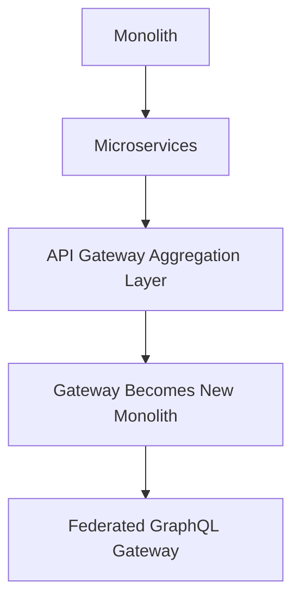

# Demystifying the Unusual Evolution of the Netflix API Architecture

---

## 1. Main Concepts (Overview Section)

This documentation explores the transformation of Netflix’s studio-facing API architecture, tracing its evolution through several major architectural paradigms. The key concepts and subtopics covered include:

- **Monolithic Architecture**: The original, unified codebase and its limitations as Netflix scaled.
- **Microservices Transition**: Splitting the monolith into many discrete, specialized services for scalability and autonomy.
- **API Gateway Aggregation Layer**: Introduction of a unifying gateway to manage the complexity of direct microservice access.
- **Emergence of the Aggregation Layer as a New Monolith**: How the gateway itself became a bottleneck.
- **Federated GraphQL Gateway**: Adoption of GraphQL federation to decentralize API management and empower domain experts.
- **Core Lessons in System Design**: The importance of evolving architecture to suit business needs, rather than copying industry giants.

By following this journey, you will learn why and how Netflix’s studio API infrastructure evolved, the trade-offs at each stage, and the guiding principles behind system architecture decisions.

---

## 2. Detailed Conceptual Flow (Core Documentation)

### From Monolith to Microservices: The Early Days

Netflix’s technical journey began with a **monolithic architecture**. In such a model, all application components—data retrieval, business logic, user interface handling—exist in a single, interconnected codebase. This approach offers simplicity in the early stages: everything is in one place, making deployments and debugging straightforward.

However, as Netflix expanded its original content library and began collaborating with more studios, the monolith became a liability. Any change, even a small one, could require redeploying the entire system. Teams working on different features or domains began stepping on each other’s toes, and the pace of innovation slowed.

### Enter Microservices: Breaking Up the Monolith

To address these scaling bottlenecks, Netflix engineers **decomposed the monolith into microservices**. Each microservice is a self-contained unit responsible for a specific domain—such as movies, production metadata, or talent management. This allowed teams to work independently, deploy updates without affecting unrelated parts of the system, and scale individual services according to demand.

The result was a highly distributed architecture, often visualized as a web of interconnected nodes. While this improved development speed and flexibility, it also introduced new challenges: studio applications now had to interact with a multitude of services directly. Coordinating multiple calls, handling failures, and stitching together responses became complex, especially for front-end teams.

### API Gateway Aggregation Layer: Unifying the Interface

To tame the complexity of direct microservice access, Netflix introduced an **API gateway aggregation layer**. This gateway acts as a central entry point for all studio applications, hiding the proliferation of internal services behind a unified API. The gateway’s job is to orchestrate calls to the underlying microservices, aggregate their responses, and present a single, cohesive API to clients.

For example, if the studio application UI needs data about a movie, its production status, and the talent involved, the gateway can fetch and compose this information from three separate services, returning a ready-to-use dataset for the front end. This dramatically simplified the client-side code and improved consistency.

### Aggregation Layer Becomes the New Monolith

Ironically, as the number of microservices and developers grew, the **API gateway itself became a new bottleneck**—a “monolith in disguise.” All business logic for composing responses and enforcing integration lived in one place, making it difficult to scale development. Changes required coordination across teams, and the gateway’s codebase ballooned in size and complexity, reintroducing many of the original monolithic pain points.

### Federated GraphQL Gateway: Domain-Driven Composition

To dissolve this new monolith, Netflix adopted **GraphQL federation**. GraphQL is a query language that allows clients to request exactly the data they need, across multiple domains, in a single API call. More importantly, with federation, the unified GraphQL API is composed from multiple independently managed subgraphs—each owned by domain experts.

This means that the team responsible for movie metadata can define their segment of the graph and business logic, while another team manages talent data, and yet another oversees production details. The federated gateway composes these into a single, unified schema for client applications. Now, UIs can fetch precisely what they need in a single round trip, no matter where the underlying data lives.

Behind the scenes, the **federated gateway** intelligently routes queries to the relevant sub-services, aggregates their responses, and returns the result to the client. This preserves the autonomy of microservices, avoids centralized bottlenecks, and enables rapid, domain-driven evolution of the API.

---

## 3. Simple & Analogy-Based Examples

Let’s illustrate these concepts with a simple example:

Suppose the Netflix studio app needs to display a dashboard showing a movie’s title, its current production status, and the lead actor’s profile. In the microservices era, the app would have to call the **movie**, **production**, and **talent** services separately, then glue the data together—a tedious and error-prone process.

With an API gateway, the app makes a single request to the gateway, which internally fetches and combines data from the three services, returning a digestible response.

With GraphQL federation, the app issues a single, flexible query specifying exactly what it needs. Each part of the query is handled by the respective domain service, and the federated gateway seamlessly merges the results.

#### Real-World Analogy

Think of the original monolith as a **department store where everything is under one roof**—convenient at first, but crowded and slow as customers (users) grow.

Microservices are like **a shopping mall with many specialty stores**. Each store is efficient at its own product, but as a shopper, you now have to visit multiple stores (services) for a complete shopping list.

The API gateway is **a concierge desk** at the entrance. Give your shopping list to the concierge, and they collect everything from the stores and hand it to you.

But as the mall grows, the concierge desk becomes overwhelmed—now, **different store experts set up their own order counters**, and the concierge simply coordinates. This is the federated GraphQL gateway: each domain expert maintains their menu, and you get a personalized order, assembled efficiently behind the scenes.

---

## 4. Use in Real-World System Design

### Patterns and Use Cases

- **API Gateway Pattern**: Offers a single entry point for multiple internal services, simplifying client interactions and centralizing cross-cutting concerns (like authentication, rate limiting, and request aggregation).
- **Microservices**: Enables independent scaling, deployment, and evolution of service domains.
- **GraphQL Federation**: Empowers domain teams to own their API segments, allows clients to request tailored data, and reduces over-fetching or under-fetching.

### Design Decisions and Their Impact

- **Monolith to Microservices**: Chosen to alleviate scaling and development bottlenecks, but increased system complexity.
- **API Gateway**: Introduced for client simplicity, but risked recreating monolithic bottlenecks.
- **Federation**: Adopted to decentralize control and empower domain teams, improving agility and maintainability.

### Trade-offs and Challenges

- **Microservices**: Increased operational and deployment complexity. Teams must invest in robust inter-service communication and monitoring.
- **API Gateway as New Monolith**: Centralizing too much logic recreates coordination overhead and deployment risk.
- **GraphQL Federation**: Requires careful schema design, versioning strategies, and observability to avoid inconsistent data or performance issues.

#### Practical Examples

- Netflix’s federated gateway allows different studio apps—each with unique data needs—to fetch exactly what they require, reducing unnecessary data flow and speeding up UI performance.
- If a new content studio wants to add a new data field, only their subgraph needs updating; the rest of the API remains stable.

### Best Practices

- **Empower domain experts** to own and maintain their segments of the API.
- **Keep business logic close to the data**—avoid centralizing orchestration unless necessary.
- **Monitor and evolve** the gateway to prevent it from becoming a bottleneck.
- **Design for evolution, not perfection**—architectures should adapt with business needs.

### Anti-patterns to Avoid

- **Premature Optimization**: Copying architectures from tech giants without clear business need leads to wasted complexity.
- **Gateway Bloat**: Letting aggregation layers accumulate too much business logic undermines microservice autonomy.
- **One-size-fits-all APIs**: Overly rigid APIs stifle front-end flexibility and slow innovation.

---

## 5. Optional: Advanced Insights

### Deeper Considerations

- **GraphQL Federation vs. API Gateway**: While traditional gateways focus on routing and aggregation, GraphQL federation enables true schema-level composition, allowing each domain to evolve independently.
- **Edge Cases**: Care is needed to handle cross-domain relationships, schema evolution, and backward compatibility—especially as the organization grows.
- **Comparison with REST**: RESTful APIs can struggle with over-fetching or under-fetching, requiring multiple round-trips. GraphQL solves this by letting clients specify exactly what they need, but at the cost of increased complexity in query planning and security.

### Pros and Cons Illustrated

| Approach       | PROs                                        | CONs                                | Example at Netflix      |
|----------------|---------------------------------------------|-------------------------------------|------------------------|
| Monolith       | Simple, easy to start                       | Hard to scale, inflexible           | Early Netflix system   |
| Microservices  | Scalable, autonomous teams                   | Complex coordination                | Service sprawl         |
| API Gateway    | Simplifies clients, centralizes policies     | Bottleneck risk, monolith reformed  | Gateway bloat          |
| GraphQL Fed.   | Flexible, domain-driven, efficient queries   | Complex schema & orchestration      | Modern Netflix Studio  |

---

## Analogy Section: Explaining All Concepts Together

Imagine a city’s public transportation system:

- **Monolith**: A single, gigantic bus that tries to serve the whole city. It’s easy to board, but as the city grows, the bus gets overcrowded and slow.
- **Microservices**: Now, there are many smaller buses and trains, each operating different routes. Efficient, but as a traveler, you must transfer multiple times to reach your destination.
- **API Gateway**: The city builds a central hub (station) where you can catch a shuttle that coordinates your transfers—making travel easier.
- **Federated GraphQL Gateway**: Each transport line is managed by a dedicated team, but the central station lets you book a seamless trip. You say where you want to go, and the system figures out the best route, combining buses, trains, and shuttles behind the scenes.

---

## Flow Diagram

---

## Conclusion

The evolution of Netflix’s studio API architecture—from monolith, to microservices, to an API gateway, and finally to a federated GraphQL API—demonstrates how system design must adapt to business realities. Each architectural shift addressed the limitations of the previous phase but introduced new challenges. The ultimate lesson is not to copy patterns blindly from tech giants, but to architect systems that match your unique business needs, scale thoughtfully, and empower teams to move quickly and independently. The best architecture is the one that fits your business, not someone else’s.