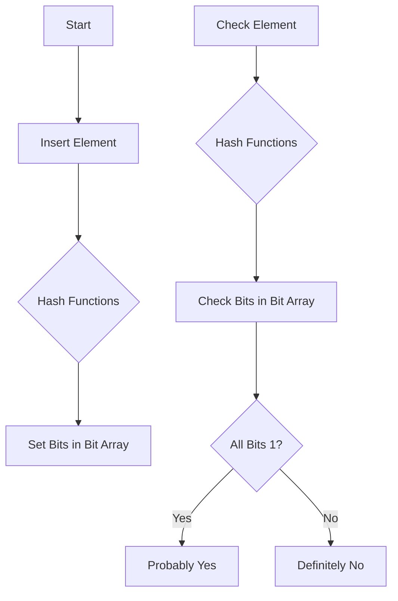

## 1. Main Concepts (Overview Section)

This documentation provides a complete walkthrough of **Bloom filters** — a space-efficient, probabilistic data structure widely used in various software systems to answer set membership queries. We will cover:

- **Core Principles of Bloom Filters:**  
  What they are, how they answer queries, and the nature of their probabilistic guarantees.

- **How Bloom Filters Work:**  
  The underlying mechanisms, including hash functions, bit arrays, and the insertion/query process.

- **Usage Scenarios and Real-World Applications:**  
  How Bloom filters are employed in databases, content delivery networks, browsers, and password validation.

- **Examples and Analogies:**  
  Intuitive demonstrations and real-world analogies to ground understanding.

- **System Design Implications:**  
  Practical considerations, trade-offs, best practices, and potential pitfalls when using Bloom filters in large-scale systems.

- **Advanced Insights:**  
  Deeper technical nuances and comparisons with related data structures.

---

## 2. Detailed Conceptual Flow (Core Documentation)

### Introduction: What Is a Bloom Filter?

A **Bloom filter** is a compact, probabilistic data structure designed to efficiently answer the question: *Is this element in the set?* Unlike traditional structures like hash tables, a Bloom filter is optimized for space at the cost of allowing a certain kind of error. Specifically, when you query for an element, a Bloom filter will either respond with a firm “no” (the element is definitely not present), or a “probably yes” (the element might be present). This “probably” is the hallmark of a probabilistic data structure.

The possibility of **false positives**—cases where the filter reports an element is present when it is not—is what distinguishes Bloom filters from deterministic structures. However, **false negatives**—failing to report a present item—are impossible. If the filter says “no,” you can trust that answer completely.

This trade-off between space and certainty makes Bloom filters valuable in systems where memory is limited and occasional false positives are acceptable.

---

### Core Mechanics: How a Bloom Filter Works

A Bloom filter is built upon two key components: a **bit array** and a set of **hash functions**.

#### The Bit Array

Picture a long array of bits, all initialized to zero. This array acts as a simple, memory-efficient way to track the presence of elements. Its size is determined based on the expected number of elements and the acceptable false positive rate.

#### Hash Functions

Hash functions are mathematical algorithms that deterministically map input data (like a string or number) to a pseudo-random output within a fixed range. A good hash function ensures that different inputs are spread evenly across the range, minimizing collisions—situations where two inputs map to the same output.

A Bloom filter uses multiple independent hash functions. Each function maps an input element to a position in the bit array.

#### Inserting Elements

When adding an element to the Bloom filter:

1. The element is passed through each hash function, producing several indices.
2. For each index, the corresponding bit in the bit array is set to 1.

This process is fast and requires only constant time, regardless of the number of elements in the set.

#### Querying for Membership

To check if an element is present:

1. The element is run through the same hash functions, generating indices.
2. The Bloom filter inspects the bits at these positions.
   - If any of the bits is 0, the element is definitely not in the set.
   - If all the bits are 1, the element is *probably* in the set.

This logic ensures that false negatives cannot occur: if an element was added, all its bits must have been set to 1. However, bits can be set by multiple elements, so a query might find all relevant bits set to 1, even if the element was never added—a false positive.

#### Why Do False Positives Occur?

Because multiple elements may set overlapping bits, it’s possible that all the hash positions for an absent element coincide with bits set by other elements. The more elements you add, the higher the chance of these accidental overlaps—thus, the false positive rate increases with the filter’s load.

#### Deletions: The Irreversible Memory

A notable limitation is that classic Bloom filters **do not support deletions**. Once a bit is set to 1, you can’t know which element(s) set it, so un-setting bits would risk introducing false negatives.

---

### Real-World Analogy: Library Book Tags

Imagine a vast library with a wall of mailboxes, each with a red flag (bit) that can be up (1) or down (0). When a book arrives, you use several secret rules (hash functions) to determine which mailboxes to flag. To check if a book was received, you check the same mailboxes: if any flag is down, the book was never there; if all are up, it probably was—though perhaps by coincidence, as others might have used the same mailboxes. However, once a flag is up, you can't lower it without knowing whose book set it, so the system can’t “forget” books.

---

### Example: Tracking Favorite Foods

Consider a simple Bloom filter with 10 bits (buckets) and 3 hash functions:

- **Insert “rib eye”:**  
  Hash functions yield indices 1, 3, and 4. Set bits 1, 3, and 4 to 1.
- **Insert “potato”:**  
  Hash functions yield indices 0, 4, and 8. Set bits 0, 4, and 8 to 1.

To check if “rib eye” is in the set, hash it again—indices 1, 3, 4. All are 1, so “probably yes.”

To check if “pork chop” is in the set, hash to 0, 5, 8. Bit 5 is 0, so “definitely no.”

However, if “lemon” hashes to 1, 4, 8, all those bits are 1 (from previous insertions), so the filter would erroneously respond “probably yes,” even though “lemon” was never added—a **false positive**.

---

### Controlling False Positives

The rate of false positives is manageable by tuning:

- **Bit array size:** Larger arrays reduce overlap.
- **Number of hash functions:** More functions reduce collisions but increase compute cost.
- **Expected insertions:** Knowing how many elements will be added allows optimal sizing.

System designers must balance memory usage with the acceptable risk of false positives.

---

## 3. Simple & Analogy-Based Examples

### Simple Example (Integrated in Flow)

Suppose you maintain a Bloom filter to track which users have already claimed a sign-up bonus. When a new user claims, you hash their ID through several functions and set the respective bits. When someone tries to claim again, you hash their ID and check the bits; if any bit is 0, they never claimed before. If all are 1, you *assume* they did—although, due to false positives, a new user might be denied by mistake.

### Analogy Section (All Concepts)

Think of a **Bloom filter** like a set of light switches (bits) in a hallway. Each guest (element) flips a few switches based on a secret set of instructions (hash functions). When you want to know if a guest has been in the hallway, you check their switches. If any switch is off, they haven’t been there; if all are on, you *think* they have, but maybe someone else flipped the same switches. You can’t turn off switches for a guest who leaves, because you don’t know which other guests depend on those switches being on.

---

## 4. Use in Real-World System Design

### Common Patterns and Use Cases

#### NoSQL Databases

In storage systems like those using **Log-Structured Merge (LSM) trees** (e.g., Apache Cassandra, LevelDB), Bloom filters help avoid unnecessary disk reads. When searching for a key, the database checks the Bloom filter; if the filter says “definitely no,” it skips the costly process of looking through multiple files. This dramatically improves read performance for non-existent keys.

#### Content Delivery Networks (CDNs)

Networks like **Akamai** use Bloom filters to avoid caching “one-hit wonder” web pages—pages accessed only once. By tracking which URLs have already been seen, the CDN only caches pages after they are requested again, reducing memory consumption and increasing cache hit rates.

#### Web Browsers & Security

Older versions of browsers like **Google Chrome** used Bloom filters to quickly check if a URL might be malicious. If the filter returned “probably yes,” a more thorough (and expensive) check followed. This enabled rapid screening of millions of URLs with minimal memory.

#### Password Validation

Some password checkers use Bloom filters to reject weak or compromised passwords by testing user passwords against a large set of known-bad values. Rarely, a strong password might be falsely rejected—a false positive—but users can simply try another.

---

### Design Decisions, Trade-Offs, and Challenges

#### Trade-Offs

- **Space vs. Accuracy:**  
  Smaller Bloom filters use less memory but yield higher false positive rates.
- **Performance:**  
  Hashing is fast and constant-time, but the number of hash functions must be chosen to balance speed and accuracy.
- **No Deletion:**  
  Standard Bloom filters cannot remove elements, which can be a limitation in dynamic sets.

#### Best Practices

- **Choose filter size and hash count based on expected data volume and acceptable error rates.**
- **Use high-quality, independent hash functions** to minimize collisions.
- **Monitor filter load**; as it fills, false positives rise, so periodic filter resets or scaling may be necessary.

#### Anti-Patterns to Avoid

- **Using Bloom filters for sets requiring deletions** (unless you use advanced variants like Counting Bloom Filters).
- **Assuming “probably yes” means certain presence**—always remember the possibility of false positives.
- **Oversizing or undersizing the filter**—both waste resources or degrade accuracy.

---

### Real-World Example: CDN Cache Optimization

A CDN caches millions of pages but wants to avoid storing pages that are only ever requested once. By tracking URLs with a Bloom filter, it only caches a page on its second request. This reduces wasted cache space, increases the chance that cached items are actually reused, and improves overall system efficiency.

---

## 5. Optional: Advanced Insights

### Expert Considerations

- **Counting Bloom Filters:**  
  If deletions are required, a Counting Bloom Filter uses small counters instead of single bits, enabling safe removal but at increased memory cost.
- **Scalable Bloom Filters:**  
  These dynamically grow to accommodate more elements without a drastic increase in false positive rates.
- **Comparison with Hash Sets:**  
  While a hash set provides perfect accuracy and supports deletions, it consumes much more memory—often orders of magnitude more for large sets.

### Edge Cases

- **Very High Load:**  
  As the number of inserted elements approaches the filter’s bit capacity, the false positive rate approaches 1. In such cases, the filter loses utility.
- **Poor Hash Function Choice:**  
  Correlated or low-quality hash functions can increase collisions, reducing accuracy.

### Flow Diagram: Bloom Filter Operation

---

## Conclusion

**Bloom filters** are a powerful, space-efficient solution for set membership queries where occasional false positives are acceptable, but false negatives are intolerable. Their probabilistic nature, speed, and memory efficiency make them indispensable tools in the engineering of large-scale, high-performance systems—provided their limitations are understood and managed wisely.