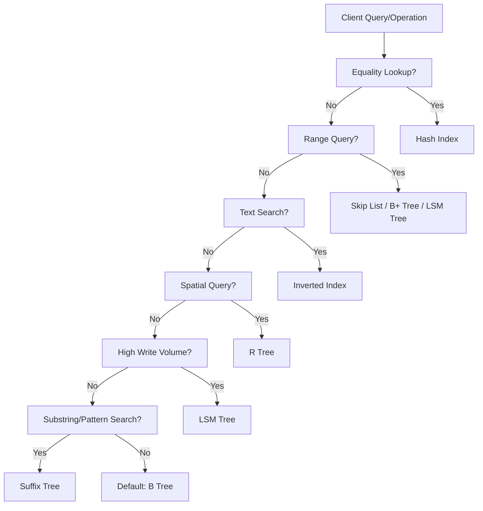

# 8 Key Data Structures That Power Modern Databases

---

## 1. Main Concepts (Overview Section)

Modern databases rely on a variety of specialized data structures to achieve efficient storage, retrieval, and management of data at scale. This documentation will cover the following eight foundational data structures, explaining their roles, mechanisms, and design implications:

1. **Skip List**: Probabilistic structure for fast in-memory ordered sets.
2. **Hash Index (Hash Table)**: Key-value mapping for rapid lookups.
3. **SS Table (Sorted String Table)**: Disk-based sorted storage for large, compressed data.
4. **LSM Tree (Log-Structured Merge Tree)**: Write-optimized, multi-tiered structure combining SS tables and Memtables.
5. **B Tree & B+ Tree**: Balanced disk-based trees for scalable, ordered data access.
6. **Inverted Index**: Text search-optimized structure mapping terms to documents.
7. **Suffix Tree**: Advanced text indexing for substring searches.
8. **R Tree**: Spatial index for geometric and multi-dimensional data.

Throughout this documentation, each structure will be introduced, contextualized, and explored both individually and in relation to modern database systems.

---

## 2. Detailed Conceptual Flow (Core Documentation)

### Introduction: The Need for Specialized Data Structures

Databases must offer high performance for both read and write operations while managing vast and diverse data. To achieve this, they employ specialized data structures, each optimized for particular patterns of access, storage constraints, and query types. The evolution and selection of these structures shape the capabilities of major database engines.

### Skip List: Ordered Sets at Speed

The **skip list** is a probabilistic, layered linked list designed to provide efficient search, insertion, and deletion for ordered data. Unlike a binary search tree, which relies on strict balancing to keep operations fast, skip lists introduce multiple levels of "express lanes." Each new level allows for bigger jumps through the data, so locating an item becomes much faster than scanning linearly.

In an in-memory database like Redis, skip lists underpin the **sorted set** data structure. This allows efficient range queries and ordered traversals—crucial for leaderboards, time-series data, or any application requiring ranked or sorted results.

*Example*: Searching for a value in a skip list is like playing the game "Chutes and Ladders," where you can occasionally take shortcuts to skip many spaces, speeding up your journey.

### Hash Index: Direct Key-Value Access

A **hash index**, often realized as a hash table, uses a hash function to directly map keys to their storage locations. This enables **constant-time** average complexity for lookups, insertions, and deletions—making it the go-to structure for scenarios where direct access by a unique key is paramount.

Hash indexes are ubiquitous in databases—used for fast primary key lookups, implementing in-memory caches, and even managing metadata structures. For instance, Redis uses hash tables for its native hash data type; MySQL leverages them for in-memory temporary tables.

*Real-World Example*: Looking up a contact in your phone by their number—no matter how big your contact list grows, you can find any entry instantly.

### SS Table and LSM Tree: Efficient Disk Writes and Merges

#### SS Table: Sorted Storage on Disk

The **Sorted String Table (SS Table)** is a disk-based, immutable data structure. Each SS Table is a file where data entries are stored in sorted order and often compressed for space efficiency. Because the file is sorted, range queries and binary search operations are highly efficient.

#### LSM Tree: Write-Optimized Storage

The **Log-Structured Merge Tree (LSM Tree)** is a compound structure, central to modern NoSQL databases like Cassandra, RocksDB, and LevelDB. LSM Trees pair two core components: the **Memtable** (an in-memory, usually sorted data structure holding recent writes) and the SS Table (storing flushed, immutable data on disk).

When writes come in, they are quickly recorded in the Memtable. Periodically, the Memtable is flushed to disk, becoming a new SS Table. Over time, multiple SS Tables are merged ("compacted") to maintain performance and reclaim space.

This approach is extremely effective for write-heavy workloads, as it avoids random disk writes and leverages sequential I/O for both writing and merging.

*Analogy*: Think of the Memtable as a "to-do pile" on your desk. As it grows, you eventually file its contents—sorted and organized—into your filing cabinet (SS Table). Periodically, you reorganize and consolidate your cabinet for optimal access.

### B Tree and B+ Tree: The Workhorses of Relational Databases

**B Trees** are balanced tree structures where each node can have multiple children. This design enables efficient insertion, deletion, and lookup operations, all while keeping data sorted. The **B+ Tree** is a refinement where all actual data lives in the leaf nodes; internal nodes only store keys for navigation. Furthermore, leaf nodes are linked, enabling fast in-order traversals—a vital property for range queries.

These trees are foundational to the storage engines of major relational databases like MySQL, PostgreSQL, and Oracle. Their design minimizes disk I/O, as each node is sized to match disk blocks, allowing vast data sets to be efficiently managed on spinning disks or SSDs.

*Real-World Analogy*: A library's card catalog, where each drawer (node) contains sorted index cards (keys) pointing to either more drawers or the actual books (data).

### Inverted Index: Powering Full-Text Search

An **inverted index** maps terms (words) to the documents in which they appear, essentially reversing the document-to-word relationship. This structure is critical for search engines and document-oriented databases, making it possible to retrieve all documents containing a particular term extremely quickly.

For example, searching "database" in a corpus of millions of documents becomes a matter of directly following the index from the word "database" to a list of document IDs, rather than scanning every document individually. Elasticsearch and similar systems build their search capabilities around this concept.

### Suffix Tree: Advanced Text Searching

A **suffix tree** is a specialized structure for indexing all possible suffixes of a string or document. This allows for rapid substring searches, pattern matching, and repeated substring identification. Suffix trees are memory-intensive but invaluable for workloads requiring complex string analysis, such as DNA sequence matching or advanced search features.

*Example*: Finding all occurrences of "cat" in "concatenation" is immediate, without rescanning the entire text each time.

### R Tree: Indexing the Physical World

**R Trees** are designed for spatial data, such as geographic coordinates, rectangles, and polygons. They organize data hierarchically based on bounding rectangles, making them ideal for answering queries like "find all restaurants within a given area" or "which shapes overlap with this region."

Spatial databases (e.g., PostGIS, MongoDB's geospatial features, Elasticsearch's geo-indexing) rely on R Trees to efficiently process location-based queries across massive datasets.

---

## 3. Simple & Analogy-Based Examples

To further clarify, let's anchor each data structure with an everyday analogy:

- **Skip List**: Like a multi-level expressway—higher levels have fewer exits but let you travel farther, faster.
- **Hash Index**: Like a direct-dial phonebook—jump straight to the person you want by their unique number.
- **SS Table & LSM Tree**: Like jotting notes on sticky pads (Memtable), then periodically organizing and filing them (SS Table), and occasionally reorganizing your files for quick access (compaction).
- **B/B+ Tree**: Like a well-structured filing cabinet with labeled folders and subfolders, guiding you to the right document with minimal effort.
- **Inverted Index**: Like a book's index, where you look up a topic and immediately find all the pages where it appears.
- **Suffix Tree**: Like a search function that instantly tells you every place a certain phrase shows up in all your notes.
- **R Tree**: Like a map with grids—each grid tells you which landmarks or addresses fall within its boundaries, so you can quickly find all places in a region.

---

## 4. Use in Real-World System Design

### Patterns and Use Cases

- **Skip List**: Used in Redis for sorted sets, where fast range queries and ranked data are essential.
- **Hash Index**: Ubiquitous for key-value stores, metadata caches, and primary key lookups; used in Redis, in-memory caches, and for quick mapping tasks in relational databases.
- **SS Table & LSM Tree**: Backbone of write-heavy NoSQL databases (Cassandra, LevelDB, RocksDB). Their write-optimized nature makes them ideal for logging, event sourcing, and real-time analytics.
- **B/B+ Tree**: Preferred for traditional relational databases (MySQL, PostgreSQL, Oracle) where read-heavy, range queries, and transactional integrity are critical.
- **Inverted Index**: Powers full-text search in document stores like Elasticsearch and search engines.
- **Suffix Tree**: Specialized use in bioinformatics, advanced search, and pattern recognition.
- **R Tree**: Essential for GIS applications, mapping software, and any system needing efficient spatial queries.

### Design Decisions and Trade-Offs

- **Skip List vs. Balanced Trees**: Skip lists are simpler to implement but may use more memory; balanced trees (like B trees) offer stricter performance guarantees.
- **Hash Index**: Blazing fast for equality lookups but cannot support range queries.
- **LSM Tree**: Great for high write throughput, but read amplification and compaction overhead can be challenging. Requires tuning of compaction strategies and memory sizes.
- **B/B+ Tree**: Excellent for read and range queries but can suffer under write-heavy workloads due to node splits and balancing.
- **Inverted Index**: Enables fast text search but requires significant storage and careful update handling.
- **Suffix Tree**: Extremely fast for substring search but impractical for very large datasets due to memory use.
- **R Tree**: Handles multidimensional data efficiently but can degrade if spatial data is highly skewed or updates are frequent.

### Best Practices and Anti-Patterns

- **Skip List**: Use for in-memory, ordered datasets; avoid for massive, disk-based storage due to pointer overhead.
- **Hash Index**: Avoid for queries requiring order or ranges; ensure good hash function to prevent collisions.
- **LSM Tree**: Monitor compaction and memory usage; avoid using for workloads with heavy random reads unless complemented by a cache.
- **B Tree**: Prefer when range queries dominate; avoid for ultra-high write rates unless using variants with write-optimization.
- **Inverted Index**: Regularly optimize and prune; avoid for strictly structured or numeric data.
- **Suffix & R Trees**: Use only when their specialty (substring search or spatial indexing) is central to your application.

---

## 5. Optional: Advanced Insights

### Deeper Considerations

- **Skip Lists** offer lock-free implementations for concurrent environments, making them attractive for high-performance, multi-threaded systems.
- **LSM Trees** present a challenging balance between write amplification, read amplification, and space amplification—tuning these factors is critical for performance.
- **B+ Trees** outperform B Trees for range queries due to linked leaves.
- **Inverted Indexes** often incorporate additional structures (like tries or Bloom filters) to optimize for speed and storage.
- **R Trees** have several variants (R*, R+ Trees) to address issues like overlapping bounding rectangles and performance degradation.

### Comparisons

- **B Tree vs. LSM Tree**: B Trees excel at read-heavy, transactional workloads; LSM Trees shine in write-heavy, append-only, or log-structured use cases.
- **Hash Index vs. Skip List/B Tree**: Hashes are best for point lookups; skip lists and B Trees support both point and range queries.

### Edge Cases

- **Hash Collisions**: Poor hash functions can degrade performance from O(1) to O(n).
- **LSM Compaction "Stalls"**: If compaction falls behind, write performance can drop sharply.
- **Spatial Skew in R Trees**: Non-uniform data distribution can cause imbalance and slow queries.

---

## Flow Diagram: Data Structure Selection in Modern Databases

---

## Final Analogy Section: The Modern Database as a City

Imagine a database as a bustling city:

- **Hash Indexes** are the express subway lines—direct, fast, and perfect for commuters who know exactly where they're going.
- **Skip Lists** are multilane highways with express lanes for faster travel, optimized for in-memory traffic.
- **B/B+ Trees** are the city's well-planned road network, with signs (keys) at every intersection (node), guiding drivers efficiently to neighborhoods (data ranges).
- **SS Tables & LSM Trees** are the city's postal system—mail (writes) is first sorted at a local depot (memtable), then shipped out in bulk (SS Tables), and periodically the system reorganizes itself for efficiency (compaction).
- **Inverted Indexes** are the city's directory assistance—instantly telling you all the addresses where a certain service is offered.
- **Suffix Trees** are the city's rumor network—quickly spreading information about any substring or pattern to everyone who cares.
- **R Trees** are the zoning maps—helping you find all buildings in a district or businesses along a route.

Each structure keeps the city running smoothly, handling its own kind of traffic and challenge—together, they make the database resilient, fast, and capable of serving millions.

---

# Conclusion

The eight data structures described are the architectural pillars of modern databases. Their thoughtful application and tuning are what enable databases to deliver the speed, flexibility, and reliability demanded by today's applications. Understanding their mechanics, trade-offs, and design implications is foundational for any engineer working in the data-intensive world.