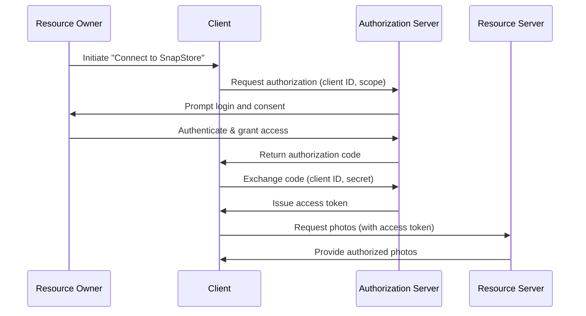

OAuth 2 Explained In Simple Terms  
(based on the provided video content)

---

## 1. Main Concepts (Overview Section)

This documentation guides you through the core concepts and flow of the OAuth 2 protocol, focusing on its role in secure, delegated access for modern web applications.

**Key ideas covered:**

- The motivation for OAuth 2 and how it improves on older practices.
- The roles involved in OAuth 2: Resource Owner, Client, Resource Server, and Authorization Server.
- A step-by-step walkthrough of the OAuth 2 flow using a real-world example.
- The purpose and function of tokens: Authorization Code, Access Token, and Refresh Token.
- Security benefits, revocation, and lifecycle management.
- Practical considerations, trade-offs, and best practices for using OAuth 2 in real-world systems.
- Analogies and simple examples to clarify each concept.

---

## 2. Detailed Conceptual Flow (Core Documentation)

### The Problem Before OAuth 2

In the early days of the Internet, enabling one service to interact with another on your behalf often meant handing over your username and password directly. For example, a personal finance app might ask for your online banking credentials to “scrape” your transactions. This practice, while simple, is highly insecure: you lose control over your credentials, and the third-party has unrestricted access to your account.

### Introducing OAuth 2: Secure Delegated Access

OAuth 2 was designed to address this fundamental security issue. Rather than sharing your password, OAuth 2 allows you to grant a third-party application a **special key** — an access token — that provides limited, revocable access to the data or actions you approve. This way, you retain control over your credentials and the level of access granted, and you can revoke that access at any time.

### Key Roles in OAuth 2

To understand how OAuth 2 works, let’s introduce the four main actors involved:

- **Resource Owner**: This is you, the user, who owns the data (e.g., your photos).
- **Client**: The application seeking access to your data (e.g., a photo printing service).
- **Resource Server**: The server where your data is stored (e.g., SnapStore, the photo storage app).
- **Authorization Server**: The authority responsible for authenticating you and issuing tokens (often part of the Resource Server or a separate identity provider).

### OAuth 2 Flow: A Step-by-Step Example

Consider the scenario: you use SnapStore to store your photos and want to print them using PrintMagic. Instead of manually downloading and uploading your photos, you wish PrintMagic could fetch them directly.

Here’s how OAuth 2 orchestrates this securely:

1. **The Request for Access**  
   You initiate the process by instructing PrintMagic to access your SnapStore photos. PrintMagic sends a request to SnapStore’s Authorization Server, including its **client ID** (an identifier for PrintMagic) and the **scope** (the specific access it’s requesting, e.g., “read-only access to photos”).

2. **User Authentication and Consent**  
   As the Resource Owner, you are redirected to SnapStore to authenticate (log in). After confirming your identity, SnapStore asks you to grant or deny PrintMagic the requested access. This step ensures **user consent** is explicit and controlled.

3. **Issuing the Authorization Code**  
   If you grant access, SnapStore’s Authorization Server issues an **authorization code** to PrintMagic. This code is short-lived and acts as a one-time “proof” that you approved PrintMagic’s access request.

4. **Client Authentication and Token Exchange**  
   PrintMagic now presents this authorization code, along with its **client ID** and **client secret** (a private credential known only to PrintMagic and SnapStore), to the Authorization Server. The client secret verifies PrintMagic’s identity and ensures only authorized apps can exchange codes for tokens.

5. **Access Token Issuance**  
   Upon successfully verifying the code and credentials, the Authorization Server issues an **access token** to PrintMagic. This token grants PrintMagic the ability to access your photos, but only within the scope and time limits you approved.

6. **Accessing Protected Resources**  
   PrintMagic uses the access token to make API requests to SnapStore’s Resource Server, retrieving your photos as authorized. Crucially, PrintMagic never sees or stores your SnapStore password.

7. **Token Expiry, Revocation, and Refresh**  
   Access tokens typically expire after a set duration, limiting the window of access. As the Resource Owner, you can also **revoke** the token at any time, immediately cutting off PrintMagic’s access. To support long-lived sessions without repeatedly prompting you, OAuth 2 can also issue a **refresh token**, which allows PrintMagic to request new access tokens when old ones expire, all without user involvement.

### Why OAuth 2 Matters

This flow ensures that third-party services can act on your behalf within strictly defined limits, without ever exposing your primary credentials. It’s a foundational security mechanism for countless integrations across the web — from signing in with Google to connecting social media accounts and enabling seamless app-to-app functionality.

---

## 3. Simple & Analogy-Based Examples

Let’s revisit the SnapStore and PrintMagic example:

- **Simple Example**:  
  You use SnapStore to store your photos. When you want to print them via PrintMagic, you click “Connect to SnapStore” on PrintMagic’s website. You’re redirected to SnapStore, log in, and approve PrintMagic’s request. PrintMagic, now holding an access token, fetches your selected photos for printing — without ever knowing your SnapStore password.

- **Unified Analogy for OAuth 2 Concepts**:  
  Imagine your SnapStore account as a locked house (your resource). You’re the homeowner (Resource Owner). PrintMagic is a cleaning service (Client) that you want to let in, but only to clean the living room (limited scope), and only for one afternoon (limited time). Instead of giving them your house keys (your password), you go to the local locksmith (Authorization Server) and request a special, temporary key (Access Token) that only opens the living room door. If you change your mind, you can cancel the key at any time (revocation), and the key automatically stops working after the afternoon (expiration). If the cleaners need more time, they can ask the locksmith for an extension (refresh token), but only if you approved that possibility.

---

## 4. Use in Real-World System Design

### Common Patterns and Use Cases

OAuth 2 is ubiquitous wherever third-party applications need controlled access to user data:

- **Social logins** (“Sign in with Google/Facebook”) leverage OAuth 2 to authenticate you without sharing your password.
- **API integrations** between SaaS products (e.g., connecting a calendar app to your email).
- **Mobile and desktop apps** retrieving user data from cloud services.

### Design Decisions and Trade-Offs

- **Granular Access (Scope)**  
  OAuth 2 allows defining “scopes,” letting users grant only the minimal permissions necessary. This adheres to the principle of least privilege, reducing risk.

- **Token Expiry and Refresh**  
  Short-lived tokens minimize damage from leaks, while refresh tokens enable seamless user experiences. However, refresh tokens themselves must be protected, especially in mobile or browser-based apps.

- **Revocation and User Control**  
  Users (or admins) can revoke access tokens, immediately cutting off third-party access. This is a critical advantage over traditional credential sharing.

- **Delegation vs. Impersonation**  
  OAuth 2 enables **delegation** — acting on someone’s behalf — without impersonation. The third-party acts as itself, with access only to what’s permitted.

### Challenges and Anti-Patterns

- **Misuse of Tokens**  
  Storing tokens insecurely (e.g., in client-side JavaScript or local storage) can lead to leaks and unauthorized access. Always use secure storage mechanisms and follow best practices for token management.

- **Overly Broad Scopes**  
  Requesting excessive permissions (e.g., “full access” when only read access is needed) erodes user trust and amplifies risk.

- **Lack of Revocation Mechanisms**  
  Systems that don’t allow users to easily view and revoke third-party access create long-term security holes.

- **Client Secret Leakage**  
  In public clients (e.g., mobile apps, SPAs), the client secret cannot be kept truly secret. Use appropriate OAuth 2 flows (e.g., Authorization Code with PKCE) designed for such environments.

### Best Practices

- Always request the minimum scope necessary.
- Set reasonable token expiration times.
- Implement robust token revocation and user consent management.
- Use secure transmission (HTTPS) at all times.
- Select the correct OAuth 2 flow for your application type and threat model.

---

## 5. Optional: Advanced Insights

### Comparing OAuth 2 to OAuth 1

OAuth 1 required cryptographic signing of each request and was more complex to implement. OAuth 2 simplified this by relying on secure channels (HTTPS) and separating the roles of Authorization and Resource servers, at the cost of greater reliance on secure token handling.

### Common OAuth 2 Grant Types

While the “authorization code” flow described above is the most secure and widely used for web applications, OAuth 2 defines several “grant types” (flows) for different scenarios, including:

- **Implicit Grant** (now discouraged due to security concerns)
- **Client Credentials Grant** (for machine-to-machine communication)
- **Resource Owner Password Credentials Grant** (rarely recommended due to security risks)

### Edge Cases and Security Considerations

- **Phishing Attacks**:  
  Users must be educated to only enter credentials on trusted authorization servers to avoid phishing.

- **Token Leakage**:  
  Compromised tokens can be replayed until they expire or are revoked. Always use HTTPS and secure storage.

---

## Flow Diagram

Below is a simplified flow diagram illustrating the OAuth 2 Authorization Code Flow:

---

## Conclusion

OAuth 2 provides a robust, flexible framework for secure delegated access in modern web ecosystems. By disentangling user credentials from third-party access, it empowers both users and service providers with fine-grained control, auditability, and peace of mind. Whether you’re building an integration platform, connecting consumer apps, or architecting large-scale systems, a solid grasp of OAuth 2 is essential — and its principles are foundational to secure, user-centric software design.