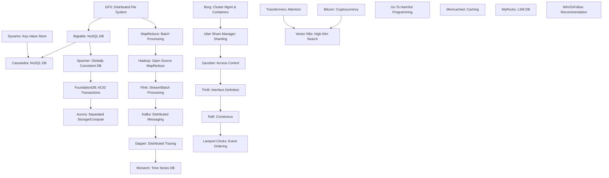

---

# 25 Foundational Computer Science Papers: Concepts, Systems, and Their Lasting Impact

## 1. Main Concepts (Overview Section)

This documentation presents an organized walkthrough of 25 research papers that have profoundly shaped computer science, with a focus on distributed systems, databases, data processing, system design, and influential programming paradigms. The topics are grouped as follows:

- **Distributed Systems and Databases**
    - Innovations in file systems, key-value stores, NoSQL, consistency, transactions, and high-availability architectures.
- **Data Processing and Analysis**
    - Paradigms and systems for batch, stream, and real-time data processing.
- **Distributed Systems Challenges**
    - Solutions for cluster management, sharding, access control, consensus, and event ordering.
- **Groundbreaking Concepts and Architectures**
    - Advances in AI architectures, cryptocurrencies, and programming language design.
- **Applications and System Optimizations**
    - High-performance caching, storage engines, recommendation algorithms, and emerging database models.

By reading this, you will understand the high-level evolution of large-scale system design, the technical problems these papers address, and the architectural principles now foundational to modern computing.

---

## 2. Detailed Conceptual Flow (Core Documentation)

### Distributed Systems and Databases: Rethinking Scale, Consistency, and Reliability

#### Google File System (GFS): Embracing Failure at Scale

Systems designed for massive data—such as search engines—demand file storage that can handle not only size but also frequent hardware failures. The Google File System (GFS) was developed as a distributed file system to address these needs, built on inexpensive commodity hardware. Unlike traditional file systems that assume hardware reliability, GFS expects failures as normal and incorporates failure handling into its core.

GFS organizes data into large, immutable chunks replicated across multiple servers. When a chunk server fails, the system detects and re-replicates the data automatically, ensuring durability and availability. Performance is optimized for large, sequential reads and frequent appends, matching the access patterns of Google's workloads.

#### Amazon Dynamo: Prioritizing Availability with Eventual Consistency

As e-commerce and web services demand continuous uptime, Amazon developed Dynamo, a highly available key-value store. Dynamo's key innovation is its willingness to sacrifice strict consistency in favor of availability—particularly during network partitions or server failures.

Rather than enforcing a single "correct" value at all times, Dynamo allows temporary data divergence (eventual consistency), using object versioning to track multiple versions of data. Conflicts are resolved by the application, not the database itself, enabling flexible business logic and high resilience. This approach underpins many modern NoSQL systems.

#### NoSQL Databases: Bigtable & Cassandra

Expanding on these ideas, Google's Bigtable and Facebook/Amazon's Cassandra deliver scalable, highly available storage for structured data. Bigtable provides a sparse, distributed, multi-dimensional sorted map, optimized for low-latency, large-scale analytics. Cassandra combines Dynamo's replication and consistency mechanisms with Bigtable's data model, achieving a multi-master, peer-to-peer design for fast, reliable operations globally.

#### Google Spanner: Global Consistency with TrueTime

While previous systems traded consistency for availability, Google Spanner aimed to achieve both at global scale. Central to Spanner is TrueTime, an API that leverages globally synchronized clocks—using GPS and atomic clocks—to provide bounded time uncertainty. This enables Spanner to support strongly consistent, lock-free read-only transactions and consistent snapshots, features crucial for financial and mission-critical applications.

#### FoundationDB: Distributed ACID Transactions

FoundationDB addresses the challenge of supporting full ACID (Atomicity, Consistency, Isolation, Durability) transactions over distributed systems. Its architecture separates a robust key-value core from layers supporting various data models (e.g., document, graph, or relational), allowing multiple data paradigms on a single, consistent foundation.

#### Amazon Aurora: Separation of Compute and Storage

Amazon Aurora reimagined database architecture by decoupling storage and compute. With compute nodes operating independently from storage, Aurora enables dynamic scaling—the storage layer automatically grows or shrinks, and data is synchronously replicated across multiple availability zones for durability.

---

### Data Processing and Analysis: Taming Big Data

#### MapReduce and Hadoop: Parallel Processing for All

Processing vast datasets efficiently became possible with MapReduce, a programming model dividing tasks ("map" and "reduce" functions) across thousands of machines. Google’s MapReduce system abstracts parallelization, fault tolerance, and data shuffling away from the programmer. Hadoop made this model accessible to industry via open source, democratizing big data analytics.

#### Flink: Unified Stream and Batch Processing

Apache Flink bridges the gap between real-time (stream) and historical (batch) data processing. Rather than treating these as separate paradigms, Flink models batch as a special case of streaming, providing consistent semantics and simplifying application design.

#### Kafka: Reliable, Scalable Data Pipelines

Apache Kafka, a distributed messaging system, organizes data into topics. Producers write data, and consumers read it asynchronously. Kafka brokers replicate data, ensuring fault tolerance. Its high throughput and low latency enable real-time analytics, event sourcing, and microservice communication at scale.

#### Dapper: Distributed Tracing for Complex Systems

Google’s Dapper introduced distributed tracing, crucial for debugging and optimizing microservices. Dapper samples requests and propagates trace context across service boundaries, revealing latency bottlenecks and dependencies with minimal performance overhead.

#### Monarch: In-Memory Time Series at Scale

Monarch, Google’s time series database, is designed for monitoring vast infrastructures. Its regionally partitioned in-memory architecture ingests terabytes per second and serves millions of queries, supporting observability for global-scale services.

---

### Distributed Systems Challenges: Managing Complexity

#### Borg: Cluster Management and Containers

Google’s Borg system introduced centralized management of compute clusters and the container abstraction. By scheduling workloads into containers, Borg maximizes resource utilization and simplifies cluster operations—a precursor to Kubernetes.

#### Uber Share Manager: Adaptive Sharding

As data grows, distributing (sharding) it efficiently is critical. Uber Share Manager provides a framework for dynamically adjusting shard placement in response to failures or load changes, automating what was once a manual, error-prone process.

#### Zanzibar: Unified Global Access Control

Zanzibar manages access control for Google’s services, scaling to trillions of access control entries. Its uniform model and configuration language allow diverse policies to be expressed and enforced globally, supporting millions of authorization requests per second.

#### Thrift: Interface Definition for Interoperability

Facebook’s Thrift standardized cross-language service communication. By generating code from an interface definition language (IDL), Thrift enables scalable, maintainable microservice architectures across heterogeneous environments.

#### Raft: Easier Consensus

Raft simplified the complex Paxos consensus algorithm, making it easier to build reliable, leader-based systems that agree on state (such as logs or configuration) in the presence of failures. Raft’s clear roles (leader, follower, candidate) and log replication strategy are now widely used in distributed databases and coordination systems.

#### Lamport Clocks: Reasoning About Event Ordering

The 1978 paper on time, clocks, and event ordering introduced logical clocks, enabling distributed systems to establish partial orderings of events—essential for synchronization and causal relationships—without relying on perfectly synchronized physical clocks.

---

### Groundbreaking Concepts and Architectures

#### Attention Is All You Need: The Transformer Revolution

Transformers redefined natural language processing. By using self-attention mechanisms, transformers weigh the importance of each word in a sequence, capturing contextual relationships more effectively than previous architectures. This led to models like GPT, dramatically advancing tasks such as translation and summarization.

#### Bitcoin White Paper: Decentralized Digital Currency

Bitcoin’s design introduced a peer-to-peer, decentralized ledger (blockchain) secured by cryptographic consensus (proof-of-work). This eliminated the need for central authorities and inspired the development of cryptocurrencies and decentralized technologies.

#### Go To Statement Considered Harmful: Structured Programming

Edsger Dijkstra’s 1968 letter articulated the dangers of unstructured control flow (goto statements), advocating for structured programming—using clear, composable control structures—thus influencing modern programming language design and code maintainability.

---

### Applications and System Optimizations

#### Memcached: High-Performance Distributed Caching

Memcached addresses the challenge of high-speed caching across distributed systems. By sharding cache data and providing a simple key-value interface, Memcached accelerates web applications and reduces database load, but introduces challenges in cache coherence and eviction strategies.

#### MyRocks: Write-Optimized Storage Engines

MyRocks, based on Log-Structured Merge Trees (LSM Trees), optimizes storage for write-heavy workloads. By batching writes and compacting data in the background, it delivers efficient storage and retrieval at scale, suitable for large modern databases.

#### Twitter’s Who To Follow: Recommendation Systems

Twitter’s recommendation engine analyzes the social graph to suggest new connections. It combines graph analysis algorithms with scalable infrastructure to deliver personalized suggestions, demonstrating real-world recommender system design.

#### Vector Databases: High-Dimensional Data Search

As AI and search systems increasingly rely on vector embeddings (e.g., from neural networks), vector databases have emerged to store and efficiently query high-dimensional data. These systems use techniques like approximate nearest neighbor search to deliver fast, scalable similarity queries for recommendation and retrieval tasks.

---

## 3. Simple & Analogy-Based Examples

#### Analogy Section: Distributed Systems as a City’s Infrastructure

Consider a large city’s infrastructure:

- **Google File System & Dynamo:** Imagine a postal service where packages (data) are stored in multiple warehouses (chunk servers) across the city. If one warehouse burns down, others still have the needed packages (replication). Sometimes, the address labels on packages might not be perfectly in sync if trucks (servers) are delayed (eventual consistency), but the system ensures every package is delivered, even if the route takes a detour.
- **MapReduce & Hadoop:** Picture a large crowd sorting mail—each worker (server) is given a pile (data chunk) to process. They first sort (map), then the results are gathered and summarized (reduce) by managers (reduce workers).
- **Kafka:** Like a central bulletin board where anyone can post notices (producers), and others can read them (consumers) at their own pace—multiple boards (topics) ensure information flows reliably, and backup boards (replicas) keep copies in case one is damaged.
- **Borg & Containers:** Similar to a city’s central dispatch office assigning delivery trucks (containers) to tasks—by centrally managing assignments, the city keeps traffic flowing smoothly.
- **Raft & Consensus:** Like a committee voting on city policies: a leader proposes, others vote, and a majority must agree before action is taken—ensuring everyone follows the same plan, even if a member is absent.

---

## 4. Use in Real-World System Design

### Patterns and Use Cases

- **Distributed File Systems (GFS, HDFS):** Used for storing logs, media, and analytical data in companies like Google, Facebook, and Netflix.
- **NoSQL Databases (Dynamo, Cassandra, Bigtable):** Power user profiles, shopping carts, and sensor data in Amazon, Facebook, and IoT platforms—where availability and partition-tolerance are critical.
- **Stream Processing (Kafka, Flink):** Real-time analytics, fraud detection, and event-driven architectures in financial services and social media.
- **Cluster Management (Borg, Kubernetes):** Automated deployment of microservices in cloud environments, improving resource efficiency and failure recovery.
- **Consensus Algorithms (Raft):** Highly-available configuration stores (etcd, Consul) and leader election in distributed systems.

### Design Decisions, Trade-offs, and Challenges

- **Consistency vs. Availability:** Dynamo-inspired systems prioritize uptime over strict correctness; Spanner and FoundationDB strive for both, but at the cost of increased infrastructure complexity.
- **Sharding and Partitioning:** Adaptive sharding (Uber Share Manager) reduces manual errors, but requires sophisticated monitoring and rebalancing logic.
- **Unified Access Control (Zanzibar):** Global-scale authorization simplifies security but demands high scalability and low latency—even minor design flaws can have widespread security implications.
- **Batch vs. Stream Processing:** Flink’s unified model simplifies codebases but may require more complex resource allocation and scheduling.
- **Caching (Memcached):** Accelerates responses, but cache invalidation and consistency become challenging at scale.

#### Best Practices

- Use **replication and partitioning** to achieve both durability and performance.
- Favor **application-assisted conflict resolution** where business logic can tolerate eventual consistency.
- **Instrument distributed tracing (Dapper)** early to facilitate maintenance and troubleshooting.
- **Automate cluster management and sharding** to reduce operational toil and human error.
- **Prefer structured programming** (avoiding goto) for reliable, maintainable codebases.

#### Anti-Patterns

- **Rigid monolithic file systems** in environments prone to hardware failure.
- **Centralized single-point-of-failure access control** without redundancy.
- **Manual shard management** as data and team complexity grow.

---

## 5. Optional: Advanced Insights

### Deeper Technical Considerations

- **TrueTime (Spanner):** Achieving global consistency with bounded time uncertainty is technically complex—requiring expensive and specialized hardware (GPS/atomic clocks). This limits adoption but enables features like external consistency and lock-free transactions.
- **ACID Across Distributed Nodes (FoundationDB):** Requires careful transaction coordination and can impact latency; trade-offs exist between consistency guarantees and throughput.
- **LSM Trees (MyRocks):** Great for write-heavy workloads but can result in read amplification and compaction overhead, requiring fine-tuned background processes.
- **Vector Databases:** Indexing high-dimensional vectors is non-trivial. Approximate search techniques (like locality-sensitive hashing) balance speed and accuracy, but require careful tuning for specific workloads.

### Comparisons

- **Raft vs. Paxos:** Raft is more understandable and implementable, leading to widespread adoption in modern open-source projects.
- **MapReduce/Hadoop vs. Flink:** Flink’s streaming-first model is more flexible for real-time requirements, while Hadoop excels in batch processing large, static datasets.

### Edge Cases

- **Event Ordering (Lamport Clocks):** Partial ordering suffices for many distributed tasks, but for total ordering (e.g., financial transactions), more advanced protocols or physical clocks may be necessary.
- **Blockchain (Bitcoin):** While decentralized and tamper-resistant, blockchains are inherently limited in throughput and latency compared to centralized databases.

---

### Flow Diagram: Evolution of Distributed Data Systems

---

# Conclusion

The 25 research papers summarized here have collectively defined the landscape of modern computing—from how we store, process, and reason about data, to the architectures that keep systems robust, scalable, and secure. The evolution of distributed systems, data management, and programming paradigms reflected in these works continues to inspire both academic research and practical engineering, shaping the resilient, data-driven world we operate in today.

---