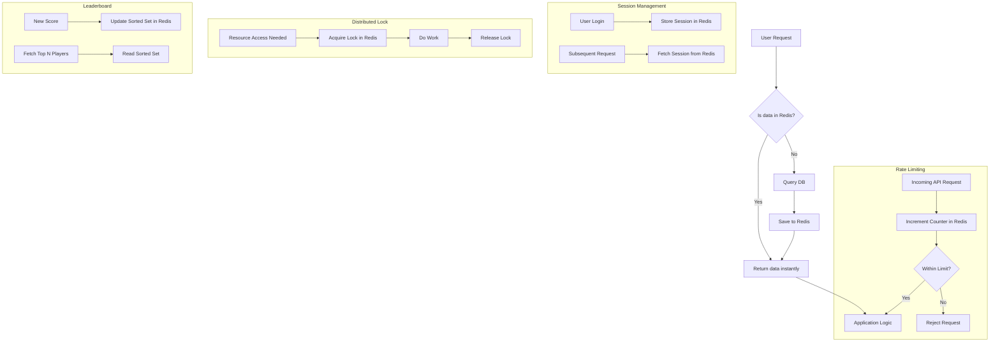

# Redis in System Design: Top 5 Production-Proven Use Cases

---

## 1. Main Concepts (Overview Section)

This documentation walks through the top five most widely adopted Redis use cases in modern system design, drawing on real-world production patterns. You will learn:

- **What Redis is and why it is used**
- **Caching**: Using Redis to accelerate data retrieval and reduce backend load
- **Session Store**: Managing user session state in stateless architectures
- **Distributed Locking**: Coordinating access to shared resources across distributed systems
- **Rate Limiting**: Implementing scalable request-throttling mechanisms
- **Gaming Leaderboards**: Leveraging sorted sets for ranking and real-time scoreboards

Along the way, we will explore Redis’s data structures, operational trade-offs, and design patterns, reinforced with analogies and practical advice.

---

## 2. Detailed Conceptual Flow (Core Documentation)

### What is Redis?  
At its core, **Redis** is an open-source, in-memory data structure store. Unlike traditional databases that store data on disk, Redis holds data directly in memory, which enables exceptionally fast operations. Redis supports a variety of data structures—such as strings, hashes (key-value maps), lists, sets, and sorted sets—making it a versatile tool for diverse system design challenges.

#### Why is Redis so Fast?
Redis’s speed comes from two main factors:
1. **In-memory storage**: All data is kept in RAM, eliminating disk I/O latency.
2. **Efficient data structure implementations**: Operations on structures like lists and sets are optimized for rapid execution.

Now, let’s explore how these qualities make Redis invaluable across five major use cases.

---

### 2.1 Caching: Accelerating Applications and Reducing Database Load

**Caching** is Redis’s flagship use case. In a typical web application, fetching data from a relational or NoSQL database for every user request can quickly overwhelm backend resources and increase response times. Redis solves this by acting as a high-speed intermediary: the application checks Redis for data first (“cache hit”), and only queries the database if the data is not found (“cache miss”).

**Operational Flow:**
1. When a piece of data (e.g., user profile) is requested, the application first looks in Redis.
2. If found, Redis returns the data almost instantly.
3. If not, the application queries the slower database, retrieves the data, stores it in Redis, and serves it to the user.

**Scaling Redis Caches:**
At high scale, a single Redis server may not suffice. To distribute load, Redis clusters can “shard” the cache—dividing the dataset among multiple servers. This is crucial for both performance and resilience.

**TTL and Cache Consistency:**
Each cached item can be given a **TTL (Time-to-Live)**—after which it expires. TTLs help ensure stale data doesn’t persist indefinitely but require careful tuning to balance freshness and efficiency.

#### Example & Analogy:  
Imagine a public library (the database) and a bookshelf near the entrance (Redis cache). When a popular book is frequently requested, the librarian places a copy on the shelf. Patrons check the shelf first, saving time and effort. Only if the book isn’t there does the librarian fetch it from the vast library.

#### Challenges & Trade-offs:
- **Cache Invalidation**: Ensuring updates in the database are reflected in Redis can be tricky.
- **Cold Starts & Thundering Herd**: If the cache is empty (cold start), many requests may simultaneously hit the backend.
- **Distributed Coordination**: Sharding and consistency become critical at scale.

**Best Practices:**
- Use appropriate TTLs based on data volatility.
- Employ cache-aside or write-through patterns.
- Monitor cache hit/miss ratios.

---

### 2.2 Session Store: Enabling Stateless Servers

Modern web applications often run on “stateless” servers, meaning any server can handle any request. But user session data (login state, preferences) must be stored somewhere accessible to all instances. Redis excels as a **session store** because of its speed and built-in data expiration.

**How It Works:**
- When a user logs in, the session data (e.g., user ID, auth token) is stored in Redis, keyed by a unique session ID.
- The session ID is sent to the client as a cookie.
- On subsequent requests, any server can retrieve the session data from Redis using the session ID.

**Persistence and Availability:**
Because Redis is in-memory, data is volatile. If a Redis server restarts, sessions can be lost. Redis offers **AOF (Append-Only File)** and **snapshotting** to persist data to disk, but these are often too slow for rapid recovery in production. Instead, **replication** is employed: a backup Redis instance maintains a copy of the session data and can quickly take over if the primary fails.

#### Example & Analogy:
Think of Redis as a coat check at a large event. Patrons (users) are given a ticket (session ID) when they check in their coats (session data). Any attendant (server) can retrieve a coat as long as the ticket is presented.

#### Trade-offs:
- **Volatility**: Without robust persistence, sessions may be lost on crash.
- **Failover Complexity**: Replication and promotion mechanisms must be tested.

**Best Practices:**
- Use Redis replication for high availability.
- Regularly monitor session expiration and cleanup.

---

### 2.3 Distributed Locking: Coordinating Access Across Systems

In distributed systems, multiple processes may need to coordinate access to a shared resource—like updating inventory or generating unique IDs. **Distributed locks** are essential in these scenarios, and Redis provides fast, atomic primitives to implement them.

**Implementation:**
- A process tries to **acquire the lock** by setting a key in Redis only if it doesn’t already exist (`SETNX` command).
- If the key is set, the process holds the lock and proceeds.
- Upon completion, the key is deleted, releasing the lock.
- If another process tries to set the key while it exists, it must wait and retry.

**Atomicity & Fault Tolerance:**
Redis commands like SETNX are atomic, preventing race conditions. However, a basic implementation may not handle failures (e.g., if a process crashes while holding the lock). Production-grade solutions often employ libraries (e.g., Redlock) that address such edge cases by coordinating locks across multiple Redis nodes.

#### Example & Analogy:
Picture a shared meeting room with a sign-in sheet (the Redis key). If the sheet is blank, the first team signs in and uses the room. Others must wait until it’s signed out.

#### Trade-offs:
- **Simplicity vs. Robustness**: Simple locks are easy but can fail under network partitions.
- **Single Point of Failure**: If Redis becomes unavailable, locking fails.

**Best Practices:**
- Use library implementations for distributed locks.
- Set timeouts to prevent deadlocks.

---

### 2.4 Rate Limiting: Protecting Systems from Overload

**Rate limiting** is a technique to prevent abuse or overload by restricting how often a user or system can perform certain actions (e.g., API requests per minute). Redis’s in-memory speed and atomic increment operations make it ideal for implementing flexible, scalable rate limiters.

**How It Works:**
- Each incoming request increments a counter in Redis, keyed by user ID or IP address.
- If the count exceeds the allowed threshold within a given time window, requests are rejected.
- Counters are set to expire after the time window, resetting the limit.

**Advanced Algorithms:**
More sophisticated patterns, like the **leaky bucket** or **token bucket**, can also be implemented using Redis’s data structures and expirations.

#### Example & Analogy:
Think of a nightclub bouncer (Redis) with a clicker (counter). Each guest (request) is counted. Once the room reaches capacity (limit), new guests must wait until someone leaves (counter expires).

#### Trade-offs:
- **Accuracy vs. Performance**: Sliding window algorithms provide smoother limits but may require more complex data structures.
- **Scalability**: At high scale, distributed counters may become a bottleneck.

**Best Practices:**
- Choose the simplest algorithm that fits your needs.
- Monitor for hot keys (users with disproportionately high traffic).

---

### 2.5 Gaming Leaderboards: Real-Time Ranking with Sorted Sets

Many online games and applications need to maintain real-time leaderboards—ranking users by scores or achievements. **Redis sorted sets** are tailor-made for this scenario.

**How It Works:**
- Each player’s score is added to a sorted set, with the score as the “sort key”.
- Retrieving the top N players or a player’s rank is efficient (logarithmic time).

**Operational Advantages:**
- Sorted sets guarantee uniqueness and order.
- Operations like incrementing a score or fetching rank are atomic and fast.

#### Example & Analogy:
Imagine a dynamic scoreboard at a sports event. As scores change, the board instantly reorders to show the current leaders. Redis’s sorted sets automate this without manual sorting.

#### Trade-offs:
- **Memory Usage**: Large leaderboards can consume significant RAM.
- **Persistence**: In-memory nature may risk data loss without careful backup strategies.

**Best Practices:**
- Regularly persist sorted set data if long-term records are important.
- Prune old or inactive entries to conserve memory.

---

## 3. Simple & Analogy-Based Examples (Integrated Above)

To consolidate understanding, here’s a summary analogy tying all concepts together:

> **Redis as a Digital Office Building:**
> - The *cache* is like a set of frequently used documents kept on everyone’s desk for instant access.
> - The *session store* is the reception desk, keeping track of who’s inside and their badges.
> - The *distributed lock* is a shared meeting room sign-up sheet—only one team at a time.
> - The *rate limiter* is the security turnstile, ensuring not too many people enter too quickly.
> - The *leaderboard* is the office’s achievement wall, always displaying the top performers in real time.

---

## 4. Use in Real-World System Design

### Patterns and Use Cases

- **Microservices**: Redis is often used to decouple services via shared cache or session state.
- **API Gateways**: Employ Redis-based rate limiting to protect backend services.
- **E-commerce**: Use distributed locks for inventory management and caching for product catalogs.
- **Gaming**: Real-time leaderboards and matchmaking rely on sorted sets for performance.

### Design Decisions and Trade-offs

- **Performance vs. Durability**: Redis’s in-memory speed comes at the cost of volatility. For critical data, combine Redis with persistent stores.
- **High Availability**: Use Redis replication and clustering to ensure failover, but be mindful of consistency challenges.
- **Operational Complexity**: Sharding, replication, and failover add operational overhead. Managed Redis solutions can help.

### Best Practices

- Monitor Redis memory and performance metrics proactively.
- Always set TTLs for cache and session entries.
- Use library-provided distributed locking rather than homegrown solutions.
- Regularly back up critical data stored in Redis.

### Anti-Patterns

- **Using Redis as a primary database for critical data**: Risky due to volatility.
- **Unbounded key growth**: Forgetting to set TTLs or prune old data may exhaust memory.
- **Ignoring persistence/replication for session stores**: Leads to data loss on restart.

---

## 5. Advanced Insights

- **Redundant Clustering**: Advanced deployments use Redis Cluster to shard data and provide fault tolerance, but this introduces new consistency and failover complexities.
- **Comparisons**: Memcached offers similar caching capabilities but lacks Redis’s rich data structures and persistence options.
- **Edge Cases**: Network partitions can cause split-brain scenarios in distributed locks. Use robust algorithms like Redlock in critical systems.
- **Memory Optimization**: For massive datasets, Redis 6+ supports “memory-efficient” data structures and eviction policies.

---

## Flow Diagram: Redis in System Design

---

# Conclusion

Redis’s role as a high-speed, flexible in-memory store makes it a cornerstone in modern distributed system design. By mastering its core use cases—caching, session management, distributed locking, rate limiting, and leaderboards—you can architect systems that are both scalable and robust. With careful attention to trade-offs and operational practices, Redis becomes not just a tool, but a foundational platform for high-performance applications.