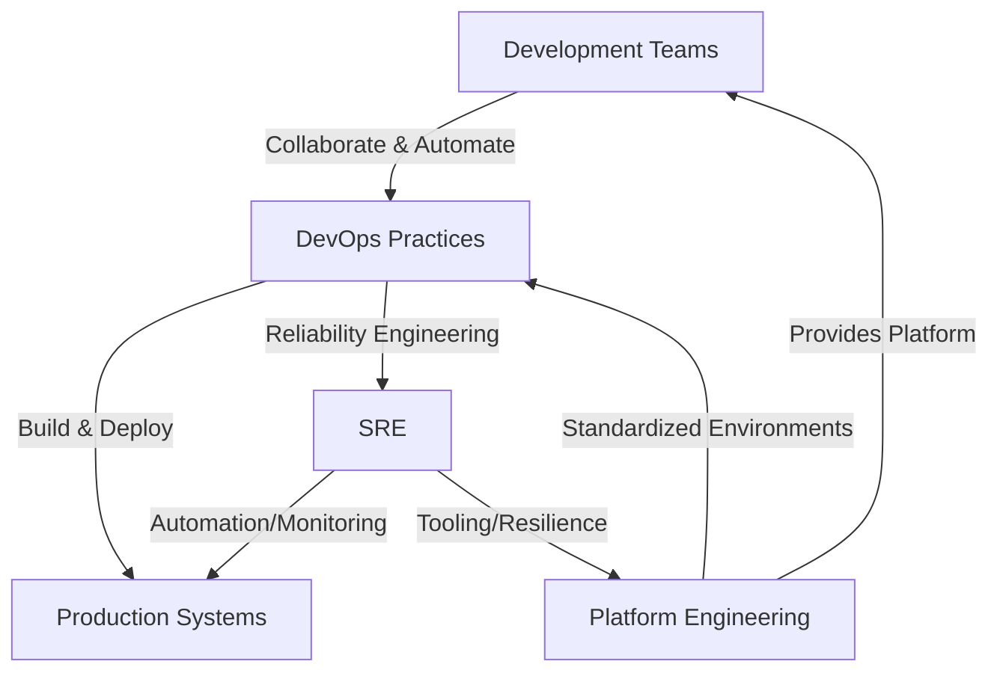

# DevOps vs SRE vs Platform Engineering  
*Clarifying Roles, Synergies, and Misconceptions in Modern Software Delivery*

---

## 1. Main Concepts (Overview Section)

This document demystifies the often-confused domains of **DevOps**, **Site Reliability Engineering (SRE)**, and **Platform Engineering**. You will learn:

- The origins, principles, and goals of DevOps, SRE, and Platform Engineering.
- How these roles differ, where they overlap, and how they commonly blend in real-world tech organizations.
- The practical, day-to-day impact of each discipline on modern software delivery, using examples from industry leaders like Netflix and Amazon.
- Analogies and examples to intuitively anchor each concept.
- How these disciplines are leveraged in system design, the trade-offs they present, and best practices for organizations.
- Advanced insights on the evolving nature of these roles and their future in the tech ecosystem.

---

## 2. Detailed Conceptual Flow (Core Documentation)

### The Evolving Landscape of Software Operations

Modern software delivery is a dynamic interplay between creating new features rapidly and ensuring systems remain stable, scalable, and reliable. Traditionally, **development** (building new features) and **operations** (keeping systems running) were siloed, which often led to friction and inefficiency. The rise of cloud computing, continuous delivery, and large-scale internet services forced a rethinking of these boundaries—giving rise to **DevOps**, **SRE**, and **Platform Engineering**.

### DevOps: Bridging Development and Operations

The term **DevOps** emerged in 2009, coalescing around the idea that building and running software should not be the responsibility of isolated teams. In the DevOps philosophy, developers and operations engineers collaborate closely throughout the software lifecycle—from initial design and building to deployment and ongoing production support.

A central DevOps practice is the principle popularized by Amazon: *“You build it, you run it.”* This means that the teams who write the software are also responsible for deploying, monitoring, and maintaining it. This shared ownership accelerates feedback loops, reduces handoff errors, and encourages a culture of accountability and continuous improvement.

**DevOps** is more about cultural transformation than tools or technologies. In practice, it often involves:

- Automating build, test, and deployment pipelines.
- Shared responsibility for system uptime and incident response.
- Cross-functional teams empowered to deliver features end-to-end.

However, in real organizations, the lines are rarely clear-cut. For example, a cloud engineer automating infrastructure with tools like Ansible and running Kubernetes might be called “DevOps,” but could just as easily be part of operations or SRE, depending on context.

### SRE: Engineering Reliability at Scale

**Site Reliability Engineering (SRE)** originated at Google as a response to the need for robust, scalable, and highly reliable systems. Unlike traditional operations roles, SREs approach operational challenges as software engineering problems—building tools, writing code, and automating processes to ensure system reliability.

SREs act as the **“civil engineers”** of the software world: they ensure infrastructure is well-architected to withstand real-world stresses, like sudden traffic spikes or hardware failures. To do this, they develop practices such as:

- **Service Level Objectives (SLOs):** Quantifying the required reliability (e.g., “99.9% uptime”).
- **Error Budgets:** Allowing for a measured rate of failure, balancing innovation and stability.
- **Automation:** Building systems to automatically recover from failures and manage capacity.

SREs may also develop internal tools to monitor health, manage deployments, and streamline developer workflows—sometimes stepping into the territory of **platform engineering**.

### Platform Engineering: Building the Developer Superhighway

**Platform Engineering** focuses on creating and maintaining the foundational “platform” that enables product developers to deliver high-quality software rapidly and safely. This platform might include:

- Standardized deployment environments.
- Self-service tools for provisioning infrastructure.
- Shared monitoring, logging, and CI/CD pipelines.

The goal is to **abstract away operational complexity** so developers can focus on business logic and user features. For instance, at Netflix, platform engineering teams have built sophisticated internal systems that automate scaling, security, and observability—allowing product teams to deliver new features without reinventing the operational wheel each time.

While platform engineering is heavily technical, it is fundamentally about **aligning technology with the broader business strategy**—ensuring that product development moves quickly, but safely and in accordance with organizational goals.

### Intersections, Synergies, and Fluidity

It is crucial to understand that **DevOps, SRE, and Platform Engineering are not mutually exclusive**. In fact, their boundaries are fluid—practitioners often find themselves working across these domains as projects demand. The real power comes when organizations combine these disciplines, fostering a culture of collaboration, automation, and shared responsibility.

---

## 3. Simple & Analogy-Based Examples

Let’s anchor these concepts with relatable analogies and examples.

Imagine you’re running a **restaurant**:

- **DevOps** is like having chefs and waitstaff work together seamlessly—not just handing off dishes, but collaborating on the menu, presentation, and customer experience from start to finish. If a problem happens during dinner service, everyone pitches in to fix it.
- **SRE** is the role of the **restaurant’s facilities manager and process engineer**: they design the kitchen layout for maximum efficiency, set up backup power for outages, and install systems to monitor food safety and equipment health. When something breaks, they don’t just fix it—they find ways to automate or prevent the problem in the future.
- **Platform Engineering** is like building a **restaurant kitchen as a service**: instead of every chef having to buy their own stove, fridge, and utensils, you provide a fully equipped, standardized kitchen. Chefs can focus on crafting recipes, while the platform team ensures the tools are always available, safe, and up to date.

In the software world:
- At **Amazon**, DevOps means the same team builds and supports each service (“you build it, you run it”).
- At **Google**, SREs write code to automate server management and enforce reliability goals.
- At **Netflix**, platform engineering teams create tools and environments that make it easy for developers to ship new features without worrying about the underlying infrastructure.

---

## 4. Use in Real-World System Design

### Patterns and Use Cases

- **DevOps** patterns are common in organizations seeking to break down silos and accelerate feature delivery. Teams own their services end-to-end, from code to production.
- **SRE** is critical in environments where **reliability at scale** is a business imperative—think of global cloud platforms, streaming services, or ecommerce giants. SREs define measurable reliability goals, build automation, and manage risk using error budgets.
- **Platform Engineering** becomes essential as organizations scale. Rather than every product team solving the same operational problems, a central platform team provides reusable solutions—reducing duplication and improving security and compliance.

### Design Decisions and Trade-Offs

- **DevOps** maximizes agility but can lead to inconsistent practices if not well-governed. Teams may reinvent the wheel, leading to operational chaos at scale.
- **SRE** introduces rigor and reliability, but can be resource-intensive. Over-engineering for reliability may slow down feature development if not balanced.
- **Platform Engineering** provides leverage and standardization, but risks becoming a bottleneck or creating overly rigid platforms that stifle innovation.

#### Example: Streaming Service at Scale

Suppose you’re building a service like **Netflix**:
- DevOps ensures that each feature team can deploy and monitor their microservices independently.
- SREs define uptime goals, automate incident response, and build resilience against traffic spikes.
- Platform engineers provide a self-service deployment pipeline, centralized logging, and shared monitoring dashboards.

This synergy enables rapid innovation, high reliability, and operational efficiency.

### Best Practices and Anti-Patterns

**Best Practices:**
- Foster a culture of shared ownership and collaboration.
- Invest in automation and self-service tooling.
- Set clear reliability goals (SLOs) and measure against them.
- Regularly review and evolve platform capabilities based on developer needs.

**Anti-Patterns to Avoid:**
- Treating DevOps, SRE, or Platform Engineering as siloed job titles rather than shared responsibilities.
- Over-centralizing platform engineering, which can slow teams down.
- Neglecting reliability in pursuit of speed, or vice versa.

---

## 5. Advanced Insights

### Role Evolution and Blurred Boundaries

In practice, few organizations adhere strictly to textbook definitions. A sysadmin who automates infrastructure and builds monitoring tools may be performing SRE-like work. A “DevOps engineer” may be an ops specialist who has learned to code, or a developer who takes on deployment duties.

**The key insight:**  
*Success depends less on rigid job boundaries and more on a culture of collaboration, adaptation, and continuous learning.*

### Comparison Table

| Aspect                | DevOps                                 | SRE                                 | Platform Engineering              |
|-----------------------|----------------------------------------|-------------------------------------|-----------------------------------|
| Main Focus            | Collaboration, speed, shared ownership | Reliability, automation, SLOs       | Enabling developers, abstraction  |
| Origin                | Grassroots, community-driven           | Google (2003+)                      | Industry response to scale (2010s)|
| Scope                 | Broad (process & culture)              | Engineering approach to operations  | Infrastructure as a product       |
| Key Tools/Practices   | CI/CD, automation, monitoring          | Error budgets, SLOs, automation     | Internal platforms, self-service  |
| Pros                  | Faster delivery, less friction         | High reliability, scalable ops      | Dev productivity, standardization |
| Cons                  | Risk of chaos, inconsistency           | Can slow delivery, resource heavy   | Risk of rigidity, bottlenecks     |

### Diagram: How They Interact

---

## Analogy Section: Unifying All Concepts

Think of a **city’s transportation system**:

- **DevOps** are like the city planners and road maintenance crews working together to plan new routes and keep them in good shape—ensuring people (features) move quickly from one place to another.
- **SREs** are the engineers who design traffic lights, build bridges to withstand earthquakes, and implement traffic monitoring to minimize congestion and accidents—ensuring the system is robust and reliable under stress.
- **Platform Engineers** build and maintain the subways, highways, and bike lanes as common infrastructure—so every commuter (developer) can get to their destination efficiently, without worrying about how the roads are constructed.

All three roles are essential for a thriving, scalable city—just as they are for delivering world-class software.

---

## Conclusion

DevOps, SRE, and Platform Engineering are complementary approaches that together enable modern organizations to deliver software rapidly, reliably, and at scale. While their boundaries are fluid and roles may overlap, understanding each discipline’s unique focus—and how they interact—empowers teams to build better systems and adapt as the industry evolves.

**Key Takeaway:**  
*The goal is not to rigidly define roles, but to build cultures and systems that maximize collaboration, automation, and business alignment for resilient, innovative software delivery.*