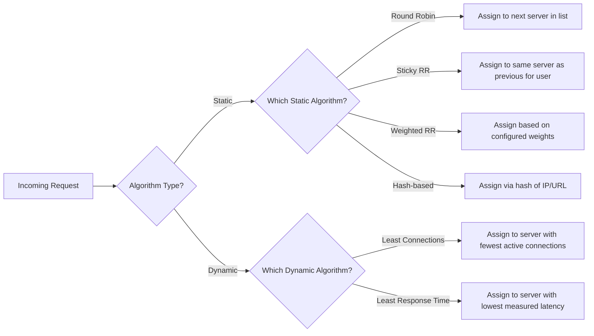

# Load Balancing Algorithms: A Comprehensive Technical Guide

---

## 1. Main Concepts (Overview Section)

In this guide, we will explore the foundational algorithms used for load balancing in large-scale web systems. You will learn:

- **Why load balancing matters** for modern web platforms.
- The **two main categories** of load balancing algorithms:
  - **Static algorithms**: Simple, predefined methods that don’t consider live server state.
  - **Dynamic algorithms**: Adaptive methods that respond to real-time server conditions.
- Deep dives into six essential load balancing algorithms:
  - **Round Robin**
  - **Sticky Round Robin**
  - **Weighted Round Robin**
  - **Hash-Based Routing**
  - **Least Connections**
  - **Least Response Time**
- The **pros and cons** of each approach and how to select the best fit for your system.
- **Analogies and practical examples** to clarify key concepts.
- **Real-world usage patterns, design trade-offs, best practices, and pitfalls** to avoid.

---

## 2. Detailed Conceptual Flow (Core Documentation)

### Introduction: The Need for Load Balancing

Modern web applications, especially those at scale, must answer millions of user requests quickly and reliably. To achieve this, they distribute incoming traffic across multiple backend servers — a process known as **load balancing**. Effective load balancing ensures that no single server becomes a bottleneck, thus maximizing uptime, optimizing response times, and supporting seamless scalability as user demand grows.

But not all load balancing strategies are created equal. Selecting the right algorithm can mean the difference between smooth, cost-effective operations and frustrating, unpredictable service outages.

### Categories of Load Balancing Algorithms

At the highest level, load balancing algorithms fall into two categories:

#### Static Load Balancing Algorithms

**Static algorithms** distribute requests based on fixed rules, without factoring in real-time server performance or load. Their chief advantage is their **simplicity**, which makes them easy to implement and understand. However, this simplicity comes at the cost of adaptability: if one server slows down or fails, a static algorithm may continue sending it traffic regardless.

Let’s examine the main static algorithms:

#### 1. Round Robin

**Round Robin** is the archetype of static load balancing. Imagine a line of servers, and each new request is handed to the next server in line, cycling back to the start after the last one. This ensures an *even* distribution of requests — at least when all servers are equal.

For example, given three servers A, B, and C:
- Request 1 → Server A
- Request 2 → Server B
- Request 3 → Server C
- Request 4 → Server A (cycle repeats)

This approach is straightforward and stateless. However, if one server is slower or less powerful, it may become overwhelmed, as Round Robin does not account for server health or capacity.

#### 2. Sticky Round Robin

**Sticky Round Robin** adds a twist: it tries to send subsequent requests from the *same user* to the *same server*. This is sometimes called "session affinity" or "server stickiness." The idea is to improve performance by keeping user-related data (like session state) local to one server, reducing the need for cross-server communication.

For instance, if User X is routed to Server B, all of User X's future requests will go to Server B during their session. While this can speed up user experiences, it risks uneven server loads, especially as new users are assigned randomly.

#### 3. Weighted Round Robin

**Weighted Round Robin** addresses the issue of servers with differing capabilities. Each server is assigned a "weight" — a number that reflects its capacity or priority. Servers with higher weights receive more requests per cycle.

If Server A is twice as powerful as Server B, it might get a weight of 2, while Server B gets 1. For every three requests, two will go to A and one to B. This makes better use of heterogeneous resources, but requires **manual tuning** of weights — and won’t adapt if server performance changes unexpectedly.

#### 4. Hash-Based Routing

**Hash-based algorithms** use a hash function to map an incoming request to a backend server. The hash input can be the client’s IP address, a session ID, or the requested URL. The output determines which server should handle the request.

This can ensure that the same client or request type consistently goes to the same server, which is helpful for cache locality and session persistence. However, the **choice of hash function** is critical: a poor hash can result in uneven distribution, and even small changes (like adding/removing a server) can disrupt mappings — a problem known as hash instability.

---

#### Dynamic Load Balancing Algorithms

**Dynamic algorithms** improve upon static ones by responding in real-time to server conditions. They monitor live metrics (such as current load, response time, or number of open connections) and adaptively route new requests to servers best positioned to handle them.

Let’s explore the main dynamic approaches:

#### 5. Least Connections

**Least Connections** is a classic dynamic algorithm that routes each new request to the server with the fewest active connections. The logic is that the server with the least work-in-progress is most likely to respond quickly.

This requires the load balancer to **track the number of open connections** on each backend in real time. While this usually leads to a balanced workload, it can backfire if, for example, some connections last much longer than others. A sudden influx of slow requests can pile up on a server, negating the algorithm’s intent.

#### 6. Least Response Time

**Least Response Time** takes adaptivity a step further by routing new requests to the server with the **lowest current latency**. The load balancer continuously measures how fast each server is responding and directs new requests to the fastest.

This method is highly effective in environments where server performance fluctuates, as it always seeks the quickest available resource. However, it comes with overhead: constant health-checking and latency measurement can consume significant resources, and this method does not always account for the number of pending requests on a server.

---

### Transition: Choosing the Right Algorithm

There is no universal “best” load balancing algorithm. Choosing the right one depends on your system’s goals, infrastructure, and operational realities. Simple static algorithms are often sufficient for small or predictable workloads, while complex, dynamic methods shine in large, variable environments.

---

## 3. Simple & Analogy-Based Examples

Imagine a **restaurant with several chefs**:

- **Round Robin**: The host assigns each incoming customer to the next chef, regardless of how busy each chef is. This works if all chefs are equally fast and skilled.
- **Sticky Round Robin**: Regulars are always assigned to the same chef who knows their preferences, making service smoother for them but potentially overloading that chef if they have too many regulars.
- **Weighted Round Robin**: The busiest, most skilled chef gets two customers for every one customer assigned to a less experienced chef.
- **Hash-Based Routing**: The host assigns customers based on the first letter of their surname: all ‘A’ surnames go to Chef 1, ‘B’ to Chef 2, and so on.
- **Least Connections**: The host constantly checks which chef has the fewest active dishes and sends the next customer to that chef.
- **Least Response Time**: The host monitors how quickly each chef is preparing meals and always sends new customers to the chef producing dishes fastest at that moment.

This analogy illustrates how each algorithm distributes work and the kinds of challenges that might arise — such as a chef (server) being overloaded if their assigned tasks are unusually large or slow.

---

## 4. Use in Real-World System Design

### Common Patterns & Use Cases

- **Round Robin** is popular for simple systems or where servers are identical in capacity and reliability.
- **Sticky Round Robin** is often used in applications with session state stored in memory (e.g., shopping carts), minimizing cross-server data dependencies.
- **Weighted Round Robin** is vital in mixed environments, e.g., a web cluster where new and old hardware coexist.
- **Hash-Based Routing** helps with cache-heavy workloads or when user affinity is important.
- **Least Connections** and **Least Response Time** are preferred in highly dynamic or heterogenous environments — such as public cloud deployments where server performance may vary.

### Design Decisions and Trade-offs

- **Static vs. Dynamic**: Static algorithms are easier to operate but less resilient to changing conditions. Dynamic algorithms adapt but require more infrastructure and can introduce latency or complexity.
- **Manual Configuration**: Weighted Round Robin relies on manual weight assignment, which is error-prone and inflexible in rapidly changing environments.
- **Overhead**: Algorithms that require constant real-time monitoring (like Least Response Time) can add significant load themselves and may introduce single points of failure or lag if not carefully implemented.
- **Session Affinity**: Sticky algorithms can keep user experience consistent but risk uneven load distribution and potential "hot spots" if some users are much more active than others.
- **Hash Instability**: Hash-based methods can cause large-scale remapping when servers are added or removed, disrupting session continuity or cache efficiency.

### Best Practices

- Regularly **review and adjust** algorithm parameters (weights, hash functions) as infrastructure or workloads evolve.
- Monitor algorithm effectiveness with real-world metrics: track not just throughput, but also response times and error rates.
- For stateful applications, consider **externalizing state** (e.g., to a distributed cache or database) to reduce session stickiness requirements.
- Employ **health checks** and failover logic to handle server outages gracefully, especially with static algorithms.

### Anti-patterns to Avoid

- Using static algorithms in highly variable, unpredictable environments without monitoring.
- Relying solely on session stickiness in systems with highly uneven user activity.
- Ignoring the impact of adding/removing servers in hash-based routing, leading to user frustration or cache misses.
- Overcomplicating the load balancer with too-frequent health checks or latency measurements, causing it to become a bottleneck.

---

## 5. Optional: Advanced Insights

### Consistent Hashing

An advanced variant of hash-based routing is **consistent hashing**, designed to minimize disruption when servers are added or removed. This is especially valuable in distributed cache or sharded database systems. Instead of mapping requests directly to servers, both servers and requests are mapped onto a ring; only a subset of keys are remapped on topology changes.

### Comparison with Client-Side Load Balancing

While most scenarios use centralized (server-side) load balancers, some architectures (notably, microservices at scale) leverage **client-side load balancing** — where the client itself selects the server. This can reduce infrastructure complexity but shifts the responsibility for balancing and health checking to the client layer.

### Edge Cases & Subtle Behaviors

- **Long-lived connections** (e.g., WebSockets) can skew Least Connections algorithms, as some servers may get stuck with "sticky" clients.
- In **cloud-native environments**, auto-scaling can rapidly change server counts, exacerbating hash-based instability and requiring careful coordination.

---

## Flow Diagram: Load Balancing Algorithm Selection

---

## Conclusion

Understanding the spectrum of load balancing algorithms — from the simplest round robin to the most adaptive latency-based routing — is essential for building robust, scalable web systems. Each approach offers a trade-off between simplicity, efficiency, adaptability, and operational overhead. By aligning your choice of algorithm with your application’s requirements and infrastructure, you can deliver better availability and performance at any scale.

---

**PROs and CONs Table: At a Glance**

| Algorithm           | PROs                              | CONs                                 | Best Fit                         |
|---------------------|-----------------------------------|--------------------------------------|----------------------------------|
| Round Robin         | Simple, stateless                 | Ignores server performance           | Homogeneous, low-variance loads  |
| Sticky Round Robin  | Session affinity, simple          | Uneven distribution possible         | Stateful sessions                |
| Weighted Round Robin| Handles server capacity variations| Manual, static configuration         | Mixed hardware clusters          |
| Hash-Based          | Good for cache/session locality   | Hash instability, uneven distribution| Cache-heavy, affinity workloads  |
| Least Connections   | Adaptive, balances live load      | Can be fooled by long-lived requests | Dynamic, ephemeral workloads     |
| Least Response Time | Highly adaptive, responsive       | High monitoring overhead             | Latency-sensitive environments   |

---

By internalizing these concepts, you'll be better equipped to design, operate, and troubleshoot high-performance distributed systems.