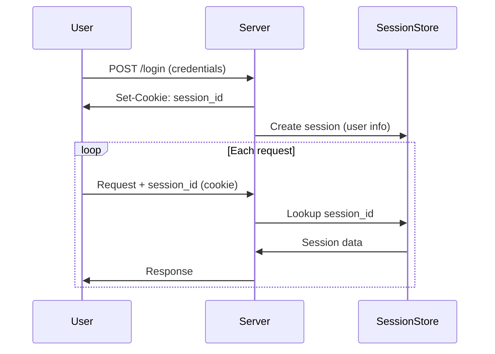
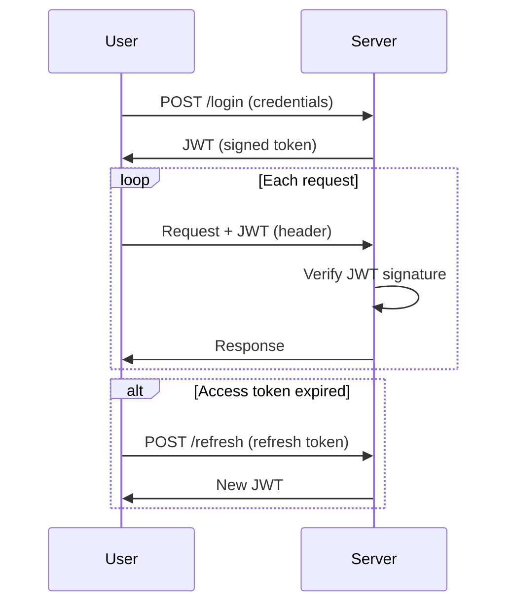

# Session vs. JWT: Understanding Web Authentication Mechanisms

---

## 1. Main Concepts (Overview Section)

This documentation explores two foundational approaches to web authentication: **Session-Based Authentication** and **JWT (JSON Web Token) Authentication**. We will cover:

- **Session-Based Authentication:**  
  - How sessions work
  - The session management flow
  - Their advantages and challenges, especially in distributed systems

- **JWT Authentication:**  
  - The stateless design of JWTs
  - Token generation, signing, and verification
  - The use of symmetric (HMAC) and asymmetric (RSA/ECDSA) algorithms
  - Token expiration, refresh tokens, and security implications

- **Comparative Analysis and Real-World Applications:**  
  - When to use sessions vs. JWTs
  - Impact on scalability, security, and architecture
  - Common system design decisions, trade-offs, and best practices

- **Analogies and Examples:**  
  - Intuitive, real-world analogies to clarify concepts

---

## 2. Detailed Conceptual Flow (Core Documentation)

### Introduction: The Role of Authentication in Web Systems

Modern web applications require a reliable way to verify user identity across multiple requests. Since HTTP is a stateless protocol, authentication mechanisms must provide a way to maintain user identity across otherwise independent requests. Two dominant strategies have emerged: **Session-Based Authentication** and **JWT-Based Authentication**.

---

### Session-Based Authentication: Statefulness at the Core

#### Authentication Flow

When a user attempts to log in, their credentials are sent to the server for verification. Upon successful authentication, the server initiates the creation of a **session**—a data structure that typically includes information like the user’s ID, session expiration time, and possibly other metadata.

This session data is stored **on the server**—either in memory, a database, or a distributed cache like Redis. The server generates a **unique session ID**, a random string that acts as a key to retrieve the session data. This ID is sent back to the client, often as an HTTP-only cookie.

For every subsequent request, the client includes this session ID. The server uses the ID to fetch the session data from its store, authenticates the request, and processes it accordingly.

#### Server Responsibility and Revocation

The critical aspect of session-based authentication is that **the server maintains all session state**. If a session must be revoked (for instance, if a user reports their account as compromised), the server can simply invalidate or delete the session, instantly cutting off access.

#### Scaling Challenges in Distributed Systems

In applications running on multiple servers—such as those behind a load balancer—each server must have access to the same session data. This is commonly handled by adopting a **centralized session store** (e.g., Redis, a distributed SQL database). However, this setup introduces additional complexity and latency, as every authentication check requires a network trip to the session store.

---

### JWT-Based Authentication: Embracing Statelessness

#### Authentication Flow

JWT, or **JSON Web Token**, represents a stateless approach to authentication. After verifying a user’s credentials, the server generates a JWT—a compact, URL-safe token containing all necessary user information and metadata.

This token is **cryptographically signed** (not encrypted) using a secret key (symmetric, as in HMAC) or a private key (asymmetric, as in RSA/ECDSA). The signature ensures the token’s integrity and authenticity, preventing tampering.

The server returns the JWT to the client, which stores it (commonly in local storage or a cookie). On future requests, the client sends the JWT, typically as an HTTP header. The server then verifies the token’s signature and, if valid, trusts the data embedded within to authenticate and authorize the request.

#### Statelessness and Scalability

The defining feature of JWTs is **statelessness**: the server does not retain any session information. All necessary data travels with the client in the token itself. This design greatly simplifies horizontal scaling, as any server instance can validate a request independently, with no coordination required.

#### Signing Algorithms: HMAC vs. RSA/ECDSA

- **HMAC (Hash-based Message Authentication Code):**  
  A symmetric algorithm where the same secret key is used for both signing and verification. It is efficient but requires all verifying services to share the secret, which has security implications.

- **RSA/ECDSA (Asymmetric Cryptography):**  
  These use a private key for signing and a public key for verification. This enables secure, decoupled architectures: only the authentication service needs the private key, while any number of other services can verify tokens using the public key. This is especially valuable in microservices or when interacting with third parties, though it introduces greater computational cost and complexity.

#### Token Expiry and Refresh Tokens

JWTs are often issued with an **expiration time**. If a token is compromised, it remains valid until it expires—a security risk. To address this, systems use **short-lived access tokens** (e.g., 15 minutes) and **long-lived refresh tokens** (lasting days or weeks).

When the access token expires, the client uses the refresh token to request a new access token from a special endpoint. If the refresh token is valid (and not revoked), a fresh access token is issued, typically without user intervention. This approach balances security (limiting exposure if a token is stolen) with user experience (avoiding frequent logins).

---

## 3. Simple & Analogy-Based Examples

### Analogy: The Nightclub Wristband vs. the Coat Check Ticket

**Session-Based Authentication:**  
Imagine a nightclub with a coat check. When you enter and show your ID, the staff gives you a numbered ticket (session ID) and keeps your coat (session data) in the back. Each time you want to do something special—like access the VIP area—you show your ticket. The staff checks their records (session store) to verify your identity and privileges. If you misbehave, the staff can instantly void your ticket and deny you access.

**JWT-Based Authentication:**  
Now, picture a different club that gives you a special wristband (JWT) when you check in. This wristband encodes your access level in a way that only the club’s scanners can verify (the digital signature). You keep the wristband; it contains everything the club needs to know about you. You can enter any area just by scanning it—no one needs to check with the front desk. If your wristband is lost or stolen, it works until it expires, but you don’t need to check in again for a while.

**Summary Table:**

| Mechanism      | Example            | Where Data Lives | Revocation | Scalability | Security Considerations |
|----------------|--------------------|------------------|------------|-------------|------------------------|
| Session        | Coat Check Ticket  | Server           | Instant    | Harder      | Data stays on server   |
| JWT            | Nightclub Wristband| Client           | On expiry  | Easier      | Token can be stolen    |

---

## 4. Use in Real-World System Design

### Session-Based Authentication

**Common Patterns & Use Cases:**
- Traditional web apps with a monolithic backend
- Applications requiring immediate session revocation (e.g., admin panels, sensitive data)
- Systems with centralized state (e.g., single-server deployments, or those already using Redis)

**Design Decisions Influenced:**
- **Session store selection:** Memory (for single server), Redis, or SQL for distributed systems
- **Cookie management:** Secure, HTTP-only cookies for session IDs
- **Load balancing:** Sticky sessions or centralized session stores to ensure session availability

**Trade-Offs & Challenges:**
- **Scalability:** Centralized session stores can become bottlenecks; horizontal scaling is harder.
- **Latency:** Session lookup adds overhead to each request.
- **Security:** Data resides on the server, minimizing exposure if the client is compromised.
- **Revocation:** Simple and immediate—deleting session data invalidates access.

**Best Practices:**
- Use short expiration times for session inactivity
- Secure cookies with `HttpOnly` and `Secure` flags
- Encrypt session data if sensitive information is stored

**Anti-Patterns to Avoid:**
- Storing too much data in the session (can slow down lookups)
- Relying on in-memory sessions in distributed or scaled environments

---

### JWT-Based Authentication

**Common Patterns & Use Cases:**
- Single Page Applications (SPAs) and mobile apps
- Microservices architectures where services need to independently verify user identity
- APIs consumed by third parties where statelessness and portability are crucial

**Design Decisions Influenced:**
- **Token storage:** Local storage, session storage, or cookies (with XSS/CSRF considerations)
- **Signing algorithm choice:** HMAC for simple, trusted environments; RSA/ECDSA for distributed, untrusted, or multi-service environments
- **Access and refresh token strategy:** Balancing UX and security

**Trade-Offs & Challenges:**
- **Revocation:** Harder to revoke tokens before expiry; must design for compromise scenarios.
- **Security:** If a JWT is compromised, it remains valid until expiration unless a token blacklist is implemented.
- **Scalability:** Extremely scalable—no server-side state for authentication.

**Best Practices:**
- Use short-lived access tokens and long-lived refresh tokens
- Store tokens securely; avoid exposing them to JavaScript when possible
- Implement token rotation and blacklisting for refresh tokens

**Anti-Patterns to Avoid:**
- Storing sensitive information in JWT payloads (they’re only signed, not encrypted)
- Using long-lived JWTs without a refresh mechanism
- Sending JWTs via unprotected (non-HTTPS) channels

---

## 5. Optional: Advanced Insights

### Expert Considerations

- **Token Blacklisting:**  
  Some systems implement a blacklist of revoked JWTs (or their unique IDs/jti claims) to provide a revocation mechanism at the cost of reintroducing state.

- **Single Sign-On (SSO):**  
  JWTs are ideal for SSO scenarios, as they can be easily shared and validated across organizational boundaries.

- **Session Fixation and Replay Attacks:**  
  Both mechanisms have their own attack vectors; use secure, random session IDs and validate JWTs’ “iat” (issued at), “exp” (expiration), and “aud” (audience) claims.

### Comparison with Other Approaches

- **Opaque Tokens:**  
  Sometimes, systems use random tokens (like session IDs) but validate them via a backend lookup, blending session and token approaches.
- **Encrypted JWTs (JWE):**  
  For confidentiality, JWTs can be encrypted, not just signed, but this adds complexity and is less commonly needed.

---

### Flow Diagram: Authentication Flows

#### Session-Based Authentication

#### JWT-Based Authentication

---

## Analogy Section: All Concepts Summed Up

Imagine you visit two different amusement parks:

- In **Park A (Sessions)**, you get a numbered ticket at the gate, and every ride attendant checks a master list to verify your eligibility. If your ticket is flagged (lost, misused), it’s instantly invalid across the park.
- In **Park B (JWTs)**, you’re given a wristband encoded with your privileges. Any ride can scan it and let you on. If someone steals your wristband, they can use it until it expires, but you don’t need to keep checking in at the gate.

This analogy encapsulates:
- **Server-side state and instant revocation (sessions)**
- **Self-contained, portable credentials and statelessness (JWTs)**
- **Trade-offs between security control and scalability**

---

## Conclusion

Choosing between session-based and JWT-based authentication hinges on your system’s needs:

- Prioritize **instant revocation, centralized control, and server-side security**? Opt for sessions.
- Need **scalability, statelessness, and cross-service authentication**? JWTs are often the answer, especially with proper refresh token management.

In both cases, careful attention to security, storage, and architectural fit is crucial for a robust authentication system.