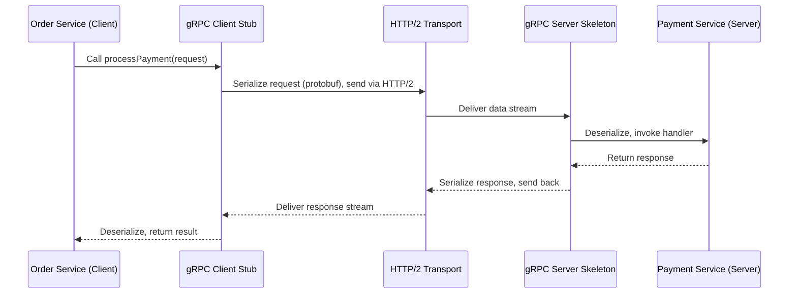

# gRPC and Remote Procedure Calls: A Comprehensive Introduction

---

## 1. Main Concepts (Overview Section)

This documentation introduces the foundational ideas behind Remote Procedure Calls (RPC) and their modern evolution in the form of gRPC, Google’s open-source RPC framework. The following key topics are covered:

- **What is an RPC?**  
  Understanding local vs. remote procedure calls, and why RPC is important.

- **gRPC: Origins and Purpose**  
  The history, goals, and general adoption of gRPC in distributed systems.

- **Protocol Buffers (protobuf): The Heart of gRPC**  
  How protocol buffers provide efficient, strongly-typed, cross-language data interchange.

- **gRPC Architecture and Workflow**  
  The process of defining services, generating client/server code, and executing calls.

- **Performance Benefits of gRPC**  
  Why gRPC is fast: binary encoding and HTTP/2-based transport.

- **Limitations in Web Environments**  
  Why gRPC is not widely used directly between browsers and servers.

- **When and Where to Use gRPC**  
  Typical use cases, system design considerations, and best-fit scenarios.

---

## 2. Detailed Conceptual Flow (Core Documentation)

### What is an RPC?

At the core of distributed systems communication lies the concept of the *Remote Procedure Call* (RPC). Traditionally, a *procedure call* refers to invoking a function within the same process or application — the kind of operation programmers routinely perform, such as calling `calculateSum(a, b)`. However, as software systems grew to span multiple machines, the need emerged to execute code on a different host as easily as making a local function call. This is where RPC becomes pivotal: it allows a program running on one machine to invoke a procedure on another machine, with the call appearing almost indistinguishable from a local function invocation.

This abstraction simplifies distributed programming by hiding the complexities of network communication, data serialization, and error handling beneath a familiar programming interface.

### Enter gRPC: Modern RPC for Distributed Systems

gRPC is an open-source RPC framework developed by Google, first released in 2016 as a public rewrite of their internal RPC infrastructure. Its design addresses the needs of organizations operating complex, large-scale distributed systems—such as microservices architectures—where numerous services, potentially in different languages, must communicate efficiently and reliably, both within and across data centers.

gRPC has become the preferred RPC mechanism for inter-service communication in many organizations, thanks to its combination of strong typing, broad language support, high performance, and robust tooling.

### Protocol Buffers: Efficient, Cross-Language Data Interchange

At the heart of gRPC is its use of *protocol buffers* (often abbreviated as *protobuf*), a language- and platform-neutral mechanism for serializing structured data. Protocol buffers provide several critical advantages:

- **Strongly-Typed Schema Definition:**  
  Data structures are formally defined in `.proto` files, specifying exactly what data is expected and its types. This schema ensures that both sender and receiver agree on the structure of exchanged messages.

- **Automatic Code Generation and Language Agnosticism:**  
  From a single `.proto` file, tooling can generate data classes and serialization code for most popular programming languages (e.g., Go, Java, Python, C++, etc.). This means a service written in Java can communicate seamlessly with another written in Go, with both sides confident in the data’s structure.

- **Efficient Binary Encoding:**  
  Protocol buffers serialize data into a compact binary format, which is both faster to encode/decode and smaller over the wire than formats like JSON.

While gRPC technically supports other data formats (like JSON), protocol buffers are the default and preferred choice due to their efficiency and strong typing.

### Defining Services and RPC Methods with Protobuf

Both the structure of the messages exchanged and the available remote procedures (the *service interface*) are defined in the `.proto` file. Each RPC method specifies its input (request) and output (response) message types. Once defined, gRPC tooling generates:

- **Client-side Stubs:**  
  Code that allows applications to invoke remote procedures as if they were local functions.

- **Server-side Skeletons:**  
  Code that receives requests, decodes data, and dispatches them to application logic.

This approach ensures consistency, strong typing, and eliminates boilerplate networking code.

### gRPC’s High Performance: Binary Encoding and HTTP/2

gRPC’s reputation for high performance stems from two main sources:

1. **Protocol Buffers’ Binary Format:**  
   Compared to text-based formats like JSON, protocol buffers are much faster to serialize and deserialize, and they generate smaller messages, reducing bandwidth usage.

2. **HTTP/2-based Transport:**  
   gRPC uses HTTP/2 as its underlying transport protocol, which brings several enhancements over the older HTTP/1.1 standard:
   - **Multiplexed Streams:** Multiple logical requests and responses (streams) can share a single TCP connection, improving resource utilization and reducing latency.
   - **Persistent Connections:** Connections can be long-lived, further reducing connection setup overhead.
   - **Binary Framing:** HTTP/2 is itself binary and optimized for machine parsing.

As a result, gRPC can handle many concurrent RPC calls efficiently, with claims of being up to five times faster than JSON-based alternatives.

### Walking Through a gRPC Call

Consider a typical microservice scenario: an *Order Service* needs to request payment processing from a *Payment Service*.

1. **Client Invocation:**  
   The Order Service calls a method on its generated client stub, passing in a request object.

2. **Serialization:**  
   The stub serializes the request into protocol buffers.

3. **Network Transmission:**  
   The gRPC library sends the serialized data over an HTTP/2 stream to the Payment Service.

4. **Server Reception and Processing:**  
   The Payment Service receives the data, deserializes it, and invokes the corresponding application logic.

5. **Response:**  
   The result is serialized (again using protocol buffers), transmitted back over the same HTTP/2 stream, decoded by the Order Service, and returned to the caller.

This flow encapsulates the essence of gRPC: strong typing, cross-language compatibility, and high performance, all while presenting a simple function-call interface to developers.

### Why Isn’t gRPC Used Directly from Browsers?

Despite its advantages, gRPC is not widely used for browser-to-server communication. The primary reason is that web browsers do not expose the low-level HTTP/2 primitives required by gRPC. While HTTP/2 is supported by browsers, the APIs do not allow the kind of control over streams and frames that gRPC needs.

A workaround exists in the form of *gRPC-Web*, a variant that uses HTTP/1.1 or HTTP/2 with a proxy to translate between browser requests and backend gRPC services. However, gRPC-Web does not support the full feature set of native gRPC and sees limited adoption compared to RESTful or WebSocket APIs.

### Where Does gRPC Shine?

gRPC’s strengths align with inter-service communication within data centers, especially in microservices architectures. Its language-agnostic approach lets teams choose the best technology for their needs, while its performance and efficiency are advantageous in both server environments and resource-constrained settings like mobile devices.

---

## 3. Simple & Analogy-Based Examples

To clarify these concepts, consider the following analogy:

**Analogy: The Postal Service vs. Phone Call**

Imagine you want to request a document from a friend in another city. You could write a letter (like making an HTTP request), mail it, and wait days for a reply. Alternatively, you could call your friend and ask directly, getting an immediate response.

- **Traditional HTTP/REST:** Like sending letters—clear, self-describing, but slow and verbose.
- **gRPC:** Like a phone call—direct, quick, and using a shared language (protocol buffers) for efficient communication.

**Simple Example in Context:**

Suppose the *Order Service* (written in Java) needs to call `ProcessPayment` on the *Payment Service* (written in Go):

- Both teams agree on a `.proto` file describing the `ProcessPayment` request and response.
- Code generation tools create Java and Go classes for the client and server.
- The Java client calls `processPayment()` as if it were a local function; under the hood, data is serialized, transmitted, processed, and the result returned—all transparently.

---

## 4. Use in Real-World System Design

### Common Patterns and Use Cases

- **Microservices Communication:**  
  gRPC is frequently used for high-volume, low-latency communication between backend services, replacing REST/JSON APIs where performance and strong typing are priorities.

- **Polyglot Systems:**  
  Teams can use different languages for different services, as long as they adhere to the shared `.proto` contracts.

- **Mobile Backends:**  
  gRPC is increasingly used in mobile and IoT backends, where bandwidth and battery efficiency are critical.

### Design Decisions Influenced by gRPC

- **Service Contracts:**  
  The use of `.proto` files formalizes API contracts, promoting stability and documentation.

- **Tooling Automation:**  
  Code generation reduces manual errors and ensures consistency across language boundaries.

- **Transport Efficiency:**  
  HTTP/2 multiplexing and persistent connections minimize latency and overhead in high-throughput systems.

### Trade-offs and Challenges

- **Browser Compatibility:**  
  Native gRPC clients are not feasible in browsers; gRPC-Web is a partial solution but comes with limitations.

- **Learning Curve:**  
  Teams new to protocol buffers and code generation must adapt to a new workflow.

- **Debugging and Monitoring:**  
  Binary formats are less human-readable than text-based alternatives, complicating debugging without proper tooling.

- **Versioning:**  
  Maintaining backward compatibility as `.proto` definitions evolve requires discipline and planning.

#### Best Practices

- **Careful Schema Evolution:**  
  Use protocol buffer’s support for optional fields and explicit versioning to maintain compatibility.

- **Centralized `.proto` Repositories:**  
  Store and manage proto files centrally to avoid drift and encourage reuse.

- **Comprehensive Tooling:**  
  Invest in monitoring and debugging tools that understand gRPC/protobuf traffic.

#### Anti-patterns to Avoid

- **Treating gRPC as a Drop-in for REST APIs:**  
  gRPC’s strengths differ from traditional REST; using it for public-facing APIs, especially to browsers, often leads to frustration.

- **Ignoring Cross-Version Compatibility:**  
  Careless changes to proto schemas can break clients and servers in production.

---

## 5. Optional: Advanced Insights

- **Streaming RPCs:**  
  gRPC supports not just simple request/response, but also server-side, client-side, and bidirectional streaming, allowing for complex real-time interactions.

- **Comparisons to REST and GraphQL:**  
  REST is better suited for public APIs and wide compatibility. gRPC excels in internal, high-performance, strongly-typed environments. GraphQL offers flexible queries but at the cost of additional complexity.

- **Edge Cases:**  
  Network intermediaries (proxies, load balancers) may not always handle HTTP/2 optimally, requiring careful infrastructure planning.

---

## 6. Unified Analogy Section

To sum up, think of system communication as different forms of messaging:

- **REST/JSON APIs:** Like postcards—anyone can read and write them, but they’re slow and sometimes verbose.
- **gRPC/protobuf:** Like encrypted, real-time radio—fast, efficient, and only those with the right decoder (the `.proto` schema) can understand.

Just as a walkie-talkie requires both parties to agree on the channel and language, gRPC requires services to agree on the proto schema, enabling fast, clear, and efficient conversations across the system.

---

## 7. Flow Diagram: Typical gRPC Call

---

## 8. PROs and CONs (with Practical Examples)

**PROs:**
- **Performance:**  
  gRPC/protobuf is significantly faster and more bandwidth-efficient than REST/JSON. (e.g., high-frequency trading platforms, real-time analytics)

- **Strong Typing and Code Generation:**  
  Reduces bugs and accelerates development (e.g., large teams with multiple language stacks).

- **Streaming Support:**  
  Enables advanced use cases like live data feeds or chat applications.

- **Language Agnosticism:**  
  Facilitates polyglot architectures (e.g., Java services talking to Go, Node.js, or Python).

**CONs:**
- **Limited Browser Support:**  
  Not suitable for direct web-client to server communication without workarounds.

- **Binary Protocol Complexity:**  
  Harder to debug manually; requires specialized tools.

- **Infrastructure Requirements:**  
  Relies on HTTP/2; older proxies/load balancers may need updates.

---

## 9. Conclusion

gRPC represents a significant advancement in RPC frameworks, offering high efficiency, strong typing, and broad language support, making it a natural choice for modern distributed systems—especially within microservices architectures and performance-critical environments. While it is not a universal replacement for all APIs (notably those accessed directly from browsers), its strengths make it a powerful tool for backend, mobile, and inter-service communication. By adopting gRPC thoughtfully, teams can build scalable, robust, and high-performance systems for the future.