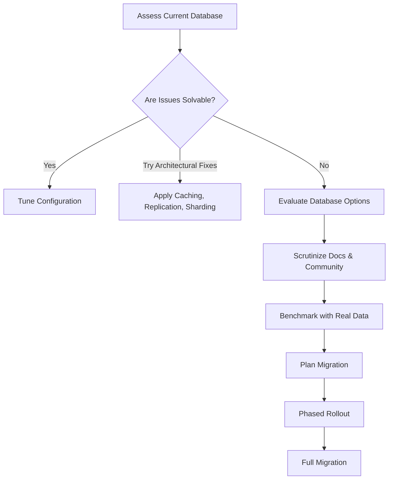

# How To Choose The Right Database for a Scalable System

---

## 1. Main Concepts (Overview Section)

This documentation walks you through the critical process of selecting the right database for a rapidly growing and highly scalable system. The journey includes:

- **Assessing the Need for Change:** Questioning if a new database is truly necessary and exploring optimizations within your current system.
- **Understanding and Pushing Current Limits:** Reading documentation, tuning configurations, and applying architectural fixes such as caching, replication, and sharding.
- **Recognizing the Risks of Migration:** Weighing the significant operational risks and costs involved in migrating production databases.
- **Evaluating New Database Options:** Prioritizing mature, well-supported databases, understanding trade-offs, and digging into real-world limits beyond marketing claims.
- **Benchmarking Candidates Realistically:** Testing shortlisted databases under realistic, stress-heavy workloads that match your use case.
- **Migration Planning and Execution:** Designing and reviewing a meticulous, phased migration plan and learning from limited-scope rollouts.
- **Understanding Trade-offs and Best Practices:** Grasping architectural implications, operational challenges, and community wisdom for a successful transition.

By the end, you will have a comprehensive understanding of how to approach database selection pragmatically, with attention to both technical and organizational realities.

---

## 2. Detailed Conceptual Flow (Core Documentation)

### Introduction: The Criticality of Database Choice

For a fast-growing business, the choice of database is often a make-or-break technical decision. The right selection fuels scalability and reliability; the wrong one can cause outages, data loss, and business impact. Therefore, the process must be grounded in careful need assessment, technical rigor, and operational caution.

### Step 1: Do You Really Need a New Database?

Before considering new technologies, scrutinize your current system's pain points. Is the database truly the bottleneck? Typical signs include soaring latency (such as p95 — the 95th percentile response time — spiking), memory exhaustion, or excessive disk reads slowing down basic queries.

However, these symptoms may be addressable with configuration changes. Databases are highly tunable systems offering parameters for memory allocation, compaction strategies, and garbage collection. By exhaustively reading the official documentation—often overlooked—hidden optimizations can be surfaced. Consulting with expert practitioners or active community members can also reveal surprising avenues for relief.

### Step 2: Maximizing Current System Headroom

If configuration tweaks are insufficient, consider architectural solutions to delay a major migration:

- **Caching:** Placing an in-memory cache (e.g., Redis or Memcached) in front of the database can offload frequently accessed data, reducing read pressure.
- **Replication:** Adding replica nodes allows you to distribute read-heavy workloads.
- **Sharding:** Partitioning data across multiple database instances can align with natural data boundaries, increasing throughput and storage.

Each of these techniques buys time and capacity. However, every workaround introduces complexity and potential new failure modes.

### Step 3: Recognizing Migration Risks

Migrating a live, production-scale database is a high-stakes and costly endeavor. It threatens downtime, can cause data loss, and frequently takes much longer than expected—sometimes years in high-scale environments. Exhaust all avenues to keep using the current system before proceeding.

### Step 4: Evaluating Database Candidates

If migration is unavoidable, resist the allure of "shiny" new databases. In production, "boring" is good: time-tested, widely adopted systems have established tooling, robust documentation, and a pool of experienced operators.

Industry context matters. Highly regulated fields (like banking) demand even more conservatism and proven technology. Favor databases with active communities and broad talent pools to ease hiring and support.

### Step 5: Scrutinizing Trade-offs and Marketing Claims

Every database makes trade-offs—there is no "free lunch." Marketing often touts infinite horizontal scalability, but these claims hide costs. To uncover real limitations:

- Consult the **limits** and **FAQ** sections of the documentation, not just the product brochure.
- Recognize that newer systems, especially NoSQL databases, may sacrifice transactional integrity (ACID guarantees) or flexible querying in favor of scale.
- Highly denormalized data models—where data is duplicated for different access patterns—may be required, complicating updates and consistency.

### Step 6: Deep-Dive Research

Go beyond official sources:

- Join database-specific chat rooms or community forums.
- Read open-source issue trackers (e.g., GitHub).
- Ask pointed questions about operational pain points, edge cases, and scaling stories.

This investment is minimal compared to the cost of a failed migration.

### Step 7: Realistic Benchmarking

Once the candidate list is narrowed, set up a **test bench** using your own data and access patterns. Synthetic benchmarks rarely mirror real-world complexity. Key points:

- Measure high percentiles (e.g., p99 latency), not just averages.
- Simulate operational failures (node outages, network partitions).
- Experiment with scaling operations (adding/removing shards).
- Observe behavior under stress and during risky operations.

A thorough benchmark may take weeks, but the risk of cutting corners is far greater. You are staking your system’s future on these results.

### Step 8: Planning and Executing Migration

After selecting the best-fit database, devise a **step-by-step migration plan**. Peer review this plan for completeness and risk mitigation. Where possible, migrate a non-critical service first to uncover unforeseen issues. Learn and iterate before a full switchover.

### Continuous Learning and Realism

Database migration and scaling are marathon tasks, not sprints. Expect the migration of a high-scale, mission-critical system to span months or even years. Diligence, realism, and operational discipline are your best allies.

---

## 3. Simple & Analogy-Based Examples

### Example: Caching in Action

Suppose your e-commerce site’s database is overwhelmed by repeated product catalog lookups. By introducing a cache layer, the most common queries are served from memory, dramatically reducing database load and improving response times. This can defer the need for a risky database migration.

### Analogy: Choosing a Database is Like Picking a Family Car

Imagine you’re selecting a family car, not for weekend joyrides, but for daily school runs, groceries, and long road trips. The latest sports car might look tempting (shiny, new, fast in ads), but what you need is a reliable, well-supported model with proven safety records, available mechanics, and spare parts. The "boring" minivan might not turn heads, but it gets the job done, is easy to maintain, and keeps your family safe. Similarly, your database should be chosen for reliability, support, and proven performance, not just for the most exciting new features.

---

## 4. Use in Real-World System Design

### Common Patterns & Use Cases

- **Relational Databases (e.g., PostgreSQL, MySQL):** Well-suited for transactional systems where data consistency and flexible querying are required.
- **NoSQL Databases (e.g., Cassandra, MongoDB):** Effective for massive, distributed workloads with high write throughput, where data can be denormalized and transactional guarantees are relaxed.
- **Caching Layers (e.g., Redis):** Used to offload hot reads and improve latency-sensitive services.
- **Sharding:** Appropriate when natural data boundaries exist (such as region or customer ID).

### Design Decisions Influenced by Database Choice

- **Data Modeling:** Some databases require denormalized, duplicate data for performance; others support normalized, relational models.
- **Consistency vs. Availability:** CAP theorem trade-offs are real—highly available, partition-tolerant databases often weaken consistency.
- **Operational Complexity:** Distributed databases may simplify scaling but complicate deployments, monitoring, and failure recovery.

### Trade-offs, Challenges, and Examples

- **PRO:** A well-chosen, mature database reduces operational surprises and supports business growth.
- **CON:** Overly novel or untested systems can introduce downtime, data issues, or talent shortages.
- **PRO:** NoSQL systems can scale horizontally, handling internet-scale workloads.
- **CON:** They may lack cross-entity transactions, requiring application-level consistency management.

### Best Practices

- Always validate claims with real-world tests.
- Prioritize documentation, community support, and operational tooling.
- Plan migrations with exhaustive detail and iterative rollouts.
- Prefer mature, widely adopted technologies unless there is a compelling, validated need.

### Anti-Patterns to Avoid

- **Jumping to new tech for its own sake:** Avoid chasing trends without a proven need.
- **Underestimating migration complexity:** Never treat database migration as a quick fix.
- **Ignoring operational realities:** Factor in backup, restore, monitoring, and failure scenarios.

---

## 5. Optional: Advanced Insights

### Deeper Considerations

- **Hybrid Approaches:** Sometimes, using multiple databases for different workloads (polyglot persistence) can yield the best results, e.g., a relational database for billing, NoSQL for activity logs.
- **Edge Cases:** Under extreme partitioning, some databases may exhibit subtle data loss or split-brain behaviors—critical to test in benchmarks.
- **Vendor Lock-in:** Proprietary features can create long-term dependencies; weigh the cost of flexibility vs. convenience.

### Comparing Similar Concepts

- **SQL vs. NoSQL:** SQL offers strong consistency and flexible queries; NoSQL offers scale and availability, often at the cost of consistency and query flexibility.
- **Self-Managed vs. Managed Services:** Managed databases reduce operational overhead but may constrain configuration or introduce cost unpredictability.

---

## Analogy Section: Tying Concepts Together

Think of your database as the heart of a city’s transportation system. If roads (queries) are congested, you can upgrade signals (configuration), add express lanes (caching), build more roads (replication), or split regions into districts (sharding). But if the city outgrows its infrastructure, you may need a new master plan (database migration). Choose proven designs with established support; experimental layouts may look futuristic but risk gridlock and chaos. Test new blueprints in simulations before breaking ground. And remember: the best city for families is not the flashiest, but the most reliable and well-served.

---

## Flow Diagram

---

## Conclusion

Selecting and migrating to a new database in a high-scale, real-world environment is a nuanced, risk-laden process. Prioritize proven technology, validate every claim with your data, and plan meticulously. The glamour is in the diligence, not the novelty. Approach the task with rigor, humility, and a relentless focus on reliability—your users, and your future self, will thank you.