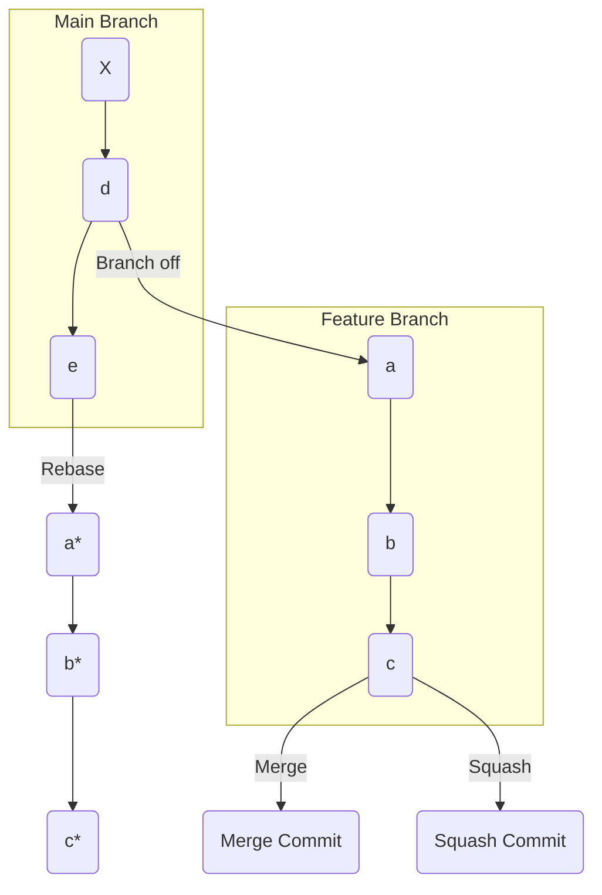
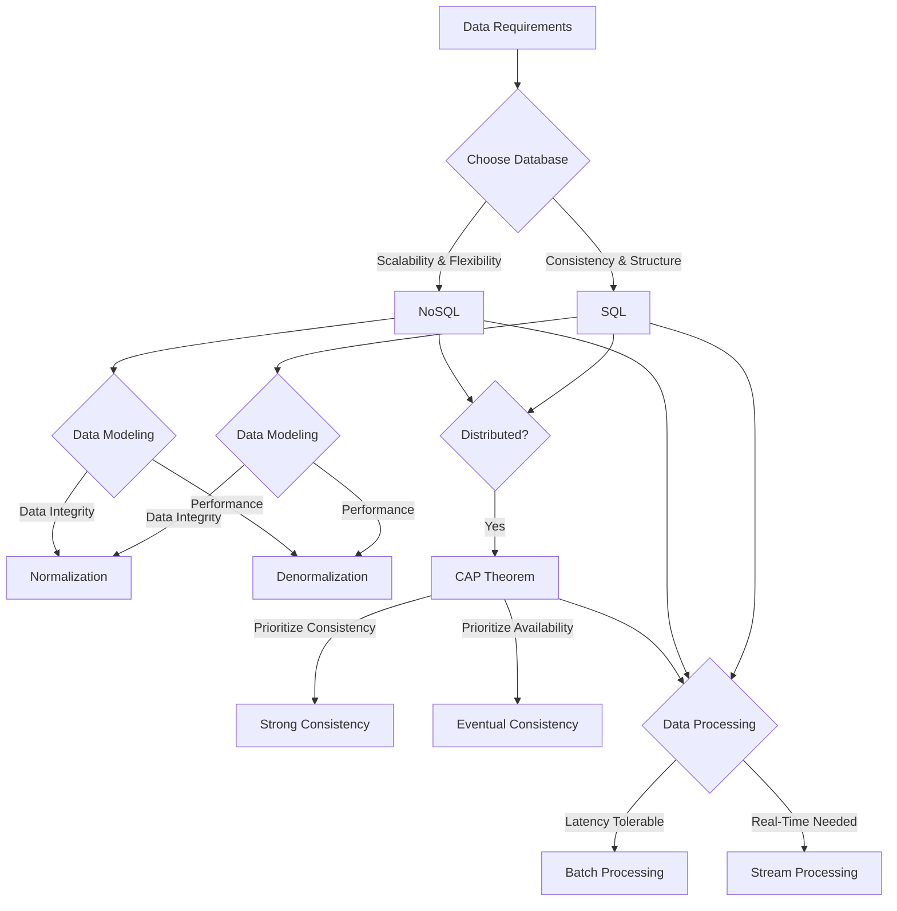
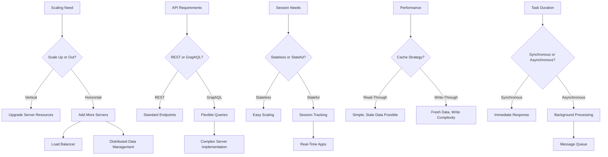
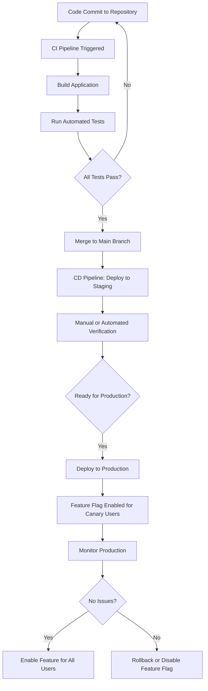
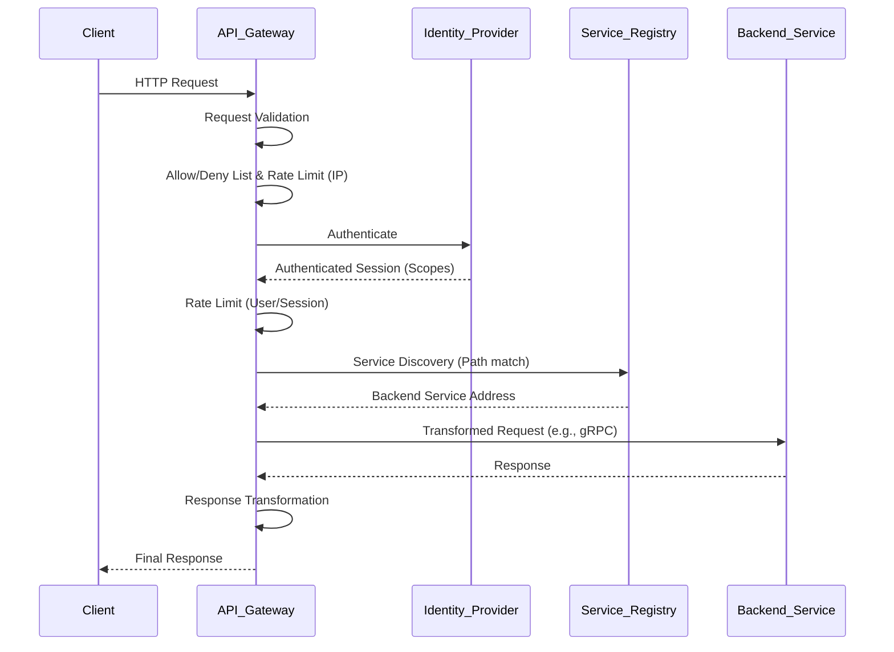
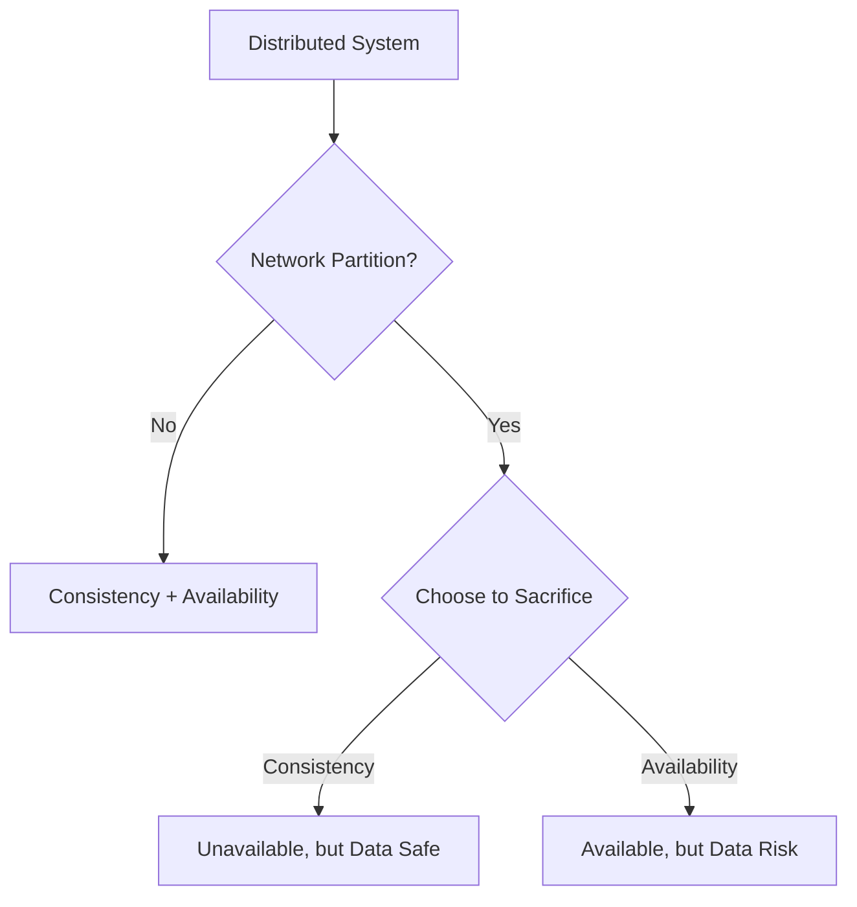
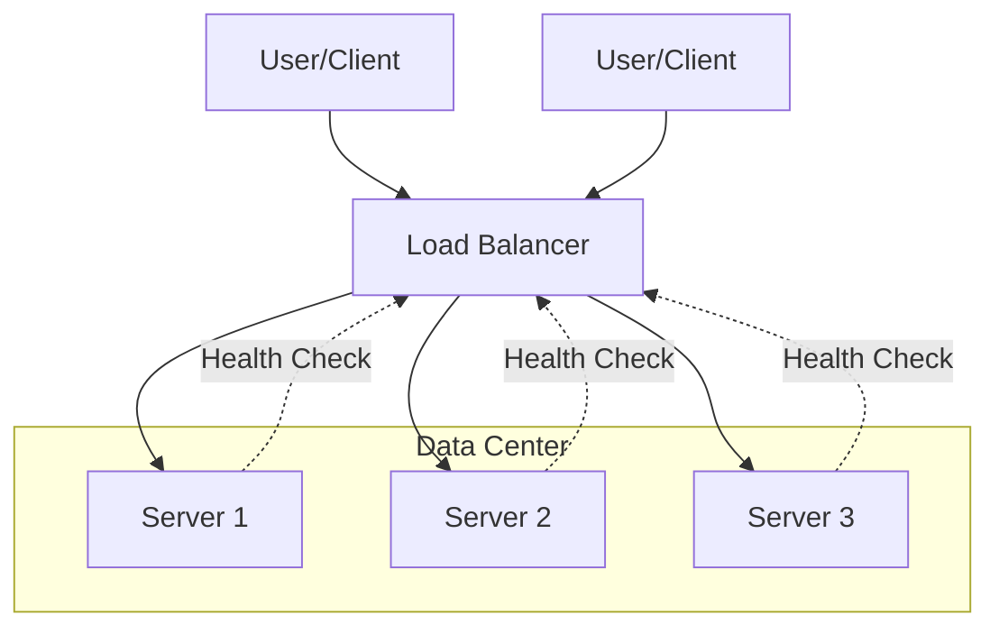
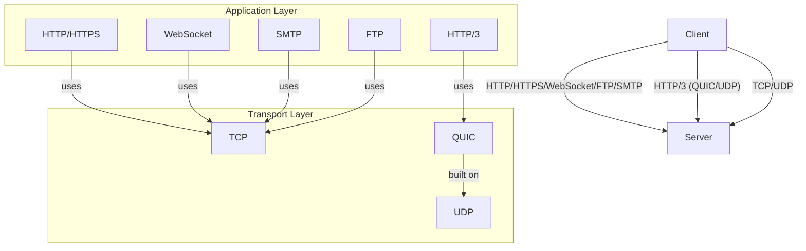
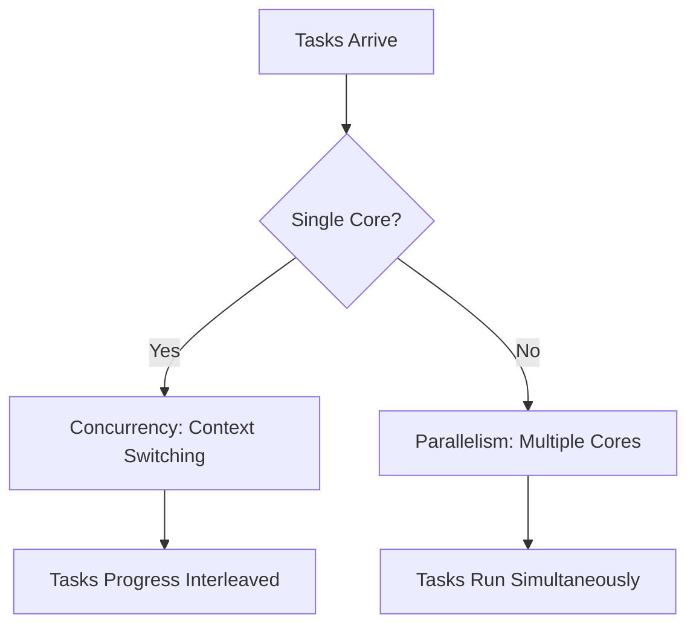

# Combined System Design Notes


---

## -Rdyefvntxi

# Apache Kafka Fundamentals: Technical Documentation

---

## 1. Main Concepts (Overview Section)

This document provides a comprehensive, step-by-step understanding of Apache Kafka, focusing on its fundamental architecture, message handling, and real-world use. Below is the high-level outline of what you will learn:

1. **Kafka Overview**  
   - What Kafka is and why it matters for modern data systems.

2. **Kafka Core Architecture**  
   - Producers, brokers, and consumers.
   - Kafka messages and their structure.

3. **Topics and Partitions**  
   - How Kafka organizes and distributes data for scalability.

4. **Scalability, Reliability, and Performance**  
   - Handling multiple producers/consumers.
   - Consumer groups and offsets.
   - Retention policies and fault tolerance.

5. **Producer and Consumer Mechanics**  
   - Batching, partitioning, and group coordination.
   - Failover and partition rebalancing.

6. **Kafka Cluster Design**  
   - Brokers, replication, and the leader-follower model.
   - Metadata coordination (Zookeeper and CRAFT).

7. **Real-World Applications of Kafka**  
   - Typical industry use cases and patterns.

8. **Analogy Section**  
   - Reinforcing concepts with real-world analogies.

9. **System Design Considerations**  
   - Patterns, trade-offs, best practices, and anti-patterns.

10. **Advanced Insights**  
    - Evolution from Zookeeper to KRaft and expert-level considerations.

---

## 2. Detailed Conceptual Flow (Core Documentation)

### Introduction: What is Kafka?

Apache Kafka is a distributed event store and real-time streaming platform. Think of it as a powerful backbone for data pipelines, handling the ingestion, storage, and delivery of high-throughput data streams. Originally built at LinkedIn to address the need for robust, scalable event handling, Kafka is now a cornerstone technology for companies with data-intensive applications.

### Kafka’s Data Flow: Producers, Brokers, and Consumers

At its core, Kafka orchestrates the flow of data between three primary components:

- **Producers** are the applications or services that create and send data (events) into Kafka.
- **Brokers** are the Kafka servers responsible for receiving, storing, and managing incoming data.
- **Consumers** are applications or services that read, process, and react to data from Kafka.

This producer-broker-consumer pipeline forms a robust, decoupled system where data producers and consumers can operate independently, enabling scalable and fault-tolerant architectures.

#### Kafka Messages: The Atomic Unit

Each piece of data in Kafka is encapsulated as a **message**. A message in Kafka has three key parts:

- **Headers**: Metadata about the message (such as timestamp, content-type, or custom tags).
- **Key**: An optional identifier used for organizing and routing messages (e.g., user ID, device ID).
- **Value**: The actual data payload, such as a JSON event or log entry.

This structure allows Kafka to efficiently handle and route high volumes of data while supporting advanced features like partitioning and message ordering.

### Organizing the Stream: Topics and Partitions

Kafka doesn’t just dump messages into a giant bucket. Instead, it organizes messages into **topics**, which represent categories or logical streams of data—like “user_signups” or “order_events.” Topics provide a way to segment and manage different data flows within the same Kafka cluster.

To further enhance scalability and throughput, each topic is split into **partitions**. Partitions are the key to Kafka’s horizontal scalability. By distributing partitions across multiple brokers, Kafka enables parallel processing of messages and ensures that data flow can scale with demand.

### Scalability, Reliability, and Performance

Kafka’s architecture is designed to support large numbers of producers and consumers without performance degradation. Multiple producers can send messages to the same topic simultaneously, and Kafka efficiently manages concurrent reads by allowing **multiple consumer groups** to access the same topic independently.

#### Consumer Groups and Offsets

A **consumer group** is a set of consumers working together to process the data within a topic. Each partition in a topic is assigned to exactly one consumer in the group, ensuring that each message is processed once per group. If a consumer fails, Kafka automatically reassigns its partitions to other consumers in the group, maintaining continuity.

Kafka keeps track of what each consumer has read using a mechanism called the **Consumer Offset Store**. This enables consumers to resume processing from their last position in case of failure, providing at-least-once delivery semantics.

#### Retention Policies

Unlike traditional queues, Kafka doesn’t delete messages as soon as they are consumed. Instead, messages are retained on disk for a configurable period (time-based) or until the topic reaches a certain size (size-based). This disk-based retention policy lets multiple consumers independently process data at their own pace and enables replaying of data for recovery or reprocessing.

### Producer and Consumer Mechanics: Batching, Partitioning, and Coordination

Kafka producers optimize throughput by **batching** messages together before sending them to the broker, reducing network overhead. When sending a message, the producer must decide which partition it should go to. This is handled by a **partitioner**:

- If a message has a key, all messages with the same key go to the same partition, ensuring order for that key.
- If no key is provided, Kafka distributes messages randomly across partitions to balance the load.

On the consumer side, **consumer groups** coordinate via Kafka’s group coordinator. When a consumer joins or leaves a group, Kafka triggers a **rebalance** to distribute partitions evenly across the group. This ensures high availability and dynamic scaling.

If a consumer fails, another consumer automatically takes over its partitions, ensuring no data is lost and processing continues seamlessly.

### Kafka Cluster Design: Brokers, Replication, and Coordination

A Kafka **cluster** consists of multiple **brokers** (servers), each responsible for storing partitions. To provide fault tolerance, each partition is **replicated** across several brokers using a **leader-follower model**:

- One broker acts as the **leader** for a partition, handling all reads and writes.
- Other brokers act as **followers**, maintaining copies of the leader’s data.
- If the leader fails, a follower is promoted to leader, ensuring continued availability and durability.

#### Metadata Management: Zookeeper and KRaft

Historically, Kafka used **Zookeeper** for managing cluster metadata and leader election. However, newer Kafka versions are transitioning to **KRaft** (Kafka Raft Metadata mode), an internal consensus protocol that eliminates the need for Zookeeper, simplifies cluster operations, and improves scalability.

### Real-World Use Cases

Kafka’s architectural strengths make it ideal for:

- **Log aggregation**: Collecting logs from thousands of servers for monitoring and analysis.
- **Real-time event streaming**: Processing events from IoT devices, user actions, or financial transactions as they occur.
- **Change Data Capture (CDC)**: Propagating database changes across distributed systems for synchronization or analytics.
- **System monitoring**: Streaming metrics and alerts for dashboards in industries such as finance, healthcare, retail, and IoT.

---

## 3. Simple & Analogy-Based Examples

Imagine a **Kafka cluster as a postal system** in a large city:

- **Producers** are like people dropping letters (messages) into mailboxes (brokers).
- Each letter has an **envelope** (headers), sometimes an **address** (key), and the **message contents** (value).
- **Mailboxes (brokers)** sort letters into different **slots (partitions)** based on the address or at random.
- **Topics** are the various categories of mail—like “business mail” or “personal mail.”
- **Postal workers (consumers)** form teams (**consumer groups**) to deliver mail. Each worker is responsible for a specific set of slots, ensuring no overlap.
- If a worker is absent, someone else picks up their route (failover).
- **The post office (Kafka cluster)** keeps copies of important mail in multiple locations (replication) so nothing is lost if a mailbox is damaged.

This analogy highlights how Kafka routes, stores, and delivers messages in a scalable and fault-tolerant way.

#### Simple Example

Suppose you’re building a user activity tracking system for a website. Each user action (like “login” or “purchase”) is a message sent by a producer application to a “user_activity” topic in Kafka. The topic has 5 partitions, allowing messages to be distributed for parallel processing. Multiple consumers in a group process these messages to update analytics dashboards in real time. If a consumer fails, another takes over processing its assigned partition, so no user activity is missed.

---

## 4. Use in Real-World System Design

### Patterns and Use Cases

Kafka is a foundational component in modern event-driven architectures, supporting:

- **Event sourcing**: Persisting all changes as events for replay and auditing.
- **Microservices communication**: Decoupling services through asynchronous event streams.
- **Data lake ingestion**: Feeding raw data into big data platforms for analytics.

### Design Decisions Influenced by Kafka

- **Partition count** directly affects parallelism and throughput.
- **Replication factor** determines fault tolerance and durability.
- **Retention policy** impacts storage needs and data replay capabilities.
- **Consumer group structure** influences load distribution and recovery strategies.

### Trade-offs and Challenges

#### Pros

- **High throughput**: Parallel processing with partitions.
- **Scalability**: Add brokers and partitions as demand grows.
- **Durability**: Disk-based storage and replication protect against data loss.
- **Flexibility**: Multiple consumers can read the same data independently.

#### Cons

- **Operational complexity**: Managing partitions, brokers, and offsets requires careful planning.
- **Ordering guarantees**: Only within a single partition; cross-partition ordering is not guaranteed.
- **Latency**: Batching and network delays can add latency for real-time requirements.
- **Storage costs**: Disk retention can become expensive at very high volumes.

#### Best Practices

- Choose partition and replication counts based on workload and fault tolerance needs.
- Use keys wisely to balance partition distribution and maintain message order where needed.
- Monitor consumer lag and rebalance events to ensure timely processing.
- Regularly review retention policies to manage storage costs.

#### Anti-patterns to Avoid

- Using a single partition for all data, which limits scalability and throughput.
- Overprovisioning partitions, which can overwhelm brokers and increase overhead.
- Ignoring offset management, leading to message loss or duplicate processing.
- Hardcoding consumer group names, making scaling and recovery harder.

---

## 5. Analogy Section: Kafka Concepts Reinforced

To reinforce your understanding, let’s revisit the key Kafka concepts with analogies:

- **Kafka Cluster**: Like a network of post offices (brokers), each storing and forwarding mail (messages) across the city.
- **Topics**: Different mail categories—business, personal, government—each with their own bins (topics).
- **Partitions**: Individual mail slots within bins, allowing multiple workers (consumers) to sort and deliver mail concurrently.
- **Producers**: People mailing letters (sending messages) to the post office.
- **Consumers/Groups**: Teams of postal workers delivering mail from specific slots, ensuring no overlap and continuous coverage.
- **Replication**: Copies of important letters stored in separate locations, so mail isn’t lost if a mailbox is damaged.
- **Offsets**: Tracking numbers on mail, letting workers know which letters have already been delivered.
- **Retention**: Post office policy on how long undelivered mail is kept before disposal.

---

## 6. Advanced Insights

### Evolution to KRaft

Kafka’s shift from **Zookeeper** to **KRaft** (Kafka Raft) is a significant architectural milestone. KRaft embeds consensus and metadata management directly into Kafka brokers, eliminating external dependencies, reducing operational friction, and enabling smoother scaling. This change also improves failover times and simplifies deployment, especially in cloud-native environments.

### Technical Edge Cases

- **Partition Rebalancing**: Frequent group membership changes can cause excessive rebalancing, impacting throughput. Careful tuning of session timeouts and rebalance intervals is recommended.
- **Exactly-once Semantics**: Achievable but requires careful configuration of producers, idempotence, and transactional APIs.
- **Network Partitions**: In the event of network splits, Kafka’s leader election and replication protocols ensure data consistency, but may temporarily impact availability.

### Comparison with Competing Technologies

- **RabbitMQ**: Offers strong message queuing semantics but is less suited for high-throughput event streaming.
- **AWS Kinesis**: Managed solution with similar partitioning (shards), but with tighter integration to AWS and different operational trade-offs.

---

## 7. Flow Diagram

Below is a conceptual flow diagram for a typical Kafka deployment:

```
+----------------+           +-------------------+           +-------------------+
|  Producer(s)   |  ---->    |   Kafka Broker(s) |  ---->    |   Consumer Group  |
+----------------+           | [Topic,Partition] |           +-------------------+
                             |    [Replication]  |           | [Consumer 1]      |
                             +-------------------+           | [Consumer 2]      |
                                                             | [Consumer N]      |
                                                             +-------------------+

  [Producers batch messages and select partition (via key or randomly)]
  [Brokers store messages by topic and partition, replicate across brokers]
  [Consumers in group each process assigned partitions; offsets tracked for resumption]
```

---

## 8. Conclusion

Kafka is a powerful, scalable, and flexible platform for building real-time data pipelines and streaming applications. Its architecture is designed for durability, high throughput, and operational resilience, making it suitable for diverse use cases from log aggregation to mission-critical event processing. Understanding the flow of messages through producers, brokers, partitions, and consumers—and the trade-offs involved in cluster design—enables architects and engineers to build robust, future-proof systems. With its ongoing evolution (such as the move to KRaft), Kafka continues to set the standard for distributed streaming at scale.

---

## -Mn3Vyjucjm

# REST API: Comprehensive Technical Documentation

---

## 1. Main Concepts (Overview Section)

This documentation introduces the principles of REST APIs (Representational State Transfer Application Programming Interfaces), the most prevalent standard for communication between computers over the Internet today. You will learn:

- The definition and purpose of APIs and REST
- The structure and conventions of RESTful APIs: resources, URIs, and HTTP verbs
- How CRUD operations map to HTTP methods
- The format and handling of HTTP requests and responses, including status codes and payloads
- Key RESTful attributes: statelessness, idempotency, pagination, and versioning
- Real-world usage patterns, practical design considerations, trade-offs, and best practices
- Analogies and simple examples to solidify understanding
- Brief context on alternative API paradigms

---

## 2. Detailed Conceptual Flow (Core Documentation)

### Introduction to APIs and REST

At its core, an **API** (Application Programming Interface) provides a way for two software systems to communicate. REST, standing for **Representational State Transfer**, is a widely adopted style for designing networked APIs, especially for web and mobile applications. Unlike a strict technical specification, REST is a set of guiding principles that have become the de facto standard for web APIs since the early 2000s. APIs following these principles are termed "RESTful."

Why is REST so popular? Its simplicity, reliance on established web protocols (especially HTTP), scalability, and straightforwardness make it the default choice for services like Twilio, Stripe, and Google Maps.

### Organizing Resources and URIs

A RESTful API centers on the concept of **resources**. A resource could be anything meaningful in your system—a user, a product, an order, etc. Each resource is uniquely identified by a **URI** (Uniform Resource Identifier). For example, `/products` might refer to all products, while `/products/123` refers to a specific product.

A critical REST guideline is to model your endpoints by **nouns**, not verbs. For instance, to retrieve all products, you should use `/products` rather than `/getAllProducts`. This noun-based structure makes APIs intuitive and predictable.

### Interacting with Resources: HTTP Methods and CRUD

Clients interact with these resources using standard **HTTP methods** (also called verbs):

- **GET**: Retrieve information about a resource.
- **POST**: Create a new resource.
- **PUT**: Update an existing resource.
- **DELETE**: Remove a resource.

These map directly onto the CRUD operations:
- **C**reate → POST
- **R**ead → GET
- **U**pdate → PUT
- **D**elete → DELETE

When a client wants to interact with a resource, it sends an HTTP request to the relevant URI, specifying the HTTP verb that represents the desired action.

### Request and Response Structure

An HTTP request to a RESTful API consists of:
- The HTTP method (e.g., GET, POST)
- The URI identifying the resource
- Optional headers (for authentication, content type, etc.)
- An optional **request body** (usually in JSON format) for methods like POST and PUT, containing data to be sent to the server

Upon receiving a request, the server processes it and returns an HTTP **response**. This response includes:
- An HTTP **status code**: This is crucial for communicating the outcome of the request.
    - **2xx** codes (like 200) indicate success.
    - **4xx** codes (like 400) indicate client-side errors (e.g., bad request syntax).
    - **5xx** codes (like 500) indicate server-side errors (e.g., service unavailable).
- An optional **response body**, often in JSON, containing data or error details.

Proper use of HTTP status codes is a hallmark of a well-designed RESTful API.

### Idempotency: Safe Repeats

A subtle but important REST property is **idempotency**. An API operation is idempotent if making the same request multiple times has the same effect as making it once. For example, deleting a specific resource (DELETE) or updating it to a specific value (PUT) should be idempotent. In contrast, creating a resource (POST) is not idempotent, since repeated requests could create multiple resources.

Idempotency matters especially in error handling and retries. For example, if a request times out and the client retries, idempotent operations prevent unintended side effects.

### Statelessness: Independence of Requests

A defining REST principle is **statelessness**. Every request from a client to the server must contain all the information needed to understand and process the request. The server does not store any session information about the client between requests. This makes RESTful APIs easy to scale, as any server can handle any request without relying on shared memory.

### Pagination: Handling Large Datasets

When a resource returns a large collection (say, all users in a database), sending everything at once is inefficient. **Pagination** solves this by allowing clients to retrieve data in manageable chunks. A common approach is to use `limit` and `offset` query parameters, e.g., `/users?limit=50&offset=100`. If these aren’t specified, the server should use sensible defaults. Pagination improves performance and user experience.

### Versioning: Evolving APIs Safely

As APIs evolve, breaking changes are sometimes unavoidable. **Versioning** allows you to introduce new API versions without disrupting existing clients. A straightforward method is to include the version in the URI, e.g., `/v1/products`. This way, old clients can continue using the previous version while new features and changes are rolled out in the new one.

---

## 3. Simple & Analogy-Based Examples

### Simple Example

Imagine an online bookstore with a RESTful API. To retrieve a list of books, a client might send:

```
GET /books
```

To add a new book, the client sends:

```
POST /books
{
  "title": "RESTful Design",
  "author": "A. Author"
}
```

The server might respond with a status code (201 Created) and the details of the new book.

### Real-World Analogy

Think of a RESTful API as a library’s front desk:
- Each **book** is a resource, with its own unique identifier (like a call number).
- You (the client) interact by making **requests**: asking to borrow (GET), donate (POST), update (PUT), or remove (DELETE) a book.
- The librarian (server) responds to your request, tells you if it succeeded (status code), and provides the book or information.
- Every interaction is **stateless**: the librarian doesn’t remember your previous visits; you must present all necessary details each time (library card, book details).
- If you want to borrow all books by a certain author but there are hundreds, the librarian gives you 10 at a time—this is **pagination**.
- If the library moves to a new cataloging system, they keep both old and new systems running for a while—this is **versioning**.

---

## 4. Use in Real-World System Design

### Common Patterns and Use Cases

RESTful APIs power the majority of modern web and mobile applications. From payment gateways (Stripe) to messaging services (Twilio) and mapping platforms (Google Maps), REST forms the backbone of client-server communication.

**Patterns:**
- **Resource-oriented endpoints**: Organize endpoints by entities (e.g., `/users`, `/orders`).
- **Stateless communication**: Enables horizontal scaling and better load balancing.
- **Consistent use of HTTP methods and status codes**: Improves predictability and ease of integration.

### Design Decisions and Trade-Offs

- **Statelessness** enables greater scalability but can complicate authentication (often solved with tokens like JWTs).
- **Idempotency** is critical for safe retries but may require extra logic (e.g., idempotency keys for POST in payment APIs).
- **Pagination** reduces bandwidth but requires clients to handle partial data and navigation.
- **Versioning** supports backward compatibility but adds maintenance overhead.

**Best Practices:**
- Use nouns in URIs, avoid verbs (`/users` not `/getUsers`).
- Return appropriate status codes (`200 OK`, `201 Created`, `400 Bad Request`, `404 Not Found`, `500 Internal Server Error`).
- Provide clear error messages in response bodies.
- Implement sensible defaults for pagination and limits.
- Use consistent versioning strategy; URI versioning is common and explicit.

**Anti-Patterns to Avoid:**
- Making endpoints stateful (e.g., requiring server-side session for each client)
- Using verbs in endpoint names (`/createUser`, `/deleteUser`)
- Ignoring proper status codes (always returning `200` or `500`)
- Not supporting pagination for large data sets
- Breaking backward compatibility without versioning

**Practical Example: Trade-Offs in Payment APIs**

Consider a payment API. If a client submits a payment request and the response times out, retrying the request could result in duplicate charges if the operation is not idempotent. To prevent this, payment APIs implement idempotency keys: a unique identifier for each operation, allowing safe retries.

---

## 5. Optional: Advanced Insights

### Comparisons: REST vs. Alternatives

While REST is widely used, alternatives like **GraphQL** and **gRPC** are gaining traction, each with their own strengths. GraphQL offers more flexibility in querying and reduces over-fetching, while gRPC provides high-performance, strongly typed APIs often used for internal microservices. However, REST’s ubiquity, simplicity, and alignment with HTTP make it a safe and accessible choice for most external APIs.

### Subtle Considerations

- **Caching**: RESTful APIs can leverage HTTP caching headers to improve performance and reduce server load.
- **HATEOAS (Hypermedia as the Engine of Application State)**: An advanced REST constraint where responses include links to related resources, enabling dynamic client navigation. While part of the original REST vision, HATEOAS is rarely fully implemented in practice.
- **Partial Updates**: While PUT replaces entire resources, PATCH can be used for partial updates, though not all APIs implement it.

---

## Analogy Section (All Concepts)

Envision RESTful APIs as a postal system:

- **Addresses (URIs)**: Every house (resource) has its unique address (URI).
- **Postman (HTTP method)**: The action you want—delivering a letter (POST), picking up mail (GET), replacing the mailbox (PUT), or removing it (DELETE).
- **Package contents (Request/Response body)**: The data you send or receive, often in a standard format (JSON).
- **Mail status (Status code)**: The colored tag left by the postman (delivered, not found, refused, problem at sorting office).
- **No memory of previous deliveries (Statelessness)**: The postman treats each delivery as independent; nothing is remembered from previous visits.
- **Bulk deliveries (Pagination)**: For streets with many houses, the postman delivers in sections (first 50, then the next 50).
- **New address system (Versioning)**: If the city changes its addressing, both old and new systems can run in parallel for a while.
- **Multiple attempts (Idempotency)**: If a delivery fails, the postman can try again without risk of double delivery, provided the action is safe.

---

## Flow Diagram

Here's a simplified flow diagram of a REST API interaction:

```
[Client] --(HTTP Request: GET /users/42)-->
    [Server]
        |-- Validates request
        |-- Processes logic
        |-- Fetches user with ID 42
        |-- Forms HTTP response (e.g., 200 OK, user data in JSON)
    <---(HTTP Response: 200 OK, {user data})-- [Client]
```

For POST:

```
[Client] --(HTTP Request: POST /orders, {order data})-->
    [Server]
        |-- Validates request
        |-- Creates new order
        |-- Forms HTTP response (201 Created, new order data)
    <---(HTTP Response: 201 Created, {order data})-- [Client]
```

---

## PROs and CONs (with Practical Examples)

**PROs:**
- **Simplicity**: Easy for developers to understand and use. E.g., most web and mobile apps can quickly integrate with REST APIs.
- **Scalability**: Statelessness allows for horizontal scaling (adding more servers behind a load balancer).
- **Wide Tooling and Support**: Universally supported by browsers, HTTP clients, and monitoring tools.

**CONs:**
- **Over-fetching/Under-fetching**: Clients might receive too much or too little data (e.g., fetching a whole user record when only the email is needed).
- **Limited Flexibility**: Fixed endpoints can make complex queries challenging compared to GraphQL.
- **Verbosity**: Repetitive data for similar requests; response sizes can be large if not carefully designed.
- **Partial Updates**: Not all APIs implement PATCH for partial updates, making some operations less efficient.

---

## Conclusion

RESTful APIs are the backbone of modern web and mobile communication, prized for their simplicity, scalability, and alignment with HTTP conventions. By organizing resources with nouns, leveraging standard HTTP methods and status codes, maintaining statelessness, supporting pagination and versioning, and being mindful of idempotency, RESTful APIs provide a robust, reliable foundation for system integration.

While not perfect for every scenario, REST’s “good enough” philosophy and widespread adoption ensure its continued relevance. Careful adherence to its principles, combined with pragmatic extensions and mindful handling of trade-offs, results in APIs that are both developer-friendly and production-ready.

---

## 0Chzfizlr 0

# Git Merge vs. Rebase vs. Squash: A Comprehensive Technical Guide

---

## 1. Main Concepts (Overview Section)

This documentation will guide you through the practical and conceptual differences between three essential Git strategies for integrating changes: **git merge**, **git rebase**, and **squash commits**. We’ll explore:
- How feature and main branches diverge and the necessity of keeping them in sync.
- The mechanics and implications of using **git merge** to combine branches.
- The process and effects of **git rebase** for rewriting commit history.
- The role of **squash commits** in producing a concise, linear commit history.
- Real-world use cases, trade-offs, and best practices for each approach.
- Analogies and examples to clarify concepts and help you choose the right strategy for your team and workflow.

---

## 2. Detailed Conceptual Flow (Core Documentation)

### Understanding Branch Divergence

In collaborative Git projects, branching is fundamental. Imagine you have a **main** branch representing production-ready code and a **feature** branch for new development. As work progresses, both branches can accumulate unique commits—like branches of a tree growing in different directions. For instance, your feature branch might have commits `a`, `b`, and `c`, while the main branch receives `d` and `e`. Eventually, you’ll need to reconcile these differences to deliver new features and keep your codebase healthy.

### Synchronizing Branches: Merge and Rebase

#### **Git Merge: Weaving Branches Together**

The **merge** command integrates changes from one branch (e.g., main) into another (e.g., feature), producing a new _merge commit_ that ties their histories together. This is akin to tying two ropes together with a visible knot—a point in history showing where the branches joined. Merge preserves the full context and sequence of all changes, maintaining a rich, branching commit history.

For example, if your feature branch has diverged from main, running `git merge main` on the feature branch will:
- Incorporate all new commits from main (`d`, `e`) into feature.
- Create a new merge commit that marks the convergence point.

#### **Git Rebase: Streamlining History**

**Rebase** takes a different approach. Instead of weaving branches together, it _moves_ the entire sequence of commits from your feature branch and reapplies them on top of the latest commit from main. This rewrites history, making it look as though your feature work started from the current tip of main, yielding a clean, linear history.

So, `git rebase main` will:
- Temporarily remove commits `a`, `b`, `c` from feature.
- Fast-forward feature to include all changes from main.
- Sequentially reapply `a`, `b`, and `c` on top of the latest commit from main.

This process eliminates the “knots” (merge commits) and can make history easier to follow, especially in large, collaborative projects.

### Integrating Feature Branches Back to Main

After your feature is complete, you’ll want to merge it into main. There are three common strategies:

#### 1. **Merge Commit into Main**

Merging the feature branch into main (with `git merge feature`) creates a new merge commit, preserving all the detailed commit history and the structure of how the branches evolved. This method is transparent but can clutter history with many merge commits—especially in active projects with frequent feature branches.

#### 2. **Rebase and Fast-Forward Merge**

You can **rebase** your feature branch onto main, then perform a _fast-forward merge_. This means the main branch simply moves forward to include the new commits, without generating a merge commit. The result is a straight, linear history—like a rope with no knots. This approach is favored for its clarity and simplicity, especially when tracking the evolution of code is more valuable than seeing the precise points where branches joined.

#### 3. **Squash Commits**

With **squash commits**, all the individual changes from your feature branch are condensed into a single commit before merging into main. This keeps the main branch’s history exceptionally clean—each feature or bugfix appears as a single commit—while still allowing you to retain detailed commit logs in the feature branch itself. However, the granularity of individual commits is lost in main, making it harder to trace incremental progress after the fact.

**Squash merging** is widely used in platforms like GitHub, where you can choose to “Squash and merge” a pull request, producing a succinct, readable main branch history.

---

## 3. Simple & Analogy-Based Examples

**Simple Example:**
Suppose you start feature development from main at commit X.

- Main progresses: X → d → e
- Feature progresses: X → a → b → c

**Using Merge:**
- Merging main into feature creates a merge commit:  
  History:  
  ```
  main: X → d → e
                 \
  feature:        a → b → c
                        /
             merge commit (ties histories together)
  ```

**Using Rebase:**
- Rebasing feature onto main:  
  ```
  main: X → d → e → a* → b* → c*
  ```
  (`a*`, `b*`, `c*` are new commits, replayed on top of e)

**Using Squash:**
- Squashing feature before merging:  
  ```
  main: X → d → e → [Feature: a+b+c as one commit]
  ```

**Analogy Section: The Rope and Knots**

Imagine your project history as a rope. Each branch is a strand, and every time you merge, you tie a knot connecting the strands—this is a merge commit. Over time, many knots make the rope thick and tangled, but every twist is documented.

Rebasing, on the other hand, untwists the rope and lays the strands parallel, making it look like one continuous piece. Squashing takes all the twists and compresses them into a single, neat segment, hiding the individual twists inside.

---

## 4. Use in Real-World System Design

### Common Patterns and Use Cases

- **Merge:**  
  Ideal for open-source projects or teams that value seeing a complete, unaltered history of how branches interact. It preserves context for troubleshooting and for understanding why certain changes were made.

- **Rebase:**  
  Preferred in organizations valuing a clean, linear history—such as enterprise repositories with strict audit requirements or teams that engage in frequent code reviews. Rebasing makes it easier to understand how features have evolved over time.

- **Squash:**  
  Best for projects where main branch clarity is paramount and the details of individual feature commits are less critical. Popular on GitHub, it allows each feature to be tracked as a single commit, aiding release management and rollbacks.

### Design Decisions Influenced

- **Code Review**: Linear histories from rebasing or squashing make code review and blame tracing easier.
- **Troubleshooting**: Merge histories preserve all context, helpful when tracking down bugs introduced during complex integrations.
- **Release Management**: Squash merges make releases simpler, as each feature is a single, atomic commit.

### Trade-Offs and Challenges

- **Merge**
  - **Pros**: Full history, context for all changes, easy to see how branches relate.
  - **Cons**: History can become cluttered with merge commits, making it harder to read.
  - **Example**: Large open-source projects like Linux use merges to preserve detailed provenance.

- **Rebase**
  - **Pros**: Clean history, easier to follow, simplifies linear progression.
  - **Cons**: Rewriting history can cause problems if not coordinated among team members; can make debugging harder when original branch structure is lost.
  - **Example**: Internal business apps where codebase clarity is prioritized.

- **Squash**
  - **Pros**: Main branch stays clean, each feature/bugfix is a single commit.
  - **Cons**: You lose granular commit information in the main branch; harder to trace changes within a feature after the fact.
  - **Example**: GitHub workflows where pull requests are squashed and merged.

### Best Practices and Anti-Patterns

- **Best Practices**
  - Use **merge** when you need to preserve history for auditing or open collaboration.
  - Use **rebase** for local cleanup before merging, but avoid rebasing shared branches.
  - Use **squash** for simple features or when you want concise main branch history.

- **Anti-Patterns**
  - Rebasing public/shared branches can cause confusion and conflicts for collaborators.
  - Squashing everything can obscure important incremental changes.
  - Excessive merging can make history dense and hard to follow.

---

## 5. Optional: Advanced Insights

### Deeper Insights

- **Interactive Rebase**: Allows you to reorder, edit, or drop commits before merging—a powerful tool for preparing clean, logical commit sequences.
- **Merge Commits in Code Archaeology**: While merges clutter history, they can be invaluable for understanding integration points and resolving regressions.
- **Rebase vs. Merge in Continuous Integration (CI)**: CI pipelines often prefer rebased or squashed branches for predictable, testable main histories.

### Comparisons and Edge Cases

- **Cherry-pick vs. Rebase**: Both can move commits across branches, but cherry-pick is selective whereas rebase is wholesale.
- **Rebasing with Conflicts**: Each commit is reapplied in order, requiring conflict resolution at each step—can be time-consuming for large features.

---

## Summary Diagram



---

# Conclusion

The choice between **git merge**, **git rebase**, and **squash commits** shapes your project’s history, clarity, and collaboration dynamics. Each approach offers distinct advantages and trade-offs, and no single method suits every workflow. Evaluate your team’s needs—clarity, auditability, or simplicity—and adopt the strategy that best supports your development lifecycle. Remember: understanding the underlying mechanics and history models makes you a more effective and collaborative engineer.

---

## 0Y6Ftksg6J4

# OSI Model and Real-World Networking: A Comprehensive Guide

---

## 1. Main Concepts (Overview Section)

This guide provides a structured exploration of the OSI (Open Systems Interconnect) Model, a foundational framework for understanding network communications. The key concepts and subtopics covered include:

- **Introduction to the OSI Model:** Purpose and high-level overview.
- **The Seven Layers of OSI:** Detailed walkthrough of each abstraction layer—Physical, Data Link, Network, Transport, Session, Presentation, and Application.
- **Protocols and Technologies at Each Layer:** Real-world examples such as Ethernet, IP, TCP, UDP, and HTTP.
- **Data Flow Through the Stack:** How a data packet is constructed, transmitted, and received across the layers.
- **OSI Model in Modern System Design:** Practical relevance, use in cloud architectures and load balancing, and common industry terminology (L4, L7).
- **Analogies and Real-World Examples:** Intuitive comparisons to make complex abstractions more relatable.
- **Best Practices and Limitations:** Strengths, challenges, and anti-patterns in using the OSI model as a design or communication tool.

By the end, you will understand not just the theoretical structure of the OSI model but also how it informs modern networked system design and practical operations.

---

## 2. Detailed Conceptual Flow (Core Documentation)

### Introduction: Why the OSI Model Matters

Modern digital communication is underpinned by complex interactions between devices, networks, and protocols. The OSI model, short for Open Systems Interconnect model, was developed as a conceptual framework to standardize and rationalize these interactions. It divides the process of sending and receiving data over a network into seven distinct, hierarchical abstraction layers. Each layer is responsible for a specific aspect of the communication, and layers interact only with their immediate neighbors, simplifying both design and troubleshooting.

### The Seven Layers of the OSI Model

Let’s walk through the layers, from the lowest (closest to physical hardware) to the highest (closest to user applications):

#### 1. Physical Layer

At the base of the stack is the **Physical Layer**. This layer is concerned with the actual transmission of raw bits (0s and 1s) across a physical medium—be it through electrical signals in copper wires, light pulses in fiber optics, or radio waves in wireless. The physical layer only understands these signals and doesn’t care about their meaning.

#### 2. Data Link Layer

Moving up, the **Data Link Layer** takes the undifferentiated stream of bits and organizes them into structured units called **frames**. It ensures these frames are delivered to the correct physical device on the local network segment. Technologies like **Ethernet** operate here. A key feature is the use of **MAC (Media Access Control) addresses**, which uniquely identify hardware interfaces on the network.

#### 3. Network Layer

The **Network Layer** is where **routing** happens. Its job is to move data frames across multiple networks, often using the **Internet Protocol (IP)**. IP addresses are used to identify endpoints across potentially vast and interconnected networks. The network layer decides the optimal path for data to reach its destination.

#### 4. Transport Layer

Above the network layer sits the **Transport Layer**, which ensures reliable end-to-end communication. Protocols like **TCP (Transmission Control Protocol)** and **UDP (User Datagram Protocol)** live here:
- **TCP** divides data into segments, assigns sequence numbers, and provides mechanisms for error checking and retransmission, ensuring reliable and ordered delivery.
- **UDP** is simpler, sending packets without guarantees about order or delivery, trading reliability for speed.

#### 5. Session Layer

The **Session Layer** is responsible for establishing, managing, and terminating sessions—persistent connections between applications. In practice, explicit session management is often handled within application protocols or the transport layer, making this layer less distinct in real-world implementations.

#### 6. Presentation Layer

The **Presentation Layer** deals with translating data between the application and network formats. This includes tasks like encryption, compression, and serialization. Again, in modern systems, this functionality is often embedded within application protocols.

#### 7. Application Layer

At the top, the **Application Layer** represents the interface between the network and the end-user application. Protocols such as **HTTP (HyperText Transfer Protocol)**, **SMTP (Simple Mail Transfer Protocol)**, and **FTP (File Transfer Protocol)** operate here, enabling services like web browsing and email.

#### The Real-World View: Collapsing Layers

While the OSI model provides a detailed theoretical framework, in practical networking, the upper three layers (Session, Presentation, Application) are often treated as a single unit. Most application protocols incorporate session management and data formatting internally, making the distinctions between these layers less relevant.

### Data Encapsulation and Transmission: A Step-by-Step Example

When a user interacts with a web application—say, by submitting a form—the data traverses the OSI stack as follows:

1. **Application Layer:** The HTTP protocol adds an HTTP header to the data (e.g., the content of the form).
2. **Transport Layer:** The data is given a TCP header, which includes source/destination ports and sequence numbers, and is segmented for reliable delivery.
3. **Network Layer:** Each TCP segment is encapsulated within an IP packet, which introduces source and destination IP addresses.
4. **Data Link Layer:** The packet is framed and given a MAC header, specifying the source and destination MAC addresses (usually of the next-hop routers, not the ultimate endpoints).
5. **Physical Layer:** The entire frame is converted to raw bits and transmitted over the physical medium.

On the receiving end, the process is reversed, with each layer stripping its respective header and passing the remaining data upward until the application processes the request.

### Relationship Between Layers

Each layer in the OSI model is designed to serve the layers above it and rely on the services provided by the layers below. For example, the transport layer (TCP/UDP) relies on the network layer (IP) for addressing and routing, while providing ordered and reliable delivery (in the case of TCP) to the application layer. This modular approach enables protocol designers to innovate within one layer without disrupting the others, fostering both compatibility and evolution.

---

## 3. Simple & Analogy-Based Examples

#### Simple Example: Sending a Web Request

Imagine you are visiting a website:
- You type a URL and press enter.
- Your browser (application layer) creates an HTTP request.
- This is handed off to TCP (transport layer), which ensures it will arrive reliably.
- IP (network layer) decides how to get your request across the internet.
- Ethernet (data link layer) wraps it up for your local network.
- Finally, your network card (physical layer) sends the bits over the wire.

#### All-in-One Analogy Section: The Postal System

Think of sending a letter:
- **Physical Layer:** The actual roads and vehicles that transport mail.
- **Data Link Layer:** The local post office that organizes and sorts mail for delivery.
- **Network Layer:** The addressing system (like zip codes) that routes mail between cities.
- **Transport Layer:** The handling of packages—ensuring delivery, tracking, and managing lost items.
- **Session Layer:** The process of opening and maintaining correspondence between two pen pals.
- **Presentation Layer:** Translating your letter into the recipient's language, or encrypting it for privacy.
- **Application Layer:** The content of your letter and its meaning to the recipient.

Just as a letter passes through various stages before reaching its destination, so too does a network packet traverse the OSI layers.

---

## 4. Use in Real-World System Design

### Practical Applications and Patterns

- **Layered Troubleshooting:** Engineers use the OSI model to isolate problems—e.g., is an issue with the physical cabling, the routing configuration (network layer), or the application protocol?
- **Industry Terminology:** Networking devices and services are described in terms of OSI layers—e.g., a “Layer 4 (L4) load balancer” distributes TCP connections, while a “Layer 7 (L7) load balancer” understands and routes based on HTTP headers.
- **Cloud Architecture:** Cloud providers structure their products and documentation around these layers, simplifying design and integration.
- **Encapsulation Principle:** Each layer encapsulates the data from the layer above, adding its own header. This modularity makes interoperability and protocol evolution feasible.

### Trade-offs and Challenges

- **Abstraction vs. Reality:** The OSI model is more granular than most real-world protocol stacks. For example, the Internet protocol suite (TCP/IP) collapses the session, presentation, and application layers.
- **Performance vs. Reliability:** Protocol choice at the transport layer (TCP vs. UDP) involves trade-offs between speed and reliability. For video streaming, UDP may be preferred for lower latency, accepting occasional loss.
- **Security:** Encryption and compression are theoretically presentation layer concerns, but in practice are often implemented at the application or transport layers (e.g., HTTPS, TLS).

### Best Practices and Anti-Patterns

- **Use OSI for Conceptual Clarity:** Employ the OSI model as a communication and learning tool, but don’t expect real network stacks to fit perfectly.
- **Avoid Overengineering:** Trying to rigidly implement all seven layers can lead to unnecessary complexity.
- **Be Layer-Aware in Design:** When designing networked applications, be explicit about which layers your software interacts with and any assumptions made about lower layers.

---

## 5. Optional: Advanced Insights

### Deeper Considerations

- **Comparison with TCP/IP Model:** The OSI model is more detailed than the TCP/IP model, which merges application, presentation, and session into one, and data link and physical into another. The TCP/IP model maps more closely to the actual implementation of the Internet.
- **Edge Cases in Addressing:** MAC addresses used in the data link layer are typically those of the next router, not the ultimate recipient, due to the nature of network hops.
- **Protocol Layer Violations:** Some modern protocols intentionally break the strict layering for performance or security, such as QUIC (running over UDP but providing many features of TCP and TLS).

---

## Flow Diagram: OSI Data Encapsulation

```plaintext
Application
    ↓ add HTTP header
Transport
    ↓ add TCP/UDP header
Network
    ↓ add IP header
Data Link
    ↓ add Ethernet/MAC header
Physical
    ↓ transmit raw bits
```

And, on receipt, the process is reversed—each layer removes its header and passes the payload upwards.

---

## PROs and CONs of the OSI Model in Practice

**PROs:**
- Provides a common language for discussing and isolating network issues.
- Encourages modular protocol and system design.
- Aids in learning and onboarding new engineers.

**CONs:**
- Does not always match real-world protocol stacks.
- Can be overly academic or rigid if applied uncritically.
- Upper layers (session, presentation, application) are often conflated in practical systems.

**Example:**  
Cloud load balancers are labeled as "L4" (operating on TCP/UDP) or "L7" (operating on HTTP/HTTPS), using OSI terminology for quick understanding, even though their internal architecture may deviate from the strict model.

---

## Conclusion

The OSI model remains a powerful framework for conceptualizing and communicating about network systems. Its abstraction layers simplify the complexities of digital communication, making it easier to design, troubleshoot, and evolve networked applications. While the model is not a perfect map to real-world protocols, its influence persists in industry language, cloud architectures, and engineering best practices. Understanding the OSI model is essential for anyone involved in system design or network engineering.

---

## 14K A2Kktxu

# API Pagination: Making Billions of Products Scrolling Possible

---

## 1. Main Concepts (Overview Section)

This documentation explores **API pagination**, a core technique for handling vast datasets in web applications. You'll learn:

- **What pagination is** and why it’s essential for scalable APIs.
- The two primary pagination strategies:
  - **Offset-based pagination:** Traditional, intuitive approach using offset and limit.
  - **Cursor-based pagination:** Modern, robust technique for large or dynamic datasets.
- The **limitations** of offset-based pagination and how cursor-based pagination addresses them.
- **Variants** of cursor-based pagination, including key set and time-based approaches.
- **Implementation details, real-world analogies, and design trade-offs** to guide your system architecture decisions.

---

## 2. Detailed Conceptual Flow (Core Documentation)

### Introduction: Why Pagination?

Imagine an online store with billions of products. If the server returned all products in a single API response, the result would be overwhelming—both for the server and for the client device. Pagination is the solution: it divides a massive dataset into smaller, manageable segments ("pages"), allowing clients to request and process data in batches, such as 10, 100, or 1000 items per call.

This approach safeguards performance, reduces network traffic, and keeps applications responsive, even at web scale.

---

### Offset-Based Pagination

#### What Is It?

Offset-based pagination is one of the earliest and most familiar methods for paginating data. It comes in two forms:

1. **Page-Based**: The client specifies a page number and a page size (items per page). For example, `GET /products?page=3&per_page=50` retrieves the third batch of 50 products.
2. **Offset-Limit**: The client specifies a starting offset and a limit (number of items). For example, `GET /products?offset=100&limit=50` fetches 50 products, skipping the first 100.

#### How Does It Work?

Under the hood, a database (using SQL as an example) might run:

```sql
SELECT * FROM products ORDER BY id LIMIT 50 OFFSET 100;
```

This asks the database for 50 products, starting after skipping the first 100 rows.

#### Limitations

While intuitive, offset-based pagination falters as datasets grow:

- **Performance Degrades with Size:** Large offsets require the database to scan and skip many rows before returning results, slowing queries dramatically for deep pages.
- **Inconsistent Results on Data Change:** If new products are added or removed while a user is paging, the offsets shift, leading to missing or repeated items in the client’s view. Imagine flipping through a photo album while someone else is adding or removing pictures—your “page 3” might change unpredictably.

---

### Cursor-Based Pagination

#### Why Do We Need It?

To address the shortcomings of offset-based pagination, especially for **large or rapidly changing datasets**, cursor-based pagination is preferred. It ensures stable, efficient, and consistent pagination, even as the underlying data evolves in real time.

#### How Cursor-Based Pagination Works

Cursor-based pagination relies on a unique value (called a "cursor") to mark where the previous page ended. Typically, this is an indexed column like a product ID or a timestamp. The process is as follows:

1. **Selecting the Cursor:** Choose a unique, sequential field (e.g., `id` or `created_at`).
2. **Security (Optional):** Encode or hash the cursor value before sending it to clients, preventing them from guessing or tampering with raw IDs.
3. **Client Request:** The client sends the most recent cursor value it has (e.g., `GET /products?after=eyJpZCI6MTAwfQ==`) to fetch the next set of results.
4. **Server Query:** The server queries for records where the cursor column is greater than the provided value, ordered appropriately, limited to the desired batch size.
5. **Response:** The server returns the batch of items plus a new cursor pointing to the last item, for use in the next request.

This approach sidesteps the need to count or scan skipped rows, making queries faster and more reliable.

#### Variants

- **Key Set Pagination:** Uses primary keys (like `id`) to select the next set of rows. Efficient for most datasets.
- **Time-Based Pagination:** Uses a timestamp (such as `created_at`) as the cursor, ideal for chronological or time-series data.

---

### Analogy: Pagination as a Library Checkout

Imagine a **library** with a massive card catalog:

- **Offset-based:** You ask the librarian, “Please skip the first 100 cards and give me the next 10.” The librarian has to count through 100 cards before finding your batch.
- **Cursor-based:** Instead, you take the last card you received and say, “Please give me the next 10 cards after this one.” The librarian immediately picks up where you left off, no matter how many new cards have been inserted or removed elsewhere in the catalog.

Cursor-based pagination ensures you never lose your place, even if the catalog changes while you're browsing.

---

## 3. Simple & Analogy-Based Examples

Let’s consider a REST API for an online store.

- **Offset-based Example:**  
  Alice scrolls to page 5 of product listings (`GET /products?offset=40&limit=10`).  
  Meanwhile, 3 new products are added at the top. When Alice clicks "next," she might see some products repeated or miss some entirely, since the offset now points to a different place.

- **Cursor-based Example:**  
  Bob fetches products after product `id=50` (`GET /products?after=50&limit=10`).  
  Even if new products are added or deleted, Bob always gets the next batch after his last seen product, with no overlap or missing entries.

---

## 4. Use in Real-World System Design

### Where Is Pagination Critical?

- **E-commerce platforms:** Browsing vast catalogues of products.
- **Social media feeds:** Displaying endless, fast-changing timelines.
- **Search engines:** Serving large result sets in a user-friendly way.
- **Analytics dashboards:** Paging through logs or events.

### Design Decisions & Trade-offs

#### Offset-Based Pagination

- **PROS:**
  - Easy to implement and understand.
  - Works well for static or small datasets.
- **CONS:**
  - Poor performance for large offsets.
  - Inconsistent results if underlying data changes between requests.
- **Anti-patterns:**
  - Using offset-based pagination in real-time, user-facing feeds or large, mutable datasets.

#### Cursor-Based Pagination

- **PROS:**
  - Fast and efficient, even for deep pagination.
  - Consistent results, robust to concurrent inserts/deletes.
  - Ideal for “infinite scroll” and real-time applications.
- **CONS:**
  - More complex to implement.
  - Requires careful cursor management and encoding.
- **Anti-patterns:**
  - Using non-unique or non-sequential fields as cursors (can cause missing/duplicate data).
  - Leaking raw database IDs as cursors (security risk).

### Best Practices

- **Use cursor-based pagination for large, dynamic datasets.**
- **Choose stable, indexed fields as cursors** (e.g., primary keys or timestamps).
- **Hash or encode cursor values** to prevent client-side tampering.
- **Document pagination contracts** clearly in API docs for client developers.

---

### Trade-off Diagram

Below is a conceptual flow diagram comparing Offset- and Cursor-based pagination:

```
Offset-based:                   Cursor-based:
[Client]                        [Client]
   |   page=2,limit=10             |   after=last_id,limit=10
   V                               V
[API Server]                   [API Server]
   |   OFFSET 10 LIMIT 10          |   WHERE id > last_id LIMIT 10
   V                               V
[Database]                     [Database]
   |   Scans/skips N rows          |   Jumps directly to last_id
   V                               V
[Results]                      [Results]
```

---

## 5. Optional: Advanced Insights

### Key Set vs. Time-Based Pagination

- **Key Set:** Works well when primary keys are strictly increasing and unique. If records can be inserted out of order, key set may need to combine multiple columns (e.g., `created_at`, `id`) for uniqueness.
- **Time-Based:** Suited for event logs and time series, but beware of duplicate timestamps—always add a tiebreaker (like `id`) in the cursor.

### Edge Cases

- **Deletions:** If a record is deleted between requests, cursor-based pagination will skip over it naturally, ensuring seamless experience.
- **Insertions:** New records inserted before the cursor won’t appear in subsequent pages, maintaining a consistent, snapshot-like view for the user.

### Comparing with Alternative Approaches

- **Seek Method:** A variant of cursor-based, using multi-column sort keys for complex ordering.
- **Bookmarking:** Some APIs return opaque tokens representing the query state, which can be restored later for “resume” functionality.

---

## In Summary

API pagination is vital for scalable, responsive applications. While **offset-based pagination** is easy to implement, its limitations in performance and consistency make it unsuitable for large or rapidly changing datasets. **Cursor-based pagination**, though more complex, delivers robust, efficient, and reliable results—essential for modern, real-time systems like social feeds and e-commerce sites.

**Best Practice:**  
Favor cursor-based pagination for anything beyond static, small datasets. Invest in robust cursor management and clear API design to future-proof your platform.

---

## Analogy Section: Bringing It All Together

Think of paginating API data like navigating a massive, ever-changing library catalog:

- **Offset-based** is like asking a librarian to “skip X cards and hand me Y”—fine for small, unchanging stacks, but slow and error-prone as the collection grows or changes.
- **Cursor-based** is like marking your last place with a bookmark, so you can always pick up exactly where you left off, even if the librarian reorganizes the shelves while you’re away.

Cursor-based pagination is your reliable bookmark in the ever-expanding world of data.

---

---

## 1Neniggr-A0

# System Design Was HARD – Until You Knew the Trade-Offs

---

## 1. Main Concepts (Overview Section)

This documentation explores the foundational trade-offs that drive architectural decisions in system design, especially as they relate to data management and processing. Through a progressive narrative, we will examine:

- **SQL vs. NoSQL Databases:** Contrasting consistency, structure, scalability, and flexibility.
- **Normalization vs. Denormalization:** Balancing data integrity against performance and scalability in database modeling.
- **CAP Theorem in Distributed Systems:** Understanding the inescapable trade-offs between consistency, availability, and partition tolerance.
- **Consistency Spectrum:** Exploring strong and eventual consistency, and what they mean for user experience and system design.
- **Batch vs. Stream Processing:** Weighing efficiency and simplicity against immediacy and responsiveness.
- **Real-World Applications:** How these trade-offs shape the evolution and design of modern, large-scale systems.

By the end, you'll understand not only what these trade-offs are, but how and why they influence real-world engineering choices.

---

## 2. Detailed Conceptual Flow (Core Documentation)

### Introduction: The Art of Trade-Offs in System Design

System design is fundamentally about making choices—each with its own set of benefits and drawbacks. No solution is universally “best”; the optimal design is always context-dependent, shaped by your application's goals and constraints. Nowhere is this more apparent than in the domain of data management and processing, where every design decision ripples through to impact scalability, performance, integrity, and user experience.

### SQL vs. NoSQL Databases: Structure, Consistency, and Scalability

The first major trade-off surfaces at the level of data storage. **SQL databases** (such as PostgreSQL or MySQL) are built around structured schemas—predefined tables and relationships—which enforce **strong consistency** and **data integrity**. This design not only ensures that your data is always reliable and queries are robust, but it also makes transaction handling straightforward. However, this rigidity comes at a cost: scaling horizontally (i.e., spreading data across many servers) is challenging, and modifying schemas can be cumbersome as your application evolves.

In contrast, **NoSQL databases** (like MongoDB, Cassandra, or DynamoDB) invert these priorities. They often relax consistency guarantees and offer more flexible, schema-less data models, making it easier to scale out and adapt to changing requirements. But this flexibility means you may lose some query sophistication, and there’s a higher risk of encountering temporary inconsistencies in your data.

In practice, the choice between SQL and NoSQL is not about "better or worse," but about fit:  
- Do you need strong transactional guarantees and complex queries? **SQL** is likely your tool of choice.
- Do you anticipate massive scale, rapidly evolving data models, or need to distribute data globally? **NoSQL** solutions may serve you better.

#### Example:  
Consider an online banking system. Here, strong consistency is non-negotiable—every cent must be accounted for. SQL shines in such settings.  
Contrast this with a social media platform, where millions of posts and likes must be handled in real time. Here, NoSQL's scalability and flexibility often outweigh the need for immediate consistency.

### Database Modeling: Normalization vs. Denormalization

Once you’ve chosen a database paradigm, the next set of trade-offs appears in how you structure your data. **Normalization**—organizing data into separate tables to eliminate redundancy—ensures data integrity, minimizes storage needs, and maintains a clean, logically consistent model. Each fact is stored in only one place, reducing the risk of data anomalies.

Yet, as systems grow, the cost of performing JOIN operations (combining data from multiple tables) increases, impacting performance. For high-traffic applications, this can become untenable.

**Denormalization** is the deliberate act of duplicating data across tables or documents to optimize query performance. By storing data in a more "pre-joined" format, you can serve common queries faster, at the cost of more complex write operations and potential consistency headaches—since the same data now lives in multiple places.

Most large-scale systems evolve from normalized designs to selectively denormalized models, as their scaling and performance requirements grow. Data integrity and simplicity give way to the demands of speed and scale.

#### Example:  
A reporting dashboard that aggregates user activity may denormalize user profiles and activity logs into a single table, allowing for instant readouts at the expense of more complicated updates when user data changes.

### Trade-Offs in Distributed Systems: The CAP Theorem

When data must be distributed across multiple nodes or locations, **the CAP theorem** comes into play. This theorem asserts that a distributed system can provide only two out of the following three guarantees at any given time:
- **Consistency:** Every read receives the most recent write.
- **Availability:** Every request receives a response, even if some nodes are down.
- **Partition Tolerance:** The system continues to operate even if network failures (partitions) split communication between nodes.

During a network partition, you must choose: either reject requests to preserve consistency, or serve stale data to remain available.  
- **Banking systems** usually prioritize consistency—better to deny a transaction than risk an incorrect balance.
- **Social networks** may prioritize availability—better to temporarily show an old post than prevent users from accessing the service.

### The Consistency Spectrum: Strong vs. Eventual Consistency

Consistency in distributed systems is not all-or-nothing. **Strong consistency** ensures that as soon as data is written, all users see the update immediately, regardless of which node they access. This requires heavy coordination between nodes and can slow the system under high load.

**Eventual consistency** relaxes this guarantee: updates propagate over time, so some users might briefly see stale data. This model is much more scalable and resilient, but it introduces complexity in handling cases where up-to-date information is critical.

The choice depends on business requirements. For mission-critical data where accuracy is paramount, strong consistency is essential. For applications where slight delays are acceptable, eventual consistency unlocks performance and scale.

#### Example:  
Amazon’s shopping cart uses eventual consistency—if your cart update is delayed by a second, that’s acceptable. But your bank account should never show a delayed balance update.

### Data Processing Paradigms: Batch vs. Stream Processing

Finally, how we process data introduces another axis of trade-offs. **Batch processing** collects data over time and processes it in large chunks, optimizing for computational efficiency and simplicity. However, this introduces latency—users may wait minutes or hours for their data to be reflected.

**Stream processing** operates on data in real time, enabling immediate insights and reactions. This is essential for use cases like fraud detection or live analytics. However, it’s much harder to guarantee correctness, as data may arrive out of order or at unpredictable times, requiring sophisticated state management.

Hybrid architectures are common: for example, a system may use stream processing for alerts and monitoring, while relying on batch processing for in-depth, periodic analysis.

---

## 3. Simple & Analogy-Based Examples

To make these concepts more intuitive, let’s use an analogy: **a busy library**.

- **SQL databases** are like a library with a strict cataloging system. Every book is meticulously placed, and the catalog always reflects the exact inventory. This makes finding a specific book easy and reliable, but if you want to add a new genre or rearrange shelves, it takes effort and coordination.
- **NoSQL databases** resemble a lending library. Books can be borrowed or returned to any shelf, and the system is flexible about new genres or formats. Sometimes, the catalog may be momentarily out of sync (e.g., a book is on the “New Arrivals” shelf before being logged), but patrons can access materials more easily.

When organizing the library:
- **Normalization** is like having a single copy of each book and referencing it in the catalog. Efficient and orderly, but if the library is crowded and everyone needs the same book, there’s a bottleneck.
- **Denormalization** is like placing popular books in several locations. Patrons find them faster, but the staff must work harder to keep all copies up to date.

For the **CAP theorem**:  
Imagine a power outage cuts off part of the library (a network partition). The staff can either refuse to lend any books until the catalog is restored (consistency), or allow lending with the risk that the catalog is temporarily inaccurate (availability).

**Batch processing** is like sorting all returned books at the end of the day—efficient, but books aren’t available until the next morning. **Stream processing** is putting each book back on the shelf as soon as it’s returned—instant, but requires more coordination.

---

## 4. Use in Real-World System Design

Understanding these trade-offs is central to building robust, scalable systems:

- **Common Patterns and Use Cases:**  
  - E-commerce platforms often use SQL for transactional data (orders, payments) and NoSQL for product catalogs or user sessions.
  - Social networks employ denormalization to serve feeds quickly, accepting the overhead of keeping data in sync.
  - Streaming platforms blend batch (for analytics) and stream processing (for recommendations or abuse detection).

- **Design Decisions Influenced by Trade-Offs:**  
  - Startups may begin with normalized SQL schemas for simplicity, then introduce denormalization and caching as they scale.
  - Global applications must decide between immediate consistency (with higher latency) or eventual consistency (with possible staleness) when replicating data across continents.

- **Trade-Offs and Challenges:**  
  - *PROS of Normalization:* Data integrity, easier maintenance.  
    *CONS:* Slower queries at scale.  
  - *PROS of Denormalization:* Fast reads.  
    *CONS:* Harder writes, risk of inconsistency.
  - *PROS of SQL:* Reliable, expressive queries.  
    *CONS:* Difficult to scale horizontally.
  - *PROS of NoSQL:* Flexible, scalable.  
    *CONS:* Weaker consistency, less powerful queries.
  - *PROS of Batch Processing:* Efficiency, simplicity.  
    *CONS:* High latency.
  - *PROS of Stream Processing:* Real-time insights.  
    *CONS:* Complexity, correctness challenges.

- **Anti-Patterns to Avoid:**  
  - Over-denormalizing early, leading to unmanageable complexity.
  - Blindly choosing eventual consistency where correctness is critical.
  - Mixing batch and stream logic without clear boundaries, creating maintenance headaches.

---

## 5. Optional: Advanced Insights

- **Hybrid Approaches:** Many systems employ polyglot persistence—using both SQL and NoSQL databases for different needs. For example, Netflix and Amazon use multiple data stores tailored to workload requirements.
- **Consistency Models:** Beyond strong and eventual consistency, there are intermediate models (like causal or session consistency) that balance correctness and performance.
- **Edge Cases:**  
  - In distributed systems, "split-brain" scenarios (where two network partitions both accept writes) can cause irreconcilable data divergence without careful protocol design.
  - Write amplification in denormalized systems can become a bottleneck, especially during bursty workloads.
- **Comparisons:**  
  - NewSQL databases attempt to blend SQL’s consistency and structure with NoSQL’s scalability.
  - Lambda and Kappa architectures offer frameworks for hybrid batch/stream processing.

---

### Flow Diagram: Trade-Offs in Data Management & Processing



---

## Analogy Section: Recap

- **SQL vs. NoSQL:** The meticulously organized library vs. the flexible lending library.
- **Normalization/Denormalization:** Single copy of a book vs. popular books shelved in multiple places.
- **CAP Theorem:** Power outage—do we halt lending or risk catalog mistakes?
- **Batch/Stream Processing:** Sorting books at day’s end vs. immediate reshelving.

---

## Conclusion

System design is the discipline of balancing competing priorities. Every architectural choice—whether about databases, data modeling, consistency, or processing—entails a set of trade-offs. The best engineers are those who grasp these trade-offs and align their decisions with the unique requirements of their application. There are no perfect solutions, only those that best fit the problem at hand. Understanding and embracing these trade-offs will empower you to build scalable, reliable, and performant systems.

---

---

## 27R4Bzuj5Nq

Everything You Need to Know About DNS  
(Crash Course System Design #4)

---

## 1. Main Concepts (Overview Section)

This documentation provides a comprehensive walkthrough of the Domain Name System (DNS), the foundational directory service of the Internet. You will learn:

- **What DNS is:** Its purpose as the Internet’s directory, translating user-friendly domain names into machine-understandable IP addresses.
- **DNS Hierarchy:** Understanding the different types of DNS servers—root, TLD, and authoritative name servers—and their roles.
- **How DNS Resolution Works:** The multi-step journey of a DNS query, from your browser to the final IP address.
- **Caching and Performance:** How DNS caching works across browsers, operating systems, and resolvers to improve efficiency.
- **DNS Propagation & Update Challenges:** What happens when DNS records change, including TTL, propagation delays, and handling updates in production.
- **Real-world Use Cases:** Best practices, system design trade-offs, and anti-patterns related to DNS.
- **Analogy Section:** Relating all main concepts to an intuitive real-world system for better understanding.

---

## 2. Detailed Conceptual Flow (Core Documentation)

### Introduction: DNS as the Internet’s Directory

The Domain Name System (DNS) acts as the Internet’s global directory service. Its main function is to translate memorable, human-friendly domain names like `google.com` into numerical IP addresses, which computers use to identify each other on the network. Without DNS, users would need to remember long strings of numbers for every website—a clear obstacle to usability.

### DNS Hierarchy: The Multi-Level Structure

DNS is architected as a hierarchical and decentralized system, which is key to its robustness and scalability. There are several types of DNS servers, each serving a specific role in the resolution process:

#### 1. DNS Resolver (Recursive Resolver)

When you access a website, your browser doesn’t directly know which server to contact. Instead, it asks a DNS resolver. This resolver is usually provided by your Internet Service Provider (ISP) or by third-party services like Cloudflare (`1.1.1.1`) or Google DNS (`8.8.8.8`). The resolver’s job is to find the correct IP address for a given domain name, asking other DNS servers on your behalf if it doesn’t already know the answer.

#### 2. Authoritative Name Servers

These are the ultimate sources of truth for DNS records associated with a domain. When a site owner updates DNS records, they do so on the authoritative name server. This server holds the definitive mapping for the domain and responds with the official answers to DNS queries.

#### 3. The DNS Hierarchy: Root, TLD, and Authoritative Servers

The process of finding an authoritative name server involves traversing a well-defined hierarchy:

- **Root Name Servers:** These servers occupy the top level. There are 13 logical root name servers (denoted by letters, e.g., `A`-`M`). Each has a single IP address, but through a technique called Anycast, each IP can represent many physical servers distributed globally, providing resilience and low latency.
- **TLD (Top-Level Domain) Name Servers:** Below the root, TLD servers manage domains like `.com`, `.org`, `.de`, or `.uk`. Each TLD name server knows how to find the authoritative servers for domains under its zone.
- **Authoritative Name Servers:** Finally, authoritative servers for a given domain (e.g., `google.com`) provide the final answer: the IP address(es) for that domain.

### How a DNS Query Travels: Step-by-Step Resolution

Let’s walk through the journey of a typical DNS query when a user enters `google.com` into their browser:

1. **Browser Cache Check:** The browser first checks if it already has a cached answer from a previous lookup.
2. **Operating System (OS) Cache:** If not found, the browser asks the OS, which may also have a cache.
3. **DNS Resolver Query:** If both caches miss, the OS sends the query to the configured DNS resolver.
4. **Resolver Cache:** The resolver checks its own cache for the answer.
5. **Contact Root Name Server:** If the answer is still unknown, the resolver asks a root name server, “Who handles `.com` domains?”
6. **TLD Name Server Referral:** The root server replies with the IP addresses of the `.com` TLD name servers.
7. **TLD Name Server Query:** The resolver then asks a `.com` TLD name server, “Who knows about `google.com`?”
8. **Authoritative Name Server Referral:** The TLD server responds with the IP addresses of the authoritative name servers for `google.com`.
9. **Authoritative Name Server Query:** Finally, the resolver asks the authoritative name server for `google.com`, “What is the IP address for `google.com`?”
10. **Response Propagation:** The authoritative server returns the IP address. This answer is then passed back up the chain: resolver → OS → browser.

At each step, servers cache the answer for a period specified by the record’s Time-To-Live (TTL), reducing future lookup times.

### Caching and TTL: Improving Performance, Introducing Complexity

Caching is integral to DNS performance. Once a resolver or client learns a mapping, it stores it for the record’s TTL — a value (often in seconds) configured by the domain owner. A longer TTL reduces load on DNS infrastructure and speeds up repeat queries, but it also increases propagation delay if a record changes.

### Updating DNS Records: Propagation and Gotchas

When a domain owner updates a DNS record (e.g., changes the server IP), the new value must propagate throughout the global DNS infrastructure. However, because of caching and the TTL, not all resolvers will see the update immediately. Complicating matters, not all DNS resolvers respect the TTL correctly; some buggy resolvers may continue serving stale data. Thus, DNS propagation is inherently slow and unpredictable.

#### Best Practices for DNS Updates in Production

- **Lower TTL in Advance:** Before changing a record, reduce the TTL to a low value (e.g., 60 seconds). Wait for the previous TTL to expire, so all caches pick up the short TTL.
- **Phased Migration:** Run servers on both old and new IP addresses during the transition. Only decommission the old IP after traffic has sufficiently died down, to accommodate lagging resolvers.

---

## 3. Simple & Analogy-Based Examples

### Simple Example

Suppose Alice visits `example.com` for the first time:

- Her browser and OS don’t have the IP cached.
- The DNS resolver asks the root server, gets the TLD server for `.com`.
- The resolver asks the `.com` TLD server, gets the authoritative server for `example.com`.
- The authoritative server returns the IP address: `93.184.216.34`.
- This answer is cached at each step for its TTL.

### Analogy: DNS as the Global Postal Directory

Think of DNS like a global postal directory assistance service:

- **Alice wants to send a letter to “Bob’s Bakery, Main Street, Springfield.”**
- She asks her local post office (the DNS resolver) for the address.
- If the local office doesn’t know, they ask the national headquarters (root server): “Who handles addresses in Springfield?”
- The headquarters replies: “Ask the Springfield office (TLD server).”
- The Springfield office says: “For Main Street, ask the block supervisor (authoritative server).”
- The supervisor provides Bob’s Bakery’s exact address (IP).
- The information is passed back down the chain to Alice.

This hierarchy ensures no single office needs to know every address, making the system scalable and resilient.

---

## 4. Use in Real-World System Design

### Patterns and Use Cases

- **Highly Available Services:** DNS enables load balancing and failover by mapping one domain to multiple IPs (e.g., round-robin DNS), or using geo-based DNS to direct users to the nearest server.
- **CDNs and Global Scale:** Content Delivery Networks use DNS to route users to the closest edge node.
- **Cloud Providers:** Platforms like AWS Route 53 or Cloudflare provide robust, distributed authoritative DNS services.

### Design Decisions Influenced by DNS

- **TTL Tuning:** Short TTLs provide agility for fast IP changes (e.g., during failover), but increase DNS query volume and infrastructure load.
- **Delegation of Authority:** Organizations may delegate subdomains to different teams or services by updating the authoritative name server for a subdomain.
- **Provider Choice:** Selecting a reputable DNS provider is critical for uptime and DDoS resilience.

### Trade-offs and Challenges

- **Propagation Delay:** DNS changes are not instant. Long TTLs mean old IPs may persist in caches for hours or days.
- **Cache Staleness:** Some resolvers ignore TTLs, creating “phantom” traffic to decommissioned servers.
- **Single Point of Failure:** Poorly configured authoritative servers can bring down entire domains.

### Best Practices and Anti-Patterns

- **Best Practices:**
  - Set appropriate TTLs based on how often records change.
  - Use multiple, geographically distributed authoritative name servers.
  - Regularly monitor DNS propagation during updates.
- **Anti-Patterns:**
  - Using a single authoritative name server.
  - Changing DNS records without lowering TTLs in advance.
  - Ignoring propagation delays during migrations.

---

## 5. Optional: Advanced Insights

### Anycast and Root Server Distribution

Anycast allows multiple physical root servers to share the same IP address. When a client queries a root server, network routing ensures the query goes to the nearest available server, increasing speed and resilience against attacks. This is why the 13 logical root servers can be globally distributed across hundreds of physical locations.

### Comparisons and Subtle Behaviors

- **DNS vs. Local Hosts File:** Some operating systems allow domain-to-IP mappings in a local file (`/etc/hosts`), which bypasses DNS entirely.
- **Caching Edge Cases:** Negative caching (caching failed lookups) can cause delays when adding new records.
- **DNSSEC:** For added security, DNS Security Extensions (DNSSEC) cryptographically sign DNS data to prevent spoofing, at the cost of added complexity.

---

## 6. Flow Diagram

Below is a textual flow diagram of a DNS query’s journey:

```
[Browser]
    |
[OS Cache]
    |
[DNS Resolver (ISP/3rd Party)]
    |
[Resolver Cache]
    |
[Root Name Server]
    |
[TLD Name Server]
    |
[Authoritative Name Server]
    |
[Returns IP Address]
    |
[Resolver Cache] ←---------------------------
    |
[OS Cache]     ←-----------------------------
    |
[Browser Cache]←-----------------------------
    |
[User receives IP, connection proceeds]
```
(Caching occurs at multiple levels, reducing the need for repeated lookups.)

---

## 7. Analogy Section: DNS Concepts Mapped to a Real-World Directory

| DNS Concept                      | Real-World Analogy                               |
|-----------------------------------|--------------------------------------------------|
| Domain Name (`google.com`)        | "Bob's Bakery, Main Street"                      |
| IP Address                        | Physical street address                          |
| DNS Resolver                      | Local post office directory assistance           |
| Root Name Server                  | National postal headquarters                     |
| TLD Name Server                   | State or city-level postal office                |
| Authoritative Name Server         | Block supervisor who knows every business there  |
| Cache (Browser/OS/Resolver)       | Local notebook of recently used addresses        |
| TTL                               | How long you trust your notebook before re-check |
| Propagation Delay                 | Time for new address to circulate through system |
| Anycast                          | Multiple offices reachable via the same hotline  |

---

## Conclusion

DNS is the invisible backbone that makes the Internet usable, converting easy-to-remember domain names into IP addresses. Its hierarchical, decentralized design balances scalability, robustness, and performance, but also introduces trade-offs in propagation and caching. Understanding DNS is essential for anyone working in web development, system administration, or large-scale system design, ensuring smooth navigation, high availability, and effective incident response in modern networks.

---

## 2G1G8Jr88Xu

---

# System Design Was HARD – Until You Knew the Trade-Offs, Part 2

## 1. Main Concepts (Overview Section)

In this section, we will explore essential system design trade-offs that shape how scalable, reliable, and maintainable systems are built. The key topics covered include:

- **Scaling Approaches:** Vertical vs. horizontal scaling and their implications.
- **API Design Choices:** REST APIs versus GraphQL, and the trade-offs each brings.
- **State Management:** Stateless versus stateful architectures, and when each is appropriate.
- **Caching Strategies:** Read-through versus write-through caching, focusing on data freshness and complexity.
- **Processing Models:** Synchronous and asynchronous request handling, and the impact on user experience and system complexity.
- **Real-world Applications:** How these trade-offs manifest in system architecture, common patterns, and anti-patterns.

By the end of this documentation, you'll understand how these trade-offs interact and how to make informed architectural decisions as your system evolves.

---

## 2. Detailed Conceptual Flow (Core Documentation)

### 2.1. The Nature of System Design: Navigating Trade-Offs

System design is fundamentally about making choices—each with its own set of benefits and drawbacks. As systems grow, the need to balance simplicity, scalability, performance, and reliability becomes crucial. The core of mature system design lies in understanding these trade-offs and applying them judiciously to meet real-world requirements.

---

### 2.2. Scaling Systems: Vertical vs. Horizontal

**Scaling** is the process of increasing a system's capacity to handle more load. The first major decision is whether to scale **vertically** or **horizontally**.

- **Vertical Scaling** involves upgrading existing servers—adding more CPU, memory, or storage. This approach is straightforward: no code changes are needed, and resource upgrades can provide immediate performance gains. However, vertical scaling has a ceiling: hardware improvements become increasingly expensive and eventually reach physical or economic limits.

- **Horizontal Scaling** means adding more servers and distributing the load among them. This model offers virtually unlimited growth and can improve **fault tolerance** (the system's ability to continue operating despite failures). However, it introduces complexity:
  - **Load balancing**: ensuring requests are evenly distributed.
  - **Data consistency**: keeping information synchronized across servers.
  - **Distributed challenges**: such as network partitions and server failures.

The essential trade-off here is between **simplicity and scalability**. Vertical scaling is easy but limited; horizontal scaling is powerful but demands more engineering effort.

#### Example and Analogy

Imagine a restaurant. Vertical scaling is like hiring a better chef and buying bigger ovens—helpful, but only to a point. Horizontal scaling is like opening more branches and coordinating between them—more reach, but more to manage.

---

### 2.3. API Design: REST vs. GraphQL

A system’s interface for communication—its API—shapes how effectively clients interact with backend services.

- **REST APIs** are the default for most new applications. They follow HTTP conventions and present resources as endpoints (e.g., `/users`, `/orders`). REST is mature, well-understood, and maps directly to CRUD operations.

  Over time, REST's limitations emerge:
  - Clients may need to make multiple round trips to gather related data.
  - The number of endpoints grows as UI requirements become more specific.
  - Clients often receive more data than is necessary for their needs.

- **GraphQL** was created to address these pain points. It allows clients to specify exactly what data they require and retrieve it in a single request. This flexibility empowers front-end teams and reduces over-fetching.

  Yet, GraphQL introduces new complexities:
  - Server-side implementation becomes more complex.
  - Deeply nested queries can create performance bottlenecks.
  - Security risks arise from unbounded query complexity.

The choice is rarely about which is "best," but about which aligns with your system's maturity and requirements. REST is ideal for simple public APIs and CRUD operations; GraphQL excels when front-end needs diverge and autonomy is essential.

#### Example and Analogy

Consider ordering food: REST is like a fixed menu—you order predefined meals. GraphQL is like a custom kitchen—you specify every ingredient, but the kitchen must handle more complex requests.

---

### 2.4. State Management: Stateless vs. Stateful Architectures

**State** refers to information retained between requests. In web systems, the **stateless** approach is often preferred:

- **Stateless** services do not remember anything about previous requests. Each interaction is independent. This design simplifies scaling and fault tolerance: any server can handle any request.

However, some applications require **stateful** design:

- **Stateful** services retain information about users or sessions. This is essential for:
  - Game servers (tracking player positions).
  - Chat/WebSocket servers (maintaining persistent connections).
  - Trading platforms (tracking transaction state).

In practice, modern systems blend both approaches: stateless services handle general operations; specialized stateful components serve real-time or session-based needs.

#### Example and Analogy

A stateless system is like a vending machine: each purchase is independent. A stateful system is like a bank teller who remembers your account details throughout your visit.

---

### 2.5. Caching Strategies: Read-Through vs. Write-Through

**Caching** accelerates data access by storing frequently used data in fast-access storage. How and when to update the cache is a key trade-off:

- **Read-through caching**: On a cache miss, the system fetches data from the database, stores it in the cache, and returns it. This is simple and works well for data that doesn’t change frequently.
  - **Problem:** If data changes in the database but the cache isn’t updated, users might see stale (outdated) information.

- **Write-through caching**: Whenever data is updated, both the cache and the database are updated simultaneously. This ensures data freshness but adds complexity to write operations.

The choice depends on how critical data freshness is. For inventory or financial systems, stale data can have serious consequences, making write-through caching more appropriate.

#### Example and Analogy

Read-through is like checking a library’s card catalog—if the book isn’t listed, you check the shelves, then update the catalog. Write-through is like updating the catalog and the shelf together whenever a new book arrives.

---

### 2.6. Processing Models: Synchronous vs. Asynchronous

**Synchronous processing** means a client waits for the server to complete the operation before getting a response. This is predictable and simple for quick operations.

**Asynchronous processing** is used for long-running tasks. The server quickly acknowledges the request and processes it in the background, often notifying the client when done. This improves user experience but requires more infrastructure, such as:

- Message queues to manage requests.
- Tracking and reporting task status.
- Handling retries and errors.

Hybrid approaches are common: fast tasks are synchronous, while resource-intensive tasks are handled asynchronously.

#### Example and Analogy

Synchronous is like waiting in line at a coffee shop—the barista serves you before moving on. Asynchronous is like ordering at a kiosk, getting a ticket, and being notified when your drink is ready.

---

## 3. Simple & Analogy-Based Examples

Here, let's summarize the analogies used to reinforce understanding:

- **Vertical vs. Horizontal Scaling:** Upgrading a chef and kitchen (vertical) vs. opening more restaurant branches (horizontal).
- **REST vs. GraphQL:** Ordering from a fixed menu (REST) vs. specifying custom ingredients (GraphQL).
- **Stateless vs. Stateful:** Using a vending machine (stateless) vs. interacting with a bank teller (stateful).
- **Caching Strategies:** Updating a library’s catalog only after looking for a book (read-through) vs. updating both the catalog and shelf at once (write-through).
- **Synchronous vs. Asynchronous Processing:** Waiting in line for coffee (synchronous) vs. placing an order and being called when ready (asynchronous).

---

## 4. Use in Real-World System Design

### Scaling Patterns and Trade-Offs

- **Vertical scaling** is suitable for small-scale applications and rapid prototyping, where simplicity is valued, and scaling needs are moderate.
- **Horizontal scaling** is necessary for high-traffic applications (e.g., e-commerce, social media), but demands investment in load balancing, distributed data storage, and monitoring.

  **Best Practice:** Design stateless services to facilitate horizontal scaling from the start.

### API Design Choices

- **REST** is ideal for public APIs, microservices, and CRUD-heavy applications. Its predictability aids documentation and onboarding.
- **GraphQL** is preferred for complex front-ends (e.g., single-page apps, mobile apps) where data requirements vary. However, misuse can lead to N+1 query problems or security risks.

  **Anti-Pattern:** Overengineering with GraphQL when REST suffices, or exposing unbounded GraphQL queries without safeguards.

### State Management

- **Stateless** designs are standard for web APIs and microservices, enabling easy scaling and failover.
- **Stateful** components are essential for real-time features like multiplayer gaming, chat, or collaborative editing.

  **Pattern:** Use stateless services for most operations, delegating specialized stateful handling to dedicated subsystems.

### Caching

- **Read-through caching** is simple and efficient for read-heavy workloads where stale data is tolerable.
- **Write-through caching** is necessary for systems like banking, reservations, or online sales where correctness is paramount.

  **Trade-Off:** Write-through increases write latency and complexity; use only when consistency requirements demand it.

### Processing Models

- **Synchronous** methods are best for fast, user-facing actions.
- **Asynchronous** processing is critical for batch jobs, file processing, or notification systems.

  **Pattern:** Hybrid approaches (e.g., synchronous for CRUD, async for reporting) yield the best balance.

### Failure to manage these trade-offs can lead to:

- Scalability bottlenecks (vertical scaling-only systems).
- API sprawl and maintenance headaches (REST endpoints for every front-end permutation).
- Data consistency bugs (improper caching).
- Poor user experience (long waits due to synchronous processing of slow tasks).

---

## 5. Advanced Insights

### Deep Dive: Choosing API Paradigms

- **REST** and **GraphQL** are not mutually exclusive; some systems expose both, using REST for stable, public endpoints and GraphQL for internal, front-end-driven development.
- **GraphQL**'s flexibility can impact backend performance. Tools like query complexity analysis and batching resolvers are vital for robust GraphQL APIs.

### Distributed Systems Complexity

- **Horizontal scaling** exposes teams to distributed system problems: network partitions, consensus, and eventual consistency.
- **Stateless designs** help, but real-world systems often need "sticky sessions" or distributed caches, which reintroduce complexity.

### Caching Edge Cases

- **Cache invalidation** is one of the "two hard things in computer science." In multi-region deployments, keeping caches in sync becomes a challenge, often requiring distributed cache solutions like Redis with replication.

### Async Processing Pitfalls

- **Message queues** (e.g., RabbitMQ, Kafka) are central to async architectures but can introduce back-pressure, ordering issues, and delivery guarantees (at-least-once, exactly-once) that must be managed.

---

## ⚙️ Flow Diagram: System Design Trade-Offs Overview



---

# Summary

System design is an evolving discipline, shaped by a series of carefully chosen trade-offs. Mastering the implications of scaling methods, API paradigms, state management, caching, and processing models is essential for building robust, scalable, and user-friendly applications. By understanding and anticipating the consequences of each architectural choice, engineers can craft systems that not only meet today's demands but are adaptable for tomorrow's growth and complexity.

---

---

## 2P5Ohdxr2L8

# Introduction to Generative AI: Comprehensive Technical Documentation

---

## 1. Main Concepts (Overview Section)

This documentation provides a structured walkthrough of generative artificial intelligence (GenAI), from foundational concepts to practical implementation and customization. Readers will learn:

- **Core AI Terminologies**: Definitions and relationships among AI, machine learning, deep learning, NLP, transformers, and large language models (LLMs).
- **GenAI Fundamentals**: What distinguishes generative AI, and how it generates novel content (text, images, etc.).
- **Prompt Engineering**: The art of crafting effective prompts to guide GenAI outputs.
- **Using Model APIs**: Principles and best practices for accessing GenAI models through APIs.
- **Building GenAI Applications**: Steps and considerations for developing AI-powered solutions (e.g., chatbots).
- **Customizing Models**: Techniques like Retrieval Augmented Generation (RAG) and fine-tuning to specialize models for unique domains.
- **Real-World Use and System Design**: Patterns, trade-offs, and best practices in deploying GenAI at scale.
- **Analogy-Based Understanding**: Real-world analogies to demystify technical ideas.

---

## 2. Detailed Conceptual Flow (Core Documentation)

### 2.1. Foundations: AI, Machine Learning, and Deep Learning

Artificial Intelligence (AI) is the overarching science of creating machines capable of tasks that would otherwise require human intellect—ranging from decision-making to perception. Within this broad field, **machine learning** (ML) emerges as a subset focused on enabling computers to learn from data, improve over time, and make predictions without being explicitly programmed for each task.

Delving deeper, **deep learning** stands as a specialized approach within machine learning. Here, artificial neural networks—computational structures inspired by the human brain—are stacked in multiple layers, allowing systems to model complex patterns in vast datasets. Deep learning has driven dramatic progress in areas such as image recognition, speech processing, and, crucially for GenAI, language understanding.

### 2.2. Natural Language Processing and Transformers

A major subfield of AI, **natural language processing (NLP)**, equips computers with the ability to interpret, understand, and generate human language. Key tasks include sentiment analysis, translation, text classification, and—most relevantly—text generation.

The last decade witnessed a paradigm shift in NLP, driven by the rise of **transformer models**. Introduced in the 2017 paper *Attention is All You Need*, transformers leverage a mechanism called **self-attention**. This allows them to process and generate sequences (like sentences or paragraphs) by dynamically focusing on relevant words or tokens, regardless of their position in the input. As a result, transformers can capture long-range dependencies and nuanced context, which traditional models struggled to handle.

Transformers have since become the bedrock for state-of-the-art NLP models, including **BERT** (focused on understanding), **GPT** (focused on generation), and **T5** (capable of both). Their adaptability has encouraged adoption in other domains such as computer vision and audio processing.

### 2.3. Generative AI: What Sets It Apart

**Generative Artificial Intelligence (GenAI)** is a specialized class of AI that excels at producing new, original content—be it text, images, audio, or more. Unlike traditional AI models that categorize or predict based on existing data, GenAI systems learn the underlying structure of their training data and use this understanding to create outputs that mimic or extend the original content.

A key enabler of GenAI is the **large language model (LLM)**. LLMs are transformer-based models trained on massive textual corpora, enabling them to understand language, answer questions, summarize content, write creative prose, and even generate code. The sophistication of LLMs has made them core components in many GenAI applications, from virtual assistants to automated content creators.

### 2.4. The Art of Prompt Engineering

Interacting with GenAI models is fundamentally different from programming traditional systems. Here, **prompt engineering** becomes essential—the practice of crafting precise, context-rich instructions to guide the model’s outputs. Since LLMs are generalists, the quality, clarity, and specificity of prompts directly influence the relevance and accuracy of responses.

Effective prompt engineering requires a keen grasp of the model’s capabilities, limitations, and inherent biases. For instance, a vague prompt can lead to generic or off-target outputs, while a well-structured prompt with clear context and examples can yield highly tailored responses.

### 2.5. Accessing GenAI: Model APIs

Most modern GenAI models are made accessible via **RESTful APIs**, offered by providers such as OpenAI, Anthropic, and Hugging Face. Using these APIs involves:

1. **Obtaining API Access**: Registering with the provider and acquiring an API key, which authenticates requests.
2. **Authentication**: Including the API key in HTTP request headers or parameters, ensuring secure communication.
3. **Parameter Selection**: Choosing model-specific parameters (e.g., maximum output tokens) to balance output quality, latency, and cost.
4. **Rate Limits and Throttling**: Respecting provider-imposed request limits to avoid errors or service downtime.
5. **Security Considerations**: Safeguarding API keys and sensitive data, avoiding accidental exposure in public code repositories.

Best practices include minimizing unnecessary calls (to control cost and latency), handling errors gracefully, and monitoring usage patterns to adjust parameters or upgrade plans as needed.

### 2.6. Building GenAI Applications: A Practical Flow

To translate GenAI capabilities into real-world value, developers build applications that integrate AI models into their workflows. Consider the example of a **personalized book recommendation chatbot**:

1. **Provider Selection**: Evaluate LLM providers based on cost, reliability, and API documentation.
2. **Environment Setup**: Secure API keys and install relevant SDKs or libraries.
3. **Conversational Design**: Map out the chatbot’s dialogue flow, including questions for gathering user preferences and strategies for presenting recommendations.
4. **Implementation**: Use a web framework to build the user interface and backend logic, integrating the LLM via API calls.
5. **Prompt Definition**: Carefully design prompts that steer the LLM toward generating useful, relevant book suggestions.
6. **Testing and Refinement**: Use user feedback and analytics to fine-tune both prompts and application behavior.
7. **Deployment and Monitoring**: Launch the application, establishing monitoring to track performance, usage, and user satisfaction.

This structured approach ensures applications are both effective and maintainable, leveraging GenAI’s strengths while mitigating its challenges.

### 2.7. Customizing GenAI: Retrieval Augmented Generation (RAG) and Fine-Tuning

Generic GenAI models are powerful but may lack the specificity required for specialized tasks. Two prominent methods allow for deeper customization:

#### Retrieval Augmented Generation (RAG)

RAG augments an LLM by connecting it to external knowledge sources—such as proprietary databases, document repositories, or even the internet—at inference time. When a user poses a question:

- The system first searches external data for relevant information.
- This retrieved information is combined with the user’s query and passed to the LLM.
- The LLM synthesizes both its own knowledge and the retrieved data to produce a cohesive, context-specific answer.

RAG is especially valuable for scenarios demanding up-to-date, precise, or organization-specific responses, as it compensates for the static knowledge cutoff of most LLMs.

#### Fine-Tuning

Fine-tuning adapts a pre-trained foundation model (like GPT or Llama) to excel in a particular domain or task. The process involves:

- Collecting a domain-specific dataset (e.g., technical support transcripts, industry-specific documents).
- Training the model further on this data, adjusting its internal parameters.
- Validating improved performance on specialized tasks, such as jargon-heavy question answering or style-specific writing.

Fine-tuning creates a model that retains broad general knowledge while exhibiting expertise in the chosen domain, making responses more accurate and contextually appropriate.

---

## 3. Simple & Analogy-Based Examples

Imagine GenAI as a **talented chef**:

- A general-purpose LLM is like a chef trained in world cuisines—skilled but not necessarily an expert in any single style.
- **Prompt engineering** is giving the chef a clear recipe or request (“Make a vegetarian Italian dinner for four using seasonal vegetables” instead of “Cook something”).
- **APIs** are the chef’s ordering system; you place your order (request), and the chef prepares the dish (response), so long as you have the right access pass (API key).
- **RAG** is akin to the chef consulting your personal pantry or favorite recipes before cooking—using both their general skills and your specific ingredients.
- **Fine-tuning** is sending the chef for specialized training, say, in gluten-free baking, so the chef becomes an expert in that niche, not just a generalist.

---

## 4. Use in Real-World System Design

### Common Patterns and Use Cases

- **Conversational Interfaces**: Chatbots, virtual assistants, and help desks leverage LLMs for natural, adaptive interactions.
- **Content Generation**: Automated report writing, code generation, and creative content production (blogs, stories, ads).
- **Search and Recommendation**: Personalized suggestions in e-commerce, media, and education.
- **Domain-Specific Q&A**: Internal support tools, medical information systems, and legal research platforms.

### Design Decisions and Trade-Offs

- **RAG vs. Fine-Tuning**: RAG is preferable when information changes frequently or is too voluminous to bake into a model. Fine-tuning excels when consistent, domain-specific behavior is needed and the domain is relatively stable.
- **Cost vs. Quality**: Higher-quality models (more parameters, more tokens) incur greater computational and financial costs. Developers must balance these against user experience and business value.
- **Latency**: API calls, especially those involving RAG’s retrieval step, may add latency. Local deployment or model distillation can reduce response times at the expense of model breadth or quality.
- **Security and Privacy**: Sensitive data used in fine-tuning or retrieval systems must be protected, and API keys must never be exposed.

### Best Practices

- **Prompt Iteration**: Continuously test and refine prompts to optimize output relevance.
- **Monitoring and Feedback Loops**: Use logs and user feedback to detect and correct undesired model behaviors.
- **Fallback Strategies**: Implement fallback mechanisms for API failures, rate limit errors, or unexpected results.
- **Versioning and Rollbacks**: Track model versions and changes for reproducibility and fast recovery from regressions.

### Anti-Patterns to Avoid

- **Overfitting in Fine-Tuning**: Fine-tuning on small or unrepresentative datasets can degrade generalization.
- **Unsecured API Keys**: Exposing credentials in public repositories or client-side code is a common vulnerability.
- **Ignoring Rate Limits**: Failing to respect API limits can lead to service disruption.

---

## 5. Optional: Advanced Insights

- **Model Bias and Hallucination**: LLMs can produce plausible-sounding but incorrect (hallucinated) information or reflect biases in their training data. RAG can mitigate outdated information, but retrieval sources must be trusted and relevant.
- **Model Distillation**: Large models can be compressed into smaller, faster variants for edge deployment, but may lose some capabilities.
- **Comparisons**: RAG offers dynamic context but depends on retrieval quality, while fine-tuned models are more consistent but less adaptable to new information.
- **Edge Cases**: In highly regulated domains (e.g., healthcare), fine-tuning with curated, compliant data is often mandated, while RAG may introduce compliance risks if external sources are not controlled.

---

## (Integrated) Analogy Section

To tie all concepts together: Building GenAI systems is like employing a chef in a high-end restaurant. The chef (LLM) is classically trained but needs your menu (prompt engineering) to deliver exactly what patrons (users) desire. Sometimes, the chef consults the pantry or recipe book (RAG) to incorporate the latest, freshest ingredients, while at other times, you send the chef for specialized courses (fine-tuning) to master your signature dish. The ordering process (API) must be efficient, secure, and monitored to keep the kitchen running smoothly, ensuring that every meal delights and surprises, without compromising safety or quality.

---

## Flow Diagram: End-to-End GenAI System

```mermaid
flowchart TD
    A[User Input/Query] --> B{Is External Data Needed?}
    B -- Yes --> C[Retrieve Relevant Data (RAG)]
    B -- No --> D
    C --> D[Combine User Query + Retrieved Data]
    D --> E[Prompt Engineering: Formulate Input]
    E --> F[LLM API Call (Authentication, Parameter Selection)]
    F --> G[Model Generates Output]
    G --> H[Application Logic (Post-processing, UI)]
    H --> I[User Receives Response]
    G -. If Fine-Tuned Model .-> F
```

---

## Conclusion

Generative AI represents a transformative leap in how machines can create, adapt, and personalize content. By understanding its foundational concepts—AI hierarchies, transformer architectures, prompt engineering, API usage, and customization via RAG and fine-tuning—developers can unlock new possibilities for intelligent applications. The key to success lies in thoughtful system design, ongoing iteration, and a keen awareness of the trade-offs and best practices that shape this rapidly evolving field.

---

## 3Kqal7Qaccm

# How the Garbage Collector Works in Java, Python, and Go

---

## 1. Main Concepts (Overview Section)

This documentation explores the principles and implementations of garbage collection (GC) in three major programming languages: **Java**, **Python**, and **Go**. It covers:

- The essential purpose and importance of garbage collection in memory management.
- The concept of **reachability** and **GC roots** as the core of garbage identification.
- **Generational garbage collection**: how memory is organized and why most objects “die young.”
- The classic **mark and sweep** algorithm and its limitations.
- Enhancements such as the **tri-color marking** approach for incremental collection.
- Detailed differences in how Java, Python, and Go implement garbage collection.
- Real-world trade-offs, performance considerations, and best practices.
- Analogies and simple examples to clarify complex ideas.
- How system design decisions are affected by GC, including pros, cons, and anti-patterns.

---

## 2. Detailed Conceptual Flow (Core Documentation)

### Introduction: Why Garbage Collection Matters

In modern software systems, memory management is both fundamental and fraught with pitfalls. Programs repeatedly create and discard objects as they run. If memory allocated to unused objects is not reclaimed, applications gradually consume more resources, resulting in slowdowns, crashes, or even catastrophic failures. Garbage collection automates the detection and reclamation of unused memory, relieving programmers from manual memory management and reducing the risk of memory leaks.

### The Heart of Garbage Collection: Reachability and GC Roots

At the core of every garbage collector is the question: **Which objects in memory does the program still need?** The answer lies in **reachability**. Each running program maintains a set of **GC roots**—special references such as global variables, active stack frames, and static fields. Any object that can be accessed directly or indirectly by following references from these roots is considered **alive** and must be preserved. Objects not reachable from the roots are deemed **garbage** and are eligible for collection.

### Generational Garbage Collection: "Most Objects Die Young"

Through decades of empirical observation, language designers found a useful pattern: most objects are short-lived. This insight led to **generational garbage collection**, where memory is divided into regions based on object age. In **Java**, for instance, the heap is split into:

- **Young Generation**: New objects are allocated here, especially in a subregion called *Eden space*. 
- **Survivor Spaces**: Objects that survive initial collections are moved here.
- **Old (Tenured) Generation**: Long-lived objects are promoted here, collected less frequently.
- **Metaspace**: Stores runtime metadata, unique to Java.

Other platforms use variations of this design. For example, Google’s V8 JavaScript engine uses two generations, and Microsoft .NET uses three (numbered 0, 1, and 2).

The generational approach enables frequent, fast collections in regions where most objects are expected to become unreachable quickly, while relegating long-lived objects to less frequently scanned areas.

### The Mark and Sweep Algorithm

One of the most foundational GC algorithms is **mark and sweep**. It operates in two primary phases:

1. **Mark Phase**: Starting from GC roots, the collector traverses the reference graph, marking each reachable object.
2. **Sweep Phase**: The collector scans through memory, reclaiming any objects that were not marked as reachable.

While **effective**, this approach can require the application to pause entirely during collection—a phenomenon known as a **“stop-the-world” pause**. As applications grow and demand more responsiveness, these pauses become increasingly problematic.

### Incremental Collection: The Tri-Color Marking Scheme

To mitigate long pauses, advanced collectors use algorithms like the **tri-color mark and sweep**. In this approach, objects are grouped into three sets:

- **White**: Potentially unreachable (candidates for collection).
- **Gray**: Reachable, but not all their references have been explored.
- **Black**: Definitely reachable, and all their references have been traversed.

The collector begins by marking known roots gray, then iteratively processes gray objects, turning them black and marking newly discovered references gray. This allows the collector to interleave its work with the running application, minimizing pause times and enabling **incremental collection**.

### Language-Specific Implementations

#### Java

Java offers multiple garbage collectors tailored for different workloads:

- **Serial GC**: Simple, single-threaded, suitable for small heaps or single-core machines.
- **Parallel GC**: Uses multiple threads for faster throughput on multi-core systems.
- **Concurrent Mark Sweep (CMS)**: Reduces pause times by performing most of its work concurrently with the application.
- **G1 (Garbage First) GC**: Splits the heap into regions, incrementally collecting the areas with the most reclaimable memory.

Java’s generational model, and its tuning options, make it suitable for a wide range of applications—from small tools to massive enterprise servers.

#### Python

Python combines **reference counting** with a **cyclic garbage collector**:

- **Reference Counting**: Each object tracks how many references point to it. When this count drops to zero, the memory is immediately reclaimed.
- **Cyclic Collector**: Handles reference cycles—cases where objects reference each other, preventing their counts from reaching zero. The cyclic collector periodically searches for such cycles and reclaims them.

#### Go

Go employs a **concurrent mark and sweep** GC, leveraging the tri-color algorithm. Its design allows garbage collection to proceed **alongside application code**, resulting in very short pause times. This suits Go’s target use cases in server and systems programming, where predictable latency is crucial.

---

## 3. Simple & Analogy-Based Examples

Imagine your program as a city, and memory as its buildings. **GC roots** are like major roads; any building you can reach by following roads from downtown (the roots) is still in use. Buildings that can’t be reached from any main road are abandoned—they become **garbage**.

**Generational GC** is like zoning laws: new buildings (objects) start in the trendy downtown (young generation) where turnover is high; only the sturdiest structures survive and get to move to the suburbs (old generation), where they age gracefully and are rarely demolished.

In **mark and sweep**, the city sends out inspectors (the GC) who mark all accessible buildings. After marking, any unmarked (abandoned) buildings are demolished in a sweep.

The **tri-color algorithm** is like a team painting buildings: white for "might be abandoned," gray for "still inspecting," and black for "confirmed occupied." The team works building by building, turning gray to black as inspections finish, and finally, all unpainted (white) buildings are demolished.

In **Python’s reference counting**, imagine each building keeps a list of how many people know about it. If that list drops to zero, it’s safe to tear down immediately. However, if two abandoned buildings point to each other, the city needs a special crew (cyclic collector) to find and handle these cases.

---

## 4. Use in Real-World System Design

### Patterns and Use Cases

- **Enterprise applications (Java)**: Can tune GC algorithms for high throughput (batch processing) or low latency (web servers).
- **Scripting and data analysis (Python)**: Reference counting provides predictable object cleanup, but cyclic GC is necessary for complex object graphs.
- **System and network servers (Go)**: Low-latency, concurrent GC enables high scalability and responsiveness.

### Design Decisions Influenced by GC

- **Object Lifetimes**: Design objects to be short-lived when possible, leveraging generational collectors’ efficiency.
- **Avoiding Reference Cycles**: In Python, be cautious of object graphs that reference each other; use weak references if necessary.
- **Pause Sensitivity**: For real-time or latency-sensitive systems, select a GC algorithm (or language) that minimizes stop-the-world pauses.

### Trade-offs and Challenges

- **Performance Overhead**: GC introduces unpredictable pauses. In Java, the G1 collector reduces these, but there's always a trade-off between pause time and throughput.
- **Memory Fragmentation**: Some collectors (especially those without compaction) leave small gaps in memory, making future allocations slower.
- **Loss of Control**: Unlike manual memory management (e.g., C/C++), GC means you can't always predict precisely when memory will be freed, which can cause spikes in latency.

**Best Practices:**

- Profile your application’s memory usage and tune GC settings appropriately.
- Structure data to minimize long-lived references.
- Use weak references for caches or objects that can be discarded.
- Monitor GC logs and metrics in production.

**Anti-Patterns to Avoid:**

- Creating many temporary objects in tight loops (leads to frequent GC cycles).
- Maintaining large, complex object graphs with cyclic references, especially in Python.
- Ignoring GC tuning for large-scale, latency-sensitive applications.

---

## 5. Optional: Advanced Insights

### Comparing Algorithms and Approaches

- Java’s **G1** is often compared to Go’s concurrent collector. While both aim to minimize pause times, G1 allows more explicit tuning, while Go prioritizes simplicity and predictability.
- Python’s hybrid approach is unique among mainstream languages, balancing immediate cleanup with periodic cycle detection.

### Edge Cases and Subtleties

- In Python, objects with custom `__del__` methods can complicate garbage collection, as the interpreter must ensure proper order of finalization.
- Java’s **metaspace** was introduced to address class metadata memory leaks present in earlier versions.

---

### Flow Diagram: High-Level Garbage Collection Process

```mermaid
flowchart TD
    A[GC Roots: Globals, Stacks] --> B{Reachable?}
    B -- Yes --> C[Mark as Live]
    B -- No --> D[Eligible for Collection]
    C --> E[Survivor/Old Gen Promotion (Generational GC)]
    D --> F[Sweep/Deallocate]
```

---

## Analogy Section: Bringing It All Together

- **City and Roads**: Memory is a city; GC roots are main roads; reachable buildings are in use; unreachable ones are abandoned.
- **Zoning Laws** (Generational GC): New buildings in downtown, survivors move to suburbs.
- **Inspectors and Paint** (Mark & Sweep / Tri-color): Inspectors (GC) mark buildings; tri-color painting shows status—white (unknown), gray (in progress), black (done).
- **People Count** (Reference Counting): Buildings track how many people reference them; zero means demolition.
- **Special Crews** (Cycle Collector): For two empty buildings locked together, a special crew finds and clears them.

---

## Summary

Garbage collection is a cornerstone of modern language runtimes, automating memory management and reducing programmer burden. By understanding GC roots, reachability, generational strategies, and the nuances of different collectors in Java, Python, and Go, engineers can design more robust, scalable, and responsive systems. However, it comes with trade-offs in performance and predictability, making careful design and tuning essential in real-world applications.

---

## 42Up1Fxi2Sy

# CI/CD: Continuous Integration and Continuous Delivery/Deployment  
*Comprehensive Technical Documentation*

---

## 1. Main Concepts (Overview Section)

This documentation covers the essential concepts and real-world considerations of **CI/CD**—an automation-driven approach to software development and deployment. You’ll learn:

- **What CI/CD is** and how it streamlines building, testing, and deploying software.
- **The distinction between CI (Continuous Integration) and CD (Continuous Delivery/Deployment)**, including their unique roles, practices, and challenges.
- **Key tools** used throughout the process, ranging from source control to build and deployment automation.
- **Testing strategies** and their impact on productivity and code quality.
- **Deployment strategies** like feature flags and canary releases, particularly for large-scale or stateless systems.
- **Limitations and trade-offs** when applying CI/CD to complex or stateful systems.
- **Best practices, real-world system design patterns, common pitfalls, and anti-patterns** to avoid.
- **Analogies and examples** to intuitively anchor these concepts.

---

## 2. Detailed Conceptual Flow (Core Documentation)

### Introduction: The Essence of CI/CD

Modern software development aspires to deliver high-quality features rapidly and reliably. This is the core promise of **CI/CD**—or **Continuous Integration** and **Continuous Delivery/Deployment**. Instead of waiting for long, manual release cycles, CI/CD automates the journey from a developer’s code commit to running software in production, reducing human error and accelerating the feedback loop.

But while the headline benefits—faster releases and fewer bugs—are attractive, the reality of implementing CI/CD in production systems is nuanced. Understanding how each component fits and the practical challenges involved is key to reaping its rewards.

---

### Continuous Integration (CI): Merging Early, Testing Often

**Continuous Integration (CI)** is the practice of frequently merging all developers’ working copies to a shared central repository, under the watchful eye of automated checks. Whenever a developer pushes new code, an automated workflow is triggered on a **CI server** (like GitHub Actions, Jenkins, or CircleCI). This workflow typically:

1. **Builds the application**: Compiles source code, packages dependencies, and prepares artifacts.
2. **Runs automated tests**: Executes unit, integration, and sometimes end-to-end tests to validate correctness.
3. **Checks quality gates**: May include static analysis, code style checks, or security scans.

If any step fails, the workflow halts, preventing problematic code from reaching the main branch. This “fail fast” approach ensures that errors are caught early, while the context is fresh and fixes are easier.

A robust CI pipeline is only as good as its **automated test suite**. High test coverage—meaning a large portion of the code is exercised by tests—reduces the risk of undetected bugs. However, maintaining effective, non-flaky (reliable) tests with meaningful coverage is a significant, ongoing investment. Extensive tests increase confidence but also lengthen build times, potentially slowing developer feedback. Striking the right balance is crucial: enough coverage to catch real issues, but not so much as to throttle velocity.

#### Tooling Foundations

- **Source Code Management**: Version control systems like GitHub form the backbone, storing not just source code, but also test scripts and build configurations.
- **CI Orchestration**: Tools such as GitHub Actions, BuildKite, Jenkins, CircleCI, and Travis CI manage the automated build and test process.
- **Test Frameworks**: Language-specific tools (e.g., Jest for JavaScript unit tests, Playwright/Cypress for integration testing) automate validation of code behavior.
- **Build Tools**: Platform-dependent (e.g., Gradle for Java, Webpack or newer entrants for JavaScript) these tools compile and bundle code, readying it for deployment.

---

### Continuous Delivery and Deployment (CD): Automating the Path to Production

**Continuous Delivery (CD)** extends CI by automating the packaging and staging of software so that it’s ready for release at any time. **Continuous Deployment** goes a step further: every successful change is automatically pushed to production, without human intervention.

While CI is now ubiquitous and relatively straightforward to implement, true CD—especially **continuous deployment**—is more complex and less commonly achieved in practice. The main challenges stem from the diversity of production environments and the criticality of minimizing risk.

#### Where CD Shines: Stateless Systems

Stateless services—like API and web server tiers—are generally ideal candidates for continuous deployment. Because they do not retain persistent state between requests, they can be rolled back quickly and safely if issues are detected. With robust **production monitoring** in place, teams can confidently deploy changes rapidly, knowing that problems can be identified and remediated swiftly.

#### Risk Mitigation Techniques

To further reduce deployment risk, teams employ strategies such as:

- **Feature Flags**: Code for new features is deployed but kept inactive behind configuration toggles. This allows teams to decouple deployment from feature release, enabling quick rollbacks by simply disabling the flag rather than reverting code.
- **Canary Deployments**: New code is rolled out to a small, controlled group of users (power users or internal staff) before full-scale deployment. This exposes changes to real-world usage while limiting impact in case of defects—a practice especially valuable for products with vast user bases.

#### CD’s Limits: Stateful Systems

For complex, stateful systems—like database clusters or components managing persistent sessions—continuous deployment is rare. These systems pose higher risks: data integrity, schema migrations, and long-lived connections complicate safe, automatic rollouts. As such, deployments here are typically scheduled, manual, and overseen by specialized platform teams.

#### CD Tooling

The same orchestration tools used for CI (e.g., GitHub Actions, BuildKite, Jenkins) often support CD pipelines. For infrastructure-centric deployments, especially in containerized environments, tools like **Argo CD** (for Kubernetes) help manage and automate deployment workflows.

---

## 3. Simple & Analogy-Based Examples

To clarify these concepts, let’s explore a simple example and a broad analogy.

### Example: A Web Application’s Journey

Suppose a developer adds a new login feature to a web application:

1. **Push to GitHub**: The code is committed and pushed to the shared repository.
2. **CI Pipeline**: GitHub Actions triggers an automated workflow:
   - The application is built.
   - Unit and integration tests are run using Jest and Cypress.
   - If all checks pass, the code is merged into the main branch.
3. **CD Pipeline**: The new build is deployed automatically to a staging environment.
   - After further verification, deployment proceeds to production.
   - The login feature is controlled by a feature flag, initially disabled.
   - The team enables the flag for internal staff (canary users) to test in production.
   - Once validated, the flag is enabled for all users.

### Analogy: The Automated Factory Assembly Line

Imagine software delivery as a **factory assembly line**:

- **CI is the quality control** at each station. As each component arrives, it’s automatically checked for defects before moving forward. If a flaw is found, the line stops, and the issue is fixed right away, preventing faulty products from accumulating.
- **CD is the conveyor belt to shipping**. Once an item passes all checks, it’s automatically packaged and sent to the customer, sometimes even as soon as it’s ready. For delicate or high-value items (stateful systems), extra checks or manual sign-offs are required before shipping.

This assembly line ensures consistent, reliable output with minimal manual intervention—mirroring the goals and mechanisms of CI/CD in software.

---

## 4. Use in Real-World System Design

### Patterns and Use Cases

- **Microservices**: CI/CD is highly effective for stateless microservices, enabling small, independent teams to deploy frequently with low coordination overhead.
- **Feature Delivery**: Teams can safely test new features in production using feature flags, reducing the risk and overhead of rollbacks.
- **Large-Scale Web Products**: Canary deployments allow safe, incremental rollouts, essential for systems serving millions of users.

### Design Decisions Influenced by CI/CD

- **Test Coverage vs. Speed**: Deciding how much test coverage is sufficient without bogging down developer productivity.
- **State Management**: Designing systems to be stateless wherever possible to maximize the benefits of automated deployment.
- **Rollback Strategies**: Implementing mechanisms (like feature flags or blue-green deployments) that allow quick reversions in case of failure.

### Trade-offs and Challenges

- **Test Suite Maintenance**: High coverage is valuable but increases build time and maintenance overhead. Flaky tests reduce trust in the pipeline and can block releases.
- **Complex Deployments**: Stateful systems (databases, session stores) often require manual processes and cannot be as easily automated.
- **Tooling Fragmentation**: Particularly in JavaScript ecosystems, the proliferation of build and test tools can complicate configuration and maintenance.

### Best Practices

- **Automate Early, Fail Fast**: Automate as much as possible, but ensure quality gates catch issues before they reach production.
- **Monitor Everything**: Strong production observability is essential for safe, automated deployments.
- **Invest in Test Quality**: Flaky or slow tests undermine the value of CI/CD.

### Anti-Patterns to Avoid

- **Neglecting Test Maintenance**: Outdated or unreliable tests lead to wasted time and brittle deployments.
- **Over-automating State Changes**: Blindly automating complex, stateful changes can result in catastrophic failures.
- **Ignoring Rollback Mechanisms**: Always plan for failure; deployments must be reversible.

---

## 5. Optional: Advanced Insights

### CI/CD vs. Traditional Release Processes

Traditional release cycles rely on long-lived feature branches, manual QA, and infrequent, high-risk deployments. CI/CD inverts this by encouraging continuous, incremental integration and deployment, reducing the size and risk of each change.

### Competing Strategies: Blue-Green Deployments

In addition to canary releases, **blue-green deployments** maintain two production environments (blue and green). Traffic is switched from one to the other after deployment, allowing instant rollback if issues arise.

### Edge Cases

- **Database Schema Migrations**: Safe, automated schema changes require migration frameworks and sometimes dual-schema support for zero-downtime deployments.
- **Stateful Connection Draining**: For WebSocket servers, deployments must gracefully handle long-lived connections to avoid disrupting users.

---

## 6. Analogy Section: CI/CD Concepts Through a Single Analogy

Think of a **restaurant kitchen**:

- **CI** is like the prep station—every ingredient is checked for freshness and prepped before it’s allowed on the cooking line. If something fails (e.g., spoiled vegetables), it’s caught before it ever reaches the pan.
- **CD** is the process of plating and sending dishes to customers. For simple dishes (stateless systems), meals go straight to the table as soon as they’re ready. For complex, special-order dishes (stateful systems), the chef may double-check everything or get approval before serving.
- **Feature Flags** are akin to “secret menu” items: the kitchen can prepare them ahead of time, but only serve them to specific customers when ready.
- **Canary Deployments** are like taste-testing a new recipe with staff before rolling it out to all patrons, minimizing the risk of a bad experience.

---

## 7. Flow Diagram: CI/CD Pipeline Overview



---

## 8. PROs and CONs with Practical Examples

**PROs:**
- **Rapid Feedback:** Developers know quickly if their changes break things (e.g., a typo in a login function triggers a failing test within minutes).
- **Reduced Human Error:** Automated deployments catch issues that might slip through manual processes.
- **Incremental Releases:** Small, frequent updates reduce the risk and complexity of each deployment.

**CONs:**
- **Setup and Maintenance Overhead:** Building and maintaining reliable pipelines and tests is a significant investment.
- **Not One-Size-Fits-All:** Complex stateful systems still require manual steps or careful orchestration.
- **Test Flakiness:** Unstable tests can block progress or erode trust in automation.

*Example*: A team automates deployment for their API service but keeps manual approvals for database migrations, balancing speed and safety.

---

## 9. Conclusion

**CI/CD** empowers teams to deliver better software, faster—when thoughtfully applied. Its value is maximized in stateless, well-tested systems, especially when paired with risk-mitigation techniques like feature flags and canary deployments. However, its adoption must be tailored to system complexity, with careful attention to test quality, rollback strategies, and the inevitable trade-offs between speed and reliability.

---

## 4Nb0Ndtowiq

# Proxy vs Reverse Proxy: Comprehensive Technical Documentation

---

## 1. Main Concepts (Overview Section)

In this documentation, we will explore the concepts of **forward (regular) proxies** and **reverse proxies**, focusing on their roles in network communications, the technical motivations behind their use, and how they fit into modern system architectures. This guide will cover:

- The architectural positioning and function of forward proxies versus reverse proxies.
- Use cases and motivations for each proxy type, including privacy, access control, caching, and security.
- How proxies are implemented, including special types like transparent proxies.
- Real-world systems design patterns utilizing proxies, with references to services like NGINX and Cloudflare.
- Common design decisions, trade-offs, and best practices, including potential pitfalls to avoid.
- Analogies and simple examples to clarify complex concepts.
- Advanced insights into multi-layer proxy architectures and edge networking.

---

## 2. Detailed Conceptual Flow (Core Documentation)

### Introduction: The Role of Proxies in Networking

The term **proxy** in networking refers to an intermediary server that sits between a client and another server, relaying requests and responses on behalf of one party to another. Depending on which party the proxy serves, it can be classified as a **forward proxy** or a **reverse proxy**. Understanding their placement and function is essential for designing secure, scalable, and maintainable systems.

### Forward Proxy: Acting on Behalf of Clients

A **forward proxy** is a server positioned between a group of client machines (such as users in a corporate network) and the Internet at large. When a client wishes to access a resource (e.g., a website), it sends the request to the forward proxy, which then forwards the request to the destination server. The response from the destination server travels back through the proxy to the client.

**How Forward Proxies Work:**

- **Request Flow:** Client → Forward Proxy → Target Server
- **Response Flow:** Target Server → Forward Proxy → Client

**Primary Motivations for Using Forward Proxies:**

1. **Privacy and Anonymity:**  
   By routing traffic through a proxy, the client’s true IP address is hidden from the target server. Only the proxy’s IP address is visible, making it difficult to trace requests back to individual users.

2. **Bypassing Access Restrictions:**  
   Organizations or governments often implement firewalls to block access to certain sites. Clients can use proxies located outside the restricted network to circumvent these controls—although sophisticated firewalls may also block access to known proxies.

3. **Content Filtering and Access Control:**  
   Conversely, organizations can enforce browsing restrictions by routing all client requests through a proxy, which applies filtering rules (e.g., blocking social media sites).

**Configuration Approaches:**

- **Manual Configuration:**  
  Clients are explicitly set to use the proxy.

- **Transparent Proxies:**  
  Network devices (e.g., layer four switches) automatically redirect certain traffic to the proxy without client-side configuration. This technique is prevalent in large institutions for seamless enforcement and is difficult to bypass when within the network perimeter.

### Reverse Proxy: Acting on Behalf of Servers

A **reverse proxy** is positioned on the server side, sitting between external clients and one or more backend web servers. When clients make requests to a website, the reverse proxy intercepts these requests and communicates with the backend servers on the clients’ behalf.

**How Reverse Proxies Work:**

- **Request Flow:** Client → Reverse Proxy → Backend Server
- **Response Flow:** Backend Server → Reverse Proxy → Client

**Primary Motivations for Using Reverse Proxies:**

1. **Server Protection (Security):**  
   The true IP addresses of backend servers are masked behind the reverse proxy. This makes targeted attacks, such as Distributed Denial-of-Service (DDoS), significantly harder, as attackers cannot easily locate the origin servers.

2. **Load Balancing:**  
   A single web server cannot handle millions of requests per second. A reverse proxy can distribute incoming traffic across a pool of backend servers, preventing overload and ensuring high availability.

3. **Caching:**  
   Reverse proxies can cache frequently accessed static content (e.g., images, scripts). When multiple clients request the same content, the proxy serves it from its cache, reducing load on backend servers and improving response times.

4. **SSL Termination:**  
   Establishing secure HTTPS (SSL/TLS) connections is computationally expensive. A reverse proxy can handle SSL handshakes, offloading this work from backend servers, which then communicate with the proxy over less resource-intensive connections.

### The Evolution: Multi-Layer Reverse Proxy Architectures

Modern web architectures often employ **multiple layers of reverse proxies**:

- **Edge Layer:**  
  Services like Cloudflare deploy reverse proxies in data centers worldwide, close to users. These act as the first line of defense and optimization, handling DDoS protection, caching, and routing.

- **Ingress Layer:**  
  Within the hosting provider or cloud environment, another layer of reverse proxies (often combined with load balancers or API gateways) manages internal traffic distribution among application servers.

This layered approach enhances performance, scalability, and security, ensuring requests are efficiently routed and backend resources are shielded from direct exposure.

---

## 3. Simple & Analogy-Based Examples

To solidify understanding, let’s use a real-world analogy and a concrete example.

**Analogy: The Hotel Receptionist**

Imagine a hotel with many guests (clients) and many services (servers):

- **Forward Proxy:**  
  The hotel guests want to order food from outside restaurants, but for privacy or security, they call the hotel receptionist, who places the order under their own name. The restaurant never knows which guest placed the order, only that the request came from the hotel. In this analogy, the receptionist is the forward proxy.

- **Reverse Proxy:**  
  When outsiders (delivery people) come to the hotel to deliver packages, they only interact with the receptionist. The receptionist decides which guest to deliver the package to, handles the initial check, and sometimes even signs for the package or intercepts unwanted deliveries. The receptionist shields the guests from direct contact. Here, the receptionist is acting as a reverse proxy.

**Simple Example:**

- **Forward Proxy Use:**  
  A student in a school where Facebook is blocked configures their browser to use a proxy server outside the school’s network. The proxy fetches Facebook and relays the content, bypassing restrictions.

- **Reverse Proxy Use:**  
  When a user visits a popular e-commerce site, their requests are first handled by a global service like Cloudflare (reverse proxy), which checks for malicious activity, caches static resources, and then routes legitimate requests to the company’s backend servers.

---

## 4. Use in Real-World System Design

### Practical Patterns and Use Cases

#### Forward Proxy Patterns

- **Corporate Firewalls:**  
  All outbound web traffic is routed through a forward proxy, enabling logging, filtering, and compliance enforcement.

- **Anonymity Networks:**  
  Users leverage proxies (e.g., VPNs, Tor exit nodes) to hide their identities or bypass regional restrictions.

#### Reverse Proxy Patterns

- **Load Balancing:**  
  NGINX and HAProxy are commonly deployed as reverse proxies to distribute incoming HTTP requests across a pool of web servers.

- **Edge Security and CDN:**  
  Companies use services like Cloudflare or AWS CloudFront (reverse proxies at the network edge) to cache content, perform SSL termination, and block malicious traffic before it hits their application servers.

- **API Gateways:**  
  Cloud providers often combine reverse proxy and API management features into a single ingress service, simplifying authentication, routing, and monitoring.

### Design Decisions, Trade-offs, and Challenges

#### Trade-offs

- **Performance vs. Complexity:**  
  Adding proxies can improve scalability, security, and manageability, but also introduces additional points of failure and network latency.

- **Single Point of Failure:**  
  If a proxy (forward or reverse) goes down, it can disrupt traffic for all users or services behind it. High availability and failover configurations are essential.

- **Bypass Risk:**  
  Transparent proxies are robust within a controlled network, but determined users may find ways to circumvent them if they can route traffic outside the proxy path.

#### Anti-Patterns and Cautions

- **Improper Caching:**  
  Misconfigured reverse proxy caching can serve stale or unauthorized content, leading to data leaks or inconsistent user experiences.

- **Security Blind Spots:**  
  Over-reliance on proxies for security may overlook necessary protections at the endpoint servers.

#### Best Practices

- **Layered Proxy Deployment:**  
  Use multiple reverse proxy layers (edge, ingress) for defense in depth and optimal performance.

- **Health Checks and Monitoring:**  
  Continuously monitor proxies for availability, performance, and security threats.

- **Configuration Management:**  
  Automate proxy configurations to avoid inconsistencies and manual errors, especially in large-scale environments.

---

## 5. Optional: Advanced Insights

### Multi-Tier Proxying in Cloud-Native Architectures

In cloud environments, ingress controllers combine the functionality of reverse proxies and load balancers. Deployments may involve:

- **Global Edge Proxies:**  
  Deployed at geographically distributed data centers for latency reduction and DDoS mitigation.

- **Regional Ingress Proxies:**  
  Manage routing within specific zones or data centers, often integrating with service meshes for internal communication.

### Comparison: Proxy vs. VPN vs. NAT

- **VPNs** (Virtual Private Networks) encrypt all client traffic and route it through a secure tunnel—often using proxies internally.
- **NAT** (Network Address Translation) alters packet headers but does not typically provide filtering, caching, or SSL termination.

### Edge Cases

- **Proxy Chaining:**  
  Organizations may chain multiple proxies for layered security or policy enforcement, which can complicate troubleshooting and latency management.

- **Protocol Limitations:**  
  Some protocols (e.g., WebSockets) may require special proxy configurations to function correctly through both forward and reverse proxies.

---

## Flow Diagram: Proxy Architecture

```
[Client] --(request)--> [Forward Proxy] --(request)--> [Internet/Server]

[Internet/Client] --(request)--> [Reverse Proxy] --(request)--> [Backend Server Pool]
```

And a typical multi-layer setup:

```
[User] --> [Edge Reverse Proxy (CDN, Cloudflare)] --> [Ingress Reverse Proxy/API Gateway] --> [App Server Cluster]
```

---

## 6. Analogy Section (All Concepts Unified)

**The Reception Desk Analogy:**

- **Clients (Guests) want things from outside (Food delivery).**
  - **Forward Proxy:**  
    Guests ask the receptionist to order food for them, keeping their room numbers private from the restaurant. The receptionist (forward proxy) acts on behalf of the guests.

- **Outsiders (Delivery people) bring things in.**
  - **Reverse Proxy:**  
    Delivery people hand packages to the receptionist, who then determines which guest should receive them, shields guests from unwanted deliveries, and sometimes checks packages for security (caching, filtering). The receptionist (reverse proxy) acts on behalf of the hotel, protecting guests (servers).

---

## Conclusion

Understanding forward and reverse proxies is fundamental to designing secure, scalable, and robust systems. Forward proxies empower clients with privacy and access control, while reverse proxies protect and optimize servers. Modern architectures leverage multiple layers of reverse proxies at the global edge and within cloud environments, combining security, performance, and manageability. Effective use of proxies requires careful configuration, ongoing monitoring, and a clear grasp of their strengths and limitations within the broader system design landscape.

---

## 4Rlw7Zg21Gi

# Process vs Thread: A Comprehensive Technical Overview

---

## 1. Main Concepts (Overview Section)

This document explores the foundational concepts of **processes** and **threads** as they relate to operating systems and software execution. The key ideas and subtopics covered include:

- **Programs, Processes, and Threads:** Understanding how a program becomes a process and how threads fit within that structure.
- **Process Isolation and Memory Management:** The security and stability advantages of process address space separation.
- **Thread Structure and Shared Resources:** How threads operate within processes, including memory sharing and communication.
- **Context Switching:** The mechanism by which operating systems switch between processes and threads, including performance considerations.
- **Lightweight Alternatives:** Introduction to fibers and coroutines as mechanisms for minimizing context switching overhead.
- **Practical Applications:** Real-world system design patterns and best practices, trade-offs, and anti-patterns regarding process and thread usage.

By the end of this document, you will understand the technical distinctions and relationships between processes and threads, their practical implications, and how these concepts influence system design.

---

## 2. Detailed Conceptual Flow (Core Documentation)

### From Programs to Processes

At its simplest, a **program** is nothing more than an executable file: code and instructions stored on disk, inert until needed. When a user or system launches a program, the operating system loads the code into memory and allocates the resources required for execution. This living, running instance of the program is called a **process**.

A process is not just the code. It encompasses all the resources necessary for the program’s operation: processor registers (which hold temporary data and control information), a program counter (tracking the next instruction), stack pointers, and—critically—its own dedicated region of memory. This memory is divided into regions for the stack (function call data) and heap (dynamic memory allocations), among others.

### Process Isolation and System Stability

One of the most important properties of a process is its **memory address space isolation**. Each process is allocated a separate virtual memory space by the operating system. This means that no process can directly access or corrupt the memory of another. If a process malfunctions—say, due to a bug or security exploit—its failure is contained, and other processes continue unaffected.

A practical example is the **Chrome web browser**, which famously runs each browser tab in its own process. If one tab crashes or is compromised, the others remain stable, protecting the user experience and system security.

### Threads: Units of Execution Within a Process

Within each process lives at least one **thread**—the main thread—which is the actual entity executing instructions on the CPU. A thread can be thought of as the active flow of control within a process. Modern applications often spawn multiple threads, enabling parallel execution of tasks within the same process.

Threads within a process share the process’s memory address space, meaning they can efficiently communicate and share data. Each thread, however, maintains its own call stack, set of CPU registers, and program counter. It’s more precise to say that these execution-specific resources (registers, stack) belong to the thread, while the shared resources (memory, open files) belong to the process.

This shared memory model allows for fast inter-thread communication but introduces a new risk: a bug in one thread can compromise the entire process, as all threads share the same memory.

### Context Switching: Managing Execution on the CPU

The operating system is responsible for managing which processes and threads get to run on the CPU at any given moment. This is achieved through **context switching**—the act of pausing one running entity (process or thread), saving its state, and loading the state of another to resume execution.

When switching between processes, the OS must save a considerable amount of state: CPU registers, program counters, stack pointers, and, importantly, memory page mappings (since each process has a different address space). This operation is relatively expensive.

Switching between threads within the same process is generally faster. Since threads share their process’s memory space, the OS need not swap out memory pages—just the thread-specific execution state (registers, stack pointer, etc.), reducing overhead.

### Fibers and Coroutines: Lowering Context Switch Costs

Recognizing that frequent context switches are costly, some systems employ **fibers** or **coroutines**—mechanisms that allow multiple execution paths within a single thread. Unlike threads, fibers and coroutines are not scheduled by the OS; instead, the application itself manages when each task yields control. This **cooperative scheduling** reduces context switch overhead but places responsibility on the developer to ensure fair task management.

---

## 3. Simple & Analogy-Based Examples

Imagine your computer as an office building. Each **process** is like a separate locked office—employees (code) work inside, using their own supplies (memory), and cannot freely wander into other offices. If an accident happens in one office (say, a coffee spill), the others are unaffected.

Within each office (process), there may be several **workers (threads)**, each handling different tasks but sharing the office space and supplies. If one worker makes a mistake (for example, accidentally shreds an important document), it can affect everyone in that office, but not workers in other offices.

A **context switch** is like the building manager pausing one meeting, saving all the details (whiteboard notes, handouts), and setting up another meeting in the same room. Switching between meetings from different companies (processes) is slower because the room must be cleared and set up again; switching between topics within the same company (threads) is faster—just change the whiteboard.

**Fibers and coroutines** are like workers voluntarily taking turns on a shared phone line: each finishes a part of their call and then lets someone else use the line, instead of the manager forcibly switching calls.

---

## 4. Use in Real-World System Design

### Patterns and Use Cases

- **Process-Based Isolation:** Applications requiring high fault tolerance and security (e.g., browsers, microservices, sandboxed plugins) often use separate processes for each task or component. This prevents a single fault from cascading through the system.
- **Multi-Threaded Processing:** For tasks requiring high throughput and shared access to large data sets (e.g., in-memory databases, web servers), multi-threaded designs within a single process are common. Threads communicate and coordinate through shared memory, yielding performance benefits.

### Design Decisions and Trade-Offs

- **Stability vs. Efficiency:** Using separate processes increases stability and security through isolation, but incurs higher memory and context switch overhead. Threads are more lightweight and efficient in terms of memory and communication, but increase the risk of catastrophic failures due to shared memory corruption.
- **Communication Overhead:** Inter-process communication (IPC) is slower and more complex than inter-thread communication, but is safer. Threaded designs must manage synchronization (locks, semaphores) to prevent race conditions and deadlocks.
- **Context Switch Cost:** Frequent context switches can degrade system performance. For high-concurrency environments, minimizing unnecessary switches is essential. Fibers and coroutines provide alternatives, but require careful cooperative scheduling.

#### PROs and CONs

**Processes:**
- PRO: Fault isolation, enhanced security, independent crashes.
- CON: Higher memory usage, expensive context switches, complex IPC.

**Threads:**
- PRO: Fast communication, low memory overhead, efficient parallelism.
- CON: Shared memory risks, challenging synchronization, one thread crash can kill the entire process.

**Fibers/Coroutines:**
- PRO: Ultra-low context switch overhead, developer-managed scheduling.
- CON: Manual yielding required, risk of starvation if tasks don’t yield, not suitable for all workloads.

### Best Practices and Anti-Patterns

- Use processes for untrusted or crash-prone components.
- Employ threads for tightly-coupled, compute-intensive tasks with significant shared state.
- Avoid sharing mutable state across threads without proper synchronization.
- Don’t use fibers/coroutines for tasks needing preemptive multitasking or OS-level scheduling.

---

## 5. Optional: Advanced Insights

### Deeper Considerations

- **Hybrid Models:** Modern architectures often mix processes and threads—e.g., a web browser with one process per tab, each running multiple threads for rendering and networking.
- **Security Implications:** Process isolation is a key defense against privilege escalation and side-channel attacks.
- **Edge Cases:** Thread-local storage allows threads their own private data, but improper use can cause memory leaks or subtle bugs.

### Comparisons

- **Processes vs. Containers:** Containers (like Docker) provide OS-level process isolation with shared system resources, blurring the line between processes and lightweight virtual machines.
- **Threads vs. Event Loops:** Event-driven systems (e.g., Node.js) use a single-threaded event loop with asynchronous callbacks—minimizing thread management but introducing different complexity.

---

## Diagram: Process vs Thread (Text Representation)

```
+------------------------------------------------------------+
|                        Operating System                    |
+------------------------------------------------------------+
|                                                            |
|  +----------------+     +----------------+                 |
|  |   Process A    |     |   Process B    |                 |
|  |  (Tab 1)       |     |   (Tab 2)      |                 |
|  | +------------+ |     | +------------+ |                 |
|  | | Thread 1   | |     | | Thread 1   | |                 |
|  | | Thread 2   | |     | | Thread 2   | |                 |
|  | +------------+ |     | +------------+ |                 |
|  +----------------+     +----------------+                 |
|                                                            |
+------------------------------------------------------------+

- Each process has its own memory space (separated boxes).
- Threads within a process share the same memory (inside the same box).
- A crash in Thread 2 of Process A does not affect Process B.
```

---

## Unified Analogy Section

**Office Building Analogy:**
- Each office = a process (complete with its own walls and supplies).
- Workers in the office = threads (sharing resources, working on tasks).
- Building manager switching meetings = context switching.
- Voluntary phone sharing among workers = fibers/coroutines.

---

## Conclusion

Understanding the distinction between processes and threads is central to robust, efficient, and secure system design. Processes provide isolation and stability, while threads offer efficient parallelism within shared memory. Context switching is a critical cost to manage, and alternative models like fibers and coroutines offer further performance optimizations with their own trade-offs. Mastery of these concepts enables engineers to design systems that balance safety, performance, and complexity at scale.

---

## 4Vlxwqe94L4

---
# Top 6 Most Popular API Architecture Styles

---

## 1. Main Concepts (Overview Section)

This documentation explores the six most widely used API (Application Programming Interface) architecture styles:

1. **SOAP (Simple Object Access Protocol)**  
   A mature, XML-based, and highly structured messaging protocol, prized for reliability and security.

2. **RESTful APIs (Representational State Transfer)**  
   The most popular web API style, leveraging HTTP methods for simplicity and scalability.

3. **GraphQL**  
   A flexible query language and runtime enabling clients to request precisely the data they need.

4. **gRPC (Google Remote Procedure Call)**  
   A high-performance, contract-driven protocol using protocol buffers, ideal for microservices.

5. **WebSocket**  
   A protocol for real-time, bidirectional, persistent communication, crucial for live systems.

6. **Webhook**  
   An event-driven mechanism that delivers asynchronous HTTP callbacks to notify systems of changes.

By the end of this overview, you’ll understand the core principles behind each style, their strengths and weaknesses, and how to select the right one for your system’s needs.

---

## 2. Detailed Conceptual Flow (Core Documentation)

### Introduction: The Role of API Architecture

APIs are the connective tissue of modern software, enabling different systems to exchange data, invoke functions, and integrate seamlessly. The way APIs are designed — their architecture style — governs how efficiently, securely, and flexibly systems can interoperate. Each style represents a set of guiding principles and technical choices, optimized for specific scenarios.

Let’s walk through the six styles in the order they typically evolved and are encountered in practice.

---

### SOAP: The Veteran Workhorse

SOAP, or Simple Object Access Protocol, marked an early and significant evolution in API design. It is a protocol specification for exchanging structured information, typically over HTTP, though it can run atop other protocols. SOAP messages are encoded in XML, a markup language designed for both human and machine readability.

What makes SOAP distinctive is its focus on comprehensive standards:  
- **Reliability**: Built-in support for message delivery guarantees.
- **Security**: Advanced features like WS-Security for encryption and authentication.
- **Formal Contracts**: Interfaces are described using WSDL (Web Services Description Language), ensuring strict adherence to expected message formats.

These properties make SOAP a staple in sectors like finance and payments, where reliability and compliance trump simplicity.

However, SOAP’s verbosity and complexity can be a hindrance. The overhead of parsing XML, managing envelopes, and adhering to strict schemas makes it less suitable for lightweight or rapidly evolving applications.

---

### RESTful APIs: The Web’s Backbone

REST, or Representational State Transfer, emerged to address the need for simpler, more scalable web APIs. Rather than defining a rigid protocol, REST is an architectural style that leverages the existing semantics of HTTP:

- **Resources**: Everything is a resource, identified by URLs.
- **HTTP Methods**: Actions are mapped to HTTP verbs (GET, POST, PUT, DELETE).
- **Statelessness**: Each request contains all the information needed for processing, simplifying scaling.

RESTful APIs are easy to consume and implement. Their close alignment with web infrastructure makes them the default for public APIs — from social media platforms to content services.

Yet, REST can struggle with complex data queries. Since each endpoint often returns a fixed shape of data, clients may receive more or less information than they need, leading to inefficiencies — a phenomenon known as over-fetching or under-fetching.

---

### GraphQL: Precision and Flexibility

GraphQL, developed by Facebook, addresses REST’s limitations in data retrieval. Rather than exposing fixed endpoints, GraphQL provides a single endpoint that accepts queries specifying exactly what data is needed.

- **Client-driven Queries**: Clients dictate the shape and depth of the response.
- **Efficient Data Loading**: No more over-fetching or under-fetching.
- **Strongly Typed Schema**: The API’s structure is defined in a schema, enabling powerful tooling and validation.

GraphQL excels when dealing with complex, highly connected data models. However, its flexibility introduces server-side complexity. Servers must parse and resolve arbitrary queries, which can impact performance and security if not managed carefully. There’s also a learning curve for teams accustomed to REST.

---

### gRPC: High-Performance Interservice Communication

gRPC, open-sourced by Google, brings a modern, contract-first approach to API design. Instead of HTTP+JSON, gRPC uses protocol buffers — a binary serialization format — for efficiency.

- **Remote Procedure Calls**: APIs are defined as callable functions, not just resource endpoints.
- **Strong Contracts**: Services and messages are defined in `.proto` files, enabling strict type safety.
- **Streaming Support**: Native support for client, server, and bidirectional streaming.

gRPC shines in internal microservices architectures, where performance and type safety are critical. Its main limitation is browser support — direct use from web clients is challenging, though proxies and workarounds exist.

---

### WebSocket: Real-Time, Persistent Connections

WebSocket is designed for real-time, two-way communication between client and server. Unlike REST or gRPC, which open and close connections for each request, WebSocket maintains a persistent connection, allowing either side to send messages at any time.

- **Low Latency**: Ideal for chat apps, gaming, and live updates.
- **Bidirectional**: Both server and client can initiate communication.

However, maintaining long-lived connections can tax server resources. For applications that don’t require real-time interaction, WebSocket’s overhead is unnecessary.

---

### Webhook: Event-Driven Asynchronous Integration

Webhooks are not a protocol, but a pattern for event-driven integration. When an event occurs (e.g., a new commit to a repository), the system sends an HTTP callback (a POST request) to a URL registered by another system.

- **Push Notifications**: Systems are notified of events as they happen.
- **Loose Coupling**: The sender doesn’t wait for the receiver, enabling asynchronous workflows.

Webhooks are perfect for automation and notifications. However, they are not suited for synchronous operations or cases where an immediate response is required.

---

## 3. Simple & Analogy-Based Examples

Imagine API styles as different kinds of postal services:

- **SOAP** is like sending a registered, certified letter with full documentation and receipts — secure, reliable, but slow and paperwork-heavy.
- **REST** is like standard mail: drop a postcard in the mailbox, and it gets delivered quickly and simply.
- **GraphQL** is akin to walking up to the post office counter and telling the clerk exactly what combination of forms and packages you want — you get precisely what you ask for.
- **gRPC** is more like an internal company courier: efficient, fast, and using a company-specific format, but not accessible to outsiders.
- **WebSocket** is a phone call: you open the line and both parties can talk as needed, instantly.
- **Webhook** is a pager: you get a beep when something important happens, no need to check in constantly.

For example, if you’re building a stock trading platform, you might use:

- **SOAP** for secure, regulated money transfers.
- **REST** to expose public market data.
- **GraphQL** for a dashboard that needs customizable, aggregated data.
- **gRPC** for lightning-fast internal service calls.
- **WebSocket** for pushing real-time price updates to clients.
- **Webhook** to notify third parties when a trade is executed.

---

## 4. Use in Real-World System Design

### Common Patterns and Use Cases

- **SOAP**: Banking, enterprise integrations, payment gateways.
- **REST**: Public APIs, mobile backends, CRUD applications.
- **GraphQL**: Complex, customizable frontends; mobile apps with varying data needs.
- **gRPC**: Internal microservices, high-throughput backends, IoT devices.
- **WebSocket**: Live chat, collaborative editing, multiplayer games.
- **Webhook**: Integration platforms, CI/CD pipelines, notification systems.

### Design Decisions and Trade-offs

- **Security vs. Simplicity**: SOAP provides built-in security but adds complexity. REST is simpler but offloads security concerns to HTTPS and external mechanisms.
- **Flexibility vs. Predictability**: GraphQL is highly flexible but can make server-side validation and caching more complex. REST’s fixed endpoints are easier to cache and monitor.
- **Performance vs. Compatibility**: gRPC delivers high speed but lacks broad browser support, while REST and GraphQL have universal compatibility.
- **Real-Time vs. Resource Usage**: WebSocket excels in real-time scenarios but requires careful scaling; REST and gRPC are more resource-efficient for stateless requests.
- **Asynchronous vs. Synchronous**: Webhooks are great for event-driven architectures but unsuitable for workflows that require real-time feedback.

### Best Practices

- **Choose the style that aligns with your application’s needs** — don’t force-fit.
- **For public APIs:** REST remains the default due to simplicity and tooling.
- **For internal high-throughput systems:** gRPC or WebSocket may be better.
- **For complex, front-end-driven data:** GraphQL can reduce the number of requests and payload size.
- **For automation and integration:** Webhooks enable loose, scalable coupling.

### Anti-Patterns to Avoid

- Using SOAP for simple CRUD APIs where REST or GraphQL would simplify implementation.
- Overusing WebSocket for non-real-time needs, leading to unnecessary complexity.
- Exposing gRPC APIs directly to browsers without considering compatibility.
- Failing to validate and secure Webhooks, making your system vulnerable to spoofed requests.

---

## 5. Optional: Advanced Insights

### Comparisons & Subtleties

- **Caching**: REST is easy to cache at HTTP level. GraphQL can be harder to cache due to flexible queries.
- **Versioning**: REST commonly uses URI or header-based versioning. GraphQL encourages schema evolution with deprecation.
- **Streaming**: gRPC and WebSocket natively support streaming; REST and GraphQL require workarounds.
- **API Discoverability**: SOAP uses WSDL for formal contracts; REST relies on documentation and conventions; GraphQL has introspective schemas.

### Edge Cases

- **Security in Webhooks**: Without proper signature validation, malicious actors could trigger false events.
- **N+1 Problem in GraphQL**: Flexible querying can lead to inefficient database access patterns if not optimized.
- **HTTP/2 in gRPC**: gRPC requires HTTP/2, which may not be available in all infrastructure.

---

## Analogy Summary

To tie it all together, think of API styles as communication methods in a city:

- **SOAP**: The government’s certified mail — slow, formal, but trusted for crucial documents.
- **REST**: Everyday street mail — fast, universally understood, and simple.
- **GraphQL**: A custom order at a deli — you specify exactly what you want on your sandwich.
- **gRPC**: The company’s pneumatic tube system — fast and efficient for internal messages.
- **WebSocket**: Walkie-talkies — instant, ongoing conversation, both sides can talk at will.
- **Webhook**: A fire alarm — triggers a response only when an event occurs, no need to check constantly.

---

## Flow Diagram

Below is a conceptual diagram showing how these API styles fit into a modern architecture:

```
   +-------------------------+
   |      External Users     |
   +-----------+-------------+
               |
         +-----v-----+      +------------------+
         | REST/     |----->|  Public Web APIs  |
         | GraphQL   |      +------------------+
         +-----+-----+              |
               |                    |
   +-----------v-----------+   +----v-----+
   | Mobile / Web Clients  |   | Webhooks |
   +-----------------------+   +----------+
               |                    |
   +-----------v--------------------v-----------------+
   |               API Gateway / Load Balancer        |
   +-----------+-------------------+------------------+
               |                   |
         +-----v-----+       +-----v-----+
         | Internal  |<----->| Internal  |
         | REST/gRPC |       | WebSocket |
         | Services  |       |  Clients  |
         +-----------+       +-----------+
```

---

## Conclusion

There is no “one size fits all” API architecture. Each style has its own design philosophy, strengths, and appropriate use cases. The right choice depends on your system’s requirements for security, performance, real-time communication, data complexity, and integration patterns. By understanding these six styles — SOAP, REST, GraphQL, gRPC, WebSocket, and Webhook — you are equipped to make informed decisions that balance trade-offs and deliver robust, scalable systems.

---

---

## 5Trfpfbccqm

# Why is Single-Threaded Redis So Fast?  
*An In-Depth Technical Analysis of Redis’s Design Choices and Performance*

---

## 1. Main Concepts (Overview Section)

This documentation explores why Redis—a single-threaded, in-memory database—delivers such impressive speed and reliability. Key areas covered:

- **In-Memory Architecture:** How storing data in memory, rather than on disk, fundamentally boosts performance and shapes Redis’s design.
- **Single-Threaded Execution:** The rationale behind Redis’s single-threaded core, its impact on performance and stability, and why it’s counterintuitively fast.
- **I/O Multiplexing:** How Redis handles thousands of concurrent connections efficiently without multi-threading, focusing on mechanisms like epoll.
- **Efficient Data Structures:** The benefits of in-memory data structures and how they enable further speed.
- **Trade-Offs & Real-World Application:** Limitations (e.g., memory-bound data, single-core usage), common deployment patterns, and best practices.
- **Analogies & Examples:** Intuitive explanations to reinforce technical concepts.
- **Advanced Insights:** Comparative notes, technical edge cases, and implications for system design.

---

## 2. Detailed Conceptual Flow (Core Documentation)

### Introduction: The Redis Speed Phenomenon

Redis has earned its reputation as a lightning-fast, rock-solid, and easy-to-use database. Its speed and reliability are the result of deliberate architectural choices made over a decade ago—choices that continue to underpin its popularity among developers and system architects.

### In-Memory Database: The Foundation of Speed

The first and most fundamental reason for Redis’s speed is its **in-memory architecture**. Unlike traditional databases that persist data to disk, Redis keeps all its data in RAM (Random Access Memory). Accessing memory is several orders of magnitude faster than performing random I/O operations on disk. For example, reading from RAM typically takes nanoseconds, whereas even the fastest SSDs operate in microseconds or milliseconds.

This architecture yields two major benefits:

1. **High Throughput:** Redis can handle a vast number of read and write operations per second.
2. **Low Latency:** Data retrieval and updates occur nearly instantaneously from the application’s perspective.

However, this design also means that the size of the dataset is limited by the physical memory available on the server. If your dataset exceeds the available RAM, Redis cannot store all your data, and you must either increase memory or shard your data.

Another consequence of this choice is **simpler code**. In-memory data structures are easier to implement and maintain than their on-disk counterparts, which must handle complex concerns like persistence, crash recovery, and partial writes. This simplicity translates into greater stability and maintainability—the core of Redis’s “rock-solid” reputation.

---

### Single-Threaded Execution: The Counterintuitive Accelerator

A surprising aspect of Redis’s design is its **single-threaded processing model**. In an era where multi-core CPUs and parallelism are the norm, why would a single-threaded approach yield such high performance?

The answer lies in the **cost of concurrency**. Multi-threaded applications require coordination between threads, usually by employing synchronization mechanisms like locks, mutexes, or semaphores. These synchronization primitives introduce overhead, increase code complexity, and often become a source of subtle, hard-to-reproduce bugs—such as race conditions or deadlocks.

Redis sidesteps these problems by running almost all of its logic in a single thread. With only one thread accessing shared data, there is **no need for locks within the core execution path**. This simplicity makes the codebase easier to reason about and contributes directly to both performance and reliability.

But how does Redis serve thousands of clients concurrently without blocking on slow operations? The answer is in efficient **I/O multiplexing**.

---

### I/O Multiplexing: Serving Many Clients, One Thread

A naive single-threaded server would process one request at a time, blocking while waiting for I/O (such as reading a network packet). Redis avoids this by using **I/O multiplexing**—a technique that allows a single thread to monitor multiple socket connections simultaneously, efficiently switching between them as data arrives.

In practice, Redis leverages operating system features like `select`, `poll`, or, most notably on Linux, `epoll`. While `select` and `poll` are traditional mechanisms, their performance degrades as the number of connections increases because they require scanning through all sockets each time. **epoll**, on the other hand, is designed for scalability: it can handle tens of thousands of simultaneous connections in near-constant time.

This means Redis can accept, process, and respond to client requests from thousands of connections, all within a single main loop, without blocking on any individual client. The effect is a responsive, highly concurrent server, achieved without the headaches of multi-threaded programming.

---

### Efficient Data Structures: Optimized for In-Memory Speed

Redis’s memory-first design enables it to use **optimized data structures**—such as linked lists, skip lists, and hash tables—without worrying about how to persist them to disk efficiently. On-disk data structures typically have to be designed for sequential access and crash recovery; in-memory structures can be designed solely for speed and low overhead.

For example, operations on a hash table in memory can be performed in constant time, providing predictable and rapid access to key-value pairs. Redis extends this by offering more advanced data types (sets, sorted sets, bitmaps, and more), all backed by efficient in-memory structures.

This design further reduces latency and maximizes throughput: every operation is as fast as the underlying data structure allows, limited only by CPU and memory bandwidth.

---

### Analogy Section: Redis as a Fast Food Restaurant

To tie these concepts together, imagine Redis as a **highly efficient fast food restaurant**:

- **In-Memory Design:** Like having all your ingredients prepped and laid out on the counter (RAM), instead of stored away in the freezer (disk). Orders are fulfilled instantly because everything is within arm’s reach.
- **Single-Threaded Execution:** There’s only one chef at the counter, so there’s no confusion or shouting over who’s handling which order—this chef never needs to coordinate with others or worry about two people grabbing the same ingredient at once.
- **I/O Multiplexing:** The chef can keep an eye on multiple order windows at the same time, switching quickly between them as new requests come in, rather than working on just one order from start to finish before looking up.
- **Efficient Data Structures:** The chef organizes ingredients (data) in the most efficient way for quick access—spices in a rack, buns in a bin—so each order is prepared with minimal movement.

The result: low wait times (latency), lots of happy customers served per minute (throughput), and almost no mistakes (bugs or failures).

---

## 3. Simple & Analogy-Based Examples

**Simple Example:**  
Suppose a web application needs to cache user session data. Traditional databases might incur milliseconds of delay per request due to disk I/O. With Redis, the session data is fetched from memory in microseconds, enabling real-time responsiveness for login and personalization features.

**Real-World Analogy (see above):**  
Redis as a single chef with everything at arm’s reach, serving many order windows at once, never tripping over another chef, and never waiting for ingredients to thaw.

---

## 4. Use in Real-World System Design

### Patterns and Use Cases

Redis’s design choices make it ideal for:

- **Caching:** Storing frequently accessed data to reduce load on slower databases.
- **Session Management:** Keeping user session data for web applications.
- **Message Queues:** Using Redis as a lightweight, high-performance message broker.
- **Real-Time Analytics:** Counting, ranking, and aggregating data in real time.
- **Pub/Sub Systems:** Distributing messages to multiple consumers instantly.

### Design Decisions Influenced by Redis’s Architecture

- **Deployment Strategy:** To scale beyond a single CPU core, it’s common to run multiple Redis instances on the same server, each bound to a different core and port.
- **Horizontal Scaling:** For datasets larger than available memory, sharding (splitting data across multiple Redis servers) or using Redis Cluster is necessary.
- **Durability:** Since Redis is in-memory, persistence is optional and, if enabled, typically uses snapshotting or append-only files—trading some write performance for data safety.

### Trade-Offs and Challenges

**PROs:**
- Predictable, low-latency performance due to in-memory access and single-threaded execution.
- Simplified codebase, leading to high reliability and fewer bugs.
- Easy to reason about performance under load.

**CONs:**
- **Memory Bound:** All data must fit in RAM; very large datasets require expensive hardware or sharding.
- **Single-Core Limitation:** Core processing cannot use more than one CPU core; heavy workloads require multiple instances for full hardware utilization.
- **Persistence Trade-offs:** Enabling durability features can reduce performance and increase complexity.

### Best Practices and Anti-Patterns

**Best Practices:**
- Use Redis for data that benefits from ultra-fast access and does not exceed available memory.
- Run multiple Redis instances for multi-core utilization if needed.
- Carefully configure persistence options according to your durability requirements and performance budget.

**Anti-Patterns to Avoid:**
- Using Redis as a primary data store for large, mission-critical data without persistence or backups.
- Storing more data in Redis than can fit in RAM, leading to eviction or crashes.
- Treating Redis as a drop-in replacement for traditional, on-disk databases without considering its unique characteristics.

---

## 5. Optional: Advanced Insights

### Comparative Notes

- **Multi-Threaded Alternatives:** Some newer, Redis-compatible servers attempt to leverage multi-threading for higher throughput per instance (e.g., KeyDB, DragonflyDB), but this comes at the expense of increased complexity and potential for subtle concurrency bugs.
- **Locking vs. Lock-Free:** By avoiding locks, Redis sidesteps the performance pitfalls of context switching and contention, particularly visible in multi-threaded servers under high load.

### Technical Edge Cases

- **Background Tasks:** Redis does run some background threads for tasks like disk persistence and eviction, but all command processing remains single-threaded.
- **Blocking Operations:** Some commands (like `BLPOP`) can block the main thread; careful use is required to avoid performance bottlenecks.

### Design Implications

Choosing Redis’s design means accepting its constraints in exchange for predictable, easy-to-understand high performance. For workloads that fit within these constraints, Redis remains the gold standard for speed, reliability, and simplicity.

---

### Flow Diagram: Redis’s Single-Threaded Event Loop

```mermaid
flowchart TD
    A[Start: Incoming client connections] --> B[Single Main Thread]
    B --> C{I/O Multiplexing (epoll)}
    C --> D[Parse client requests]
    D --> E[Execute commands on in-memory data structures]
    E --> F[Send responses back to clients]
    F --> C
```

---

## Summary

Redis’s enduring speed comes from its clear, deliberate design:

- **In-memory storage** provides the foundation for high throughput and low latency.
- **Single-threaded execution** simplifies code, avoids concurrency bugs, and maximizes CPU cache efficiency.
- **I/O multiplexing** allows thousands of concurrent client connections without the need for threads.
- **Optimized data structures** make every operation as fast as possible.
- **Trade-offs** (memory limits, single-core execution) are well understood and can be addressed with scaling patterns.

For systems that demand ultra-fast, predictable performance and can work within these boundaries, Redis’s design remains a model of elegant, pragmatic engineering.

---

## 6Ulyxuhkxg8

# API Gateway: Comprehensive Technical Documentation

---

## 1. Main Concepts (Overview Section)

This document provides a detailed exploration of the **API Gateway** pattern in modern distributed systems. The following major concepts and subtopics are covered:

- **Definition and Role of an API Gateway**  
  What an API gateway is, its place in architecture, and why it’s needed.

- **Key Functions Provided by API Gateways**  
  Including authentication, security, load balancing, protocol translation, service discovery, monitoring, logging, analytics, billing, and caching.

- **Request Flow Through an API Gateway**  
  Step-by-step progression of a client request from entry to backend and back.

- **Operational and Deployment Considerations**  
  High-availability, global distribution, and resilience.

- **Analogies and Intuitive Examples**  
  Real-world comparisons to solidify understanding.

- **Practical Use in System Design**  
  Application in real-world architectures, best practices, trade-offs, and anti-patterns.

- **Advanced Insights**  
  Deeper technical considerations and edge cases.

---

## 2. Detailed Conceptual Flow (Core Documentation)

### Introduction: The Need for an API Gateway

In large-scale, distributed system architectures—especially those built on microservices—clients often need to interact with many backend services. Direct communication between clients and these services introduces complexity, security risks, and operational challenges. This is where an **API gateway** becomes essential: it acts as a single, unified entry point for all client requests, abstracting away the complexity of the backend and centralizing cross-cutting concerns.

### Core Functions of an API Gateway

At its core, an API gateway sits between external clients and internal services. Its responsibilities are numerous, and understanding these is crucial to appreciating its value.

#### 1. **Authentication and Security Policy Enforcement**

Rather than every backend service handling authentication (verifying identity) and authorization (checking permissions), the API gateway centralizes this logic. When a client request arrives, the gateway validates credentials—often consulting an external identity provider. This ensures only authenticated and authorized users can access sensitive resources.

#### 2. **Load Balancing and Circuit Breaking**

API gateways distribute incoming requests across multiple instances of backend services, balancing the load and improving reliability. Circuit breaking is another resilience pattern: if a backend service is failing or overloaded, the gateway can temporarily "break the circuit"—rejecting or rerouting requests to avoid cascading failures.

#### 3. **Protocol Translation and Service Discovery**

Clients and backend services may use different communication protocols. The gateway translates client-friendly protocols (like HTTP/REST or GraphQL) into backend-optimized ones (like gRPC or Thrift). It also uses service discovery to dynamically locate which service instance should handle each request, based on the request's path or other attributes.

#### 4. **Monitoring, Logging, Analytics, and Billing**

The gateway is an ideal place to aggregate logs, gather metrics, and monitor traffic. It can analyze usage patterns for analytics or billing purposes and provide a single vantage point for operational observability.

#### 5. **Caching**

For performance, the gateway can cache frequent responses—reducing load on backend services and speeding up client interactions.

### Client Request Flow: Step-by-Step

Let’s walk through the typical lifecycle of a client request via the API gateway:

**1. Client Request Initiation**  
The client (web app, mobile app, or third-party system) sends a request—usually HTTP-based (REST, GraphQL, etc.)—to the API gateway.

**2. Request Validation**  
The gateway first checks the incoming request for well-formedness, required fields, and compliance with expected formats.

**3. Security Checks (Allow/Deny Lists, Rate Limiting)**  
It examines attributes like the caller’s IP address and HTTP headers. Based on allow/deny lists, it may block or accept requests. Initial rate limiting is also performed here—preventing abuse by limiting request rates per IP or user.

**4. Authentication and Authorization**  
The gateway consults an identity provider (such as OAuth, SAML, or custom solutions) to authenticate the user. The provider returns an authenticated session, detailing the user’s permissions (scopes).

**5. Post-Authentication Rate Limiting**  
A second, more granular rate-limiting check occurs—this time tied to the authenticated identity, ensuring users cannot exceed their permitted usage.

**6. Service Discovery**  
Using service discovery mechanisms (like service registries), the gateway determines which backend service (and instance) should handle the request. This is often based on URL paths or request attributes.

**7. Protocol and Payload Transformation**  
If necessary, the gateway transforms the request into the protocol understood by the backend (e.g., converting HTTP/REST to gRPC). It then forwards the request.

**8. Response Handling and Transformation**  
When the backend returns a response, the gateway may transform it back (e.g., from gRPC to HTTP/JSON) and forwards it to the client.

**9. Observability and Error Handling**  
Throughout this process, the gateway logs events, tracks errors, and may trigger circuit breakers to protect struggling services.

### High Availability and Global Deployment

Given its central role, the API gateway is a critical single point of failure. To ensure high availability and low latency, gateways are typically deployed across multiple regions—sometimes even globally, using cloud providers’ infrastructure to get as close to clients as possible.

---

## 3. Simple & Analogy-Based Examples

### Simple Example: E-Commerce Platform

Imagine an online store with separate microservices for inventory, payments, and user profiles. A mobile app user wants to buy a product. Instead of the app talking directly to each microservice (which would require detailed knowledge of each one and handling security for each), it sends a single request to the API gateway. The gateway authenticates the user, checks their permissions, determines which service(s) need to be called, forwards requests accordingly (possibly translating protocols), and combines responses as needed.

### Analogy: The Airport Security Checkpoint

Think of the API gateway as the **main security checkpoint at an airport**:

- All passengers (clients) must pass through the checkpoint (gateway) to access the terminals (backend services).
- The checkpoint verifies each passenger’s identity and boarding pass (authentication and authorization).
- It checks for prohibited items and ensures compliance with rules (security policy enforcement).
- If a terminal is crowded or closed (backend service unavailable), the checkpoint reroutes passengers or delays entry (circuit breaking, load balancing).
- It keeps records of who passes through and when (logging, monitoring).
- If many passengers need the same information (e.g., gate locations), the checkpoint can provide it directly without asking the staff repeatedly (caching).

---

## 4. Use in Real-World System Design

### Common Patterns and Use Cases

- **Microservices Architectures**: API gateways are almost mandatory when services are split for scalability and maintainability.
- **Mobile Backend as a Service (MBaaS)**: Mobile apps access all backend functionality through a gateway, simplifying client code.
- **Third-Party Integrations**: When exposing APIs to partners, gateways provide a single, secure point of access.

### Design Decisions

- **Centralizing Cross-Cutting Concerns**: By moving authentication, rate limiting, logging, and monitoring to the gateway, backend services can focus on business logic.
- **Protocol Abstraction**: Gateways allow backend teams to choose the best protocol for their service without exposing clients to complexity.
- **Versioning and Deprecation**: Gateways can route different API versions, making it easier to evolve services.

### Trade-offs and Challenges

- **Single Point of Failure**: If not properly replicated and distributed, the gateway becomes a bottleneck or risk.
- **Latency Overhead**: Every request passes through an extra hop, adding a small delay.
- **Complexity**: Gateways themselves can become complex, especially when overloaded with too many responsibilities.
- **Security Risks**: The gateway is a high-value target; compromise here can expose the entire backend.

#### Practical Example: Netflix API Gateway

Netflix’s API gateway routes billions of requests per day, enforcing security, providing device-specific APIs, and enabling rapid backend evolution. However, they also encountered challenges with gateway complexity and have since moved toward a more decentralized, “BFF” (Backend-for-Frontend) model in some cases.

### Best Practices

- **Deploy for High Availability**: Use active-active deployments across regions.
- **Limit Responsibilities**: Avoid “God Gateway” anti-patterns where all business logic is centralized.
- **Monitor and Alert**: Leverage the gateway’s vantage point for observability but ensure the system scales with traffic.

### Anti-Patterns to Avoid

- **Monolithic Gateway**: Overloading the gateway with all business logic leads to maintainability and scalability issues.
- **Neglecting Backpressure**: Failing to implement circuit breakers and rate limiting can allow backend overload and cascading failures.

---

## 5. Optional: Advanced Insights

### Expert Considerations

- **Decentralized Gateways and BFFs**: In large organizations, it may be beneficial to have specialized gateways for different clients (e.g., web, mobile), each exposing a tailored API.
- **Edge vs. Internal Gateways**: Sometimes an “edge” gateway handles client-facing requests, while internal gateways manage inter-service communication.
- **Service Mesh vs. API Gateway**: Service meshes (like Istio) focus on service-to-service communication, while API gateways focus on client-to-backend mediation. They can complement or overlap depending on the architecture.

### Edge Cases

- **Protocol Transformation Pitfalls**: Converting between protocols (e.g., REST to gRPC) can introduce subtle bugs—such as data loss, mapping errors, or performance issues.
- **Stateful vs. Stateless Gateways**: Most gateways are stateless for scalability, but some scenarios (like session affinity) may require stateful behavior.

---

### Flow Diagram: API Gateway Request Flow



---

## Analogy Section: Key Concepts Mapped

- **API Gateway = Airport Security Checkpoint**: Central point for entry, validation, and routing.
- **Authentication = Passport Control**: Ensures only valid travelers proceed.
- **Rate Limiting = Ticket Scanning**: Only so many people can pass in a given time.
- **Service Discovery = Finding the Right Gate**: Determines where each traveler should go.
- **Protocol Translation = Language Interpreter**: Makes sure everyone is understood regardless of language.
- **Circuit Breaking = Closing a Terminal**: Temporarily shuts down access if there’s a problem.
- **Caching = Information Desk**: Answers common questions without needing to consult each department.
- **Monitoring/Logging = CCTV Cameras/Logs**: Keeps records for safety and improvement.

---

## Conclusion

An **API gateway** is not just a routing or proxy component—it is the linchpin of modern, scalable, and secure distributed architectures. By centralizing cross-cutting concerns, abstracting backend complexities, and offering resilience, it empowers teams to build robust, evolvable systems. However, thoughtful design and operational discipline are essential to harness its benefits without introducing new bottlenecks or risks.

---

---

## 7Amrfnkwuyo

How Live Streaming Platforms Work: From Streamer to Viewer  
*(YouTube Live, Twitch, TikTok Live)*

---

## 1. Main Concepts (Overview Section)

This documentation covers the end-to-end flow of live streaming video on major platforms like YouTube Live, Twitch, and TikTok Live. Readers will learn:

- The challenges unique to live streaming over the internet.
- The streaming pipeline: from content creation (the streamer) to delivery on the viewer's device.
- Key technical components: encoders, transport protocols (RTMP, SRT), points of presence (PoPs), transcoding, segmentation, packaging formats (HLS, DASH), and content delivery networks (CDNs).
- How adaptive bitrate streaming ensures smooth playback across varying network conditions.
- Latency considerations and design trade-offs in live streaming.
- Practical examples, analogies, and system design implications in real-world applications.

---

## 2. Detailed Conceptual Flow (Core Documentation)

### The Challenge of Live Streaming

Live streaming is fundamentally more complex than traditional video delivery (such as Video on Demand). The primary reason is the requirement for near real-time transmission—viewers expect to watch events as they happen, with minimal lag between the streamer’s camera and their own screens. This immediacy puts pressure on the entire system, from video processing to network delivery.

#### From Camera to Encoder

The process begins at the streamer’s device. The source can be a webcam, mobile camera, or any video/audio input. This raw video data is voluminous and not optimized for transmission. To make it suitable for streaming, it is fed into an **encoder**—software or hardware that compresses video and audio into a streamable format. Popular software like OBS (Open Broadcaster Software) is often used for this purpose. The encoder’s job is twofold:

1. **Compression:** Reducing file size while maintaining quality.
2. **Packaging:** Formatting data so that it’s compatible with the streaming platform’s ingest system.

#### Transport Protocols: RTMP and SRT

Once encoded, the stream must be transmitted to the platform. This is where **transport protocols** come into play. The most widely used is **RTMP (Real Time Messaging Protocol)**, a TCP-based protocol originally developed for Adobe Flash. It ensures reliable, ordered delivery of video data—crucial for maintaining stream integrity.

- **RTMPS** is a secure variant, encrypting the stream.
- **SRT (Secure Reliable Transport)** is an emerging UDP-based protocol. SRT promises lower latency and better resilience to network issues but is still not universally supported by platforms.

#### Point of Presence (PoP): Getting Data onto the Platform

To reduce delay and improve reliability, platforms maintain **Points of Presence (PoPs)**—servers distributed around the globe. The encoder connects to the nearest PoP, often determined automatically via DNS or Anycast routing. This proximity ensures the initial upload from the streamer faces minimal network congestion and latency.

Once received by the PoP, the stream is relayed over the platform’s internal backbone—a high-speed, managed network connecting PoPs to the central processing infrastructure.

#### Platform Processing: Transcoding, Segmentation, and Packaging

The next stage is **processing** within the platform’s infrastructure. This stage is resource-intensive and critical for scalability and adaptability.

##### Transcoding

Incoming streams are **transcoded**—converted into multiple resolutions and bitrates. This step is essential because viewers’ devices and internet connections vary widely. For example, someone on a fast fiber connection and a 4K TV can watch in high definition, while someone on a mobile device with weak cellular coverage needs a lower resolution. Transcoding is typically performed in parallel, using powerful compute clusters.

##### Segmentation

After transcoding, each version of the stream is **segmented**—split into small chunks, usually a few seconds long. This process enables adaptive playback and efficient caching.

##### Packaging: HLS and DASH

Segmented streams are then **packaged** into streaming formats compatible with a broad range of devices and players.

- **HLS (HTTP Live Streaming):** Developed by Apple, HLS is the de facto standard. It produces a **manifest file** (a directory of available streams and segments) and a set of short video chunks.
- **DASH (Dynamic Adaptive Streaming over HTTP):** An alternative adopted outside the Apple ecosystem.

The manifest enables the video player to select the best quality stream for the viewer, adapting dynamically to changing network conditions.

#### Content Delivery: CDN and Last-Mile Optimization

The packaged segments and manifests are distributed to a **Content Delivery Network (CDN)**—a geographically dispersed network of cache servers. CDNs store the most recently requested video chunks close to viewers, minimizing the so-called “last mile” latency.

#### Playback: Viewer Experience and Latency

When a viewer clicks “play,” their device’s video player requests the manifest file, then begins downloading and playing video segments. The player intelligently switches between available bitrates and resolutions depending on real-time network conditions, a process known as **adaptive bitrate streaming**.

The total “glass-to-glass” latency—the delay from the streamer’s camera to the viewer’s screen—typically ranges from 10 to 20 seconds on major platforms. This latency is affected by encoding, network buffering, CDN caching, and player buffering. Some platforms allow streamers to trade off latency for video quality or reliability, often through a simple setting (e.g., “ultra low latency mode”).

---

## 3. Simple & Analogy-Based Examples

Imagine live streaming as a global relay race:

- The **streamer** is the first runner, starting the race with a baton (the video).
- The **encoder** hands the baton to a trusted courier (the transport protocol), who chooses the fastest local route to reach the nearest relay station (PoP).
- At the **relay station**, the baton is split into several identical packages, each tailored for different runners (transcoding into various quality levels).
- These packages are then chopped into smaller, manageable pieces (segmentation).
- The packages are dispatched via global delivery trucks (CDNs), each taking optimized routes to delivery hubs near every viewer.
- Finally, the **viewer** receives the baton pieces and assembles them back in order, adjusting for how quickly they can receive each piece (adaptive bitrate).

Just like in a real relay, any delay at one stage—slow couriers, congested roads, or busy relay stations—affects the overall speed. The system is designed to ensure the baton (video) gets from the start to finish as quickly and reliably as possible, even if conditions change mid-race.

---

## 4. Use in Real-World System Design

### Patterns and Use Cases

Live streaming platforms are architected to handle millions of concurrent streams, each with variable network conditions and device capabilities. The architecture’s modularity—encoder, PoP, backbone, transcoding, packaging, CDN, player—ensures scalability and resilience.

- **YouTube Live** and **Twitch** both rely on RTMP for ingest and HLS for delivery, with massive global PoP and CDN infrastructure.
- **TikTok Live** implements similar flows, optimized for mobile-first delivery.

### Design Decisions and Trade-Offs

- **Latency vs. Quality:** Lowering latency often means reducing buffer sizes, using aggressive encoding, or reducing video quality. Platforms may expose this as a “latency mode” toggle.
- **Protocol Choice:** RTMP is reliable and well-supported, but introduces more latency than UDP-based protocols like SRT. SRT adoption is slow due to compatibility concerns.
- **Transcoding Overhead:** Supporting many output formats and resolutions requires significant compute resources, potentially increasing cost and latency.

### Best Practices

- **Optimize the First Mile:** The streamer’s upload connection is often the weakest link. Local network optimization (wired connections, higher bandwidth) is critical.
- **Monitor and Adapt:** Real-time monitoring of ingest and delivery allows platforms to reroute streams or adjust quality dynamically.
- **Cache Effectively:** Proper CDN caching of video segments is essential to reduce last-mile latency, especially for viral streams.

### Anti-Patterns to Avoid

- **Single Ingest Location:** Forcing all streamers to connect to a centralized server introduces unnecessary latency and failure risk.
- **Fixed Bitrate Only:** Not supporting adaptive bitrate streaming degrades viewer experience, leading to buffering or poor quality.

---

## 5. Optional: Advanced Insights

- **Comparisons:** HLS enjoys broad device support but suffers from higher latency due to longer segment sizes. Proprietary protocols or WebRTC-based streaming can achieve sub-second latencies but are harder to scale.
- **Edge Cases:** Sudden network drops can lead to stream “freezes.” Advanced players may prefetch multiple segments or switch quality mid-playback to minimize disruptions.
- **Interactivity:** Features like live chat or audience polling require ultra-low latency. Some platforms use hybrid architectures (e.g., mixing HLS for video and WebSockets for chat) to balance scalability and interactivity.

---

### Flow Diagram: Live Streaming Pipeline

```mermaid
flowchart LR
    A[Streamer Device]
    B[Encoder (OBS/Browser/Mobile)]
    C[Transport Protocol (RTMP/RTMPS/SRT)]
    D[Nearest Point of Presence (PoP)]
    E[Platform Backbone Network]
    F[Transcoding Cluster]
    G[Segmentation]
    H[Packaging (HLS/DASH)]
    I[CDN Cache]
    J[Viewer Device (Player)]

    A --> B
    B --> C
    C --> D
    D --> E
    E --> F
    F --> G
    G --> H
    H --> I
    I --> J
```

---

## Summary

Live streaming platforms orchestrate a sophisticated, multi-stage pipeline to deliver video from a streamer’s device to millions of viewers worldwide in near real-time. By combining robust transport protocols, distributed ingest points, adaptive transcoding, efficient packaging, and global CDN delivery, platforms like YouTube Live and Twitch strike a balance between latency, quality, and reliability.

Understanding these architectural components and their trade-offs is essential for designing scalable, responsive live video systems—and for troubleshooting or optimizing your own live streaming setup.

---

## 7Swoleqabhq

---

# The BatGain Burger: A Modern Full Stack Architecture for Early-Stage Startups

## 1. Main Concepts (Overview Section)

This documentation walks through the design of the "BatGain Burger"—an opinionated, practical technology stack for early-stage startups prioritizing flexibility and speed. You'll learn about:

- **Stack Origin and Philosophy:** Why maximum flexibility matters for startups.
- **Containerization and Serverless:** Choices for deployment and resource management.
- **Architectural Patterns:** Embracing serverless computing for agility and cost control.
- **CI/CD Practices:** Leveraging GitHub Actions for streamlined code delivery.
- **API Design:** Using REST as the standard for client-server interaction.
- **Version Control:** Relying on GitHub for collaborative code management.
- **Caching Strategies:** Using browser cache and CDN for performance.
- **Frameworks and Hosting:** Next.js on Vercel for unified front and back end.
- **Backend Implementation:** Express with TypeScript for code consistency.
- **Testing Philosophy:** Minimal early-stage testing, scaling up with product maturity.
- **Unified Language Use:** TypeScript for both front and back end.
- **Database Choices:** Firebase/Firestore for simplicity, Aurora Serverless for complex models.

By the end, you'll see how these choices interlock to form a coherent, adaptable stack for fast-moving teams.

---

## 2. Detailed Conceptual Flow (Core Documentation)

### Introduction: Building the Burger

The "BatGain Burger" is a metaphor for assembling a modern, full stack application—layer by layer—optimized for the unique constraints of early startups. At this stage, resources are tight, and the product may still be searching for market fit. Thus, the guiding principle is **maximal flexibility**: only invest in infrastructure and practices that directly accelerate iteration and learning.

---

### Containerization: Nothing… and Everything

Starting from the top, the burger skips explicit containerization. Instead of Docker or Kubernetes, the team opts for **serverless functions**. While the developer doesn't manage containers directly, the serverless provider typically packages these functions as containers under the hood. This abstraction removes operational overhead—no need to maintain container images, orchestration, or scaling policies.

**Key relationships:**  
- **Serverless functions** are the deployment unit, and **containerization** becomes an implementation detail handled by the cloud provider.

---

### Serverless Architecture: Agility and Cost Efficiency

The architectural core is **serverless computing**. With serverless, the application code runs in response to events (such as HTTP requests), and the platform automatically provisions and scales resources as needed. This means startups pay only for actual usage, not idle server time. The strict **request-response model** of serverless keeps things simple and predictable.

**Benefits:**
- No server maintenance.
- Automatic scaling.
- Cost aligns with usage.

**Transition:**  
By offloading infrastructure concerns, developers can focus on shipping features—crucial for early validation.

---

### Continuous Integration and Delivery: GitHub Actions

For CI/CD, **GitHub Actions** is the tool of choice. It integrates seamlessly with code repositories, enabling automatic builds, tests, and deployments on every push or pull request. At this stage, setting up a dedicated CI/CD system (like Jenkins or CircleCI) would be unnecessary overhead.

**Relationship:**  
- CI/CD connects code changes to production in a reliable, automated way, supporting rapid iteration.

---

### API Layer: REST as the Universal Standard

For APIs, **REST (Representational State Transfer)** remains the default. REST’s ubiquity ensures that client-server communication is consistent and well-understood. This minimizes learning curves for new team members and external integrators.

**Flow:**  
REST APIs connect the front end (e.g., a Next.js client) to the back end (Express serverless functions), ensuring data flows smoothly.

---

### Version Control: GitHub for Collaboration

**GitHub** serves as the version control system (VCS), handling code history, branching, and collaboration. Its widespread adoption means most developers are familiar with its workflows, reducing onboarding friction.

---

### Caching: Browser Cache and CDN

To boost performance and user experience, the focus is on **browser caching** and leveraging a **Content Delivery Network (CDN)**. Most modern hosts (like Vercel or Netlify) include CDN capabilities by default, or you can use services like Cloudflare.

**How it works:**  
- Static assets (images, scripts) are cached close to users.
- Browsers cache assets locally to reduce load times.

---

### Frameworks and Hosting: Next.js on Vercel

The burger’s "bun" is **Next.js**, a React-based framework supporting both client and server rendering. Hosting both front and back end on a platform like **Vercel** simplifies deployment and scaling.

**Integration:**  
- Front end and back end share the same codebase, reducing context switching.
- Vercel automates builds and global distribution.

---

### Backend: Express with TypeScript

On the server side, **Express** (a minimalist Node.js web framework) is used, written in **TypeScript** for type safety. This minimizes bugs and enables developers to use the same language (TypeScript) across the stack.

**Benefits:**  
- Consistency between front and back end code.
- Early error detection via static typing.

---

### Testing Philosophy: Minimal Early, More Later

Testing is kept intentionally **minimal**—limited to simple unit tests. The rationale is pragmatic: before product-market fit, the primary goal is speed. As the product matures, investment in comprehensive testing (integration, end-to-end) will increase.

---

### Unified Language: TypeScript Everywhere

By choosing **TypeScript** for both front and back end, the team eliminates the overhead of context switching between languages. This coherence accelerates development and reduces bugs.

---

### Database: Firebase/Firestore or Aurora Serverless

For data storage, the approach is:

- Use **Firebase** or **Firestore** (NoSQL, serverless, fully managed) for simple data needs.
- Switch to **Aurora Serverless** (managed relational database by AWS) if the data model grows in complexity.

**Transition:**  
This allows the stack to start lightweight and scale up as requirements evolve.

---

## 3. Simple & Analogy-Based Examples

### The Burger Analogy

Imagine building a burger: each ingredient represents a technology layer.

- **Bun (Next.js on Vercel):** Holds everything together, providing the structure (framework + hosting).
- **Patty (Serverless Functions):** The core functionality—what makes the burger satisfying.
- **Condiments (REST APIs):** Add flavor and enable interaction between components.
- **Cheese (TypeScript):** Melts between layers, binding front and back end with a common language.
- **Lettuce (GitHub Actions):** Keeps things fresh by automating integration and deployment.
- **Pickles (CDN/Cache):** Adds a crisp, snappy user experience.
- **Sauce (Testing):** Enhances reliability, but a light touch early on.

As with a burger, you can add or swap ingredients as your taste (or requirements) change.

---

#### Simple Example

Suppose you want to build a feature that lets users submit feedback:

- The **front end** (Next.js) presents a form.
- When submitted, a **REST API** (Express serverless function) receives the data.
- The function, written in **TypeScript**, validates and stores the feedback in **Firestore**.
- **GitHub Actions** ensures every code change is tested and deployed automatically.
- The result: New features reach users quickly, with minimal operational burden.

---

## 4. Use in Real-World System Design

### Patterns and Use Cases

- **Rapid Prototyping:** Perfect for startups needing to iterate quickly without deep infrastructure investments.
- **Unified Teams:** Front and back end developers can collaborate smoothly using TypeScript and shared frameworks.
- **Global Reach:** CDN-backed hosting ensures fast response times worldwide, with little manual setup.

### Design Decisions

- **Serverless over Containers:** Trading fine-grained control for agility and reduced ops.
- **Minimal Early Testing:** Prioritizing speed before scale or reliability needs arise.
- **Managed Databases:** Offloading maintenance, letting small teams focus on product.

### Trade-offs and Challenges

- **PROs:**
    - Minimal infrastructure to maintain.
    - Cost-efficient at low to moderate scale.
    - Fast iteration and deployment cycles.

- **CONs:**
    - Serverless may introduce cold-start latency.
    - Limited flexibility for custom infrastructure needs.
    - Vendor lock-in risks with managed platforms (e.g., Vercel, Firebase).
    - Testing debt can accumulate if not addressed as the product matures.

**Example Trade-off:**  
Relying on serverless and managed databases gets you to market fast, but if you outgrow their limits (e.g., need custom networking or extreme performance tuning), migrating later can be painful.

### Best Practices

- **Revisit testing and monitoring as you scale.**
- **Document architectural decisions and their rationale.**
- **Design APIs for easy evolution (versioning, backward compatibility).**
- **Monitor costs—serverless can be expensive at high scale.**

### Anti-patterns to Avoid

- **Overengineering:** Don’t add microservices, Kubernetes, or complex CI/CD early on.
- **Ignoring future growth:** Have a plan for scaling up infrastructure as the product matures.
- **Neglecting minimal testing:** Even simple unit tests can prevent costly regressions.

---

## 5. Optional: Advanced Insights

### Comparisons & Expert Considerations

- **Containers vs. Serverless:** Containers offer greater control and portability, but require more ops work. Serverless maximizes focus on code, but at the cost of flexibility.
- **REST vs. GraphQL:** REST is simple and familiar; GraphQL offers more flexibility but adds complexity—REST is the safer early-stage bet.
- **TypeScript Everywhere:** Reduces context switching and errors, but requires team buy-in and training.

### Edge Cases

- **Cold Starts in Serverless:** For rarely-used endpoints, the initial request can be slow as the environment initializes.
- **Scaling Database Complexity:** Firestore works well for flat or simple data, but relational needs may push you to Aurora or similar.

---

## 📊 Flow Diagram: BatGain Burger Architecture

```mermaid
graph TD
    subgraph Front End
        A[Next.js (TypeScript)]
    end
    subgraph Hosting
        B[Vercel]
    end
    subgraph Back End
        C[Express Serverless Functions (TypeScript)]
    end
    subgraph CI/CD
        D[GitHub Actions]
    end
    subgraph Data Layer
        E[Firebase/Firestore]
        F[Aurora Serverless]
    end
    subgraph Caching
        G[Browser Cache]
        H[CDN (Vercel/Cloudflare)]
    end

    A -- REST API Calls --> C
    C -- Reads/Writes --> E
    C -- Alternative DB --> F
    A -- Static Assets --> H
    H -- Edge Cache --> A
    D -- Automates --> B
    B -- Hosts --> A
    B -- Hosts --> C
    A -- Browser Cache --> G
```

---

## Conclusion

The BatGain Burger stack delivers a deliciously simple, flexible, and scalable foundation for early-stage startups. By assembling modern, managed components—serverless functions, unified TypeScript, CDN-backed hosting, and pragmatic testing—the architecture lets teams iterate rapidly and focus on product-market fit. As with any burger, the recipe can be adjusted as your appetite (or business) grows.

---

---

## 9W U1Y7Ryue

# ChatGPT Developer Hacks: Supercharging Software Development with AI

---

## 1. Main Concepts (Overview Section)

This documentation provides a comprehensive walkthrough of how ChatGPT can enhance the productivity and quality of software development work. The key topics covered are:

- **Understanding Complex Code:** Leveraging ChatGPT to break down and clarify confusing code.
- **Code Review & Error Detection:** Using ChatGPT to identify bugs and suggest improvements.
- **Code Translation Across Languages:** Translating code between programming languages.
- **Learning New Languages & Libraries:** Accelerating adoption of unfamiliar programming tools and ecosystems.
- **Unit Testing Automation:** Generating comprehensive test cases and unit tests with AI assistance.
- **Code Modification & Feature Enhancement:** Efficiently updating and extending existing codebases.
- **Documentation & Comments Generation:** Producing high-quality, maintainable documentation and code comments.
- **Critical Evaluation & Limitations:** Recognizing the constraints and responsibilities when using ChatGPT.
- **Real-World Integration:** How these practices fit into modern software/system design, including best practices and pitfalls.

---

## 2. Detailed Conceptual Flow (Core Documentation)

### Introduction: The AI-Powered Developer

In the rapidly evolving landscape of software engineering, staying competitive means adopting tools that amplify both speed and quality. ChatGPT, an advanced language model developed by OpenAI, is increasingly becoming an indispensable assistant for developers. Whether you’re deciphering legacy code, automating routine tasks, or learning a new programming language, ChatGPT can significantly streamline your workflow. This guide explores the practical ways ChatGPT can be embedded into daily software development, highlighting both the benefits and essential caveats.

---

### Understanding Complex Code

One of the most common challenges for developers is making sense of unfamiliar or intricate code, especially when it involves advanced programming constructs like **list comprehensions** or **lambda functions**. ChatGPT excels at explaining such code snippets in plain language, helping developers quickly grasp intent and mechanics.

For example, encountering a dense Python snippet with nested list comprehensions may initially seem daunting. By pasting the code into ChatGPT and asking for an explanation, developers receive a step-by-step breakdown: what each part does, how data flows, and why certain constructs are used. This not only demystifies the code at hand but also enhances the developer’s understanding of advanced language features over time.

---

### Code Review and Error Detection

Beyond explanation, ChatGPT serves as a virtual code reviewer. Developers often face bugs that are difficult to spot, such as **off-by-one errors** (where a loop iterates one time too many or too few). By inputting the problematic code, ChatGPT can identify subtle mistakes and propose corrected versions.

For instance, consider a C function intended to reverse a null-terminated string in place. If the implementation is faulty—perhaps due to incorrect index handling—ChatGPT can point out the error, explain the cause, and generate a corrected version. This instant feedback loop aids in catching mistakes early and learning from them.

---

### Code Translation Across Languages

Modern software projects are polyglot by nature, often requiring integration across multiple programming languages. ChatGPT’s extensive training across popular languages makes it a powerful tool for code translation. Developers can paste a snippet written in Python and ask ChatGPT to rewrite it in Rust, Java, or any other target language.

For example, if a developer receives a Python fix for a security bug but their project uses Rust, ChatGPT can produce a Rust equivalent. This not only accelerates integration but also helps developers familiarize themselves with idioms and best practices in multiple languages.

---

### Learning New Languages and Libraries

When tackling a project in an unfamiliar language, the initial learning curve can be steep. ChatGPT can act as a guided mentor, providing usage examples for new libraries, functions, or APIs. Developers can ask targeted questions—such as "How do I read an object from a Google Cloud Storage bucket in chunks using Rust?"—and receive sample code, recommended libraries, and explanations.

This approach reduces the friction involved in onboarding to new technologies, allowing developers to focus on solving business problems rather than wrestling with syntax or searching for documentation.

---

### Unit Testing Automation

Quality assurance is a cornerstone of robust software. Writing thorough **unit tests** ensures that code behaves as expected and guards against future regressions. However, designing comprehensive test cases can be tedious and error-prone.

ChatGPT can suggest a range of test cases for a given function, covering edge cases and common pitfalls. For example, given a TypeScript function that sanitizes HTML input, ChatGPT can generate relevant test inputs—including empty strings, strings with special characters, and long inputs—along with expected outputs. By automating the generation of unit tests, developers can ensure higher code coverage and reliability with less manual effort.

---

### Code Modification and Feature Enhancement

Software requirements evolve, necessitating changes to existing codebases. ChatGPT can assist in extending current functions or adding new features by recommending code modifications. For example, if a developer wants to add an optional limit parameter to a TypeScript filter function, ChatGPT can propose how to update the function signature and the internal logic to respect the limit.

This capability accelerates iterative development cycles, reduces the chance of introducing bugs during modification, and promotes learning by example.

---

### Documentation and Comments Generation

Readable code is maintainable code. Well-written **documentation** and **inline comments** are vital for onboarding new team members and supporting long-term code health. ChatGPT can automatically generate descriptions for functions, clarify parameter meanings, and explain return values.

For example, given a function that searches for patterns within text, ChatGPT can produce a succinct documentation block detailing its purpose, usage, expected inputs, and outputs. This standardizes documentation quality and reduces the burden on developers to write exhaustive comments manually.

---

### Critical Evaluation and Limitations

While ChatGPT is a powerful partner, it is not infallible. Developers must maintain a critical mindset, validating AI-generated suggestions before integrating them into production code. For instance, ChatGPT might propose a Rust solution that reads an entire file into memory—an approach that fails for very large files. Recognizing such limitations and adapting solutions accordingly is essential.

Ultimately, the developer retains responsibility for code correctness, security, and efficiency. Use ChatGPT as a force multiplier, not a replacement for expertise or due diligence.

---

## 3. Simple & Analogy-Based Examples

To better understand ChatGPT’s role, imagine it as a **multi-lingual, hyper-efficient programming partner** who never tires and always has access to up-to-date programming knowledge.

- **Understanding Code:** Just as a seasoned developer might walk you through a puzzling codebase, ChatGPT explains each piece, often more patiently and thoroughly.
- **Code Translation:** Think of ChatGPT as a live interpreter who can convert technical instructions between any pair of programming languages, ensuring nothing is lost in translation.
- **Unit Testing:** Much like an automated QA assistant, ChatGPT drafts a comprehensive checklist of scenarios to test your code against.
- **Documentation:** Imagine a technical writer embedded in your IDE, instantly generating clear explanations for every function you write.

### Example: Fixing a String Reversal Bug

Suppose you’ve written a C function to reverse a string, but something isn’t working. ChatGPT inspects your code, identifies an off-by-one error in the loop, and provides an updated, working version—just as a senior team member would during a code review.

---

## 4. Use in Real-World System Design

### Integration Patterns

- **Exploratory Coding:** ChatGPT is invaluable in prototyping, especially when dealing with unfamiliar APIs or language features.
- **Continuous Integration:** Developers use ChatGPT-prompted unit tests to increase code coverage, leading to more reliable CI pipelines.
- **Legacy System Modernization:** Translating old codebases to modern languages is accelerated by ChatGPT’s translation abilities.
- **Documentation Automation:** Integrating ChatGPT into pull request workflows ensures new code is well-documented before merging.

### Design Decisions and Trade-Offs

- **Pros:**  
  - Significant time savings in code comprehension, testing, and documentation.
  - Lower barrier to adopting new technologies or languages.
  - Improved code quality through automated reviews and comprehensive test coverage.

- **Cons:**  
  - Over-reliance risks introducing subtle bugs if AI suggestions are unchecked.
  - Some generated code may not be optimized for performance or resource usage.
  - Documentation may lack deep contextual nuance unless prompts are specific.

**Example Trade-Off:**  
A system that accepts ChatGPT-generated code suggestions without developer review may ship faster but risks hidden defects and security vulnerabilities. Conversely, using ChatGPT to augment, but not replace, the review process yields both speed and reliability.

### Best Practices

- Always review and test generated code before deployment.
- Use ChatGPT to generate documentation, but customize it for nuanced project needs.
- Combine ChatGPT’s breadth with your team’s domain expertise for best results.

### Anti-Patterns to Avoid

- Blindly accepting code or documentation without understanding or validation.
- Relying on AI for sensitive security-critical logic without expert oversight.
- Neglecting to update prompts as project requirements evolve, resulting in stale or irrelevant suggestions.

---

## 5. Optional: Advanced Insights

### Deeper Considerations

- **Comparisons with Static Analysis Tools:** While traditional linters and static analyzers catch syntactic and some semantic errors, ChatGPT can understand intent and context, offering more holistic feedback—but is less deterministic.
- **Edge Cases:** Some language-specific idioms or low-level optimizations may be missed by ChatGPT, especially when performance or memory management is critical.
- **Prompt Engineering:** The quality of ChatGPT’s assistance is closely tied to the specificity and clarity of developer prompts. Skilled prompt engineering is emerging as a valuable competency.

---

## Analogy Section: ChatGPT as Your Coding Co-Pilot

Think of ChatGPT as an ever-present co-pilot on your software engineering journey. It reads any programming language you throw at it, translates between them effortlessly, suggests improvements, and watches your back for mistakes. Like a world-class technical writer, it documents your work as you go. But, like all copilots, it doesn’t have its hands on the wheel—you’re still the pilot, responsible for steering the project safely to completion.

---

## Flow Diagram: ChatGPT in the Developer Workflow

```plaintext
+-------------------+
|  Developer Input  |
+-------------------+
          |
          v
+-------------------+
|   ChatGPT Query   |
+-------------------+
          |
          v
+-------------------+         (If code)
|  ChatGPT Output   |<------\ 
|  (Explanation,    |       |
|  Code Review,     |       |
|  Translation,     |       |
|  Documentation,   |       |
|  Unit Tests, etc) |       |
+-------------------+       |
          |                 |
          v                 |
+-------------------+       |
|   Developer       |-------/
|   Validation &    |
|   Integration     |
+-------------------+
          |
          v
+-------------------+
|  Production Code  |
+-------------------+
```

---

## Conclusion

ChatGPT is transforming the daily workflow of software engineers, acting as a turbocharged assistant for code comprehension, quality assurance, language learning, and documentation. While it dramatically increases efficiency and lowers barriers to learning, it must be employed thoughtfully, with developers maintaining oversight and critical judgment. By blending the strengths of AI with human expertise, teams can deliver higher-quality software faster, all while keeping learning and innovation at the forefront.

---

---

## Awvtkbunoig

# Top 5 Most-Used Deployment Strategies

---

## 1. Main Concepts (Overview Section)

This documentation explores the five most widely adopted strategies for deploying code to production in modern software systems. It covers:

- **Big Bang Deployment**: The classic all-at-once approach.
- **Rolling Deployment**: Gradual, staged rollout across infrastructure.
- **Blue-Green Deployment**: Seamless cutover between duplicate environments.
- **Canary Deployment**: Controlled, incremental exposure to subsets of users or servers.
- **Feature Toggle (Feature Flag)**: Fine-grained control over feature visibility independent of code deployment.

You’ll learn how each strategy works, when and why to use them, their advantages and trade-offs, and how they fit into robust, user-friendly system design.

---

## 2. Detailed Conceptual Flow (Core Documentation)

### Introduction to Deployment Strategies

Deploying code to production is one of the most critical and visible aspects of software engineering. The transition from a developer's laptop to millions of end-users requires careful orchestration to ensure reliability, minimize downtime, and enable rapid innovation. Over time, several deployment strategies have emerged, each with unique characteristics designed to balance speed, risk, and operational complexity.

Let’s walk through these five main strategies, understanding how each one operates and where it fits in the broader system landscape.

---

### Big Bang Deployment

Historically, many teams started with the **big bang deployment**. Imagine ripping off a Band-Aid: all changes are pushed to production at once, replacing the old system with the new in a single, coordinated effort. This typically involves shutting down the running application or service, updating it with the latest version, and then bringing it back online.

The appeal of big bang is its simplicity. There’s only one version of the application at any time, and the deployment process is straightforward to execute and reason about. However, this approach introduces an inevitable period of downtime—users cannot access the service while the deployment is underway. Even brief outages can be disruptive in high-availability environments.

The real risk, though, surfaces when things go wrong. If a critical issue is discovered after deployment, rolling back may not be trivial. Data changes, state mismatches, or incomplete rollbacks can leave the system in an inconsistent state. For this reason, big bang deployments require extensive preparation, rigorous testing, and a well-defined rollback plan.

Despite its downsides, big bang is sometimes the only practical option—particularly when deep, interlinked changes (such as intricate database migrations) must be made atomically.

---

### Rolling Deployment

To reduce the impact of change, teams often move to a **rolling deployment** strategy. Rather than updating the entire system at once, rolling deployments update servers or instances incrementally. Picture a row of ten servers running your application. In a rolling deployment, you’d take one server offline, update it, verify its health, and then proceed to the next, repeating the process until every server runs the new version.

This staggered approach has several advantages. Most notably, it minimizes downtime: while one server is offline for an update, the others continue to serve users. Issues discovered early in the rollout are limited in scope, giving teams the opportunity to pause or revert before the problem spreads system-wide.

However, rolling deployments also introduce new challenges. Since both old and new versions can be running simultaneously, compatibility must be maintained—especially around shared resources like databases or APIs. Furthermore, because the rollout is tied to infrastructure rather than users, you cannot easily target specific user groups with the new version during deployment; all users are gradually shifted as the fleet updates.

Rolling deployments offer a pragmatic balance between risk and operational complexity, making them a popular choice for large-scale, distributed systems.

---

### Blue-Green Deployment

For teams seeking seamless, zero-downtime transitions, **blue-green deployment** is a compelling strategy. Here, two identical production environments—dubbed “blue” and “green”—are maintained in parallel. At any time, one environment (say, blue) is live and serving all user traffic, while the other (green) is idle and available for updates and testing.

Deployment proceeds by pushing the new version to the idle (green) environment. Quality assurance and automated tests can be run in isolation without impacting users. Once the new version is verified, a simple switch (typically changing the routing in a load balancer) redirects all traffic from the blue to the green environment. The transition is nearly instantaneous, with no visible downtime.

If any issues arise post-switch, rollback is easy: just direct traffic back to the previous environment. This safety net is a key advantage over other strategies.

However, blue-green deployments come with their own costs. Maintaining duplicate production environments doubles infrastructure requirements, which may not be feasible for resource-constrained teams. Data synchronization becomes critical—databases must be kept in sync to prevent data loss or inconsistency during the switchover. While some teams spin down the idle environment between deployments to save resources, this adds operational complexity.

Despite these challenges, blue-green deployment remains a gold standard for high-availability systems demanding smooth user experiences and rapid, reliable rollbacks.

---

### Canary Deployment

Inspired by the historical use of canaries in coal mines to detect danger, **canary deployment** introduces changes to a small, controlled segment of the system before a full rollout. Rather than immediately exposing the new version to all servers or users, it is first deployed to a “canary” group—a single server, a subset of servers, or a particular user demographic.

The performance and stability of the canary are closely monitored. If the new version performs as expected, the deployment is gradually ramped up to include more servers or users, step by step. If issues are detected, the deployment can be paused or rolled back with minimal impact—only the canary group is affected.

Canary deployment empowers teams with targeted rollouts. For instance, you could test a new feature with users in a specific geographic region or on certain device types. This flexibility is especially valuable for A/B testing or phased releases.

However, implementing canary deployments requires robust infrastructure for monitoring, automation, and traffic control. It also demands careful management of backward compatibility, particularly with shared databases or APIs. Canary deployment is often blended with rolling deployment to combine the benefits of both strategies.

---

### Feature Toggle (Feature Flag)

Distinct from the previous strategies, **feature toggles** (or feature flags) focus on controlling feature visibility rather than code deployment. A feature toggle is a switch in the application code that enables or disables specific functionality at runtime, without requiring a redeployment.

This mechanism allows teams to ship code containing new features to production, but keep them hidden from users until they are ready to be activated. Toggles can be configured to expose features to selected users, roles, or environments—supporting targeted experiments, A/B tests, or gradual rollouts.

Feature toggles are often used in conjunction with the other deployment strategies. For example, during a canary deployment, a new feature can be toggled on only for the canary group, isolating its impact while the rest of the user base continues with the stable version.

While powerful, feature toggles introduce their own complexities. If not carefully managed, toggles can accumulate (“toggle debt”), cluttering the codebase and making testing harder. Old or obsolete toggles must be routinely cleaned up to maintain code quality.

---

## 3. Simple & Analogy-Based Examples

### Unified Analogy: Deployments as Restaurant Menu Changes

Imagine a busy restaurant introducing a new menu:

- **Big Bang Deployment** is like closing the restaurant for an hour, updating every menu, and reopening with the new items. All customers see the change at once—but if there’s a mistake, everyone is affected.
- **Rolling Deployment** is akin to replacing menus one table at a time, so most diners continue eating uninterrupted. If a typo is caught early, only a few customers are impacted.
- **Blue-Green Deployment** is preparing the new menu in a separate dining room. Once everything is ready, all guests are smoothly ushered from the old room to the new, with no interruption.
- **Canary Deployment** is offering the new menu to a handful of regulars sitting at a special table. Their feedback determines whether the menu is introduced to everyone else.
- **Feature Toggle** is having a secret dish available only to those who ask, while the rest of the menu remains unchanged for other patrons.

This analogy helps clarify the core intent: balancing speed, safety, and user impact when making changes in a live, shared environment.

---

## 4. Use in Real-World System Design

### Common Patterns and Use Cases

- **Big Bang**: Suitable for small systems, major breaking changes, or when infrastructure cannot support parallel environments. Often used for one-off, high-risk changes (e.g., database schema overhauls).
- **Rolling Deployment**: Ideal for microservices, stateless applications, or horizontally scaled infrastructures (e.g., Kubernetes clusters, web server fleets).
- **Blue-Green Deployment**: Preferred for critical, high-availability systems (e.g., financial services, e-commerce platforms) where downtime is unacceptable.
- **Canary Deployment**: Used for large-scale applications with diverse user bases, or when monitoring and rapid rollback are priorities (e.g., mobile apps, SaaS products).
- **Feature Toggle**: Enables continuous delivery by decoupling feature release from deployment, supporting experimentation and rapid iteration.

### Design Decisions and Trade-offs

- **Risk vs. Speed**: Big bang is fast but risky; rolling/canary/blue-green reduce risk but increase operational overhead.
- **Resource Utilization**: Blue-green requires double infrastructure; rolling/canary are more resource-efficient.
- **Monitoring and Automation**: Canary and blue-green need sophisticated monitoring, automated rollback, and traffic routing tools.
- **Complexity Management**: Feature toggles can create technical debt if not managed; blue-green and canary require careful state and data synchronization.

### Best Practices

- **Automate Everything**: Use CI/CD pipelines for builds, tests, and rollouts.
- **Monitor Aggressively**: Implement health checks, error tracking, and performance monitoring for canaries and new deployments.
- **Clean Up**: Routinely remove obsolete feature toggles and deployment scripts.
- **Test Rollback Paths**: Practice rollbacks regularly, not just rollouts.

### Anti-Patterns to Avoid

- **Uncontrolled Big Bangs**: Deploying without backups or a rollback plan.
- **Toggle Creep**: Accumulating unused toggles that complicate code and testing.
- **Ignoring Compatibility**: Failing to ensure old and new versions can coexist during rolling or canary deployments.
- **Manual Intervention**: Relying on manual switches or monitoring instead of automation.

---

## 5. Optional: Advanced Insights

### Deeper Considerations

- **Database Migrations**: Often the trickiest part. Blue-green and canary require backward-compatible database changes or dual-write/read strategies.
- **Hybrid Approaches**: Teams may combine strategies (e.g., rolling canary deployments with feature toggles for granular control).
- **Progressive Delivery**: An evolution of these strategies, where code is always deployable and features are incrementally exposed via toggles and canaries.

### Comparative Table

| Strategy         | Downtime | Rollback Complexity | Resource Cost | Targeted Rollout | Operational Complexity |
|------------------|----------|---------------------|---------------|------------------|-----------------------|
| Big Bang         | Medium   | High                | Low           | No               | Low                   |
| Rolling          | Low      | Medium              | Low           | No               | Medium                |
| Blue-Green       | None     | Low                 | High          | No               | High                  |
| Canary           | None     | Low                 | Medium        | Yes              | High                  |
| Feature Toggle   | None     | Very Low            | None          | Yes              | Medium                |

---

## 6. Flow Diagrams

### Rolling Deployment

```
[Server 1: Old]  [Server 2: Old] ... [Server N: Old]
      |                |                   |
   Update           Update              Update
      ↓                ↓                   ↓
[Server 1: New]  [Server 2: New] ... [Server N: New]
```

### Blue-Green Deployment

```
          [Load Balancer]
                |
        ------------------
        |                |
   [Blue Env]       [Green Env]
     (Live)           (Idle)
         |             |
   (Switch) <----------|
```

### Canary Deployment

```
[All Users]
   |                \
[Most Users: Old]  [Canary Users: New]
         |            |
    Monitor & Analyze
         |
   Expand or Rollback
```

---

# Conclusion

Each deployment strategy offers unique strengths and is best suited to specific scenarios. Modern engineering teams often blend these approaches, tailoring their deployment pipelines to the needs of their application, infrastructure, and users. The choice of strategy is not just a technical decision—it’s a critical component of your system’s reliability, user experience, and business agility.

---

## Alkdbnbv7Dk

# What Happens When You Type a URL Into Your Browser?

## 1. Main Concepts (Overview Section)

This documentation explores the step-by-step process that occurs when a user enters a URL into a web browser and presses enter. The journey covers:

- **Understanding the URL Structure**: Breaking down the components of a URL (scheme, domain, path, and resource).
- **DNS Lookup Process**: How domain names are translated to IP addresses, including caching layers and the DNS infrastructure.
- **Establishing a Network Connection**: How browsers create a connection to the server using TCP, including optimizations like keep-alive.
- **Secure Connections (HTTPS)**: Additional steps for encrypted communication, focusing on SSL/TLS handshakes and session resumption.
- **HTTP Request/Response Cycle**: The mechanics of sending a request, receiving a response, and how browsers handle additional resources.
- **Iterative Loading of Resources**: How browsers fetch all required elements (like images and scripts) to fully render a web page.

By the end, you’ll understand the interconnected protocols and systems powering every web browsing experience, from the instant a URL is entered to the moment a page is displayed.

---

## 2. Detailed Conceptual Flow (Core Documentation)

Let’s walk through the journey of a single web request, tracing each layer and protocol that collaborates to turn a simple URL into a rendered web page.

### The Anatomy of a URL

When a user, say Bob, types a URL like `http://example.com/index.html` into their browser and presses enter, the browser must interpret this string and begin the process of retrieving content. 

A **URL (Uniform Resource Locator)** serves as an address for resources on the internet, with four main components:

1. **Scheme**: This is the first part, such as `http://` or `https://`. It tells the browser which protocol to use, e.g., HTTP for standard web traffic, HTTPS for secure traffic. The difference is that HTTPS encrypts the communication between browser and server.
2. **Domain**: The central part, like `example.com`, represents the human-friendly name of the website.
3. **Path**: This points to a directory on the server, such as `/images/`.
4. **Resource**: Often combined with the path, this specifies the particular file to retrieve, like `index.html`. Think of path + resource as a folder and file in a computer’s file system.

### From Domain Name to IP Address: The DNS Lookup

The browser's next challenge is to translate the human-readable domain (like `example.com`) into a machine-usable IP address. This step uses the **Domain Name System (DNS)**—the "phone book" of the internet.

The DNS lookup unfolds in several layers to optimize speed:

1. **Browser Cache**: The browser first checks if it has recently resolved this domain and cached the result.
2. **Operating System Cache**: If the browser doesn’t have the answer, it asks the operating system, which also keeps its own cache.
3. **DNS Resolver**: If neither cache holds the answer, the operating system queries a DNS resolver (often provided by your ISP or a public resolver like Google DNS). This resolver may itself cache responses, and if not, queries further up the DNS hierarchy—eventually reaching authoritative DNS servers for the domain.

At every step, results are cached to minimize redundant lookups and reduce latency for repeated requests.

### Establishing a TCP Connection

Once the browser knows the IP address of the server, it must establish a connection. This is typically done using the **Transmission Control Protocol (TCP)**, which ensures reliable, ordered delivery of data between client and server.

The process starts with a **TCP handshake**, a brief exchange of messages to synchronize communication parameters. This handshake requires multiple round trips between the browser and server, introducing latency.

Modern browsers optimize for speed with **TCP keep-alive**: rather than opening a new connection for every request, they keep connections open and reuse them when possible, reducing the overhead of repeated handshakes.

### Adding Security: HTTPS and the SSL/TLS Handshake

If the URL scheme is `https`, the connection must be encrypted. This introduces the **SSL/TLS handshake**, a more complex process that negotiates encryption keys and authenticates the server (and sometimes the client).

This handshake is computationally expensive and adds additional round trips. To mitigate this, browsers use strategies like **SSL session resumption**, which lets them reuse previously negotiated security parameters when reconnecting to the same server, reducing the cost of repeated secure connections.

### Sending the HTTP Request

With a connection established, the browser can now send an **HTTP request** over the connection. HTTP is a simple, text-based protocol that specifies actions (like `GET` or `POST`), the resource path, and other metadata.

The server processes the request and sends back an **HTTP response**, typically containing HTML content to be rendered by the browser.

### Loading Additional Resources

A web page is rarely just a single file. The initial HTML response often includes references to images, JavaScript, CSS, and other resources. For each, the browser repeats the lookup and connection steps as needed—often reusing cached DNS results and existing connections—until all resources are fetched and the page is completely rendered.

---

## 3. Simple & Analogy-Based Examples

### Simple Example

Suppose Bob enters `https://example.com/images/logo.png` in his browser:

- The browser parses the URL: scheme (`https`), domain (`example.com`), path and resource (`/images/logo.png`).
- It checks the browser and OS DNS caches for `example.com`; if not found, it queries a DNS resolver.
- With the IP address obtained, it performs a TCP handshake, then an SSL/TLS handshake to establish a secure connection.
- The browser sends an HTTP `GET` request for `/images/logo.png`.
- The server responds with the image, which the browser displays.

### Analogy: The Postal System

Imagine sending a letter:

- **URL**: The address on the envelope (scheme = postal service, domain = street address, path/resource = specific apartment).
- **DNS Lookup**: Like looking up the recipient’s address in a phone book.
- **TCP Handshake**: Ensuring the mail carrier knows the delivery rules before sending the letter.
- **SSL/TLS Handshake**: Adding a lockbox and a shared secret so only the intended recipient can open the letter.
- **HTTP Request/Response**: The letter (request) is sent, the recipient reads it and sends a reply (response).
- **Loading Resources**: If the reply includes references to additional information (attachments), further letters (requests) are sent and received until you have everything you need.

---

## 4. Use in Real-World System Design

### Patterns & Use Cases

- **Content Delivery Networks (CDNs)**: Leverage DNS to direct users to the closest server, minimizing latency.
- **Caching Strategies**: Aggressive DNS and HTTP caching reduces redundant requests and improves speed.
- **Connection Pooling**: Reusing TCP/SSL connections minimizes handshake overhead, especially for web applications loading many resources.

### Design Decisions

- **Choosing HTTP vs. HTTPS**: Security-sensitive applications always use HTTPS to protect user data.
- **Optimal Caching**: Balancing cache duration for DNS and HTTP responses to avoid staleness while maximizing speed.

### Trade-offs & Challenges

- **Latency vs. Security**: HTTPS adds security but also handshake overhead; session resumption helps but doesn't eliminate all cost.
- **DNS Propagation Delays**: DNS changes take time to propagate due to caching, which can affect site migrations.
- **Resource Loading Bottlenecks**: Too many resources or connections can slow down page load times; HTTP/2 multiplexing and resource bundling help.

### Best Practices & Anti-Patterns

- **Best Practice**: Use HTTPS everywhere, leverage connection reuse, and optimize resource loading with bundling and lazy loading.
- **Anti-Pattern**: Opening a new TCP/SSL connection for every resource—this cripples performance.
- **Best Practice**: Use short-lived DNS TTLs only when necessary to avoid excessive lookup traffic.

---

## 5. Advanced Insights

### Protocol Evolution

- **HTTP/2 and HTTP/3** further optimize resource loading by allowing multiplexed requests over a single connection and reducing handshake costs (with QUIC in HTTP/3).
- **DNS over HTTPS (DoH)** and **DNS over TLS (DoT)** encrypt DNS queries, preventing eavesdropping on user lookups.

### Edge Cases

- **Split-Horizon DNS**: The same domain may resolve to different IP addresses depending on the client’s network, often used for internal vs. external routing.
- **SSL Handshake Failures**: Misconfigured certificates or expired credentials can block secure connections entirely.

### PROs and CONs

| Feature               | PROs                                                | CONs                                                    | Example                         |
|-----------------------|-----------------------------------------------------|---------------------------------------------------------|----------------------------------|
| DNS Caching           | Faster lookups, less load on DNS infrastructure     | Risk of stale addresses if site moves                    | Migrating a site to new hosting  |
| HTTPS (SSL/TLS)       | Confidentiality, authentication, data integrity     | More CPU/network overhead, handshake latency             | Banking websites                 |
| Connection Reuse      | Lower latency, less resource usage                  | Potential for stale connections or session hijacking     | Loading single-page applications |

---

## Flow Diagram: "From URL to Page Render"

```mermaid
flowchart TD
    A[User enters URL] --> B[Parse URL (scheme, domain, path, resource)]
    B --> C[DNS Lookup (browser/OS cache)]
    C --> D{Cache hit?}
    D -- Yes --> E[Get IP Address]
    D -- No --> F[Query DNS Resolver]
    F --> G[DNS Infrastructure]
    G --> E
    E --> H[Establish TCP Connection]
    H --> I{HTTPS?}
    I -- Yes --> J[SSL/TLS Handshake]
    I -- No --> K[Skip]
    J --> L[Send HTTP Request]
    K --> L
    L --> M[Server Processes Request]
    M --> N[HTTP Response]
    N --> O[Browser Renders Content]
    O --> P{Additional Resources?}
    P -- Yes --> C
    P -- No --> Q[Page Fully Loaded]
```

---

## Analogy Section: Explaining All Concepts

Imagine browsing the web is like ordering a book from a library:

- **URL**: The library call number and address.
- **DNS Lookup**: Checking the library’s catalog to find out which shelf (IP address) holds the book.
- **TCP Handshake**: Agreeing with the librarian on how to communicate (quietly, with notepads).
- **SSL/TLS Handshake**: Whispering a secret code so only you and the librarian know what book you want.
- **HTTP Request/Response**: You hand over your request slip; the librarian fetches the book and hands it back.
- **Loading Additional Resources**: If the book references other materials (appendices, maps), you repeat the process for each, until your research is complete.

---

# Conclusion

The act of typing a URL and loading a web page is underpinned by a sophisticated choreography of protocols and systems: parsing human-friendly addresses, translating them into machine routes, securing the conversation, and efficiently delivering the content. Optimizations like caching, connection reuse, and encryption trade off between speed, scalability, and security. Understanding this flow is foundational to designing resilient, high-performance web systems and troubleshooting real-world network issues.

---

## Bhqjejzaica

# CAP Theorem in Distributed Systems: A Comprehensive Overview

## 1. Main Concepts (Overview Section)

In this documentation, you will learn:

- **Introduction to the CAP Theorem:** Understanding its core principles and why it matters in distributed system design.
- **Defining the Three Pillars:** Consistency, Availability, and Partition Tolerance, including how they interact.
- **Network Partitions:** What they are, why they occur, and their impact on distributed systems.
- **Trade-offs in System Design:** How systems must choose between consistency and availability during partitions.
- **Illustrative Examples:** Practical scenarios—from banking to social media—that demonstrate CAP in action.
- **Real-world Design Patterns and Challenges:** How CAP influences architectural decisions, the limitations of the theorem, and nuanced, hybrid solutions.
- **Analogy-based Understanding:** Intuitive analogies to anchor comprehension of each concept.
- **Advanced Insights:** Nuances, anti-patterns, and directions for further study.

---

## 2. Detailed Conceptual Flow (Core Documentation)

### Introduction: The Essence of CAP Theorem

Distributed systems, by their very nature, are composed of multiple nodes (computers or processes) working together over a network. While this architecture brings scalability and resilience, it also introduces complex challenges, especially when things go wrong. The **CAP theorem**—a foundational concept in distributed computing—articulates the inherent trade-offs every designer faces in this context.

Simply put, the CAP theorem states that in the presence of a **network partition** (a communication breakdown between nodes), a distributed system can provide only two out of three guarantees: **Consistency**, **Availability**, and **Partition Tolerance**. The theorem is a lens through which system designers evaluate and prioritize system behavior during failures.

---

### Exploring the Three Pillars

#### Consistency

**Consistency** ensures that every read from the system reflects the most recent write, no matter which node a client connects to. In a consistent system, all users see the same data at the same time. Imagine checking your bank balance on two different ATMs: consistency means both display the exact same number, always.

#### Availability

**Availability** is the guarantee that every request to the system receives a (non-error) response, regardless of the state of any individual node. Even if some nodes cannot communicate, the system strives to process all incoming requests. Returning to the ATM example, availability means you can always withdraw or deposit money, as long as you reach an ATM.

#### Partition Tolerance

**Partition Tolerance** is the system’s ability to continue operating despite arbitrary network failures that prevent some nodes from communicating. In a partitioned network, messages between parts of the system might be delayed or dropped, but the system must still function as best it can. Think of a bank’s network being split by a cable cut: partition tolerance is the bank’s ability to keep serving customers on both sides of the split.

---

### Network Partitions: The Inevitable Challenge

A **network partition** arises when the communication between nodes breaks down—due to hardware failure, misconfiguration, or network congestion. When this happens, nodes on one side of the partition can’t reach those on the other. The CAP theorem becomes most relevant in this scenario, because, during partitions, you must choose between:

- **Consistency:** All nodes agree on the same data, even if that means some cannot respond to requests.
- **Availability:** All nodes keep serving requests, even if this risks inconsistent data.

---

### The Trade-off: Consistency vs. Availability Under Partition

Let’s ground this in a concrete example:

#### Banking Scenario

Imagine a small bank with two ATMs. There’s no central database; instead, both ATMs store the account balance and synchronize updates over the network.

- **Normal Operation:** Both ATMs communicate seamlessly. When a customer deposits or withdraws money, both ATMs update their records and always show the same balance.

- **Partition Occurs:** Suddenly, a network problem arises; the ATMs can’t talk to each other.

  - **If the bank chooses Consistency:** Both ATMs refuse to process deposits or withdrawals until they can synchronize again. This prevents the account from going below zero but makes ATMs temporarily unavailable—customers are frustrated.

  - **If the bank chooses Availability:** Each ATM allows deposits and withdrawals independently. Now, both ATMs could let the same customer withdraw the full balance, resulting in a negative balance when the network is restored—data inconsistency.

This is the essence of the CAP theorem: **during a partition, you must pick one—consistency or availability—to sacrifice**.

#### Social Media Scenario

Consider a social platform where multiple users comment on a post.

- **During a partition:** Two users in different network segments comment at the same time.
  - **Prioritize Availability:** Both comments are accepted, but users may temporarily see different versions of the comment thread.
  - **Prioritize Consistency:** Commenting may be disabled until the network is restored.

For many social apps, temporary inconsistencies are acceptable; users would rather keep interacting than wait for perfect consistency.

---

### Hybrid and Nuanced Strategies

Real-world systems rarely take an all-or-nothing approach. For example, our bank might:

- Allow balance inquiries during a partition but block withdrawals or deposits.
- Permit small withdrawals but block large transactions until synchronization is restored.

The **complexity of reconciliation** after a partition varies. Simple data structures, like a single bank balance, are easier to reconcile than collaborative documents (e.g., Google Docs) where simultaneous edits can create complex, conflicting histories.

---

## 3. Simple & Analogy-Based Examples

**Analogy: The Split Library**

Imagine a library with two branches sharing a single list of books. If the connecting road is closed (network partition), each branch must choose:

- Only loan books if both branches can update the list (consistency), meaning sometimes you have to refuse a patron.
- Keep loaning books independently (availability), risking both branches lending out the same book, leading to confusion when the road reopens.

**Simple Example:**

- **Consistency-first:** ATMs lock operations during network issues; nobody can withdraw or deposit money, but the balance never goes negative.
- **Availability-first:** ATMs keep operating; customers can transact, but the risk is two people withdrawing the same money, causing an overdraft.

---

## 4. Use in Real-World System Design

### Design Decisions Influenced by CAP

- **Banking, Finance, and E-commerce:** These systems often prioritize consistency. Data errors can have severe consequences (e.g., overdrafts, double-spending).
- **Social Networks, Messaging, and Collaboration Tools:** These systems often prioritize availability. Users expect to keep interacting, even if data is briefly inconsistent.
- **Hybrid Approaches:** Many systems use a combination: e.g., "eventual consistency" models, read-only or limited-write modes during partitions, or differentiated handling based on operation criticality.

### Common Patterns and Use Cases

- **Eventual Consistency:** Data might be temporarily inconsistent, but will reconcile when the partition heals (e.g., DNS, some NoSQL databases).
- **Strong Consistency:** Operations block or fail if consistency cannot be guaranteed (e.g., traditional RDBMS clusters).
- **Partition-Tolerant and Available (AP):** Systems like DynamoDB, Cassandra.
- **Partition-Tolerant and Consistent (CP):** Systems like HBase, ZooKeeper.

### Trade-offs and Challenges

- **Consistency vs. User Experience:** Strict consistency may block users, hurting engagement. Availability may lead to temporary confusion or errors.
- **Reconciliation Complexity:** Merging divergent data after a partition can be straightforward (sums, counters) or extremely hard (document edits, financial ledgers).
- **Real-world Imperfection:** The strictness of CAP (absolute availability, absolute consistency) is rare in practice. Systems often operate in shades of gray.

#### Best Practices

- **Understand Business Requirements:** What’s more important—never losing a transaction, or always being responsive?
- **Design for Reconciliation:** Make it easy to merge divergent histories, or minimize the chance of conflicts.
- **Communicate Guarantees Clearly:** Users and developers must know what to expect during failures.
- **Avoid Hidden Assumptions:** Don’t assume network failures are rare—design for them.

#### Anti-patterns to Avoid

- **Ignoring Partitions:** Assuming network failures "won’t happen" leads to catastrophic data loss.
- **Over-engineering Consistency:** Sacrificing availability excessively when your application doesn’t require strict consistency.
- **Poor Reconciliation Mechanisms:** Failing to design for conflict resolution leads to data corruption.

---

## 5. Advanced Insights

### The Nuances of Consistency and Availability

CAP theorem’s all-or-nothing framing is an oversimplification. In reality:
- **Consistency and availability exist on a spectrum.** Systems may offer "read-your-writes," "monotonic reads," or "eventual consistency," each with trade-offs.
- **Latency and Consistency:** Even outside partitions, increasing consistency often increases latency—a topic explored in the PACELC theorem.

### Comparing Similar Concepts

- **BASE vs. ACID:** BASE (Basically Available, Soft state, Eventual consistency) is a common approach in AP systems, contrasting with ACID (Atomicity, Consistency, Isolation, Durability) in CP systems.

### Edge Cases

- **Short-lived partitions** may be masked with retries or queues.
- **Long-lived partitions** require user-visible decisions—either degraded functionality or risk of inconsistency.

---

## Flow Diagram: CAP Trade-off in Distributed Systems



---

## Conclusion

The **CAP theorem** is a vital mental model for understanding the limitations and trade-offs in distributed system design. It reminds us that, during network partitions, we must choose between data consistency and system availability. Real-world systems blend these choices, seeking optimal trade-offs for their domain. While CAP is a starting point, practical system design demands a deeper, nuanced understanding of consistency models, reconciliation strategies, and user expectations. Always design with failure in mind—and make your trade-offs explicit.

---

## Bhwzdmr6D7S

# Optimizing SQL Queries: Understanding SQL Execution Order and Best Practices

---

## 1. Main Concepts (Overview Section)

This documentation covers the core principles and best practices for optimizing SQL queries, centering on the **SQL query execution order**. You will learn:

- **SQL Query Processing Order:** The true sequence in which SQL clauses are executed.
- **Query Execution Plans:** How databases interpret and optimize queries.
- **Indexes:** Their role in joins, filtering, and performance.
- **SARGability:** Writing queries that leverage indexes efficiently.
- **GROUP BY and HAVING:** Their function in aggregation and filtering groups.
- **SELECT Clause Optimization:** How to minimize I/O with covering indexes.
- **ORDER BY and LIMIT:** Efficient pagination and result set management.
- **Practical Optimization Techniques:** Patterns, trade-offs, and best practices for writing performant SQL.

---

## 2. Detailed Conceptual Flow (Core Documentation)

### Introduction: Why Query Execution Order Matters

When you write a SQL query, the **order of clauses** (SELECT, FROM, WHERE, etc.) may seem logical as written, but the **database processes them in a different, systematic order** to optimize performance and resource usage. Understanding this execution flow is essential for crafting queries that are not only correct, but also efficient.

Imagine a simple goal: "Find the top 10 customers who spent over $1,000 on orders since January 1, 2023." To achieve this efficiently, you need to know how the database works behind the scenes.

### The Query Execution Plan: SQL’s Blueprint

Before a query runs, the database constructs a **query execution plan**—a step-by-step strategy for fetching and processing data. This plan considers the available indexes, statistics about data distribution, and the most efficient join and filtering methods. It’s like a GPS choosing the fastest route based on current traffic.

The plan includes:
- **Estimated cost:** How resource-intensive each step is.
- **Join algorithms:** Methods used to combine tables.
- **Sequence of operations:** The true order in which SQL clauses are processed.

Understanding this plan enables you to **spot bottlenecks** and optimize queries.

### Step-by-Step: The Actual SQL Clause Execution Order

#### 1. FROM and JOIN: Building the Data Foundation

Execution starts with the **FROM** clause, identifying the primary table(s) involved. **JOIN** clauses then pull in related data, combining tables based on specified keys (e.g., `customer.id = order.customer_id`). 

**Indexes** on join columns are vital. They allow the database to quickly find matching rows, much like an index in a book helps you jump to the right page. The type of index—such as **B-tree** (good for range queries) or **bitmap** (efficient for low-cardinality data)—influences performance.

*Example:*  
If you join `customers` and `orders` on indexed columns, the database can swiftly pair each customer with their orders, rather than scanning every possible combination.

#### 2. WHERE: Filtering at the Source

Next, the **WHERE** clause filters rows from the joined dataset. In our scenario, we select only orders placed on or after `01/01/2023`. 

The key to fast filtering is **SARGability** (Search ARGument-ability): a sargable query is one where the WHERE clause can efficiently use indexes. If you write `WHERE order_date >= '2023-01-01'`, the database can use an index on `order_date` to quickly locate relevant rows. 

However, if you use a function—like `WHERE YEAR(order_date) = 2023`—the index can't be leveraged, because the function must process every row individually.

**Best practice:** Avoid wrapping indexed columns in functions or calculations in WHERE clauses. Use direct column comparisons.

#### 3. GROUP BY and HAVING: Aggregation and Group Filtering

After filtering, **GROUP BY** aggregates rows into groups based on specified columns (e.g., `customer_id`). Functions like `SUM()`, `COUNT()`, or `AVG()` operate over these groups.

The **HAVING** clause then filters which groups to keep, based on aggregate conditions (e.g., total spent >= $1,000). This is distinct from WHERE, which operates on individual rows before aggregation.

#### 4. SELECT: Projecting the Desired Columns

The **SELECT** clause specifies which columns or calculations to return. Although SELECT appears first in query syntax, it is processed after grouping and filtering.

For performance, consider **covering indexes**: indexes that include all the columns needed by the query (in SELECT, WHERE, and JOIN). This allows the database to satisfy the query using only the index, bypassing the underlying table and reducing I/O.

#### 5. ORDER BY and LIMIT: Final Sorting and Pagination

Finally, **ORDER BY** sorts the results (e.g., by total amount spent, descending), and **LIMIT** restricts the number of rows (e.g., top 10).

Sorting large datasets is resource-intensive. By filtering and aggregating early, you minimize the data that needs to be sorted. Indexes on the ORDER BY columns can also accelerate this step.

### Analogy Section: The Library Detective Story

Think of the database as a detective in a vast library:

1. **FROM/JOIN:** The detective assembles all the relevant books (tables) and cross-references clues (join keys).
2. **WHERE:** She flips through the books, keeping only the pages that mention the event after a certain date (filtering).
3. **GROUP BY:** She sorts the pages into piles by character (customer).
4. **HAVING:** She discards piles where the character wasn’t involved in enough events (aggregate filtering).
5. **SELECT:** She records just the information needed for her report (selecting columns).
6. **ORDER BY/LIMIT:** She arranges the report by most active characters and includes only the top ten.

Each step builds on the previous, and skipping or misordering any step could waste time or miss critical clues.

---

## 3. Simple & Analogy-Based Examples

### Simple Example: SARGable vs. Non-SARGable Queries

**SARGable:**  
```sql
SELECT * FROM orders WHERE order_date >= '2023-01-01';
```
*Efficiently uses an index on `order_date`.*

**Non-SARGable:**  
```sql
SELECT * FROM orders WHERE YEAR(order_date) = 2023;
```
*Cannot use the index on `order_date`; must scan every row.*

**Analogy:**  
Searching a sorted list of birthdays for everyone born after January 1, 2023 is quick. But if you ask, “Who was born in any year that, when divided by 1000, leaves a remainder of 23?” you’ll have to check every birthday individually.

---

## 4. Use in Real-World System Design

### Applying SQL Optimization in Production Systems

#### Patterns & Use Cases

- **E-commerce analytics:** Identifying top customers, sales trends, or inventory needs requires efficient aggregation and filtering.
- **Real-time dashboards:** Fast queries depend on sargable predicates and appropriate indexes to maintain low latency.
- **APIs with pagination:** Using ORDER BY and LIMIT to serve manageable result sets.

#### Design Decisions Influenced

- **Indexing strategy:** Deciding which columns to index based on query patterns.
- **Query structure:** Writing queries to maximize index usage (avoiding functions in WHERE, minimizing data before ORDER BY).
- **Computed columns or function-based indexes:** When business logic demands filtering on derived data, creating an indexed column to support sargable queries.

#### Trade-offs and Challenges

- **PRO:** Sargable queries and covering indexes can drastically reduce query times and system load.
- **CON:** Excessive or poorly chosen indexes slow down writes (INSERT/UPDATE) and consume disk space.
- **PRO:** Filtering and grouping early minimizes the data needing sorting or pagination.
- **CON:** Overusing GROUP BY or aggregating on huge, unfiltered datasets can overwhelm system memory.

*Example Anti-pattern:*  
Applying functions to indexed columns in WHERE clauses, or sorting massive unfiltered datasets, leads to slow queries and poor user experience.

#### Best Practices

- **Always check the query execution plan** to see if indexes are used.
- **Keep WHERE clauses sargable**—use direct comparisons.
- **Index columns used in joins and filters.**
- **Use covering indexes for frequent, read-heavy queries.**
- **Paginate and filter before sorting large datasets.**

---

## 5. Optional: Advanced Insights

### Deeper Considerations

- **Join algorithms:** Databases may pick nested loops, hash joins, or merge joins. The choice depends on data size, distribution, and indexes.
- **Index maintenance:** Over-indexing can degrade write performance and requires regular monitoring.
- **Computed columns:** Some engines (like SQL Server or Oracle) let you index computed columns, enabling sargable queries even on derived data.
- **Edge Case:** Queries that mix sargable and non-sargable conditions may partially use indexes, but overall performance is dictated by the least efficient clause.

### Comparison: SQL vs. NoSQL Query Optimization

- **SQL:** Relies heavily on schema, indexes, and query plans for optimization.
- **NoSQL:** Often requires manual denormalization or pre-aggregation, as indexes and join support are limited.

---

## Flow Diagram: SQL Query Execution Order

```plaintext
FROM (tables)
   |
JOIN (combine tables)
   |
WHERE (row filtering)
   |
GROUP BY (aggregation)
   |
HAVING (group filtering)
   |
SELECT (projection)
   |
ORDER BY (sorting)
   |
LIMIT (pagination)
```

---

## Conclusion

Understanding the **SQL execution order** and related optimization techniques is crucial for writing high-performance queries. By structuring queries to align with how databases process them—and by leveraging indexes, sargable predicates, covering indexes, and careful aggregation—you ensure your applications remain responsive, scalable, and robust. 

Armed with these fundamentals, you can confidently tackle more complex queries and system design challenges, making your SQL not just correct, but blazing fast.

---

## Cs2J-Rjqg94

# Is Docker Still Relevant?  
*Comprehensive Technical Documentation*

---

## 1. Main Concepts (Overview Section)

This documentation explores the evolving relevance of Docker in the container ecosystem, particularly in the context of standardization and emerging alternatives. The key areas addressed are:

- **Docker’s Core Components:** The Docker client, Docker daemon, and Docker registries.
- **Open Container Initiative (OCI):** How standardization has transformed the container landscape.
- **Essential Docker Commands and Their Roles:** The workflow from building to running containers.
- **Docker’s Impact on Containerization:** Standardization, streamlined image building, sharing, and running containers.
- **The Rise of Alternatives:** How OCI compliance enables other tools and runtimes to replace or augment Docker.
- **Real-World Implications:** Current and future roles of Docker in modern system design, trade-offs, and best practices.

---

## 2. Detailed Conceptual Flow (Core Documentation)

### Introduction: Docker’s Role in the Container Revolution

A decade ago, Docker brought containers into the mainstream, making it simple for developers and operators to package, share, and deploy applications in isolated environments. At its core, Docker provides a unified workflow and a set of tools to manage containers, which are lightweight, portable, and consistent execution environments for software.

### The Three Pillars of Docker

Docker’s architecture is built upon three primary components, each with a distinct responsibility:

#### 1. Docker Client

The Docker client is the primary command-line interface for users. When you enter commands like `docker build` or `docker run`, you’re interacting with the Docker client. This client doesn’t manage containers directly; instead, it sends requests to the Docker daemon—typically over a REST API—telling it what to do.

#### 2. Docker Daemon

The Docker daemon is the background process running on your system (the Docker host) that actually manages container lifecycles. It listens for requests from the client, manages images, launches containers, and orchestrates their operation. Importantly, the Docker daemon can leverage various container runtimes—software responsible for actually running containers—thanks to adherence to open standards. While Docker originally used its own runtime, today it can utilize **OCI-compliant** runtimes such as `containerd` and `crio`, making it more flexible and modular.

#### 3. Docker Registries

A Docker registry is a repository for storing and distributing container images. Docker Hub is the default public registry, but organizations frequently run private registries. Registries facilitate sharing: developers can build an image once and make it available anywhere, on any system that speaks the Docker protocol and adheres to the image format.

### The Open Container Initiative (OCI) and Standardization

As containers became ubiquitous, the need for open standards became apparent. The **Open Container Initiative (OCI)** emerged to define specifications for container image formats, runtime interfaces, and distribution protocols. By aligning with OCI standards, Docker ensured that images built with Docker could run on any compliant runtime, and that tools across the ecosystem could interoperate.

This standardization means that the container ecosystem is no longer locked into Docker-specific technology. Other clients, runtimes, and registries—such as containerd and crio—can be swapped in, provided they conform to OCI specifications.

### Docker Workflow: From Image to Running Container

The Docker experience revolves around a few key commands and their underlying processes:

- **docker pull:** Downloads a container image from a registry to your local machine. This image bundles your application code with its dependencies, captured in a standardized format.
- **docker build:** Constructs an image from a `Dockerfile`, a script that defines the environment, dependencies, and instructions for your application. The resulting image adheres to the OCI image format.
- **docker run:** Instantiates a new container from an image and starts it. The Docker daemon coordinates with the container runtime to launch the container in its isolated environment.

By standardizing these steps, Docker made it easy for developers to move applications between laptops, testing servers, and production clusters without modification.

### Docker’s Lasting Contributions

Docker’s key contributions to the container ecosystem are:

1. **Standard Image Format:** Ensuring portability and consistency across environments.
2. **Streamlined Image Building:** Making it easy to create layered, reproducible images with Dockerfiles.
3. **Image Sharing via Registries:** Facilitating collaboration and deployment at scale.
4. **Container Execution:** Providing a unified interface for running containers, regardless of the underlying runtime.

### The Paradox of Openness: Is Docker Becoming Replaceable?

Ironically, Docker’s push for open standards has made its own engine less essential. With OCI-compliant images and runtimes, organizations can now use alternative clients and daemons tailored for speed, security, or integration with orchestration systems like Kubernetes. For instance, Kubernetes itself doesn’t require the full Docker engine and often interacts directly with containerd or crio.

As a result, Docker has shifted from being the only viable option to being one of several interchangeable tools in the modern container landscape.

---

## 3. Simple & Analogy-Based Examples

Imagine Docker as a **shipping company**:

- **Docker Client:** The customer service desk where you place your order (commands) for shipping.
- **Docker Daemon:** The logistics manager who actually arranges for your packages (containers) to be picked up, transported, and delivered.
- **Docker Registry:** The warehouse where all the package blueprints (images) are stored and from which they can be shipped anywhere.

**Example:**  
Suppose you’re developing a web app. You write a `Dockerfile` that specifies the operating system, application code, and dependencies. You run `docker build`, and Docker creates an image encapsulating everything needed. You push this image to Docker Hub (the registry). Later, on a cloud server, you run `docker pull` to retrieve it and `docker run` to launch a container—your app runs identically, regardless of environment.

---

## 4. Use in Real-World System Design

### Patterns and Use Cases

- **Microservices:** Docker is often used to package and deploy microservices, ensuring each service runs in a consistent environment.
- **CI/CD Pipelines:** Images built in CI pipelines are pushed to registries and then pulled for deployment, guaranteeing that what is tested is what is deployed.
- **Dev/Test/Prod Parity:** Developers use Docker locally to mirror production environments, reducing “works on my machine” issues.

### Design Decisions

- **Runtime Selection:** Modern orchestrators like Kubernetes often prefer lightweight runtimes (e.g., containerd or crio) over the full Docker engine for efficiency.
- **Image Distribution:** Private registries may be chosen for security or compliance reasons, using Docker’s registry APIs or alternatives.

### Trade-offs and Challenges

- **Pros:**
    - **Portability:** OCI-compliant images run anywhere.
    - **Ecosystem:** Vast tool and resource ecosystem for Docker and containers in general.
    - **Standardization:** Interoperability across hosts and platforms.

- **Cons:**
    - **Overhead:** The Docker daemon is a large, all-in-one process; modern systems may prefer minimalist components.
    - **Obsolescence:** As Kubernetes and others move to direct runtimes, Docker’s unique role is reduced.
    - **Security:** Misconfigured Docker daemons or images can introduce vulnerabilities.

**Practical Example:**  
In a Kubernetes cluster, Docker used to be the default runtime. Now, Kubernetes uses containerd directly, bypassing Docker. Developers still use Docker locally to build and test, but production may never run the Docker engine itself.

### Best Practices and Anti-Patterns

- **Best Practice:** Use Docker for local development and image building, but design production workflows to be runtime-agnostic.
- **Anti-Pattern:** Relying exclusively on Docker-specific features or assuming Docker is always present in production environments.

---

## 5. Optional: Advanced Insights

### Expert-Level Considerations

- **Comparing Docker, containerd, and crio:** Docker includes a full suite (client, daemon, API, build tools), while containerd and crio focus purely on running containers efficiently.
- **Edge Cases:** Some advanced Docker features—like Docker Compose for multi-container local development—don’t have direct equivalents in minimal runtimes, so teams must bridge the gap with other tools.

### Flow Diagram: Docker’s Architecture and Lifecycle

```mermaid
flowchart TD
    A[User] -->|docker build/pull/run| B[Docker Client]
    B --> C[Docker Daemon]
    C -->|pull| D[Docker Registry]
    C -->|start| E[Container Runtime (containerd, crio)]
    E --> F[Container]
```

---

## Analogy Section: The Shipping Company Analogy

To reinforce understanding, let’s revisit the shipping company analogy for all core concepts:

- **Docker Client:** Like calling the shipping desk to request a package delivery.
- **Docker Daemon:** The logistics team that takes your request and orchestrates the trucks (container runtime) to deliver packages (containers).
- **Docker Registry:** The warehouse storing blueprints and contents for packages (images), ready for shipment anywhere.
- **OCI Compliance:** The adoption of standard-sized containers and compatible trucks, so any shipping company can deliver to any destination, not just those using the original company’s trucks.
- **Container Runtimes:** The trucks themselves—while Docker originally made its own, now any OCI-compliant truck can carry the packages.

---

## Conclusion

Docker remains a foundational tool in the container ecosystem, especially for development workflows and image creation. However, the very openness and standardization it championed have made it less indispensable for container execution in production. Modern systems increasingly use specialized runtimes and tools, but Docker’s influence persists through the standards and practices it helped establish.

In summary:  
*Docker is still relevant, especially for building and distributing container images, but its role as the runtime engine in production is diminishing as the ecosystem evolves towards open, interchangeable components.*

---

## Ews Cixttvw

# Scalability in System Design: Comprehensive Technical Documentation

---

## 1. Main Concepts (Overview Section)

This documentation provides a thorough exploration of scalability in system design, covering:

- **What is Scalability?**  
  The foundational definition and why it matters in modern applications.
- **Assessing Scalability:**  
  Using response vs. demand curves and understanding the inevitability of system limits.
- **Bottlenecks and Constraints:**  
  Centralized components, high-latency operations, and their impact.
- **Core Principles for Building Scalable Systems:**  
  Statelessness, loose coupling, asynchronous processing.
- **Scaling Strategies:**  
  Vertical scaling vs. horizontal scaling—pros, cons, and scenarios for each.
- **Scalability Techniques:**  
  Load balancing, caching, sharding, queueing, and modular design patterns.
- **Real-World System Design Applications:**  
  Patterns, trade-offs, and best practices, including anti-patterns and monitoring guidance.
- **Analogies and Examples:**  
  Simple explanations and relatable analogies to reinforce understanding.
- **Advanced Insights:**  
  Edge cases, expert considerations, and continuous adaptation for evolving demands.

---

## 2. Detailed Conceptual Flow (Core Documentation)

### Introduction: The Criticality of Scalability

In today’s digital landscape, applications can experience explosive growth overnight. Scalability, therefore, becomes a foundational pillar of resilient system design. The goal isn’t just to survive traffic surges, but to do so efficiently and cost-effectively, ensuring seamless user experience regardless of demand spikes.

### Defining Scalability

At its essence, scalability refers to a system’s ability to handle increased workloads by allocating additional resources—without a proportional drop in performance or an unsustainable increase in cost. This means not only accommodating more work, but doing so gracefully, without inefficiency or bottlenecks.

A crucial nuance is that scalability is best viewed as a comparative property. Rather than labeling a system as simply “scalable” or “not scalable,” we examine *how well* it handles rising demand, and at what cost or complexity.

### Assessing Scalability: The Response vs. Demand Curve

To visualize and compare scalability, we analyze the *response vs. demand* curve:

- The **x-axis** represents the system’s incoming demand (requests, users, transactions).
- The **y-axis** shows the system’s response time.

A highly scalable system maintains a flatter curve as demand increases, meaning response times stay low for longer. In contrast, a poorly scalable system exhibits a steep curve—response times spike quickly as load increases.

However, every system has inherent limits. Eventually, the curve hits a **“knee”**—the inflection point where added demand causes a rapid degradation in performance. The art of scalable system design lies in pushing this knee as far right as possible, buying time and capacity before performance collapses.

### Bottlenecks: The Enemies of Scalability

Two primary sources of bottlenecks emerge as systems scale:

1. **Centralized Components:**  
   A single database or service handling all requests can cap the system’s throughput, much like a narrow bridge limits traffic flow regardless of how many lanes feed into it.

2. **High-Latency Operations:**  
   Tasks that inherently take a long time—like complex data processing—can drag down overall responsiveness. No matter how many servers you add, these slow operations remain limiting factors.

Sometimes, centralization is unavoidable due to business or technical constraints (e.g., transactional consistency). In these cases, mitigation strategies include performance optimization, caching, and replication—each aiming to distribute load and alleviate stress on the central component.

### Principles of Scalable System Design

#### 1. Statelessness

A **stateless** system is one where servers do not retain information about client requests between interactions. This enables *horizontal scaling*—any server can handle any request, simplifying load balancing and improving fault tolerance, since the loss of a server does not equate to loss of critical data.

*However*, some applications require persistent state (e.g., user sessions). The solution is to **externalize state**—store it in a distributed cache or database—so that servers remain stateless while state is preserved elsewhere.

#### 2. Loose Coupling

**Loose coupling** refers to designing components so they operate independently, communicating via well-defined interfaces or APIs. This modularity allows you to scale, replace, or upgrade parts of the system without ripple effects. For example, if a single microservice becomes a bottleneck, it can be scaled out independently of the rest of the system.

#### 3. Asynchronous Processing

In **asynchronous architectures**, services communicate by passing events instead of waiting for synchronous responses. This non-blocking interaction reduces wait times and decouples components, improving flexibility and resilience. Asynchronous processing often employs message queues and event-driven patterns, enabling systems to handle bursts of activity without bottlenecking.

This approach, while powerful, introduces new complexities in error handling, debugging, and maintaining data consistency.

### Scaling Strategies: Vertical vs. Horizontal Scaling

#### Vertical Scaling (Scaling Up)

Vertical scaling means increasing the resources (CPU, RAM, storage) of a single server. It’s straightforward; simply upgrade the hardware to handle more load. This is often used for systems that are difficult to distribute (e.g., databases requiring strong consistency).

- **Pros:** Simplicity, no need for distributed coordination.
- **Cons:** Physical and financial limits; costs rise quickly at the high end, and there’s a single point of failure.

#### Horizontal Scaling (Scaling Out)

Horizontal scaling adds more servers to a pool, distributing the workload among them. This approach is ideal for cloud-native and large-scale applications, offering better fault tolerance and allowing resources to be added or removed dynamically.

- **Pros:** Scalability, resilience, cost-effective at scale.
- **Cons:** Complexity in data distribution, coordination, network overhead, and consistency management.

### Techniques for Scalability

#### Load Balancing

A **load balancer** acts like a traffic director, routing incoming requests to the most available servers. Without load balancing, some servers might be overwhelmed while others remain idle. Common algorithms include round robin, least connections, and performance-based routing.

#### Caching

**Caching** is the practice of storing frequently accessed data closer to where it’s needed—on the client, on a server, or in a distributed cache. This reduces latency and offloads backend systems. Content Delivery Networks (CDNs) extend this idea globally, serving content from geographically close points.

#### Sharding

**Sharding** splits large datasets into smaller, manageable pieces, each stored on different servers. This allows data to be processed in parallel, distributing workload and improving performance. Choosing the right sharding key and strategy is crucial; poor sharding can create “hotspots” where some shards become overloaded.

#### Queueing and Parallelization

Queues decouple producers and consumers, smoothing out workloads and enabling parallel processing. For long-running tasks, breaking them into smaller, independent units allows them to be processed concurrently—boosting throughput and resilience.

#### Modularity

Building systems as independent, loosely coupled modules—each with a clear interface—prevents the pitfalls of monolithic architectures. In a modular system, you can scale, modify, or replace individual components with minimal impact elsewhere.

### Monitoring, Adaptation, and Continuous Improvement

Building a scalable system is not a one-time task. Continuous monitoring of key metrics—CPU usage, memory, network bandwidth, response times, and throughput—helps identify emerging bottlenecks. As usage patterns evolve, so must the architecture, with regular reassessment and adaptation.

---

## 3. Simple & Analogy-Based Examples

**Simple Example:**  
Imagine an online store during a flash sale. If all customer requests hit a single server, it quickly gets overwhelmed, slowing down or crashing. By distributing requests across many servers (horizontal scaling), and ensuring each server doesn’t need to remember individual customers (statelessness), the store can handle the rush smoothly.

**Analogy Section:**

- **Scalability is like a restaurant kitchen:**  
  If more customers arrive, you can either hire a super-chef (vertical scaling) or add more chefs and workstations (horizontal scaling). However, if all orders must go through a single cashier (centralized component), a line forms no matter how many chefs you have.
- **Load balancing is the maître d’:**  
  Directing customers to available tables (servers) so no one table is overloaded.
- **Caching is like pre-prepared ingredients:**  
  Frequently used items are kept within easy reach, making cooking faster.
- **Sharding is assigning each chef a specialty station:**  
  One handles salads, another desserts—no chef is overloaded, and dishes come out faster.
- **Loose coupling is like clear recipes:**  
  Each chef can work independently, substituting one without disrupting the kitchen.
- **Asynchronous processing is a waiter dropping off orders for later pickup:**  
  The chef prepares meals as time allows, and the waiter collects them when ready—no one waits idly.

---

## 4. Use in Real-World System Design

### Common Patterns and Use Cases

- **Microservices architectures** leverage loose coupling and stateless services for flexibility and independent scaling.
- **CDNs** and distributed caches are standard for global web applications, reducing server load and latency.
- **Message queues** (like Kafka, RabbitMQ) are essential in asynchronous event-driven systems, decoupling producers and consumers.
- **Sharded databases** are used by large-scale services (e.g., social networks) to manage massive datasets.

### Design Decisions Influenced by Scalability

- Choosing stateless services when possible to simplify scaling and recovery.
- Preferring horizontal scaling for unpredictable or rapidly growing workloads.
- Avoiding single points of failure and centralization unless technically necessary.

### Trade-Offs and Challenges

- **Data Consistency vs. Availability:**  
  Distributed systems often sacrifice immediate consistency for higher availability and partition tolerance (see CAP theorem).
- **Operational Complexity:**  
  Distributed, horizontally scaled systems are harder to debug, monitor, and secure.
- **Cost Considerations:**  
  Vertical scaling can be cost-prohibitive at the upper end; horizontal scaling incurs coordination and management overhead.

### Best Practices

- **Monitor continuously:**  
  Use dashboards and alerting for key metrics.
- **Automate scaling:**  
  Leverage cloud auto-scaling features to match resources to demand.
- **Design for failure:**  
  Assume components will fail; ensure system degrades gracefully.
- **Test under load:**  
  Simulate high-traffic scenarios to find the “knee” of your system.

### Anti-Patterns to Avoid

- Relying exclusively on a single, centralized database.
- Tight coupling between system modules.
- Ignoring state management in supposedly stateless systems.
- Neglecting to shard or partition data as it grows.

---

## 5. Optional: Advanced Insights

- **Edge Case: “Hotspot” Shards**  
  Poorly chosen sharding keys can create uneven data distribution—some shards are overloaded, others idle. Monitor access patterns and rebalance as needed.
- **Comparing with Alternatives:**  
  While vertical scaling is simpler, it’s inherently limited. Horizontal scaling is favored for modern, cloud-native systems, but requires investment in distributed systems expertise.
- **Eventual Consistency:**  
  In large distributed systems, accepting eventual (rather than immediate) consistency can unlock far greater scalability.

**Flow Diagram Example (Textual Representation):**

```
        +------------------+
        |  Load Balancer   |
        +--------+---------+
                 |
     +-----------+-----------+
     |           |           |
+----v----+ +----v----+ +----v----+
| Server1 | | Server2 | | Server3 |
+----+----+ +----+----+ +----+----+
     |           |           |
+----v----+ +----v----+ +----v----+
|  Cache  | |  Cache  | |  Cache  |
+----+----+ +----+----+ +----+----+
     |           |           |
+----v-----------v-----------v----+
|         Sharded Database        |
+---------------------------------+
```

*Legend:*
- Requests are distributed via the load balancer to stateless servers.
- Frequently accessed data is cached close to the servers.
- Persistent data is partitioned across a sharded database.

---

## Conclusion

Scalability is not a binary feature but a spectrum, influenced by architectural choices, business needs, and operational realities. Successful scalable systems are designed to delay the inevitable performance knee, minimize bottlenecks, and adapt as demands grow. Through statelessness, loose coupling, asynchrony, and thoughtful scaling strategies, engineers can build robust, efficient, and future-proof systems ready for viral success.

---

**End of Documentation**

---

## Eymrzpgjuuc

# Why Is System Design Interview Important?  
*Comprehensive Technical Documentation*

---

## 1. **Main Concepts (Overview Section)**

This documentation explores the significance of system design interviews within the software engineering hiring process, especially at top technology companies. The main topics covered include:

- The role of system design interviews in hiring and career progression.
- The specific skills and qualities these interviews aim to assess.
- The expectations and evaluation criteria for candidates.
- Practical tips: effective strategies (dos) and common pitfalls (don’ts).
- The growing importance of system design expertise at senior levels.
- Real-world impact on compensation and leveling.
- Analogy-based understanding of the interview process.
- Best practices and anti-patterns for strong system design interview performance.

By the end, you’ll understand why system design interviews are critical, what companies are looking for, and how to approach these interviews to maximize your success.

---

## 2. **Detailed Conceptual Flow (Core Documentation)**

### **Introduction: The Weight of System Design Interviews**

In the landscape of software engineering hiring, especially at major technology companies, system design interviews stand out as a central assessment tool. As software projects grow in scale and complexity, the cost of building and maintaining such systems increases substantially. Companies, therefore, strive to “get it right the first time” by hiring engineers who can not only write code but also architect robust, scalable, and maintainable systems.

System design interviews are the primary method organizations use to evaluate these crucial abilities. Unlike algorithm or coding interviews, which focus on individual programming proficiency, system design interviews assess a candidate’s ability to think at scale, navigate ambiguity, and create solutions that align with business, technical, and operational goals.

### **Why System Design Skills Matter More With Seniority**

As engineers progress in their careers, their responsibilities shift from just implementing features to making architectural decisions that influence entire products or services. For staff-level and higher positions, system design becomes the axis around which technical leadership revolves. Accordingly, these interview rounds are weighted much more heavily for senior hires—sometimes forming the bulk of the evaluation process for such roles.

This emphasis directly impacts not only whether a candidate is hired but also at what level and with what compensation package. The ability to demonstrate strong system design skills becomes a gateway to career advancement and higher pay.

### **What Companies Seek in System Design Interviews**

System design interviews are not just about technical correctness; they are about *how* you approach open-ended problems. Companies use these interviews to gauge:

- **Problem-solving approach:** Can the candidate break down vague requirements, identify core challenges, and structure their thinking logically?
- **Critical thinking and trade-off analysis:** Does the candidate consider multiple design options and rationally compare them in light of constraints (such as scalability, latency, cost, and maintainability)?
- **Communication:** Is the candidate able to clearly articulate ideas, explain reasoning, and justify choices?
- **Team collaboration:** Does the candidate demonstrate an ability to work well with others—listening, responding to feedback, and iterating on designs?

The interview is less about producing a perfect design and more about revealing how you reason about complex systems under real-world constraints.

### **How Are These Skills Assessed?**

The structure of the system design interview often deliberately introduces ambiguity. The interviewer may present a broad or incomplete problem statement—such as “Design WhatsApp” or “Build a scalable news feed”—to simulate the uncertainty inherent in real-world projects. Candidates are expected to:

1. **Clarify requirements:** Rather than diving straight into solutions, successful candidates ask questions to define scope, usage patterns, goals, and constraints.
2. **Explore design space:** Candidates propose multiple architectures or approaches, weighing the benefits and downsides of each.
3. **Consider non-functional requirements:** Beyond just “does it work,” candidates address scalability (handling growth), latency (response times), reliability, and other qualities.
4. **Communicate decisions:** At every step, the reasoning behind choices is explained clearly, and trade-offs are acknowledged.
5. **Avoid over-engineering:** Simplicity is valued; unnecessary complexity is discouraged.

The higher the candidate’s target level, the more weight is placed on their ability to reason about these non-functional aspects and make high-level architectural decisions.

---

## 3. **Simple & Analogy-Based Examples**

Consider the system design interview as similar to being asked, “How would you design a new city?” rather than “How would you build a house?” The interviewer isn’t looking for a single correct blueprint, but rather wants to see how you approach the overall challenge: What questions do you ask? How do you decide where to put roads, utilities, and services? How do you balance the needs of future growth with current demands? What trade-offs do you make between cost and convenience?

A strong candidate might ask: “How large is the city expected to grow? What kinds of industries will it support? What are the key priorities—speed of construction, sustainability, or cost?” Only after clarifying these would they start sketching a plan.

Likewise, in a system design interview, you might be asked to design “a messaging system like WhatsApp.” Before proposing microservices, queues, or databases, you’d clarify: How many users? What’s the data retention policy? Is real-time delivery required? This mirrors real-world engineering, where jumping into coding before understanding the problem often leads to costly mistakes.

---

## 4. **Use in Real-World System Design**

### **Patterns and Use Cases**

The skills tested in system design interviews are directly applicable to real-world engineering:

- **Requirements gathering and clarification**: Prevents building the wrong thing.
- **Evaluating multiple solutions**: Leads to more robust and cost-effective systems.
- **Articulating trade-offs**: Is essential for collaboration with stakeholders.
- **Focusing on non-functional requirements**: Ensures scalability, reliability, and performance.

For instance, when building a distributed system like a global messaging app, the initial design decisions—such as choosing between a monolith and microservices, or deciding on data consistency models—have long-standing operational and business implications.

### **Design Decisions and Trade-Offs**

Every system design involves balancing competing concerns. For example:

- **Scalability vs. simplicity**: A highly scalable microservices architecture may be overkill for a small user base, adding unnecessary complexity.
- **Latency vs. consistency**: Real-time applications may relax consistency guarantees to achieve faster performance.
- **Performance vs. cost**: High availability often comes at increased infrastructure costs.

**Best practices** include:  
- Always start with clarifying requirements and constraints.
- Communicate not just what you’re designing, but *why*.
- Avoid “gold-plating” or over-designing; build only what’s necessary.
- Be explicit about trade-offs and assumptions.

**Anti-patterns to avoid:**  
- Jumping straight into technical solutions without understanding the problem.
- Ignoring non-functional requirements.
- Overcomplicating the design with unnecessary technologies.
- Failing to explain design reasoning.

---

## 5. **Optional: Advanced Insights**

### **Senior-Level Nuances**

At higher levels, candidates are expected to:

- Consider operational aspects (monitoring, deployment, failure recovery).
- Discuss evolutionary architectures—how the system should adapt to changing requirements.
- Address cross-team collaboration and communication.

### **Comparison with Other Interview Types**

Unlike algorithms interviews, which have clear right/wrong answers, system design interviews are open-ended. The quality is judged by the depth of reasoning, not just the final design.

**Edge Cases and Subtle Behaviors**

An expert candidate might, for example, discuss how eventual consistency in distributed databases can lead to subtle bugs, or how designing for global scale introduces challenges with data residency and compliance.

---

## **Analogy Recap: The City Planner**

Think of yourself as a city planner, not just a building contractor. You must:

- Understand the needs of the city’s residents (requirements gathering).
- Decide on infrastructure (architecture).
- Balance budget, growth, and livability (trade-offs).
- Communicate plans to other planners and city officials (collaboration and clarity).
- Avoid building bridges to nowhere or overly fancy parks no one uses (over-engineering).

This mindset is at the heart of both successful system design and strong system design interviews.

---

## **Summary**

System design interviews matter because they mirror the complex, ambiguous challenges real engineers face when building large-scale software. Excelling in these interviews demonstrates not just technical capability but also communication, critical thinking, and leadership—all essential for senior engineering roles. By approaching these interviews methodically—clarifying requirements, exploring alternatives, explaining decisions, and balancing trade-offs—you not only improve your chances of success but also practice the very skills that make software projects thrive in the real world.

---

## Fqr5Vesuke0

# Latency Numbers Every Programmer Should Know: System Design Intuition

## 1. Main Concepts (Overview Section)

This documentation introduces the critical concept of **latency numbers**—the time delays inherent in various operations within computing systems. Rather than focusing on exact values, the emphasis is on developing an **intuition for the relative magnitudes** and performance characteristics of different system operations, from CPU register access to intercontinental network communication.

The key ideas and subtopics covered include:

- **Time Units & Orders of Magnitude**: Understanding nanoseconds, microseconds, milliseconds, and seconds.
- **Latency Breakdown by Category**:
  - CPU and memory hierarchy: registers, caches, main memory.
  - Operating system overheads: system calls, context switches.
  - Data movement: memory copy, SSD and HDD access.
  - Network latency: within data centers, across regions, continents.
  - Higher-level operations: HTTP proxies, cryptographic operations.
- **Relative Performance**: How much slower or faster certain operations are compared to others.
- **Practical Implications**: How these latencies affect system design, including best practices, trade-offs, and anti-patterns.
- **Analogies & Examples**: Real-world parallels to reinforce understanding.
- **Application in System Architecture**: Using latency intuition for designing robust, performant systems.

---

## 2. Detailed Conceptual Flow (Core Documentation)

### Understanding Latency: The Foundation

At the heart of modern system design lies the need to understand **latency**—the time it takes for a particular operation to complete. Whether you're reading from memory, writing to disk, or sending data across the globe, each action incurs a delay. While absolute precision in these numbers is rarely necessary, having a rough, order-of-magnitude sense is vital for architecting efficient systems.

#### Time Units: Setting the Scale

Before diving into specific operations, it's essential to grasp the scale:
- **1 nanosecond (ns)** is one-billionth of a second (10⁻⁹ s).
- **1 microsecond (μs)** is one-millionth of a second (10⁻⁶ s).
- **1 millisecond (ms)** is one-thousandth of a second (10⁻³ s).
- **1 second (s)** is our everyday baseline.

Moving up each unit is a jump by a factor of 1,000—a thousand times slower or faster.

#### The Latency Ladder: From Registers to the World

##### Sub-Nanosecond Domain: The Fastest

At the very bottom of the latency hierarchy are **CPU register accesses** and the **CPU clock cycle**. Accessing a CPU register is staggeringly fast, typically requiring less than a nanosecond. However, CPU registers are few in number, so only the most performance-critical data reside here.

##### 1–10 Nanoseconds: CPU Caches and Branching

Next comes **L1 and L2 cache** access, which are still extremely fast (1–10 ns). These caches are small, high-speed memory banks close to the CPU core, designed to store frequently used data. Certain computational events, such as a **branch misprediction**—when the CPU incorrectly guesses the direction of a conditional operation—can penalize performance by incurring a delay in this same range.

##### 10–100 Nanoseconds: L3 Cache and Main Memory

Moving up, **L3 cache** access is typically at the lower end of this range, while **main memory (RAM) access** sits nearer the top. Modern CPUs (such as Apple’s M1) can access main memory in tens to a few hundred nanoseconds, which, while fast by human standards, is **hundreds of times slower than register access**.

##### 100–1,000 Nanoseconds (1 Microsecond): System Calls and Hashing

Here we encounter the **operating system boundary**. A **system call**—requesting a service from the OS kernel—takes several hundred nanoseconds. This is just the "trap" overhead (entering and exiting kernel mode), not the actual work done. For perspective, **hashing a 64-bit number with MD5** also takes about 200 ns.

##### 1–10 Microseconds: Context Switches and Data Copy

Crossing the microsecond barrier, **context switching** (the OS moving execution from one thread to another) takes a few microseconds in the best case. If more memory needs to be fetched, it can balloon further. **Copying 64 KB of data in RAM** also takes a few microseconds.

##### 10–100 Microseconds: Networking and Storage

At this level, **network proxies** (like NGINX processing an HTTP request) operate, typically requiring 50 μs. **Sequentially reading 1 MB from memory** takes about 15 μs. **SSD read latency** for an 8 KB page is around 100 μs.

##### 100–1,000 Microseconds (1 Millisecond): SSD Writes and Intra-Zone Networking

**SSD write latency** is notably slower than reads (up to ~1 ms for a page). **Intra-zone network roundtrips** (within a cloud provider's data center) are a few hundred microseconds, sometimes even under 100 μs. **In-memory caching operations** (like Memcached/Redis GET) typically take about 1 ms, including the network trip.

##### 1–10 Milliseconds: Disk Seeks and Inter-Zone Networking

Here, physical operations dominate. **HDD seek time** (moving the read/write arm) is about 5 ms. **Inter-zone cloud network roundtrips** also live in this range.

##### 10–100 Milliseconds: Cross-Country and Large Reads

Traversing continents, **network roundtrips between US coasts or US and Europe** fall here. **Reading 1 GB sequentially from RAM** also takes tens of milliseconds.

##### 100–1,000 Milliseconds: Handshakes, Hashing, and Large Transfers

Complex operations like a **TLS handshake** (establishing secure connections), **bcrypt password hashing**, and **network transfers from US to Singapore** inhabit this tier (hundreds of ms). **Reading 1 GB from SSD** is also in this bracket.

##### Beyond a Second: Massive Data Movement

Transferring 1 GB over a network—even within the same cloud region—can take up to 10 seconds, highlighting the constraints of large-scale data movement.

---

## 3. Simple & Analogy-Based Examples

To cement these concepts, consider a simple analogy: **Traveling Distances at Different Speeds**.

Imagine your computer as a city, and data as a person trying to reach different destinations:
- **CPU Register**: Like reaching for your pen on your desk—instantaneous.
- **L1/L2 Cache**: Like stepping to a bookshelf across your office—still very fast.
- **Main Memory**: Like walking to the next room—noticeably slower, but close by.
- **SSD/HDD**: Like driving to a store across town (SSD) or taking a bus (HDD)—much more time and effort.
- **Network (Data Center)**: Like making a phone call to someone in the same city—there’s a delay, but it’s manageable.
- **Network (Cross-Country/Continent)**: Like mailing a letter across the country or overseas—significantly slower, and the delay becomes obvious.

Just as you wouldn’t walk across the city for every cup of coffee, systems are designed to keep frequent operations close (in fast memory or cache) and reserve slower trips for less frequent, larger data transfers.

---

## 4. Use in Real-World System Design

### Patterns and Use Cases

Understanding latency numbers is foundational for designing performant, scalable systems. Some common system design considerations include:

#### Caching Strategies

- **Why Cache?** Accessing data in a local cache (L1, L2, L3, or Redis/Memcached) avoids slower operations like disk or remote calls.
- **Trade-Off**: Caching can introduce complexity (stale data, cache invalidation), but the performance benefit is immense.

#### Minimizing Context Switches and System Calls

- **Why Minimize?** System calls and context switches, though fast, are orders of magnitude slower than pure computational work.
- **Pattern**: Batch operations or minimize kernel crossings to reduce overhead.

#### Data Locality

- **Why Important?** Keeping computations close to data (e.g., minimizing remote calls, maximizing cache hits) drastically improves speed.
- **Pattern**: Shard data geographically or by access frequency.

#### Asynchronous and Parallel Processing

- **Why Do It?** Operations that incur unavoidable waits (e.g., network, disk I/O) can be parallelized or performed asynchronously to hide latency.

#### Choosing Storage Solutions

- **SSD vs. HDD**: SSDs are much faster, particularly for random access, but still orders of magnitude slower than RAM.
- **Pattern**: Use SSDs for high-throughput, low-latency workloads; use HDDs for archival or sequential access.

### Trade-Offs and Challenges

- **Consistency vs. Latency**: Distributed systems often trade off strong consistency guarantees for lower latency (e.g., eventual consistency in NoSQL databases).
- **Cost of Redundancy**: Replicating data (for availability) may increase cross-region network traffic, incurring higher latency.
- **Over-Optimization**: Prematurely optimizing for nanosecond-level performance can lead to unnecessary complexity. Focus on the largest sources of delay first.

#### Anti-Patterns

- **Chaining Remote Calls**: Designing systems that require multiple sequential network calls can compound latency (the "n+1 query problem").
- **Ignoring Physical Limits**: Overlooking the speed-of-light constraint in global systems can result in unrealistic SLAs.

### Best Practices

- **Profile Real Systems**: Measure actual system latencies in your environment; hardware and network performance can vary.
- **Design for the Slow Path**: Optimize for the most common, fastest path, but ensure the system degrades gracefully under slower scenarios.
- **Batch Small Operations**: Where possible, combine multiple small operations to amortize overhead.

#### Practical Example

Suppose you're designing a web app that displays user profiles. If each profile requires fetching user data from a remote database, network latency could add tens to hundreds of milliseconds per request. By introducing a caching layer (e.g., Redis), you can serve most requests in under a millisecond, dramatically improving responsiveness.

---

## 5. Optional: Advanced Insights

### The Law of Diminishing Returns

Optimizing latency at the nanosecond level only pays off if higher-level latencies (network, disk) have already been minimized. For example, shaving 10 ns off a cache access will be imperceptible if your application spends 50 ms waiting on a network request.

### Competing Concepts: Bandwidth vs. Latency

While latency measures delay, **bandwidth** measures how much data can be moved per unit time. High bandwidth does not guarantee low latency, and vice versa. For large transfers, bandwidth is paramount; for real-time systems, latency dominates.

### Edge Cases and Modern Trends

- **Persistent Memory (NVRAM)**: Blurs the line between RAM and storage, with latencies closer to DRAM but persistence like SSD.
- **Cloud Provider Variability**: Modern intra-region networking can sometimes be faster than local disk operations, depending on hardware and topology.

---

## 6. Analogy Section: The City of Data

Let’s revisit the analogy as a cohesive metaphor for all concepts:

- **Registers**: Your shirt pocket—instant access.
- **L1/L2 Cache**: Your desk drawer—quick, but not infinite space.
- **L3 Cache**: Filing cabinet in your office—slower, but lots more storage.
- **RAM**: Down the hall in the supply room—accessible, but requires a walk.
- **SSD**: Across campus—needs a bike ride.
- **HDD**: In another building—requires a bus ride.
- **Network (Intra-zone)**: Calling a colleague in the same city.
- **Network (Inter-zone/Continental)**: Sending a courier across the country or booking an international flight.
- **Network (Transoceanic)**: Mailing a package overseas—plan for days, not minutes.

Just as you organize your day to keep essentials close at hand, high-performance systems keep frequently needed data in the fastest storage, only venturing further afield when necessary.

---

## 7. Flow Diagram: Latency Numbers in Perspective

```plaintext
┌──────────────────────────────┬────────────────────────────────────────────────────────────┐
│     Operation                │      Typical Latency (2020s)                               │
├──────────────────────────────┼────────────────────────────────────────────────────────────┤
│ CPU Register Access          │ < 1 ns                                                     │
│ CPU L1/L2 Cache Access       │ 1–10 ns                                                    │
│ CPU L3 Cache Access          │ 10–100 ns                                                  │
│ Main Memory (RAM) Access     │ 100 ns–1 μs                                                │
│ System Call                  │ ~200–500 ns                                                │
│ 64 KB RAM Copy               │ ~1–5 μs                                                    │
│ Context Switch               │ 1–10 μs                                                    │
│ NGINX HTTP Proxy             │ ~50 μs                                                     │
│ 1 MB RAM Read                │ ~15 μs                                                     │
│ SSD Read (8 KB)              │ ~100 μs                                                    │
│ SSD Write (8 KB)             │ ~1 ms                                                      │
│ Intra-Zone Network           │ 100–500 μs                                                 │
│ Memcached/Redis GET          │ ~1 ms                                                      │
│ Inter-Zone Network           │ 1–10 ms                                                    │
│ HDD Seek                     │ ~5 ms                                                      │
│ US Coast-to-Coast Network    │ 10–100 ms                                                  │
│ 1 GB RAM Read                │ ~100 ms                                                    │
│ TLS Handshake                │ 250–500 ms                                                 │
│ bcrypt Hash                  │ ~300 ms                                                    │
│ US-Singapore Network         │ ~500 ms                                                    │
│ 1 GB SSD Read                │ ~500 ms                                                    │
│ 1 GB Network Transfer        │ ~10 s                                                      │
└──────────────────────────────┴────────────────────────────────────────────────────────────┘
```

---

## 8. Conclusion

Cultivating a practical sense of latency numbers enables programmers and system designers to make informed decisions about architecture, performance optimization, and scalability. Remember, **relative differences matter most**—the gap between nanoseconds and milliseconds can mean the difference between a seamless user experience and a sluggish system. By leveraging this intuition, you can design systems that are not only fast but also robust and efficient, no matter how technology evolves.

---

## Gae5Ob742Dw

# ACID Properties in Databases: Ensuring Reliable Transactions

---

## 1. Main Concepts (Overview Section)

This documentation explores the four foundational ACID properties that underpin reliable transaction processing in databases. By the end, you'll understand:

- **Atomicity:** The "all or nothing" nature of transactions.
- **Consistency:** How transactions maintain valid data states.
- **Isolation:** The management of concurrent transactions, and the trade-offs between correctness and performance.
- **Durability:** Guaranteeing that once a transaction is committed, its effects persist—even in the face of failures.

Along the way, we’ll walk through practical examples, analogies, and the implications of ACID in real-world system design. You'll also gain insight into common challenges, trade-offs, and best practices.

---

## 2. Detailed Conceptual Flow (Core Documentation)

### Introduction: Why ACID Matters

Modern applications—from online banking to e-commerce—rely on databases to store and manipulate critical data. Transactions, which bundle multiple operations into a single unit of work, are the backbone of reliable data management. But what happens if a power outage occurs mid-operation, or two users update the same record at once?

This is where the ACID properties—**Atomicity, Consistency, Isolation, and Durability**—come in. They ensure that transactions are processed reliably, even in the face of software bugs, hardware failures, or concurrent access.

Let’s journey through each property, seeing how they work together to keep data safe.

---

### Atomicity: All or Nothing

**Atomicity** means that a transaction is indivisible—either every part of it happens, or none does. If any operation within the transaction fails, the entire transaction is rolled back, leaving the database unchanged as if the transaction never started.

For example, consider a banking application where Alice transfers \$100 to Bob. This action involves two updates:
1. Subtract \$100 from Alice’s balance.
2. Add \$100 to Bob’s balance.

If the system crashes after subtracting from Alice but before adding to Bob, atomicity ensures that the entire transaction is undone. This is typically implemented using transaction logs—a record of changes that can be reversed if something goes wrong.

The key takeaway: **You cannot end up with half-completed transactions or inconsistent money movement.**

---

### Consistency: Preserving Valid States

**Consistency** ensures that every transaction brings the database from one valid state to another, adhering to all pre-defined rules, constraints, and triggers.

Imagine a rule: *No account can have a negative balance.* If a withdrawal transaction would drive a user's balance below zero, the transaction is aborted automatically. The transaction management system continually checks for such violations and blocks any operation that would break the database’s integrity.

In essence, consistency acts as a safety net, making sure that even complex transactions never corrupt your data or violate business logic.

---

### Isolation: Shielding Transactions from Each Other

**Isolation** addresses what happens when multiple transactions run at the same time. The goal is to ensure each transaction executes as if it were alone in the system, preventing interference and unpredictable results.

The strongest level of isolation, **serializable**, makes transactions run one after another—just like a single-file queue at the bank. This guarantees correctness but can be slow.

To improve performance, databases often use lower isolation levels, which allow more concurrency but open the door to three classic anomalies:

- **Dirty Reads:** A transaction sees uncommitted changes from another, risking the use of data that might later be rolled back.
    - *Example:* Transaction A subtracts \$20 but hasn't committed. Transaction B reads Alice’s balance as \$80 instead of \$100. If A aborts, B has seen an incorrect value.
- **Nonrepeatable Reads:** A transaction reads the same data twice and gets different results because another transaction modified the data in between.
    - *Example:* You check your balance (\$100). Meanwhile, another transaction withdraws \$20 and commits. If you check again within your transaction, you see \$80.
- **Phantom Reads:** A transaction reruns a query and finds new rows matching its criteria due to another transaction inserting or deleting data.
    - *Example:* You query all transfers under \$100. While your transaction is open, another inserts a \$50 transfer. Rerunning your query, you see a new result.

Isolation levels like **read committed** and **repeatable read** provide trade-offs: higher isolation means fewer anomalies but more contention and slower performance. Choosing the right level depends on your application's needs.

---

### Durability: Making Results Stick

**Durability** guarantees that once a transaction is successfully committed, its results are permanent—even if the system crashes immediately after. This is achieved by persisting transaction logs or using *write-ahead logging* to ensure all changes are saved to disk before a commit is confirmed.

In distributed databases, durability extends further: committed data is replicated across multiple nodes, so even if one server fails, the data remains safe elsewhere.

Simply put, durability means **"committed" means forever**.

---

## 3. Simple & Analogy-Based Examples

To tie these concepts together, imagine a **bank transfer**:

- **Atomicity:** The transfer is like a see-saw; both sides must move in sync. If one side fails, the see-saw resets to its starting position.
- **Consistency:** The bank’s rules act like guardrails—no see-saw move is allowed that would tip someone off and break the playground safety code.
- **Isolation:** Picture each child on the see-saw playing their game without interference from others—no cross-talk or distractions.
- **Durability:** Once the see-saw lands in its new position and the teacher marks it in the ledger, even if it starts raining (a power outage), the record of what happened is safe and cannot be lost.

---

## 4. Use in Real-World System Design

### Applying ACID in Practice

- **Banking & Financial Systems:** ACID is non-negotiable—partial transfers, double-spending, or data loss are catastrophic.
- **E-Commerce:** Shopping carts, payments, and inventory adjustments require atomic updates.
- **Distributed Databases:** Ensuring ACID across nodes introduces complexity—two-phase commit, consensus protocols, and replication all play a role.

### Design Decisions and Trade-offs

- **High Isolation vs. Performance:** Serializable isolation eliminates interference but can throttle throughput. For analytics, lower isolation may suffice; for money movement, stricter isolation is required.
- **Consistency vs. Availability:** In distributed systems (see CAP theorem), strict consistency can reduce uptime. Eventual consistency models may relax ACID for better scalability, but risk temporary anomalies.
- **Durability Mechanisms:** Write-ahead logs ensure recovery, but improper configuration or disk failures can break guarantees. Replication adds redundancy but must handle split-brain and network partition scenarios.

### Best Practices

- **Use transactions for all multi-step updates.**
- **Set isolation levels based on business needs, not defaults.**
- **Monitor for deadlocks and tune transaction lengths.**
- **Avoid long-running transactions to reduce contention.**

### Anti-Patterns to Avoid

- **Relying on application logic for atomicity:** Always use database transactions.
- **Ignoring isolation levels:** May result in subtle bugs like lost updates or phantom reads.
- **Assuming durability without proper disk or replication setup:** Watch out for write caches and single-node failures.

---

## 5. Advanced Insights

- **Comparisons:** Some NoSQL systems (e.g., MongoDB in early versions) prioritized scalability over strict ACID, offering *eventual consistency* instead.
- **Edge Cases:** Distributed transactions (spanning multiple databases) require protocols like two-phase commit, which can introduce blocking and performance issues.
- **Modern Trends:** Newer databases (e.g., Google Spanner) attempt to provide global ACID transactions across massive data centers, using synchronized clocks and consensus.

---

## 6. Flow Diagram: ACID Transaction Lifecycle

```mermaid
flowchart TD
    Start([Start Transaction])
    Subtract[Subtract $100 from Alice]
    Add[Add $100 to Bob]
    Validate[Check Constraints (e.g., No Negative Balance)]
    Log[Write Changes to Transaction Log]
    Commit[Commit Transaction]
    Crash{Crash Occurs?}
    Rollback[Rollback All Changes]
    Success([Transaction Complete & Durable])

    Start --> Subtract --> Add --> Validate
    Validate -- Pass --> Log --> Commit --> Crash
    Crash -- No --> Success
    Crash -- Yes --> Rollback --> Start
    Validate -- Fail --> Rollback
```

---

## 7. Complete Analogy Section

Imagine a **bank ledger** managed by a meticulous accountant:

- **Atomicity:** She only records transactions if all parts balance; if not, she erases any partial entries.
- **Consistency:** She checks every transaction against the bank’s rules before recording it—if a rule is broken, the transaction is denied.
- **Isolation:** She works on one customer’s updates at a time, ensuring nobody’s edits affect another’s mid-process.
- **Durability:** Once she inks a transaction in the official ledger, it’s permanent—even if the office floods, the ledger is kept in a fireproof vault.

---

## Conclusion

ACID properties form the backbone of reliable databases. They ensure that transactions are executed completely and correctly, maintain the validity of data, prevent interference from concurrent operations, and guarantee that committed changes are never lost. Mastering ACID is fundamental to designing any system where data integrity and reliability matter.

For further reading and system design insights, check out the recommended resources and newsletters on the latest trends in large-scale distributed systems.

---

## Ghx8Snyfo5W

# API vs SDK: Understanding the Essentials of Modern Software Integration

---

## 1. Main Concepts (Overview Section)

This documentation unpacks the essential differences and relationships between APIs (Application Programming Interfaces) and SDKs (Software Development Kits), two foundational tools in modern app development. You will learn:

- **What APIs are**: Their purpose, how they work (particularly REST APIs), and practical usage in real-world scenarios.
- **What SDKs are**: How they differ from APIs, what they provide to developers, and where they fit in the development process.
- **How APIs and SDKs interact**: When and why to use one, the other, or both.
- **Analogy**: Using real-world metaphors to ground these abstract concepts.
- **Real-world system design**: Patterns, best practices, common challenges, pros & cons, and anti-patterns in leveraging APIs and SDKs.
- **Advanced insights**: Subtle distinctions, trade-offs, and expert considerations in choosing and using APIs and SDKs.

---

## 2. Detailed Conceptual Flow (Core Documentation)

### Introduction: The Complexity of Modern Apps

Modern software applications are expected to deliver rich, interconnected experiences: processing payments, displaying maps, sending notifications, and so on. Building every feature from scratch is both time-consuming and inefficient. Instead, developers rely on reusable components that abstract away complexity. Two of the most critical components in this ecosystem are **APIs** and **SDKs**.

### APIs: The Universal Translators of Software

An **API (Application Programming Interface)** acts as a universal translator, enabling distinct software systems to communicate. Rather than rebuilding existing functionality, developers use APIs to tap into proven, specialized services—whether those are maps, payment processing, messaging, or other utilities.

The vast majority of modern APIs adopt the **REST (Representational State Transfer)** architectural model. In RESTful APIs, communication happens over standard HTTP protocols, using resource-specific URLs called **endpoints**. Each endpoint represents a specific function or dataset within the service.

#### The Core Operations of REST APIs

REST APIs revolve around a handful of intuitive operations, each corresponding to an HTTP method:

- **GET**: Retrieve data from the service.
- **POST**: Create a new resource.
- **PUT**: Update an existing resource.
- **DELETE**: Remove a resource.

To tailor requests, developers can include **parameters** (for example, to filter a restaurant search by cuisine or location). When sending data (as in POST or PUT), the payload is typically structured in **JSON (JavaScript Object Notation)**, a lightweight, readable data format.

#### Understanding API Responses

Every API call returns a **response** with a **status code**—a short, standardized indicator of what happened:

- **200**: Success (“OK”)—the request succeeded.
- **201**: Resource created—something new was made as requested.
- **4xx**: Client-side error—something went wrong with the request (e.g., malformed data, unauthorized access).
- **5xx**: Server-side error—the server encountered a problem.

#### Security and Usage Control

APIs must be secure: most require **API keys** or **OAuth tokens**—digital ID cards that verify the caller’s identity and permissions. Additionally, APIs often enforce **rate limits**: make too many requests in a short period, and further requests may be blocked or incur extra charges.

#### Example: APIs in a Food Delivery App

Consider a food delivery application. Behind the scenes, it orchestrates multiple APIs:

- **Map API**: Locates nearby restaurants.
- **Restaurant API**: Fetches menus and details.
- **Payment API**: Processes transactions securely.
- **Messaging API**: Notifies drivers with delivery instructions.

Each API encapsulates a specialized domain, allowing developers to assemble complex workflows without building each component from scratch.

### SDKs: The Prebuilt Toolboxes

While APIs are the connection points, **SDKs (Software Development Kits)** are comprehensive toolboxes designed to make those connections easier. An SDK typically bundles:

- **Libraries**: Precompiled code to handle routine tasks.
- **Tools**: Utilities for development, debugging, or deployment.
- **Documentation**: Guidance on how to use the SDK effectively.

SDKs are especially valuable for platform-specific development (e.g., Android, iOS). A well-crafted SDK abstracts away platform quirks, ensuring consistent app behavior across devices.

#### SDKs and APIs: The Embedded Connection

Most SDKs include **API clients**—modules that handle the technical intricacies of API communication. These clients manage:

- **Authentication**: Automatically handling tokens or keys.
- **Request formatting**: Structuring payloads according to API expectations.
- **Response parsing**: Translating raw API responses into usable data structures.

#### Example: SDK Simplifies Social Sharing

Imagine integrating Instagram sharing into your app. Using only the API, you might write hundreds of lines of code to handle authentication, request formatting, and error management. With Instagram’s SDK, you might need only a few lines to unlock the same capability. The SDK handles the heavy lifting, letting you focus on your core product.

### Choosing Between API and SDK

The decision to use an API directly, an SDK, or both depends on development goals:

- **Direct API Integration**: Offers maximum control and minimal dependencies; suited for custom workflows or unsupported platforms.
- **SDK Integration**: Accelerates development, incorporates best practices, and reduces the risk of technical errors; ideal for rapid prototyping or when leveraging platform-specific features.

Crucially, many robust applications combine both approaches: using SDKs for standard integrations and direct API calls for advanced, custom features.

---

## 3. Simple & Analogy-Based Examples

### The Tool Shop Analogy

Imagine you’re building a piece of furniture:

- **API**: Like a set of universal screws and connectors, APIs let you attach your work to other systems—provided you follow the instructions (screw size, placement, etc.). You still need your own tools to assemble everything.
- **SDK**: The SDK is the entire toolkit, complete with screwdrivers, measuring tape, and a step-by-step manual. It not only gives you the connectors (APIs) but also the means to use them efficiently and correctly.

### Concrete Example

Suppose you want your app to process payments:

- **Using the API**: You manually craft secure requests, authenticate with the payment provider, handle responses, and manage errors.
- **Using the SDK**: The SDK provides prebuilt functions—`processPayment(amount, cardDetails)`—that automatically handle the underlying API calls, error checking, and security, so you write far less code and avoid common mistakes.

---

## 4. Use in Real-World System Design

### Patterns and Common Use Cases

- **Composable Architecture**: Modern apps are built by composing many APIs (maps, payments, messaging, authentication) from different vendors.
- **Rapid Prototyping**: SDKs enable teams to quickly build and iterate, especially when targeting complex platforms (e.g., mobile OS).
- **Customization and Extensibility**: Direct API usage is preferred when deep customization or integration with non-standard platforms is needed.

### Design Decisions

- **Maintainability vs. Control**: SDKs abstract complexity but may limit fine-grained control. APIs offer flexibility but require more effort and expertise.
- **Dependency Management**: SDKs are third-party packages, potentially increasing your app’s size and attack surface. APIs introduce less code but more integration work.
- **Security**: Both require careful management of credentials, but SDKs often bundle secure patterns (e.g., rotating tokens) out of the box.

### Trade-offs & Challenges

- **SDK Updates and Deprecation**: Relying on SDKs means adapting to third-party updates or breaking changes, which can disrupt development cycles.
- **API Versioning**: Direct API usage demands vigilance in tracking deprecations and migration paths.
- **Billing and Rate Limits**: Both approaches must respect provider limits to avoid throttling or unexpected costs.

### Best Practices

- **Use SDKs for standard, supported integrations** to accelerate development and reduce bugs.
- **Fallback to direct API calls** when SDKs lack desired features or introduce unwanted overhead.
- **Monitor API usage** to stay within quotas and avoid service disruptions.
- **Secure all credentials** and avoid hard-coding keys or tokens in public repositories.

### Anti-Patterns to Avoid

- **Mixing SDKs from competing providers** without careful conflict management.
- **Blindly updating SDKs** without reviewing changelogs and testing.
- **Ignoring API rate limits**—can result in service denial or extra charges.

---

## 5. Optional: Advanced Insights

### Subtle Distinctions

- **SDKs as API Consumers**: Most SDKs are wrappers around APIs. However, some SDKs also provide offline capabilities, emulators, or mock servers for testing, features absent from bare APIs.
- **Polyglot Support**: APIs can be accessed from any language that supports HTTP, while SDKs are language/platform-specific. This matters in heterogeneous environments (e.g., microservices in different languages).
- **Security Surface**: SDKs may introduce vulnerabilities if not well maintained; direct API usage gives more visibility but requires more diligence.

### Comparison Table

| Aspect            | API (Direct)               | SDK                       |
|-------------------|---------------------------|---------------------------|
| **Control**       | High                      | Medium                    |
| **Ease of Use**   | Low                       | High                      |
| **Customization** | High                      | Medium                    |
| **Dependencies**  | Minimal                   | More                      |
| **Portability**   | Universal (HTTP-based)    | Platform/language-bound   |

---

## 6. Flow Diagram

Below is a high-level flow diagram illustrating how APIs and SDKs typically interact in application development:

```
[App Code]
    |
    |--[Uses SDK]---------------------------> [SDK (Tools, Libraries)]
    |                                             |
    |                                             |---> [API Client]
    |                                                  |
    |                                                  |---> [External Service API]
    |
    |--[Or Calls API Directly]-----------------> [External Service API]
```

**Legend:**  
- The app can interact with an external service either through an SDK (which handles API interaction internally) or by constructing API requests directly.

---

## 7. Summary

APIs and SDKs are the backbone of modern app development, enabling rapid integration of advanced features without reinventing the wheel. APIs act as the communication layer, exposing critical services in a standardized way, while SDKs bundle those APIs with tools and best practices to accelerate and simplify development. The choice between them depends on the need for control, speed, platform support, and long-term maintainability. Mastery of both—and understanding when and how to use each—is crucial for building scalable, reliable, and feature-rich applications.

---

## Hzklgpkboro

# Apache Kafka: Elite Technical Documentation

---

## 1. Main Concepts (Overview Section)

This documentation walks through the core concepts, architecture, and real-world applications of **Apache Kafka** as a distributed streaming platform. You will learn:

- The origin and purpose of Kafka, and what problems it solves.
- Kafka's architectural components: brokers, topics, producers, and consumers.
- How Kafka enables scalable, resilient, real-time data streaming.
- Key use cases, including messaging, activity tracking, IoT data aggregation, microservices integration, monitoring, and stream processing.
- Practical design considerations, including trade-offs, challenges, and best practices.
- Analogies to solidify understanding of Kafka’s model.
- Advanced insights and system design implications for modern architectures.

---

## 2. Detailed Conceptual Flow (Core Documentation)

### Introduction: Why Apache Kafka?

Modern digital systems generate enormous volumes of data—user clicks, financial transactions, sensor readings, and more. Handling, processing, and analyzing this flood of real-time data is challenging, especially at scale. Traditional messaging systems often struggle with the required throughput, resilience, or flexibility.

**Apache Kafka** emerged at LinkedIn to address precisely these needs: ingesting and distributing high-velocity streams of event data with minimal delay (low latency). Open-sourced in 2011, Kafka quickly became the backbone for real-time data streaming in countless organizations, enabling both reliable data pipelines and powerful event-driven architectures.

### Kafka’s Core Architecture

At its heart, Kafka is a **distributed streaming platform** built for both high throughput and resilience.

#### Brokers, Topics, Producers, and Consumers

Kafka organizes data into **topics**—named channels where data is published and later consumed. Each topic is partitioned and replicated across a cluster of servers called **brokers**. This distributed approach ensures that even if some brokers fail, the data remains available and the system keeps functioning.

- **Producers** are applications or services that feed (publish) data into Kafka topics. They are decoupled from the consumers, meaning they need not know who will use the data or when.
- **Consumers** are applications that subscribe to topics and process the data as it arrives, independently of the producers.

This architecture enables **decoupling**: producers and consumers can scale, evolve, or fail independently, increasing the reliability and flexibility of the overall system.

#### Event Streaming at Scale

Kafka’s power lies in its ability to handle **massive data streams**—millions of events per second—while ensuring **durability** (data is not lost) and **scalability** (system can grow as needed). Data is written to disk and replicated across brokers, safeguarding against hardware or software failure.

### Key Use Cases and Application Patterns

Kafka’s versatility is evident in the diversity of real-world problems it solves:

#### 1. **Message Queue for Decoupling**

Kafka acts as a highly reliable, scalable message queue. This design allows producers and consumers to operate independently, improving system modularity and making it easier to scale each component as needed.

#### 2. **Activity Tracking and Real-Time Analytics**

In high-traffic applications—think Uber, Netflix, or e-commerce sites—Kafka ingests real-time events such as clicks, views, and purchases. This data can be analyzed instantly or stored for later aggregation, powering features like personalized recommendations or fraud detection.

#### 3. **Data Aggregation from Disparate Sources**

Kafka excels at consolidating streams from many sources (e.g., IoT devices, sensors) into a unified, real-time pipeline. This makes it invaluable for organizations needing to process, store, and analyze large volumes of time-series or event data.

#### 4. **Microservices Communication**

In microservices architecture, Kafka serves as a **real-time data bus**. It allows loosely coupled services to communicate via events, facilitating scalability, resilience, and flexibility—services can be added, updated, or removed without disrupting others.

#### 5. **Monitoring, Observability, and the ELK Stack**

Kafka can collect logs, metrics, and network data in real time. When integrated with tools like the ELK (Elasticsearch, Logstash, Kibana) stack, it enables comprehensive monitoring of system health and application performance.

#### 6. **Stream Processing at Scale**

Kafka enables scalable stream processing—processing data as it arrives, rather than in batches. This is critical for use cases like anomaly detection in sensor data, real-time financial analytics, or processing clickstreams for instant insights.

---

## 3. Simple & Analogy-Based Examples

### Kafka as a Postal System (Unified Analogy)

Imagine Kafka as a **highly efficient, distributed postal system**:

- Each **topic** is like a postal address (e.g., "Order Events").
- **Producers** are senders, dropping letters (messages) into the mailbox for a given address.
- **Brokers** are post offices, sorting and storing the letters even if some offices go offline.
- **Consumers** are recipients, checking the mailbox at their convenience to pick up and read their mail.

Just as the postal system ensures mail is delivered even if a local office is temporarily closed, Kafka replicates data across brokers so messages aren’t lost if one server fails. Producers don’t need to know when or how consumers will pick up the mail—they just drop off the message, and the system takes care of safe delivery and storage.

### Simple Example: Real-Time Order Processing

Suppose an online retailer uses Kafka:

- **Order Service (Producer):** Each time a customer places an order, the service publishes an “Order Created” event to the `orders` topic.
- **Inventory Service (Consumer):** Listens to the `orders` topic, updates stock levels in real time.
- **Analytics Service (Consumer):** Also subscribes to the `orders` topic, analyzes sales trends instantly.

Producers and consumers operate independently—if the analytics service goes down, orders are still processed, and analytics can catch up later.

---

## 4. Use in Real-World System Design

### Common Patterns and Use Cases

Kafka’s design patterns are found across large-scale architectures:

- **Event Sourcing:** Store a log of all changes as events for auditability and replay.
- **CQRS (Command Query Responsibility Segregation):** Separate data modification (commands) from querying (reads) by streaming events to different consumers.
- **Log Aggregation:** Consolidate logs from multiple services for centralized analysis.

### Design Decisions, Trade-Offs, and Challenges

#### **Scalability vs. Complexity**

- **PRO:** Kafka’s distributed nature allows horizontal scaling—add more brokers or partitions to handle more traffic.
- **CON:** With scale comes complexity: partition management, data replication, and consumer group coordination require expertise.

#### **Fault Tolerance vs. Resource Requirements**

- **PRO:** Kafka’s replication ensures data durability, even in the face of server crashes.
- **CON:** Replication and persistence demand significant hardware and operational resources. For small startups or low-throughput applications, Kafka’s overhead may be excessive.

#### **Latency Considerations**

- **PRO:** Kafka delivers low-latency pipelines suitable for most real-time applications.
- **CON:** It is not optimized for ultra-low-latency scenarios (e.g., high-frequency trading) where microseconds matter.

#### **Operational Overhead**

Setting up, scaling, and maintaining Kafka clusters requires specialized knowledge—monitoring, tuning, and managing upgrades are non-trivial compared to simpler message queues or cloud-managed alternatives.

### Best Practices

- **Use partitioning wisely:** Choose partition keys that distribute load evenly without limiting future scalability.
- **Monitor system health:** Track broker status, topic lag, and throughput to preempt performance issues.
- **Avoid overcomplicated topologies:** Simplicity aids reliability and maintainability.

### Anti-Patterns to Avoid

- **Treating Kafka as a simple queue:** Kafka’s retention and streaming semantics differ from traditional queues; incorrect usage can result in data loss or processing gaps.
- **Ignoring schema evolution:** Evolving message formats without versioning can break consumers.
- **Skimping on replication:** Insufficient replication risks data loss during broker outages.

---

## 5. Optional: Advanced Insights

### Kafka vs. Traditional Message Queues

Kafka differs from classic message brokers (like RabbitMQ or ActiveMQ) by emphasizing **log-based persistence** (data is stored for a configurable retention period) and allowing multiple consumers to read the same data independently, even at different times. This enables powerful use cases like event replay, backfills, and long-term analytics.

### Technical Edge Cases

- **Consumer Lag:** If consumers process messages slower than producers send them, lag accumulates. Proper monitoring and scaling of consumer groups are essential.
- **Exactly-Once Semantics:** Achievable, but requires careful configuration and understanding of idempotency at the application level.

---

## 6. Flow Diagram: Kafka in Action

```mermaid
graph LR
    A[Producer(s)] -->|Publish Events| B[Kafka Broker Cluster]
    B -->|Replicates & Partitions| B
    B -->|Distributes Events| C[Consumer Group(s)]
    C -->|Processes Data| D[Applications/Analytics/Storage]
```

---

## 7. Unified Analogy Section

To tie it all together, remember Kafka as a **postal service for real-time data**:

- **Topics:** Mailboxes for each kind of message.
- **Producers:** Senders dropping off letters.
- **Brokers:** Post offices sorting and securely storing mail.
- **Consumers:** Recipients collecting and acting on their mail.

Just as the postal service manages scale, delivery, and reliability, Kafka orchestrates the flow of data between independent systems—efficiently, reliably, and at remarkable scale.

---

## 8. Conclusion

Apache Kafka is a foundational technology for real-time, scalable data streaming in modern system design. Its event-driven architecture unlocks new levels of flexibility, resilience, and insight, but demands thoughtful design and operational discipline. When adopted with best practices, Kafka powers everything from microservices and IoT to analytics and monitoring, cementing its place at the heart of data-intensive applications.

---

**PROs:**  
- Scalable, reliable, event-driven data streaming.
- Decouples systems and enables real-time analytics.
- Resilient to failures via replication.

**CONs:**  
- Complex setup and operations.
- Resource-intensive for small workloads.
- Not for ultra-low-latency use cases.

**Best Fit:** Large-scale, real-time, distributed data pipelines.

**Anti-patterns:** Overuse for simple or tiny workloads; neglecting operational complexity.

---

*This documentation provides a self-contained, elite-level overview suitable for engineers, architects, and system designers considering or working with Apache Kafka.*

---

## I5C7Fbgvkny

# Everything You NEED to Know About Client Architecture Patterns

---

## 1. Main Concepts (Overview Section)

This documentation explores the evolution and core principles of client-side architectural patterns, focusing on:

- **The foundational MVC (Model-View-Controller) pattern:** Its origins and how it separates concerns in user interface development.
- **The evolution to MVP (Model-View-Presenter):** How it enhances testability and code clarity.
- **MVVM (Model-View-ViewModel) and data binding:** How it leverages automatic synchronization to streamline UI updates.
- **MVVM+C (MVVM with Coordinator):** The addition of navigation logic for complex flows.
- **VIPER:** The most modular pattern, introducing explicit separation of responsibilities and scalability.
- **Comparative analysis:** When and why to choose each pattern based on app scale, team needs, and maintainability.
- **Practical example:** How a user updating their profile picture is handled in each pattern.
- **Analogy section:** Intuitive explanation of all patterns.
- **Real-world applications, design trade-offs, best practices, and anti-patterns** associated with each architecture.

By the end of this document, you will understand how these patterns structure client-side applications, their relative strengths and weaknesses, and how to select the best fit for your project.

---

## 2. Detailed Conceptual Flow (Core Documentation)

### The Motivation Behind Client Architecture Patterns

As client applications have evolved from simple, static pages to complex, data-driven experiences, the need for **systematic organization of code** has grown. Early UI code often mixed data management, user interaction, and presentation logic, leading to tangled codebases that were hard to maintain or extend.

To address this, engineers developed **architectural patterns**—structured approaches that separate concerns, improve testability, and promote code clarity. The most influential of these are MVC, MVP, MVVM, MVVM+C, and VIPER, each building upon its predecessors to meet growing demands.

---

### The Building Blocks: Model, View, and the Mediator

**All these patterns share two main components:**

- The **View** is the visible part of the app—the interface users interact with. It presents data and captures user input, such as button presses or text entries.
- The **Model** is the application's data and business logic—how information is stored, retrieved, and manipulated.

What differentiates these patterns is the **mediating layer**—the **Controller**, **Presenter**, **ViewModel**, **Coordinator**, or **Interactor/Router**—which orchestrates communication between the view and model, ensuring each remains focused on its core responsibility.

---

### Model-View-Controller (MVC): The Classic Approach

**MVC** is the progenitor of client patterns, dating back nearly fifty years. In MVC:

1. The **View** presents information and sends user actions (like "update profile picture") to the **Controller**.
2. The **Controller** acts as a translator, handling user input, updating the **Model** as necessary.
3. Once the **Model** is updated, the **Controller** instructs the **View** to refresh and display the new state.

**Flow Diagram:**

```
User Action -> View -> Controller -> Model
         ^                          |
         |__________________________|
                  (Refresh View)
```

**Example:**  
A user selects a new profile picture. The view notifies the controller, which updates the model (the user's profile data). The controller then tells the view to display the new picture.

**Challenge:**  
As applications grow, the controller can become overloaded with logic, leading to a "fat controller" anti-pattern—where one class manages too much, making code harder to test or extend.

---

### Model-View-Presenter (MVP): Cleaner UI Logic

**MVP** refines MVC by introducing a **Presenter** that becomes the central point for UI logic.

1. The **View** remains focused solely on rendering visuals and delegating user input.
2. The **Presenter** receives inputs from the view, updates the model, formats data, and handles navigation.
3. The presenter updates the view with new data, ensuring a clean separation between UI drawing and business/UI logic.

**Flow Diagram:**

```
User Action -> View -> Presenter -> Model
                ^         |
                |_________|
              (Update View)
```

**Example:**  
When updating a profile picture, the view notifies the presenter. The presenter processes the input, updates the model, and then updates the view with the new image.

**Benefit:**  
By isolating UI logic in the presenter, MVP enables easier testing and more maintainable code. The view becomes a "dumb" renderer, reducing side effects and complexity.

---

### Model-View-ViewModel (MVVM): Data Binding Revolution

As applications demand more dynamic, real-time interfaces, **MVVM** emerges, introducing **two-way data binding** through a **ViewModel**.

1. **View** and **ViewModel** are linked—changes in one reflect in the other automatically.
2. The **ViewModel** transforms raw model data into view-ready formats and persists user updates.
3. Any changes in the model propagate back to the view without explicit refresh calls.

**Flow Diagram:**

```
User Action <-> View <-> ViewModel <-> Model
      (Two-way data binding)
```

**Example:**  
When a user picks a new image, the view updates the view model, which persists the change to the model. If the model data changes (e.g., from a remote update), the view reflects this automatically.

**Advantage:**  
Data binding reduces boilerplate, allowing UI to react to data changes seamlessly. However, debugging data flows can be more challenging due to implicit updates.

---

### MVVM+C (MVVM with Coordinator): Managing Navigation

As apps grow in complexity, navigation logic—deciding what screen to show next—can clutter view models. **MVVM+C** introduces a **Coordinator** layer:

- The **Coordinator** oversees navigation, managing screen transitions and use cases.
- The **ViewModel** focuses strictly on data synchronization.
- This separation keeps both navigation and data logic focused and testable.

**Flow Diagram:**

```
User Action <-> View <-> ViewModel <-> Model
                   |
             Coordinator (Navigation)
```

**Example:**  
Changing a profile picture involves moving from the profile screen to an image picker and back. The coordinator manages these transitions, while the view model handles the data.

---

### VIPER: Maximum Modularity for Large Applications

**VIPER** breaks the application into five distinct roles:

- **View:** Presents data and captures user input.
- **Interactor:** Handles business logic.
- **Presenter:** Prepares data for the view, interacts with the interactor.
- **Entity:** The raw data model.
- **Router:** Manages navigation and transition logic.

Each part is narrowly focused, promoting testability and scalability, especially for large, complex applications.

**Flow Diagram:**

```
View <-> Presenter <-> Interactor <-> Entity
  |                                   ^
  v                                   |
Router (Navigation) -------------------
```

**Example:**  
For the profile picture update, the view passes user action to the presenter. The presenter communicates with the interactor (which updates the entity/model), and the router handles navigation between screens.

**Strength:**  
VIPER's modularity is ideal for very large teams or apps requiring clear boundaries and scalability. However, it introduces significant boilerplate and a steeper learning curve.

---

## 3. Simple & Analogy-Based Examples

### Analogy Section: The Restaurant Analogy

Imagine a restaurant:

- **Model:** The kitchen—where data (food) is prepared and business rules are enforced (recipes).
- **View:** The dining area—what the customer (user) interacts with directly.
- **Mediator Layer:**  
  - **Controller (MVC):** The waiter—takes orders from the customer, instructs the kitchen, returns with dishes.
  - **Presenter (MVP):** A headwaiter—coordinates orders, ensures dishes are presented well, and handles special requests.
  - **ViewModel (MVVM):** A conveyor system—orders and meals flow smoothly both ways; when the kitchen updates a dish, the customer sees it instantly.
  - **Coordinator (MVVM+C):** The maître d’—orchestrates the sequence in which guests move through different experiences (bar, table, dessert).
  - **VIPER:** Specialist staff—waiters, chefs, sommelier, manager, and host, each with a precise role for efficiency and quality.

**Simple Example (Profile Picture Update):**

- **MVC:** The waiter (controller) takes the user's request to change a profile picture, tells the kitchen (model) to update, then tells the customer (view) the change is done.
- **MVP:** The headwaiter (presenter) ensures the request is properly formatted, oversees the kitchen, and updates the customer, making sure the dish is presented perfectly.
- **MVVM:** The conveyor (data binding) instantly synchronizes any new orders or changes between the customer and kitchen without waiting for explicit instructions.
- **MVVM+C:** The maître d’ (coordinator) manages the customer's journey between the table and dessert bar, while the waitstaff (view model) focus only on food.
- **VIPER:** Each staff member (component) has a specialized job—update is processed by the chef (interactor), plated by the line cook (presenter), served by the waiter (view), and coordinated by the host (router).

---

## 4. Use in Real-World System Design

### Practical Applications

- **MVC:** Excellent for small or straightforward apps (e.g., calculators, basic CRUD apps), where speed of development and simplicity trump scalability.
- **MVP:** Suited for medium-sized apps requiring testable UI logic and clear UI/business separation, found in many Android apps.
- **MVVM:** Preferred in reactive programming environments (e.g., using SwiftUI, React, or Angular), where automatic UI updates based on data changes are essential.
- **MVVM+C:** Employed in apps with complex navigation flows, popular in large iOS projects.
- **VIPER:** Used in enterprise-scale applications requiring granular separation and large teams (e.g., fintech apps, healthcare systems).

### Design Decisions, Trade-offs, and Challenges

- **Controller/Presenter/ViewModel Bloat:** As seen in MVC, letting mediators handle too much logic leads to "fat" classes, making code hard to maintain.
- **Data Binding Magic (MVVM):** While reducing boilerplate, implicit updates can be hard to debug and test.
- **Navigation Control:** Embedding navigation in view models (MVVM) can blur boundaries; thus, coordinators (MVVM+C) or routers (VIPER) restore clarity.
- **Boilerplate vs. Modularity:** MVP, MVVM+C, and VIPER introduce more files and interfaces. This increases setup time but pays off as the app grows.
- **Team Skill Level:** More advanced patterns (VIPER, MVVM+C) require greater discipline and understanding—introducing them too early can slow small teams.

### Best Practices

- **Keep Views Dumb:** Ensure the view only renders; keep logic in mediators or interactors.
- **Single Responsibility Principle:** Each component should do one thing well.
- **Testability:** Patterns like MVP and VIPER shine when you need to write automated tests.
- **Avoid Fat Controllers/Presenters:** Regularly refactor and extract logic as the application grows.
- **Modularity:** For large teams or codebases, modular patterns prevent merge conflicts and speed up onboarding.

### Anti-Patterns to Avoid

- **Mixing Responsibilities:** Logic leaking from models to views or vice versa leads to unmaintainable code.
- **Over-Engineering:** Using VIPER for a to-do list app adds needless complexity.
- **Under-Engineering:** Using MVC for a financial trading app can quickly become untenable.

---

## 5. Optional: Advanced Insights

- **Comparisons:**  
  - **MVC vs. MVP:** MVP’s presenter allows easier unit testing by decoupling the view more fully.
  - **MVVM vs. MVP:** MVVM’s data binding is powerful but can obscure control flow.
  - **VIPER vs. MVVM+C:** VIPER is more prescriptive, with more roles, while MVVM+C is more flexible but less explicit.
- **Technical Edge Cases:**  
  - **Data Binding Loops:** In MVVM, careless two-way binding can lead to infinite update loops. Proper checks are needed.
  - **Navigation Race Conditions:** In MVVM+C or VIPER, asynchronous navigation logic can introduce race conditions if not managed carefully.
- **Performance Considerations:**  
  - **MVVM’s data binding** may introduce performance overhead if not optimized, especially in large lists or real-time updates.

---

# Summary Flow Diagram: Comparing Patterns

```
┌─────────────┐   ┌──────────────┐   ┌─────────────┐
│   MVC       │   │   MVP        │   │   MVVM      │
│             │   │              │   │             │
│ View        │<->│ View         │<->│ View        │
│             │   │              │   │             │
│ Controller  │   │ Presenter    │   │ ViewModel   │
│             │   │              │   │             │
│ Model       │   │ Model        │   │ Model       │
└─────────────┘   └──────────────┘   └─────────────┘
         |                |                |
         v                v                v
     (Coordinator/Router/Interactor/Entity layers added in MVVM+C and VIPER)
```

---

# Conclusion

Choosing the right client architecture pattern is a balancing act between simplicity, testability, scalability, and your team’s expertise. MVC offers quick wins for small projects, while MVP and MVVM introduce testability and reactivity. MVVM+C and VIPER provide robust solutions for complex, modular applications—at the cost of added boilerplate and initial learning. Understanding these patterns, their analogies, and their trade-offs empowers you to select and implement the right architecture for your next project, ensuring maintainable and scalable client applications.

---

## I6Jb0Nm9Sku

# The Secret Sauce Behind NoSQL: LSM Tree

---

## 1. Main Concepts (Overview Section)

This document explores the Log-Structured Merge Tree (LSM Tree), a foundational data structure enabling the high write performance of many NoSQL databases such as Cassandra. You will learn:

- **Why LSM Trees Exist:** The motivation behind LSM trees in contrast to traditional B-Tree storage, especially for high-ingest scenarios.
- **Core Mechanics of LSM Trees:** How data flows through in-memory buffers (memtables), is flushed to disk as immutable SSTables, and managed across multiple levels.
- **Handling Updates and Deletes:** Special mechanisms like tombstones and versioning for efficient update and delete operations.
- **Reads and the Challenge of Multiple SSTables:** How read requests are processed, and the scaling challenges as data accumulates.
- **Compaction and Merging:** The critical background process that maintains read performance and disk efficiency.
- **Compaction Strategies:** The difference between size-tiered and leveled compaction, and their trade-offs.
- **Performance Optimizations:** Techniques like in-memory summaries and Bloom filters to accelerate lookups.
- **Real-world Use and Tuning:** How these concepts are applied in production, including best practices and pitfalls.

---

## 2. Detailed Conceptual Flow (Core Documentation)

### Introduction: The Shift from B-Trees to LSM Trees

Traditional relational databases, such as MySQL and PostgreSQL, often rely on **B-Trees** for their storage engine. B-Trees are excellent for fast, predictable reads because they maintain records in a sorted, balanced structure directly on disk. However, B-Tree updates are costly: modifying or inserting data requires random I/O operations and potentially updating several disk pages, which can severely limit write throughput, especially as data volumes grow.

As applications evolved—particularly with the rise of mobile devices and IoT—the sheer velocity and volume of incoming data began to outpace what B-Tree architectures could efficiently handle. This gave rise to **NoSQL databases** and, at their heart, the **Log-Structured Merge Tree (LSM Tree)**.

### The Core LSM Tree Architecture

At its core, an LSM tree is engineered to optimize **write throughput**. Instead of writing every change directly to disk, LSM trees first collect (or "buffer") incoming writes in memory, within a structure known as the **memtable**. This memtable is a sorted in-memory data structure, often implemented as a balanced binary tree or skip list, allowing for fast insertion and efficient lookups while data resides in memory.

As the memtable fills up to a predefined threshold, it is **flushed**—that is, written to disk in its entirety—as an immutable, sorted data file called a **Sorted String Table (SSTable)**. Each SSTable contains a sorted sequence of key-value pairs and, crucially, is never modified after being written. All disk writes are sequential, allowing for high throughput even on traditional spinning disks.

Every time the memtable fills and is flushed, a new SSTable is created. Over time, the disk accumulates a number of these immutable SSTables, each representing a snapshot of the database at a point in time.

### Updates, Deletes, and Versioning: Handling Change in an Immutable World

Because SSTables are immutable, updating or deleting a record does not overwrite any existing data. Instead, an **update** involves simply writing a new entry with the same key to the next memtable (and subsequently, a new SSTable). On reads, the system must ensure that the most recent value is returned, so it checks newer SSTables before older ones.

For deletions, LSM trees use a clever technique: when a key is deleted, a **tombstone** marker is written to the newest memtable (and then, SSTable). This special marker indicates that the key should be considered deleted, even if previous SSTables still contain older values for that key. When reading, encountering a tombstone signals that the key is gone, despite any earlier versions existing on disk. It's a bit counterintuitive—deleting data actually adds data (the tombstone)—but it is essential for correctness in an append-only storage model.

### Reads: Navigating Multiple Layers

When a read request arrives, the LSM tree system first checks the memtable for the target key. If not found, it searches the most recent SSTable, then the next most recent, and so on, traversing each SSTable in order of recency. Because SSTables are sorted, lookups within each are efficient, but as the number of SSTables grows, so does the cost of searching through them all—especially if the key is not present (resulting in the so-called "read amplification").

### Compaction: Keeping the Tree Manageable

Without intervention, the accumulation of SSTables would lead to ever-slower reads and wasted disk space, as outdated or deleted entries linger across many files. To combat this, LSM trees employ a background process called **compaction**.

Compaction works by periodically merging multiple SSTables together. During this process, newer records overwrite older ones with the same key, and tombstones are applied to remove deleted entries altogether. The result is a smaller set of SSTables containing only the latest, relevant data—reclaiming disk space and improving read efficiency.

This merging is analogous to the "merge" step in the classic merge sort algorithm, taking advantage of the fact that SSTables are already sorted. Compaction can be tuned in various ways, which we will explore shortly.

### The "Tree" in LSM Tree: Levels and Compaction Strategies

SSTables are typically organized into **levels**. As compaction proceeds, SSTables are merged from one level to the next, with each level growing exponentially in size relative to the one above. This tiered arrangement is where the "tree" structure of LSM trees comes into play.

There are two primary compaction strategies:

- **Size-Tiered Compaction:** New SSTables are accumulated at a level until a certain threshold is reached, then merged together. This approach is write-optimized, minimizing write amplification, but can result in more SSTables and thus slower reads.

- **Leveled Compaction:** SSTables are more aggressively merged and promoted to higher levels, keeping the number of SSTables per level low. This is more read-optimized, at the cost of increased write amplification and I/O during compaction.

Each strategy involves trade-offs between write throughput, read latency, and disk space efficiency.

### Performance Optimizations: Making Reads Fast

To further improve read efficiency, LSM tree-based systems use several clever optimizations:

- **In-Memory Summary Tables:** For each SSTable, a lightweight summary is kept in memory, recording the minimum and maximum key of each disk block. This allows the system to quickly determine whether a given key could possibly exist in a block, skipping unnecessary disk reads.

- **Bloom Filters:** Each SSTable is associated with a Bloom filter, a probabilistic data structure that can quickly indicate whether a key is definitely not present (or possibly present) in the SSTable. If the Bloom filter says "no," the system skips searching that SSTable entirely, dramatically reducing unnecessary I/O, especially for non-existent keys.

### Recap: The LSM Tree Lifecycle

In summary, the LSM tree architecture follows a cyclical workflow:

1. **Writes** are buffered in memory (memtable).
2. When full, the memtable is **flushed** to disk as a new immutable SSTable.
3. **Reads** check the memtable and then SSTables in order from newest to oldest.
4. **Deletes** are handled by writing tombstones.
5. **Background compaction** merges and prunes SSTables, maintaining manageable read paths and reclaiming space.
6. **Optimizations** like summary tables and Bloom filters accelerate lookups.

---

## 3. Simple & Analogy-Based Examples

Suppose you run a massive social media platform where millions of users are constantly making posts, edits, and deletions. Imagine your database as a “mailroom”:

- **Memtable:** Like a sorting desk where all incoming mail (new posts or edits) is quickly organized before being filed away.
- **SSTable:** Once the desk is full, you seal everything in a box, label it with the date, and store it in the archive room. You never open or change the box—you only add new ones.
- **Update:** If someone sends a corrected letter, it goes to the desk and, after processing, into a new box. When searching for the latest letter, you always check the newest boxes first.
- **Delete (Tombstone):** To remove a letter, you put a “deletion note” on the desk. Even though old letters still exist in boxes, your staff knows to ignore them if the deletion note is found.
- **Compaction:** Every so often, you go through the archive, merge boxes, throw away letters that have been superseded or deleted, and consolidate into fewer, bigger boxes.

This analogy captures the essence: LSM trees make writing new data fast and simple, but demand periodic tidying (compaction) to keep the system efficient.

---

## 4. Use in Real-World System Design

### Common Patterns and Use Cases

- **High-Write Workloads:** LSM trees shine in systems where data is ingested faster than it is read, such as time-series databases, logging platforms, telemetry pipelines, and social media feeds.
- **NoSQL Databases:** Cassandra, LevelDB, RocksDB, and HBase all leverage LSM trees to scale write-heavy workloads.
- **Immutable Storage:** Use cases where immutability and versioning (audit logs, event sourcing) are essential.

### Design Decisions Influenced by LSM Trees

- **Write Path Tuning:** Buffer/memtable size impacts write latency and durability.
- **Compaction Policy:** Choosing size-tiered vs leveled compaction depends on whether the workload is read- or write-heavy.
- **Memory Allocation:** In-memory summaries and Bloom filters require RAM; insufficient allocation can negate their benefits.

### Trade-offs and Challenges

- **Write vs Read Amplification:** Aggressive compaction improves reads but increases background I/O, potentially impacting write performance.
- **Space Amplification:** Outdated or deleted data lingers until compaction, temporarily increasing disk usage.
- **Compaction Overhead:** Poorly tuned compaction can starve system resources, leading to spikes in latency or even downtime.
- **Stale Reads:** If compaction is delayed, reads may return outdated data unless the system is carefully designed.

### Best Practices

- **Monitor and Tune Compaction:** Regularly review compaction performance; adjust thresholds and concurrency to balance resource usage.
- **Optimize for Access Patterns:** Use Bloom filters and summary indexes for workloads with many negative lookups.
- **Avoid Extreme Memtable Sizes:** Excessive buffering increases data loss risk on crash; too-small buffers increase write amplification.

### Anti-Patterns to Avoid

- **Ignoring Compaction:** Letting SSTables accumulate unchecked leads to severe read and space amplification.
- **Over-allocating Memory:** Allocating all available RAM to memtables and summaries can starve the OS and other processes.
- **One-Size-Fits-All Policies:** Different workloads require tailored compaction and memory configurations.

---

## 5. Optional: Advanced Insights

### Comparisons with B-Trees

- **B-Trees:** Optimized for random reads and point lookups; suffer on high write workloads due to random disk I/O.
- **LSM Trees:** Excellent at sequential writes, can be tuned for read or write optimization, but require careful management of background compaction.

### Edge Cases

- **Long-Running Tombstones:** If compaction is delayed, tombstones persist, causing unnecessary disk scans and wasted space.
- **Hot Keys:** Frequently updated keys may cause write amplification if not managed correctly.

### Flow Diagram

Below is a simplified text flow diagram of the LSM tree lifecycle:

```
         +------------------+
         |   Incoming Write |
         +--------+---------+
                  |
                  v
           +--------------+
           |   Memtable   | (in-memory, sorted)
           +------+-------+
                  |
     (flush when full)
                  v
           +--------------+
           |   SSTable    | (on-disk, immutable, sorted)
           +--------------+
                  |
    (many SSTables per level)
                  v
           +--------------+
           |  Compaction  | (background merge, prune, reorganize)
           +--------------+
                  |
                  v
           +--------------+
           |   Final Data |
           +--------------+
```

---

## 6. Analogy Section: The LSM Tree as the Mailroom

- **Memtable:** The sorting desk where new mail is quickly handled.
- **SSTable:** Sealed boxes in the archive—immutable, only new boxes are created.
- **Update:** Corrected letters are added to new boxes; always search newest first.
- **Delete:** Deletion notes (tombstones) instruct staff to ignore certain letters.
- **Compaction:** Periodic tidying up—merging boxes, discarding outdated or deleted letters to keep the archive efficient.
- **Summary Table:** A list of which boxes might contain the letter you're seeking.
- **Bloom Filter:** A quick glance at the list to know if a box definitely doesn't have your letter—saving you from opening it unnecessarily.

---

## Conclusion

The Log-Structured Merge Tree is a powerful, elegant solution for high-velocity write scenarios, now foundational in many modern NoSQL databases. Its design—buffering writes in memory, sequentially writing immutable files, and maintaining system health through background compaction—allows for impressive write scalability, at the cost of increased system complexity and the need for careful tuning. Mastery of LSM trees, their trade-offs, and their optimizations is essential for any engineer working at scale with modern data systems.

---

## J8Uaizjmfzq

# Debugging Like a Pro: A Systematic Approach for Developers

---

## 1. Main Concepts (Overview Section)

This documentation guides you through a disciplined, systematic approach to debugging, suitable for both beginners and seasoned engineers. Here’s what you’ll learn:

- **Mindset for Effective Debugging**: Cultivating the right attitudes and expectations for tackling tough bugs.
- **Foundations: Gathering Information**: Techniques for collecting all necessary data to understand and reproduce bugs.
- **Reproducibility: The Key Step**: Why making a bug reproducible is critical and how to achieve it.
- **Investigation Strategies**: Step-by-step methods to analyze and isolate issues using print statements, debuggers, and code tracing.
- **Handling Non-Reproducible Bugs**: Approaches for dealing with elusive, environment-specific issues.
- **Persistence and Collaboration**: Tactics for breaking through when you’re stuck, including mental resets and teamwork.
- **Analogy and Real-World Framing**: Intuitive comparisons to everyday problem-solving.
- **Applying Debugging in Real-World System Design**: How these concepts influence team workflows, incident response, and system reliability.
- **Advanced Insights**: Trade-offs, best practices, and anti-patterns to avoid in professional debugging.

---

## 2. Detailed Conceptual Flow (Core Documentation)

### The Debugging Mindset: Laying the Foundation

Effective debugging starts, perhaps surprisingly, with the mind. Unlike many programming skills, debugging is rarely taught formally; most developers learn it through hard-won experience or mentorship. The right mindset forms the bedrock for success:

- **Believe in Logic**: Computers operate on logical rules. Every bug, no matter how mysterious, has a logical cause—even if it appears random or "impossible" at first glance.
- **Persistence Matters**: Feeling stuck is temporary. With methodical effort, most problems can be solved.
- **Know When to Seek Help**: Recognize your own limits. Sometimes, another perspective or more experienced colleague can cut through a dead-end.
- **Prioritize**: Not every bug deserves infinite attention. Some issues may have negligible impact; focus your efforts on what matters most.

This mindset prevents frustration, burnout, and wasted time, setting the stage for efficient problem-solving.

### Gathering Information: The Detective’s First Step

When a bug is reported—especially from a customer—your first job is to collect as much information as possible. Think of this as building your "case file":

- **Request Reproductions**: Ask for screenshots, screen recordings, and detailed step-by-step instructions.
- **Extract Logs and Error Messages**: These often contain crucial clues about where and how a failure occurred.
- **Understand the Context**: Knowing the environment (e.g., device, operating system, network conditions) helps isolate the problem’s source.

The goal is to build a clear, concrete picture of the bug, narrowing down its origin and conditions. This phase can save hours of aimless searching later.

### Reproducibility: Making the Bug Tangible

A bug you can’t see is a bug you can’t fix. Reproducibility—being able to trigger the bug at will in a controlled environment—is half the battle. Common practices include:

- **Isolate the Environment**: Try to recreate the issue on a staging server or local setup that matches production as closely as possible.
- **Minimal Reproduction**: Reduce the problem to the smallest set of steps or code that reliably causes the bug.

If you succeed, you’ve already made significant progress. If not, the investigation becomes trickier and often more iterative.

### Investigation and Diagnosis: Tools and Techniques

With a reproducible case in hand, it’s time to dig in:

- **Print Statement Debugging**: Old-fashioned but powerful, sprinkling print/log statements at strategic points can clarify the program’s flow and highlight where reality diverges from expectations.
- **Debugger Tools**: In some environments (for example, Erlang’s OTP), interactive debuggers allow you to inspect program state, step through execution, and watch variables in real time.
- **Timeline Construction**: Use outputs to reconstruct the sequence of events—what happened, in what order, and where things went wrong.

This process is iterative: each clue leads to a new hypothesis, which you then test and refine.

#### Example in Context

Suppose an API request fails intermittently. By adding print statements before and after each processing step, you might discover that a database call occasionally returns an error, suggesting an upstream issue rather than a flaw in your own logic.

### The Challenge of Non-Reproducible Bugs

Some bugs won’t show up in your test environment. This commonly occurs when:

- **Production-Only Load**: Bugs triggered only under real-world user activity or high concurrency.
- **Race Conditions**: Timing-sensitive issues that appear only under certain, hard-to-predict conditions.
- **Environment-Specific Triggers**: Unique aspects of a customer’s device or configuration.

In these situations:

- **Trace from Failure Point**: Start at the error message or failure and walk up the call stack, examining each function or request in sequence.
- **Log for Clues**: Comb through system and application logs for outliers or error patterns.
- **Theory and Test**: Formulate a hypothesis about the root cause, add targeted logging or instrumentation, and redeploy to gather more data.

This cycle of theorizing, testing, and refining can be slow and sometimes frustrating, but steady progress is possible with patience.

### Breaking Through When Stuck: Persistence and Collaboration

Even with discipline, everyone gets stuck. When that happens:

- **Take Breaks**: Stepping away—sleeping, exercising, or just doing something else—can reset your perspective.
- **Rubber Duck Debugging**: Explain the problem out loud, even to an inanimate object. The act of articulation often surfaces overlooked details.
- **Write It Out**: Describe the problem in writing (an email to a mentor, even if unsent) to clarify your thoughts.
- **Ask for Help**: A peer or teammate may spot something you missed or suggest a different line of attack.

No one solves every problem alone. Collaboration is both efficient and educational.

---

## 3. Simple & Analogy-Based Examples

### The Detective Analogy

Imagine debugging like being a detective investigating a mysterious crime:

- The **bug report** is your crime scene: collect every scrap of evidence (logs, screenshots, steps).
- **Reproducing the bug** is like reconstructing the crime—can you simulate the conditions under which it happened?
- **Print statements and logs** are security camera footage, helping you trace the suspect’s movements.
- When the trail runs cold (**non-reproducible bugs**), you must look for overlooked clues—perhaps the crime only occurs when the city is crowded (production load) or at a specific time (race condition).
- Sometimes, you need a fresh pair of eyes—another detective—to spot what you missed.

### Simple Example: Print Statement Debugging

Suppose a function is supposed to process an order and send a confirmation email, but the email is never sent. By adding prints before and after the email-sending code, you discover the function exits early if the order is marked as “test”—something not considered in your initial assumption.

---

## 4. Use in Real-World System Design

### Patterns and Use Cases

- **Incident Response**: When outages or serious bugs occur, teams leverage systematic debugging to restore service quickly.
- **SRE & DevOps**: Logging, monitoring, and reproducibility are foundational to site reliability engineering.
- **Continuous Integration**: Automated test environments aim to catch reproducible bugs before code hits production.

### Design Decisions & Their Influence

- **Instrumentation**: Adding meaningful logs and error reporting during development pays dividends during debugging.
- **Environment Parity**: Ensuring staging and test environments closely reflect production minimizes “works on my machine” scenarios.
- **Error Handling**: Clear, informative error messages and stack traces make root cause analysis far easier.

### Trade-offs and Challenges

- **Over-Logging**: Too much logging can obscure important signals and impact performance.
- **Debugging in Production**: Sometimes necessary, but risky if not handled carefully (privacy, performance, side effects).
- **Time Investment**: Some bugs are not worth the effort to fix if their impact is negligible—a judgment call.

#### Best Practices

- **Log Intentionally**: Log enough to provide context, but not so much as to drown in noise.
- **Automate Reproduction**: Use scripts or test harnesses to reliably recreate complex scenarios.
- **Share Knowledge**: Document tricky bugs and solutions for future reference.

#### Anti-patterns to Avoid

- **Guessing Without Evidence**: Making changes without understanding the root cause often leads to more bugs.
- **Ignoring the Environment**: Overlooking differences between test and production can cause endless confusion.
- **Siloed Debugging**: Refusing to ask for help wastes time and misses learning opportunities.

---

## 5. Advanced Insights

### Expert Considerations

- **Root Cause Analysis (RCA)**: Elite teams always seek the fundamental cause, not just the immediate fix.
- **Postmortems**: After major incidents, write detailed analyses to prevent recurrence.
- **Observability**: Building systems with robust tracing, metrics, and logging allows for rapid, data-driven debugging.

### Comparisons

- **Debugging vs. Testing**: Testing tries to prevent bugs; debugging is about understanding and fixing those that slip through.
- **Proactive vs. Reactive**: The best teams blend proactive prevention (tests, static analysis) with reactive investigation (debugging skills).

### Edge Cases

- **Heisenbugs**: Some bugs disappear when you try to observe them (e.g., race conditions where debugging affects timing).
- **Phantom Bugs**: Issues caused by external dependencies or rare environments may require cross-team collaboration.

---

## Analogy Section – The Debugging Toolkit as a Detective’s Kit

Think of debugging as detective work. Your debugging "kit" includes:

- **Magnifying Glass (Logs and Print Statements):** To see the small details others miss.
- **Crime Scene Tape (Reproducible Environment):** To cordon off the problem for focused investigation.
- **Interrogation (Rubber Ducking/Collaboration):** Sometimes the suspect (bug) confesses when you ask the right questions.
- **Case Files (Documentation):** Past solved mysteries help you crack new cases faster.

---

## Conclusion

Debugging is a discipline as much as a skill: a blend of logical thinking, methodical evidence gathering, tool mastery, and, above all, persistence. By approaching bugs systematically—gathering information, making them reproducible, investigating with the right tools, and collaborating when necessary—you can transform debugging from a painful chore into a powerful force for building reliable systems. Remember, every great engineer is also a great detective. Happy debugging!

---

## Jtp0Ty 2Hxm

# Amazon Prime Video Ditches AWS Serverless, Saves 90%: A Case Study in Evolving System Architecture

---

## 1. Main Concepts (Overview Section)

This documentation explores Amazon Prime Video’s transition of their monitoring service from a **serverless, distributed microservices architecture** to a **monolithic architecture**, resulting in a drastic cost reduction. The narrative covers:

- **Background**: The Prime Video monitoring service’s requirements and initial architecture.
- **Serverless Implementation**: Use of AWS Step Functions, Lambda, and S3.
- **Pain Points**: Unexpected cost and scaling issues with the serverless approach.
- **Monolithic Refactoring**: How the team consolidated the workflow and cut costs.
- **Strategic Insights**: Why architecture evolution is critical, not dogmatic.
- **Broader Lessons**: When serverless and microservices excel, and when a monolith is optimal.
- **Practical Implications**: How these choices play out in real-world system design, with trade-offs, best practices, and anti-patterns.

---

## 2. Detailed Conceptual Flow (Core Documentation)

### **Introduction: The Challenge of Real-Time Video Monitoring**

Amazon Prime Video faces a substantial challenge: monitoring the quality of **thousands of live video streams in real time**. The monitoring service detects issues such as block corruption, video freezing, and synchronization errors, which are critical for maintaining high-quality viewer experiences.

To accomplish this, the service’s core pipeline comprises three main steps:

1. **Media Converter**: Transforms incoming video streams into a suitable format for analysis.
2. **Defect Detector**: Analyzes the converted media for defects and quality issues.
3. **Real-Time Notification**: Alerts relevant systems or teams when problems are detected.

### **Initial Solution: Serverless, Distributed Microservices**

Given the scale and the need for rapid development, the team initially adopted a **serverless, distributed architecture** using AWS services:
- **AWS Step Functions** to orchestrate the workflow.
- **AWS Lambda** to implement stateless compute functions.
- **Amazon S3** to store intermediate data between workflow steps.

This approach offered several immediate advantages:
- **Rapid Prototyping**: Services like Lambda and Step Functions enabled the team to build and iterate quickly.
- **Managed Scaling**: AWS handles most scaling concerns, letting engineers focus on business logic.

#### How Serverless Orchestration Worked

As each video stream was ingested, Step Functions coordinated the execution of Lambda functions for each pipeline stage. After the media converter processed a stream, the output was written to S3. The defect detector Lambda then retrieved this data, analyzed it, and, if necessary, triggered real-time notifications.

### **Pain Points: Cost and Performance Bottlenecks Emerge**

As the system scaled up to handle thousands of concurrent streams, two major cost drivers became apparent:

1. **Orchestration Overhead**:  
   - AWS Step Functions charge per "state transition" — essentially, each step or progression in the workflow. The monitoring pipeline required many transitions per stream, multiplying costs at high scale.

2. **Data Transfer and Storage Costs**:  
   - Passing intermediate data between Lambdas required writing to and reading from S3. While S3 itself is inexpensive for storage, high-frequency read/write operations — especially at scale — incur significant costs and latency.

In practice, the combination of orchestration charges and data transfer overhead led to a surprisingly high operational bill, challenging the assumption that serverless is always cost-efficient for high-throughput, tightly-coupled workflows.

### **The Pivot: Refactoring into a Monolith**

To address these inefficiencies, the Prime Video team **refactored the monitoring service into a monolithic architecture**:

- **Unified Process**: The media converter and defect detector now run within the same process, removing the need to shuttle data between distributed components.
- **In-Process Data Sharing**: Intermediate data is passed directly in memory, eliminating S3 as a buffer.
- **Simplified Orchestration**: Without Step Functions, the orchestration logic becomes straightforward and incurs no per-step costs.

#### Result: **90% Cost Reduction**

By consolidating the workflow, the team reduced their operational costs by an astonishing 90%. This shift also simplified the system, reducing the moving parts and potential points of failure.

### **Strategic Perspective: Architecture as an Evolution, Not a Dogma**

The case study sparked heated debate: why would a tech giant like Amazon move "backwards" to a monolithic design? The answer is nuanced:

- **Serverless Is Not Always Best**: Serverless architectures are powerful for rapid prototyping, elastic scaling, and stateless workloads. However, their pay-per-use model and distributed nature can be a poor fit for high-throughput, tightly-coupled workflows.
- **Monoliths Still Have a Place**: When components are tightly interdependent and data must flow rapidly between them, monolithic designs can be more efficient and cost-effective.

Amazon’s CTO highlighted that **building evolvable systems is a strategy, not a religion**. Evolving architecture in response to real-world data is essential for long-term success.

### **The “Serverless-First” Approach: Pragmatism Over Purity**

Prime Video’s team did not abandon serverless out of dogma or regret. Instead, they followed a **serverless-first approach**:

- Start with serverless to prototype and deliver value quickly.
- Observe real-world performance and costs at scale.
- Refactor to a different architecture if justified by data.

This pragmatic approach balances innovation speed with long-term efficiency.

---

## 3. Simple & Analogy-Based Examples

### **Simple Example: The Monitoring Pipeline**

Imagine a stream arrives at the monitoring service:

1. The **media converter** Lambda processes the stream, writes the output to S3.
2. The **defect detector** Lambda reads from S3, analyzes the data, and, if a problem exists, triggers a notification.

With thousands of streams, this process repeats rapidly, incurring S3 read/write and Step Functions transition costs at every step.

After refactoring, the same stream is processed end-to-end within one process — data is handed directly from one function to the next, like passing a baton in a relay race, rather than mailing it via a post office each time.

### **Analogy Section: Factory Assembly Line vs. Office Mailroom**

Consider a car factory:

- **Serverless Microservices (Initial Design)**: Each assembly step is in a separate building. To move a part from one step to the next, workers package it, transport it to the mailroom (S3), and send a notification (Step Functions) for the next building (Lambda) to pick it up. This setup allows you to scale each building independently and quickly swap out steps — but the cost and time of all this shipping adds up fast when producing thousands of cars per hour.

- **Monolithic Architecture (Refactored Design)**: Now, all assembly steps are on a single line in one building. Each worker hands the part directly to the next — no packaging, no shipping, no notifications needed. The process is faster and cheaper when all steps are tightly related and high-volume.

This analogy helps clarify why, for this specific scenario, the "all-in-one" approach significantly outperforms the distributed version.

---

## 4. Use in Real-World System Design

### **Common Patterns and Use Cases**

- **Serverless/Microservices**: Best for workloads with:
  - Highly variable load (elastic scaling).
  - Loosely-coupled components.
  - Rapid prototyping and feature iteration.
  - Event-driven processes (e.g., image uploads, APIs).

- **Monolithic Architecture**: Optimal when:
  - Components are tightly coupled.
  - High-frequency data transfers occur between steps.
  - Latency and cost of inter-process communication dominate.
  - System complexity and operational overhead need minimization.

### **Design Decisions Influenced by This Case**

- **Workflow Coupling**: If stages of your workflow must exchange large amounts of data frequently, a monolithic or tightly-integrated design may be more efficient.
- **Cost Modeling**: Always model not just compute costs, but also orchestration and data transfer/storage costs, especially at scale.
- **Refactoring as a Strategy**: Start with what delivers value fastest; be ready to pivot as usage patterns and costs become clear.

### **Trade-Offs and Challenges**

**Serverless/Microservices PROs:**
- Rapid deployment and iteration.
- Built-in scalability and reliability.
- Fine-grained scaling and isolation.

**Serverless/Microservices CONs:**
- Hidden costs (orchestration, data transfer).
- Increased latency due to inter-service communication.
- Operational complexity with many moving parts.

**Monolithic PROs:**
- Lower intra-process data movement costs.
- Simplified orchestration and deployment.
- Easier to optimize for tight workflows.

**Monolithic CONs:**
- Harder to scale components independently.
- Larger “blast radius” for bugs or failures.
- Less flexibility for heterogeneous workloads.

#### **Best Practices**
- Prototype with serverless for speed, but instrument and monitor for cost and performance bottlenecks.
- Periodically review architecture as scale and requirements evolve.
- Avoid distributing workflows unless you benefit from the flexibility or scaling advantages.

#### **Anti-Patterns to Avoid**
- Blindly following architectural trends (e.g., "microservices everywhere").
- Failing to model and monitor costs beyond raw compute.
- Overcomplicating simple, tightly-coupled pipelines with unnecessary orchestration.

---

## 5. Advanced Insights

### **Architecture Evolution as a Core Principle**

The Prime Video case demonstrates the **value of architectural agility**: what’s optimal at launch may not be optimal at scale. Teams should cultivate a culture of re-examining architectural assumptions based on real-world data.

### **Comparisons with Other Patterns**

- **Microservices vs. Monoliths**: Microservices shine in large, complex domains with diverse scaling needs. Monoliths excel in narrowly-focused, high-throughput pipelines.
- **Hybrid Patterns**: Many real-world systems blend both, using monoliths for core pipelines and microservices for supporting features.

### **Edge Cases and Design Implications**

- **Cold Start Latency**: Serverless often incurs startup delays (“cold starts”). In high-frequency workflows, these can degrade performance.
- **Data Shuffling**: Excessive passing of large payloads between stateless functions is a red flag — consider tighter integration.

---

## **Flow Diagram: Monitoring Pipeline Evolution**

```mermaid
graph TD
    subgraph Serverless Microservices (Initial)
        A[Media Converter (Lambda)] -->|Write to S3| B[S3 Bucket]
        B -->|Read from S3| C[Defect Detector (Lambda)]
        C --> D[Real-Time Notification]
        A -.->|Step Function Orchestration| C
    end

    subgraph Monolithic Process (Refactored)
        E[Media Converter + Defect Detector (Single Process)]
        E --> F[Real-Time Notification]
    end
```

---

## **Conclusion**

Amazon Prime Video’s decision to refactor a key monitoring service from serverless microservices to a monolithic process was not a rejection of modern cloud practices, but an example of pragmatic, data-driven architecture evolution. The dramatic cost savings and operational simplification underscore the importance of matching architectural choices to actual workload characteristics — and of remaining open-minded as those workloads evolve.

By starting serverless and refactoring to a monolith when warranted, Prime Video embodied a core engineering value: **build for today, evolve for tomorrow**.

---

## Jz8Gs4Uhto8

# Understanding Bare Metal, Virtual Machines, and Containers: Clearing Misconceptions in Modern System Design

---

## 1. Main Concepts (Overview Section)

This documentation provides a comprehensive overview of three foundational paradigms in application deployment and system design: **bare metal**, **virtual machines (VMs)**, and **containers**. You will learn:

- The core characteristics, advantages, and limitations of each approach.
- How these paradigms relate to concepts of performance, security, scalability, and manageability.
- The technical underpinnings of **virtualization** and **containerization**.
- The **noisy neighbor problem** and **side-channel attacks** in multi-tenant environments.
- The practical decision-making process when choosing between bare metal, VMs, and containers.
- How these technologies are frequently combined in real-world systems, their trade-offs, and best practices.
- Clear analogies and examples to solidify understanding.

---

## 2. Detailed Conceptual Flow (Core Documentation)

### Introduction: The Evolution of Application Deployment

Modern system design offers a spectrum of options for running applications, ranging from direct use of physical hardware to sophisticated abstraction layers that maximize flexibility and efficiency. Let’s explore this progression—starting with **bare metal**, moving to **virtual machines**, and then to **containers**—to understand how each approach addresses (and introduces) challenges around resource utilization, performance, security, and operational complexity.

---

### Bare Metal: Direct Control with Maximum Isolation

**Bare metal servers** refer to physical machines dedicated to a single tenant. In the early days of computing, all server deployments were bare metal—one machine per application stack, with the owner having full control over every aspect of the hardware and software.

#### Key Properties

- **Single-Tenancy & Physical Isolation:** Each server is used by only one customer or application, ensuring total isolation from the activities of others.
- **Performance:** All resources—CPU, memory, storage, and network—are directly available, with no overhead from virtualization layers.
- **Security:** Bare metal provides a robust security boundary. Because there’s no shared hardware, risks like the *noisy neighbor problem* (performance drops due to other tenants) and *side-channel attacks* (security flaws that allow information leakage between tenants) are either eliminated or vastly reduced.

#### Limitations

- **Cost and Management:** Procuring, installing, and maintaining physical servers is capital-intensive and operationally complex. Scaling up (adding more servers) is slow—hardware must be acquired, provisioned, and integrated.
- **Resource Utilization:** Bare metal often leads to underutilization; idle resources cannot be easily repurposed.

---

### Virtual Machines: Flexibility Through Hardware Abstraction

The advent of **virtualization** revolutionized server utilization. A **virtual machine** is a software emulation of a physical computer, running its own operating system and applications as if it were an independent machine.

#### Architecture

- **Host Operating System:** The physical server runs a host operating system (OS).
- **Hypervisor:** A specialized software layer called a *hypervisor* (or *virtual machine monitor*) sits atop the host OS, managing the allocation of hardware resources to multiple VMs.
- **Guest Operating System:** Each VM has its own guest OS, isolated from others, but sharing the underlying hardware via the hypervisor.

##### Special Case: Bare Metal Hypervisors

Some hypervisors (e.g., VMware ESXi, Microsoft Hyper-V) run directly on hardware, without a host OS. These *bare metal hypervisors* offer improved performance and tighter control, but require specialized hardware and expertise.

#### Benefits

- **Resource Efficiency:** Multiple VMs can share a single physical server, improving overall utilization.
- **Scalability:** VMs can be created, resized, or migrated between servers with minimal downtime—a process often referred to as *live migration*.
- **Flexibility:** Organizations can run different operating systems and workloads on the same hardware.

#### Drawbacks

- **Performance Overhead:** Virtualization introduces some resource overhead, though this has lessened with advances in hypervisor technology.
- **Noisy Neighbor & Security Risks:** Multiple VMs sharing hardware exposes them to contention issues (noisy neighbor) and vulnerabilities like side-channel attacks (e.g., Meltdown, Spectre).

---

### Containers: Lightweight and Portable Application Environments

**Containers** take virtualization a step further by abstracting at the operating system level, rather than emulating entire machines. A container packages an application with all its dependencies—libraries, frameworks, runtime—into a single, portable unit.

#### Architecture

- **Host OS and Container Engine:** The physical server runs an OS and a *container engine* (e.g., Docker, containerd).
- **OS-Level Virtualization:** The container engine uses OS features like namespaces and cgroups to provide isolated environments for each container, all sharing the same kernel.
- **Containers as Processes:** Each container is a process on the host OS, making them lightweight and fast to start.

#### Advantages

- **Efficiency:** Containers consume fewer resources than VMs; a single server can host many more containers than VMs.
- **Portability:** Containers encapsulate everything an app needs, enabling consistent operation across environments (development, testing, production).
- **Rapid Provisioning:** Starting a container is almost instantaneous compared to booting a VM.

#### Challenges

- **Security Boundaries:** Containers share the host OS kernel, so their isolation is weaker than that of VMs. Any kernel-level vulnerability potentially affects all containers.
- **Potential for Broader Attacks:** Because containers rely on OS primitives, a breach at the OS level can compromise multiple containers.

#### Hybrid Patterns

In practice, organizations sometimes run containers inside VMs. This combines the strong isolation of VMs with the agility of containers, at the cost of increased complexity and resource use.

---

### Analogy Section: Understanding Through Real-World Comparisons

To clarify these models, let’s use a *property analogy*:

- **Bare Metal:** Imagine renting an entire house. You have exclusive access, can modify anything, but you are responsible for all maintenance and costs.
- **Virtual Machines:** Think of an apartment in a building. Each apartment (VM) feels like a home with its own doors and walls (guest OS), but the building infrastructure is shared (hardware via hypervisor). You may hear neighbors (noisy neighbor), and a building-wide issue (hardware/side-channel attacks) can affect all tenants.
- **Containers:** Picture several roommates sharing a large apartment. Each has their own room (container), but the kitchen, bathroom, and main entrance (OS kernel) are shared. It’s easy to move in or out, and you use less space and resources, but if someone leaves the front door open (security exploit), everyone is at risk.

---

### Example: Deploying a Web Application

Suppose you need to deploy a high-traffic web application:

- **On bare metal,** you might dedicate a physical server for maximum performance and security—ideal for sensitive financial systems.
- **Using VMs,** you could run multiple isolated environments (e.g., a production and a staging environment) on the same hardware, balancing flexibility and resource use.
- **With containers,** you might scale out hundreds of lightweight application instances in response to user demand, achieving high resource efficiency and rapid deployment.

---

## 3. Simple & Analogy-Based Examples

Consider running a coffee shop:

- **Bare Metal:** You own the whole shop—you control everything, but it’s costly and all the risk is yours.
- **VMs:** You rent a section of a shared commercial kitchen—each tenant runs their own menu, but you might compete for counter space and equipment.
- **Containers:** Each chef has a prep station in the same kitchen—easy to add or remove chefs, but everyone shares the same stove and fridge, so a broken appliance affects all.

---

## 4. Use in Real-World System Design

### Common Patterns & Use Cases

- **Bare Metal:** Chosen for workloads demanding peak performance, predictable latency, or strong regulatory compliance (e.g., banking, healthcare, high-frequency trading).
- **VMs:** The backbone of cloud hosting and enterprise IT. Useful for running legacy applications, mixed OS environments, or when moderate isolation is required.
- **Containers:** Powering modern microservices architectures, continuous deployment pipelines, and scalable web platforms. Ideal for stateless, distributed, or ephemeral workloads.

### Design Decisions & Trade-offs

- **Performance vs. Flexibility:** Bare metal yields highest performance but low flexibility. VMs and containers trade a bit of raw speed for agility and efficiency.
- **Security:** Bare metal offers strongest isolation. VMs provide moderate isolation. Containers offer speed and density but rely on kernel security.
- **Operational Complexity:** Bare metal requires hardware expertise. VMs and containers benefit from orchestration platforms (e.g., VMware vSphere for VMs, Kubernetes for containers).

### Combining Approaches

Many organizations blend these paradigms. For example, running a Kubernetes cluster (containers) on top of VMs, which are, in turn, hosted on bare metal servers. This layering balances operational convenience, scalability, and isolation.

#### Anti-Patterns

- **Over-provisioning Bare Metal:** Buying more hardware than needed, leading to wasted resources.
- **Container Sprawl:** Uncontrolled proliferation of containers without proper orchestration, leading to security and management headaches.
- **Ignoring Security Boundaries:** Assuming containers provide the same isolation as VMs, leading to potential breaches.

---

## 5. Optional: Advanced Insights

### Expert-Level Considerations

- **Live Migration:** Advanced hypervisors can move running VMs between physical servers with zero downtime, enabling hardware maintenance and load balancing.
- **Side-Channel Attacks:** Vulnerabilities like Meltdown and Spectre exploit flaws in CPU design, allowing malicious VMs or containers to access data from other tenants. While mitigations exist, only bare metal truly eliminates this risk.
- **Serverless & Edge Computing:** Newer paradigms like serverless functions and edge deployments push abstraction even further, prioritizing developer productivity and global distribution—but with added complexity and less direct control.

### Pros and Cons Summary

| Approach      | Pros                                               | Cons                                               | Example Use Case                    |
|---------------|----------------------------------------------------|----------------------------------------------------|-------------------------------------|
| Bare Metal    | Highest performance, security, isolation           | Expensive, slow to scale, operational overhead      | High-security banking app           |
| VMs           | Resource efficiency, flexibility, mature tooling   | Some overhead, possible security/noisy neighbor     | Cloud hosting, legacy app migration |
| Containers    | Lightweight, fast scale, portability               | Weaker isolation, kernel-level vulnerabilities      | Microservices, CI/CD pipelines      |

---

## 6. Flow Diagram

```plaintext
+-----------------+
|   Bare Metal    |  <-- Physical hardware, single tenant
+-----------------+
        |
        v
+---------------------+
|   Virtual Machine   |  <-- Hypervisor abstracts hardware, multiple VMs
+---------------------+
        |
        v
+-------------------+
|    Containers     |  <-- Container engine abstracts OS, many containers
+-------------------+
```

Another view (multi-tenancy and isolation):

```plaintext
Physical Server
|
+-- Bare Metal: [App] (exclusive, full control)
|
+-- VMs: [VM1 (App1)] [VM2 (App2)] ... (isolated via hypervisor)
|
+-- Containers: [Container1 (App1)] [Container2 (App2)] ... (isolated via OS)
```

---

## 7. Conclusion

Choosing between bare metal, virtual machines, and containers is not about finding a universally superior option, but about understanding your workload’s requirements and the inherent trade-offs. Bare metal excels in performance and security; VMs balance flexibility and resource sharing; containers offer unmatched agility and scalability—with the caveat of weaker isolation. Modern system design often layers or combines these paradigms to achieve the best of all worlds, always guided by a careful evaluation of performance, security, cost, and operational needs.

---

*System design is always about trade-offs. The best solution is the one that aligns with your unique requirements, constraints, and future growth plans.*

---

## Lquuohtyyz8

# Technical Documentation: Understanding Load Balancers

---

## 1. Main Concepts (Overview Section)

This documentation provides a comprehensive walkthrough of load balancers—crucial infrastructure components that ensure scalable, reliable, and performant applications. The following key ideas will be covered:

- **Fundamental Role of Load Balancers:** What a load balancer does and why it's essential.
- **Benefits and Core Functions:** Scalability, fault tolerance, performance, and availability.
- **Types of Load Balancers:** Hardware, software, cloud-based, and global server load balancers.
- **Network Layer Classification:** Layer 4 vs. Layer 7 load balancing, their mechanisms, and use cases.
- **Traffic Distribution Algorithms:** Round robin, sticky sessions, weighted approaches, hashing, least connections, and least time.
- **Metrics and Monitoring:** Key indicators for health, performance, and troubleshooting.
- **Analogy Section:** Everyday metaphors to solidify understanding of complex concepts.
- **Real-World Applications:** Common system design patterns, best practices, trade-offs, and anti-patterns.
- **Advanced Insights (Optional):** Nuanced comparisons, edge cases, and expert considerations.

---

## 2. Detailed Conceptual Flow (Core Documentation)

### The Essential Purpose of Load Balancers

At the heart of any scalable, reliable web application or distributed system lies a load balancer. Think of it as a skilled traffic director, standing at the entrance to your system, efficiently determining which server should handle each incoming request from users or clients. By distributing traffic across multiple backend servers, the load balancer prevents any single server from becoming overloaded, which could degrade performance or cause outages.

But the role of a load balancer extends far beyond simple traffic distribution. It enables horizontal scalability—allowing you to seamlessly add or remove servers as demand fluctuates—while also enhancing fault tolerance. If one server fails, the load balancer can reroute traffic to healthy servers, ensuring continuous service availability. This mechanism is foundational for delivering consistent performance and reliability, regardless of traffic spikes or infrastructure issues.

### Types of Load Balancers

Load balancers are implemented in various forms, each suited to different operational needs and environments:

- **Hardware Load Balancers:** Purpose-built physical appliances, often found in large enterprise data centers. These devices offer high performance, stability, and specialized networking features, but at a significant cost and with less flexibility. They are ideal for environments with stringent performance and reliability requirements.

- **Software Load Balancers:** Applications that run on general-purpose servers or virtual machines. Software load balancers are more affordable and adaptable, allowing organizations to deploy them in diverse scenarios—from small-scale web apps to cloud-native architectures.

- **Cloud-based Load Balancers:** Managed services provided by cloud vendors (e.g., AWS Elastic Load Balancer, Google Cloud Load Balancer). These remove the operational burden of setup, maintenance, and scaling, letting teams focus on the application itself while benefiting from the infrastructure expertise of the provider.

- **Global Server Load Balancers (GSLB):** These operate at an even higher level, orchestrating traffic across geographically distributed data centers. GSLB solutions ensure users are routed to the closest or healthiest region, reducing latency and offering cross-region failover to optimize global availability.

### Network Layer Classification: L4 vs. L7 Load Balancing

Load balancers are also categorized by the OSI network layer at which they operate, influencing their capabilities and ideal use cases:

#### Layer 4 Load Balancers (Transport Layer)

Operating at the transport layer, Layer 4 (L4) load balancers use information such as IP addresses and TCP/UDP ports to direct traffic. They do not inspect the contents (payload) of the packets, which makes them extremely fast and efficient. L4 load balancing is best suited for scenarios where simple distribution and high throughput are paramount, such as routing raw TCP or UDP traffic.

#### Layer 7 Load Balancers (Application Layer)

Layer 7 (L7) load balancers work at the application layer, typically handling HTTP and HTTPS protocols. They analyze the actual content of each request—including HTTP headers, URLs, cookies, or other data—allowing for sophisticated routing decisions. For example, they might direct users to different backend pools based on the requested path or user session.

L7 load balancers often handle SSL/TLS termination, decrypting incoming traffic before forwarding it to backend servers. This centralizes security management and reduces the computational burden on individual servers.

### Global Server Load Balancers (GSLB): Worldwide Traffic Distribution

In globally distributed systems, GSLBs play a key role by routing users to the nearest or most responsive data center. Utilizing techniques such as DNS-based routing and Anycast networking, GSLBs consider user proximity, server health, and regional capacity to optimize both performance and resilience across continents.

### Traffic Distribution Algorithms

The efficiency and fairness of load distribution depend on the algorithm chosen:

- **Round Robin:** The most straightforward method, where requests are assigned to each server in sequential order, looping back to the start after reaching the end.

- **Sticky Sessions (Session Affinity):** Ensures that all requests from a particular client are directed to the same server, often via cookies or tracking the client's IP. This is vital for applications maintaining server-side session data, though it can introduce scaling and state management challenges.

- **Weighted Round Robin:** Assigns weights to each server based on their capacity. More powerful servers handle a larger share of requests, optimizing resource utilization.

- **IP/URL Hashing:** Uses a hash function on the client’s IP address or requested URL to consistently route requests to the same server. This stateless approach is particularly effective when caching content, as it ensures cache hits for repeated requests.

- **Least Connections:** Sends new requests to the server currently handling the fewest active connections, balancing load dynamically in real time.

- **Least Time:** Routes requests to the server with the lowest response time or quickest processing, further enhancing user experience during variable load conditions.

### Monitoring and Metrics

Operational excellence with load balancers depends on vigilant monitoring. Key metrics include:

- **Traffic Metrics:** Request rates and connection counts, providing a pulse of system demand.
- **Performance Metrics:** Response times, latency, and throughput, indicating user experience quality.
- **Health Metrics:** Results from periodic health checks (e.g., HTTP checks, TCP pings) on backend servers, highlighting failures or degradation before they impact users.
- **Error Metrics:** HTTP error rates, dropped connections, and other anomalies that can reveal issues in the application or infrastructure.

Together, these metrics enable proactive management, troubleshooting, and capacity planning.

---

## 3. Simple & Analogy-Based Examples

### Everyday Analogy: The Airport Check-In Desk

Imagine an airport with multiple check-in desks (servers) and a single supervisor (load balancer) directing passengers (requests) to desks. The supervisor ensures that each desk has a manageable queue and none is overwhelmed. When one desk is busy or closed (server down), the supervisor reroutes passengers to available desks, keeping the process smooth and efficient. Some passengers (sticky sessions) may be directed to the same desk if they have special requirements (session data), while others are sent to the least busy desk (least connections) or the one that processes passengers quickest (least time).

### Simple Example: Scaling a Web Application

Consider a popular online store. During a holiday sale, user traffic surges. A load balancer sits in front of several web servers. As users browse and place orders, the load balancer distributes requests so no single server becomes a bottleneck. If one server crashes, the load balancer detects this through health checks and stops routing traffic to it, ensuring uninterrupted shopping for users.

---

## 4. Use in Real-World System Design

### Common Patterns and Use Cases

- **Horizontal Scaling:** Load balancers allow systems to scale out by adding more servers, rather than scaling up (increasing the power of a single server).
- **High Availability:** By detecting failed servers and rerouting traffic, load balancers support continuous uptime.
- **Microservices and API Gateways:** L7 load balancers route requests to different services based on URLs or headers, enabling modular architectures.
- **SSL Offloading:** Centralizing SSL termination at the load balancer simplifies certificate management and enhances backend performance.

### Design Decisions and Trade-Offs

- **Layer Selection:** L4 offers speed and efficiency but limited routing logic. L7 provides advanced features at the cost of higher resource consumption.
- **Sticky Sessions vs. Statelessness:** Sticky sessions simplify some application logic but complicate scaling and failover. Stateless architectures, though more complex to build, are easier to scale horizontally.
- **Global vs. Local Load Balancing:** GSLBs are essential for global applications but add complexity in handling data replication and consistency across regions.
- **Algorithm Choice:** Round robin is simple but may not account for server differences. Weighted and least connections approaches optimize resource use but require accurate, up-to-date metrics.

### Best Practices

- Regularly monitor and tune health checks to detect failures rapidly without causing false positives.
- Prefer stateless application designs when possible to simplify scaling and failover.
- In cloud environments, leverage managed load balancer services to reduce operational overhead.
- Always plan for SSL/TLS certificate management, especially in L7 scenarios.

### Anti-Patterns to Avoid

- Relying on sticky sessions in auto-scaling environments, leading to uneven load and stateful bottlenecks.
- Deploying hardware load balancers for small-scale or cloud-native applications, incurring unnecessary cost and complexity.
- Neglecting to monitor and act on critical health and error metrics, risking undetected outages.

---

## 5. Optional: Advanced Insights

### Expert Considerations

- **Comparing L4 and L7 Load Balancers:** While L4 is protocol-agnostic and efficient, L7 enables deep inspection and advanced routing but requires more processing power and can become a bottleneck under heavy load.
- **Edge Cases:** In global architectures, DNS-based GSLBs can be impacted by DNS caching, causing users to be routed to unavailable regions. Anycast can mitigate this but requires BGP expertise.
- **SSL/TLS Management:** Centralized SSL termination can create a single point of failure if not properly designed, necessitating rigorous high availability planning at the load balancer layer.

---

## Flow Diagram: Load Balancer in Action



---

## Analogy Section: Mapping Load Balancer Concepts

- **Load Balancer:** Like a restaurant host seating guests at the right tables.
- **L4 vs. L7:** L4 is like sorting mail by zip code; L7 is like reading the letter and delivering it based on its content.
- **Sticky Sessions:** Comparable to assigning a regular customer to their favorite table every time.
- **Weighted Distribution:** Like giving more guests to a larger table that can handle more people.
- **Health Checks:** Like the host checking which tables are clean and ready before seating guests.
- **GSLB:** Like a travel agent booking you a flight to the nearest available holiday resort based on your location.

---

## Conclusion

A load balancer is far more than a traffic router—it is the backbone of modern, scalable, and resilient system architectures. Careful selection and configuration of load balancing strategies, informed by application needs and operational realities, empower organizations to deliver high-performance, always-available services to users worldwide. By understanding the nuances of types, layers, algorithms, and operational metrics, engineers can design systems that stand the test of scale, failure, and growth.

---

## M4Lr Va97Cq

# Design of a Location-Based Proximity Service (Yelp, Google Places)

---

## 1. Main Concepts (Overview Section)

This documentation walks through the comprehensive design of a **location-based proximity service**—the core backend that powers features such as “find restaurants near me” in apps like Yelp or Google Places. The main concepts and subtopics covered are:

- **Functional & Nonfunctional Requirements**: Understanding what the service must do and at what scale.
- **API Design**: Structuring endpoints for location queries and business CRUD operations.
- **Data Modeling & Storage**: Schema for business data and geospatial indexing.
- **High-Level System Architecture**: Components, flow, and data access patterns.
- **Geospatial Indexing Algorithms**: Approaches to efficiently query spatial data.
    - Hash-based (Geohash, grid)
    - Tree-based (Quadtree, S2)
- **Scaling & Performance**: Handling high read throughput, replication, sharding, and caching.
- **End-to-End Request Flow**: Life of a typical user search.
- **Examples & Analogies**: Intuitive explanations and real-world parallels.
- **System Design Patterns**: Best practices, trade-offs, and operational insights.

By the end, you’ll understand how to architect a scalable, efficient, and robust location-based search backend.

---

## 2. Detailed Conceptual Flow (Core Documentation)

### Problem Definition & Scope

A **proximity service** is a backend system that, given a user’s location and a search radius, efficiently returns all nearby businesses—such as restaurants, gas stations, or coffee shops. In the context of a review app (like Yelp), it must also support business owners updating listings and users viewing business details.

**Functional Requirements:**
1. Given a user’s location (latitude, longitude) and a radius, return all businesses within that radius.
2. Allow business owners to add, update, or delete a business (non-real-time propagation is acceptable).
3. Users should be able to retrieve detailed information about a business.

**Nonfunctional Requirements:**
- **Low Latency:** Searches should be fast and responsive.
- **High Availability & Scalability:** Service should handle spikes (e.g., 100M daily users, 200M businesses, ~5,000 QPS on search).
- **Consistency:** Business updates can be eventually consistent (not immediate).

### Estimating Scale

Assume:
- **100 million daily active users (DAU)**
- **200 million businesses**
- **5 search queries per user per day**
- **~5,000 queries per second (QPS)** on average

This scale demands careful data modeling, efficient indexing, and robust infrastructure.

---

### API Design

Following **RESTful conventions**, the API is organized into two broad categories:

1. **Nearby Search API**
    - `GET /businesses/nearby?lat={}&lng={}&radius={}`
    - Returns a list (array) of basic business objects within the radius. (Pagination omitted for brevity but required in production.)

2. **Business CRUD API**
    - Standard endpoints to **Create**, **Read**, **Update**, and **Delete** businesses.
    - Detail view (e.g., `GET /businesses/{id}`) provides full business information.

**API design notes:**
- The search API returns just enough data for listing (not full details).
- CRUD operations can be eventually consistent, allowing more design flexibility.

---

### Data Schema & Storage Requirements

Two **key tables** are required:

- **Business Table**
    - Stores all business details (name, address, metadata, etc.)
    - Primary key: `business_id`
    - Estimated size: 1–10 KB per row ⇒ Total size: **low terabytes**.

- **Geospatial Index Table**
    - Stores `business_id` and location (`latitude`, `longitude`), plus a **geohash** (explained below).
    - Each row ≈ 24–30 bytes ⇒ Total size: **~6 GB**.
    - Can easily fit in memory or a single modern DB server.

---

### High-Level System Architecture

The system is composed of several cooperating components:

```
      +------------------+
      |   Load Balancer  |
      +------------------+
        /              \
       /                \
+----------------+  +-----------------+
| Location-based |  |  Business CRUD  |
|   Service      |  |   Service       |
+----------------+  +-----------------+
        \                /
         \              /
      +----------------------+
      |   Database Cluster   |
      +----------------------+
```

**Component Responsibilities:**

- **Load Balancer**: Routes requests to the appropriate backend service based on the API endpoint.
- **Location-based Service**: Stateless, handles high-QPS, read-only search for nearby businesses.
- **Business Service**: Manages CRUD operations; lower write QPS, supports eventual consistency.
- **Database Cluster**: Hosts both tables. Primary/replica setup is used to handle high read volume, with writes directed to the primary and reads to replicas.

---

### Geospatial Indexing: Algorithms & Data Modeling

#### The Challenge

Naively searching for “all businesses within X km” requires scanning every business’s location—a prohibitive operation at scale. Even indexing latitude and longitude separately is insufficient due to the need for efficient two-dimensional searches.

#### Why Not Just Index Latitude/Longitude?

Imagine searching for businesses within a 2 km radius—this forms a **circle** on the globe. Indexing latitude or longitude separately only works for rectangular or 1D ranges, not circular areas. Intersecting results from both can still yield large, inefficient scans.

#### Geospatial Indexing Approaches

To solve this, we map 2D coordinates into a structure more amenable to indexing.

**Two major families:**

1. **Hash-Based Indexing (Grids, Geohash)**
    - Divide the world into discrete “grids” or “cells”.
    - Assign each business to a grid based on its location.
    - Geohash is the most popular hash-based scheme.

2. **Tree-Based Indexing (Quadtree, S2)**
    - Recursively partition the map into quadrants (Quadtree) or spherical cells (S2).
    - More flexible but typically implemented in-memory, not as DB indexes.

##### How Geohash Works

- The world is recursively split into quadrants; each split adds two bits to the location’s code.
- After a desired number of splits, the binary code is mapped to a base32 string (the **geohash**).
- Businesses in the same geohash are physically close.
- The **length of the geohash** determines the grid’s precision (e.g., 6 characters ≈ 500m × 500m).
- To search within a radius, find the minimal geohash length that covers the circle, then query for all businesses in that geohash and its **neighbors**.

##### Edge Cases

- **Boundary Issues:** Two locations may be adjacent but have different geohash prefixes (e.g., on either side of the equator).
- **Solution:** Always query not just the central geohash but also its 8 adjacent neighbors.
- Libraries exist to efficiently compute neighboring geohashes.

##### Tree-Based Approaches

- **Quadtree:** Recursively divides space into four quadrants until each cell contains a manageable number of businesses.
- **S2 (Google):** Similar in spirit, partitions the globe into hierarchical cells.
- Not chosen for this design due to operational complexity and in-memory nature.

---

### Applying Geohash in a Relational Database

**Index Table Schema:**
- `geohash` (string, length depends on precision)
- `business_id`
- (Optional) `latitude`, `longitude` (for precise post-filtering)

**Compound key:** `(geohash, business_id)`

**Querying:**
- Convert user’s search location and radius to a geohash prefix of the appropriate length.
- Fetch all businesses matching the geohash prefix **plus their neighbors**.
- Optionally, filter results in-memory by exact distance using latitude/longitude.

**Storage & Scaling:**
- The entire geohash table is tiny—fits in RAM of a single server.
- For high QPS, use **read replicas** for horizontal scaling.
- **Sharding** is unnecessary at this scale but could be considered if the dataset grows.

---

### Scaling, Replication, and Caching

- **Read Replicas:** Add as needed to handle increased search QPS.
- **Write Path:** All writes go to the primary; eventual consistency is acceptable due to slow update requirements.
- **Caching:** Not strictly necessary for the geohash table (as it’s small and fast), but beneficial for the larger business detail table to offload read pressure.
- **Sharding:** Only consider for the business table if it grows beyond the capacity of a single machine.

---

### End-to-End Request Flow

**Example User Search:**

1. The client app requests “restaurants within 500 meters.”
2. Request hits the load balancer, which forwards it to the location-based service.
3. The service:
    - Determines the appropriate geohash precision (e.g., length 6 for 500m).
    - Computes the geohash for the user’s location and the 8 adjacent neighbors.
    - Queries the geospatial index table for all businesses in those geohashes.
    - Filters results by exact distance and ranks them.
    - Returns the matching businesses to the client.

---

## 3. Simple & Analogy-Based Examples

### Simple Example: How a Search Query Works

Suppose Alice opens her Yelp app in downtown San Francisco and searches for “cafés within 1 kilometer.”

- Her location is converted into a **geohash** of length 5, corresponding to a ~1 km grid.
- The system fetches all businesses within that geohash and the eight neighboring geohashes from the database.
- The app then calculates the exact distance from Alice to each café and presents those within the 1 km radius.

### Unified Analogy: “Grid Map of a City”

Imagine the world as a giant **chessboard** overlaid on a map. Every business is placed inside a square (grid cell) based on its location. When you search for nearby businesses, you look at the square you’re in and the eight surrounding squares—just like a king’s possible moves in chess. This approach is fast because you never need to check the entire board, only a handful of squares.

Geohash is just a clever way to give each square a unique name, and the more precise the name (longer code), the smaller the square.

---

## 4. Use in Real-World System Design

### Patterns and Use Cases

- **Local Business Discovery:** Yelp, TripAdvisor, Google Maps, and ride-sharing apps all use similar systems.
- **Emergency Services:** Finding nearest hospitals or police stations.
- **Delivery Apps:** Matching drivers/restaurants to customers within a delivery radius.

### Design Decisions Influenced by Requirements

- **Eventual Consistency:** Acceptable delay in business updates allows for simpler replication and high availability.
- **Stateless Services:** Enables horizontal scaling and resilience.
- **Read-Optimized Architecture:** Supports high QPS with replicas and caching.

### Trade-Offs and Challenges

- **Boundary Overlap:** Must handle edge cases where businesses straddle grid boundaries.
- **Precision vs. Performance:** Smaller grid cells mean more precise search but potentially more queries; larger cells are faster but less accurate.
- **Scaling Writes:** Less critical here, but in other systems (e.g., real-time business updates), would require more complex sharding or message queues.
- **Hot Spots:** Urban areas with dense businesses may create database hot spots; mitigated by geohash precision tuning and possible load balancing.
- **Cache Invalidation:** For business details, cache consistency must be managed as businesses are updated.

**Anti-Patterns to Avoid:**
- Relying solely on latitude/longitude indexes—inefficient for range queries.
- Sharding prematurely: adds operational complexity without clear need.
- Ignoring replication delay: could cause user confusion if expecting instant updates.

### Real-World Example

- **Yelp’s “Open Now Nearby” Feature:** Uses geospatial queries and time-based filters, likely leveraging a geohash-like index for rapid proximity filtering.

---

## 5. Optional: Advanced Insights

### Geohash vs. Quadtree vs. S2

- **Geohash** is storage/database-friendly, easy to implement, string-based, and widely supported.
- **Quadtree** is ideal for in-memory operations or when dynamic region sizing is needed.
- **S2** (used by Google) is excellent for spherical geometry and global-scale systems but is more complex to operate.

### Edge Cases

- **Cross-Equator/Prime Meridian Searches:** Must ensure querying adjacent geohashes to avoid missing results.
- **Extremely Dense Areas:** May require secondary ranking (e.g., by rating, popularity) after distance filtering.

### Pros and Cons

**Pros:**
- Fast proximity search even with massive datasets.
- Simple, stateless service model scales effortlessly.
- Flexible; can be adapted for different precision levels.

**Cons:**
- Boundary artifacts can cause occasional minor inaccuracies.
- Does not handle dynamic regions (e.g., irregular search shapes) as flexibly as tree-based indexes.
- Requires thoughtful tuning of geohash precision for optimal balance.

---

## 6. Flow Diagram

```
Client App
    |
    v
Load Balancer
    |
    v
+---------------------+
| Location Service    |----> Geospatial Index Table (Geohash, Biz ID, Lat/Lng)
+---------------------+
    |
    v
(Result: Biz IDs)
    |
    v
Business Service (for details)
    |
    v
Business Table (Full Details)
```

---

# Summary

Designing a **location-based proximity service** at scale involves thoughtful API design, efficient geospatial indexing (with geohash as a practical, production-ready technique), and a horizontally scalable, read-optimized system architecture. By leveraging the properties of geohash and read replicas, it is possible to deliver fast, reliable proximity search—even with hundreds of millions of users and businesses—while keeping the system simple and maintainable.

This approach is widely applicable across domains requiring rapid, accurate location-based queries and represents a core pattern in modern system design.

---

## O1Crjwyf-G4

# Single Sign-On (SSO): How It Works

## 1. Main Concepts (Overview Section)

This documentation walks you through the core concepts and mechanisms behind Single Sign-On (SSO), a foundational authentication scheme in modern system design. The major ideas covered include:

- **What SSO Is:** A unified authentication approach allowing users to access multiple applications with a single set of credentials.
- **Federated Identity:** The underlying principle enabling secure identity sharing across systems.
- **SSO Protocols:** Introduction to SAML (Security Assertion Markup Language) and OpenID Connect — the two dominant protocols powering SSO.
- **SSO Login Flow:** Step-by-step explanation of how SSO operates in practice, focusing on SAML as an example.
- **Role of Service Providers and Identity Providers:** How applications and authentication services interact in an SSO environment.
- **Security Mechanisms in SSO:** How cryptographic assertions and tokens ensure secure identity exchange.
- **Real-World Usage Patterns:** Guidance on how to select between SAML and OpenID Connect, and their typical integration scenarios.
- **Analogies and Examples:** Using everyday scenarios to clarify abstract concepts.

By the end, you’ll understand SSO’s architectural flow, its technical underpinnings, and how to make informed decisions about integrating SSO into your systems.

---

## 2. Detailed Conceptual Flow (Core Documentation)

### Introduction: The Need for SSO

In today’s digital landscape, organizations rely on a multitude of applications and services — from email platforms like Gmail to business tools like Workday and communication suites like Slack. Without SSO, users must juggle separate usernames and passwords for every service, increasing both user friction and security risks. SSO solves this by letting users authenticate once and gain access to all connected applications seamlessly.

### Federated Identity: The Foundation of SSO

At the heart of SSO lies **federated identity**. This concept describes a trust framework where identity information can be shared securely between independent, but trusted, systems. Instead of every application managing its own user database, they trust a central identity provider to authenticate users. This drastically simplifies user management and enhances security by centralizing authentication.

### SSO Protocols: SAML and OpenID Connect

Two primary protocols power SSO in modern architectures:

- **SAML (Security Assertion Markup Language):** An XML-based open standard. SAML is prevalent in enterprise environments and enables identity information (assertions) to be exchanged securely between services.
- **OpenID Connect:** A more recent protocol built on top of OAuth 2.0, using JSON Web Tokens (JWTs) to convey identity data. OpenID Connect is commonly used in consumer-facing applications (e.g., signing in with your Google account).

While they differ in format (XML vs. JSON) and some technical details, both protocols enable SSO by allowing applications to outsource authentication to a trusted identity provider.

### SSO Actors: Service Providers and Identity Providers

SSO involves two main actor roles:

- **Service Provider (SP):** The application or service the user wants to access (e.g., Gmail, Workday).
- **Identity Provider (IdP):** The system responsible for authenticating users and providing identity assertions (e.g., Okta, Auth0, OneLogin, or Google).

### The SSO Login Flow (Focusing on SAML)

Let’s follow a typical SSO login sequence to see these concepts in action:

1. **User Initiates Access:**
   - An office worker visits an SSO-integrated application, such as Gmail. Here, Gmail acts as the **service provider**.

2. **Service Provider Requests Authentication:**
   - Gmail detects the user’s work domain and issues a **SAML authentication request**. This request is sent to the user’s browser.

3. **Redirect to Identity Provider:**
   - The browser redirects the user to the company’s **identity provider** (such as Okta or OneLogin), as specified in the SAML request.

4. **User Authenticates:**
   - The identity provider presents a login page. The user enters their credentials, and the IdP authenticates them.

5. **SAML Assertion Generated:**
   - Upon successful authentication, the identity provider creates a **SAML assertion** — a cryptographically signed XML document that contains information about the user and their access rights.

6. **Assertion Delivered to Service Provider:**
   - The browser forwards this signed assertion to Gmail (the service provider).

7. **Assertion Validation:**
   - Gmail validates that the assertion is authentic and was signed by the trusted identity provider, using public key cryptography.

8. **Access Granted:**
   - Once validated, Gmail grants access to the user based on the details in the SAML assertion.

This completes the SSO login for Gmail. Importantly, the user never directly provides their password to Gmail — only to the identity provider.

### Accessing Additional Applications

Suppose the user now navigates to another SSO-enabled application, like Workday:

- Workday, acting as a service provider, repeats the SAML authentication request/redirect process.
- The browser redirects the user to the identity provider.
- Since the user is already authenticated with the IdP, the login step is skipped.
- The IdP issues a new SAML assertion for Workday, which is returned and validated.
- The user gains access without entering their credentials again.

This pattern — authenticate once, access many — is the essence of SSO.

### OpenID Connect: A Modern Alternative

OpenID Connect follows a similar flow but exchanges **signed JSON documents (JWTs)** rather than XML assertions. When you use your Google account to sign in to YouTube or a third-party app, you’re experiencing OpenID Connect in action.

Both SAML and OpenID Connect securely transfer identity information, but their technical implementations (XML vs. JSON, protocol flows) differ.

---

## 3. Simple & Analogy-Based Examples

### Simple Example

Imagine logging into your company email (Gmail). After entering your credentials on a company-branded login portal, you can seamlessly access tools like Workday or Slack without logging in again. Each new application simply checks with the identity provider (“Has this user already authenticated?”), and if so, grants access.

### Analogy Section: The SSO Passport Control

Think of SSO as an **international airport with passport control**:

- **Identity Provider as Passport Office:** When you check in, you present your passport at immigration (the identity provider). They verify your identity and stamp your passport with a visa (the SAML assertion or JWT).
- **Service Providers as Countries:** Each country you visit (application you use) asks to see your stamped passport. If your visa is valid and authentic, you’re allowed in without repeating the entire identity check.
- **No Need for New Visas:** As long as your passport (session) is valid, you can visit other countries (applications) without new paperwork (logins), making your journey efficient and secure.

---

## 4. Use in Real-World System Design

### Application Integration

SSO is a best practice for organizations seeking to streamline user access across multiple internal and third-party services. Typical integration patterns include:

- **Enterprise SaaS Platforms:** Companies use SSO to allow employees to access email, HR systems, and collaboration tools via a single login.
- **Consumer Applications:** Apps let users sign in with Google, Facebook, or GitHub accounts using OpenID Connect, reducing the friction of account creation.

### Design Decisions and Protocol Selection

- **SAML:** Preferred in enterprise environments with mature identity providers and legacy integrations. Handles detailed attribute assertions and works well with established corporate infrastructure.
- **OpenID Connect:** Favored for new web applications, mobile apps, and consumer-facing platforms. Its use of JWTs and RESTful flows makes it developer-friendly and easy to integrate with modern cloud services.

**Choosing between SAML and OpenID Connect** often comes down to:
- The type of application (internal enterprise vs. consumer-facing).
- The identity providers and service providers involved.
- Existing infrastructure and developer familiarity.

### Trade-offs and Challenges

**Pros:**
- Centralized authentication enhances security and simplifies user management.
- Reduces password fatigue and risk of reuse across services.
- Streamlines onboarding and offboarding for users.

**Cons:**
- **Single Point of Failure:** If the identity provider goes down, access to all connected services may be lost.
- **Integration Complexity:** Initial setup, especially with legacy apps or mixed environments, can be challenging.
- **Session Management:** Ensuring proper logout across all services (single logout) is tricky and not always perfectly implemented.

**Anti-patterns to Avoid:**
- Storing passwords in service providers instead of delegating all authentication to the identity provider.
- Failing to secure assertion/token transport (e.g., not using HTTPS).
- Not validating the cryptographic signatures on assertions/JWTs.

**Best Practices:**
- Use well-established identity providers with strong security postures.
- Regularly rotate and manage signing keys.
- Implement robust monitoring for authentication flows and failures.

---

## 5. Optional: Advanced Insights

### SAML vs. OpenID Connect: Deep Dive

- **SAML** excels in rich, attribute-based access control typical of enterprise needs. However, its XML-based protocol is more verbose and complex to parse and debug.
- **OpenID Connect** leverages the simplicity and ubiquity of JSON and is well-suited for mobile and SPA (Single Page Application) scenarios, but may lack some of SAML’s granular attribute controls out of the box.

### Edge Cases

- **Token Replay Attacks:** Both SAML and OpenID Connect require strict validation of assertion/token expiry and audience to prevent malicious reuse.
- **Session Revocation:** Revoking access across all applications when a user leaves an organization remains a challenge; proper integration with provisioning/deprovisioning systems is essential.

---

## Flow Diagram: SSO Login Flow (SAML Example)

```
[User] 
   |
   v
[Service Provider (e.g., Gmail)] --(SAML Authn Request)--> [Browser]
   |
   v
[Browser] --(Redirect)--> [Identity Provider (e.g., Okta)]
   |
   v
[User Enters Credentials] --(Authenticate)--> [Identity Provider]
   |
   v
[Identity Provider] --(SAML Assertion)--> [Browser]
   |
   v
[Browser] --(Forward Assertion)--> [Service Provider]
   |
   v
[Service Provider Validates Assertion]
   |
   v
[User Access Granted]
```

---

## Conclusion

Single Sign-On (SSO) fundamentally transforms the user experience by enabling seamless and secure access across a constellation of services. By leveraging federated identity principles and robust protocols like SAML and OpenID Connect, organizations can centralize authentication, improve security, and reduce user friction. Thoughtful protocol selection, careful integration, and adherence to best practices are crucial for effective SSO implementation in any system design.

---

## O3Pwuzcvaji

# How Discord Stores TRILLIONS of Messages: The Great Database Migration

---

## 1. Main Concepts (Overview Section)

This documentation walks through Discord’s monumental migration of trillions of chat messages from their legacy Cassandra database to a new, high-performance system called ZillaDB. The journey highlights not only technical ingenuity but also sophisticated risk management and engineering culture. The key concepts and subtopics covered are:

- **Background & Motivation**: Why Discord needed to move away from Cassandra.
- **Cassandra’s Pain Points**: Scalability, performance, and operational headaches.
- **Choosing ZillaDB**: A new, compatible but fundamentally different database.
- **Migration Strategy**: Incremental, reversible steps and risk mitigation.
- **Intermediate Data Services Layer**: Rust-based request coalescing for efficiency.
- **The Super Disk Architecture**: Hybrid storage using local SSDs and Google Cloud persistent disks for low-latency reads and durable writes.
- **Execution of the Migration**: Tools, tactics, and the astonishingly rapid, no-downtime transfer.
- **Results and Lessons Learned**: Improved reliability, performance, and on-call life.

By following this narrative, you’ll learn not just how Discord moved an unimaginable volume of data, but also how to approach large-scale system migrations with a balance of caution and bold innovation.

---

## 2. Detailed Conceptual Flow (Core Documentation)

### The Challenge: Cassandra’s Growing Pains

As Discord’s popularity exploded, so did the demands on its backend infrastructure. The original message storage was built on **Cassandra**, a distributed NoSQL database chosen for its ability to scale horizontally and handle vast amounts of data. For a time, this architecture served Discord well, storing trillions of messages across 77 nodes by 2022.

However, with scale came trouble. Cassandra’s performance became increasingly unpredictable. Latency spikes—unexpected slowdowns in reading or writing data—became commonplace, especially as the system grew. The operational burden was immense: keeping the database cluster healthy required constant vigilance and frequent on-call interventions. The team found themselves fighting fires rather than building features.

Cassandra, like many Java-based systems, also suffered from **garbage collection (GC)** issues. GC is the process by which old, unused memory is cleaned up, but if not managed well, it can pause the entire process—a nightmare in a system that’s supposed to be always-on and highly responsive.

### The Need for Change: Enter ZillaDB

The Discord engineering team knew they needed a new solution. Enter **ZillaDB**: a new, Cassandra-compatible database engine, but written in C++ for maximum performance. This meant Discord could keep their existing data model and APIs, while swapping out the problematic engine underneath.

ZillaDB’s most attractive feature was its lack of garbage collection—a significant improvement over Cassandra’s Java-based approach. It also promised faster repairs (critical in distributed databases) and more predictable performance.

But a migration of this scale—trillions of messages, mission-critical data, and a massive user base—was a high-stakes affair. Discord’s engineering culture emphasizes moving fast when mistakes are reversible, but slowing down and meticulously planning when the risk is existential. They wisely chose to rehearse by migrating smaller, less critical databases first, ironing out issues and building confidence before addressing the main message cluster.

### The Data Services Layer: Smarter Access, Less Load

To prepare for the migration and improve overall system resilience, Discord introduced a new **intermediate layer** between their API monolith (the main backend service) and the database clusters. This layer, called **data services**, was written in Rust—a language known for its safety and performance.

A standout feature of this layer is **request coalescing**. In large distributed systems, it’s common for many users to request the same data at the same time. Instead of bombarding the database with duplicate queries, the data services layer aggregates these requests, issuing a single query to the database and sharing the result among all waiting clients. This dramatically reduces unnecessary load, prevents bottlenecks, and helps avoid issues like “hard partitions” (where the database is overwhelmed and splits into isolated segments).

Imagine a popular Discord server where thousands of people might ask for the same chat history at once. With request coalescing, the database serves just one request, not thousands—leading to smoother, faster user experiences.

### The Super Disk: Reinventing Storage for Scale

As Discord scaled, they faced another crucial challenge: **disk latency**. Their cloud architecture (on Google Cloud) offered two primary options for storage:

- **Local NVMe SSDs**: Extremely fast, but less durable and not persistent across machine failures.
- **Google Cloud Persistent Disks**: Highly reliable and durable, but slower due to being network-attached.

Neither option alone met Discord’s needs for both low-latency reads (for speed) and durable, reliable writes (for safety).

The engineering team devised a novel solution dubbed the **super disk**. This is a hybrid storage system created entirely in software, combining the best features of both disk types using Linux’s RAID (Redundant Array of Independent Disks) capabilities:

- **RAID 0 (Striping)**: Combines multiple local SSDs into a single, high-speed virtual disk—maximizing read speed.
- **RAID 1 (Mirroring)**: Mirrors this virtual SSD array with a persistent disk—ensuring that all writes are safely duplicated to durable storage.

Linux was configured to direct all **writes** to the persistent disk (for durability), while **reads** came from the fast local SSDs (for low latency). This custom setup delivered the low-latency performance users expected, without compromising on data safety or availability.

### Execution: Migrating Trillions of Messages

With the new infrastructure in place—ZillaDB clusters, data services layer, and super disk storage—Discord was finally ready to tackle the main event: migrating trillions of messages.

The migration was orchestrated with a custom **disk migrator tool**, also built in Rust for reliability and speed. Thanks to careful planning and risk mitigation, the team completed the migration in just **nine days**, with **zero downtime** for end users. At its core, this was a live, hot-swap replacement of the database engine serving Discord’s most critical workload.

The end result? Discord was able to reduce its cluster from 77 Cassandra nodes to just 72 ZillaDB nodes—a leaner, faster, and more stable setup.

---

## 3. Simple & Analogy-Based Examples

Suppose you run a busy library (the database) with hundreds of librarians (nodes) helping visitors (users) find books (messages). The library’s old system (Cassandra) is slow—sometimes a librarian has to stop working to clean up their workspace (garbage collection), and the catalog system occasionally breaks, causing delays and confusion.

To fix this, you install a new, more efficient catalog (ZillaDB) that doesn’t require these periodic slowdowns. You also put in place a clever receptionist (the data services layer) who, if multiple visitors ask for the same book, fetches it just once and gives copies to everyone—avoiding a rush on the shelves.

Finally, you recognize that your storage room has two areas: a lightning-fast but fragile closet (local SSD) and a secure, slightly slower vault (persistent disk). You build a system where new books are always copied to the vault for safekeeping, but most library visitors grab books from the fast closet, so service is speedy and nothing valuable is ever lost.

---

## 4. Use in Real-World System Design

### Practical Patterns and Use Cases

- **Layered Architecture**: Introducing an intermediate data services layer is a common pattern for insulating application logic from backend changes, enabling easier migrations, feature rollouts, and performance optimizations.
- **Request Coalescing**: Particularly valuable in high-read, high-concurrency systems such as chat apps, social media feeds, or real-time dashboards.
- **Hybrid Storage Solutions**: The super disk pattern can be adapted wherever cloud storage offers trade-offs between performance and durability.

### Design Decisions and Trade-offs

- **Database Compatibility vs. Rebuild**: By choosing ZillaDB’s Cassandra compatibility, Discord avoided a costly rewrite of their data model and APIs, reducing migration risk.
- **Safety-First Migrations**: Testing on smaller datasets first let them catch bugs and edge cases with minimal user impact—a best practice for any high-stakes change.
- **Custom Storage Layer**: Building a bespoke super disk required deep OS and cloud expertise but paid off in performance and reliability.

#### Trade-offs

- **Complexity vs. Control**: Custom solutions like the super disk offer fine-grained control but increase operational complexity and require specialist skills.
- **Performance vs. Cost**: More performant storage and additional architectural layers often mean higher cloud costs and engineering investment.

### Best Practices

- **Plan for Reversibility**: Make migration steps small and reversible wherever possible.
- **Monitor and Mitigate Risks Early**: Use smaller, lower-impact migrations as testbeds.
- **Automate and Instrument**: Build reliable migration tools with robust monitoring for early detection of problems.

### Anti-Patterns to Avoid

- **“Big Bang” Migrations**: Attempting to migrate everything in one go, without incremental steps or rollback options, can lead to catastrophic failures.
- **Ignoring Operational Pain**: Failing to address accumulating technical debt (like Cassandra’s GC issues) can slow development and burn out teams.

---

## 5. Optional: Advanced Insights

### Deeper Technical Considerations

- **Java vs. C++ in Database Engines**: Java’s managed memory and GC can cause unpredictable pauses, especially under heavy load. C++ offers more predictable resource management at the cost of potential memory safety pitfalls—Rust can combine the best of both worlds, as seen in the data services layer.
- **Request Coalescing at Scale**: This can introduce subtle consistency or caching bugs if not carefully implemented, especially with rapidly changing data.
- **Cloud Storage Innovation**: The super disk is a powerful example of using commodity cloud infrastructure in novel ways to achieve performance that would otherwise require expensive dedicated hardware.

### Edge Cases

- **Failover Handling**: Mirroring writes to persistent disks doesn’t guarantee zero data loss if local SSDs fail before the write is acknowledged—careful tuning of write acknowledgments and replication needed.
- **Hot Data and Cold Data**: Not all messages are accessed equally; popular Discord channels (“hot data”) benefit more from low-latency storage than rarely accessed archives (“cold data”).

---

## 6. All-in-One Analogy Section

**The Discord Database Migration as a City’s Postal Service Overhaul:**

- **Old System (Cassandra)**: Like a city with hundreds of post offices, each with its own filing quirks and staff who sometimes need to stop work to tidy up (garbage collection). Deliveries are sometimes late or lost, and the central postmaster is always getting called to fix problems.
- **New Engine (ZillaDB)**: A high-tech, super-efficient postal system that fits seamlessly into the city, but never needs to stop for cleanup, and delivers faster and more predictably.
- **Data Services Layer (Receptionist)**: A central dispatcher who notices when lots of people want the same package and ensures only one courier picks it up, distributing it efficiently—no more traffic jams at the post office.
- **Super Disk (Storage Hybrid)**: Important letters are always copied to a fireproof vault for safety, but most are handed out from a quick-access shelf so citizens don’t have to wait.
- **Migration Process**: The city introduces these changes gradually—starting with smaller neighborhoods before upgrading the downtown core—ensuring no mail is lost and the city never sleeps.

---

## 7. Flow Diagram

Below is a high-level flow diagram representing the architecture and migration process:

```plaintext
+------------------------+
|    API Monolith        |
+------------------------+
           |
           v
+------------------------+
|   Data Services Layer  |   <-- Request Coalescing (Rust)
+------------------------+
           |
           v
+------------------------+
|     ZillaDB Cluster    |   <-- C++ Engine (Cassandra-Compatible)
+------------------------+
           |
           v
+-----------------+    +-------------------+
| Local SSDs      |    | Persistent Disks  |
|  (Low Latency)  |    |   (Durable)       |
+--------+--------+    +--------+----------+
         |                      |
         +----------+-----------+
                    |
              Super Disk Layer
       (RAID 0 for SSDs + RAID 1 Mirror)
                    |
            Linux Kernel Routing
    (Reads -> SSDs | Writes -> Persistent)
```

---

## 8. Conclusion

Discord’s migration of trillions of messages is a masterclass in high-stakes, high-scale system engineering. By deeply understanding their pain points, leveraging compatible but superior technology, and inventing new solutions (like the super disk), Discord’s team achieved an almost seamless transition with massive operational gains. The lessons here—about risk, reversibility, and innovating from first principles—are broadly applicable to any large, evolving software system.

---

---

## Otfyfl3Rzjg

# Overengineering Grandma’s Cookie Recipe Site on AWS  
*How to Massively Over-Engineer a Simple Project for Fun, Learning, and (Maybe) a Promotion Packet*

---

## 1. Main Concepts (Overview Section)

This documentation walks you through the tongue-in-cheek, yet technically insightful, process of architecting a simple 10-page grandma’s cookie recipe website using a plethora of AWS services—far beyond what is strictly necessary. Along the way, you’ll learn:

- **Static Site Hosting with S3 and CloudFront:** The basics of deploying static content, and the overengineering of splitting assets across buckets.
- **Global Reach with Route 53:** Using managed DNS for a tiny site.
- **API Layer with Containers (ECR, EKS, API Gateway, ELB):** Why and how to containerize trivial backend logic.
- **Analytics Pipeline (Kinesis, Firehose):** Setting up a real-time analytics ingestion pipeline for negligible traffic.
- **Asynchronous Workflows (SQS):** Decoupling processes that could be synchronous, adding resilience and complexity.
- **Databases Galore (DynamoDB, RDS Postgres, Redshift, Elasticsearch):** When one database isn’t enough—using multiple types for the tiniest of datasets.
- **Monitoring and Auditing (CloudWatch, CloudTrail):** Enterprise-grade observability for grandma’s cookies.
- **Design Patterns, Trade-Offs & Anti-Patterns:** What happens when scale, cost, and complexity are ignored.
- **Analogy:** Comparing this architecture to using a bazooka to kill a fly, and what that teaches us about system design choices.

---

## 2. Detailed Conceptual Flow (Core Documentation)

### From Simple Beginnings: Hosting the Static Site

At its core, grandma’s cookie website is a static 10-page site—perfectly suited for a simple static hosting solution. AWS S3 is a managed object storage service that can serve static assets like HTML, images, CSS, and JavaScript directly to users. However, to “overengineer” the solution, instead of using a single S3 bucket (which is standard), the site is split into four separate buckets—one each for HTML, images, CSS, and JavaScript. While this increases management overhead, it demonstrates granular asset separation, resembling how large-scale enterprises may manage asset boundaries for security or organizational reasons.

To further “improve” the setup, CloudFront, AWS’s global content delivery network (CDN), is placed in front of the S3 buckets. CloudFront caches assets at edge locations worldwide, reducing latency for global users. For a small site, the difference is negligible, but it’s a technique that, at scale, is critical for performance and cost.

DNS resolution is handled by Route 53, AWS’s managed Domain Name System. Route 53 provides high availability and scalability, but for a tiny site, it may be overkill compared to simpler DNS providers. Still, it completes the “enterprise” feel.

#### **Flow diagram: Static Hosting Overengineering**

```
[User Browser]
     |
 [Route 53 DNS]
     |
 [CloudFront CDN]
     |
  /   |   \   \
[S3-HTML][S3-Images][S3-CSS][S3-JS]
```

---

### Building an API Layer: Containers Everywhere

Although a static site could simply serve content, dynamic features—like updating recipes—require backend APIs. Overengineering this, every API is containerized using Docker, even though simple Lambda functions or static JSON could suffice.

The images for these APIs are stored in ECR (Elastic Container Registry), AWS’s managed Docker image registry. Deployment and scaling are handled by EKS (Elastic Kubernetes Service), AWS’s managed Kubernetes. This introduces cluster management, scaling across availability zones, and orchestration overhead—even though a single instance could handle the load.

To expose the APIs to the internet, API Gateway (a managed API front door) and Elastic Load Balancer are used, connecting clients to the backend containers. The APIs return recipe data in JSON, demonstrating modern, RESTful design patterns.

#### **Flow diagram: API Overengineering**

```
[User]
  |
[API Gateway]
  |
[ELB]
  |
[EKS Cluster]
  |
[ECR-stored Containers]
```

---

### Data Ingestion and Site Analytics: Big Data for Small Data

For analytics—tracking user visits, clicks, and actions—AWS Kinesis Data Streams and Firehose are set up. These services are designed for high-throughput, real-time ingestion of streaming data—think clickstreams from millions of users. For grandma’s site, however, there may be only a handful of visitors per day. Still, this setup enables “future-proofing” and demonstrates familiarity with streaming architectures.

---

### Decoupling with SQS: Asynchronous Recipe Publishing

To handle the event when grandma adds a new recipe, the process is decoupled using SQS (Simple Queue Service). Instead of saving the recipe synchronously, it’s sent to a queue and processed asynchronously—a pattern used by large-scale systems to increase resilience and elasticity, but excessive here.

---

### Databases: Polyglot Persistence for Minimal Data

The architecture incorporates multiple databases:

- **DynamoDB:** A NoSQL database used to track every micro-interaction—like a user hovering over a cookie image. In reality, this data is unlikely to be actionable.
- **RDS (Postgres):** A relational database for structured data—for example, managing a mailing list. High availability and replication are enabled, providing reliability far beyond the requirements.
- **Redshift:** AWS’s data warehouse, optimized for large-scale analytics. Here, it’s used to query a tiny dataset (like a 1000-row spreadsheet) at “blazing” speed.
- **Elasticsearch:** For full-text search, enabling users to find recipes by keyword instantly—even if there are only a few dozen recipes.

---

### Monitoring and Observability: Enterprise-Grade for Simplicity

AWS CloudWatch is used to monitor site health, triggering alarms for insignificant events (like CPU usage hitting 1%). CloudTrail logs every API call, providing an audit trail for every visitor interaction—even if traffic is minimal.

#### **Flow diagram: Data & Observability Overengineering**

```
[Site Events]                [User Actions]
    |                             |
[Kinesis & Firehose]         [SQS Queue]     [CloudWatch][CloudTrail]
    |                             |                |         |
[DynamoDB][Redshift][Postgres][Elasticsearch]   [Audit & Alarms]
```

---

## 3. Simple & Analogy-Based Examples

Imagine wanting to hang a single picture on your wall. You could use a small hammer and a nail. Instead, you decide to hire a full construction team, bring in a crane, set up scaffolding, and install industrial-grade support beams—just for one picture. That’s overengineering: using massive resources to solve a small problem.

Similarly, hosting grandma’s 10-page recipe site could be done with a single S3 bucket and a basic DNS setup. But by splitting content across multiple S3 buckets, layering CloudFront, and building a multi-region Kubernetes cluster for trivial APIs, you’re wielding a bazooka to kill a fly.

A simple example:  
If grandma wants to update a recipe, the simplest flow is to edit a file and re-upload it. In the overengineered setup, adding a recipe involves sending a message through SQS, processing it in a containerized microservice running on EKS, storing it in DynamoDB (for interactions), Postgres (for structured data), Redshift (for analytics), and Elasticsearch (for searchability)—all monitored and audited.

---

## 4. Use in Real-World System Design

### Common Patterns and Use Cases

Many of the AWS services used here are industry standards for large, complex systems. CDNs, managed DNS, container orchestration, streaming data pipelines, and polyglot persistence (using multiple databases for different needs) are all valid at scale:
- **S3 + CloudFront:** Used by major media sites for global content delivery.
- **EKS + API Gateway:** Common for microservices architectures in fintech, e-commerce, and SaaS.
- **Kinesis, Firehose, SQS:** Essential for processing real-time data (e.g., IoT, gaming, ad tech).
- **DynamoDB, RDS, Redshift, Elasticsearch:** Each tailored for different data workloads—NoSQL, relational, analytics, and search, respectively.

### Design Decisions, Trade-Offs, and Challenges

#### **Pros:**
- **Scalability:** The system can withstand massive traffic spikes, thanks to managed services and decoupled components.
- **Resilience:** Asynchronous processing and multi-AZ replication prevent single points of failure.
- **Observability:** Fine-grained monitoring and auditing help with debugging and security compliance.
- **Granular Security and Separation:** Segregating assets and workloads can aid in compliance and team autonomy.

#### **Cons:**
- **Cost:** Every additional managed service incurs ongoing operational expense—potentially thousands of dollars per month for a site that earns nothing.
- **Complexity:** Managing, deploying, and troubleshooting across so many services increases operational overhead.
- **Maintenance:** More moving parts mean more opportunities for failure and more expertise required.
- **Latency:** Unnecessary indirection and decoupling can actually slow down simple user actions.
- **Overkill:** Most of these solutions are not needed for a low-traffic, low-complexity site.

**Anti-Patterns to Avoid:**
- **Overengineering:** Adding layers and services that don’t match your scale or requirements.
- **Premature Optimization:** Optimizing for hypothetical scale, not current reality.
- **Ignoring Simplicity:** Failing to use the simplest tool that fits the job.

### Best Practices

- **Start Simple:** Use the minimal set of services needed; migrate to more complex architecture only as scale and requirements grow.
- **Evolve Architecture:** Adopt managed services and separation only when justified by business or operational needs.
- **Cost Awareness:** Regularly review service usage and costs; use AWS Budgets and Cost Explorer.
- **Documentation:** As complexity grows, so does the need for excellent documentation and onboarding materials.

---

## 5. Optional: Advanced Insights

### Subtle Behaviors and Design Implications

- **Service Limits and Coordination:** Each AWS service has its own limits, quotas, and billing models. Integrating them requires careful monitoring and cross-service IAM (permissions) management.
- **Data Consistency:** Using multiple databases increases the risk of data inconsistency and the need for data synchronization strategies.
- **Observability Overhead:** Too much monitoring can itself become a noise problem—alert fatigue is real.

### Comparisons with Simpler Alternatives

- **Single S3 Bucket + Lambda:** For a low-traffic site, a single S3 bucket with a Lambda@Edge function for dynamic content could suffice.
- **Serverless API (API Gateway + Lambda):** No need for EKS or ECR; just deploy tiny serverless functions.
- **Cloudflare Pages/Netlify:** Even simpler, offloading static hosting and CDN to a single platform.

---

## Analogy Section: Overengineering as Using a Bazooka for a Fly

All of these choices are analogous to using a bazooka to kill a fly: massively overpowered, expensive, and unnecessary, but a great way to demonstrate knowledge of every AWS tool in your arsenal. In real-world engineering, the challenge is balancing the desire to “build resume projects” with the discipline to solve problems with appropriate, cost-effective tools.

---

## Conclusion

Overengineering grandma’s cookie site is a humorous, exaggerated journey through AWS’s vast ecosystem. While it’s fun (and educational) to explore all the tools at your disposal, production systems should be built with restraint, matching complexity to actual needs. Knowing when *not* to use a service is as important as knowing how to use it.

This approach, while impressive for a promotion packet or learning exercise, should always be revisited as your system’s real-world requirements evolve. Build for grandma’s cookies today; architect for the world’s cookies only when you need to.

---

**Flow Diagrams Recap:**  
- *Static Hosting:* User → Route 53 → CloudFront → S3 Buckets  
- *API Layer:* User → API Gateway → ELB → EKS Cluster → ECR Containers  
- *Analytics & Databases:* Events → Kinesis/Firehose → Databases → Monitoring/Audit

---

**Remember:**  
Simplicity is the ultimate sophistication—even if you want to impress your future self or your promo committee.

---

## P6Szlcge4Us

---

# Most Popular Network Protocols: Comprehensive Technical Overview

---

## 1. Main Concepts (Overview Section)

This documentation will guide you through the foundational network protocols that power the modern Internet, explaining their core mechanisms and significance. You will learn about:

- **HTTP**: The basic protocol for web communication.
- **HTTPS & TLS**: Secure communication on the web.
- **HTTP/3 & QUIC**: Next-generation web protocol for speed and reliability.
- **WebSocket**: Real-time, bidirectional communication for interactive applications.
- **Transport Foundation – TCP & UDP**: The essential transmission protocols underlying most network traffic.
- **SMTP & FTP**: Protocols for email transfer and file movement.
- **Comparative Analysis & Real-World Design**: Trade-offs, use cases, patterns, and best practices.
- **Unified Analogy**: A cohesive analogy that ties all protocols together for intuitive understanding.

---

## 2. Detailed Conceptual Flow (Core Documentation)

### The Backbone: HTTP

At the heart of web communication is **HTTP (HyperText Transfer Protocol)**. Every time you load a website, your browser (the client) sends an HTTP request to a server—asking for resources such as web pages, images, or data from an API. The server responds with both the requested content (the response body) and a status code. These status codes—like `200 OK` (success), `404 Not Found` (resource missing), or `500 Internal Server Error` (server malfunction)—indicate the outcome of the request.

HTTP defines several **methods** that instruct the server on the desired action:
- **GET** retrieves data.
- **POST** submits new data (like forms).
- **PUT** updates existing data.
- **DELETE** removes resources.

This request-response model forms the basis for web applications, APIs, and nearly all client-server interactions online.

### Securing Communication: HTTPS and TLS

As the Internet grew, so did the need for **secure communication**. Enter **HTTPS (HyperText Transfer Protocol Secure)**, which wraps HTTP traffic within **Transport Layer Security (TLS)**. 

TLS works much like two people agreeing on a secret code before conversing in public; it establishes an encrypted channel so that even if someone intercepts the data, it's unreadable. Beyond just scrambling data (encryption), TLS also authenticates the server, thwarting attackers from impersonating legitimate services—a defense against "man-in-the-middle" attacks.

This security underpinning is critical for sensitive exchanges—think online banking, shopping, or any site handling personal data. A correctly configured HTTPS setup is now standard practice and is considered essential for trust and data protection.

### The Next Leap: HTTP/3 and QUIC

While HTTP and HTTPS served well, their reliance on the underlying **TCP (Transmission Control Protocol)** introduced some performance bottlenecks, especially for mobile and real-time applications. 

**HTTP/3** addresses these issues by leveraging **QUIC**, a modern transport protocol that runs atop **UDP (User Datagram Protocol)** instead of TCP. Unlike TCP, which requires a series of handshakes and can cause delays if packets are lost (a phenomenon called "head-of-line blocking"), QUIC allows multiple data streams simultaneously without such blocking. If one stream encounters a lost packet, others proceed unhindered.

QUIC further speeds up connections by combining cryptographic setup and transport negotiation into a single handshake. For clients reconnecting to known servers, QUIC enables "zero round-trip time" resumption, making repeated connections feel instantaneous. Importantly, QUIC encrypts not only user data, but all transport metadata—making eavesdropping even harder.

### Real-Time Magic: WebSocket

Traditional HTTP, even with its advances, is fundamentally unidirectional and request-driven: clients ask, servers answer. However, modern applications—from chat apps to collaborative documents—demand instant, bidirectional updates.

**WebSocket** fills this gap by establishing a persistent, two-way channel over a single TCP connection. After a brief "handshake" phase (which cleverly reuses the HTTP infrastructure), WebSocket allows both client and server to send messages at any time, with minimal overhead. This makes it ideal for real-time applications: chat, gaming, financial dashboards, and more. WebSocket connections can also be encrypted using TLS, ensuring privacy and security.

### The Transport Pillars: TCP and UDP

All the above protocols rely on the **transport layer**, which defines how data packets move between devices.

- **TCP** is the workhorse for web traffic. It prioritizes reliability—ensuring that data arrives intact and in order. It achieves this with error-checking, retransmissions for lost packets, and congestion control to adapt to network conditions. This reliability comes at the cost of speed, due to additional overhead and connection setup.
  
- **UDP** is TCP’s lighter, faster sibling. It sends packets with minimal ceremony—there’s no guarantee of delivery or order, but it’s much quicker and has less overhead. Applications like online gaming, voice calls, IoT devices, and live video prefer UDP, accepting a bit of data loss in exchange for low latency. However, to ensure data integrity, protocols like QUIC add their own checks atop UDP.

### Essential Application Protocols: SMTP and FTP

Beyond web and real-time data, the Internet relies on specialized protocols for email and file transfers.

- **SMTP (Simple Mail Transfer Protocol)** is the standard for sending email between servers. Proper SMTP configuration is crucial for reliable mail delivery and avoiding spam blacklists.
- **FTP (File Transfer Protocol)** enables efficient uploading and downloading of files between hosts. Despite the rise of modern alternatives, FTP remains vital in industries like finance, where batch file workflows are common.

---

## 3. Simple & Analogy-Based Examples

**Unified Analogy: The Internet as a Delivery City**

Imagine a sprawling city where countless packages (data) are sent and received every second:

- **HTTP** is like a courier company handling specific delivery requests (“Please fetch my package from address X and bring it to me”).
- **HTTPS** is the same courier, but now every package is locked in a tamper-proof, coded box (encryption), and the courier verifies their identity before delivery (authentication).
- **HTTP/3 with QUIC** is an upgraded courier service that uses motorcycles (UDP) instead of cars (TCP)—they can weave through traffic swiftly, deliver multiple packages in parallel, and if one hits a detour, the rest keep moving.
- **WebSocket** is like a private, dedicated phone line between you and the package sender—you can both talk freely and instantly, rather than waiting for the courier to come back and forth.
- **TCP** is the city’s regulated, reliable highway: every vehicle follows strict rules, deliveries are tracked, and lost packages are resent.
- **UDP** is the network of side streets: fast and direct, but sometimes a package might get lost or misrouted.
- **SMTP** is the city’s postal service for letters (emails), ensuring messages hop between sorting centers before reaching your mailbox.
- **FTP** is the moving company: when you need to transfer boxes of files between buildings, you call them.

---

## 4. Use in Real-World System Design

### Patterns and Use Cases

- **Web Applications**: Rely on HTTP/HTTPS for fetching resources and APIs. Choosing HTTPS is essential for any application handling user data.
- **Real-Time Apps**: Use WebSocket for chat, online gaming, collaborative editing, or live dashboards. WebSockets offer instant, two-way updates.
- **High-Performance/Low-Latency**: Leverage HTTP/3+QUIC or custom UDP-based protocols for streaming, video conferencing, or scenarios where speed and resilience to packet loss matter.
- **Email Infrastructure**: SMTP is the foundation for systems sending or relaying email (transactional notifications, newsletters).
- **File Workflows**: FTP still underpins many batch-oriented data transfers in finance, healthcare, and enterprise integrations.

### Design Decisions and Trade-Offs

#### HTTP vs. HTTPS
- **PRO**: HTTPS secures data, protects against eavesdropping and tampering.
- **CON**: Slight computational overhead for encryption; requires certificate management.
- **Best Practice**: Always use HTTPS for production traffic, even for public websites (SEO and browser trust depend on it).

#### TCP vs. UDP
- **TCP PRO**: Guarantees delivery and order—critical for most business and transactional applications.
- **TCP CON**: Slower due to connection setup and congestion control.
- **UDP PRO**: Minimal delay; ideal for time-sensitive data (games, voice, video).
- **UDP CON**: No guarantee of delivery; needs custom integrity/error handling.
- **Best Practice**: Use TCP unless application requires ultra-low latency and can tolerate some loss.

#### HTTP/3 (QUIC)
- **PRO**: Faster connections, less impact from packet loss, seamless network switching (e.g., mobile devices moving between Wi-Fi and cellular).
- **CON**: Not universally supported; troubleshooting can be more complex.
- **Best Practice**: Enable HTTP/3 if your server and client stack supports it, especially for global, mobile-facing services.

#### WebSocket
- **PRO**: Real-time, low-overhead, persistent connections.
- **CON**: Requires careful scaling and connection management; not cacheable like HTTP.
- **Best Practice**: Use for genuinely interactive features; avoid for simple, one-way updates.

#### SMTP & FTP
- **SMTP PRO**: Ubiquitous, reliable for email delivery.
- **SMTP CON**: Spam prevention and deliverability challenges; needs careful configuration.
- **FTP PRO**: Efficient for bulk file movement.
- **FTP CON**: Lacks built-in encryption (use FTPS/SFTP for security); can be hard to audit.
- **Best Practice**: Always secure FTP with encryption; monitor SMTP reputation and use authentication.

### Anti-Patterns

- **Serving production traffic over plain HTTP**: Exposes users to interception and attacks.
- **Using WebSocket for all communication**: Increases complexity and resource usage; better reserved for real-time needs.
- **Neglecting UDP error handling**: Leads to silent data loss.
- **Relying on unencrypted FTP/SMTP**: Risks data breaches.

---

## 5. Optional: Advanced Insights

### Protocol Comparison Table

| Protocol   | Layer          | Reliable | Ordered | Encrypted | Bidirectional | Use Case Example           |
|------------|---------------|----------|---------|-----------|---------------|----------------------------|
| HTTP       | Application   | Yes (via TCP) | Yes     | No (unless HTTPS) | No            | Web browsing, APIs         |
| HTTPS      | Application   | Yes      | Yes     | Yes       | No            | Secure web, banking        |
| HTTP/3     | Application   | Yes (via QUIC) | Yes     | Yes       | No            | Fast web, mobile apps      |
| WebSocket  | Application   | Yes      | Yes     | Optional  | Yes           | Chat, games, live updates  |
| TCP        | Transport     | Yes      | Yes     | No        | Yes           | Most web traffic           |
| UDP        | Transport     | No       | No      | No        | Yes           | Voice, video, gaming       |
| SMTP       | Application   | Yes      | Yes     | No (unless SMTPS) | No | Email transmission          |
| FTP        | Application   | Yes      | Yes     | No (unless FTPS/SFTP) | No | File transfer              |

### Edge Cases and Considerations

- **QUIC (HTTP/3) and NAT traversal:** QUIC improves performance but can be blocked by strict firewalls or NAT devices that are UDP-unfriendly.
- **WebSocket scaling:** Large-scale deployments require load balancers that support sticky sessions or connection multiplexing.
- **SMTP spam filtering:** Misconfigured SMTP can cause legitimate emails to be caught in spam traps or blacklists.

---

## Network Protocols: Conceptual Flow Diagram



---

## Conclusion

Understanding these protocols—and their respective strengths, weaknesses, and ideal use cases—empowers engineers to architect systems that are not only performant but also secure and reliable. Whether building a real-time chat, a high-traffic API, or a global e-commerce site, selecting and configuring the right network protocol is foundational to robust system design.

---


---

## Qezbzktli-G

# Docker: Transforming Application Development, Deployment, and Scalability

## 1. Main Concepts (Overview Section)

In this documentation, you will learn how Docker revolutionizes system design and software delivery through:

- **Dockerfiles:** Defining repeatable, minimal, and efficient application environments.
- **Image Layers and Docker Images:** Understanding immutable, layered packaging.
- **Containers:** Lightweight, isolated runtime instances with precise resource and environment control.
- **Docker Registries:** Centralized storage and distribution of images.
- **Data Persistence with Volumes:** Reliable storage solutions for containerized workloads.
- **Docker Compose:** Managing complex, multi-container applications with simple configuration.
- **Container Orchestration:** Scaling and automating containers at production scale (e.g., Kubernetes).
- **CLI and Daemon:** How users interact with Docker and how Docker operates under the hood.
- **Alternative Runtimes:** Exploring containerd, Podman, and their roles in modern infrastructure.
- **Practical Application and Trade-offs:** Real-world patterns, best practices, and anti-patterns.

By the end, you’ll understand not only how Docker works, but why it’s become essential in modern system architecture.

---

## 2. Detailed Conceptual Flow (Core Documentation)

### Defining the Environment: Dockerfiles and the Art of Minimalism

Every Docker-based workflow begins with the **Dockerfile**—a script that defines your application’s operating environment from the ground up. In a Dockerfile, you declare a **base image**—for example, the lightweight `node:14-alpine`—which forms the foundation. Selecting “slim” or “alpine” variants is a best practice: it minimizes the attack surface, reduces image size, and speeds up deployment.

Within the Dockerfile, each **instruction** (such as `FROM`, `RUN`, `COPY`) creates a new **layer**. These layers record changes to the file system and configuration, forming a stack that describes your application’s build history. For instance, you might first install dependencies, then add your application code. Combining commands smartly (e.g., chaining multiple operations in a single `RUN` statement) and removing unnecessary build tools after use further optimize your image.

**Why does this matter?** Docker’s layer-based system allows for efficient **caching**: when you rebuild an image, unchanged layers are reused, making builds much faster and more resource-efficient.

### Immutable Packaging: Images

When your Dockerfile is built, the result is a **Docker image**. This image is a **self-contained, immutable package**: it bundles the application code, runtime, libraries, and all necessary dependencies. Immutability is crucial—once created, images cannot be changed. If you need to update, you build a new image. This guarantees that the environment you test locally is exactly what runs in staging and production, eliminating configuration drift.

### Containers: Isolated, Lightweight, and Consistent

A **container** is a running instance of an image. It is lightweight because, rather than emulating hardware or running a full guest OS, it shares the host system’s **Linux kernel**. Yet, containers are **strongly isolated** using kernel features:

- **Namespaces** ensure that each container has its own process tree, network stack, and file system view, so containers can’t see or interfere with each other.
- **Control Groups (cgroups)** let you assign and limit CPU, memory, and other resources per container, preventing one from starving others or the host.

This design allows you to run many containers on a single machine, each with its own state, without the bloat of full virtual machines.

### Distribution: Docker Registries

Managing, sharing, and deploying images at scale requires a **registry**—a centralized repository for Docker images. **Docker Hub** is the default public registry, but organizations often run **private registries** to control access and speed up deployments. The workflow is simple: build an image, push it to the registry, and pull it wherever it’s needed. This enables the “build once, run anywhere” philosophy, decisively solving the notorious “it works on my machine” problem.

### Data Persistence: Volumes

Containers, by design, are **ephemeral**—their writable storage is lost when they’re deleted. This poses a challenge for applications that need to store data persistently, like databases. **Docker volumes** address this: they are storage locations managed by Docker, existing independently of containers’ lifecycles. Volumes can be mounted into containers at specific paths, shared among containers, and persist data even when containers are stopped or removed. This separation of application and data ensures durability and flexibility.

### Composing Complex Applications: Docker Compose

As applications grow, they often require multiple collaborating containers—web servers, databases, caches, and more. **Docker Compose** makes orchestrating these multi-container setups simple. Using a declarative **YAML file**, you define all services, networks, and volumes needed for your application. Compose keeps the configuration versioned and repeatable, making local development and testing of complex systems straightforward.

### Operating at Scale: Container Orchestrators

For production environments with many containers and services, manual management becomes infeasible. This is where **container orchestration platforms** like **Kubernetes** step in. Orchestrators automate deployment, scaling, failover, service discovery, rolling updates, and resource management, providing the infrastructure resilience and agility that modern applications demand. They coordinate container runtimes, manage networking, and monitor health, turning clusters of machines into robust, self-healing platforms.

### User Interface: CLI and Daemon

Interacting with Docker typically happens via its **command-line interface (CLI)**. Commands like `docker build`, `docker run`, and `docker ps` let users build images, start containers, and inspect state. Behind the scenes, the **Docker daemon** (a background service) orchestrates all actions: building, running, networking, and managing containers, making the user experience seamless.

### Beyond Docker: Alternative Runtimes

While Docker popularized containerization, the ecosystem has expanded. **containerd** and **Podman** are alternative runtimes focused on lightweight, secure execution and image management. They often integrate directly with orchestrators like Kubernetes, offering flexibility and specialized capabilities for advanced scenarios.

---

## 3. Simple & Analogy-Based Examples

To understand Docker, imagine **shipping containers** in global trade. A shipping container has a standardized shape, so it can be loaded onto any ship, train, or truck—regardless of what's inside. The contents are protected and isolated, and the process is predictable and efficient.

- **Dockerfile:** Like a packing list and instructions for assembling the container’s contents.
- **Image layers:** The way cargo is loaded in structured, repeatable steps; if the bottom layers (heavy machinery) don’t change, only the top (perishable goods) need updating.
- **Image:** The sealed, ready-to-ship container.
- **Container:** The container in transit, delivered to its destination and opened for use.
- **Registry:** The warehouse where containers are stored and retrieved.
- **Volumes:** A separate storage lockbox, attached to containers for valuables that must never be lost.
- **Compose:** The shipping manifest coordinating multiple containers (one for goods, one for supplies, one for documentation) as a single shipment.
- **Kubernetes:** The global logistics company routing, scheduling, and replacing containers as needed to keep the supply chain running smoothly.

For a simple technical example:  
Suppose you have a Node.js app. You write a Dockerfile that starts from the `node:14-alpine` base image, installs dependencies, copies your code, and specifies the command to run your server. Building this Dockerfile creates an image; running it launches a container where your app is live, regardless of the host OS or environment.

---

## 4. Use in Real-World System Design

### Common Patterns and Use Cases

- **Microservices Architecture:** Each service runs in its own container, using Compose or Kubernetes for coordination.
- **CI/CD Pipelines:** Build, test, and deploy the same Docker image across environments, ensuring consistency.
- **Legacy Application Modernization:** Wrap old apps in containers to simplify deployment and scaling without rewriting code.
- **Multi-Tenant SaaS:** Isolate customer workloads in separate containers for security and resource control.

### Design Decisions and Trade-offs

- **Immutability vs. Flexibility:** Images’ immutability enables consistency and rollback but requires a new image for every change.
- **Resource Overhead:** Containers are lighter than VMs, but running too many on a host can still strain resources.
- **Persistence:** Volumes provide reliable storage, but require explicit management and backups.
- **Security:** Slim images reduce vulnerabilities, but misconfigured containers (e.g., running as root) can create risks.

### Best Practices

- **Keep images minimal:** Use slim/alpine bases, remove build tools post-installation.
- **Optimize layers:** Combine commands to reduce layers, order steps to maximize cache efficiency.
- **Use versioned images:** Always specify exact image versions/tags to avoid unexpected changes.
- **Prefer named volumes over host binds** for portability and manageability.
- **Automate builds and deploys:** Integrate Docker with CI/CD for reliable, rapid delivery.

### Anti-Patterns to Avoid

- **Mutable containers:** Never modify running containers; always rebuild and redeploy.
- **Storing data in container file systems:** Use volumes for persistence, not container layers.
- **Running as root:** Avoid unnecessary privileges—use non-root users in images.

### Real-World Example

A fintech company uses Docker Compose for local development with services for web, API, and database. In production, Kubernetes orchestrates hundreds of container instances, handling rolling updates, health checks, and automatic failover, while Docker volumes persist customer transactions.

---

## 5. Optional: Advanced Insights

- **Comparing Docker and Podman:** Podman runs containers without a central daemon and can run as a non-root user, making it appealing for secure environments.
- **Image Layer Caching in CI:** Sophisticated CI pipelines cache intermediate layers in registries to speed up builds across distributed teams.
- **Edge Case – Image Sprawl:** Frequent, minor changes can result in many unused images; regular cleanup and image pruning are essential.
- **Security Hardening:** Use multi-stage builds to exclude sensitive files, scan images for vulnerabilities, and sign images for provenance.
- **Network Isolation:** Docker’s default bridge network can lead to inadvertent service exposure; production setups often use custom networks or host-level firewalls.

---

### Flow Diagrams

Below is a conceptual flowchart representing Docker’s architecture in a deployment scenario:

```
[Dockerfile] 
     ↓ (build)
[Docker Image] 
     ↓ (run)
[Container] 
     ↔ (mount)
[Volume] 
     ↔ (network)
[Other Containers] 
     ↔ (orchestrator)
[Kubernetes / Compose]
     ↔ (push/pull)
[Registry]
```

**Process Flow:**
1. Developer writes `Dockerfile` → builds to create an `Image`.
2. Image pushed to a `Registry`.
3. CI/CD pipeline or operator pulls Image from Registry.
4. Image instantiated as `Containers`—each isolated via namespaces/cgroups.
5. Containers mount `Volumes` for persistent data.
6. Orchestrator (e.g., Kubernetes) manages container lifecycle, scaling, and networking.

---

## Summary

Docker fundamentally simplifies application delivery by packaging code and its environment into immutable, portable containers. Through careful image construction, registry-based distribution, and orchestration at scale, it empowers teams to build, ship, and run applications with unprecedented reliability and efficiency. The result: faster development, fewer deployment headaches, and a robust foundation for modern system design.

---

## Ri9Np1Lwzqw

# Content Delivery Networks (CDNs): Technical Documentation

---

## 1. Main Concepts (Overview Section)

This documentation provides a comprehensive look at Content Delivery Networks (CDNs) — their origins, core mechanisms, and modern capabilities. The key areas covered include:

- **Introduction & Motivation:** The historical context of CDNs and their growing importance.
- **How CDNs Work:** The architecture of CDNs, including Points of Presence (POPs), edge servers, routing strategies, and caching.
- **Performance Optimization:** How proximity, caching, and protocol termination improve user-perceived speed.
- **Content Transformation:** Modern CDN features for content optimization.
- **Security & Availability:** CDNs as pillars for DDoS protection and system resilience.
- **Real-World System Design:** Patterns, trade-offs, and best practices for incorporating CDNs.
- **Analogy Section:** Everyday comparisons to solidify understanding.

---

## 2. Detailed Conceptual Flow (Core Documentation)

### Introduction: Why CDNs Matter

Content Delivery Networks, or CDNs, are specialized distributed systems designed to deliver web content quickly and reliably to users across the globe. First conceived in the late 1990s to accelerate the delivery of static HTML pages, CDNs have evolved into foundational infrastructure for modern web applications. Today, virtually any system serving HTTP traffic — from static websites to complex web applications — can benefit from a CDN.

At their core, CDNs address a fundamental challenge: **distance between users and content servers**. Every millisecond of latency impacts user engagement and satisfaction. By strategically placing content closer to users, CDNs significantly reduce this latency, resulting in faster load times and improved experiences.

### CDN Architecture: POPs, Edge Servers, and Routing

The backbone of a CDN is its network of **Points of Presence** (POPs), which are data centers located in various geographic regions. Each POP houses multiple **edge servers** — specialized machines responsible for handling user requests and serving cached content. The global distribution of POPs ensures that, regardless of where a user is located, there is an edge server nearby.

#### Request Routing: DNS-Based and Anycast

To efficiently direct user requests to the nearest POP, CDNs typically employ one of two main routing strategies:

- **DNS-Based Routing:** Each POP is assigned a unique IP address. When a user tries to access content, the Domain Name System (DNS) responds with the IP address of the POP closest to the user’s location (determined by the user's DNS resolver location).
- **Anycast Routing:** All POPs share the same IP address. Under Anycast, the global routing infrastructure (BGP) ensures each user's request is automatically sent to the nearest POP, based on the shortest network path.

Both strategies aim to minimize the physical and network distance between the user and the edge server, but differ in implementation and operational trade-offs.

#### Edge Servers as Reverse Proxies and Caches

Each edge server in a POP acts as a **reverse proxy** — an intermediary that receives user requests and forwards them to the appropriate backend (or serves content directly). Critically, edge servers maintain a **content cache**. When a user requests a resource:

- If the content is **already cached** at the edge, it is served instantly.
- If the content is **not cached**, the edge server fetches it from the **origin server** (the canonical source), stores a copy locally, and delivers it to the user.

This caching dramatically reduces the load on origin servers, both in terms of computational work and outbound bandwidth.

### Performance Enhancements: Proximity, Caching, and TLS Termination

#### Bringing Content Closer

By leveraging global POPs and intelligent routing, CDNs eliminate long-haul data transfers for most user requests. This geographic proximity is the single greatest contributor to improved web performance.

#### Reducing Origin Load

Since edge servers only contact the origin when a cache miss occurs, origin traffic is minimized. This not only saves bandwidth but also shields the origin infrastructure from traffic spikes, reducing the risk of overload.

#### TLS Termination at the Edge

Modern web security standards require encrypted connections (HTTPS/TLS). Establishing a **TLS handshake** is computationally expensive and introduces extra network round-trips. In a CDN, the edge server itself manages TLS termination — meaning the secure connection is established between the user and the nearby edge, not all the way to the origin. This significantly reduces latency during connection setup and is especially impactful in mobile and high-latency environments.

### Content Transformation and Optimization

Modern CDNs do more than just serve cached files. They can dynamically **transform and optimize content** as it passes through edge servers. Examples include:

- **Minifying JavaScript or CSS** on-the-fly to reduce file size.
- **Transcoding images** to newer, more efficient formats (e.g., converting JPEGs to WebP or AVIF).
- **Compressing HTTP responses** to further decrease transfer times.

Such transformations ensure that users receive content in the fastest, most efficient form supported by their devices.

### Security and High Availability

#### DDoS Protection

CDNs offer powerful **Distributed Denial of Service (DDoS) protection**. Their vast, globally distributed infrastructure can absorb and diffuse malicious traffic that might otherwise overwhelm a single server or data center. This is particularly effective with Anycast routing, where attack traffic is spread across the entire network, making large-scale attacks far less effective.

#### Increased Availability

Because content is cached across many POPs, the failure of any single data center or server affects only a subset of users, if any. This redundancy ensures high **availability** and **resilience** to hardware failures, network outages, or even regional disasters.

---

## 3. Simple & Analogy-Based Examples

### Simple Example

Imagine a user in Paris wants to access a website hosted in San Francisco. Without a CDN, every request travels halfway around the world, increasing load times and risking delays. With a CDN, the user’s request is routed to the nearest POP in Paris, which serves the content directly — typically in milliseconds.

### Analogy Section: The CDN as a Global Library System

Consider a global network of public libraries. The main library (origin server) houses every book (web content). However, if every reader worldwide had to borrow books directly from the main library, shipping delays and queues would be massive.

Instead, branch libraries (POPs) are established in every city. When a book is requested at a branch, if it’s already on the shelf (cached), it’s handed out immediately. If not, the branch library requests it from the main library, adds it to their shelves, and lends it to the reader. Over time, popular books are available in every branch, making borrowing fast and efficient. The branch libraries also offer services like translating, summarizing, or providing digital copies of books (content transformation).

Additionally, if a city experiences a surge of readers (DDoS attack), the branch’s large staff and resources can handle the influx without overwhelming the main library. If one branch is temporarily closed (hardware failure), readers can simply visit another nearby branch (availability).

---

## 4. Use in Real-World System Design

### Common Patterns and Use Cases

- **Serving Static Assets:** Websites and applications offload images, scripts, and stylesheets to CDNs for rapid, global delivery.
- **API Acceleration:** Even dynamic, API-driven applications can benefit from improved connection setup and basic caching.
- **Media Streaming:** Video and audio streaming platforms use CDNs to deliver content seamlessly to millions of users.

### Design Decisions and Trade-Offs

- **Cache Control:** Designers must configure which resources are cacheable and for how long, balancing freshness with performance.
- **Dynamic Content:** Not all content can be cached (e.g., personalized user data). In such cases, CDNs may still accelerate delivery via TLS termination and optimized routing, but cache hit rates are lower.
- **Invalidation Complexity:** When updating content, cache invalidation becomes crucial. Ensuring users receive the latest content without excessive origin fetches requires careful design.

#### Best Practices

- **Always use a CDN for public HTTP content.** The performance, security, and reliability benefits are overwhelming.
- **Optimize cache headers** (e.g., Cache-Control, ETag) for resources to maximize cache effectiveness.
- **Leverage CDN transformation features** where possible to reduce payload sizes and adapt content formats.

#### Anti-Patterns to Avoid

- **Serving dynamic, user-specific data from the edge cache** without proper cache key management, leading to data leaks.
- **Relying solely on the CDN for security**; always combine with backend security measures.

### Real-World Example: E-Commerce

A global e-commerce platform serves images, product descriptions, and static HTML via CDN. During a flash sale, millions of users access the site simultaneously. The CDN absorbs the surge, preventing server overload and ensuring a smooth shopping experience. The origin servers only handle personalized cart and checkout operations, dramatically reducing their workload.

---

## 5. Optional: Advanced Insights

### Deeper Insights

- **CDN vs. Traditional Load Balancers:** While both distribute traffic, CDNs focus on geographic proximity and content caching, whereas load balancers manage traffic distribution within a single data center or region.
- **Edge Computing:** Modern CDNs increasingly support running logic at the edge (serverless functions), enabling real-time personalization and content adaptation without contacting the origin.
- **Cache Consistency and Purging:** Maintaining cache consistency across hundreds of POPs is complex. Advanced CDNs offer instant cache purging to address this need.

### Trade-Offs and Edge Cases

- **Stale Content:** Aggressive caching may result in users seeing outdated content if invalidation is not promptly handled.
- **Geo-Blocking and Compliance:** CDNs can restrict or adapt content delivery based on user location for legal compliance, adding a layer of complexity.

### PROs and CONs

| PROs                              | CONs                                      |
|-----------------------------------|-------------------------------------------|
| Dramatic performance gains        | Cache invalidation complexity             |
| Global DDoS mitigation            | Cost (for large-scale, high-traffic sites)|
| Improved reliability and uptime   | Some dynamic content may not benefit      |
| Reduced origin server load        | Risk of misconfigured cache exposing data |

**Practical Example:**  
A news website uses a CDN to handle both breaking news and evergreen articles. Cache control headers are set to ensure breaking news is updated every few minutes, while static articles remain cached for days.

---

## Flow Diagram: CDN Request Path

```
        +---------+         +-------------+         +-------------+
User -->|  DNS    |-------> |  POP/Edge   |-------> |  Origin     |
        | Lookup  |         |  Server     |         |  Server     |
        +---------+         +-------------+         +-------------+
                                |  | (Cache Hit)
                                |  +----------------> User (Fast)
```
- User requests content (e.g., www.example.com).
- DNS resolves to the nearest POP (via DNS or Anycast).
- Edge server checks cache; serves cached content or fetches from origin.

---

# Conclusion

A Content Delivery Network is an essential component in the modern web stack, providing far more than just speed. By intelligently routing requests, caching content close to users, optimizing and transforming data, and offering robust security and availability, CDNs empower developers to build scalable, responsive, and resilient applications. For any service that serves HTTP content to a global audience, leveraging a CDN is a best practice that addresses both user experience and backend efficiency.

---

## Rlm9Afwf1Wu

# Concurrency vs. Parallelism: A Comprehensive Guide

---

## 1. Main Concepts (Overview Section)

In this documentation, we’ll demystify the critical concepts of **concurrency** and **parallelism** in system design. You will learn:

- **What concurrency and parallelism are** and how they differ.
- **How each concept works** at the hardware and software levels.
- **Real-world analogies and examples** to cement understanding.
- **Practical applications** in web servers, machine learning, video rendering, and big data.
- **How concurrency enables parallelism** and their interplay in efficient system design.
- **Best practices and common pitfalls** when applying these concepts.
- **Advanced insights** into trade-offs, overhead, and design considerations.

---

## 2. Detailed Conceptual Flow (Core Documentation)

### Introduction: The Need for Efficient Task Management

Modern applications are expected to be fast and responsive, handling multiple activities—such as user interactions, file operations, and network communications—often all at once. Achieving this efficiency relies on understanding two foundational concepts: **concurrency** and **parallelism**.

---

### Concurrency: Managing Multiple Tasks

**Concurrency** refers to a system’s ability to deal with multiple tasks at the same time, even if only one is actually being processed in any given instant. It is primarily about **task management**, not simultaneous execution.

#### How Concurrency Works

Imagine a single chef in a kitchen preparing several dishes. The chef chops vegetables for one dish, stirs a pot for another, and flips a pancake for a third, switching rapidly between them. Although only one action happens at a time, all dishes slowly progress toward completion.

This is exactly how a CPU handles concurrent tasks: it **rapidly switches** between different operations, a process known as **context switching**. The operating system saves the current task’s state, loads the next one, and so on, creating the **illusion** of simultaneous progress.

#### Context Switching and Overhead

With each switch, the CPU must **save and restore** task-specific information. While this enables responsiveness, frequent switching introduces overhead—time during which no actual work is done. If there are too many tasks or switches, performance can degrade.

---

### Parallelism: Simultaneous Execution

**Parallelism** is about **doing many things at once**—executing multiple tasks **simultaneously** on different processing units (e.g., CPU cores).

#### How Parallelism Works

Returning to our kitchen analogy, now imagine two chefs. One chops vegetables while the other cooks meat. Both activities proceed at the same time, so the meal is prepared faster.

In computing, parallelism divides work among multiple CPU cores, each handling a separate task or a portion of a larger task, reducing overall completion time.

---

### Comparing Concurrency and Parallelism

- **Concurrency**: Multiple tasks are **in progress**, but not necessarily at the same moment. It’s about structure and coordination.
- **Parallelism**: Multiple tasks are **executing at the same time**. It’s about actual simultaneous computation.

While concurrency is possible on a single core (via context switching), parallelism requires multiple cores or processors.

---

### When to Use Each: IO-Bound vs. CPU-Bound Tasks

#### Concurrency for IO-Bound Operations

Tasks that involve **waiting**, such as disk or network operations, benefit from concurrency. For instance, a web server handling multiple client requests can continue processing other requests while waiting for a database query to return, keeping the system responsive.

#### Parallelism for CPU-Bound Operations

Tasks that require heavy computation—such as video rendering or data analysis—are **CPU-bound**. Dividing these tasks into independent subtasks and running them on separate cores (parallelism) leads to significant performance gains.

---

### Real-World Examples

- **Web Applications**: Use concurrency to manage user inputs, database queries, and background jobs smoothly.
- **Machine Learning**: Employ parallelism to train models faster by splitting data and computation across many cores or machines.
- **Video Rendering**: Parallelism processes multiple frames or segments simultaneously.
- **Big Data (Hadoop, Spark)**: Parallelism enables rapid processing of large datasets by distributing work.

---

### The Relationship: Concurrency Enables Parallelism

Concurrency and parallelism are distinct but related. Concurrency is about *structuring* a program to handle many tasks efficiently, providing the foundation for parallel execution. Once tasks are made independent (via concurrency), they can be dispatched to multiple cores for parallel processing.

A concurrent design does not guarantee parallelism, but it makes parallelism possible.

---

## 3. Simple & Analogy-Based Examples

### Chef Analogy Revisited

- **Concurrency**: One chef switching between multiple dishes—none finish instantly, but all make progress.
- **Parallelism**: Multiple chefs each working on their own dish at the same time—meals are ready sooner.

### Simple Code Example

Suppose a web server must handle three user requests:

- **Concurrent Approach**: On a single-core server, the server alternates between requests, processing a bit of each in turn. While waiting for the database in one request, it can process another.
- **Parallel Approach**: On a server with three cores, each core can handle one request independently, all at the same time.

---

## 4. Use in Real-World System Design

### Common Patterns and Use Cases

- **Event Loops (Node.js)**: Use concurrency to serve thousands of clients with a single thread, relying on non-blocking IO.
- **Thread Pools**: Enable parallelism by distributing tasks among multiple threads, each possibly running on a different core.
- **MapReduce**: A pattern in big data where large tasks are split into smaller subtasks, processed in parallel, and results combined.

### Design Decisions and Trade-Offs

- **Choosing Concurrency**: Ideal for maximizing responsiveness and resource utilization in IO-bound scenarios. Too much concurrency leads to excessive context switching and diminished returns.
- **Choosing Parallelism**: Best for CPU-bound workloads. However, not all tasks can be split effectively, and communication between parallel tasks can introduce complexity and overhead.

#### Pros and Cons

| Concept      | Pros                                                | Cons                                                      |
|--------------|-----------------------------------------------------|-----------------------------------------------------------|
| Concurrency  | High responsiveness, efficient IO utilization       | Context switching overhead, complexity in coordination    |
| Parallelism  | Faster computation for CPU-heavy tasks              | Requires hardware support, complexity in synchronization  |

### Best Practices

- **Design for Independence**: Make tasks as independent as possible to maximize both concurrency and potential for parallelism.
- **Limit Context Switches**: Use lightweight threads (e.g., coroutines) or async IO to reduce switching overhead.
- **Avoid Shared State**: Shared resources can introduce bottlenecks and bugs (like race conditions).

### Anti-Patterns

- **Over-threading**: Creating too many threads can overwhelm the CPU, increasing overhead and decreasing performance.
- **Blocking Operations in Concurrent Flows**: Blocking IO or long computations in a concurrent system can stall progress for all tasks.

---

## 5. Optional: Advanced Insights

### Deeper Insights

- **Concurrency Primitives**: Languages like Go (goroutines, channels) and frameworks like Akka (actors) make writing concurrent programs safer and easier.
- **Edge Cases**: Some tasks appear concurrent but cannot be parallelized due to dependencies (e.g., stages in a pipeline).

### Comparisons

- **Asynchronous vs. Parallel**: Asynchronous programming is a technique for concurrency, not parallelism. It enables non-blocking operations within a single thread.
- **Multithreading vs. Multiprocessing**: Multithreading is often used for concurrency; multiprocessing is used for parallelism.

---

## 6. Integrated Analogy Section: The Restaurant Kitchen

Imagine a busy restaurant kitchen:

- **Concurrency** is a single chef juggling several dishes, switching between them so that every order is moving forward. The chef’s attention jumps from one pot to another, never letting any one dish burn or get cold, but only one action is performed at a time.
- **Parallelism** is a team of chefs, each with their own set of ingredients and tasks. The salad, the steak, and the soup are all being prepared at once. Orders are completed faster because they’re truly being worked on simultaneously.
- **Concurrency enables parallelism**: If you break recipes down into independent steps (prepping, cooking, plating), you can assign each to a different chef, letting the kitchen operate at maximum efficiency.

---

## 7. Flow Diagram: Concurrency vs. Parallelism



---

## 8. Summary

Understanding the distinction and relationship between concurrency and parallelism is fundamental for designing efficient software systems. Concurrency is about structuring and managing multiple tasks to keep programs responsive and efficient, especially for IO-bound operations. Parallelism is about executing multiple tasks at the same time to maximize throughput for computation-heavy workloads. Often, a system will use concurrency to organize work and parallelism to execute it as fast as possible. Mastering both leads to applications that are responsive, scalable, and performant.

---

---

## Rqfatiwc3Lq

# Reverse Proxy vs API Gateway vs Load Balancer  
*Comprehensive Technical Documentation*

---

## 1. Main Concepts (Overview Section)

This documentation unpacks three foundational components of modern web infrastructure: **Reverse Proxies**, **API Gateways**, and **Load Balancers**. Each serves a specialized role in enabling scalable, secure, and resilient web applications. Readers will learn:

- **What a Reverse Proxy is**: Its role as an intermediary, core functions, and security contributions.
- **What an API Gateway is**: How it centralizes access to microservices, its responsibilities, and unique value in service-oriented architectures.
- **What a Load Balancer is**: How it distributes client requests for high availability and resource utilization.
- **How these components interact and differ**: Real-world architecture patterns, best practices, and common pitfalls.
- **Analogy-driven understanding**: Intuitive metaphors to cement the distinctions.
- **Application in real-world system design**: How leading platforms and practitioners combine these tools, with trade-offs and practical considerations.

---

## 2. Detailed Conceptual Flow (Core Documentation)

### Introduction: The Need for Traffic Management

As web applications evolve to serve millions of users, handling large volumes of incoming requests efficiently—and securely—becomes crucial. Instead of exposing application servers directly to the outside world, organizations employ intermediary components that manage, route, and secure this traffic. The three primary intermediaries are **reverse proxies**, **API gateways**, and **load balancers**.

### Reverse Proxy: The Front Desk Clerk

A **reverse proxy** sits between clients (like browsers or mobile apps) and your servers. When a client makes a request, it doesn’t talk directly to your application server—instead, the reverse proxy intercepts the request, decides which server (if you have more than one) should handle it, forwards the request, and then relays the server’s response back to the client.

This indirection brings several key benefits:

- **Increased Security**: By hiding the details (IP addresses, topology) of backend servers, a reverse proxy guards against direct attacks.
- **SSL Termination**: Reverse proxies often handle SSL/TLS encryption and decryption, offloading this resource-intensive work from backend servers.
- **Caching and Compression**: Frequently requested responses can be cached, reducing load and latency; responses can also be compressed to save bandwidth.
- **Request Routing**: Even with a single backend server, a reverse proxy provides a stable public endpoint, allowing server changes without affecting clients.

**Example in Context:**  
Imagine a hotel with a front desk clerk. Guests (clients) never walk directly into rooms (servers); they check in at the desk, which assigns rooms and delivers messages. Similarly, reverse proxies manage and mask direct access to backend servers.

### API Gateway: The Concierge for Microservices

As applications scale and decompose into microservices—each responsible for a specific function—the number of endpoints explodes. An **API gateway** emerges as a necessary evolution: it acts as a single, unified entry point for all client requests, intelligently routing them to the correct backend service.

Beyond basic routing, API gateways assume broader responsibilities:

- **Authentication and Authorization**: Validating client credentials and enforcing access controls.
- **Monitoring and Analytics**: Logging requests, measuring performance, and generating usage metrics.
- **Rate Limiting and Throttling**: Preventing abuse by capping the number of requests from clients.
- **Protocol Translation**: Bridging differences between client and service communication formats.
- **Aggregation**: Combining responses from multiple services into a single client response.

In complex service-oriented architectures, API gateways simplify interactions, enforce policy, and centralize cross-cutting concerns.

**Example in Context:**  
Continuing our hotel analogy, an API gateway is like the concierge desk. Regardless of whether a guest wants housekeeping, room service, or spa appointments (different microservices), they approach the concierge, who coordinates all such requests efficiently and securely.

### Load Balancer: The Traffic Controller

A **load balancer** is a specialized intermediary focused on distributing incoming requests evenly across a set of backend servers. Its primary function is to ensure:

- **High Availability:** If one server fails, the load balancer redirects traffic to healthy servers.
- **Scalability:** As demand grows, new servers can be added behind the load balancer seamlessly.
- **Efficient Resource Utilization:** By spreading requests, no single server becomes overwhelmed.

Load balancers employ various algorithms—such as **round robin** (taking turns), **least connections** (choosing the least busy), or **IP hash** (consistent server selection for a client)—to decide which server should handle each request.

**Example in Context:**  
Imagine a busy call center. Incoming calls are not handled by a single agent; instead, a switchboard operator assigns each call to the next available agent, balancing the workload and minimizing wait times.

### Integrating the Components: How They Work Together

In large-scale systems, these components rarely operate in isolation. They are often layered to maximize benefits:

- **Reverse proxy + Load balancer:** NGINX is a common example—acting both as a reverse proxy (providing SSL, caching, and security) and as a load balancer (distributing requests to application servers).
- **API gateway + Load balancer:** In cloud environments like AWS, the **Amazon API Gateway** fronts all client traffic, handling authentication and request routing. Behind it, **Elastic Load Balancers** distribute requests among backend microservices for scalability and resilience.

This layered approach enables robust, secure, and manageable architectures that can evolve with application demands.

---

## 3. Simple & Analogy-Based Examples

**Unified Analogy: The Hotel Facility**

- **Reverse Proxy:** The front desk clerk, who screens all incoming guests and allocates rooms, prevents outsiders from knowing exactly where rooms are or how many exist.
- **API Gateway:** The concierge, who understands all the hotel’s services (laundry, spa, restaurant) and coordinates requests, ensuring each goes to the right department and only permitted guests can access certain services.
- **Load Balancer:** The call center operator, distributing incoming guest calls evenly among available staff, ensuring no single staff member is overloaded.

**Simple Example:**

Suppose an e-commerce website has:

- Multiple web servers handling customer orders.
- Several microservices: inventory, payment, shipping.

A client request to view an order:

1. Hits the **reverse proxy** (which terminates SSL and hides server details).
2. Is routed to the **API gateway** (which checks authentication and routes to the order service).
3. The **load balancer** behind the API gateway distributes the request to one of several order service instances.

---

## 4. Use in Real-World System Design

**Typical Pattern:**

- **Public Internet** → **API Gateway** → **Load Balancer** → **Microservice Instances**

**Amazon Web Services Example:**

- **Amazon API Gateway**: Receives client traffic, enforces security, and routes requests.
- **Elastic Load Balancer**: Distributes the requests among multiple instances of each microservice.

**NGINX Example:**

- Acts as both a reverse proxy (SSL termination, caching) and a load balancer (distributing traffic to backend servers).

**Design Decisions Influenced:**

- **Security:** Reverse proxies and API gateways reduce attack surface and centralize access control.
- **Scalability:** Load balancers enable horizontal scaling by hiding the complexity of adding/removing servers.
- **Maintainability:** API gateways provide a single point for API policy changes and monitoring.
- **Flexibility:** Reverse proxies allow backend changes without impacting clients.

**Trade-offs & Challenges:**

- **Complexity:** More layers mean more configuration and potential points of failure.
- **Latency:** Each hop (proxy, gateway, balancer) adds processing time.
- **Single Point of Failure:** Improperly designed gateways or proxies can become bottlenecks or outages.
- **Anti-patterns:**  
  - Overloading a reverse proxy with too many responsibilities (e.g., excessive caching and heavy SSL termination on underpowered hardware).
  - Treating an API gateway as a “business logic hub” rather than a facilitator—leading to monolithic bottlenecks.

**Best Practices:**

- Keep each component’s responsibility focused and clearly defined.
- Use health checks and auto-scaling with load balancers.
- Apply caching in reverse proxies judiciously to balance speed and data freshness.
- Avoid business logic in API gateways; keep them as orchestrators, not processors.

---

## 5. Optional: Advanced Insights

**Comparisons and Nuances:**

- **Reverse Proxy vs Load Balancer:**  
  While both can distribute traffic, reverse proxies add value via SSL, caching, and security, whereas load balancers focus solely on distribution and availability.
- **API Gateway vs Reverse Proxy:**  
  API gateways are reverse proxies with extra intelligence—authentication, rate limiting, and request aggregation.
- **Edge Cases:**  
  - Stateless vs Stateful Load Balancing: Sticky sessions (where requests from the same client go to the same server) can conflict with stateless scaling.
  - Protocol Translation: Some gateways translate between protocols (e.g., HTTP to gRPC), requiring attention to compatibility and performance.

**PROs and CONs:**

| Component      | PROs                                                                 | CONs                                                           |
|----------------|----------------------------------------------------------------------|----------------------------------------------------------------|
| Reverse Proxy  | Security, SSL, caching, public endpoint abstraction                  | Can add latency, misconfiguration can expose backends          |
| API Gateway    | Single entry point, cross-cutting concerns, simplifies microservices | Complexity, can become bottleneck if overloaded                |
| Load Balancer  | Scalability, fault-tolerance, simple request distribution            | Limited features, not a security layer, may need external SSL  |

---

## Analogy Section (Unified)

Think of your system as a **luxury hotel**:

- **Reverse Proxy:** The front desk—screens everyone, protects guest privacy, and manages room assignments.
- **API Gateway:** The concierge—knows all services, ensures only authorized guests can access facilities, coordinates complex requests.
- **Load Balancer:** The switchboard operator—routes calls to available staff, making sure no one is overwhelmed and guests are always served promptly.

Just as a well-run hotel relies on all these roles working together, robust web systems depend on the interplay between reverse proxies, API gateways, and load balancers to deliver secure, scalable, and high-performing applications.

---

## Flow Diagram

```
+---------+      +----------------+      +----------------+      +---------------------+
|  Client | ---> | Reverse Proxy  | ---> |  API Gateway   | ---> |   Load Balancer     |
+---------+      +----------------+      +----------------+      +---------------------+
                                                              |            |            |
                                                            +---+       +---+        +---+
                                                            | S1|       | S2|        | S3|
                                                            +---+       +---+        +---+
```

**Legend:**
- **Reverse Proxy**: First line of defense, handles SSL, hides servers.
- **API Gateway**: Single entry, manages authentication, routing, cross-cutting concerns.
- **Load Balancer**: Splits traffic among service instances (S1, S2, S3).

---

This comprehensive documentation captures the essence, practical use, and deep understanding of reverse proxies, API gateways, and load balancers in modern system design—equipping you to design, evaluate, and operate robust web architectures.

---

## Tlhvywvuzyc

# Kubernetes Architecture: A Comprehensive Overview

---

## 1. Main Concepts (Overview Section)

In this documentation, you will learn:

- **What Kubernetes is** and why it’s called “K8s”
- **Origins and evolution** from Google’s Borg system
- **Key architectural building blocks**: clusters, nodes, pods
- **The Control Plane**: its components and responsibilities
- **Worker Nodes**: core components and their roles
- **How Kubernetes orchestrates containers**: scheduling, self-healing, networking
- **Pros and cons** of using Kubernetes in real-world system design
- **Managed Kubernetes services**: when and why to consider them
- **Practical analogies and examples** to deepen understanding

---

## 2. Detailed Conceptual Flow (Core Documentation)

### Introduction to Kubernetes

Kubernetes is an open source platform designed to automate the deployment, scaling, and management of containerized applications. Its primary role is to orchestrate containers—lightweight, portable units of software that bundle application code with their dependencies—across clusters of machines. The project’s roots trace back to Google’s internal system called Borg, which managed the deployment and operation of thousands of applications at scale. In 2014, Google distilled its experience into Kubernetes, making it available to the wider technology community as an open source project.

#### Why “K8s”?

The nickname “K8s” is a form of numeronym, where the ‘8’ represents the eight letters between the ‘K’ and the ‘s’ in “Kubernetes.” This shorthand is akin to “i18n” for internationalization and “l10n” for localization, and it’s widely used in the industry for brevity.

---

### The Kubernetes Cluster: Nodes and Pods

At its core, a Kubernetes **cluster** is a collection of machines, known as **nodes**, working together to run containerized workloads. These nodes are grouped into two types:

- **Control Plane Nodes**: Responsible for the overall management, orchestration, and monitoring of the cluster.
- **Worker Nodes**: Execute the actual application workloads by running containers within entities called **pods**.

A **pod** is the smallest deployable unit in Kubernetes. While a pod can host one or more tightly coupled containers, it always provides them with shared storage, networking, and a common lifecycle. Pods are the basic building blocks for deploying applications in Kubernetes, and their creation and management are handled by the control plane.

---

### The Control Plane: Orchestrating at Scale

The **control plane** is the brain of the Kubernetes cluster. Its role is to maintain the desired state of the system—ensuring that the applications are running as specified, scaling as needed, and recovering from failures. In production, the control plane typically spans multiple nodes and data center zones to ensure high availability.

**Key components of the control plane include:**

- **API Server**: The gateway to the cluster, exposing a RESTful API for clients (such as CLI tools, dashboards, or automation scripts) to interact with Kubernetes. All communication with the control plane routes through the API server.
- **etcd**: A distributed key-value store that reliably holds the cluster’s persistent state, such as configuration data, application status, and resource definitions. The API server and other components use etcd to store and retrieve this vital information.
- **Scheduler**: Responsible for placing newly created pods onto appropriate worker nodes. It makes decisions based on resource requirements, policy constraints, and the current state of the cluster.
- **Controller Manager**: Runs a suite of controllers, each monitoring the state of cluster resources and driving the system toward the desired state. For example, the **Replication Controller** ensures a set number of pod replicas are running, while the **Deployment Controller** manages rolling updates and rollbacks.

---

### Worker Nodes: Running the Workloads

On the other side of the cluster, **worker nodes** are tasked with running the actual application containers. Each worker node hosts several key components:

- **kubelet**: An agent that communicates with the control plane to receive instructions about which pods to run. It ensures that the containers described in pod specifications are up and running, and reports back on their health.
- **Container Runtime**: The underlying software (such as Docker or containerd) responsible for pulling container images from registries, starting and stopping containers, and managing their resources.
- **kube-proxy**: A network proxy service that routes incoming and outgoing network traffic to the correct pods. It manages load balancing and ensures service discovery within the cluster.

---

### How Kubernetes Orchestrates Containers

The orchestration process in Kubernetes is a continuous feedback loop. When a user (or automation) submits a deployment specification to the API server, the control plane records this desired state in etcd. The scheduler then determines where to run the pods based on resource availability and policy. kubelets on worker nodes pull the specified container images and start them, while kube-proxy ensures that networking routes are correctly configured. Controllers constantly monitor the system, making adjustments as needed to maintain the desired state, such as restarting failed pods or scaling replicas up or down.

---

## 3. Simple & Analogy-Based Examples

To better understand Kubernetes, imagine a **shipping port**:

- The **control tower (control plane)** coordinates the arrival and departure of ships (pods), keeps track of what cargo is coming and going (etcd), and tells workers (kubelets) on the docks (worker nodes) where to load and unload containers.
- **Pods** are like shipping containers—each can hold one or more items (containers), and they travel together.
- The **scheduler** acts as the dispatcher, deciding which dock (worker node) a new ship should go to based on space and resources.
- **kube-proxy** is like the customs officers, ensuring that each container is routed to the correct warehouse or truck (network routing).
- The **controller manager** is the operations manager, making sure that if a ship is delayed or damaged, another is sent to keep the operation running smoothly.

Just as a port automates and scales the movement of goods, Kubernetes automates and scales the deployment of software.

---

## 4. Use in Real-World System Design

### Common Patterns and Use Cases

Kubernetes is widely used to manage microservices architectures, enabling teams to deploy, scale, and update services independently. Typical use cases include:

- **Blue-green and rolling deployments** for zero-downtime updates.
- **Horizontal scaling** to handle variable traffic loads.
- **Self-healing systems** that automatically restart failed components.
- **Hybrid and multi-cloud deployments** for portability and resilience.

### Design Decisions and Trade-offs

**Pros:**
- **Scalability**: Easily scale applications up or down to match demand.
- **High Availability**: Designed to withstand node or zone failures without downtime.
- **Portability**: Runs on any infrastructure—on-premises, public cloud, or hybrid.
- **Consistency**: Provides a uniform way to deploy and manage applications.

**Cons:**
- **Complexity**: Steep learning curve and significant operational overhead, especially for new adopters.
- **Resource Cost**: Requires a baseline of infrastructure, which may be excessive for small-scale applications.
- **Operational Burden**: Maintaining and upgrading clusters requires specialized expertise.

**Example:**  
A large e-commerce site might use Kubernetes to manage dozens of microservices, automatically scaling during holiday sales and rolling out new features without downtime. Conversely, a small startup might find the setup overhead prohibitive compared to simpler solutions.

### Managed Kubernetes Services

To reduce complexity, many organizations adopt **managed Kubernetes services**, such as Amazon EKS, Google GKE, or Azure AKS. These services abstract away much of the control plane management, allowing teams to focus on deploying and operating their applications rather than the infrastructure itself. For mid-sized organizations, this offers a good balance between power and operational simplicity. For smaller teams, simpler alternatives (or even avoiding Kubernetes altogether) may be more appropriate—a principle known as **YAGNI** (“You Aren’t Gonna Need It”).

**Anti-patterns** to avoid include:

- Overengineering by adopting Kubernetes without clear scaling or orchestration needs.
- Neglecting cluster security and upgrade practices, leading to potential vulnerabilities.

---

## 5. Optional: Advanced Insights

### Deeper Comparisons and Edge Cases

- **Alternatives**: Simpler orchestrators such as Docker Swarm or Nomad may suffice for less complex needs.
- **Stateful Workloads**: While Kubernetes excels at stateless services, running stateful applications (like databases) introduces added complexity around storage and data consistency.
- **Networking Edge Cases**: Cluster networking can be complex, with subtle issues arising in multi-cloud or hybrid environments.

### Best Practices

- **Start with Managed Services** if you lack deep operational expertise.
- **Invest in automation** for cluster upgrades and monitoring.
- **Carefully model your applications** as Kubernetes primitives (pods, deployments, services) to leverage its full power without unnecessary complexity.

---

## 6. Analogy Section: Defining Concepts Through a Unified Analogy

Imagine an airport:

- **Kubernetes** is the entire airport management system.
- **Pods** are the airplanes, each carrying one or more passengers (containers).
- **Control Plane** is the control tower and operations center, assigning runways (nodes), keeping schedules (desired state), and monitoring all activity.
- **API Server** is the communication radio, relaying instructions between pilots (kubelets) and the tower.
- **etcd** is the logbook, storing all flight plans and status updates.
- **Scheduler** is the air traffic controller, assigning which plane goes to which gate (worker node).
- **Controller Manager** is the operations manager, ensuring flights are on schedule and rerouting as needed.
- **kubelet** is the ground crew on each runway, executing the orders from the tower and ensuring planes (pods) are prepared and operational.
- **Container Runtime** is the fueling and maintenance team, readying each plane for takeoff.
- **kube-proxy** is the network of signs and signals that direct passengers (network traffic) to the correct gate or baggage claim (pod).

Just as an airport must manage many flights, gates, and passengers efficiently and safely, Kubernetes manages complex software deployments across many machines.

---

## 7. Flow Diagram

```mermaid
flowchart TD
    subgraph Control Plane
        APIServer[API Server]
        etcd[etcd (Key-Value Store)]
        Scheduler[Scheduler]
        ControllerManager[Controller Manager]
    end
    subgraph Worker Node 1
        Kubelet1[kubelet]
        CRuntime1[Container Runtime]
        KProxy1[kube-proxy]
        Pod1[Pod(s)]
    end
    subgraph Worker Node 2
        Kubelet2[kubelet]
        CRuntime2[Container Runtime]
        KProxy2[kube-proxy]
        Pod2[Pod(s)]
    end

    APIServer <--> etcd
    APIServer --> Scheduler
    APIServer --> ControllerManager
    APIServer --> Kubelet1
    APIServer --> Kubelet2

    Kubelet1 --> CRuntime1
    Kubelet1 --> Pod1
    Kubelet1 --> KProxy1
    CRuntime1 --> Pod1
    KProxy1 --> Pod1

    Kubelet2 --> CRuntime2
    Kubelet2 --> Pod2
    Kubelet2 --> KProxy2
    CRuntime2 --> Pod2
    KProxy2 --> Pod2
```

---

## Conclusion

Kubernetes empowers teams to manage containerized applications efficiently at scale, offering robust features for automation, self-healing, and portability. However, its adoption comes with significant complexity and operational demands. For organizations with the right scale and expertise, Kubernetes can be transformative. For others, managed services or simpler alternatives may offer a better balance of benefits and effort. By understanding its architecture and the interplay of its components, engineers can make informed decisions about when and how to leverage Kubernetes in their system designs.

---

## Uc5Xf8Fbdjc

# Back-Of-The-Envelope Estimation / Capacity Planning

---

## 1. Main Concepts (Overview Section)

This documentation explores **back-of-the-envelope estimation**—a rapid, approximate calculation technique essential for system design and capacity planning. You'll learn:

- **Purpose and Philosophy:** Why and when to use quick, “good enough” estimates in engineering.
- **Key Estimation Targets:** Typical metrics to estimate, such as requests per second (RPS), queries per second (QPS), and storage requirements.
- **Estimation Inputs and Process:** How to derive sensible numbers using daily active users (DAU), usage rates, scaling factors, and scientific notation.
- **Worked Examples:** Step-by-step calculations for service throughput and storage, including simplifying techniques.
- **Role of Approximations:** The value of orders of magnitude and how precision is often less important than actionable insight.
- **Real-World Application:** How these estimates inform architectural decisions, trade-offs, and best practices in large-scale systems.
- **Analogy Section:** Intuitive comparisons to make concepts stick.

---

## 2. Detailed Conceptual Flow (Core Documentation)

### Introduction: The Spirit of Back-of-the-Envelope Estimation

In the fast-moving world of system design, engineers are often faced with questions about scalability, resource needs, or bottlenecks—sometimes with very little data. Rather than diving into detailed simulations or gathering exhaustive metrics, experienced practitioners reach for the **back-of-the-envelope estimation**. This approach focuses on rough, order-of-magnitude calculations to quickly validate or sanity-check a design.

Imagine you’re asked, “Can our web service handle a million requests per second?” Rather than getting bogged down in precise benchmarks, you can estimate: if each server handles 10,000 requests per second, you’d need about 100 servers. This immediately informs both architecture (a cluster with load balancing) and scale (number of servers required).

The beauty of this method is its tolerance for imprecision: being within a factor of ten is usually sufficient to guide early design choices or spot obvious flaws. It's about catching problems early, not about finding the exact answer.

---

### Core Metrics: What Do We Estimate?

The most common use cases for back-of-the-envelope estimation in system design are:

- **Throughput:** Requests per second (RPS) at the service level, or queries per second (QPS) at the database.
- **Storage:** Required disk space for data, media, or logs.
- **Peak Traffic:** Anticipated maximum load during spikes.
- **Growth Over Time:** Projected increases in usage or storage needs.

Let’s focus first on estimating service throughput.

---

### Step-by-Step: Estimating Requests Per Second (RPS)

To estimate RPS, you need:

1. **Daily Active Users (DAU):** The number of unique users engaging with your service each day. If you only have monthly active users (MAU), estimate DAU as a fraction (e.g., 50% of MAU).
2. **User Action Rate:** Not every user performs every action. For example, only 25% of Twitter users might tweet on a given day, and those who do might post an average of two tweets each.
3. **Scaling Factor:** Usage isn’t constant—there are daily peaks (e.g., during commute hours). Multiply by a factor to account for the highest expected load (e.g., 2× or 5× the average).
4. **Conversion to Per-Second Rate:** Divide the total daily action count by the number of seconds in a day (86,400), rounding as appropriate.

**Worked Example: Estimating Tweets per Second on Twitter**

Suppose:
- Twitter has 300 million MAU; 50 million DAU (using 50% as a conversion).
- 25% of DAU tweet, each making 2 tweets: 0.5 tweets per DAU.
- Scaling factor for peak (East Coast morning): 2×.
- Seconds per day: 86,400 (rounded to 100,000 for simplicity).

Calculation:
- Total daily tweets: 50,000,000 DAU × 0.5 tweets/DAU = 25,000,000 tweets.
- Scaled for peak: 25,000,000 × 2 = 50,000,000 tweets.
- Per second: 50,000,000 / 100,000 ≈ 500 tweets/second.

However, using the more precise numbers and scientific notation:
- 50,000,000 DAU × 0.5 × 2 = 50,000,000 tweets at peak.
- 50,000,000 / 86,400 ≈ 578 tweets/second, or about 1,500 when using more aggressive rounding and scaling.

---

### Simplifying the Math: Scientific Notation & Rounding

Large numbers are error-prone. Converting to **scientific notation** streamlines the math:

- 50,000,000 = 5 × 10⁷
- 86,400 ≈ 10⁵

Multiplying/dividing powers of ten is as simple as adding/subtracting exponents:

- (5 × 10⁷) / (1 × 10⁵) = 5 × 10² = 500

Grouping non-power-of-ten numbers separately keeps calculations clear. This method is invaluable for quick mental math and for avoiding mistakes with zeros.

**Tip:** Memorize common powers of ten:
- 10¹² = trillion/terabyte (TB)
- 10⁹ = billion/gigabyte (GB)
- 10⁶ = million/megabyte (MB)

---

### Estimating Storage Requirements

Beyond throughput, you often need to estimate storage for things like media uploads.

**Inputs:**
- Number of items (e.g., tweets per day).
- Percentage containing each media type (e.g., 10% have pictures, 1% have videos).
- Average size (e.g., 100 KB per picture, 100 MB per video).
- Retention period and replication factor.

**Worked Example: Twitter Media Storage**

- 50,000,000 tweets/day.
- 10% have pictures (5,000,000/day at 100 KB each).
- 1% have videos (500,000/day at 100 MB each).
- Retention: 5 years (≈ 2,000 days).
- Replication: 3 copies.

**Picture Storage:**
- 5,000,000 × 100 KB = 500,000,000 KB/day.
- Over 5 years: 500,000,000 KB × 2,000 × 3 = 3 × 10¹² KB.
- 3 × 10¹² KB = 3 × 10⁹ MB = 3 × 10⁶ GB = 3 × 10³ TB = 3 PB (petabytes).

**Video Storage (shortcuts):**
- Videos are 1,000× larger than pictures, but 1/10 as common.
- Net: 100× as much storage as pictures.
- 100 × 3 PB = 300 PB.

This high-level estimation quickly highlights the need for distributed storage and efficient media handling.

---

### Orders of Magnitude: Precision vs. Actionability

The point is not to predict exact numbers but to spot when a design will clearly fail or succeed at scale. If you estimate you’ll need 900 servers but only have budget for 10, that’s a clear design issue. If you’re within a factor of 10, you’re usually close enough for early design decisions.

---

## 3. Simple & Analogy-Based Examples

Imagine planning a road trip and trying to estimate how much gas you’ll need. You don’t calculate the combustion efficiency of your engine—you look at the distance, your car’s miles per gallon, and round up for safety. Back-of-the-envelope estimation in system design is similar: use big, easy numbers, round aggressively, and plan for the worst peak. You don’t need to know the exact number of cars on the road at every minute; just enough to see if you’ll need to stop for gas along the way.

---

## 4. Use in Real-World System Design

**Patterns and Use Cases:**
- **Capacity Planning:** Estimating server, database, or storage needs before purchase or deployment.
- **Architecture Validation:** Ensuring a design can handle projected peak loads (e.g., number of load-balanced servers, database sharding).
- **Bottleneck Identification:** Spotting components likely to fail under scale (e.g., single database server facing 10,000 QPS).
- **Cost Estimation:** Rapidly sizing cloud infrastructure for budgeting.

**Design Decisions Influenced:**
- Choosing whether to implement caching, sharding, or replication.
- Deciding between vertical scaling (bigger machines) or horizontal scaling (more machines).
- Selecting storage solutions (local disk, distributed file system, object storage).

**Trade-offs and Challenges:**
- **PRO:** Fast, enables quick iteration and early feedback.
- **PRO:** Encourages clear thinking about scale and constraints.
- **CON:** Can hide critical edge cases if used exclusively or with poor assumptions.
- **CON:** Over-simplification may miss rare but important spikes or failure modes.

For example, underestimating the scaling factor for a social media service’s “breaking news” spike could lead to outages, even if average usage was correctly calculated.

**Best Practices:**
- Always clarify and document your assumptions.
- Use conservative (higher) scaling factors for peaks.
- Round numbers aggressively for mental math, but revisit with more detail for critical decisions.
- Avoid “paralysis by precision”—don’t waste time on minor details at the early phase.

**Anti-patterns:**
- Relying solely on back-of-the-envelope estimates for final capacity planning.
- Ignoring data variability or unlikely but possible outlier events.
- Failing to revisit estimates as real usage data becomes available.

---

## 5. Optional: Advanced Insights

**Expert Considerations:**
- **Edge Cases:** For global services, peak traffic may not synchronize with known regional peaks; always check for “rolling peaks.”
- **Comparisons:** Back-of-the-envelope estimation is analogous to “Fermi estimation” in physics—named after Enrico Fermi, who was famous for quick, insightful calculations.
- **Refinement:** As a system matures, replace rough estimates with logs, metrics, and load tests for fine-tuning.

---

## Analogy Section: The Coffee Shop Counter

Think of designing a system like running a coffee shop. If you know you get about 100 customers a day, and each spends 10 minutes inside, you can quickly estimate you need seating for about 10–20 people at any one time. You don’t need to know exactly when each customer will arrive—just enough to avoid lines out the door. If you expect a morning rush, you might double your staff or seating temporarily. In the same way, back-of-the-envelope math in system design helps you spot whether you’ll need one, ten, or a hundred servers, long before you open the doors.

---

## Summary

Back-of-the-envelope estimation is a cornerstone of practical system design. By focusing on “good enough” numbers—orders of magnitude rather than decimals—engineers can make rapid, informed architectural decisions, avoid wasted effort, and spot problems early. The key is to balance speed with clear documentation of assumptions, always ready to revisit numbers as real data comes in.

---

### Flow Diagram: Back-of-the-Envelope Estimation Process

```mermaid
flowchart TD
    A[Define Metric to Estimate]
    B[Gather Inputs (DAU, Action Rate, Scaling, etc.)]
    C[Convert to Scientific Notation]
    D[Apply Estimation Formula]
    E[Round and Simplify]
    F[Interpret Result (Order of Magnitude)]
    G[Inform Design Decisions]
    
    A --> B
    B --> C
    C --> D
    D --> E
    E --> F
    F --> G
```

---

**In Practice:**  
When faced with design choices—whether sizing storage, load balancing, or anticipating spikes—reach for the back of the envelope. It’s fast, effective, and, in the right hands, can save your project from costly mistakes.

---

## Uf9Iqmg94Tk

# Consistent Hashing: A Core Technique for Scalable, Reliable Distributed Systems

---

## 1. Main Concepts (Overview Section)

This documentation explores **consistent hashing**, a foundational algorithm for distributed systems. By the end, you will understand:

- **Why data distribution is crucial** in large-scale, horizontally scaled systems.
- **Limitations of traditional/simple hashing** in dynamic environments.
- **The principles of consistent hashing**—including its core mechanism and how it differs from naive approaches.
- **The hash ring structure** and how both data and servers are mapped onto it.
- **Data reassignment strategies** when servers are added or removed.
- **The challenge of uneven data distribution** and the solution via **virtual nodes**.
- **Real-world applications and system design implications**, including usage in major databases, content delivery networks, and load balancers.
- **Trade-offs, best practices, and advanced considerations** for implementing consistent hashing in production systems.

---

## 2. Detailed Conceptual Flow (Core Documentation)

### **Distributed Data and the Need for Predictable Placement**

Modern large-scale systems like DynamoDB, Cassandra, Discord, and Akamai CDN are too vast for a single server to handle all data and traffic. Instead, they employ **horizontal scaling**—adding more servers to share the load. To ensure reliable and efficient access, data must be **evenly distributed** among these servers.

### **Simple Hashing: The Naive Approach and Its Pitfalls**

A commonly used method to assign data objects to servers is **simple hashing**. Here’s how it works:

1. **Hash the object’s key** using a function like MD5 or MurmurHash. This turns any key (like a string or number) into a (seemingly) random number within a fixed range.
2. **Assign the object to a server** by taking the hash value and applying a modulo operation with the *current* number of servers. For example, if there are 4 servers, the object is assigned to `hash(key) % 4`.

With this approach, as long as the number of servers is fixed, each object always maps to the same server. The system achieves an even distribution, assuming the hash function is good.

#### **A Breaking Point: Handling Server Changes**

However, in real-world environments, servers are **frequently added or removed**—maybe to scale up for more users, or to handle failures.

With simple hashing, changing the number of servers fundamentally disrupts the mapping:

- If a server is added or removed, the modulo value changes.
- This causes **almost all keys to be re-mapped** to different servers—even if only one server changed.
- Result: Mass data movement, cache misses, and operational chaos.

### **Consistent Hashing: The Elegant Solution**

**Consistent hashing** was invented to address this instability. Its goal: **Minimize the number of objects that need to move when the server set changes.**

#### **The Hash Ring (Circle) Paradigm**

The core idea is to treat the hash space as a **ring** (also called a hash ring or continuum):

1. **Hash both servers and object keys** into the same numerical range using the same hash function.
2. **Arrange the range in a circle**, connecting the largest and smallest values.
3. **Place server nodes** on the ring at the positions determined by their hash values.
4. **Place object keys** on the ring at their respective hash positions.

#### **Finding the Right Server for a Key**

To determine which server should store a particular object:

- Start at the object’s hash position on the ring.
- Move **clockwise** until you hit the first server node.
- That server is responsible for the object.

This approach ensures that **adding or removing a server only affects the keys falling within the segment between the departing or arriving node and its immediate neighbor**—a small subset of the total data.

#### **Example: Adding and Removing Servers**

Suppose we have servers S0, S1, S2, and S3 on the ring. If a new server S4 is added, it’s placed according to its hash. Only the keys in the segment between S4 and its clockwise neighbor need to move to S4. All other keys remain unaffected.

Likewise, if S1 is removed, only the keys that were assigned to S1 now move to its clockwise neighbor, S2.

This **dramatically reduces data shuffling** compared to simple hashing.

### **Potential Imbalance: The Uneven Partition Problem**

Consistent hashing relies on the randomness of the hash function. Yet, with a small number of servers, the division of the ring might be very uneven—some servers could end up with most of the data, while others get little or none.

#### **Virtual Nodes: Smoothing the Distribution**

To mitigate unevenness, **virtual nodes** (vnodes) are introduced:

- Each physical server is represented by multiple points (virtual nodes) on the ring.
- Each virtual node acts as an independent server for purposes of hashing and assignment.
- Data is thus split into many more, smaller segments, and each server manages several non-contiguous chunks spread across the ring.

By increasing the number of virtual nodes per server, the data distribution becomes more balanced—at the cost of slightly more metadata to track which virtual nodes belong to which physical servers.

---

## 3. Simple & Analogy-Based Examples

### **Simple Example:**

Imagine four servers and eight data keys. Using simple hashing, each key is assigned to a server based on `hash(key) % 4`. If a server is removed, almost every key needs to be reassigned.

With consistent hashing, both servers and keys are placed on a ring according to their hash. When a new server is added, only keys in its section of the ring are moved—often just a small fraction.

### **Analogy: The Clockwise Carousel**

Think of the hash ring as a **clock face**. Servers are riders seated at fixed positions (say, 12, 3, 6, and 9 o’clock). Each data object is like a ball tossed onto the edge of the clock at a random minute mark.

To assign a ball to a rider, you move clockwise from its position until you reach the next rider. If a new rider takes a seat at 1 o’clock, only the balls between 12 and 1 o’clock are reassigned—everyone else keeps their balls. If a rider leaves, only the balls assigned to them move to the next rider clockwise.

Virtual nodes are like each rider placing several hats around the clock. This ensures every rider gets a more equal share of balls, even if some hats are closer together.

---

## 4. Use in Real-World System Design

### **Applications**

- **NoSQL Databases (e.g., DynamoDB, Cassandra):** Use consistent hashing to partition data across many nodes. When scaling up or down, minimal data needs to be moved, ensuring high availability and predictable latency.
- **Content Delivery Networks (e.g., Akamai):** Distribute web content among edge servers. Consistent hashing prevents massive cache invalidations when edge nodes are added or removed.
- **Load Balancers (e.g., Google Load Balancer):** Distribute persistent connections to backend servers. Consistent hashing ensures that if a backend fails, only a fraction of sessions need to reconnect.

### **Design Decisions and Trade-offs**

- **Number of Virtual Nodes:** More virtual nodes lead to better data distribution but require more memory and more complex metadata tracking.
- **Hash Function Choice:** A high-quality, fast, and uniformly distributed hash function is critical for even distribution and performance.
- **Handling Hotspots:** Even with virtual nodes, high-traffic keys can create hotspots. Load-aware extensions may be needed.

### **Best Practices**

- **Tune virtual node count** based on cluster size and expected churn.
- **Monitor data distribution** and rebalance proactively if necessary.
- **Avoid using simple hashing** in systems where servers are frequently added/removed.
- **Automate virtual node placement** to minimize manual errors and ensure even spread.

### **Anti-Patterns to Avoid**

- **Too few virtual nodes:** Leads to uneven data distribution and potential overloading of some servers.
- **Ignoring hash function quality:** Poor hash functions cause clustering and hotspots.
- **Assuming zero data movement:** Even with consistent hashing, some data relocation is inevitable—plan for it.

---

## 5. Advanced Insights

### **Comparisons and Alternatives**

- **Consistent Hashing vs Rendezvous (HRW) Hashing:** Rendezvous hashing is another strategy that can offer even more predictable assignments but may be more complex to implement.
- **Edge Cases:** In small clusters or with non-uniform key distributions, even virtual nodes may not guarantee perfect load balancing—additional heuristics or feedback loops may be necessary.

### **Practical Limitations**

- **Metadata Overhead:** Large numbers of virtual nodes can create metadata management challenges.
- **Network Partitions & Failure Handling:** In distributed setups, nodes may have outdated views of the ring—robust protocols are needed for coordination.
- **Shard Rebalancing:** In high-churn environments, automated shard migration and rebalancing tools are essential.

---

## **Flow Diagram: Consistent Hashing in Action**

```mermaid
graph LR
    subgraph Hash Ring
        Server0(("S0"))
        Server1(("S1"))
        Server2(("S2"))
        Server3(("S3"))
    end
    KeyA[Key A] -->|Hash to ring| Server1
    KeyB[Key B] -->|Hash to ring| Server2
    ServerN(("S4")) -. Added .-> Hash Ring
    KeyC[Key C] -->|Hash to ring| Server0
    KeyD[Key D] -->|Hash to ring| Server3
    Server1 -. Removed .-> Hash Ring
    KeyX[Key X] -->|Now mapped to| Server2
```

---

## **Summary**

**Consistent hashing** is a powerful technique for managing data placement in distributed systems with dynamic membership. By reducing the amount of data that must migrate when nodes join or leave, and through the use of virtual nodes, consistent hashing provides resilient, balanced, and scalable distribution—underpinning some of the world’s largest internet services.

When designing distributed storage, caching, or load balancing systems, understanding and properly implementing consistent hashing is essential for achieving high availability and predictable performance—even as your system grows or changes.

---

## Umwqjfztqxw

# HTTP/1 vs HTTP/2 vs HTTP/3: Evolution of the Web’s Backbone

---

## 1. Main Concepts (Overview Section)

This documentation explores the evolution of the Hypertext Transfer Protocol (HTTP)—the foundational protocol of the web. We’ll trace its journey from the simplicity of HTTP/1, through the performance-focused advances of HTTP/2, to the speed and resilience offered by HTTP/3. Along the way, you’ll learn about:

- **The Origins of HTTP:** How HTTP/0.9 and HTTP/1.0 laid the groundwork.
- **HTTP/1.1 Improvements:** Persistent connections, pipelining, chunked transfer, caching, and the issues of head-of-line blocking.
- **Workarounds and Performance Bottlenecks:** Domain sharding, asset bundling, and why they became necessary.
- **HTTP/2 Innovations:** Binary framing, multiplexing, stream prioritization, server push, and header compression.
- **Remaining Limitations:** TCP’s impact on multiplexing and mobile performance.
- **HTTP/3 and QUIC:** How moving to UDP and adopting QUIC solves persistent problems, including lower latency, better handling of packet loss, and seamless connection migration.
- **Real-World Adoption:** Where each protocol stands today and the trade-offs when choosing between them.
- **System Design Considerations:** Patterns, best practices, and pitfalls in modern web architecture.

---

## 2. Detailed Conceptual Flow (Core Documentation)

### The Genesis: HTTP/0.9, HTTP/1.0, and HTTP/1.1

HTTP, short for Hypertext Transfer Protocol, is the language that web browsers use to communicate with servers. When you type a URL or click a link, your browser sends an HTTP request; the server replies with a response—often a web page, but sometimes images, scripts, or data for applications.

#### HTTP/0.9 and HTTP/1.0: The Simple Beginnings

In the early days (HTTP/0.9), the protocol was remarkably simple: it supported only the GET method, had no provision for headers, and could serve only HTML files. This minimal approach worked when the web was just static hypertext.

With HTTP/1.0, the protocol matured. Headers were introduced, allowing for richer metadata (such as content type and length), status codes (so servers could signal success or errors), and methods like POST and HEAD. However, each HTTP/1.0 request required a brand-new TCP connection—meaning the browser had to perform a full handshake with the server every time it wanted anything, whether an image, a stylesheet, or a chunk of data.

#### The Cost of Connections

Every HTTP/1.0 request meant going through a **TCP handshake**—a three-step process to establish a reliable connection. If the site used HTTPS, an additional **TLS handshake** layered on top, further delaying data transfer. All this overhead multiplied for pages with multiple resources, making websites sluggish as they grew more complex.

### HTTP/1.1: Incremental Improvements, New Challenges

HTTP/1.1, released in 1997, remains widely used due to its significant improvements:

**Persistent Connections:** Rather than closing the TCP connection after every request, HTTP/1.1 kept it open by default (unless told otherwise). This eliminated the repeated cost of handshakes, allowing multiple requests and responses to flow through a single connection.

**Pipelining:** Browsers could send several requests without waiting for previous responses. For example, if a page needed two images, the browser could ask for both in quick succession. In theory, this reduced waiting time.

**Chunked Transfer Encoding:** Servers could start sending parts of a response before assembling the whole thing. This allowed browsers to begin rendering pages sooner, particularly helpful for large or dynamically-generated content.

**Improved Caching and Conditional Requests:** Headers like `Cache-Control` and `ETag` provided mechanisms for intelligent caching, allowing browsers to avoid downloading unchanged resources. Conditional requests (using headers like `If-Modified-Since`) let clients check if a resource had changed before requesting the full content.

**But New Problems Emerged:**

Despite these improvements, HTTP/1.1 suffered from **head-of-line blocking**—if the first request in a pipeline was delayed (say, a slow image), all subsequent requests had to wait. As a result, most browsers disabled pipelining or used it sparingly.

Developers countered these limitations by:
- **Domain sharding:** Splitting resources over multiple subdomains, so browsers could open more parallel connections.
- **Asset bundling:** Combining images into sprites and concatenating CSS/JS files to minimize requests.

While effective, these workarounds increased complexity and were ultimately stopgaps.

### HTTP/2: Protocol Modernization for a Complex Web

Recognizing the web’s changing needs, HTTP/2 arrived in 2015 with a suite of transformative features:

**Binary Framing Layer:** Instead of plain-text messages, HTTP/2 uses a compact binary format. Data is split into small units called frames, which travel over a single TCP connection.

**Multiplexing:** HTTP/2’s biggest leap is the ability to send multiple requests and responses simultaneously over one connection. These requests don’t block each other—if one is slow, others can proceed unimpeded.

**Stream Prioritization:** Developers can flag which resources are most important (e.g., main HTML and CSS files), so browsers receive them first, optimizing page load times.

**Server Push:** Now, servers can proactively send resources they know the browser will need (like a stylesheet referenced by the requested page), even before the browser asks.

**Header Compression (HPACK):** HTTP/2 compresses headers (the metadata sent with every request and response), reducing repetitive data and saving bandwidth.

These advances greatly improved web performance, especially for resource-heavy pages. However, HTTP/2 still relied on TCP, which, despite multiplexing, is vulnerable to a phenomenon called **TCP head-of-line blocking**: if a packet is lost, all streams sharing the connection must pause until it’s retransmitted. This is especially detrimental on mobile or high-latency networks.

### HTTP/3: A New Foundation with QUIC

HTTP/3, standardized in 2022, takes a more radical step: it replaces TCP with QUIC, a new protocol built atop UDP (User Datagram Protocol). UDP, unlike TCP, is connectionless and doesn’t guarantee delivery or order—but QUIC adds these features at the protocol layer, tailored for modern web needs.

**Key Features:**

- **Faster Handshakes:** QUIC combines its own connection setup with TLS 1.3 security. The handshake is completed in one round-trip (or even zero, for repeat connections), reducing page load latency.
- **Elimination of Head-of-Line Blocking:** Each HTTP/3 stream is independent. If a packet is lost, only its stream waits for retransmission; others continue unhindered.
- **Connection Migration:** QUIC uses unique connection IDs. If your device changes networks (e.g., from Wi-Fi to mobile data), the connection persists smoothly, as it’s not tied to a specific IP address.
- **Better Performance on Mobile:** All these features make HTTP/3 especially suited for unreliable, high-latency, or mobile environments.

As of 2023, HTTP/3 adoption is accelerating, led by major players like Google and Cloudflare, while HTTP/2 handles the majority of web requests, and HTTP/1.1 remains common for simple websites.

---

## 3. Simple & Analogy-Based Examples

**Example:**  
Imagine you’re at a restaurant (the web server), and you’re the customer (the browser).

- **HTTP/1.0:** Every time you want something (a glass of water, appetizer, main course), you must leave the restaurant and come back in, repeating the greetings and seating process each time.
- **HTTP/1.1:** Now, you can stay at your table and order multiple items one after another. However, if your waiter brings items one at a time and the appetizer is delayed, your main course waits in the kitchen.
- **HTTP/2:** The restaurant upgrades—waiters can carry multiple trays at once. If one dish is not ready, others still arrive at your table. The chef can send you bread and water before you even ask because they know you’ll want them.
- **HTTP/3:** The restaurant is now drive-thru style, with multiple lanes (streams). Even if one lane gets blocked, others keep moving. If you switch cars (change networks), your order keeps progressing without interruption.

**Analogy Section (All Concepts):**  
- **Persistent Connections:** Like staying at your table instead of leaving and re-entering the restaurant for every order.
- **Pipelining:** Placing several orders in quick succession, but if the kitchen holds up the first, all others are delayed.
- **Multiplexing:** Waiters deliver multiple dishes at once, unimpeded by delays in any single dish.
- **Server Push:** The kitchen gives you extra sauces before you ask, anticipating your needs.
- **Header Compression:** Instead of repeating your order every time, you use shorthand the kitchen understands.
- **TCP Head-of-Line Blocking:** If one dish is delayed, the whole table waits—even if other dishes are ready.
- **QUIC and HTTP/3:** Each order is tracked independently; a lost item doesn’t block others, and if you switch tables, your meal follows you.

---

## 4. Use in Real-World System Design

### Patterns and Use Cases

- **HTTP/1.1:** Still suitable for simple sites or APIs with minimal resource requests. Easy to debug, universally supported.
- **HTTP/2:** Preferred for complex, asset-heavy web applications (e.g., e-commerce, rich web apps). Reduces latency and improves performance by multiplexing and server push.
- **HTTP/3:** Ideal for applications where low latency and resilience to network changes are critical—such as mobile-first web apps, real-time collaboration tools, or streaming services.

### Design Decisions Influenced by Protocol Choice

- **Performance Optimization:** Modern websites prioritize HTTP/2 or HTTP/3 to minimize page load times.
- **Security:** All new protocols require encryption by default (TLS), simplifying secure deployment.
- **Infrastructure Compatibility:** HTTP/3 may require updates to load balancers, proxies, and firewalls to handle QUIC over UDP.

### Trade-offs and Challenges

- **HTTP/2 on TCP:** Still suffers from TCP head-of-line blocking under packet loss.
- **HTTP/3 and UDP:** Some enterprise networks or firewalls block UDP traffic, potentially limiting HTTP/3 adoption.
- **Complexity:** Newer protocols (especially HTTP/2 and HTTP/3) are more complex to debug and monitor, requiring sophisticated tooling.
- **Best Practices:**  
  - Use **HTTP/2 or HTTP/3** for sites with many assets or high mobile usage.
  - Avoid overusing server push—pushing unnecessary resources can waste bandwidth.
  - Monitor network conditions and fallback gracefully between protocols.

- **Anti-patterns:**  
  - Relying solely on domain sharding and asset bundling is obsolete in HTTP/2/3 and may even reduce performance due to connection limits and loss of prioritization.

---

## 5. Advanced Insights

**Expert Considerations:**
- **Protocol Negotiation:** Modern browsers and servers use ALPN (Application-Layer Protocol Negotiation) to choose the best protocol both support.
- **Zero-RTT in QUIC:** While it speeds up connections, zero-RTT can expose requests to replay attacks—careful design is required for sensitive operations.
- **Comparisons:**
  - **SPDY:** Google’s precursor to HTTP/2, whose key ideas (multiplexing, header compression) were standardized in HTTP/2.
  - **gRPC:** A high-performance RPC framework leveraging HTTP/2’s multiplexing for microservices.

**Edge Cases:**
- **HTTP/2 Prioritization Inconsistencies:** Not all servers and proxies implement stream prioritization the same way, leading to unpredictable page load behavior.
- **Load Balancing with QUIC:** Traditional TCP-based load balancers may need re-architecting to handle UDP and QUIC traffic efficiently.

---

## 6. Visual Flow Diagram

Below is a conceptual flow diagram illustrating protocol evolution and request flow:

```
[Browser]
   |
   v
HTTP/1.0: [TCP handshake] -> [Request/Response] (repeat per resource)
   |
   v
HTTP/1.1: [TCP handshake] -> [Persistent Connection] --> [Pipelined Requests] (head-of-line blocking)
   |
   v
HTTP/2: [TCP handshake] -> [Single Connection] --> [Multiplexed Streams] (improved, but TCP head-of-line blocking)
   |
   v
HTTP/3: [QUIC handshake over UDP] -> [Independent Streams] (no head-of-line blocking, seamless network changes)
```

---

## Summary

The HTTP protocol has evolved dramatically to keep pace with the internet’s growing complexity and speed requirements. Each iteration—HTTP/1, HTTP/2, and HTTP/3—addresses the shortcomings of its predecessor, culminating in a web experience that is faster, more efficient, and resilient to modern networking challenges. When architecting real-world systems, understanding these protocols' strengths, weaknesses, and operational nuances is crucial for delivering optimal user experiences.

---

## Un1Kw5Ahid4

How Disney+ Hotstar Captures One Billion Emojis:  
A Deep Dive into Real-Time, Massive-Scale Reaction Processing

---

## 1. Main Concepts (Overview Section)

This documentation explores the distributed architecture Disney+ Hotstar implemented to process and visualize over five billion emoji reactions during a single high-stakes cricket World Cup match. The key concepts and components covered include:

- **The Problem Space:** Handling explosive, real-time audience participation at planetary scale.
- **Decoupled, Asynchronous System Design:** Why modularizing and buffering are essential for extreme loads.
- **Core Technologies:**
  - **Kafka** for event streaming and buffering.
  - **Golang** for lightweight, concurrent API servers.
  - **Spark Streaming** for low-latency, in-memory real-time analytics.
  - **Custom PubSub (MQTT-based)** for efficient, low-latency fan-out to millions of devices.
- **End-to-End Data Flow:** How emoji reactions travel from user devices through the system to real-time visualizations.
- **Scaling, Cost, and Latency Improvements:** Quantitative outcomes and the rationale for architecture choices.
- **Analogies and Real-World Examples** to cement understanding.
- **Design Patterns, Trade-offs, and Best Practices:** Learnings applicable to similar real-time, high-scale systems.

---

## 2. Detailed Conceptual Flow (Core Documentation)

### The Challenge: Turning Passive Viewers into an Interactive Crowd

Imagine millions of cricket fans on Disney+ Hotstar, each watching the same nail-biting match, compelled to express their joy, frustration, or excitement, all at once, by tapping emoji reactions. In a span of a few hours, this generates billions of reaction events — each a small but critical signal of audience sentiment.

The challenge: **How can a backend system ingest, process, and reflect billions of transient emoji reactions in real time — without crashing, lagging, or ballooning operational costs?** This is not just about data scale, but velocity and responsiveness: fans expect to see the crowd’s mood update instantly, not minutes later.

### Decoupled, Asynchronous Architecture: Building for Scale and Resilience

Hotstar’s solution is a **decoupled, asynchronous pipeline**. Decoupling means each system component can be scaled independently — crucial under “flash crowd” loads — and asynchronous processing ensures no single part becomes a bottleneck. This prevents the “domino effect” where one slow step backs up the entire user experience.

#### Ingestion Layer: Capturing the Emoji Tsunami

The journey starts at the **client applications** — mobile phones, tablets, smart TVs — where users tap emojis. These reactions are sent over the internet to Hotstar’s **API servers**.

- **API Servers in Golang:**  
  Hotstar chose **Golang (Go)** for its API servers, leveraging Go’s unique strengths:  
  - **Goroutines** — lightweight threads that allow the server to handle hundreds of thousands of simultaneous network connections without exhausting resources.
  - **Channels** — Go’s safe, built-in message queues for synchronizing data between goroutines, crucial for batching and flow control.

Rather than writing each reaction directly to a database (which would be slow and risk overload), the servers **batch incoming reactions** using channels and then send these batches **asynchronously** to the next processing stage.

#### Kafka: Buffered Event Streaming for Massive Scale

The batched emoji reactions are published to **Kafka**, a battle-tested, distributed event streaming platform. Kafka’s architecture revolves around:

- **Topics:** Named data streams, allowing emoji reactions to be organized (e.g., by match, region, or time).
- **Partitions:** Each topic can be split for parallelism.
- **Consumer Groups:** Multiple “readers” can process the same stream independently, enabling horizontal scale.

Kafka acts as a **durable buffer**: if downstream systems are briefly overloaded, Kafka holds the data, preventing data loss or backpressure all the way to the client.

#### Processing: Real-Time Analytics with Spark Streaming

From Kafka, emoji batches flow into **Spark Streaming** jobs. **Apache Spark** is an in-memory, distributed computation engine. Unlike traditional systems that read and write to disk constantly (like Hadoop MapReduce), Spark keeps data in memory, supporting lightning-fast iterative analytics and stateful stream processing.

- **Spark Streaming’s Microbatch Model:**  
  Rather than processing each emoji event individually (which would be inefficient at this scale), Spark divides the incoming stream into very small “microbatches”—in this case, aggregating emoji reactions every two seconds.

- **Sentiment Scoring:**  
  Spark runs aggregation algorithms to compute the **current sentiment distribution**: for example, what percentage of viewers are sending “happy” vs. “angry” emojis at this moment. This enables real-time, crowd-driven visualizations.

#### Delivery: Low-Latency Fan-Out with MQTT-Based PubSub

After aggregation, the sentiment data is again written to a Kafka topic, from which a **Python consumer** picks it up and publishes it to Hotstar’s custom **PubSub system**, built on **MQTT** (Message Queuing Telemetry Transport).

- **PubSub (Publish-Subscribe):**  
  This messaging pattern lets millions of clients “subscribe” to updates (e.g., the latest sentiment scores) and receive near-instant notifications when new data arrives.
- **MQTT:**  
  Designed for lightweight, high-scale messaging (common in IoT), MQTT keeps latency low and handles intermittent connections gracefully — ideal for millions of consumer devices.

### The End Result: Seamless, Real-Time Audience Engagement

This architecture ensures that:
- Emoji reactions are never lost, even during “emoji storms.”
- Updates reach users in **two seconds or less** (down from six seconds previously).
- Each system component can be scaled independently, making it easy to handle peak events (like a World Cup final) without wasteful over-provisioning.
- Outages and crashes are virtually eliminated, and costs are slashed by 85% compared to monolithic, synchronous alternatives.

---

## 3. Simple & Analogy-Based Examples

### Simple Example: The Emoji’s Journey

When a fan presses the “joy” emoji on their phone:
1. The app sends the reaction to a Hotstar API server.
2. The server batches this reaction with thousands of others, then pushes the batch to Kafka.
3. Spark processes the batch, counts all “joy” emojis, and updates the sentiment tally.
4. The latest sentiment is published to all users; the fan sees the updated crowd mood within two seconds.

### Analogy: The Stadium Wave

Think of a packed stadium: when something exciting happens, a “wave” of cheers and clapping ripples through the crowd. If we tried to count every single clap in real time, person by person, we’d quickly get overwhelmed.

Hotstar’s system is like having:
- Ushers (API servers) who quickly collect cheers in their section (batching).
- Megaphones (Kafka) to relay the excitement to the control room without bottlenecks.
- Analysts (Spark) tallying the mood every few seconds and updating the scoreboard.
- Speakers (PubSub) instantly broadcasting the latest mood to everyone in the stadium.

This way, the system is always in sync with the crowd, no matter how wild the match gets.

---

## 4. Use in Real-World System Design

### Design Patterns & Best Practices

**1. Asynchronous, Decoupled Processing:**  
- Avoids blocking; systems can absorb spikes without failures.
- Enables **horizontal scaling**: add more servers to each stage as needed.

**2. Buffering with Kafka:**  
- Protects against sudden surges (“thundering herd”).
- Decouples producers (API servers) from consumers (analytics & PubSub).

**3. Microbatch Analytics with Spark:**  
- Balances latency and resource efficiency.
- Enables real-time aggregations without per-event overhead.

**4. Lightweight, Scalable Delivery (MQTT PubSub):**  
- Suits massive fan-out to millions of clients.
- Keeps mobile-friendly, low-overhead connections.

### Trade-Offs & Challenges

- **Eventual Consistency:**  
  Asynchronous design means clients may see slightly stale sentiment data (e.g., up to two seconds old), a trade-off for much higher throughput and reliability.
- **Operational Complexity:**  
  Multi-component pipelines require sophisticated monitoring and failure handling compared to monoliths.
- **Backpressure Management:**  
  Careful tuning is required so that if one stage slows down, it doesn’t flood earlier stages or drop data.

### Anti-Patterns to Avoid

- **Synchronous, Monolithic Processing:**  
  Writing each emoji reaction to a database in real time would quickly overload the system, leading to slow updates or outages.
- **Over-Provisioning:**  
  Designing for peak load at all times wastes resources and money.

### Real-World Impacts

- **Dramatic Reduction in Latency:**  
  Fans see the “crowd mood” almost instantly, boosting engagement and making live events more social.
- **Cost Efficiency:**  
  Decoupled scale and efficient resource use slash infrastructure costs (by 85% in Hotstar’s case).
- **Resilience:**  
  Outages are prevented even under unprecedented loads.

---

## 5. Advanced Insights

### Comparing Event Streaming Tools

While Kafka is dominant for large-scale event buffering, alternatives like AWS Kinesis or Google Pub/Sub can be considered, each with their operational trade-offs. Kafka stands out for its open-source flexibility and large-scale, high-throughput guarantees.

### Edge Cases

- **Bursty Loads:**  
  During “super moments” (e.g., a six in cricket), emoji surges can be 10x normal. Kafka’s durability and the decoupled pipeline ensure these spikes are absorbed smoothly.

- **Network Partitions:**  
  MQTT’s resilience is critical for mobile clients on unreliable networks; it gracefully handles drops and resumes.

---

### Analogy Section (All Concepts Reinforced)

**Imagine Hotstar’s emoji system as a relay race in a mega-stadium:**
- **Runners (API servers)** collect emoji “batons” from fans.
- **Handoffs (Kafka)** organize and buffer the batons for the next team.
- **Sprinters (Spark)** tally the batons every lap and update the live scoreboard.
- **Cheerleaders (PubSub/MQTT)** spread the news to every seat, so all fans see the latest team spirit—no matter how big the crowd or wild the celebration.

This relay ensures no baton is dropped, no runner overwhelmed, and the energy of the crowd is mirrored on every screen, everywhere, in near real time.

---

## 6. Flow Diagram

Below is a textual flow diagram representing the data pipeline:

```
[Client Devices] 
      |
      v
[API Servers (Golang)]
  (Batching & Async)
      |
      v
[Kafka (Event Buffer/Stream)]
      |
      v
[Spark Streaming]
 (Microbatch Aggregation)
      |
      v
[Kafka (Aggregated Sentiments)]
      |
      v
[Python Consumer]
      |
      v
[Custom PubSub (MQTT)]
      |
      v
[Millions of User Devices]
```

---

## Conclusion

Hotstar’s architecture for emoji reactions exemplifies world-class engineering for real-time, high-scale, interactive applications. By decoupling core functions, leveraging efficient concurrency, and adopting best-of-breed tools for streaming and fan-out, Disney+ Hotstar turned a daunting technical challenge into an opportunity for deeper user engagement — setting a template for real-time audience participation at truly global scale.

---

## Unuz1-Msbom

---
# Why is Kafka Fast?  
## Understanding the High-Performance Architecture of Apache Kafka

---

## 1. Main Concepts (Overview Section)

This documentation explores the architectural foundations behind Apache Kafka’s renowned performance. By the end, you will understand:

- **What “fast” means in the context of Kafka** (latency vs. throughput).
- **Kafka’s approach to high-throughput data movement**, using the analogy of a large pipe.
- **The two core technical design choices that underpin Kafka’s speed**:
  - **Sequential IO** via append-only logs.
  - **Zero-copy data transfer** using operating system features.
- **How these choices enable Kafka to cost-effectively retain large amounts of data**.
- **Real-world system design implications**, including trade-offs, best practices, and anti-patterns.
- **Analogies and simple examples** to reinforce intuition.
- **Advanced insights**, such as DMA (Direct Memory Access) and how Kafka leverages hardware and OS optimizations.

---

## 2. Detailed Conceptual Flow (Core Documentation)

### What Does “Fast” Mean for Kafka?

Before diving into technical mechanisms, it is crucial to clarify what “fast” means in the context of Kafka. The term is inherently ambiguous: does it refer to low latency (how quickly a single message moves from producer to consumer), or high throughput (the total volume of data processed per unit time)? In Kafka’s case, “fast” overwhelmingly refers to **high throughput** — the ability to efficiently handle and move vast amounts of data with minimal overhead.

Imagine Kafka as an industrial-scale pipeline: its primary value is not so much how quickly one drop of liquid travels through, but how much total liquid it can move in a sustained, reliable fashion. In practice, this means Kafka is designed as a high-capacity backbone for data movement.

### Kafka’s Core Performance Principles

#### 2.1 Sequential IO: The Power of the Append-Only Log

A foundational element of Kafka’s architecture is its reliance on **sequential IO** operations, centered around the **append-only log** data structure. To appreciate why this is critical, consider how storage devices work:

- **Random IO** involves jumping around to different locations on disk — much like flipping through pages of a book at random. On traditional spinning hard drives, this is slow, because the read/write head must physically move to the right spot each time.
- **Sequential IO** writes or reads data in a continuous stream, block after block, at the end of a file. This minimizes physical movement on the disk and allows for much faster data transfer rates.

Kafka leverages this by **appending** all new records to the **end** of log files. There’s no need to rewrite or rearrange existing data for each new message — instead, every new event is simply tacked on, forming a continuous, ever-growing ledger of activity.

**Performance in Numbers:**  
On modern hardware, sequential writes can reach hundreds of megabytes per second, whereas random writes are often limited to just hundreds of kilobytes per second. This represents speedups of several orders of magnitude.

**Cost Efficiency:**  
Because Kafka’s access pattern is so friendly to traditional hard disks (HDDs), it can use them for storage, which are much cheaper per gigabyte than SSDs. For the same price, you get roughly three times the capacity with HDDs. This enables Kafka to **retain large amounts of data** for long periods — a key feature that distinguishes it from traditional messaging systems.

#### 2.2 Zero-Copy Data Transfer: Minimizing Unnecessary Data Movement

While sequential IO ensures that writing and reading data from disk is efficient, Kafka must also move this data across the network to clients. Here, the bottleneck can shift from disk IO to the overhead of *copying* data in memory as it traverses the software stack.

**The Traditional Data Path:**  
In a naïve implementation, sending a chunk of data from disk to a network client can involve multiple copies:
1. Read data from disk into the operating system (OS) cache (page cache).
2. Copy data from the OS cache into the Kafka application’s memory space.
3. Copy data from the application into the socket buffer (the memory area used by the networking stack).
4. Copy data from the socket buffer into the network interface card (NIC) buffer.
5. Finally, data is sent over the network.

Each copy consumes CPU cycles and memory bandwidth, potentially turning a high-throughput pipeline into a sluggish conveyor belt.

**Zero-Copy Principle:**  
Kafka avoids these redundant copies by leveraging the OS’s **sendfile** system call (or similar mechanisms), which allows data to be transmitted directly from the disk (or OS cache) to the network interface card, **bypassing the Kafka application’s memory**. This is known as **zero-copy** because the data is not copied into user space, and only a single copy is made — from the OS cache to the NIC buffer.

**DMA (Direct Memory Access):**  
On modern systems, the network card can use DMA to transfer data directly from main memory to the network, further eliminating CPU involvement and reducing latency.

**Result:**  
By minimizing memory copies and CPU usage, Kafka can sustain extremely high throughput when moving data from disks to clients.

---

## 3. Simple & Analogy-Based Examples

### Simple Example: Appending to a Log

Imagine you’re keeping a diary. Every day, you write your new entry at the end — you never go back and edit or insert pages in the middle. This is **append-only** writing. Now, suppose you need to let friends read your diary. Instead of making photocopies of each page and handing them out individually (which is slow and wastes paper), you simply allow them to read directly from your diary (with your permission), or you use a copying machine that can quickly scan the last few pages and send them directly to your friends. This is analogous to Kafka’s sequential IO and zero-copy, respectively.

### System-Wide Analogy:  
**Kafka as a High-Speed Conveyor Belt**

Picture a factory with a massive conveyor belt (Kafka). Products (messages) are placed on the belt at one end (producers), and workers (consumers) pick them off at the other. The conveyor belt only moves forward — no products are inserted or removed from the middle. Because the belt is wide and moves smoothly (sequential IO), many products can be transported simultaneously. When it’s time to move products from storage to shipping, instead of moving them one at a time through a series of hands (memory copies), a clever machine (zero-copy) loads an entire palette directly onto the truck (network interface), reducing time and effort.

---

## 4. Use in Real-World System Design

### Common Patterns and Use Cases

- **Event Sourcing and Log Aggregation:** Kafka’s append-only logs are ideal for storing ordered event streams, making it a backbone for event sourcing and audit log systems.
- **Data Pipelines and ETL:** High-throughput, low-overhead data transfer enables Kafka to serve as a central pipeline for Extract-Transform-Load (ETL) processes, connecting databases, analytics engines, and applications.
- **Message Queues for Microservices:** Kafka’s design enables robust message delivery and replayability at scale, which is critical for microservices architectures.

### Design Decisions Influenced by These Concepts

- **Retention Policies:** Because storage is cheap and access is efficient, Kafka can retain data for days, weeks, or even months, enabling features like late consumer joins and data replays.
- **Partitioning and Parallelism:** Kafka divides topics into partitions, each implemented as a separate append-only log. This allows parallel reads and writes, further increasing throughput.

### Trade-offs and Challenges

**PROs:**
- **High throughput at scale** due to sequential IO and zero-copy.
- **Cost-effective storage** using commodity hardware.
- **Long-term retention** enables flexible data processing and recovery.

**CONs:**
- **Sequential access patterns may not suit all workloads** (e.g., frequent random access/updates).
- **Reliance on OS and hardware optimizations** means Kafka performance can vary across environments.
- **Complexity at Scale:** Ensuring data consistency and managing partition rebalancing can become challenging in very large clusters.

**Anti-Patterns to Avoid:**
- **Using Kafka as a database:** Kafka excels at log storage and delivery, but is not optimized for random access or transactional queries.
- **Small message sizes:** Excessively small messages can increase overhead, reducing throughput efficiency. Batch messages where possible.

### Best Practices

- **Tune OS and hardware for sequential IO:** Use RAID arrays, allocate sufficient page cache, and monitor disk health.
- **Leverage zero-copy wherever possible:** Ensure the Kafka deployment is configured to utilize sendfile and similar optimizations.
- **Batch processing:** Aggregate messages before producing/consuming to maximize throughput.

---

## 5. Optional: Advanced Insights

### Deeper Technical Considerations

- **Comparison with Traditional Queues:** Legacy messaging systems often store messages in databases or use random IO, leading to higher storage costs and lower throughput.
- **SSD vs. HDD:** While SSDs offer higher random IO performance, Kafka’s sequential pattern allows it to exploit the cost benefits of HDDs without a performance penalty.
- **OS-level Tuning:** Kafka benefits significantly from OS tuning (e.g., increasing file descriptor limits, tuning page cache settings) to fully leverage sequential IO and zero-copy.

### Edge Cases

- **Network Saturation:** At extremely high throughputs, the bottleneck can shift from disk to network. Monitoring and scaling network interfaces are essential.
- **Consumer Lag and Data Retention:** If consumers fall behind and data is deleted according to retention policies, data loss or missed messages can occur.

---

## 6. Unified Analogy Section: Understanding Kafka Through Everyday Concepts

Imagine Kafka as a modern, automated postal system. Messages are dropped continuously into a massive, never-ending mailbox (the append-only log), where they are neatly stacked in order of arrival. Instead of a mailman fetching each letter and hand-delivering it (random access), the system simply tacks each new letter at the end and lets recipients take what they need, when they need it. When it’s time to deliver a batch of letters, instead of shuffling papers through multiple hands (memory copies), the system uses a pneumatic tube (zero-copy) to send the entire batch directly from storage to the delivery truck — fast, efficient, and with minimal human intervention.

---

## 7. Flow Diagram: Kafka’s High-Throughput Data Path

Below is a conceptual flow diagram illustrating Kafka’s optimized data movement:

```
[Producer]
   |
   V
[Kafka Broker] --(Append to Log: Sequential IO)--> [Log File on Disk (HDD/SSD)]
   |
   V
[Consumer Request]
   |
   V
[OS Page Cache]
   |
   |-----[Traditional Path: Multiple Copies]----->
   |      (OS Cache) -> (Kafka App) -> (Socket) -> (NIC)
   |
   |-----[Zero-Copy Path: sendfile()]------>
          (OS Cache) ---> (NIC via DMA)
   |
   V
[Network]
   |
   V
[Consumer]
```
*Arrows indicate data flow. The zero-copy path skips multiple memory copies, leveraging OS and hardware features for efficiency.*

---

## 8. Conclusion

Kafka’s exceptional speed is no accident — it is the result of deliberate architectural choices that exploit the fundamental strengths of modern hardware and operating systems. By relying on sequential IO and zero-copy data transfer, Kafka achieves both high throughput and cost efficiency, making it a cornerstone of real-world data infrastructure. Understanding these principles not only demystifies Kafka’s performance, but also guides best practices for designing robust, scalable systems on top of it.

---

---

## Uu32Ggf-Dwg

# Demystifying the Unusual Evolution of the Netflix API Architecture

---

## 1. Main Concepts (Overview Section)

This documentation explores the transformation of Netflix’s studio-facing API architecture, tracing its evolution through several major architectural paradigms. The key concepts and subtopics covered include:

- **Monolithic Architecture**: The original, unified codebase and its limitations as Netflix scaled.
- **Microservices Transition**: Splitting the monolith into many discrete, specialized services for scalability and autonomy.
- **API Gateway Aggregation Layer**: Introduction of a unifying gateway to manage the complexity of direct microservice access.
- **Emergence of the Aggregation Layer as a New Monolith**: How the gateway itself became a bottleneck.
- **Federated GraphQL Gateway**: Adoption of GraphQL federation to decentralize API management and empower domain experts.
- **Core Lessons in System Design**: The importance of evolving architecture to suit business needs, rather than copying industry giants.

By following this journey, you will learn why and how Netflix’s studio API infrastructure evolved, the trade-offs at each stage, and the guiding principles behind system architecture decisions.

---

## 2. Detailed Conceptual Flow (Core Documentation)

### From Monolith to Microservices: The Early Days

Netflix’s technical journey began with a **monolithic architecture**. In such a model, all application components—data retrieval, business logic, user interface handling—exist in a single, interconnected codebase. This approach offers simplicity in the early stages: everything is in one place, making deployments and debugging straightforward.

However, as Netflix expanded its original content library and began collaborating with more studios, the monolith became a liability. Any change, even a small one, could require redeploying the entire system. Teams working on different features or domains began stepping on each other’s toes, and the pace of innovation slowed.

### Enter Microservices: Breaking Up the Monolith

To address these scaling bottlenecks, Netflix engineers **decomposed the monolith into microservices**. Each microservice is a self-contained unit responsible for a specific domain—such as movies, production metadata, or talent management. This allowed teams to work independently, deploy updates without affecting unrelated parts of the system, and scale individual services according to demand.

The result was a highly distributed architecture, often visualized as a web of interconnected nodes. While this improved development speed and flexibility, it also introduced new challenges: studio applications now had to interact with a multitude of services directly. Coordinating multiple calls, handling failures, and stitching together responses became complex, especially for front-end teams.

### API Gateway Aggregation Layer: Unifying the Interface

To tame the complexity of direct microservice access, Netflix introduced an **API gateway aggregation layer**. This gateway acts as a central entry point for all studio applications, hiding the proliferation of internal services behind a unified API. The gateway’s job is to orchestrate calls to the underlying microservices, aggregate their responses, and present a single, cohesive API to clients.

For example, if the studio application UI needs data about a movie, its production status, and the talent involved, the gateway can fetch and compose this information from three separate services, returning a ready-to-use dataset for the front end. This dramatically simplified the client-side code and improved consistency.

### Aggregation Layer Becomes the New Monolith

Ironically, as the number of microservices and developers grew, the **API gateway itself became a new bottleneck**—a “monolith in disguise.” All business logic for composing responses and enforcing integration lived in one place, making it difficult to scale development. Changes required coordination across teams, and the gateway’s codebase ballooned in size and complexity, reintroducing many of the original monolithic pain points.

### Federated GraphQL Gateway: Domain-Driven Composition

To dissolve this new monolith, Netflix adopted **GraphQL federation**. GraphQL is a query language that allows clients to request exactly the data they need, across multiple domains, in a single API call. More importantly, with federation, the unified GraphQL API is composed from multiple independently managed subgraphs—each owned by domain experts.

This means that the team responsible for movie metadata can define their segment of the graph and business logic, while another team manages talent data, and yet another oversees production details. The federated gateway composes these into a single, unified schema for client applications. Now, UIs can fetch precisely what they need in a single round trip, no matter where the underlying data lives.

Behind the scenes, the **federated gateway** intelligently routes queries to the relevant sub-services, aggregates their responses, and returns the result to the client. This preserves the autonomy of microservices, avoids centralized bottlenecks, and enables rapid, domain-driven evolution of the API.

---

## 3. Simple & Analogy-Based Examples

Let’s illustrate these concepts with a simple example:

Suppose the Netflix studio app needs to display a dashboard showing a movie’s title, its current production status, and the lead actor’s profile. In the microservices era, the app would have to call the **movie**, **production**, and **talent** services separately, then glue the data together—a tedious and error-prone process.

With an API gateway, the app makes a single request to the gateway, which internally fetches and combines data from the three services, returning a digestible response.

With GraphQL federation, the app issues a single, flexible query specifying exactly what it needs. Each part of the query is handled by the respective domain service, and the federated gateway seamlessly merges the results.

#### Real-World Analogy

Think of the original monolith as a **department store where everything is under one roof**—convenient at first, but crowded and slow as customers (users) grow.

Microservices are like **a shopping mall with many specialty stores**. Each store is efficient at its own product, but as a shopper, you now have to visit multiple stores (services) for a complete shopping list.

The API gateway is **a concierge desk** at the entrance. Give your shopping list to the concierge, and they collect everything from the stores and hand it to you.

But as the mall grows, the concierge desk becomes overwhelmed—now, **different store experts set up their own order counters**, and the concierge simply coordinates. This is the federated GraphQL gateway: each domain expert maintains their menu, and you get a personalized order, assembled efficiently behind the scenes.

---

## 4. Use in Real-World System Design

### Patterns and Use Cases

- **API Gateway Pattern**: Offers a single entry point for multiple internal services, simplifying client interactions and centralizing cross-cutting concerns (like authentication, rate limiting, and request aggregation).
- **Microservices**: Enables independent scaling, deployment, and evolution of service domains.
- **GraphQL Federation**: Empowers domain teams to own their API segments, allows clients to request tailored data, and reduces over-fetching or under-fetching.

### Design Decisions and Their Impact

- **Monolith to Microservices**: Chosen to alleviate scaling and development bottlenecks, but increased system complexity.
- **API Gateway**: Introduced for client simplicity, but risked recreating monolithic bottlenecks.
- **Federation**: Adopted to decentralize control and empower domain teams, improving agility and maintainability.

### Trade-offs and Challenges

- **Microservices**: Increased operational and deployment complexity. Teams must invest in robust inter-service communication and monitoring.
- **API Gateway as New Monolith**: Centralizing too much logic recreates coordination overhead and deployment risk.
- **GraphQL Federation**: Requires careful schema design, versioning strategies, and observability to avoid inconsistent data or performance issues.

#### Practical Examples

- Netflix’s federated gateway allows different studio apps—each with unique data needs—to fetch exactly what they require, reducing unnecessary data flow and speeding up UI performance.
- If a new content studio wants to add a new data field, only their subgraph needs updating; the rest of the API remains stable.

### Best Practices

- **Empower domain experts** to own and maintain their segments of the API.
- **Keep business logic close to the data**—avoid centralizing orchestration unless necessary.
- **Monitor and evolve** the gateway to prevent it from becoming a bottleneck.
- **Design for evolution, not perfection**—architectures should adapt with business needs.

### Anti-patterns to Avoid

- **Premature Optimization**: Copying architectures from tech giants without clear business need leads to wasted complexity.
- **Gateway Bloat**: Letting aggregation layers accumulate too much business logic undermines microservice autonomy.
- **One-size-fits-all APIs**: Overly rigid APIs stifle front-end flexibility and slow innovation.

---

## 5. Optional: Advanced Insights

### Deeper Considerations

- **GraphQL Federation vs. API Gateway**: While traditional gateways focus on routing and aggregation, GraphQL federation enables true schema-level composition, allowing each domain to evolve independently.
- **Edge Cases**: Care is needed to handle cross-domain relationships, schema evolution, and backward compatibility—especially as the organization grows.
- **Comparison with REST**: RESTful APIs can struggle with over-fetching or under-fetching, requiring multiple round-trips. GraphQL solves this by letting clients specify exactly what they need, but at the cost of increased complexity in query planning and security.

### Pros and Cons Illustrated

| Approach       | PROs                                        | CONs                                | Example at Netflix      |
|----------------|---------------------------------------------|-------------------------------------|------------------------|
| Monolith       | Simple, easy to start                       | Hard to scale, inflexible           | Early Netflix system   |
| Microservices  | Scalable, autonomous teams                   | Complex coordination                | Service sprawl         |
| API Gateway    | Simplifies clients, centralizes policies     | Bottleneck risk, monolith reformed  | Gateway bloat          |
| GraphQL Fed.   | Flexible, domain-driven, efficient queries   | Complex schema & orchestration      | Modern Netflix Studio  |

---

## Analogy Section: Explaining All Concepts Together

Imagine a city’s public transportation system:

- **Monolith**: A single, gigantic bus that tries to serve the whole city. It’s easy to board, but as the city grows, the bus gets overcrowded and slow.
- **Microservices**: Now, there are many smaller buses and trains, each operating different routes. Efficient, but as a traveler, you must transfer multiple times to reach your destination.
- **API Gateway**: The city builds a central hub (station) where you can catch a shuttle that coordinates your transfers—making travel easier.
- **Federated GraphQL Gateway**: Each transport line is managed by a dedicated team, but the central station lets you book a seamless trip. You say where you want to go, and the system figures out the best route, combining buses, trains, and shuttles behind the scenes.

---

## Flow Diagram

```mermaid
graph TD
    A[Monolith] --> B[Microservices]
    B --> C[API Gateway Aggregation Layer]
    C --> D[Gateway Becomes New Monolith]
    D --> E[Federated GraphQL Gateway]
```

---

## Conclusion

The evolution of Netflix’s studio API architecture—from monolith, to microservices, to an API gateway, and finally to a federated GraphQL API—demonstrates how system design must adapt to business realities. Each architectural shift addressed the limitations of the previous phase but introduced new challenges. The ultimate lesson is not to copy patterns blindly from tech giants, but to architect systems that match your unique business needs, scale thoughtfully, and empower teams to move quickly and independently. The best architecture is the one that fits your business, not someone else’s.

---

## V3Pzxngelqw

---
# Bloom Filters: A Comprehensive Guide

---

## 1. Main Concepts (Overview Section)

This documentation provides a complete walkthrough of **Bloom filters** — a space-efficient, probabilistic data structure widely used in various software systems to answer set membership queries. We will cover:

- **Core Principles of Bloom Filters:**  
  What they are, how they answer queries, and the nature of their probabilistic guarantees.

- **How Bloom Filters Work:**  
  The underlying mechanisms, including hash functions, bit arrays, and the insertion/query process.

- **Usage Scenarios and Real-World Applications:**  
  How Bloom filters are employed in databases, content delivery networks, browsers, and password validation.

- **Examples and Analogies:**  
  Intuitive demonstrations and real-world analogies to ground understanding.

- **System Design Implications:**  
  Practical considerations, trade-offs, best practices, and potential pitfalls when using Bloom filters in large-scale systems.

- **Advanced Insights:**  
  Deeper technical nuances and comparisons with related data structures.

---

## 2. Detailed Conceptual Flow (Core Documentation)

### Introduction: What Is a Bloom Filter?

A **Bloom filter** is a compact, probabilistic data structure designed to efficiently answer the question: *Is this element in the set?* Unlike traditional structures like hash tables, a Bloom filter is optimized for space at the cost of allowing a certain kind of error. Specifically, when you query for an element, a Bloom filter will either respond with a firm “no” (the element is definitely not present), or a “probably yes” (the element might be present). This “probably” is the hallmark of a probabilistic data structure.

The possibility of **false positives**—cases where the filter reports an element is present when it is not—is what distinguishes Bloom filters from deterministic structures. However, **false negatives**—failing to report a present item—are impossible. If the filter says “no,” you can trust that answer completely.

This trade-off between space and certainty makes Bloom filters valuable in systems where memory is limited and occasional false positives are acceptable.

---

### Core Mechanics: How a Bloom Filter Works

A Bloom filter is built upon two key components: a **bit array** and a set of **hash functions**.

#### The Bit Array

Picture a long array of bits, all initialized to zero. This array acts as a simple, memory-efficient way to track the presence of elements. Its size is determined based on the expected number of elements and the acceptable false positive rate.

#### Hash Functions

Hash functions are mathematical algorithms that deterministically map input data (like a string or number) to a pseudo-random output within a fixed range. A good hash function ensures that different inputs are spread evenly across the range, minimizing collisions—situations where two inputs map to the same output.

A Bloom filter uses multiple independent hash functions. Each function maps an input element to a position in the bit array.

#### Inserting Elements

When adding an element to the Bloom filter:

1. The element is passed through each hash function, producing several indices.
2. For each index, the corresponding bit in the bit array is set to 1.

This process is fast and requires only constant time, regardless of the number of elements in the set.

#### Querying for Membership

To check if an element is present:

1. The element is run through the same hash functions, generating indices.
2. The Bloom filter inspects the bits at these positions.
   - If any of the bits is 0, the element is definitely not in the set.
   - If all the bits are 1, the element is *probably* in the set.

This logic ensures that false negatives cannot occur: if an element was added, all its bits must have been set to 1. However, bits can be set by multiple elements, so a query might find all relevant bits set to 1, even if the element was never added—a false positive.

#### Why Do False Positives Occur?

Because multiple elements may set overlapping bits, it’s possible that all the hash positions for an absent element coincide with bits set by other elements. The more elements you add, the higher the chance of these accidental overlaps—thus, the false positive rate increases with the filter’s load.

#### Deletions: The Irreversible Memory

A notable limitation is that classic Bloom filters **do not support deletions**. Once a bit is set to 1, you can’t know which element(s) set it, so un-setting bits would risk introducing false negatives.

---

### Real-World Analogy: Library Book Tags

Imagine a vast library with a wall of mailboxes, each with a red flag (bit) that can be up (1) or down (0). When a book arrives, you use several secret rules (hash functions) to determine which mailboxes to flag. To check if a book was received, you check the same mailboxes: if any flag is down, the book was never there; if all are up, it probably was—though perhaps by coincidence, as others might have used the same mailboxes. However, once a flag is up, you can't lower it without knowing whose book set it, so the system can’t “forget” books.

---

### Example: Tracking Favorite Foods

Consider a simple Bloom filter with 10 bits (buckets) and 3 hash functions:

- **Insert “rib eye”:**  
  Hash functions yield indices 1, 3, and 4. Set bits 1, 3, and 4 to 1.
- **Insert “potato”:**  
  Hash functions yield indices 0, 4, and 8. Set bits 0, 4, and 8 to 1.

To check if “rib eye” is in the set, hash it again—indices 1, 3, 4. All are 1, so “probably yes.”

To check if “pork chop” is in the set, hash to 0, 5, 8. Bit 5 is 0, so “definitely no.”

However, if “lemon” hashes to 1, 4, 8, all those bits are 1 (from previous insertions), so the filter would erroneously respond “probably yes,” even though “lemon” was never added—a **false positive**.

---

### Controlling False Positives

The rate of false positives is manageable by tuning:

- **Bit array size:** Larger arrays reduce overlap.
- **Number of hash functions:** More functions reduce collisions but increase compute cost.
- **Expected insertions:** Knowing how many elements will be added allows optimal sizing.

System designers must balance memory usage with the acceptable risk of false positives.

---

## 3. Simple & Analogy-Based Examples

### Simple Example (Integrated in Flow)

Suppose you maintain a Bloom filter to track which users have already claimed a sign-up bonus. When a new user claims, you hash their ID through several functions and set the respective bits. When someone tries to claim again, you hash their ID and check the bits; if any bit is 0, they never claimed before. If all are 1, you *assume* they did—although, due to false positives, a new user might be denied by mistake.

### Analogy Section (All Concepts)

Think of a **Bloom filter** like a set of light switches (bits) in a hallway. Each guest (element) flips a few switches based on a secret set of instructions (hash functions). When you want to know if a guest has been in the hallway, you check their switches. If any switch is off, they haven’t been there; if all are on, you *think* they have, but maybe someone else flipped the same switches. You can’t turn off switches for a guest who leaves, because you don’t know which other guests depend on those switches being on.

---

## 4. Use in Real-World System Design

### Common Patterns and Use Cases

#### NoSQL Databases

In storage systems like those using **Log-Structured Merge (LSM) trees** (e.g., Apache Cassandra, LevelDB), Bloom filters help avoid unnecessary disk reads. When searching for a key, the database checks the Bloom filter; if the filter says “definitely no,” it skips the costly process of looking through multiple files. This dramatically improves read performance for non-existent keys.

#### Content Delivery Networks (CDNs)

Networks like **Akamai** use Bloom filters to avoid caching “one-hit wonder” web pages—pages accessed only once. By tracking which URLs have already been seen, the CDN only caches pages after they are requested again, reducing memory consumption and increasing cache hit rates.

#### Web Browsers & Security

Older versions of browsers like **Google Chrome** used Bloom filters to quickly check if a URL might be malicious. If the filter returned “probably yes,” a more thorough (and expensive) check followed. This enabled rapid screening of millions of URLs with minimal memory.

#### Password Validation

Some password checkers use Bloom filters to reject weak or compromised passwords by testing user passwords against a large set of known-bad values. Rarely, a strong password might be falsely rejected—a false positive—but users can simply try another.

---

### Design Decisions, Trade-Offs, and Challenges

#### Trade-Offs

- **Space vs. Accuracy:**  
  Smaller Bloom filters use less memory but yield higher false positive rates.
- **Performance:**  
  Hashing is fast and constant-time, but the number of hash functions must be chosen to balance speed and accuracy.
- **No Deletion:**  
  Standard Bloom filters cannot remove elements, which can be a limitation in dynamic sets.

#### Best Practices

- **Choose filter size and hash count based on expected data volume and acceptable error rates.**
- **Use high-quality, independent hash functions** to minimize collisions.
- **Monitor filter load**; as it fills, false positives rise, so periodic filter resets or scaling may be necessary.

#### Anti-Patterns to Avoid

- **Using Bloom filters for sets requiring deletions** (unless you use advanced variants like Counting Bloom Filters).
- **Assuming “probably yes” means certain presence**—always remember the possibility of false positives.
- **Oversizing or undersizing the filter**—both waste resources or degrade accuracy.

---

### Real-World Example: CDN Cache Optimization

A CDN caches millions of pages but wants to avoid storing pages that are only ever requested once. By tracking URLs with a Bloom filter, it only caches a page on its second request. This reduces wasted cache space, increases the chance that cached items are actually reused, and improves overall system efficiency.

---

## 5. Optional: Advanced Insights

### Expert Considerations

- **Counting Bloom Filters:**  
  If deletions are required, a Counting Bloom Filter uses small counters instead of single bits, enabling safe removal but at increased memory cost.
- **Scalable Bloom Filters:**  
  These dynamically grow to accommodate more elements without a drastic increase in false positive rates.
- **Comparison with Hash Sets:**  
  While a hash set provides perfect accuracy and supports deletions, it consumes much more memory—often orders of magnitude more for large sets.

### Edge Cases

- **Very High Load:**  
  As the number of inserted elements approaches the filter’s bit capacity, the false positive rate approaches 1. In such cases, the filter loses utility.
- **Poor Hash Function Choice:**  
  Correlated or low-quality hash functions can increase collisions, reducing accuracy.

### Flow Diagram: Bloom Filter Operation

```mermaid
flowchart TD
  A[Start] --> B[Insert Element]
  B --> C{Hash Functions}
  C --> D[Set Bits in Bit Array]
  A2[Check Element] --> C2{Hash Functions}
  C2 --> D2[Check Bits in Bit Array]
  D2 --> E{All Bits 1?}
  E -- Yes --> F[Probably Yes]
  E -- No --> G[Definitely No]
```

---

## Conclusion

**Bloom filters** are a powerful, space-efficient solution for set membership queries where occasional false positives are acceptable, but false negatives are intolerable. Their probabilistic nature, speed, and memory efficiency make them indispensable tools in the engineering of large-scale, high-performance systems—provided their limitations are understood and managed wisely.

---

## W V05D 2Rto

# 8 Key Data Structures That Power Modern Databases

---

## 1. Main Concepts (Overview Section)

Modern databases rely on a variety of specialized data structures to achieve efficient storage, retrieval, and management of data at scale. This documentation will cover the following eight foundational data structures, explaining their roles, mechanisms, and design implications:

1. **Skip List**: Probabilistic structure for fast in-memory ordered sets.
2. **Hash Index (Hash Table)**: Key-value mapping for rapid lookups.
3. **SS Table (Sorted String Table)**: Disk-based sorted storage for large, compressed data.
4. **LSM Tree (Log-Structured Merge Tree)**: Write-optimized, multi-tiered structure combining SS tables and Memtables.
5. **B Tree & B+ Tree**: Balanced disk-based trees for scalable, ordered data access.
6. **Inverted Index**: Text search-optimized structure mapping terms to documents.
7. **Suffix Tree**: Advanced text indexing for substring searches.
8. **R Tree**: Spatial index for geometric and multi-dimensional data.

Throughout this documentation, each structure will be introduced, contextualized, and explored both individually and in relation to modern database systems.

---

## 2. Detailed Conceptual Flow (Core Documentation)

### Introduction: The Need for Specialized Data Structures

Databases must offer high performance for both read and write operations while managing vast and diverse data. To achieve this, they employ specialized data structures, each optimized for particular patterns of access, storage constraints, and query types. The evolution and selection of these structures shape the capabilities of major database engines.

### Skip List: Ordered Sets at Speed

The **skip list** is a probabilistic, layered linked list designed to provide efficient search, insertion, and deletion for ordered data. Unlike a binary search tree, which relies on strict balancing to keep operations fast, skip lists introduce multiple levels of "express lanes." Each new level allows for bigger jumps through the data, so locating an item becomes much faster than scanning linearly.

In an in-memory database like Redis, skip lists underpin the **sorted set** data structure. This allows efficient range queries and ordered traversals—crucial for leaderboards, time-series data, or any application requiring ranked or sorted results.

*Example*: Searching for a value in a skip list is like playing the game "Chutes and Ladders," where you can occasionally take shortcuts to skip many spaces, speeding up your journey.

### Hash Index: Direct Key-Value Access

A **hash index**, often realized as a hash table, uses a hash function to directly map keys to their storage locations. This enables **constant-time** average complexity for lookups, insertions, and deletions—making it the go-to structure for scenarios where direct access by a unique key is paramount.

Hash indexes are ubiquitous in databases—used for fast primary key lookups, implementing in-memory caches, and even managing metadata structures. For instance, Redis uses hash tables for its native hash data type; MySQL leverages them for in-memory temporary tables.

*Real-World Example*: Looking up a contact in your phone by their number—no matter how big your contact list grows, you can find any entry instantly.

### SS Table and LSM Tree: Efficient Disk Writes and Merges

#### SS Table: Sorted Storage on Disk

The **Sorted String Table (SS Table)** is a disk-based, immutable data structure. Each SS Table is a file where data entries are stored in sorted order and often compressed for space efficiency. Because the file is sorted, range queries and binary search operations are highly efficient.

#### LSM Tree: Write-Optimized Storage

The **Log-Structured Merge Tree (LSM Tree)** is a compound structure, central to modern NoSQL databases like Cassandra, RocksDB, and LevelDB. LSM Trees pair two core components: the **Memtable** (an in-memory, usually sorted data structure holding recent writes) and the SS Table (storing flushed, immutable data on disk).

When writes come in, they are quickly recorded in the Memtable. Periodically, the Memtable is flushed to disk, becoming a new SS Table. Over time, multiple SS Tables are merged ("compacted") to maintain performance and reclaim space.

This approach is extremely effective for write-heavy workloads, as it avoids random disk writes and leverages sequential I/O for both writing and merging.

*Analogy*: Think of the Memtable as a "to-do pile" on your desk. As it grows, you eventually file its contents—sorted and organized—into your filing cabinet (SS Table). Periodically, you reorganize and consolidate your cabinet for optimal access.

### B Tree and B+ Tree: The Workhorses of Relational Databases

**B Trees** are balanced tree structures where each node can have multiple children. This design enables efficient insertion, deletion, and lookup operations, all while keeping data sorted. The **B+ Tree** is a refinement where all actual data lives in the leaf nodes; internal nodes only store keys for navigation. Furthermore, leaf nodes are linked, enabling fast in-order traversals—a vital property for range queries.

These trees are foundational to the storage engines of major relational databases like MySQL, PostgreSQL, and Oracle. Their design minimizes disk I/O, as each node is sized to match disk blocks, allowing vast data sets to be efficiently managed on spinning disks or SSDs.

*Real-World Analogy*: A library's card catalog, where each drawer (node) contains sorted index cards (keys) pointing to either more drawers or the actual books (data).

### Inverted Index: Powering Full-Text Search

An **inverted index** maps terms (words) to the documents in which they appear, essentially reversing the document-to-word relationship. This structure is critical for search engines and document-oriented databases, making it possible to retrieve all documents containing a particular term extremely quickly.

For example, searching "database" in a corpus of millions of documents becomes a matter of directly following the index from the word "database" to a list of document IDs, rather than scanning every document individually. Elasticsearch and similar systems build their search capabilities around this concept.

### Suffix Tree: Advanced Text Searching

A **suffix tree** is a specialized structure for indexing all possible suffixes of a string or document. This allows for rapid substring searches, pattern matching, and repeated substring identification. Suffix trees are memory-intensive but invaluable for workloads requiring complex string analysis, such as DNA sequence matching or advanced search features.

*Example*: Finding all occurrences of "cat" in "concatenation" is immediate, without rescanning the entire text each time.

### R Tree: Indexing the Physical World

**R Trees** are designed for spatial data, such as geographic coordinates, rectangles, and polygons. They organize data hierarchically based on bounding rectangles, making them ideal for answering queries like "find all restaurants within a given area" or "which shapes overlap with this region."

Spatial databases (e.g., PostGIS, MongoDB's geospatial features, Elasticsearch's geo-indexing) rely on R Trees to efficiently process location-based queries across massive datasets.

---

## 3. Simple & Analogy-Based Examples

To further clarify, let's anchor each data structure with an everyday analogy:

- **Skip List**: Like a multi-level expressway—higher levels have fewer exits but let you travel farther, faster.
- **Hash Index**: Like a direct-dial phonebook—jump straight to the person you want by their unique number.
- **SS Table & LSM Tree**: Like jotting notes on sticky pads (Memtable), then periodically organizing and filing them (SS Table), and occasionally reorganizing your files for quick access (compaction).
- **B/B+ Tree**: Like a well-structured filing cabinet with labeled folders and subfolders, guiding you to the right document with minimal effort.
- **Inverted Index**: Like a book's index, where you look up a topic and immediately find all the pages where it appears.
- **Suffix Tree**: Like a search function that instantly tells you every place a certain phrase shows up in all your notes.
- **R Tree**: Like a map with grids—each grid tells you which landmarks or addresses fall within its boundaries, so you can quickly find all places in a region.

---

## 4. Use in Real-World System Design

### Patterns and Use Cases

- **Skip List**: Used in Redis for sorted sets, where fast range queries and ranked data are essential.
- **Hash Index**: Ubiquitous for key-value stores, metadata caches, and primary key lookups; used in Redis, in-memory caches, and for quick mapping tasks in relational databases.
- **SS Table & LSM Tree**: Backbone of write-heavy NoSQL databases (Cassandra, LevelDB, RocksDB). Their write-optimized nature makes them ideal for logging, event sourcing, and real-time analytics.
- **B/B+ Tree**: Preferred for traditional relational databases (MySQL, PostgreSQL, Oracle) where read-heavy, range queries, and transactional integrity are critical.
- **Inverted Index**: Powers full-text search in document stores like Elasticsearch and search engines.
- **Suffix Tree**: Specialized use in bioinformatics, advanced search, and pattern recognition.
- **R Tree**: Essential for GIS applications, mapping software, and any system needing efficient spatial queries.

### Design Decisions and Trade-Offs

- **Skip List vs. Balanced Trees**: Skip lists are simpler to implement but may use more memory; balanced trees (like B trees) offer stricter performance guarantees.
- **Hash Index**: Blazing fast for equality lookups but cannot support range queries.
- **LSM Tree**: Great for high write throughput, but read amplification and compaction overhead can be challenging. Requires tuning of compaction strategies and memory sizes.
- **B/B+ Tree**: Excellent for read and range queries but can suffer under write-heavy workloads due to node splits and balancing.
- **Inverted Index**: Enables fast text search but requires significant storage and careful update handling.
- **Suffix Tree**: Extremely fast for substring search but impractical for very large datasets due to memory use.
- **R Tree**: Handles multidimensional data efficiently but can degrade if spatial data is highly skewed or updates are frequent.

### Best Practices and Anti-Patterns

- **Skip List**: Use for in-memory, ordered datasets; avoid for massive, disk-based storage due to pointer overhead.
- **Hash Index**: Avoid for queries requiring order or ranges; ensure good hash function to prevent collisions.
- **LSM Tree**: Monitor compaction and memory usage; avoid using for workloads with heavy random reads unless complemented by a cache.
- **B Tree**: Prefer when range queries dominate; avoid for ultra-high write rates unless using variants with write-optimization.
- **Inverted Index**: Regularly optimize and prune; avoid for strictly structured or numeric data.
- **Suffix & R Trees**: Use only when their specialty (substring search or spatial indexing) is central to your application.

---

## 5. Optional: Advanced Insights

### Deeper Considerations

- **Skip Lists** offer lock-free implementations for concurrent environments, making them attractive for high-performance, multi-threaded systems.
- **LSM Trees** present a challenging balance between write amplification, read amplification, and space amplification—tuning these factors is critical for performance.
- **B+ Trees** outperform B Trees for range queries due to linked leaves.
- **Inverted Indexes** often incorporate additional structures (like tries or Bloom filters) to optimize for speed and storage.
- **R Trees** have several variants (R*, R+ Trees) to address issues like overlapping bounding rectangles and performance degradation.

### Comparisons

- **B Tree vs. LSM Tree**: B Trees excel at read-heavy, transactional workloads; LSM Trees shine in write-heavy, append-only, or log-structured use cases.
- **Hash Index vs. Skip List/B Tree**: Hashes are best for point lookups; skip lists and B Trees support both point and range queries.

### Edge Cases

- **Hash Collisions**: Poor hash functions can degrade performance from O(1) to O(n).
- **LSM Compaction "Stalls"**: If compaction falls behind, write performance can drop sharply.
- **Spatial Skew in R Trees**: Non-uniform data distribution can cause imbalance and slow queries.

---

## Flow Diagram: Data Structure Selection in Modern Databases

```mermaid
flowchart TD
    A[Client Query/Operation]
    B1[Equality Lookup?]
    B2[Range Query?]
    B3[Text Search?]
    B4[Spatial Query?]
    B5[High Write Volume?]
    B6[Substring/Pattern Search?]

    A --> B1
    B1 -->|Yes| C1[Hash Index]
    B1 -->|No| B2
    B2 -->|Yes| C2[Skip List / B+ Tree / LSM Tree]
    B2 -->|No| B3
    B3 -->|Yes| C3[Inverted Index]
    B3 -->|No| B4
    B4 -->|Yes| C4[R Tree]
    B4 -->|No| B5
    B5 -->|Yes| C5[LSM Tree]
    B5 -->|No| B6
    B6 -->|Yes| C6[Suffix Tree]
    B6 -->|No| C7[Default: B Tree]
```

---

## Final Analogy Section: The Modern Database as a City

Imagine a database as a bustling city:

- **Hash Indexes** are the express subway lines—direct, fast, and perfect for commuters who know exactly where they're going.
- **Skip Lists** are multilane highways with express lanes for faster travel, optimized for in-memory traffic.
- **B/B+ Trees** are the city's well-planned road network, with signs (keys) at every intersection (node), guiding drivers efficiently to neighborhoods (data ranges).
- **SS Tables & LSM Trees** are the city's postal system—mail (writes) is first sorted at a local depot (memtable), then shipped out in bulk (SS Tables), and periodically the system reorganizes itself for efficiency (compaction).
- **Inverted Indexes** are the city's directory assistance—instantly telling you all the addresses where a certain service is offered.
- **Suffix Trees** are the city's rumor network—quickly spreading information about any substring or pattern to everyone who cares.
- **R Trees** are the zoning maps—helping you find all buildings in a district or businesses along a route.

Each structure keeps the city running smoothly, handling its own kind of traffic and challenge—together, they make the database resilient, fast, and capable of serving millions.

---

# Conclusion

The eight data structures described are the architectural pillars of modern databases. Their thoughtful application and tuning are what enable databases to deliver the speed, flexibility, and reliability demanded by today's applications. Understanding their mechanics, trade-offs, and design implications is foundational for any engineer working in the data-intensive world.

---

## Xs8Acikd2Qs

# Scan To Pay: System Design and Flow

---

## 1. Main Concepts (Overview Section)

This documentation explains the inner workings of the **Scan To Pay** payment method, commonly found in digital wallet applications like Paytm, PayPal, and Venmo. The discussion focuses on the following key concepts:

- **Dynamic QR Code Generation**: How merchants generate single-use QR codes for payments.
- **Consumer Payment Flow**: The step-by-step process for users to pay by scanning QR codes.
- **Role of the Payment Service Provider (PSP)**: Coordinating transactions between merchant and consumer.
- **Transactional State Management**: Ensuring payment integrity and status updates.
- **Dynamic vs. Static QR Codes**: Brief comparison and design implications.
- **Real-world Applications & Design Patterns**: Best practices, challenges, and trade-offs.

By the end, you’ll understand the end-to-end architecture, the data flow, and the practical considerations for building or integrating Scan To Pay systems.

---

## 2. Detailed Conceptual Flow (Core Documentation)

### Introduction to Scan To Pay Systems

Scan To Pay revolutionizes in-person payments by leveraging mobile devices and QR codes to facilitate fast, contactless transactions. When you visit a store and opt for Scan To Pay, the payment process unfolds in two main phases: **QR code generation** by the merchant and **payment execution** by the consumer via a digital wallet.

#### Part 1: Dynamic QR Code Generation at the Point of Sale

The journey begins when a customer is ready to check out. The cashier interacts with the merchant’s **Point of Sale (POS) system**, which is typically a software interface connected to the merchant’s backend and a payment service provider (PSP).

- **Checkout Initiation**: The cashier clicks a "Checkout" button, triggering the POS system to collect transaction details — specifically, the total payable amount and a unique order identifier.
- **Request to Payment Service Provider (PSP)**: The POS sends this information to the PSP, a centralized service responsible for orchestrating payments, maintaining records, and ensuring transactional integrity.
- **Database Persistence & QR Code Creation**: Upon receiving the payment request, the PSP records the transaction details in its database and generates a **unique QR code URL** (usually encoding a secure payment token or transaction reference).
- **QR Code Distribution**: This QR code URL is sent back to the cashier’s computer, which renders it as a scannable image and forwards it to the checkout terminal (e.g., a customer-facing screen).
- **Display to Customer**: The QR code is now visible to the customer, ready to be scanned. This entire process is designed to be near-instantaneous, typically completing in less than a second to ensure a smooth user experience.

##### Conceptual Flow Diagram: Dynamic QR Code Generation

```plaintext
Customer Ready to Pay
        |
     Cashier clicks "Checkout"
        |
POS System sends {amount, orderId} ---> PSP
        |
PSP saves transaction, generates QR Code URL
        |
PSP returns QR Code URL <--- POS System
        |
POS System displays QR code on terminal
```

#### Part 2: Consumer Payment via Digital Wallet App

With the QR code displayed, the payment process seamlessly transitions to the consumer:

- **Scanning the QR Code**: Using a compatible digital wallet app, the consumer scans the displayed QR code. This QR code typically encodes all necessary transaction details (at minimum, a reference to the transaction stored at the PSP).
- **Transaction Confirmation**: The app decodes the QR code, fetches the total payment amount, and presents it to the user for confirmation.
- **Payment Authorization**: Upon reviewing the details, the consumer authorizes payment (e.g., by clicking "Pay" and possibly authenticating via PIN, fingerprint, or other means).
- **Wallet-to-PSP Notification**: The wallet app sends a confirmation message to the PSP, indicating that the transaction referenced by the QR code should be marked as "paid."
- **PSP Status Update & Response**: The PSP updates its transaction record, marking the QR code as paid, and notifies the wallet app of successful completion.
- **Merchant Notification**: Finally, the PSP alerts the merchant’s system that payment has been received for the specific transaction, allowing the cashier to finalize the sale.

##### Conceptual Flow Diagram: Consumer Payment Workflow

```plaintext
Customer scans QR code with Wallet App
        |
Wallet App decodes QR code, shows amount
        |
Customer confirms and clicks "Pay"
        |
Wallet App notifies PSP of payment
        |
PSP marks QR code/transaction as "paid"
        |
PSP responds to Wallet App (success)
        |
PSP notifies Merchant of payment confirmation
```

#### Dynamic vs. Static QR Codes

The described process uses **dynamic QR codes**, which are generated uniquely for each transaction and are valid for a single use—preventing replay attacks and ensuring transactional security. In contrast, **static QR codes** are pre-printed and reused for multiple payments, typically encoding only the merchant’s account information. Static QR code flows involve different security and reconciliation considerations, which are not covered in this document.

---

## 3. Simple & Analogy-Based Examples

### Simple Example

Imagine you’re at a coffee shop. After ordering, the cashier enters your items into their POS system and presses "Checkout." Instantly, a unique QR code appears on the payment terminal. You open your wallet app (e.g., Paytm), scan the QR code, confirm the $4.50 shown, and tap "Pay." Within seconds, your app displays a success message, and the cashier’s screen confirms your payment.

### Analogy Section

Think of the dynamic QR code as a **one-time password (OTP) for payments**. Just as an OTP is generated for a single login session and becomes invalid after use, a dynamic QR code is created for one transaction and cannot be reused. This mechanism safeguards against unauthorized reuse.

Alternatively, consider the process as a **digital ticketing system** at a theater: the box office prints a ticket (QR code) for your seat (transaction), which is scanned and validated (paid) at the entrance (PSP). Once used, that ticket cannot grant entry again.

---

## 4. Use in Real-World System Design

### Practical Applications

**Scan To Pay** is now ubiquitous in retail, restaurants, transport, and even peer-to-peer payments. It is favored for its speed, low hardware requirements (just a screen and a camera-enabled phone), and enhanced hygiene (contactless).

#### Common Patterns and Use Cases

- **POS Integration**: Merchants integrate QR code generation with their existing POS infrastructure, often via APIs provided by the PSP.
- **Mobile Wallet Ecosystems**: Wallet apps implement QR code scanning and payment flows, interoperating with various PSPs.
- **Cross-provider Compatibility**: Standardized QR code formats (such as EMVCo QR) enable interoperability across wallets and PSPs.

#### Design Decisions and Trade-offs

**Dynamic QR Codes:**
- **Pros**: Enhanced security; fine-grained transaction tracking; reduced fraud risk.
- **Cons**: Requires real-time communication with the PSP; increased backend load; slightly higher implementation complexity.

**Static QR Codes (for comparison):**
- **Pros**: Simpler setup; suitable for low-tech environments.
- **Cons**: Lower security; manual amount entry (prone to errors); harder to reconcile payments.

#### Challenges

- **Network Reliability**: If the merchant’s or PSP’s systems are offline, dynamic QR code generation fails.
- **Race Conditions**: Ensuring a QR code cannot be paid multiple times (idempotency) is critical.
- **User Experience**: Delays in QR code display or payment confirmation can frustrate users.

#### Best Practices

- Use **stateless, expiring tokens** in QR codes to prevent replay attacks.
- Implement **idempotency checks** on the PSP for marking payments.
- Provide **real-time notifications** to both wallet and merchant for seamless user experience.
- Design for **graceful degradation**: allow fallback to static QR codes if dynamic generation fails.

#### Anti-patterns to Avoid

- **Reusing QR codes** across transactions, which opens the door to replay and fraud.
- **Encoding sensitive information** directly in the QR code, as it could be intercepted.
- **Lack of status synchronization** between wallet, PSP, and merchant, leading to payment disputes.

---

## 5. Optional: Advanced Insights

### Security Considerations

- **Tokenization**: Dynamic QR codes should encode a securely signed or encrypted reference—not raw payment data—to prevent tampering.
- **Time-bound Validity**: QR codes should expire after a short window (typically 1–5 minutes) to reduce risk if intercepted.
- **Audit Trails**: All actions (generation, scan, pay, confirmation) should be logged for dispute resolution and compliance.

### System Scaling

- **Caching**: For high-volume merchants, caching recent QR codes and payment statuses can reduce backend load.
- **Failover Strategies**: Employ redundancy at the PSP and POS levels to ensure business continuity during outages.

### Comparison: Dynamic vs. Static

| Aspect               | Dynamic QR Code        | Static QR Code          |
|----------------------|-----------------------|-------------------------|
| Security             | High (one-time use)   | Lower (reusable)        |
| Implementation Cost  | Higher                | Lower                   |
| User Error           | Minimal               | Possible (manual entry) |
| Best Use Case        | Retail, ticketing     | Street vendors, P2P     |

---

## Flow Diagram: End-to-End Scan To Pay System

```plaintext
Merchant POS               Payment Service Provider (PSP)             Consumer Wallet App
     |                                  |                                      |
     |--checkout: {amount, orderId}---> |                                      |
     |                                  |                                      |
     | <---QR code URL----------------- |                                      |
     |                                  |                                      |
     |--display QR code---------------->|                                      |
     |                                  |                                      |
     |                                  | <---scan QR code---------------------|
     |                                  |                                      |
     |                                  | <---pay notification-----------------|
     |                                  |                                      |
     |                                  |--payment success-------------------->|
     | <---payment confirmation---------|                                      |
```

---

## Conclusion

Scan To Pay, powered by dynamic QR codes and real-time orchestration via payment service providers, delivers fast, secure, and user-friendly payments for both merchants and consumers. Designing such systems demands diligent attention to transactional integrity, security, and seamless integration between all parties. By following the patterns and best practices outlined above, engineers can build robust payment experiences that scale with confidence.

---

## Xpfsmb6Foos

---

# The Linux Boot Process: From Power Button to User Login

---

## 1. Main Concepts (Overview Section)

This documentation guides you through the complete Linux boot process, covering:

- **System Firmware Initialization:** Understanding BIOS and UEFI, their roles, and differences.
- **Power-On Self Test (POST):** Hardware checks before system startup.
- **Bootloader Phase:** How bootloaders like GRUB2 load the Linux kernel.
- **Kernel Initialization:** The kernel’s self-decompression, hardware probing, and driver loading.
- **Init System Startup:** The role of `init` (mainly `systemd`) in process and service management.
- **Systemd Targets and Services:** How systemd transitions the system to usable states.
- **Analogies and Examples:** Real-world explanations to clarify each phase.
- **Real-World System Design:** Practical implications, trade-offs, and best practices for system architects.

By the end, you will understand the exact path your system takes from a powered-off state to a fully running Linux environment.

---

## 2. Detailed Conceptual Flow (Core Documentation)

### 2.1. System Firmware: BIOS and UEFI

When you press your computer’s power button, the first piece of software that runs is called the **system firmware**. This is typically either **BIOS** (Basic Input/Output System) or its modern replacement, **UEFI** (Unified Extensible Firmware Interface).

Both BIOS and UEFI are responsible for the earliest stages of bringing your hardware to life. They initialize essential components—such as the CPU, memory, keyboard, display, and storage devices—so that the rest of the boot process can proceed reliably.

**BIOS**, the legacy standard, was designed decades ago and has certain limitations. One of its most significant is tied to the way it manages storage: it uses a structure called the **Master Boot Record (MBR)**, which restricts the maximum bootable disk size to 2 terabytes. By contrast, **UEFI** uses the **GUID Partition Table (GPT)**, removing many of these constraints and providing support for larger disks and more partitions. UEFI also enables faster boot times and enhanced security features, such as **Secure Boot**, which verifies the integrity of boot software to guard against tampering.

### 2.2. Hardware Check: Power-On Self Test (POST)

Immediately after initialization, the firmware conducts a **Power-On Self Test (POST)**. This diagnostic routine systematically checks that your computer’s hardware components—RAM, CPU, graphics, and input devices—are functioning as expected.

If POST detects a problem, it typically halts the boot process and displays an error message (or emits a “beep code” if display output is not yet available), signaling the user to investigate and resolve the issue. Only if all checks pass does the system proceed to the next phase.

### 2.3. Locating and Launching the Bootloader

Once hardware is verified, the firmware seeks out a **bootloader**: a small but crucial program whose job is to load the actual operating system.

- **On BIOS systems**, the bootloader resides in the very first sector of the boot disk—the *Master Boot Record (MBR)*. This is a tiny 512-byte space that contains the boot code and the partition table.
- **On UEFI systems**, the firmware looks for an `.efi` executable within a special EFI System Partition (ESP) on the disk.

The boot order—whether to check the hard drive, USB devices, or optical drives first—can be customized in the firmware settings.

### 2.4. Bootloaders: GRUB2 and Others

**GRUB2** (Grand Unified Bootloader, version 2) is the most prevalent Linux bootloader today. It is highly configurable, supports booting multiple operating systems, and offers both graphical and text-based menus for user interaction. GRUB2 can also pass advanced options or parameters to the kernel, making it powerful for troubleshooting and system recovery.

Older bootloaders like **LILO** (Linux Loader) have been largely replaced due to their limited features and flexibility.

The bootloader’s primary responsibilities are:
- Locating the Linux kernel (usually a file like `/boot/vmlinuz-...`)
- Loading the kernel into memory
- Transferring control to the kernel to continue the boot process

### 2.5. Kernel Initialization

After the bootloader hands over control, the **Linux kernel** begins execution. The kernel is the core component of the operating system, managing all hardware resources and providing essential services for higher-level software.

The kernel’s startup sequence includes:
- **Self-decompression:** The kernel image is often compressed to save disk space; it decompresses itself into memory.
- **Hardware discovery:** The kernel probes for available hardware and builds an inventory of devices.
- **Module loading:** Device drivers and kernel modules are loaded, enabling support for a wide array of hardware configurations.

### 2.6. The init Process and systemd

Once the kernel has established a basic environment, it starts the first user-space process, traditionally known as **init**. On modern Linux systems, this is almost always **systemd**.

**systemd** is the parent of all other user-space processes. Its responsibilities include:
- Detecting and initializing any remaining hardware
- Mounting file systems so that data storage is accessible
- Launching essential background services (e.g., networking, sound, power management)
- Managing user login prompts (graphical or text-based)
- Starting the desktop environment if configured

systemd uses a concept called **targets** (e.g., `multi-user.target` for text-based environments, `graphical.target` for desktop sessions) to determine which set of services and processes to start. These replace the older “run levels” found in earlier Linux init systems.

### 2.7. From Kernel to Desktop: The Final Steps

Once systemd has started all required services and handled user logins, the system is ready for use—whether that’s a graphical desktop, a server environment, or a custom setup.

---

## 3. Simple & Analogy-Based Examples

Consider the Linux boot process as an airport preparing a jumbo jet for takeoff:

- **Firmware (BIOS/UEFI):** The ground crew that wakes up the airport, turns on the runway lights, and checks that all gates and equipment are working.
- **POST:** The pre-flight safety inspection, making sure every critical system—engines, hydraulics, electronics—is in order.
- **Bootloader:** The tug vehicle that moves the plane from the gate to the runway, finding the right path and preparing for takeoff.
- **Kernel:** The pilots taking control, turning on all the plane’s systems, navigating the aircraft, and making sure all the controls respond correctly.
- **systemd/init:** The flight attendants and service crew, making sure passengers are seated, food service is ready, and the entertainment systems are running—transforming the plane from simply “on” to “ready for the journey.”

Just like with a plane, if any of these steps fail or are skipped, the journey (or boot process) can’t proceed safely.

**Simple Example:**  
On a typical modern laptop:
- You press the power button (BIOS/UEFI starts)
- POST verifies hardware (all checks pass)
- UEFI loads GRUB2 from the EFI partition
- GRUB2 displays a boot menu, you select “Ubuntu”
- GRUB2 loads the Ubuntu kernel
- The kernel runs, loads drivers for your trackpad, Wi-Fi, and display
- systemd starts, launches networking and the graphical login screen
- You log in and start using your desktop

---

## 4. Use in Real-World System Design

### Boot Process in System Architecture

Understanding the Linux boot process is crucial for:

- **Custom Hardware Deployments:** Embedded devices, servers, and specialized appliances often require tailored bootloader and kernel configurations.
- **Dual-Boot Systems:** Bootloaders like GRUB2 enable users to choose between multiple operating systems on the same hardware.
- **Secure Boot Environments:** UEFI’s Secure Boot can prevent unauthorized code from running at startup, a vital feature for enterprise and cloud deployments.
- **Disaster Recovery:** Knowing the boot sequence aids in troubleshooting startup issues, such as kernel panics or missing bootloaders.

### Common Patterns and Use Cases

- **Automated Provisioning:** Tools like PXE boot leverage firmware and bootloaders to automate OS deployment over networks.
- **Live USB Drives:** Bootloaders allow running Linux from external media without installing to disk.
- **Minimal Systems:** Devices like routers and IoT appliances may use lightweight bootloaders and custom kernels to minimize resource usage.

### Trade-Offs and Challenges

- **BIOS vs. UEFI:** BIOS’s MBR limits modern disk sizes and partition counts, while UEFI’s GPT addresses these but may require updated tooling and knowledge.
- **GRUB2 Complexity:** GRUB2’s flexibility can make troubleshooting harder; misconfiguration can render systems unbootable.
- **Systemd Adoption:** While systemd provides speed and feature improvements, its complexity and “all-in-one” approach have sparked debate in the Linux community.

**Best Practices:**
- Keep firmware and bootloaders up to date, especially on production systems.
- Use UEFI and GPT on new hardware for future-proofing.
- Regularly back up bootloader configurations and EFI partitions.
- Understand and document systemd targets and service dependencies for maintainability.

**Anti-Patterns to Avoid:**
- Editing bootloader files without backup.
- Using legacy BIOS/MBR on new, large-disk systems.
- Disabling Secure Boot carelessly on production or sensitive systems.

---

## 5. Optional: Advanced Insights

- **Secure Boot:** UEFI’s Secure Boot ensures only signed bootloaders and kernels run, but requires careful key management and may complicate custom kernel development.
- **Hybrid Boot Modes:** Some systems support “legacy” and UEFI modes for compatibility, but mixing the two can lead to hard-to-diagnose boot failures.
- **systemd vs. Alternatives:** While systemd dominates, alternatives like OpenRC or runit remain for specialized or minimalist setups.

**Comparisons:**
- **GRUB2 vs. LILO:** GRUB2 supports dynamic configuration and graphical interfaces; LILO must be reinstalled after every configuration change.
- **Systemd vs. sysvinit:** systemd’s parallel service startup speeds up boot, while sysvinit’s sequential approach is simpler but slower.

---

## Diagram: The Linux Boot Process Flow

```mermaid
flowchart TD
    A[Power Button Pressed] --> B[BIOS/UEFI Firmware]
    B --> C[POST (Hardware Check)]
    C --> D{POST Success?}
    D -- No --> X[Error/Halt Boot]
    D -- Yes --> E[Find Bootloader]
    E --> F{BIOS or UEFI?}
    F -- BIOS --> G[MBR Bootloader]
    F -- UEFI --> H[EFI Bootloader]
    G --> I[Load Bootloader]
    H --> I[Load Bootloader]
    I --> J[Load Linux Kernel]
    J --> K[Kernel Initializes Hardware]
    K --> L[Start init (systemd)]
    L --> M[systemd Starts Services/Targets]
    M --> N[User Login Prompt/Desktop]
```

---

## Analogy Section: The Boot Process as a Theater Production

- **Firmware (BIOS/UEFI):** The stage crew, arriving first to unlock the theater, turn on the lights, and set up the stage.
- **POST:** The safety inspector, making sure all equipment and seats are safe for use.
- **Bootloader:** The show director, selecting the correct script and actors for tonight’s performance, and handing them their lines.
- **Kernel:** The lead actor, setting the tone and pace for the show, interacting with every aspect of the play.
- **systemd/init:** The backstage manager, coordinating every scene change and cue, ensuring all supporting actors (services) are in place and ready.

---

## Conclusion

The Linux boot process is a finely orchestrated sequence, transforming inert hardware into a multi-user, networked, and graphical operating system. Each participant—from firmware and bootloader to kernel and init system—plays a distinct and critical role. Understanding this flow is essential for system architects, administrators, and developers seeking to build, troubleshoot, or optimize Linux systems for real-world use.

---

---

## Zv5Ytm4Pt8G

OAuth 2 Explained In Simple Terms  
(based on the provided video content)

---

## 1. Main Concepts (Overview Section)

This documentation guides you through the core concepts and flow of the OAuth 2 protocol, focusing on its role in secure, delegated access for modern web applications.

**Key ideas covered:**

- The motivation for OAuth 2 and how it improves on older practices.
- The roles involved in OAuth 2: Resource Owner, Client, Resource Server, and Authorization Server.
- A step-by-step walkthrough of the OAuth 2 flow using a real-world example.
- The purpose and function of tokens: Authorization Code, Access Token, and Refresh Token.
- Security benefits, revocation, and lifecycle management.
- Practical considerations, trade-offs, and best practices for using OAuth 2 in real-world systems.
- Analogies and simple examples to clarify each concept.

---

## 2. Detailed Conceptual Flow (Core Documentation)

### The Problem Before OAuth 2

In the early days of the Internet, enabling one service to interact with another on your behalf often meant handing over your username and password directly. For example, a personal finance app might ask for your online banking credentials to “scrape” your transactions. This practice, while simple, is highly insecure: you lose control over your credentials, and the third-party has unrestricted access to your account.

### Introducing OAuth 2: Secure Delegated Access

OAuth 2 was designed to address this fundamental security issue. Rather than sharing your password, OAuth 2 allows you to grant a third-party application a **special key** — an access token — that provides limited, revocable access to the data or actions you approve. This way, you retain control over your credentials and the level of access granted, and you can revoke that access at any time.

### Key Roles in OAuth 2

To understand how OAuth 2 works, let’s introduce the four main actors involved:

- **Resource Owner**: This is you, the user, who owns the data (e.g., your photos).
- **Client**: The application seeking access to your data (e.g., a photo printing service).
- **Resource Server**: The server where your data is stored (e.g., SnapStore, the photo storage app).
- **Authorization Server**: The authority responsible for authenticating you and issuing tokens (often part of the Resource Server or a separate identity provider).

### OAuth 2 Flow: A Step-by-Step Example

Consider the scenario: you use SnapStore to store your photos and want to print them using PrintMagic. Instead of manually downloading and uploading your photos, you wish PrintMagic could fetch them directly.

Here’s how OAuth 2 orchestrates this securely:

1. **The Request for Access**  
   You initiate the process by instructing PrintMagic to access your SnapStore photos. PrintMagic sends a request to SnapStore’s Authorization Server, including its **client ID** (an identifier for PrintMagic) and the **scope** (the specific access it’s requesting, e.g., “read-only access to photos”).

2. **User Authentication and Consent**  
   As the Resource Owner, you are redirected to SnapStore to authenticate (log in). After confirming your identity, SnapStore asks you to grant or deny PrintMagic the requested access. This step ensures **user consent** is explicit and controlled.

3. **Issuing the Authorization Code**  
   If you grant access, SnapStore’s Authorization Server issues an **authorization code** to PrintMagic. This code is short-lived and acts as a one-time “proof” that you approved PrintMagic’s access request.

4. **Client Authentication and Token Exchange**  
   PrintMagic now presents this authorization code, along with its **client ID** and **client secret** (a private credential known only to PrintMagic and SnapStore), to the Authorization Server. The client secret verifies PrintMagic’s identity and ensures only authorized apps can exchange codes for tokens.

5. **Access Token Issuance**  
   Upon successfully verifying the code and credentials, the Authorization Server issues an **access token** to PrintMagic. This token grants PrintMagic the ability to access your photos, but only within the scope and time limits you approved.

6. **Accessing Protected Resources**  
   PrintMagic uses the access token to make API requests to SnapStore’s Resource Server, retrieving your photos as authorized. Crucially, PrintMagic never sees or stores your SnapStore password.

7. **Token Expiry, Revocation, and Refresh**  
   Access tokens typically expire after a set duration, limiting the window of access. As the Resource Owner, you can also **revoke** the token at any time, immediately cutting off PrintMagic’s access. To support long-lived sessions without repeatedly prompting you, OAuth 2 can also issue a **refresh token**, which allows PrintMagic to request new access tokens when old ones expire, all without user involvement.

### Why OAuth 2 Matters

This flow ensures that third-party services can act on your behalf within strictly defined limits, without ever exposing your primary credentials. It’s a foundational security mechanism for countless integrations across the web — from signing in with Google to connecting social media accounts and enabling seamless app-to-app functionality.

---

## 3. Simple & Analogy-Based Examples

Let’s revisit the SnapStore and PrintMagic example:

- **Simple Example**:  
  You use SnapStore to store your photos. When you want to print them via PrintMagic, you click “Connect to SnapStore” on PrintMagic’s website. You’re redirected to SnapStore, log in, and approve PrintMagic’s request. PrintMagic, now holding an access token, fetches your selected photos for printing — without ever knowing your SnapStore password.

- **Unified Analogy for OAuth 2 Concepts**:  
  Imagine your SnapStore account as a locked house (your resource). You’re the homeowner (Resource Owner). PrintMagic is a cleaning service (Client) that you want to let in, but only to clean the living room (limited scope), and only for one afternoon (limited time). Instead of giving them your house keys (your password), you go to the local locksmith (Authorization Server) and request a special, temporary key (Access Token) that only opens the living room door. If you change your mind, you can cancel the key at any time (revocation), and the key automatically stops working after the afternoon (expiration). If the cleaners need more time, they can ask the locksmith for an extension (refresh token), but only if you approved that possibility.

---

## 4. Use in Real-World System Design

### Common Patterns and Use Cases

OAuth 2 is ubiquitous wherever third-party applications need controlled access to user data:

- **Social logins** (“Sign in with Google/Facebook”) leverage OAuth 2 to authenticate you without sharing your password.
- **API integrations** between SaaS products (e.g., connecting a calendar app to your email).
- **Mobile and desktop apps** retrieving user data from cloud services.

### Design Decisions and Trade-Offs

- **Granular Access (Scope)**  
  OAuth 2 allows defining “scopes,” letting users grant only the minimal permissions necessary. This adheres to the principle of least privilege, reducing risk.

- **Token Expiry and Refresh**  
  Short-lived tokens minimize damage from leaks, while refresh tokens enable seamless user experiences. However, refresh tokens themselves must be protected, especially in mobile or browser-based apps.

- **Revocation and User Control**  
  Users (or admins) can revoke access tokens, immediately cutting off third-party access. This is a critical advantage over traditional credential sharing.

- **Delegation vs. Impersonation**  
  OAuth 2 enables **delegation** — acting on someone’s behalf — without impersonation. The third-party acts as itself, with access only to what’s permitted.

### Challenges and Anti-Patterns

- **Misuse of Tokens**  
  Storing tokens insecurely (e.g., in client-side JavaScript or local storage) can lead to leaks and unauthorized access. Always use secure storage mechanisms and follow best practices for token management.

- **Overly Broad Scopes**  
  Requesting excessive permissions (e.g., “full access” when only read access is needed) erodes user trust and amplifies risk.

- **Lack of Revocation Mechanisms**  
  Systems that don’t allow users to easily view and revoke third-party access create long-term security holes.

- **Client Secret Leakage**  
  In public clients (e.g., mobile apps, SPAs), the client secret cannot be kept truly secret. Use appropriate OAuth 2 flows (e.g., Authorization Code with PKCE) designed for such environments.

### Best Practices

- Always request the minimum scope necessary.
- Set reasonable token expiration times.
- Implement robust token revocation and user consent management.
- Use secure transmission (HTTPS) at all times.
- Select the correct OAuth 2 flow for your application type and threat model.

---

## 5. Optional: Advanced Insights

### Comparing OAuth 2 to OAuth 1

OAuth 1 required cryptographic signing of each request and was more complex to implement. OAuth 2 simplified this by relying on secure channels (HTTPS) and separating the roles of Authorization and Resource servers, at the cost of greater reliance on secure token handling.

### Common OAuth 2 Grant Types

While the “authorization code” flow described above is the most secure and widely used for web applications, OAuth 2 defines several “grant types” (flows) for different scenarios, including:

- **Implicit Grant** (now discouraged due to security concerns)
- **Client Credentials Grant** (for machine-to-machine communication)
- **Resource Owner Password Credentials Grant** (rarely recommended due to security risks)

### Edge Cases and Security Considerations

- **Phishing Attacks**:  
  Users must be educated to only enter credentials on trusted authorization servers to avoid phishing.

- **Token Leakage**:  
  Compromised tokens can be replayed until they expire or are revoked. Always use HTTPS and secure storage.

---

## Flow Diagram

Below is a simplified flow diagram illustrating the OAuth 2 Authorization Code Flow:

```mermaid
sequenceDiagram
    participant User as Resource Owner
    participant PrintMagic as Client
    participant SnapStoreAuth as Authorization Server
    participant SnapStoreAPI as Resource Server

    User->>PrintMagic: Initiate "Connect to SnapStore"
    PrintMagic->>SnapStoreAuth: Request authorization (client ID, scope)
    SnapStoreAuth->>User: Prompt login and consent
    User->>SnapStoreAuth: Authenticate & grant access
    SnapStoreAuth->>PrintMagic: Return authorization code
    PrintMagic->>SnapStoreAuth: Exchange code (client ID, secret)
    SnapStoreAuth->>PrintMagic: Issue access token
    PrintMagic->>SnapStoreAPI: Request photos (with access token)
    SnapStoreAPI->>PrintMagic: Provide authorized photos
```

---

## Conclusion

OAuth 2 provides a robust, flexible framework for secure delegated access in modern web ecosystems. By disentangling user credentials from third-party access, it empowers both users and service providers with fine-grained control, auditability, and peace of mind. Whether you’re building an integration platform, connecting consumer apps, or architecting large-scale systems, a solid grasp of OAuth 2 is essential — and its principles are foundational to secure, user-centric software design.

---

##  D0Duu3Ded4

# Model Context Protocol (MCP): A Comprehensive Technical Overview

## 1. Main Concepts (Overview Section)

This documentation introduces the **Model Context Protocol (MCP)**, a major open standard for integrating Large Language Models (LLMs) with external data sources and tools, pioneered by Anthropic in late 2024. The key concepts and structure covered include:

- **Motivation and Problem Statement:** Why MCP was created, and the core limitations it addresses in AI integration.
- **High-Level Architecture:** The client-server model, with the division of hosts, clients, and servers.
- **MCP Primitives:** The five core building blocks (prompts, resources, tools, root, sampling) that standardize communication.
- **Interaction Flow:** How LLMs and external systems interoperate via MCP.
- **Ecosystem and Integration Examples:** Real-world integrations, SDKs, and the rapid growth of the MCP ecosystem.
- **System Design Implications:** How MCP changes integration patterns, trade-offs, security, and best practices.
- **Analogy Section:** An intuitive analogy tying all major concepts together for easier understanding.
- **Advanced Insights:** Deeper considerations, challenges, and design comparisons.

By the end, you will understand how MCP enables seamless, secure, and scalable LLM integrations, and how to leverage it in real-world system architectures.

---

## 2. Detailed Conceptual Flow (Core Documentation)

### Motivation: Why MCP?

As AI assistants and LLM applications become more central to workflows, their value is increasingly determined by their ability to interact with external data—whether querying databases, accessing files, or invoking APIs. Traditionally, every new tool or data source required a custom integration with each LLM platform, leading to a combinatorial explosion of bespoke connectors. This fragmented landscape resulted in high maintenance costs and limited interoperability.

MCP was created to **break this cycle** by introducing a universal, open protocol. This protocol lets AI models and tools speak a common language, enabling standardized, secure, and scalable integrations.

---

### The MCP Architecture: Hosts, Clients, and Servers

At the heart of MCP is a **client-server architecture**, but with a twist tailored for LLM applications:

- **Host:** This is the main LLM application environment—think of it as the “operating system” for your AI assistant (e.g., Claude Desktop).
- **Client:** Embedded within the host, the client acts as the liaison, managing one-to-one connections with any number of external MCP servers.
- **Server:** Each server is a separate process (or service) that exposes data, tools, or context to the client, using the standardized MCP primitives. Servers might represent databases, file systems, APIs, or any external resource you want your AI to access.

The **client and server speak the MCP protocol**, ensuring that any compliant host or tool can interoperate—no custom connectors required for each pair.

---

### MCP Primitives: The Building Blocks

The power of MCP derives from five carefully designed **primitives**—fundamental operations that define how data, instructions, and actions are exchanged.

#### On the Server Side:

1. **Prompts:**  
   These are not just simple instructions, but structured templates or guidance injected directly into the LLM’s context. For example, a prompt might instruct the LLM on how to interact with a database schema or summarize a document, influencing the model’s reasoning process.

2. **Resources:**  
   Resources are structured data objects (such as JSON blobs, code snippets, or data frames) that become part of the LLM’s active context window. This allows the AI to reference external information directly while generating responses, essentially expanding its “awareness” beyond its training data.

3. **Tools:**  
   Tools are executable functions exposed by the server that the LLM can invoke as needed. They might fetch data (like querying a database), trigger side effects (such as sending an email), or perform computations. The LLM receives the tool’s output and integrates it into its workflow or responses.

#### On the Client Side:

4. **Root:**  
   The root primitive establishes a secure, scoped channel for accessing files or other sensitive resources. For example, it might open a specific directory on the user’s file system, allowing the LLM to read or analyze documents without granting broad, unrestricted access—a critical security safeguard.

5. **Sampling:**  
   Sampling flips the usual interaction: it lets the server ask the LLM for help. Suppose a server is parsing a database schema but needs to generate a query in natural language; it can invoke the LLM via the sampling primitive to co-create queries, explanations, or other artifacts. This two-way interaction increases flexibility and enables richer, context-aware integrations.

---

### End-to-End Flow: From Fragmented Integrations to Universal Interoperability

Before MCP, integrating N LLMs with N different tools required **N × N custom integrations**. The burden grew rapidly with each new model or tool. MCP collapses this matrix: tool developers implement the protocol once, and LLM vendors do the same. Any MCP-compliant tool can now plug into any MCP-compliant AI application, dramatically reducing integration effort and accelerating innovation.

For example, suppose you want your LLM to analyze a Postgres database. Previously, you’d build a custom integration specific to your LLM and your database tool. With MCP:

- You launch an MCP server for Postgres, which exposes the database connection as a resource and relevant tools (e.g., SQL query execution).
- Your LLM host (e.g., Claude Desktop) runs an MCP client that connects to the server.
- The LLM can now query the database, receive results, and incorporate them into its responses—all via standardized primitives, with security boundaries enforced by the root primitive.

This pattern generalizes to any external system: Google Drive, Slack, GitHub, file systems, and beyond.

---

### The Growing Ecosystem

The open-source nature of MCP has catalyzed a flourishing ecosystem. Community and vendor-contributed servers already exist for Google Drive, Slack, GitHub, Git, and Postgres, among others. SDKs in TypeScript and Python lower the barrier to entry, allowing developers to implement servers or clients in their preferred stack. This inclusivity ensures that MCP can serve as a backbone for the next generation of AI-powered applications.

---

## 3. Simple & Analogy-Based Examples

### Simple Example: Database Query via MCP

Let’s walk through a straightforward scenario:

1. You want your LLM assistant to answer questions about company sales data stored in Postgres.
2. An MCP server for Postgres is running, exposing the database as a resource and providing a tool for executing SQL queries.
3. The MCP client within your LLM application connects to the server using the protocol.
4. When you ask a question, the LLM (via the client) calls the query tool, retrieves the results, and uses the resource primitive to incorporate the data into its context.
5. The LLM responds with insights, all without custom integration code.

### Analogy Section: MCP as a Universal Power Adapter

Think of MCP like a **universal power adapter** for electronic devices. Previously, every country (LLM) and device (tool) had its own plug and voltage—travelers (developers) needed a suitcase full of adapters, one for each pairing. MCP is the universal adapter: you plug any compliant device into any outlet, and the adapter ensures seamless, safe, and standardized power delivery. The five MCP primitives are the standardized connectors, matching up the needs of both sides.

- **Prompts:** Like instructions on how to use the device (“set voltage to 110V”).
- **Resources:** The power (data/context) delivered to the device.
- **Tools:** Special features enabled by the adapter (charging, data transfer).
- **Root:** Safety features—only allow certain devices or power levels (file access controls).
- **Sampling:** The adapter can request information from the device to optimize performance (device tells adapter what it needs).

---

## 4. Use in Real-World System Design

### System Patterns and Use Cases

- **Plug-and-Play Tooling:** MCP allows LLM applications to instantly connect with a wide variety of external tools—databases, file systems, cloud storage—without custom connectors. This supports rapid prototyping and deployment.
- **Composable AI Workflows:** Developers can chain together tools and data sources, orchestrating complex workflows (e.g., summarize documents from Google Drive, analyze code from GitHub, run queries on Postgres) through consistent abstractions.
- **Dynamic Context Management:** By exposing prompts and resources, MCP enables LLMs to dynamically update their context based on real-time external information.

### Design Decisions and Trade-Offs

- **Security vs. Flexibility:** The root primitive enforces fine-grained access control, but developers must balance openness (for utility) against risk (overexposure of sensitive data).
- **Standardization vs. Innovation:** While MCP standardizes integration, some highly specialized features of tools may not map cleanly to the primitives, requiring creative extensions.

### PROs and CONs with Practical Examples

**PROs:**
- **Drastically reduced integration complexity:** One protocol for all tools.
- **Enhanced security:** Scoped file and data access.
- **Ecosystem leverage:** Rapid adoption, open-source servers and SDKs.

**Example:**  
A startup wants to add Slack and Salesforce integrations to their LLM-powered dashboard. With MCP servers for each, they can connect both in days—not months—without writing new glue code for each LLM.

**CONs:**
- **Abstraction limitations:** Some edge-case tool features may need bespoke handling.
- **Protocol versioning:** As MCP evolves, maintaining backward compatibility can be complex.

**Example:**  
A legacy database with proprietary authentication may not fit the resource or tool primitives, requiring special adapters.

### Anti-patterns to Avoid

- **Overbroad root access:** Granting the LLM unrestricted file system access defeats the purpose of scoped security; always use the root primitive to restrict scope.
- **Monolithic server design:** Cramming too many unrelated capabilities into a single MCP server reduces modularity and maintainability.

---

## 5. Optional: Advanced Insights

### Deeper Considerations

- **Concurrency and State:** Since MCP servers can serve multiple clients and requests, careful state management is required, especially for resources that change over time.
- **Context Window Management:** LLMs have finite context windows. Overloading them with too many resources or prompts can degrade performance or accuracy, so use these primitives judiciously.
- **Tool Invocation Latency:** Tool primitives that require external calls (e.g., to a slow database) may introduce latency, which should be managed with timeouts and retries.

### Comparisons and Edge Cases

- **Versus LangChain/AutoGen:** MCP is a protocol for interoperability, not a workflow engine or orchestration framework. It focuses on the “plumbing,” not the “logic.”
- **Edge Case:** If a tool requires interactive, multi-turn exchanges (like an SSH session), the stateless nature of some primitives may be a limitation, necessitating protocol extensions.

---

## Flow Diagram

```mermaid
sequenceDiagram
    participant User
    participant LLM Host (Client)
    participant MCP Server (e.g., Postgres)
    User->>LLM Host (Client): Ask question (e.g., "What were sales last quarter?")
    LLM Host (Client)->>MCP Server: Request resource/tool (SQL query)
    MCP Server->>LLM Host (Client): Return data (resource) / tool result
    LLM Host (Client)->>LLM Host: Incorporate resource/prompt into context
    LLM Host->>User: Respond with answer and insights
```

---

## Conclusion

MCP is poised to become an essential foundation for AI-powered applications, ushering in a new era of modular, secure, and scalable integrations between LLMs and the growing universe of digital tools. By adhering to a common protocol and leveraging well-defined primitives, developers can build richer, safer, and more maintainable AI systems—accelerating innovation while reducing friction and risk. Whether you’re designing a next-gen AI assistant or integrating business systems, MCP’s open standard is your universal adapter for the AI-enabled world.

---

##  Gqaygjm Hg

Good APIs vs. Bad APIs: 7 Tips for API Design  
(Based on the referenced video content)

---

## 1. Main Concepts (Overview Section)

This documentation explores the essential practices that distinguish good APIs from bad ones, focusing on how to design secure, reliable, and developer-friendly REST APIs. The key areas covered are:

1. **Clear and Consistent Naming** — How intuitive naming conventions improve developer experience.
2. **Reliability Through Idempotency** — Ensuring predictable behavior, especially under retries.
3. **API Versioning** — Strategies for evolving APIs without breaking existing consumers.
4. **Pagination** — Handling large datasets efficiently.
5. **Query Strings for Sorting and Filtering** — Flexible, scalable ways to shape API responses.
6. **Security Best Practices** — Protecting credentials and enforcing secure communication.
7. **Cross-Resource Linking** — Cleanly referencing related resources.
8. **Rate Limiting** — Preventing abuse and maintaining service quality.

By walking through these principles, you’ll learn how to design APIs that are robust, maintainable, and enjoyable for developers to use.

---

## 2. Detailed Conceptual Flow (Core Documentation)

### Introduction: The Ubiquity and Importance of APIs

Application Programming Interfaces (APIs) are the invisible backbone of modern digital life. Every time you post on social media, check the weather, or book a ride, APIs are handling the communication between your device and remote services. The quality of an API directly influences the reliability and usability of these services. Designing a good API is about more than just functionality—it’s about creating a system that is intuitive, secure, and resilient.

### 1. Clear and Consistent Naming

A well-designed API starts with clear naming. Resource names should be logical, descriptive, and consistent. For example, in a shopping application, instead of using an endpoint like `/getCard123`, a more standardized and RESTful approach would be `/cards/123`. The plural noun (`cards`) indicates a collection, while the specific ID (`123`) identifies a single resource within that collection.

Consistency in naming conventions—such as always using plurals for collections and singulars for individual resources—helps developers quickly understand and predict the structure of the API. This reduces cognitive load and prevents confusion, especially as APIs grow in complexity.

### 2. Reliability Through Idempotency

Reliability is at the core of a good API, and idempotency plays a pivotal role. An operation is idempotent if making the same request multiple times has the same effect as making it once. This property is critical because in real-world systems, network issues or client retries can cause the same request to be sent repeatedly.

Consider a `POST` request that creates a resource. If the client sends this request twice (perhaps due to a timeout and retry), without idempotency, two resources might be created. To prevent this, you can require a client-generated unique identifier for each creation request. The server then uses this identifier to ensure that replayed requests don’t result in duplicate resources.

Other HTTP verbs have different idempotency characteristics:

- `GET` requests (fetching data) are naturally idempotent; repeated requests return the same data.
- `PUT` (replacing a resource) is generally idempotent, as repeating the same update yields the same state.
- `PATCH` (partial updates) may not be idempotent if it, for example, appends items to a list—repeating the operation changes the result.
- `DELETE` is idempotent; deleting a resource multiple times has the same end result (the resource is gone), though subsequent calls may return a “not found” error.

### 3. API Versioning

As your API evolves, breaking changes may be necessary. Versioning allows you to introduce changes without disrupting existing users. A common approach is to embed the version in the URL, such as `/v1/cards/123`. This lets you release `/v2/cards/123` with new features or modified behavior, while supporting legacy clients on earlier versions.

Effective versioning is accompanied by thorough documentation and clear release notes, so consumers know what has changed and can upgrade on their own schedule. This approach maintains backward compatibility and fosters trust with your API consumers.

### 4. Pagination

APIs often deal with large datasets. Returning all records in one response is inefficient and can overwhelm both the server and the client. Pagination addresses this by breaking data into manageable chunks.

**Page+Offset Pagination** divides data into numbered pages of a fixed size. For example, `/users?page=2&size=10` returns users 11 to 20. While simple, this method can be inefficient for large datasets, as the server needs to skip over many records to reach the desired page.

**Cursor-Based Pagination** uses a pointer (cursor) to fetch the next set of results. For example, `/users?after=abc123` returns the next page after the specified cursor. This approach is more efficient and reliable, especially as data changes rapidly.

With either method, pagination prevents overloading clients and supports responsive, scalable applications.

### 5. Query Strings for Sorting and Filtering

APIs should allow clients to retrieve just the data they need, in the order they want. Query strings are a simple, extensible way to enable this. For instance:

- To sort users by registration date: `/users?sort_by=registered`
- To filter products by color: `/products?filter=color:blue`

Query strings keep the API flexible—new filters or sort parameters can be added without breaking existing integrations. They also make requests self-descriptive, so developers can easily see which criteria are being applied. Additionally, filtered and sorted responses can be cached for better performance.

### 6. Security Best Practices

Security cannot be an afterthought in API design. Sensitive credentials, such as API keys or tokens, should always be transmitted securely. Instead of placing secrets in URLs (which can be logged in server access logs and are visible in browser histories), use HTTP headers like `Authorization`.

However, even headers can leak in certain proxy configurations, so it is essential to enforce end-to-end encryption using TLS (HTTPS). Every request should be authenticated and authorized—verify keys and tokens before processing any operation. Security is a deep and evolving field, so staying updated on best practices is essential.

### 7. Cross-Resource Linking

Often, resources are related—for example, a card may contain several items. How these relationships are represented in your API affects usability. Favor direct, hierarchical paths such as `/cards/123/items/321` over complex query strings like `/items?id=321&card=123`. The former is clearer, easier to document, and more intuitive for developers, making associations between entities explicit.

### 8. Rate Limiting

APIs must be protected from abuse, whether accidental (e.g., buggy clients) or malicious (e.g., denial-of-service attacks). Rate limiting enforces quotas on how many requests a client can make—common dimensions include per IP address, per user, or per API endpoint.

For example, you might allow free-tier users 1,000 requests per day, and cap any single IP at 20 requests per minute. This not only protects your infrastructure but also ensures fairness among users. Rate limiting is a fundamental part of the service contract and an important security measure.

---

## 3. Simple & Analogy-Based Examples

Let’s imagine an API as a restaurant menu.

- **Clear Naming**: Just as a menu with clear section titles (“Appetizers”, “Main Courses”) helps diners find their meal, consistent API naming (`/cards/123`) helps developers find and interact with resources.
- **Idempotency**: Placing the same order twice by mistake shouldn’t result in double the food—just as an idempotent API prevents duplicate resource creation.
- **Versioning**: A restaurant introducing a new menu keeps the old menu for regulars—API versioning lets you add features without forcing all users to adapt immediately.
- **Pagination**: Rather than serving all food orders at once, the kitchen delivers dishes in manageable courses—pagination breaks large datasets into digestible chunks.
- **Query Strings**: Ordering “all gluten-free, vegetarian appetizers” is like filtering and sorting in the API.
- **Security**: Just as you don’t shout your credit card number across a crowded restaurant, API keys should be sent securely, not exposed in URLs.
- **Cross-Resource Linking**: “Table 7’s order” is a clear way to associate orders with a specific table—clean path structures clarify relationships between resources.
- **Rate Limiting**: There’s a limit to how many dishes you can order at once before overwhelming the kitchen—API rate limits protect the backend from overload.

---

## 4. Use in Real-World System Design

### Common Patterns and Use Cases

- **E-commerce Platforms**: Use clear, consistent endpoints for products, carts, and orders; implement pagination for browsing catalogs; enforce rate limits to handle traffic spikes (e.g., during sales).
- **Social Networks**: Provide filtered/sorted feeds; use versioning to evolve public APIs as features change; protect endpoints with strong authentication and TLS.
- **Financial Services**: Rely on idempotency for transaction APIs to avoid double charges; track API versions for compliance; use strict cross-resource linking for auditability.

### Design Decisions Influenced by Best Practices

- **Naming and Versioning**: Early decisions on naming conventions and versioning can significantly reduce maintenance costs by preventing breaking changes.
- **Idempotency**: Critical for payment and order APIs where accidental duplicates have real-world consequences.
- **Pagination and Query Strings**: Essential for performance at scale, especially with user-generated content or large datasets.

### Trade-offs and Challenges

- **Pagination Types**: Offset pagination is simpler but less scalable; cursor-based pagination is more complex to implement but handles large and dynamic datasets better.
- **Versioning**: Too many versions can fragment your API ecosystem; too few can force breaking changes.
- **Rate Limiting**: Setting limits too low frustrates users; too high exposes your service to risk.

### Best Practices and Anti-Patterns

- **Best Practices**: 
    - Document every endpoint and version.
    - Require authentication for all sensitive operations.
    - Use clear error messages and status codes.
- **Anti-Patterns**: 
    - Exposing sensitive data via URLs.
    - Lacking rate limits (leads to outages).
    - Breaking changes without proper versioning or deprecation strategy.

---

## 5. Optional: Advanced Insights

### Expert-Level Considerations

- **Field-Level Versioning**: Sometimes only specific fields or behaviors need to change—consider supporting custom headers or query parameters for advanced versioning.
- **HATEOAS (Hypermedia as the Engine of Application State)**: Advanced REST APIs include links to related resources in responses, further clarifying relationships.
- **Rate Limit Feedback**: Include headers like `X-RateLimit-Remaining` so clients can adapt their behavior before hitting limits.
- **Edge Cases**: Idempotency can be tricky with distributed systems—ensure deduplication logic is robust, especially under concurrent requests.

### Comparisons

- **REST vs. GraphQL**: REST relies on endpoints, versioning, and pagination; GraphQL centralizes queries but requires careful design for security and performance.
- **Token-Based Auth vs. Session-Based**: APIs favor token (stateless) authentication for scalability, but token management must address expiry and revocation.

---

### Flow Diagram: Good API Design Process

```plaintext
          +----------------------+
          |   Define Resources   |
          +----------+-----------+
                     |
             Clear Naming (1)
                     |
          +----------v-----------+
          |   Decide on Methods  |
          | (GET, POST, PUT, etc)|
          +----------+-----------+
                     |
            Idempotency Logic (2)
                     |
          +----------v-----------+
          |   Versioning Strategy|
          +----------+-----------+
                     |
            Pagination/Filtering (4,5)
                     |
          +----------v-----------+
          |  Security Measures   |
          +----------+-----------+
                     |
       Cross-Resource Linking (7)
                     |
          +----------v-----------+
          |   Rate Limiting (8)  |
          +----------------------+
```

---

## Conclusion

Designing good APIs is a blend of technical discipline, empathy for developers, and foresight for future growth. By following best practices in naming, idempotency, versioning, pagination, filtering, security, linking, and rate limiting, you create APIs that are robust, secure, and a pleasure to use. These principles apply whether you’re building an e-commerce platform, a social network, or any system that relies on clear, scalable interfaces. Avoiding common anti-patterns and planning for change will pay dividends in developer satisfaction and system reliability.

---

##  Higfxfhjdo

---

# Production-Grade Web Application Architecture: A Comprehensive Guide

---

## 1. Main Concepts (Overview Section)

This documentation explores the essential components and architectural patterns of modern, production-ready web applications. You will learn:

- The role and structure of Continuous Integration/Continuous Deployment (CICD) pipelines.
- The lifecycle of a user request, including DNS, load balancers, reverse proxies, and application servers.
- The importance of Content Delivery Networks (CDNs) for performance and scalability.
- The role of APIs for modular and scalable backend communication.
- Data management through databases and distributed caching.
- Offloading heavy tasks with job workers and job queues.
- Integrating search functionality with specialized services.
- Maintaining reliability with monitoring and alerting systems.
- Real-world design decisions, trade-offs, and best practices for scalable, robust web systems.

---

## 2. Detailed Conceptual Flow (Core Documentation)

### Introduction: The Foundation of Modern Web Applications

Modern web applications are intricate systems engineered for scalability, reliability, and maintainability. At their core, they comprise a suite of components, each playing a specialized role in handling user interactions, processing data, ensuring performance, and maintaining system health. Let’s walk through the lifecycle of a user request and the supporting infrastructure that makes seamless web experiences possible.

---

### CICD Pipelines: Automating Quality and Deployment

Every web application begins with code—and the journey from a developer’s machine to production involves several crucial steps. Continuous Integration/Continuous Deployment (CICD) pipelines orchestrate this journey. Platforms like **GitHub Actions** automate the process of testing, building, and deploying new code. 

When developers push code changes, these pipelines automatically trigger a series of checks: running tests, building the application, and deploying it if all validations pass. This automation reduces human error, accelerates release cycles, and ensures that only stable, tested code reaches production environments.

---

### User Request Lifecycle: From Browser to Application Servers

The typical interaction begins in the user’s browser. When a user requests a resource—say, by clicking a link—the browser first resolves the application’s domain name through **DNS (Domain Name System)**. This process translates human-friendly addresses (like example.com) into server IPs.

Once resolved, the user’s request embarks on its journey to the application’s backend. However, before it reaches the application servers, it encounters two foundational infrastructure components: **load balancers** and **reverse proxies**.

#### Load Balancers and Reverse Proxies: Directing Traffic

Load balancers (e.g., **NGINX**, **HAProxy**) act as intelligent traffic directors. When many users send requests simultaneously, load balancers distribute these requests evenly across multiple application servers. This distribution prevents any single server from becoming a bottleneck, thereby enhancing reliability and enabling horizontal scaling.

**Reverse proxies** add another layer of abstraction. They accept incoming requests on behalf of backend servers, managing SSL termination, security filtering, and request routing. Often, load balancers and reverse proxies are combined in modern architectures.

---

### Content Delivery Networks (CDNs): Accelerating Static Content

To further speed up user experiences, especially for global audiences, web applications leverage **Content Delivery Networks (CDNs)**. CDNs are distributed systems of edge servers positioned geographically closer to users. They cache and serve static assets—such as images, CSS, and JavaScript files—reducing latency and offloading demand from the core infrastructure. This means users experience faster load times, and the main application servers remain focused on dynamic content and business logic.

---

### Application Servers and API-Driven Backends

After passing through the load balancer and CDN, the request finally arrives at the **application server**. Here, the core business logic resides—processing user input, managing authentication, and orchestrating interactions with other backend systems.

Modern architectures favor an **API-driven approach**. Application servers expose and consume **APIs (Application Programming Interfaces)** to communicate with backend services, manage data transformations, interact with third-party platforms, and delegate specialized tasks. This modular design promotes scalability and maintainability, as each service can be developed, deployed, and scaled independently.

---

### Data Management: Databases and Distributed Caching

Persistent data is managed by **databases**—relational (like **PostgreSQL**) or NoSQL (like **DynamoDB**)—which store the application’s core information. However, frequent database access can become a performance bottleneck as the system scales.

To mitigate this, web applications implement **distributed caching** using tools like **Redis**. Caches store frequently requested data in memory, enabling rapid retrieval without repeatedly querying the (slower) database. This not only accelerates response times but also reduces load on the primary data store.

---

### Asynchronous Processing: Job Queues and Worker Nodes

Not all tasks can or should be executed in real time. Operations such as sending emails, processing images, or performing complex computations can delay user responses if handled synchronously.

To address this, applications use **job queues**—specialized structures that hold tasks for later processing. **Worker nodes** dequeue these tasks and process them asynchronously, freeing the main application to serve users promptly. This division of labor ensures that resource-intensive jobs do not degrade the user experience.

---

### Search Services: Enabling Fast and Flexible Data Discovery

For applications that require robust search capabilities, integrating specialized search engines like **Elasticsearch** is essential. Unlike conventional databases, search engines are optimized for querying large, complex datasets quickly. They provide features such as full-text search, filtering, and ranking, enabling users to find relevant information efficiently.

---

### Monitoring and Alerting: Ensuring Reliability and Rapid Response

With numerous moving parts, maintaining visibility into system health is critical. **Monitoring tools** like **Prometheus**, **Grafana**, and **Datadog** collect metrics, track logs, and measure performance. They help teams detect anomalies, understand resource utilization, and preemptively identify potential issues.

When problems do arise, **alerting platforms** such as **PagerDuty** deliver real-time notifications to engineering teams. Prompt alerts enable rapid response and resolution, minimizing downtime and its impact on users.

---

## 3. Simple & Analogy-Based Examples

To tie these concepts together, consider this analogy:  

**The Web Application as a Modern Airport**

- The **CICD pipeline** is like the airport’s ground control, ensuring every plane (code change) is inspected and cleared before takeoff (deployment).
- **DNS** acts as the airport directory, guiding travelers (requests) to the correct gates (server IPs).
- **Load balancers and reverse proxies** are the air traffic controllers, distributing planes (requests) to runways (application servers) to avoid congestion.
- **CDNs** are like regional airports that handle local flights (static content), reducing traffic at the main hub.
- **Application servers** are the terminal gates where the actual boarding (business logic) happens.
- **APIs** are the shuttle buses, connecting different parts of the airport (services) efficiently.
- **Databases** serve as secure storage lockers for passenger luggage (persistent data).
- **Caches** are the luggage carts, keeping frequently accessed items close at hand.
- **Job workers** are the ground crew, handling tasks behind the scenes, like refueling or baggage handling, without delaying departures.
- **Search services** are the information kiosks, helping travelers quickly find what they need.
- **Monitoring tools** are the security cameras and incident response teams, ensuring everything runs smoothly and issues are addressed immediately.

---

## 4. Use in Real-World System Design

### Common Patterns and Use Cases

- **Scalability:** Load balancers and CDNs enable horizontal scaling, serving millions of users across regions.
- **Modularity:** API-driven architectures support microservices, allowing teams to build, test, and deploy services independently.
- **Performance:** Caching and CDNs reduce latency and database stress, essential for high-traffic applications like e-commerce sites or social networks.
- **Reliability:** Monitoring and alerting minimize downtime by facilitating proactive maintenance.
- **Asynchronous Processing:** Job queues are indispensable for applications that handle media uploads, large computations, or third-party integrations.

### Design Decisions, Trade-offs, and Challenges

- **Simplicity vs. Flexibility:** A monolithic architecture is simpler but less flexible; introducing APIs and microservices increases modularity but adds operational complexity.
- **Cost vs. Performance:** CDNs and distributed caches improve performance but introduce additional infrastructure costs.
- **Consistency vs. Speed:** Caching delivers speed but can risk serving stale data; careful cache invalidation strategies are necessary.
- **Real-Time vs. Batch Processing:** Immediate processing suits interactive features; job queues are better for background or batch tasks, but can increase operational lag.

### Best Practices

- **Automate everything:** Use CICD pipelines to eliminate manual deployment errors.
- **Scale horizontally:** Prefer adding more servers (horizontal scaling) over making individual servers bigger (vertical scaling).
- **Monitor proactively:** Implement end-to-end monitoring and alerting to catch issues early.
- **Fail gracefully:** Design for failure, using redundant servers and robust error handling.
- **Secure APIs:** Ensure that API endpoints are authenticated and rate-limited.

### Anti-patterns to Avoid

- **Single points of failure:** Avoid designs where one component’s failure brings down the whole system.
- **Over-caching:** Excessive or poorly managed caching can lead to data inconsistency and debugging challenges.
- **Neglecting monitoring:** Lack of observability often results in prolonged outages and poor user experience.
- **Monolithic deployments:** Deploying all services as one unit hinders scalability and rapid iteration.

---

## 5. Optional: Advanced Insights

### Deeper Considerations

- **Service Meshes** (e.g., Istio, Linkerd) can add fine-grained routing, observability, and security to API-driven backends.
- **Blue/Green Deployments** and **Canary Releases** enhance deployment safety by gradually rolling out changes.
- **Edge Computing** pushes computation closer to users, complementing CDN strategies for ultra-low latency.

### Comparisons

- **Monolith vs. Microservices:** Monolithic apps are easier to start but harder to scale and maintain at large scale. Microservices introduce complexity but unlock organizational velocity and fault isolation.
- **SQL vs. NoSQL:** SQL databases offer strong consistency and relational queries; NoSQL scales better for unstructured or massive datasets.

### Edge Cases

- **Cache Invalidation:** Ensuring that caches reflect the latest data is notoriously difficult (“There are only two hard things in computer science: cache invalidation and naming things.”).
- **Distributed System Failures:** Network partitions can cause split-brain scenarios, where different servers act independently and inconsistently.

---

## Flow Diagram: Modern Web Application Request Lifecycle

```mermaid
flowchart LR
    A[User Browser] --> B[DNS Resolution]
    B --> C[Load Balancer / Reverse Proxy]
    C --> D{Static Content?}
    D -- Yes --> E[CDN Edge Server]
    D -- No --> F[Web Application Server]
    F --> G{Requires Data?}
    G -- Yes --> H[Cache (Redis)]
    H -- Miss --> I[Database (Postgres/DynamoDB)]
    F --> J{Heavy Task?}
    J -- Yes --> K[Job Queue]
    K --> L[Worker Node]
    F --> M{Search?}
    M -- Yes --> N[Search Service (Elasticsearch)]
    F --> O[API to Backend Services]
    C --> P[Monitoring & Alerting]
```

---

# Conclusion

A production-ready web application is a sophisticated interplay of automation, routing, data management, and operational tooling. Understanding these components—and how they interconnect—enables architects and engineers to build systems that are fast, resilient, and scalable. By following best practices and recognizing common pitfalls, teams can deliver high-quality user experiences at scale.

---

---

##  Kyngl5Hr9U

---

# 25 Foundational Computer Science Papers: Concepts, Systems, and Their Lasting Impact

## 1. Main Concepts (Overview Section)

This documentation presents an organized walkthrough of 25 research papers that have profoundly shaped computer science, with a focus on distributed systems, databases, data processing, system design, and influential programming paradigms. The topics are grouped as follows:

- **Distributed Systems and Databases**
    - Innovations in file systems, key-value stores, NoSQL, consistency, transactions, and high-availability architectures.
- **Data Processing and Analysis**
    - Paradigms and systems for batch, stream, and real-time data processing.
- **Distributed Systems Challenges**
    - Solutions for cluster management, sharding, access control, consensus, and event ordering.
- **Groundbreaking Concepts and Architectures**
    - Advances in AI architectures, cryptocurrencies, and programming language design.
- **Applications and System Optimizations**
    - High-performance caching, storage engines, recommendation algorithms, and emerging database models.

By reading this, you will understand the high-level evolution of large-scale system design, the technical problems these papers address, and the architectural principles now foundational to modern computing.

---

## 2. Detailed Conceptual Flow (Core Documentation)

### Distributed Systems and Databases: Rethinking Scale, Consistency, and Reliability

#### Google File System (GFS): Embracing Failure at Scale

Systems designed for massive data—such as search engines—demand file storage that can handle not only size but also frequent hardware failures. The Google File System (GFS) was developed as a distributed file system to address these needs, built on inexpensive commodity hardware. Unlike traditional file systems that assume hardware reliability, GFS expects failures as normal and incorporates failure handling into its core.

GFS organizes data into large, immutable chunks replicated across multiple servers. When a chunk server fails, the system detects and re-replicates the data automatically, ensuring durability and availability. Performance is optimized for large, sequential reads and frequent appends, matching the access patterns of Google's workloads.

#### Amazon Dynamo: Prioritizing Availability with Eventual Consistency

As e-commerce and web services demand continuous uptime, Amazon developed Dynamo, a highly available key-value store. Dynamo's key innovation is its willingness to sacrifice strict consistency in favor of availability—particularly during network partitions or server failures.

Rather than enforcing a single "correct" value at all times, Dynamo allows temporary data divergence (eventual consistency), using object versioning to track multiple versions of data. Conflicts are resolved by the application, not the database itself, enabling flexible business logic and high resilience. This approach underpins many modern NoSQL systems.

#### NoSQL Databases: Bigtable & Cassandra

Expanding on these ideas, Google's Bigtable and Facebook/Amazon's Cassandra deliver scalable, highly available storage for structured data. Bigtable provides a sparse, distributed, multi-dimensional sorted map, optimized for low-latency, large-scale analytics. Cassandra combines Dynamo's replication and consistency mechanisms with Bigtable's data model, achieving a multi-master, peer-to-peer design for fast, reliable operations globally.

#### Google Spanner: Global Consistency with TrueTime

While previous systems traded consistency for availability, Google Spanner aimed to achieve both at global scale. Central to Spanner is TrueTime, an API that leverages globally synchronized clocks—using GPS and atomic clocks—to provide bounded time uncertainty. This enables Spanner to support strongly consistent, lock-free read-only transactions and consistent snapshots, features crucial for financial and mission-critical applications.

#### FoundationDB: Distributed ACID Transactions

FoundationDB addresses the challenge of supporting full ACID (Atomicity, Consistency, Isolation, Durability) transactions over distributed systems. Its architecture separates a robust key-value core from layers supporting various data models (e.g., document, graph, or relational), allowing multiple data paradigms on a single, consistent foundation.

#### Amazon Aurora: Separation of Compute and Storage

Amazon Aurora reimagined database architecture by decoupling storage and compute. With compute nodes operating independently from storage, Aurora enables dynamic scaling—the storage layer automatically grows or shrinks, and data is synchronously replicated across multiple availability zones for durability.

---

### Data Processing and Analysis: Taming Big Data

#### MapReduce and Hadoop: Parallel Processing for All

Processing vast datasets efficiently became possible with MapReduce, a programming model dividing tasks ("map" and "reduce" functions) across thousands of machines. Google’s MapReduce system abstracts parallelization, fault tolerance, and data shuffling away from the programmer. Hadoop made this model accessible to industry via open source, democratizing big data analytics.

#### Flink: Unified Stream and Batch Processing

Apache Flink bridges the gap between real-time (stream) and historical (batch) data processing. Rather than treating these as separate paradigms, Flink models batch as a special case of streaming, providing consistent semantics and simplifying application design.

#### Kafka: Reliable, Scalable Data Pipelines

Apache Kafka, a distributed messaging system, organizes data into topics. Producers write data, and consumers read it asynchronously. Kafka brokers replicate data, ensuring fault tolerance. Its high throughput and low latency enable real-time analytics, event sourcing, and microservice communication at scale.

#### Dapper: Distributed Tracing for Complex Systems

Google’s Dapper introduced distributed tracing, crucial for debugging and optimizing microservices. Dapper samples requests and propagates trace context across service boundaries, revealing latency bottlenecks and dependencies with minimal performance overhead.

#### Monarch: In-Memory Time Series at Scale

Monarch, Google’s time series database, is designed for monitoring vast infrastructures. Its regionally partitioned in-memory architecture ingests terabytes per second and serves millions of queries, supporting observability for global-scale services.

---

### Distributed Systems Challenges: Managing Complexity

#### Borg: Cluster Management and Containers

Google’s Borg system introduced centralized management of compute clusters and the container abstraction. By scheduling workloads into containers, Borg maximizes resource utilization and simplifies cluster operations—a precursor to Kubernetes.

#### Uber Share Manager: Adaptive Sharding

As data grows, distributing (sharding) it efficiently is critical. Uber Share Manager provides a framework for dynamically adjusting shard placement in response to failures or load changes, automating what was once a manual, error-prone process.

#### Zanzibar: Unified Global Access Control

Zanzibar manages access control for Google’s services, scaling to trillions of access control entries. Its uniform model and configuration language allow diverse policies to be expressed and enforced globally, supporting millions of authorization requests per second.

#### Thrift: Interface Definition for Interoperability

Facebook’s Thrift standardized cross-language service communication. By generating code from an interface definition language (IDL), Thrift enables scalable, maintainable microservice architectures across heterogeneous environments.

#### Raft: Easier Consensus

Raft simplified the complex Paxos consensus algorithm, making it easier to build reliable, leader-based systems that agree on state (such as logs or configuration) in the presence of failures. Raft’s clear roles (leader, follower, candidate) and log replication strategy are now widely used in distributed databases and coordination systems.

#### Lamport Clocks: Reasoning About Event Ordering

The 1978 paper on time, clocks, and event ordering introduced logical clocks, enabling distributed systems to establish partial orderings of events—essential for synchronization and causal relationships—without relying on perfectly synchronized physical clocks.

---

### Groundbreaking Concepts and Architectures

#### Attention Is All You Need: The Transformer Revolution

Transformers redefined natural language processing. By using self-attention mechanisms, transformers weigh the importance of each word in a sequence, capturing contextual relationships more effectively than previous architectures. This led to models like GPT, dramatically advancing tasks such as translation and summarization.

#### Bitcoin White Paper: Decentralized Digital Currency

Bitcoin’s design introduced a peer-to-peer, decentralized ledger (blockchain) secured by cryptographic consensus (proof-of-work). This eliminated the need for central authorities and inspired the development of cryptocurrencies and decentralized technologies.

#### Go To Statement Considered Harmful: Structured Programming

Edsger Dijkstra’s 1968 letter articulated the dangers of unstructured control flow (goto statements), advocating for structured programming—using clear, composable control structures—thus influencing modern programming language design and code maintainability.

---

### Applications and System Optimizations

#### Memcached: High-Performance Distributed Caching

Memcached addresses the challenge of high-speed caching across distributed systems. By sharding cache data and providing a simple key-value interface, Memcached accelerates web applications and reduces database load, but introduces challenges in cache coherence and eviction strategies.

#### MyRocks: Write-Optimized Storage Engines

MyRocks, based on Log-Structured Merge Trees (LSM Trees), optimizes storage for write-heavy workloads. By batching writes and compacting data in the background, it delivers efficient storage and retrieval at scale, suitable for large modern databases.

#### Twitter’s Who To Follow: Recommendation Systems

Twitter’s recommendation engine analyzes the social graph to suggest new connections. It combines graph analysis algorithms with scalable infrastructure to deliver personalized suggestions, demonstrating real-world recommender system design.

#### Vector Databases: High-Dimensional Data Search

As AI and search systems increasingly rely on vector embeddings (e.g., from neural networks), vector databases have emerged to store and efficiently query high-dimensional data. These systems use techniques like approximate nearest neighbor search to deliver fast, scalable similarity queries for recommendation and retrieval tasks.

---

## 3. Simple & Analogy-Based Examples

#### Analogy Section: Distributed Systems as a City’s Infrastructure

Consider a large city’s infrastructure:

- **Google File System & Dynamo:** Imagine a postal service where packages (data) are stored in multiple warehouses (chunk servers) across the city. If one warehouse burns down, others still have the needed packages (replication). Sometimes, the address labels on packages might not be perfectly in sync if trucks (servers) are delayed (eventual consistency), but the system ensures every package is delivered, even if the route takes a detour.
- **MapReduce & Hadoop:** Picture a large crowd sorting mail—each worker (server) is given a pile (data chunk) to process. They first sort (map), then the results are gathered and summarized (reduce) by managers (reduce workers).
- **Kafka:** Like a central bulletin board where anyone can post notices (producers), and others can read them (consumers) at their own pace—multiple boards (topics) ensure information flows reliably, and backup boards (replicas) keep copies in case one is damaged.
- **Borg & Containers:** Similar to a city’s central dispatch office assigning delivery trucks (containers) to tasks—by centrally managing assignments, the city keeps traffic flowing smoothly.
- **Raft & Consensus:** Like a committee voting on city policies: a leader proposes, others vote, and a majority must agree before action is taken—ensuring everyone follows the same plan, even if a member is absent.

---

## 4. Use in Real-World System Design

### Patterns and Use Cases

- **Distributed File Systems (GFS, HDFS):** Used for storing logs, media, and analytical data in companies like Google, Facebook, and Netflix.
- **NoSQL Databases (Dynamo, Cassandra, Bigtable):** Power user profiles, shopping carts, and sensor data in Amazon, Facebook, and IoT platforms—where availability and partition-tolerance are critical.
- **Stream Processing (Kafka, Flink):** Real-time analytics, fraud detection, and event-driven architectures in financial services and social media.
- **Cluster Management (Borg, Kubernetes):** Automated deployment of microservices in cloud environments, improving resource efficiency and failure recovery.
- **Consensus Algorithms (Raft):** Highly-available configuration stores (etcd, Consul) and leader election in distributed systems.

### Design Decisions, Trade-offs, and Challenges

- **Consistency vs. Availability:** Dynamo-inspired systems prioritize uptime over strict correctness; Spanner and FoundationDB strive for both, but at the cost of increased infrastructure complexity.
- **Sharding and Partitioning:** Adaptive sharding (Uber Share Manager) reduces manual errors, but requires sophisticated monitoring and rebalancing logic.
- **Unified Access Control (Zanzibar):** Global-scale authorization simplifies security but demands high scalability and low latency—even minor design flaws can have widespread security implications.
- **Batch vs. Stream Processing:** Flink’s unified model simplifies codebases but may require more complex resource allocation and scheduling.
- **Caching (Memcached):** Accelerates responses, but cache invalidation and consistency become challenging at scale.

#### Best Practices

- Use **replication and partitioning** to achieve both durability and performance.
- Favor **application-assisted conflict resolution** where business logic can tolerate eventual consistency.
- **Instrument distributed tracing (Dapper)** early to facilitate maintenance and troubleshooting.
- **Automate cluster management and sharding** to reduce operational toil and human error.
- **Prefer structured programming** (avoiding goto) for reliable, maintainable codebases.

#### Anti-Patterns

- **Rigid monolithic file systems** in environments prone to hardware failure.
- **Centralized single-point-of-failure access control** without redundancy.
- **Manual shard management** as data and team complexity grow.

---

## 5. Optional: Advanced Insights

### Deeper Technical Considerations

- **TrueTime (Spanner):** Achieving global consistency with bounded time uncertainty is technically complex—requiring expensive and specialized hardware (GPS/atomic clocks). This limits adoption but enables features like external consistency and lock-free transactions.
- **ACID Across Distributed Nodes (FoundationDB):** Requires careful transaction coordination and can impact latency; trade-offs exist between consistency guarantees and throughput.
- **LSM Trees (MyRocks):** Great for write-heavy workloads but can result in read amplification and compaction overhead, requiring fine-tuned background processes.
- **Vector Databases:** Indexing high-dimensional vectors is non-trivial. Approximate search techniques (like locality-sensitive hashing) balance speed and accuracy, but require careful tuning for specific workloads.

### Comparisons

- **Raft vs. Paxos:** Raft is more understandable and implementable, leading to widespread adoption in modern open-source projects.
- **MapReduce/Hadoop vs. Flink:** Flink’s streaming-first model is more flexible for real-time requirements, while Hadoop excels in batch processing large, static datasets.

### Edge Cases

- **Event Ordering (Lamport Clocks):** Partial ordering suffices for many distributed tasks, but for total ordering (e.g., financial transactions), more advanced protocols or physical clocks may be necessary.
- **Blockchain (Bitcoin):** While decentralized and tamper-resistant, blockchains are inherently limited in throughput and latency compared to centralized databases.

---

### Flow Diagram: Evolution of Distributed Data Systems

```mermaid
graph TD

A[GFS: Distributed File System]
B[Dynamo: Key-Value Store]
C[Bigtable: NoSQL DB]
D[Cassandra: NoSQL DB]
E[Spanner: Globally Consistent DB]
F[FoundationDB: ACID Transactions]
G[Aurora: Separated Storage/Compute]
H[MapReduce: Batch Processing]
I[Hadoop: Open Source MapReduce]
J[Flink: Stream/Batch Processing]
K[Kafka: Distributed Messaging]
L[Dapper: Distributed Tracing]
M[Monarch: Time Series DB]
N[Borg: Cluster Mgmt & Containers]
O[Uber Share Manager: Sharding]
P[Zanzibar: Access Control]
Q[Thrift: Interface Definition]
R[Raft: Consensus]
S[Lamport Clocks: Event Ordering]
T[Transformers: Attention]
U[Bitcoin: Cryptocurrency]
V[Go To Harmful: Programming]
W[Memcached: Caching]
X[MyRocks: LSM DB]
Y[WhoToFollow: Recommendation]
Z[Vector DBs: High-Dim Search]

A --> C
A --> H
B --> D
C --> D
C --> E
E --> F
F --> G
H --> I
I --> J
J --> K
K --> L
L --> M
N --> O
O --> P
P --> Q
Q --> R
R --> S
T --> Z
U --> Z
```

---

# Conclusion

The 25 research papers summarized here have collectively defined the landscape of modern computing—from how we store, process, and reason about data, to the architectures that keep systems robust, scalable, and secure. The evolution of distributed systems, data management, and programming paradigms reflected in these works continues to inspire both academic research and practical engineering, shaping the resilient, data-driven world we operate in today.

---

---

## A-Sbfyixysi

# Evolution of HTTP: From HTTP/1 to HTTP/2 to HTTP/3

---

## 1. Main Concepts (Overview Section)

In this documentation, we will explore the evolution of the HyperText Transfer Protocol (HTTP)—the foundational protocol that powers the web—across its major versions:

- **HTTP/1.0 and HTTP/1.1**: The origins, connection management, and early limitations.
- **HTTP/1.1 Pipelining and Head-of-Line (HoL) Blocking**: How pipelining attempted to improve efficiency, and why HoL blocking became a significant bottleneck.
- **HTTP/2**: Introduction of streams, multiplexing, and server push to address previous shortcomings.
- **HTTP/2’s Remaining Limitations**: Persistent HoL blocking at the transport layer due to TCP.
- **HTTP/3 and QUIC**: The newest protocol, built on QUIC (over UDP), solving long-standing issues with connection management, mobile transitions, and transport-level HoL blocking.
- **Real-World Impact**: How these changes affect system design, performance, and user experience.

By the end, you’ll understand both the technical progression and the real-world implications of HTTP’s evolution.

---

## 2. Detailed Conceptual Flow (Core Documentation)

### The Genesis: HTTP/1.0 and the Need for Connections

HTTP/1.0, released in 1996, was the first widely adopted protocol for web communication. It operates atop the Transmission Control Protocol (TCP), a reliable, connection-oriented protocol that ensures data arrives in order and without loss. However, HTTP/1.0’s model was simple but inefficient—each HTTP request (such as loading an image, a script, or a webpage) required the client (like a web browser) to establish a new TCP connection to the server. This approach resulted in substantial overhead, as each connection setup involved a **three-way handshake**—a negotiation step in TCP to synchronize communication parameters. For web pages with many resources, this translated to noticeable delays and a heavy load on server resources.

### HTTP/1.1: Persistent Connections and Pipelining

To address these inefficiencies, HTTP/1.1 was introduced in 1997. Its most crucial improvement was the **keep-alive mechanism** (also known as persistent connections). With keep-alive, a single TCP connection could be reused for multiple HTTP requests and responses. This eliminated the need to repeatedly establish connections, significantly reducing latency and improving throughput.

Additionally, HTTP/1.1 introduced **HTTP pipelining**. Pipelining allowed a client to send several requests in sequence without waiting for each corresponding response. However, this came with a caveat: **responses had to be returned in the same order as the requests**. This requirement, intended to keep things predictable, led directly to a prominent issue—**head-of-line (HoL) blocking**. If one request in a pipeline was delayed (for example, due to packet loss or a slow server response), all subsequent requests had to wait, regardless of their own readiness.

In practice, pipelining proved hard to implement robustly, especially with the presence of intermediate proxy servers that did not always handle it correctly. As a result, pipelining support was eventually removed from most browsers.

To maintain performance, browsers began opening **multiple parallel TCP connections** to the same server, distributing requests among them. While this mitigated some latency, it increased overall complexity and resource consumption both on clients and servers.

### HTTP/2: Multiplexing and Advancements

Published in 2015, HTTP/2 represented a significant architectural shift. It introduced the concept of **streams**—independent, bidirectional exchanges of data within a single TCP connection. Each HTTP request/response pair became a stream, and multiple streams could be active concurrently over the same connection.

This **multiplexing** freed HTTP from the order constraints of pipelining: requests and responses could be sent independently and out-of-order. At the application layer, **HoL blocking was resolved**—a delayed stream would not block others.

HTTP/2 also introduced **server push**, allowing servers to proactively send resources to clients without waiting for explicit requests. This can, for example, enable a server to send the CSS and scripts it knows a web page will need, speeding up load times.

However, the gains of HTTP/2 were still limited by its reliance on TCP. TCP delivers packets in strict order, and if a single packet is lost, all subsequent packets must wait until the lost packet is retransmitted. Thus, although HTTP/2 eliminated HoL blocking at the application protocol level, it **could not overcome HoL blocking at the transport layer** inherent to TCP.

### HTTP/3: QUIC and the Modern Web

HTTP/3, standardized in June 2022, marks another leap forward, primarily by switching from TCP to a new transport protocol called **QUIC** (Quick UDP Internet Connections). QUIC is built atop User Datagram Protocol (UDP), which, unlike TCP, is connectionless and does not enforce strict ordering of packets.

QUIC brings the concept of **streams** into the transport layer itself. Each stream within a QUIC connection is delivered independently—if a packet is lost on one stream, it does **not** block the delivery of data on other streams. This design **eliminates transport-layer HoL blocking**, vastly improving performance, especially in lossy or high-latency networks.

Moreover, QUIC is engineered for the realities of today’s mobile internet. With TCP, switching a connection from one network (e.g., Wi-Fi) to another (e.g., mobile data) is cumbersome, requiring a new handshake and often breaking the connection. QUIC solves this with **connection IDs**, which allow a connection to persist across different network interfaces and IP addresses, supporting seamless handoff as users move.

Though only recently standardized, HTTP/3 adoption is already significant: over a quarter of all websites and nearly all major browsers support it.

---

## 3. Simple & Analogy-Based Examples

Consider a scenario where you are at a grocery store and need to buy several items. 

- **HTTP/1.0** is like having to exit the store and re-enter for each item you buy. Each purchase (request) needs a new entrance (TCP connection), making the process slow and inefficient.
- **HTTP/1.1 with Keep-Alive** allows you to stay inside the store, picking up multiple items without leaving and coming back. This is much faster and less tiresome.
- **HTTP/1.1 Pipelining** is akin to standing in a single checkout line and handing the cashier all your items at once, but the cashier insists on scanning them in order. If one item is missing a price tag (analogous to a delayed or lost packet), the whole line (all subsequent items/requests) must wait.
- **HTTP/2** is like having several self-checkout kiosks within the same store entrance. You can process multiple purchases independently, and if one kiosk is slow or broken, the others keep working.
- **HTTP/3/QUIC** transforms the store experience further: you can use any kiosk, and even if you change stores (switch networks), your shopping cart and progress follow you instantly. If one scanner jams, only the items at that kiosk are delayed, not the others.

This analogy encapsulates how each HTTP version improved (or struggled with) the parallelism and independence of data transfers.

---

## 4. Use in Real-World System Design

### Common Patterns and Use Cases

HTTP/2 and HTTP/3 are now the default choices for high-traffic, performance-sensitive applications. Social media platforms, video streaming services, and e-commerce sites benefit from multiplexed streams and lower latency.

#### Design Decisions:

- **Connection Management**: With HTTP/1.1, system architects often had to tune the number of concurrent connections per client, balancing browser and server load. HTTP/2 and HTTP/3 shift this consideration to stream management within a single connection.
- **Load Balancers and Proxies**: Modern proxies and load balancers must be QUIC- and HTTP/2-aware to fully support multiplexing and connection migration.
- **Mobile-first Architectures**: HTTP/3’s connection ID feature is crucial for mobile apps, where users frequently change networks.

### Trade-offs and Challenges

- **HTTP/2 on TCP**: While multiplexing improves efficiency, HoL blocking at the TCP layer can still degrade performance in lossy networks.
- **QUIC’s Overheads**: QUIC introduces some CPU overhead due to encryption (QUIC is always encrypted) and increased protocol complexity. Some legacy network equipment may block or throttle UDP traffic, impacting reachability.
- **Deployment Complexity**: HTTP/3 adoption may require updating server infrastructure and monitoring UDP traffic patterns, as well as rethinking firewall and network policies.

### Best Practices

- **Monitor and Measure**: Quantitatively evaluate performance gains and impacts when migrating to HTTP/2 or HTTP/3.
- **Use Application-Layer Multiplexing**: Avoid opening unnecessary parallel connections with HTTP/2/3; leverage streams.
- **Graceful Fallbacks**: Ensure systems can gracefully fall back to HTTP/1.1 for clients or networks that do not support newer protocols.

### Anti-Patterns to Avoid

- **Ignoring Underlying Network Constraints**: Assuming HTTP/2 or HTTP/3 will automatically solve all latency issues can be misleading; careful tuning and testing remain essential.
- **Overusing Server Push**: HTTP/2's server push can backfire if not managed carefully, leading to wasted bandwidth and client cache pollution.

---

## 5. Optional: Advanced Insights

#### Deeper Technical Comparison

- **TCP vs. QUIC**: TCP is mature and widely supported but inflexible in connection migration and multiplexing. QUIC, while newer, is designed for today’s needs, offering encryption by default and rapid iteration of protocol features (since it operates in user space rather than the OS kernel).
- **Encryption**: QUIC mandates encryption (TLS 1.3), improving security but also increasing CPU usage.
- **Edge Cases**: Some networks block or throttle UDP, which can prevent QUIC/HTTP/3 from functioning—systems must be able to detect and fall back to HTTP/2.

#### Flow Diagram

Below is a conceptual flow diagram showing how the HTTP protocol stack has evolved:

```
HTTP/1.0 & 1.1:
[Client] --TCP Connection--> [Server]   (One or multiple connections, but requests blocked by order)

HTTP/2:
[Client] --TCP Connection (Multiplexed Streams)--> [Server]   (Order independence in application, but not in transport)

HTTP/3:
[Client] --QUIC (UDP, Multiple Streams, Connection IDs)--> [Server]   (Full independence, seamless mobility)
```

#### PROs and CONs with Practical Examples

| Protocol   | PROs                                           | CONs                                          | Example Use Case                |
|------------|------------------------------------------------|-----------------------------------------------|---------------------------------|
| HTTP/1.1   | Simple, widely supported, persistent conns     | HoL blocking, inefficient with many requests  | Legacy APIs, simple web pages   |
| HTTP/2     | Multiplexing, server push, header compression  | TCP HoL blocking, server push misuses         | Modern web apps, REST APIs      |
| HTTP/3     | No HoL blocking, mobile-first, fast handoff    | UDP blocking, higher CPU, newer, less mature  | Mobile apps, high-traffic sites |

---

## Analogy Section (Defining All Concepts Together)

Imagine the web as a package delivery system:

- **HTTP/1.0**: You send one package at a time, and each requires a brand-new delivery truck for every item.
- **HTTP/1.1**: Now, you can reuse the same truck for multiple packages, but if you want to send several at once, the truck driver insists on delivering them in the exact order you gave them. If one delivery is delayed, everything else waits.
- **HTTP/2**: The truck is replaced with a delivery van with multiple compartments. Each package can go in its own compartment, and delays in one do not affect the others. However, if the road (TCP) is blocked, all deliveries are held up.
- **HTTP/3**: Each package travels in its own independent drone. If one drone encounters a problem, the others keep flying. If you move houses (switch networks), the drones can find you thanks to their GPS (connection IDs), and deliveries continue seamlessly.

---

## Conclusion

The HTTP protocol’s journey from HTTP/1.0 to HTTP/3 reflects the web’s transition from a simple document-sharing platform to a complex, performance-sensitive ecosystem. Each version addresses the limitations of its predecessor, culminating in HTTP/3’s modern, mobile-aware, and high-performance solution. Understanding these evolutions is critical for architects and developers aiming to deliver fast, reliable, and scalable web experiences.

---

## A4Yx7Rugtxi

# Redis in System Design: Top 5 Production-Proven Use Cases

---

## 1. Main Concepts (Overview Section)

This documentation walks through the top five most widely adopted Redis use cases in modern system design, drawing on real-world production patterns. You will learn:

- **What Redis is and why it is used**
- **Caching**: Using Redis to accelerate data retrieval and reduce backend load
- **Session Store**: Managing user session state in stateless architectures
- **Distributed Locking**: Coordinating access to shared resources across distributed systems
- **Rate Limiting**: Implementing scalable request-throttling mechanisms
- **Gaming Leaderboards**: Leveraging sorted sets for ranking and real-time scoreboards

Along the way, we will explore Redis’s data structures, operational trade-offs, and design patterns, reinforced with analogies and practical advice.

---

## 2. Detailed Conceptual Flow (Core Documentation)

### What is Redis?  
At its core, **Redis** is an open-source, in-memory data structure store. Unlike traditional databases that store data on disk, Redis holds data directly in memory, which enables exceptionally fast operations. Redis supports a variety of data structures—such as strings, hashes (key-value maps), lists, sets, and sorted sets—making it a versatile tool for diverse system design challenges.

#### Why is Redis so Fast?
Redis’s speed comes from two main factors:
1. **In-memory storage**: All data is kept in RAM, eliminating disk I/O latency.
2. **Efficient data structure implementations**: Operations on structures like lists and sets are optimized for rapid execution.

Now, let’s explore how these qualities make Redis invaluable across five major use cases.

---

### 2.1 Caching: Accelerating Applications and Reducing Database Load

**Caching** is Redis’s flagship use case. In a typical web application, fetching data from a relational or NoSQL database for every user request can quickly overwhelm backend resources and increase response times. Redis solves this by acting as a high-speed intermediary: the application checks Redis for data first (“cache hit”), and only queries the database if the data is not found (“cache miss”).

**Operational Flow:**
1. When a piece of data (e.g., user profile) is requested, the application first looks in Redis.
2. If found, Redis returns the data almost instantly.
3. If not, the application queries the slower database, retrieves the data, stores it in Redis, and serves it to the user.

**Scaling Redis Caches:**
At high scale, a single Redis server may not suffice. To distribute load, Redis clusters can “shard” the cache—dividing the dataset among multiple servers. This is crucial for both performance and resilience.

**TTL and Cache Consistency:**
Each cached item can be given a **TTL (Time-to-Live)**—after which it expires. TTLs help ensure stale data doesn’t persist indefinitely but require careful tuning to balance freshness and efficiency.

#### Example & Analogy:  
Imagine a public library (the database) and a bookshelf near the entrance (Redis cache). When a popular book is frequently requested, the librarian places a copy on the shelf. Patrons check the shelf first, saving time and effort. Only if the book isn’t there does the librarian fetch it from the vast library.

#### Challenges & Trade-offs:
- **Cache Invalidation**: Ensuring updates in the database are reflected in Redis can be tricky.
- **Cold Starts & Thundering Herd**: If the cache is empty (cold start), many requests may simultaneously hit the backend.
- **Distributed Coordination**: Sharding and consistency become critical at scale.

**Best Practices:**
- Use appropriate TTLs based on data volatility.
- Employ cache-aside or write-through patterns.
- Monitor cache hit/miss ratios.

---

### 2.2 Session Store: Enabling Stateless Servers

Modern web applications often run on “stateless” servers, meaning any server can handle any request. But user session data (login state, preferences) must be stored somewhere accessible to all instances. Redis excels as a **session store** because of its speed and built-in data expiration.

**How It Works:**
- When a user logs in, the session data (e.g., user ID, auth token) is stored in Redis, keyed by a unique session ID.
- The session ID is sent to the client as a cookie.
- On subsequent requests, any server can retrieve the session data from Redis using the session ID.

**Persistence and Availability:**
Because Redis is in-memory, data is volatile. If a Redis server restarts, sessions can be lost. Redis offers **AOF (Append-Only File)** and **snapshotting** to persist data to disk, but these are often too slow for rapid recovery in production. Instead, **replication** is employed: a backup Redis instance maintains a copy of the session data and can quickly take over if the primary fails.

#### Example & Analogy:
Think of Redis as a coat check at a large event. Patrons (users) are given a ticket (session ID) when they check in their coats (session data). Any attendant (server) can retrieve a coat as long as the ticket is presented.

#### Trade-offs:
- **Volatility**: Without robust persistence, sessions may be lost on crash.
- **Failover Complexity**: Replication and promotion mechanisms must be tested.

**Best Practices:**
- Use Redis replication for high availability.
- Regularly monitor session expiration and cleanup.

---

### 2.3 Distributed Locking: Coordinating Access Across Systems

In distributed systems, multiple processes may need to coordinate access to a shared resource—like updating inventory or generating unique IDs. **Distributed locks** are essential in these scenarios, and Redis provides fast, atomic primitives to implement them.

**Implementation:**
- A process tries to **acquire the lock** by setting a key in Redis only if it doesn’t already exist (`SETNX` command).
- If the key is set, the process holds the lock and proceeds.
- Upon completion, the key is deleted, releasing the lock.
- If another process tries to set the key while it exists, it must wait and retry.

**Atomicity & Fault Tolerance:**
Redis commands like SETNX are atomic, preventing race conditions. However, a basic implementation may not handle failures (e.g., if a process crashes while holding the lock). Production-grade solutions often employ libraries (e.g., Redlock) that address such edge cases by coordinating locks across multiple Redis nodes.

#### Example & Analogy:
Picture a shared meeting room with a sign-in sheet (the Redis key). If the sheet is blank, the first team signs in and uses the room. Others must wait until it’s signed out.

#### Trade-offs:
- **Simplicity vs. Robustness**: Simple locks are easy but can fail under network partitions.
- **Single Point of Failure**: If Redis becomes unavailable, locking fails.

**Best Practices:**
- Use library implementations for distributed locks.
- Set timeouts to prevent deadlocks.

---

### 2.4 Rate Limiting: Protecting Systems from Overload

**Rate limiting** is a technique to prevent abuse or overload by restricting how often a user or system can perform certain actions (e.g., API requests per minute). Redis’s in-memory speed and atomic increment operations make it ideal for implementing flexible, scalable rate limiters.

**How It Works:**
- Each incoming request increments a counter in Redis, keyed by user ID or IP address.
- If the count exceeds the allowed threshold within a given time window, requests are rejected.
- Counters are set to expire after the time window, resetting the limit.

**Advanced Algorithms:**
More sophisticated patterns, like the **leaky bucket** or **token bucket**, can also be implemented using Redis’s data structures and expirations.

#### Example & Analogy:
Think of a nightclub bouncer (Redis) with a clicker (counter). Each guest (request) is counted. Once the room reaches capacity (limit), new guests must wait until someone leaves (counter expires).

#### Trade-offs:
- **Accuracy vs. Performance**: Sliding window algorithms provide smoother limits but may require more complex data structures.
- **Scalability**: At high scale, distributed counters may become a bottleneck.

**Best Practices:**
- Choose the simplest algorithm that fits your needs.
- Monitor for hot keys (users with disproportionately high traffic).

---

### 2.5 Gaming Leaderboards: Real-Time Ranking with Sorted Sets

Many online games and applications need to maintain real-time leaderboards—ranking users by scores or achievements. **Redis sorted sets** are tailor-made for this scenario.

**How It Works:**
- Each player’s score is added to a sorted set, with the score as the “sort key”.
- Retrieving the top N players or a player’s rank is efficient (logarithmic time).

**Operational Advantages:**
- Sorted sets guarantee uniqueness and order.
- Operations like incrementing a score or fetching rank are atomic and fast.

#### Example & Analogy:
Imagine a dynamic scoreboard at a sports event. As scores change, the board instantly reorders to show the current leaders. Redis’s sorted sets automate this without manual sorting.

#### Trade-offs:
- **Memory Usage**: Large leaderboards can consume significant RAM.
- **Persistence**: In-memory nature may risk data loss without careful backup strategies.

**Best Practices:**
- Regularly persist sorted set data if long-term records are important.
- Prune old or inactive entries to conserve memory.

---

## 3. Simple & Analogy-Based Examples (Integrated Above)

To consolidate understanding, here’s a summary analogy tying all concepts together:

> **Redis as a Digital Office Building:**
> - The *cache* is like a set of frequently used documents kept on everyone’s desk for instant access.
> - The *session store* is the reception desk, keeping track of who’s inside and their badges.
> - The *distributed lock* is a shared meeting room sign-up sheet—only one team at a time.
> - The *rate limiter* is the security turnstile, ensuring not too many people enter too quickly.
> - The *leaderboard* is the office’s achievement wall, always displaying the top performers in real time.

---

## 4. Use in Real-World System Design

### Patterns and Use Cases

- **Microservices**: Redis is often used to decouple services via shared cache or session state.
- **API Gateways**: Employ Redis-based rate limiting to protect backend services.
- **E-commerce**: Use distributed locks for inventory management and caching for product catalogs.
- **Gaming**: Real-time leaderboards and matchmaking rely on sorted sets for performance.

### Design Decisions and Trade-offs

- **Performance vs. Durability**: Redis’s in-memory speed comes at the cost of volatility. For critical data, combine Redis with persistent stores.
- **High Availability**: Use Redis replication and clustering to ensure failover, but be mindful of consistency challenges.
- **Operational Complexity**: Sharding, replication, and failover add operational overhead. Managed Redis solutions can help.

### Best Practices

- Monitor Redis memory and performance metrics proactively.
- Always set TTLs for cache and session entries.
- Use library-provided distributed locking rather than homegrown solutions.
- Regularly back up critical data stored in Redis.

### Anti-Patterns

- **Using Redis as a primary database for critical data**: Risky due to volatility.
- **Unbounded key growth**: Forgetting to set TTLs or prune old data may exhaust memory.
- **Ignoring persistence/replication for session stores**: Leads to data loss on restart.

---

## 5. Advanced Insights

- **Redundant Clustering**: Advanced deployments use Redis Cluster to shard data and provide fault tolerance, but this introduces new consistency and failover complexities.
- **Comparisons**: Memcached offers similar caching capabilities but lacks Redis’s rich data structures and persistence options.
- **Edge Cases**: Network partitions can cause split-brain scenarios in distributed locks. Use robust algorithms like Redlock in critical systems.
- **Memory Optimization**: For massive datasets, Redis 6+ supports “memory-efficient” data structures and eviction policies.

---

## Flow Diagram: Redis in System Design

```mermaid
flowchart TD
    A[User Request] --> B{Is data in Redis?}
    B -- Yes --> C[Return data instantly]
    B -- No --> D[Query DB]
    D --> E[Save to Redis]
    E --> C
    C --> F[Application Logic]
    
    subgraph Session Management
        G[User Login] --> H[Store Session in Redis]
        I[Subsequent Request] --> J[Fetch Session from Redis]
    end
    
    subgraph Distributed Lock
        K[Resource Access Needed] --> L[Acquire Lock in Redis]
        L --> M[Do Work]
        M --> N[Release Lock]
    end
    
    subgraph Rate Limiting
        O[Incoming API Request] --> P[Increment Counter in Redis]
        P --> Q{Within Limit?}
        Q -- Yes --> F
        Q -- No --> R[Reject Request]
    end
    
    subgraph Leaderboard
        S[New Score] --> T[Update Sorted Set in Redis]
        U[Fetch Top N Players] --> V[Read Sorted Set]
    end
```

---

# Conclusion

Redis’s role as a high-speed, flexible in-memory store makes it a cornerstone in modern distributed system design. By mastering its core use cases—caching, session management, distributed locking, rate limiting, and leaderboards—you can architect systems that are both scalable and robust. With careful attention to trade-offs and operational practices, Redis becomes not just a tool, but a foundational platform for high-performance applications.

---

## An8Srftjbdm

# DevOps vs SRE vs Platform Engineering  
*Clarifying Roles, Synergies, and Misconceptions in Modern Software Delivery*

---

## 1. Main Concepts (Overview Section)

This document demystifies the often-confused domains of **DevOps**, **Site Reliability Engineering (SRE)**, and **Platform Engineering**. You will learn:

- The origins, principles, and goals of DevOps, SRE, and Platform Engineering.
- How these roles differ, where they overlap, and how they commonly blend in real-world tech organizations.
- The practical, day-to-day impact of each discipline on modern software delivery, using examples from industry leaders like Netflix and Amazon.
- Analogies and examples to intuitively anchor each concept.
- How these disciplines are leveraged in system design, the trade-offs they present, and best practices for organizations.
- Advanced insights on the evolving nature of these roles and their future in the tech ecosystem.

---

## 2. Detailed Conceptual Flow (Core Documentation)

### The Evolving Landscape of Software Operations

Modern software delivery is a dynamic interplay between creating new features rapidly and ensuring systems remain stable, scalable, and reliable. Traditionally, **development** (building new features) and **operations** (keeping systems running) were siloed, which often led to friction and inefficiency. The rise of cloud computing, continuous delivery, and large-scale internet services forced a rethinking of these boundaries—giving rise to **DevOps**, **SRE**, and **Platform Engineering**.

### DevOps: Bridging Development and Operations

The term **DevOps** emerged in 2009, coalescing around the idea that building and running software should not be the responsibility of isolated teams. In the DevOps philosophy, developers and operations engineers collaborate closely throughout the software lifecycle—from initial design and building to deployment and ongoing production support.

A central DevOps practice is the principle popularized by Amazon: *“You build it, you run it.”* This means that the teams who write the software are also responsible for deploying, monitoring, and maintaining it. This shared ownership accelerates feedback loops, reduces handoff errors, and encourages a culture of accountability and continuous improvement.

**DevOps** is more about cultural transformation than tools or technologies. In practice, it often involves:

- Automating build, test, and deployment pipelines.
- Shared responsibility for system uptime and incident response.
- Cross-functional teams empowered to deliver features end-to-end.

However, in real organizations, the lines are rarely clear-cut. For example, a cloud engineer automating infrastructure with tools like Ansible and running Kubernetes might be called “DevOps,” but could just as easily be part of operations or SRE, depending on context.

### SRE: Engineering Reliability at Scale

**Site Reliability Engineering (SRE)** originated at Google as a response to the need for robust, scalable, and highly reliable systems. Unlike traditional operations roles, SREs approach operational challenges as software engineering problems—building tools, writing code, and automating processes to ensure system reliability.

SREs act as the **“civil engineers”** of the software world: they ensure infrastructure is well-architected to withstand real-world stresses, like sudden traffic spikes or hardware failures. To do this, they develop practices such as:

- **Service Level Objectives (SLOs):** Quantifying the required reliability (e.g., “99.9% uptime”).
- **Error Budgets:** Allowing for a measured rate of failure, balancing innovation and stability.
- **Automation:** Building systems to automatically recover from failures and manage capacity.

SREs may also develop internal tools to monitor health, manage deployments, and streamline developer workflows—sometimes stepping into the territory of **platform engineering**.

### Platform Engineering: Building the Developer Superhighway

**Platform Engineering** focuses on creating and maintaining the foundational “platform” that enables product developers to deliver high-quality software rapidly and safely. This platform might include:

- Standardized deployment environments.
- Self-service tools for provisioning infrastructure.
- Shared monitoring, logging, and CI/CD pipelines.

The goal is to **abstract away operational complexity** so developers can focus on business logic and user features. For instance, at Netflix, platform engineering teams have built sophisticated internal systems that automate scaling, security, and observability—allowing product teams to deliver new features without reinventing the operational wheel each time.

While platform engineering is heavily technical, it is fundamentally about **aligning technology with the broader business strategy**—ensuring that product development moves quickly, but safely and in accordance with organizational goals.

### Intersections, Synergies, and Fluidity

It is crucial to understand that **DevOps, SRE, and Platform Engineering are not mutually exclusive**. In fact, their boundaries are fluid—practitioners often find themselves working across these domains as projects demand. The real power comes when organizations combine these disciplines, fostering a culture of collaboration, automation, and shared responsibility.

---

## 3. Simple & Analogy-Based Examples

Let’s anchor these concepts with relatable analogies and examples.

Imagine you’re running a **restaurant**:

- **DevOps** is like having chefs and waitstaff work together seamlessly—not just handing off dishes, but collaborating on the menu, presentation, and customer experience from start to finish. If a problem happens during dinner service, everyone pitches in to fix it.
- **SRE** is the role of the **restaurant’s facilities manager and process engineer**: they design the kitchen layout for maximum efficiency, set up backup power for outages, and install systems to monitor food safety and equipment health. When something breaks, they don’t just fix it—they find ways to automate or prevent the problem in the future.
- **Platform Engineering** is like building a **restaurant kitchen as a service**: instead of every chef having to buy their own stove, fridge, and utensils, you provide a fully equipped, standardized kitchen. Chefs can focus on crafting recipes, while the platform team ensures the tools are always available, safe, and up to date.

In the software world:
- At **Amazon**, DevOps means the same team builds and supports each service (“you build it, you run it”).
- At **Google**, SREs write code to automate server management and enforce reliability goals.
- At **Netflix**, platform engineering teams create tools and environments that make it easy for developers to ship new features without worrying about the underlying infrastructure.

---

## 4. Use in Real-World System Design

### Patterns and Use Cases

- **DevOps** patterns are common in organizations seeking to break down silos and accelerate feature delivery. Teams own their services end-to-end, from code to production.
- **SRE** is critical in environments where **reliability at scale** is a business imperative—think of global cloud platforms, streaming services, or ecommerce giants. SREs define measurable reliability goals, build automation, and manage risk using error budgets.
- **Platform Engineering** becomes essential as organizations scale. Rather than every product team solving the same operational problems, a central platform team provides reusable solutions—reducing duplication and improving security and compliance.

### Design Decisions and Trade-Offs

- **DevOps** maximizes agility but can lead to inconsistent practices if not well-governed. Teams may reinvent the wheel, leading to operational chaos at scale.
- **SRE** introduces rigor and reliability, but can be resource-intensive. Over-engineering for reliability may slow down feature development if not balanced.
- **Platform Engineering** provides leverage and standardization, but risks becoming a bottleneck or creating overly rigid platforms that stifle innovation.

#### Example: Streaming Service at Scale

Suppose you’re building a service like **Netflix**:
- DevOps ensures that each feature team can deploy and monitor their microservices independently.
- SREs define uptime goals, automate incident response, and build resilience against traffic spikes.
- Platform engineers provide a self-service deployment pipeline, centralized logging, and shared monitoring dashboards.

This synergy enables rapid innovation, high reliability, and operational efficiency.

### Best Practices and Anti-Patterns

**Best Practices:**
- Foster a culture of shared ownership and collaboration.
- Invest in automation and self-service tooling.
- Set clear reliability goals (SLOs) and measure against them.
- Regularly review and evolve platform capabilities based on developer needs.

**Anti-Patterns to Avoid:**
- Treating DevOps, SRE, or Platform Engineering as siloed job titles rather than shared responsibilities.
- Over-centralizing platform engineering, which can slow teams down.
- Neglecting reliability in pursuit of speed, or vice versa.

---

## 5. Advanced Insights

### Role Evolution and Blurred Boundaries

In practice, few organizations adhere strictly to textbook definitions. A sysadmin who automates infrastructure and builds monitoring tools may be performing SRE-like work. A “DevOps engineer” may be an ops specialist who has learned to code, or a developer who takes on deployment duties.

**The key insight:**  
*Success depends less on rigid job boundaries and more on a culture of collaboration, adaptation, and continuous learning.*

### Comparison Table

| Aspect                | DevOps                                 | SRE                                 | Platform Engineering              |
|-----------------------|----------------------------------------|-------------------------------------|-----------------------------------|
| Main Focus            | Collaboration, speed, shared ownership | Reliability, automation, SLOs       | Enabling developers, abstraction  |
| Origin                | Grassroots, community-driven           | Google (2003+)                      | Industry response to scale (2010s)|
| Scope                 | Broad (process & culture)              | Engineering approach to operations  | Infrastructure as a product       |
| Key Tools/Practices   | CI/CD, automation, monitoring          | Error budgets, SLOs, automation     | Internal platforms, self-service  |
| Pros                  | Faster delivery, less friction         | High reliability, scalable ops      | Dev productivity, standardization |
| Cons                  | Risk of chaos, inconsistency           | Can slow delivery, resource heavy   | Risk of rigidity, bottlenecks     |

### Diagram: How They Interact

```mermaid
flowchart TD
    A[Development Teams]
    B[DevOps Practices]
    C[SRE]
    D[Platform Engineering]
    E[Production Systems]

    A -- Collaborate & Automate --> B
    B -- Build & Deploy --> E
    B -- Reliability Engineering --> C
    C -- Automation/Monitoring --> E
    D -- Provides Platform --> A
    D -- Standardized Environments --> B
    C -- Tooling/Resilience --> D
```

---

## Analogy Section: Unifying All Concepts

Think of a **city’s transportation system**:

- **DevOps** are like the city planners and road maintenance crews working together to plan new routes and keep them in good shape—ensuring people (features) move quickly from one place to another.
- **SREs** are the engineers who design traffic lights, build bridges to withstand earthquakes, and implement traffic monitoring to minimize congestion and accidents—ensuring the system is robust and reliable under stress.
- **Platform Engineers** build and maintain the subways, highways, and bike lanes as common infrastructure—so every commuter (developer) can get to their destination efficiently, without worrying about how the roads are constructed.

All three roles are essential for a thriving, scalable city—just as they are for delivering world-class software.

---

## Conclusion

DevOps, SRE, and Platform Engineering are complementary approaches that together enable modern organizations to deliver software rapidly, reliably, and at scale. While their boundaries are fluid and roles may overlap, understanding each discipline’s unique focus—and how they interact—empowers teams to build better systems and adapt as the industry evolves.

**Key Takeaway:**  
*The goal is not to rigidly define roles, but to build cultures and systems that maximize collaboration, automation, and business alignment for resilient, innovative software delivery.*

---

## Bsvtvrewsnw

# How ChatGPT Works Technically: Architecture and System Design

---

## 1. Main Concepts (Overview Section)

This documentation unpacks the technical underpinnings of ChatGPT, guiding you through its architecture, training processes, and operational flow. Here’s what you will learn:

- **What is ChatGPT and its unprecedented adoption**
- **The foundation: Large Language Models (LLMs)**
  - How LLMs are structured and trained
  - The concept and role of tokens and parameters
- **Model training and fine-tuning**
  - From raw LLM to a conversational agent
  - The role of Reinforcement Learning from Human Feedback (RLHF)
  - Reward modeling and optimization techniques (PPO)
- **ChatGPT’s runtime operation**
  - How prompts are processed and responses generated
  - Maintaining conversational context and prompt engineering
  - Safety checks: Moderation API integration
- **Real-world analogies and practical examples**
- **Application in system design**
  - Deployment patterns, trade-offs, and best practices
- **Advanced insights**
  - Limitations, challenges, and evolving trends

---

## 2. Detailed Conceptual Flow (Core Documentation)

### Introduction: ChatGPT’s Meteoric Rise

ChatGPT, released on November 30, 2022, quickly became the fastest-growing application in history, reaching 100 million monthly active users in just two months—a milestone that took Instagram over two years to achieve. This explosive adoption is rooted in the technical sophistication of its core: the Large Language Model (LLM), specifically OpenAI’s GPT-3.5, and, more recently, GPT-4.

---

### The Foundation: Large Language Models (LLMs)

At the heart of ChatGPT lies a **Large Language Model**. An LLM is a type of artificial neural network designed to understand and generate human-like language. It achieves this by learning from an enormous corpus of text data, enabling it to capture the statistical relationships between words and phrases.

#### Model Structure: Layers and Parameters

An LLM’s power is largely defined by its **size**—measured in both the number of **parameters** (the “knobs” the model tunes during training) and **layers** (stacked computational units that process data). For instance, GPT-3.5 boasts approximately 75 billion parameters spread across 96 layers, making it one of the most complex models ever trained.

#### The Role of Tokens

Rather than processing entire words, the model ingests and generates **tokens**—numeric representations of text, typically corresponding to word fragments or short word sequences. Using tokens rather than whole words allows for more efficient processing and better handling of novel or rare words.

For GPT-3.5, training data included about 500 billion tokens, which is equivalent to hundreds of billions of words sourced from diverse internet content.

---

### How LLMs Learn: Training and Prediction

The fundamental training objective for LLMs is **next-token prediction**: given a sequence of input tokens, the model learns to predict the most likely subsequent token. By repeating this task over vast datasets, the LLM internalizes grammar, facts, and even some reasoning patterns, enabling it to compose coherent and contextually relevant text.

However, left unrefined, such models might generate content that is factually incorrect, offensive, or misaligned with user intent. They require further tuning to align their outputs with human values and conversational norms.

---

### From Raw LLM to Chatbot: Fine-Tuning with Human Feedback

#### The Need for Fine-Tuning

While a base LLM is powerful, it is not inherently safe or tailored for conversation. To transform it into ChatGPT, **fine-tuning** is essential—specifically, the process known as **Reinforcement Learning from Human Feedback (RLHF)**.

#### RLHF: An Analogy-Driven Explanation

Imagine GPT-3.5 as a highly skilled chef with encyclopedic knowledge of recipes, but without an innate sense of your personal taste. Initially, the chef can prepare many dishes but doesn’t know which you’ll prefer. Here’s how RLHF refines the chef’s skills:

1. **Gathering Preferences:** The chef prepares several versions of a dish for a specific request. Real customers (humans) taste these dishes and rank them.
2. **Reward Modeling:** The chef learns from this feedback, building a “reward model”—a sense of which dishes get higher ratings and why.
3. **Iterative Practice with PPO:** The chef then practices making dishes, comparing slight variations and consistently choosing those that score higher according to the reward model. This process, known as **Proximal Policy Optimization (PPO)**, is repeated, continually refining the chef’s ability to delight customers.

In the context of ChatGPT:
- Human reviewers rank different model responses.
- These preferences are used to train a reward model.
- Using PPO, the model is iteratively improved to generate responses that maximize the “reward”—that is, better align with user expectations and values.

---

### How ChatGPT Operates: From Prompt to Response

#### Step 1: Contextual Prompt Injection

ChatGPT’s interface maintains conversational continuity by **injecting the entire chat history** as context with each new user input. This enables the model to generate context-aware responses, remembering prior exchanges and maintaining a coherent dialogue.

#### Step 2: Primary Prompt Engineering

Before the user’s prompt is passed to the model, ChatGPT prepends and appends **primary prompts**—invisible guiding instructions that steer the model’s tone, style, and behavior. This ensures consistency and adherence to desired conversational norms.

#### Step 3: Moderation and Safety

To safeguard users, both the input prompt and the generated output are passed through a **moderation API**. This component flags or blocks unsafe content, helping prevent the dissemination of harmful, toxic, or sensitive information.

#### Step 4: Response Delivery

After these layers of processing, the model’s output is returned to the user, completing the conversational loop.

---

## 3. Simple & Analogy-Based Examples

Let’s ground these technical concepts with relatable examples and analogies.

**Tokenization Example:**  
Suppose the sentence is “ChatGPT rocks!” Instead of treating each word as a unit, the model breaks it into tokens like `[“Chat”, “G”, “PT”, " rocks", "!"]`, converting each into a number. This allows the model to handle new words or misspellings gracefully.

**LLM Analogy:**  
Think of the LLM as a massive library—except the “librarian” doesn’t just catalogue books, but learns to write new ones by absorbing the writing style, facts, and structure from every book it has ever read.

**RLHF Analogy (Chef):**  
GPT-3.5 starts as a chef who knows every recipe but needs feedback to learn your favorite flavors. Customer rankings and repeated practice guide the chef to cook exactly what pleases the diners.

**Conversational Context Example:**  
If you ask, “What’s the capital of France?” and then follow up with, “What about Germany?”, ChatGPT uses the full conversation history to infer you’re now asking for Germany’s capital, maintaining context like a skilled conversationalist.

---

## 4. Use in Real-World System Design

### Application Patterns

**Chatbots and Virtual Assistants:**  
ChatGPT’s architecture is widely used in customer service bots, virtual assistants, and content generation tools, delivering human-like interactions at scale.

**Prompt Engineering:**  
Developers craft tailored prompts (instructions) to elicit specific behaviors or outputs from the model. This new discipline—**prompt engineering**—is crucial for getting reliable results from LLMs.

### Deployment Considerations

- **Statelessness vs. Context:**  
  While LLM inference is stateless (each call is independent), conversational apps must maintain and inject context explicitly.
- **Moderation Pipelines:**  
  Integrating moderation APIs is essential for safety, but can introduce latency or false positives.
- **Resource Allocation:**  
  Running large models like GPT-3.5 requires significant computational resources. Solutions often involve model distillation or endpoint sharing to manage costs.

### Design Decisions and Trade-offs

- **Accuracy vs. Safety:**  
  Stricter moderation increases safety but risks suppressing valid content.
- **Context Window Size:**  
  Longer conversation histories improve continuity but can exceed the model’s input limits, requiring truncation or summarization strategies.
- **Latency vs. Model Size:**  
  Larger models yield better responses but increase response times and computational demands.

### Best Practices

- **Prompt Engineering:**  
  Systematic prompt design can significantly improve output quality and reduce undesired behavior.
- **Feedback Loops:**  
  Continuously collect user feedback to further fine-tune model behavior and reward models.
- **Layered Moderation:**  
  Employ multiple moderation checks—pre- and post-generation—for robust safety.

### Anti-patterns to Avoid

- **Ignoring Context Management:**  
  Failing to maintain and inject conversation history leads to incoherent or repetitive responses.
- **Overreliance on Out-of-the-Box Models:**  
  Without fine-tuning or prompt engineering, default LLMs may produce generic or unsafe outputs.

---

## 5. Optional: Advanced Insights

### Limitations and Edge Cases

- **Factual Drift:**  
  LLMs can “hallucinate” facts, especially outside their training data or when prompted ambiguously.
- **Input Length Constraints:**  
  Each model has a maximum token limit; exceeding it requires trimming or summarizing past context, which can impact conversation quality.
- **Reward Model Bias:**  
  Human feedback may introduce bias, shaping the model’s responses in unintended ways.

### Evolution and Trends

- **Emergence of GPT-4:**  
  Newer models like GPT-4 promise improved reasoning and safety but are less publicly documented at the architectural level.
- **Specialized Models:**  
  Distilled or fine-tuned versions of base LLMs are being developed for specific domains (e.g., medical, legal).

---

## 6. Unified Analogy Section: Bringing It All Together

Imagine ChatGPT as an expert chef working in a bustling restaurant (the application). The chef (LLM) has trained for years, studying thousands of recipes (internet data) and mastering every technique (pattern recognition). Each time a customer (user) places an order (prompt), the chef not only recalls their previous orders (conversational context) but also receives secret notes from the manager (primary prompts) to ensure dishes are served with the right style and etiquette.

Before the dish leaves the kitchen, a food safety inspector (moderation API) checks it to make sure it’s safe to eat—free of allergens or contaminants (unsafe content). The chef constantly learns from diner feedback (RLHF), refining recipes to better match the restaurant’s standards and the customers’ tastes.

This orchestrated process ensures every meal (response) is not only expertly prepared, but also safe, contextually appropriate, and tailored to the diner’s preferences.

---

## Conclusion

ChatGPT’s technical foundation blends cutting-edge neural networks, vast training data, sophisticated fine-tuning with human feedback, and a robust operational pipeline to deliver remarkably human-like conversational experiences. Its design balances raw capability with safety, context-awareness, and adaptability—setting the standard for modern AI-driven dialogue systems.

As the technology evolves, so too will the tools, challenges, and best practices for integrating LLM-based systems into real-world applications. Understanding both the architecture and the nuances of its operation is essential for anyone building, deploying, or interacting with conversational AI today.

---

## Chv8Lqkbphk

# How Do Apple Pay and Google Pay Work?  
*Deep Dive into Secure Mobile Payment Tokenization Systems*

---

## 1. Main Concepts (Overview Section)

This documentation provides a comprehensive exploration of how Apple Pay and Google Pay manage sensitive credit card information, focusing on their technical underpinnings and security models. The key areas covered include:

- **Origins and Evolution of Apple Pay & Google Pay:** Brief history and the concept of tokenization.
- **Payment Tokenization Explained:** How sensitive card information is replaced with device-specific tokens.
- **Provisioning Flow:** Step-by-step process for registering a card in Apple Pay and Google Pay.
- **On-Device Token Storage & Security:** Secure Element vs. Host Card Emulation (HCE).
- **Transaction Flow:** How payments are made at the point of sale (POS).
- **Comparative Analysis:** Key differences in architecture, security trade-offs, and server-side data handling.
- **Real-World System Design Considerations:** Practical implications, common patterns, trade-offs, and best practices.
- **Analogies for Intuitive Understanding:** How tokenization and payment flow can be related to everyday experiences.
- **Advanced Insights:** Expert-level considerations, edge cases, and anti-patterns.

By the end of this guide, you will have a clear, end-to-end understanding of how Apple Pay and Google Pay enable secure mobile payments, the nuances in their approaches, and their significance in modern system design.

---

## 2. Detailed Conceptual Flow (Core Documentation)

### Introduction: The Shift from PAN to Payment Tokens

Traditionally, credit card transactions rely on the PAN (Primary Account Number) — the long number embossed on your card. This exposes sensitive information with every transaction, increasing the risk of theft or misuse. Apple Pay and Google Pay revolutionized this by introducing **tokenization**: replacing the PAN with a device-specific, single-purpose token for transactions.

When you add a card to Apple Pay or Google Pay, your card details don’t simply reside on your phone. Instead, a complex, multi-party protocol ensures that only a secure, tokenized representation of your card — and never the actual PAN — is stored and later used for payments.

---

### Provisioning: Registering Your Card and Creating a Token

#### 1. Apple Pay Provisioning

The process begins when you input your card details into Apple Pay:

1. **Secure Collection:** The iPhone gathers your credit card info, but does **not** store it locally.
2. **Transmission to Apple:** The PAN is sent over HTTPS to Apple’s servers.
3. **Identifying the Bank:** Apple uses the PAN to determine the issuing bank and payment network (e.g., Visa, Mastercard).
4. **Forwarding to the Bank:** Apple securely forwards your card info to your bank.
5. **Token Generation:** The bank, often via a **Token Service Provider (TSP)** — a specialized, highly secure intermediary — generates a **Device Account Number (DAN)**, a unique token for your device.
6. **Token Return:** The DAN is sent back to Apple, which acts merely as a conduit (logically transparent), then relayed to your iPhone.
7. **Secure Storage:** The DAN is stored in a hardware-based **Secure Element** — a tamper-resistant chip isolated from the main OS.

*At no point does Apple permanently store your PAN or token on its servers; all sensitive mapping resides within the bank’s or TSP’s domain.*

#### 2. Google Pay Provisioning

While the broad steps are similar, Google Pay (post-2018; previously Android Pay/Wallet) differs in several respects:

1. **Secure Collection:** The Android device collects your card info.
2. **Transmission to Google:** The PAN is sent securely to Google’s servers.
3. **Identifying the Bank:** Google determines the issuing bank.
4. **Bank & TSP Involvement:** The info is forwarded to the bank, which verifies and passes it to a TSP for tokenization (here, the token may be called a **device PAN**, or dPAN).
5. **Token Return:** The token is sent back to Google, which then delivers it to your device.
6. **App Storage:** Unlike Apple, Google Pay stores the token within the Wallet app, not in a Secure Element.

*Google, per its terms of service, may also store these tokens on its servers, unlike Apple’s stricter "no server storage" approach.*

---

### Making a Payment: How Tokenized Transactions Work

#### Apple Pay: Secure Element-Driven Flow

When you tap to pay with your iPhone:

1. **Pay Command:** Apple Pay retrieves the device token (DAN) from the Secure Element.
2. **NFC Transmission:** The token is sent directly to the POS terminal via **Near Field Communication (NFC)**, with the Secure Element and NFC controller working together.
3. **Merchant Routing:** The POS forwards the token to the merchant’s acquiring bank.
4. **Network Processing:** The bank identifies the payment network (Visa, etc.), which validates the token.
5. **Detokenization:** The payment network requests the TSP to map the token back to the original PAN.
6. **Authorization:** The PAN is securely sent to the issuing bank for authorization.

*The Secure Element ensures the token cannot be extracted or misused by malware or OS-level attacks.*

#### Google Pay: Host Card Emulation (HCE) Flow

On Android devices:

1. **Token Retrieval:** The token is accessed by the Wallet app, either from local storage or fetched from the cloud at transaction time.
2. **HCE Transmission:** Using **Host Card Emulation (HCE)**, the Wallet app and NFC controller emulate a physical card, transmitting the token over NFC.
3. **Merchant Routing:** Identical to Apple’s flow post-NFC — the token goes to the merchant’s bank, payment network, TSP, detokenization, and final authorization.

*The absence of a hardware Secure Element means security relies more on software isolation and, in some cases, cloud retrieval.*

---

### Analogy Section: Understanding Tokenization Through Everyday Scenarios

Imagine your actual credit card number as the **master key to your house**. Handing it out at every shop is risky: if someone copies it, your security is compromised.

**Tokenization** is like asking your bank to create a special, one-use-only key for each shop — valid only for that store, for a specific time, and only if used from your phone. If stolen, that key is useless elsewhere, and your master key remains safely locked away at the bank.

In Apple Pay’s model, you keep this special key in a **locked, unbreakable box (the Secure Element)** on your phone. In Google Pay, the key is kept in a **secure digital folder** (the Wallet app), sometimes temporarily borrowed from a vault in the cloud.

---

### Key Differences: Apple Pay vs. Google Pay

- **Token Storage:**
  - *Apple Pay:* Hardware Secure Element (highly tamper-resistant, OS-isolated).
  - *Google Pay:* Wallet app (software-based, may retrieve from cloud).

- **Server Storage:**
  - *Apple Pay:* No storage of payment tokens or PAN on Apple servers.
  - *Google Pay:* Payment tokens may be stored on Google’s servers.

- **Transmission to POS:**
  - *Apple Pay:* Direct from Secure Element to NFC controller.
  - *Google Pay:* Via Host Card Emulation (software + NFC).

- **Security Model:**
  - *Apple:* Stronger hardware-backed security, less attack surface.
  - *Google:* More flexible but more reliant on software defenses.

---

## 3. Simple & Analogy-Based Examples

Let’s say you want to buy a coffee:

- **With Apple Pay:** You tap your iPhone. The Secure Element hands a unique code (token) to the NFC chip, which whispers it to the cash register. The shop can only use that code for this purchase, and it can’t be replayed elsewhere. Even if someone intercepted it, it would be useless.

- **With Google Pay:** You tap your Android phone. The Wallet app (or cloud) supplies the unique code, which your phone, acting as a pretend card, transmits to the register. The code is just as single-use, but since it’s not in a hardware vault, the phone’s software must be robustly protected.

*Analogy Recap:*  
Handing out your real card number is like giving everyone your house key. Tokenization is like giving a doorman a guest pass for each visit — even if someone steals the pass, it won’t open your door again.

---

## 4. Use in Real-World System Design

### Common Patterns and Use Cases

- **Mobile Device Payments:** Apple Pay and Google Pay set the standard for contactless payments, now supported by most modern POS terminals.
- **Tokenization as a Security Layer:** The core idea — replacing sensitive identifiers with tokens — is now widely used in APIs, authentication, and digital wallets.
- **Multi-Party Protocols:** Strong collaboration between device manufacturers, banks, payment networks, and TSPs ensures robust end-to-end security.

### Design Decisions Influenced by the Topic

- **Hardware vs. Software Security:** Apple’s Secure Element offers hardware isolation, reducing risk from OS-level compromise. Google’s HCE increases device compatibility but requires stronger software and cloud security.
- **Cloud vs. Local Storage:** Cloud retrieval enables flexibility (e.g., backup, device migration) but introduces additional attack surfaces and latency.

### Trade-offs and Challenges

**Apple Pay PROs:**
- Hardware-backed security (Secure Element).
- No sensitive data stored on Apple servers.
- Lower risk of token extraction by malware.

**Apple Pay CONs:**
- Reliance on hardware means not all devices (e.g., older iPhones) support the Secure Element.
- Less flexible for cloud-based features or device migration.

**Google Pay PROs:**
- Broader compatibility (HCE works on most Android devices).
- More flexibility for cloud features, backups, and device migration.

**Google Pay CONs:**
- Greater reliance on software security — susceptible to device rooting or malware.
- Tokens may be stored on Google servers, increasing risk if servers are compromised.

**Practical Example:**  
A retailer’s POS system might need to recognize both Secure Element and HCE-based transactions and ensure PCI DSS compliance for both. Apple’s design is easier to certify from an end-to-end security perspective.

### Best Practices and Anti-Patterns

**Best Practices:**
- Always prefer hardware-backed secure storage for tokens where available.
- Minimize server-side storage of sensitive tokens; use only for operational needs.
- Regularly update Wallet apps to address new vulnerabilities.

**Anti-Patterns:**
- Storing unencrypted tokens locally or in easily accessible app storage.
- Allowing rooted or jailbroken devices to use payment features without additional checks.
- Relying solely on software-based isolation for highly sensitive operations.

---

## 5. Optional: Advanced Insights

### Expert-Level Considerations

- **Token Lifecycle Management:** Tokens can be revoked or rotated if a device is lost or compromised, without impacting the underlying card.
- **Replay Attacks:** Both systems issue tokens with transaction-specific cryptograms or dynamic codes, preventing replay even if the token is intercepted.
- **Edge Cases:**  
  - Device migration (new phone): Apple’s tighter hardware binding complicates seamless migration; Google’s cloud-based model is more flexible.
  - Offline payments: Apple’s Secure Element can store limited-use tokens for offline transactions; HCE requires cloud access, so offline use is limited.

### Comparison with Similar Concepts

- **EMV Chip Cards:** Like Apple/Google Pay, EMV chips generate unique codes per transaction, but lack the device/app ecosystem integration.
- **PCI DSS Compliance:** Tokenization helps merchants avoid storing sensitive data, reducing PCI scope.

---

## Flow Diagram: Apple Pay and Google Pay Payment Flows

```
[User Device]                 [Apple/Google Server]      [Bank]      [TSP]     [Merchant POS]   [Payment Network]
      |                                |                   |           |             |                |
1. Add Card -------------------------> |                   |           |             |                |
      |                                |--(send PAN)------>|           |             |                |
      |                                |<---(request token)|           |             |                |
      |                                |                   |--->(token)|             |                |
      |<-----------(token)-------------|                   |           |             |                |
      | Store token (SE or App)        |                   |           |             |                |
      |                                |                   |           |             |                |
2. Tap to Pay------------------------> |                   |           |             |                |
      |--(token via NFC)-------------> |                   |           |             |                |
      |                                |------------------>|           |             |                |
      |                                |                   |-->(de-tokenize)->(PAN) |                |
      |                                |                   |           |             |                |
      |                                |                   |           |--->(authorize)->|            |
```

---

## Conclusion

Apple Pay and Google Pay both leverage payment tokenization to secure mobile transactions, transforming the way sensitive financial data is handled. Apple’s hardware-centric model prioritizes isolation and zero server storage, while Google’s flexible, software-based approach enables broader device support and cloud capabilities but introduces additional risk vectors. Understanding these architectures is crucial for designing secure, scalable payment systems — and for making informed choices about digital wallet security in modern applications.

---

## Dbmxnss3Bge

# Load Balancing Algorithms: A Comprehensive Technical Guide

---

## 1. Main Concepts (Overview Section)

In this guide, we will explore the foundational algorithms used for load balancing in large-scale web systems. You will learn:

- **Why load balancing matters** for modern web platforms.
- The **two main categories** of load balancing algorithms:
  - **Static algorithms**: Simple, predefined methods that don’t consider live server state.
  - **Dynamic algorithms**: Adaptive methods that respond to real-time server conditions.
- Deep dives into six essential load balancing algorithms:
  - **Round Robin**
  - **Sticky Round Robin**
  - **Weighted Round Robin**
  - **Hash-Based Routing**
  - **Least Connections**
  - **Least Response Time**
- The **pros and cons** of each approach and how to select the best fit for your system.
- **Analogies and practical examples** to clarify key concepts.
- **Real-world usage patterns, design trade-offs, best practices, and pitfalls** to avoid.

---

## 2. Detailed Conceptual Flow (Core Documentation)

### Introduction: The Need for Load Balancing

Modern web applications, especially those at scale, must answer millions of user requests quickly and reliably. To achieve this, they distribute incoming traffic across multiple backend servers — a process known as **load balancing**. Effective load balancing ensures that no single server becomes a bottleneck, thus maximizing uptime, optimizing response times, and supporting seamless scalability as user demand grows.

But not all load balancing strategies are created equal. Selecting the right algorithm can mean the difference between smooth, cost-effective operations and frustrating, unpredictable service outages.

### Categories of Load Balancing Algorithms

At the highest level, load balancing algorithms fall into two categories:

#### Static Load Balancing Algorithms

**Static algorithms** distribute requests based on fixed rules, without factoring in real-time server performance or load. Their chief advantage is their **simplicity**, which makes them easy to implement and understand. However, this simplicity comes at the cost of adaptability: if one server slows down or fails, a static algorithm may continue sending it traffic regardless.

Let’s examine the main static algorithms:

#### 1. Round Robin

**Round Robin** is the archetype of static load balancing. Imagine a line of servers, and each new request is handed to the next server in line, cycling back to the start after the last one. This ensures an *even* distribution of requests — at least when all servers are equal.

For example, given three servers A, B, and C:
- Request 1 → Server A
- Request 2 → Server B
- Request 3 → Server C
- Request 4 → Server A (cycle repeats)

This approach is straightforward and stateless. However, if one server is slower or less powerful, it may become overwhelmed, as Round Robin does not account for server health or capacity.

#### 2. Sticky Round Robin

**Sticky Round Robin** adds a twist: it tries to send subsequent requests from the *same user* to the *same server*. This is sometimes called "session affinity" or "server stickiness." The idea is to improve performance by keeping user-related data (like session state) local to one server, reducing the need for cross-server communication.

For instance, if User X is routed to Server B, all of User X's future requests will go to Server B during their session. While this can speed up user experiences, it risks uneven server loads, especially as new users are assigned randomly.

#### 3. Weighted Round Robin

**Weighted Round Robin** addresses the issue of servers with differing capabilities. Each server is assigned a "weight" — a number that reflects its capacity or priority. Servers with higher weights receive more requests per cycle.

If Server A is twice as powerful as Server B, it might get a weight of 2, while Server B gets 1. For every three requests, two will go to A and one to B. This makes better use of heterogeneous resources, but requires **manual tuning** of weights — and won’t adapt if server performance changes unexpectedly.

#### 4. Hash-Based Routing

**Hash-based algorithms** use a hash function to map an incoming request to a backend server. The hash input can be the client’s IP address, a session ID, or the requested URL. The output determines which server should handle the request.

This can ensure that the same client or request type consistently goes to the same server, which is helpful for cache locality and session persistence. However, the **choice of hash function** is critical: a poor hash can result in uneven distribution, and even small changes (like adding/removing a server) can disrupt mappings — a problem known as hash instability.

---

#### Dynamic Load Balancing Algorithms

**Dynamic algorithms** improve upon static ones by responding in real-time to server conditions. They monitor live metrics (such as current load, response time, or number of open connections) and adaptively route new requests to servers best positioned to handle them.

Let’s explore the main dynamic approaches:

#### 5. Least Connections

**Least Connections** is a classic dynamic algorithm that routes each new request to the server with the fewest active connections. The logic is that the server with the least work-in-progress is most likely to respond quickly.

This requires the load balancer to **track the number of open connections** on each backend in real time. While this usually leads to a balanced workload, it can backfire if, for example, some connections last much longer than others. A sudden influx of slow requests can pile up on a server, negating the algorithm’s intent.

#### 6. Least Response Time

**Least Response Time** takes adaptivity a step further by routing new requests to the server with the **lowest current latency**. The load balancer continuously measures how fast each server is responding and directs new requests to the fastest.

This method is highly effective in environments where server performance fluctuates, as it always seeks the quickest available resource. However, it comes with overhead: constant health-checking and latency measurement can consume significant resources, and this method does not always account for the number of pending requests on a server.

---

### Transition: Choosing the Right Algorithm

There is no universal “best” load balancing algorithm. Choosing the right one depends on your system’s goals, infrastructure, and operational realities. Simple static algorithms are often sufficient for small or predictable workloads, while complex, dynamic methods shine in large, variable environments.

---

## 3. Simple & Analogy-Based Examples

Imagine a **restaurant with several chefs**:

- **Round Robin**: The host assigns each incoming customer to the next chef, regardless of how busy each chef is. This works if all chefs are equally fast and skilled.
- **Sticky Round Robin**: Regulars are always assigned to the same chef who knows their preferences, making service smoother for them but potentially overloading that chef if they have too many regulars.
- **Weighted Round Robin**: The busiest, most skilled chef gets two customers for every one customer assigned to a less experienced chef.
- **Hash-Based Routing**: The host assigns customers based on the first letter of their surname: all ‘A’ surnames go to Chef 1, ‘B’ to Chef 2, and so on.
- **Least Connections**: The host constantly checks which chef has the fewest active dishes and sends the next customer to that chef.
- **Least Response Time**: The host monitors how quickly each chef is preparing meals and always sends new customers to the chef producing dishes fastest at that moment.

This analogy illustrates how each algorithm distributes work and the kinds of challenges that might arise — such as a chef (server) being overloaded if their assigned tasks are unusually large or slow.

---

## 4. Use in Real-World System Design

### Common Patterns & Use Cases

- **Round Robin** is popular for simple systems or where servers are identical in capacity and reliability.
- **Sticky Round Robin** is often used in applications with session state stored in memory (e.g., shopping carts), minimizing cross-server data dependencies.
- **Weighted Round Robin** is vital in mixed environments, e.g., a web cluster where new and old hardware coexist.
- **Hash-Based Routing** helps with cache-heavy workloads or when user affinity is important.
- **Least Connections** and **Least Response Time** are preferred in highly dynamic or heterogenous environments — such as public cloud deployments where server performance may vary.

### Design Decisions and Trade-offs

- **Static vs. Dynamic**: Static algorithms are easier to operate but less resilient to changing conditions. Dynamic algorithms adapt but require more infrastructure and can introduce latency or complexity.
- **Manual Configuration**: Weighted Round Robin relies on manual weight assignment, which is error-prone and inflexible in rapidly changing environments.
- **Overhead**: Algorithms that require constant real-time monitoring (like Least Response Time) can add significant load themselves and may introduce single points of failure or lag if not carefully implemented.
- **Session Affinity**: Sticky algorithms can keep user experience consistent but risk uneven load distribution and potential "hot spots" if some users are much more active than others.
- **Hash Instability**: Hash-based methods can cause large-scale remapping when servers are added or removed, disrupting session continuity or cache efficiency.

### Best Practices

- Regularly **review and adjust** algorithm parameters (weights, hash functions) as infrastructure or workloads evolve.
- Monitor algorithm effectiveness with real-world metrics: track not just throughput, but also response times and error rates.
- For stateful applications, consider **externalizing state** (e.g., to a distributed cache or database) to reduce session stickiness requirements.
- Employ **health checks** and failover logic to handle server outages gracefully, especially with static algorithms.

### Anti-patterns to Avoid

- Using static algorithms in highly variable, unpredictable environments without monitoring.
- Relying solely on session stickiness in systems with highly uneven user activity.
- Ignoring the impact of adding/removing servers in hash-based routing, leading to user frustration or cache misses.
- Overcomplicating the load balancer with too-frequent health checks or latency measurements, causing it to become a bottleneck.

---

## 5. Optional: Advanced Insights

### Consistent Hashing

An advanced variant of hash-based routing is **consistent hashing**, designed to minimize disruption when servers are added or removed. This is especially valuable in distributed cache or sharded database systems. Instead of mapping requests directly to servers, both servers and requests are mapped onto a ring; only a subset of keys are remapped on topology changes.

### Comparison with Client-Side Load Balancing

While most scenarios use centralized (server-side) load balancers, some architectures (notably, microservices at scale) leverage **client-side load balancing** — where the client itself selects the server. This can reduce infrastructure complexity but shifts the responsibility for balancing and health checking to the client layer.

### Edge Cases & Subtle Behaviors

- **Long-lived connections** (e.g., WebSockets) can skew Least Connections algorithms, as some servers may get stuck with "sticky" clients.
- In **cloud-native environments**, auto-scaling can rapidly change server counts, exacerbating hash-based instability and requiring careful coordination.

---

## Flow Diagram: Load Balancing Algorithm Selection

```mermaid
graph LR
    A[Incoming Request] --> B{Algorithm Type?}
    B -- Static --> C{Which Static Algorithm?}
    B -- Dynamic --> D{Which Dynamic Algorithm?}
    C -- Round Robin --> RR[Assign to next server in list]
    C -- Sticky RR --> SRR[Assign to same server as previous for user]
    C -- Weighted RR --> WRR[Assign based on configured weights]
    C -- Hash-based --> HB[Assign via hash of IP/URL]
    D -- Least Connections --> LC[Assign to server with fewest active connections]
    D -- Least Response Time --> LRT[Assign to server with lowest measured latency]
```

---

## Conclusion

Understanding the spectrum of load balancing algorithms — from the simplest round robin to the most adaptive latency-based routing — is essential for building robust, scalable web systems. Each approach offers a trade-off between simplicity, efficiency, adaptability, and operational overhead. By aligning your choice of algorithm with your application’s requirements and infrastructure, you can deliver better availability and performance at any scale.

---

**PROs and CONs Table: At a Glance**

| Algorithm           | PROs                              | CONs                                 | Best Fit                         |
|---------------------|-----------------------------------|--------------------------------------|----------------------------------|
| Round Robin         | Simple, stateless                 | Ignores server performance           | Homogeneous, low-variance loads  |
| Sticky Round Robin  | Session affinity, simple          | Uneven distribution possible         | Stateful sessions                |
| Weighted Round Robin| Handles server capacity variations| Manual, static configuration         | Mixed hardware clusters          |
| Hash-Based          | Good for cache/session locality   | Hash instability, uneven distribution| Cache-heavy, affinity workloads  |
| Least Connections   | Adaptive, balances live load      | Can be fooled by long-lived requests | Dynamic, ephemeral workloads     |
| Least Response Time | Highly adaptive, responsive       | High monitoring overhead             | Latency-sensitive environments   |

---

By internalizing these concepts, you'll be better equipped to design, operate, and troubleshoot high-performance distributed systems.

---

## Dgagxoznwfe

# Cache Systems Every Developer Should Know

---

## 1. Main Concepts (Overview Section)

This documentation provides a comprehensive survey of caching systems encountered throughout modern computing stack, from hardware level to large-scale distributed applications. The key areas covered include:

- **Hardware-Level Caches:**  
  - CPU caches (L1, L2, L3)
  - Translation Lookaside Buffer (TLB)

- **Operating System-Level Caches:**  
  - Page cache
  - Filesystem caches (e.g., inode cache)

- **Application and Network-Level Caches:**  
  - Browser caches (HTTP caching)
  - Content Delivery Networks (CDNs)
  - Load balancer caches

- **Infrastructure and Data-Level Caches:**  
  - Message broker caches (e.g., Kafka)
  - Distributed caches (e.g., Redis)
  - Search index caches (e.g., Elasticsearch)

- **Database-Level Caches:**  
  - Write-ahead log
  - Buffer pool
  - Materialized views
  - Transaction and replication logs

You will learn how each caching layer operates, how they interact within a system, and the design trade-offs involved in their use.

---

## 2. Detailed Conceptual Flow (Core Documentation)

### The Role of Caching in Computing

Caching is the practice of storing copies of data in locations that offer faster access than the original source. Its goal is to minimize expensive data retrievals, reduce latency, and improve overall system throughput. Caching is not a monolith; it is implemented at multiple layers in both hardware and software, each with unique mechanisms and constraints.

---

#### **A. Hardware-Level Caches**

##### CPU Caches: L1, L2, L3

At the heart of every computer lies the CPU, which executes instructions and processes data. However, fetching data directly from main memory (RAM) is significantly slower than the speed at which the CPU can operate. To bridge this gap, modern CPUs incorporate several layers of cache memory:

- **L1 Cache:**  
  Located closest to the CPU core, L1 cache is the smallest but fastest. It stores the most frequently accessed data and instructions. Because of its proximity and speed, it can be accessed in just a few CPU cycles.

- **L2 Cache:**  
  Slightly larger and a bit slower than L1, L2 cache is still often built into the CPU die. It acts as an intermediary, storing data that doesn't fit in L1 but is still accessed often.

- **L3 Cache:**  
  Typically shared among multiple CPU cores, L3 is larger but slower than L2. It serves as the last cache before the main memory, reducing contention among cores for data.

This hierarchical arrangement ensures that the most critical data is as close to the CPU as possible, while less frequently accessed data is stored further away but still faster than RAM.

##### Translation Lookaside Buffer (TLB)

Another hardware cache, the Translation Lookaside Buffer, accelerates the translation of virtual memory addresses (used by programs) into physical addresses (used by hardware). Instead of recomputing or searching for address mappings each time, the TLB stores recent translations, thus reducing memory access times.

---

#### **B. Operating System-Level Caches**

##### Page Cache

When a program reads data from disk, the operating system intercepts this request and caches the retrieved disk blocks in main memory. This page cache allows subsequent accesses to the same data to be served from fast RAM instead of the slow disk.

##### Filesystem Caches (e.g., Inode Cache)

File system operations, such as accessing file metadata or directory structures, involve disk reads. The OS maintains specialized caches—like the inode cache—to store this metadata, expediting file access and directory traversal.

---

#### **C. Application and Network-Level Caches**

##### Browser Caches (HTTP Caching)

Web browsers maintain their own caches to store HTTP responses. When a user visits a website, the browser checks if the requested data is already cached and still valid (based on HTTP headers like `Cache-Control` or `Expires`). If so, it serves content from the local cache, eliminating the need for a network request.

##### Content Delivery Networks (CDNs)

A CDN is a geographically distributed network of servers designed to deliver static content (images, videos, scripts) rapidly. When a user requests an asset, the CDN checks its edge server cache. If the content exists (a cache hit), it is served instantly; if not (a miss), the CDN retrieves it from the origin server and caches it for future requests. This reduces load on origin servers and speeds up content delivery worldwide.

##### Load Balancer Caches

Some load balancers can cache responses from backend servers. This means that when multiple users request the same resource, the load balancer itself can serve the cached response, reducing backend load and improving overall response times.

---

#### **D. Infrastructure and Data-Level Caches**

##### Message Broker Caches (e.g., Kafka)

In messaging systems like Kafka, messages are persisted on disk and can be retained for extended periods, according to configurable retention policies. Consumers can fetch messages at their own pace, and due to the cached messages, repeated data retrievals are efficient.

##### Distributed Caches (e.g., Redis)

Distributed caches store key-value pairs in memory, providing ultra-fast access compared to traditional disk-based databases. Redis, a common example, enables high throughput for both reads and writes, making it suitable for storing session data, frequently accessed objects, or computational results.

##### Search Index Caches (e.g., Elasticsearch)

Full-text search engines like Elasticsearch create efficient indexes over data, allowing fast retrieval of documents based on queries. These indexes act as a specialized cache, precomputing search structures to accelerate lookups and analytics queries.

---

#### **E. Database-Level Caches**

Modern databases employ several layers of caching to improve query performance and durability:

- **Write-Ahead Log (WAL):**  
  Before actual data is written to the main data store, it is first recorded in a sequential log. This ensures durability in the event of a crash and allows for efficient recovery.

- **Buffer Pool:**  
  A region of memory where frequently accessed data pages are cached. This minimizes disk I/O for repeated queries.

- **Materialized Views:**  
  Precomputed, stored results of complex queries. Instead of recalculating results for each request, the database serves them from the cache, greatly improving performance.

- **Transaction and Replication Logs:**  
  These logs track changes and replication states, ensuring consistency across distributed database clusters and enabling quick failover.

---

### How Caches Work Together

In a typical end-to-end system, these caches form a layered defense against latency and performance bottlenecks. Data requested by an end user may hit several caches—from their browser, through CDNs and load balancers, into distributed caches and finally the database itself—before a cache miss causes a data fetch from the slowest layer. Each cache layer increases the likelihood of a cache hit, reducing overall system latency.

---

## 3. Simple & Analogy-Based Examples

Imagine a busy library with multiple reading rooms. The rarest and most popular books are kept right on the desk of the librarian (L1 cache), ensuring the fastest access. Less frequently used, but still popular books are stored on a shelf within the room (L2 cache). Other books are in a storeroom nearby (L3 cache). If a book isn't found in these areas, someone has to visit the city library across town (main memory or disk).

Similarly, when you visit a website, your browser checks its own local shelf (browser cache) before asking the nearby kiosk (CDN). If neither has the book, a request is made to the main library (origin server or database). Each layer of caching is designed to minimize the distance—and therefore time—required to retrieve information.

---

## 4. Use in Real-World System Design

### Patterns and Use Cases

- **Performance Optimization:**  
  Caching is indispensable for speeding up repeated computations or data retrieval, such as web content delivery, search, and session management.

- **Scaling and Load Reduction:**  
  By caching expensive operations’ results (e.g., database queries), systems absorb more user traffic without proportionally increasing backend resources.

- **Resilience and Availability:**  
  During backend outages, caches can continue serving stale but acceptable data, maintaining a baseline level of service.

### Design Decisions and Trade-Offs

- **Cache Invalidation:**  
  Deciding when and how to expire or update cached data is critical. Incorrect invalidation can serve users outdated (stale) information or lead to cache thrashing (frequent evictions and reloads).

- **Consistency vs. Performance:**  
  Stronger consistency requires more frequent cache updates or bypasses, reducing performance gains. Systems must balance these, sometimes using eventual consistency for non-critical data.

- **Cache Placement:**  
  Placing caches closer to the user (edge/CDN) reduces latency but may increase complexity in cache coherence.

- **Storage Medium:**  
  Memory caches (e.g., Redis) offer speed, but limited capacity and volatility. Disk-based caches (e.g., Kafka) handle larger volumes and durability but at slower speeds.

### Best Practices

- Use **appropriate cache size and eviction policies** (e.g., LRU - Least Recently Used) to prevent cache overload.
- **Cache only expensive or frequently accessed data** to maximize cost-benefit ratio.
- **Monitor and tune** cache hit/miss rates and latency metrics regularly.
- **Avoid cache stampede** (many requests on cache miss) by using locking or request coalescing.

### Anti-Patterns to Avoid

- **Blindly caching everything:** Wastes resources and may not yield performance gains.
- **Ignoring cache invalidation:** Leads to stale or incorrect data being served.
- **Not considering data sensitivity:** Some information (e.g., personal data) may not be appropriate for caching at certain layers.

### Real-World Example

A typical e-commerce system uses:

- A CDN for product images and static assets.
- Redis or Memcached for session and cart data.
- Database buffer pools for product catalog queries.
- Browser caches for user-specific pages.
- Elasticsearch for fast product search via indexed caches.

---

## 5. Optional: Advanced Insights

### Deeper Considerations

- **Multi-level Caching Coordination:**  
  In large systems, caches at different levels can interact in complex ways. For example, a cache miss at the CDN layer can result in a heavy load on the database if the application layer cache is also empty. Strategies like dog-piling protection (locking on miss) are crucial.

- **Cache Warming:**  
  Pre-populating caches after deployment or restart can prevent latency spikes for early users.

- **Comparisons:**  
  - **Cache vs. Buffer:** Buffers temporarily hold data in transit, while caches store data for potential repeated use.
  - **Distributed Cache vs. CDN:** Distributed caches are for dynamic, frequently updated data; CDNs mainly handle static content.

- **Edge Cases:**  
  - Caching dynamic, user-specific data must be handled carefully to avoid data leaks.
  - In distributed systems, cache coherence (keeping multiple caches in sync) is a significant challenge.

---

### Flow Diagram: Typical Request Path with Caching Layers

```
User Request
   |
[Browser Cache]
   |
[CDN Edge Cache]
   |
[Load Balancer Cache]
   |
[Application Layer (Redis/Memcached)]
   |
[Database Buffer/Index/Materialized View]
   |
[Disk Storage]
```

At each step, a cache hit stops the request and serves the data immediately; a miss proceeds to the next layer.

---

# Summary

Caching is a multi-layered, indispensable strategy for building high-performance, scalable systems. By understanding the nuances and relationships between each cache type—from CPU cores to distributed systems—engineers can design architectures that are both efficient and resilient. The key is to choose the right cache, with appropriate policies, for each layer of your system.

---

---

## Dvrfhg2-Uys

Vertical vs Horizontal Scaling: Key Differences You Should Know

---

## 1. Main Concepts (Overview Section)

This documentation explores the two foundational strategies for scaling computing infrastructure: **vertical scaling** (scaling up) and **horizontal scaling** (scaling out). It covers:

- **Definitions and Mechanisms:** What vertical and horizontal scaling mean, and how they’re implemented.
- **Advantages and Disadvantages:** Strengths and weaknesses of each approach, including cost, complexity, and reliability.
- **Trade-offs and Decision Factors:** Guidance on choosing the right path for your system, based on workload, budget, and performance needs.
- **Practical Implications:** How these concepts apply to real-world system design, with patterns, best practices, and potential pitfalls.
- **Analogy Section:** Relatable real-world analogies to solidify understanding of both approaches.
- **Advanced Insights:** Deeper considerations for distributed systems, data consistency, and managing operational complexity.

By the end, you'll have a clear conceptual and practical grasp of scaling strategies essential for modern software infrastructure.

---

## 2. Detailed Conceptual Flow (Core Documentation)

### Introduction: The Scaling Challenge

As applications grow and user demands surge, their supporting infrastructure must be capable of handling increased load. Scaling is the process of adapting your system to meet these growing requirements. There are two primary approaches: **vertical scaling** and **horizontal scaling**. Each comes with distinct mechanisms, benefits, and trade-offs.

---

### Vertical Scaling: Scaling Up

**Vertical scaling** involves increasing the power of a single server or node—essentially, making your existing machine bigger and faster. This means adding more CPUs, memory (RAM), faster storage (such as SSDs), or higher network bandwidth to your current server. For example, if your cloud database is running on an 8-core server and starts to hit capacity, you might upgrade to a 32-core server equipped with more RAM and a higher-speed network connection. This is akin to replacing your compact car's engine with a larger, more powerful one.

#### Advantages of Vertical Scaling

Vertical scaling is often the path of least resistance, especially in the early stages:

- **Simplicity:** Upgrading hardware is straightforward. You don’t need to redesign your application or change how it’s deployed.
- **Short-term Cost Efficiency:** You pay only for the additional resources you need, avoiding the upfront complexity of distributed systems.
- **Centralized Maintenance:** With everything running on one machine, upgrades, monitoring, and troubleshooting are generally easier.

#### Disadvantages of Vertical Scaling

However, vertical scaling is not without significant limitations:

- **Single Point of Failure:** All processes run on one server. If it fails, your entire application becomes unavailable.
- **Physical Limits:** There’s only so much you can upgrade a single machine—eventually, you hit hardware or cost ceilings.
- **High-End Hardware Costs:** As your needs grow, upgrading to cutting-edge hardware becomes increasingly expensive, often with diminishing returns.

---

### Horizontal Scaling: Scaling Out

**Horizontal scaling** means adding more servers or nodes and distributing your workload across them, rather than making any one machine more powerful. Instead of relying on a single high-capacity server, you might deploy three or more smaller servers, each handling a portion of the load. Modern cloud services, with features like auto-scaling and serverless computing, have made this approach more accessible.

#### Advantages of Horizontal Scaling

Horizontal scaling is designed for growth and resilience:

- **High Availability:** Distributing the workload across multiple servers increases uptime; if one server fails, others can take over (failover).
- **Predictable Growth:** You can incrementally add more servers as needed, aligning infrastructure with demand.
- **Improved Performance:** Spreading requests across several machines can reduce bottlenecks and improve overall responsiveness.
- **Long-term Cost Efficiency:** At scale, running many commodity servers is typically cheaper than investing in a handful of ultra-high-end machines.

#### Disadvantages of Horizontal Scaling

The distributed nature of horizontal scaling introduces new challenges:

- **Implementation Complexity:** Managing a fleet of servers is more complex, especially for stateful systems like databases that must synchronize data across nodes.
- **Operational Overhead:** Sharding (splitting up your data or workload), replication (making sure data is consistent across servers), and maintaining distributed consistency require significant engineering effort.
- **Load Balancing Needs:** Efficiently directing traffic to the right server requires robust load balancing solutions, adding further software and hardware costs.

---

### Analogy Section: Intuitive Understanding

To anchor these concepts, imagine a busy restaurant:

- **Vertical Scaling:** This is like expanding your kitchen by buying bigger ovens and hiring more skilled chefs for a single location. You can serve more meals, but only up to the size limits of your building and staff. If the kitchen burns down, you can’t serve anyone.
- **Horizontal Scaling:** Here, you open more restaurant branches with standard-sized kitchens. Each handles part of the customer base. If one location closes, others remain open. Managing many branches is more complex (staff, inventory, coordination), but overall capacity and resilience increase.

---

### Making the Right Choice: Key Decision Factors

Deciding between vertical and horizontal scaling depends on several factors:

- **Budget:** Vertical scaling tends to be cheaper and faster in the short term, especially for small-to-midsize workloads. Horizontal scaling’s upfront engineering costs are higher, but it pays off as you grow.
- **Workload Characteristics:** Applications with unpredictable or bursty traffic benefit from horizontal scaling, which lets you quickly add more servers to absorb spikes.
- **Performance Requirements:** Highly responsive applications—such as real-time analytics or user-facing platforms—often require horizontal scaling to avoid bottlenecks.
- **Data Architecture:** If your application needs features like sharding or distributed transactions, the complexity of horizontal scaling must be factored in.
- **Operational Maturity:** Teams with limited experience in distributed systems may prefer to start with vertical scaling and plan for horizontal scaling as expertise grows.

---

## 3. Simple & Analogy-Based Examples

**Simple Example:**  
Imagine you run an e-commerce site. During a holiday sale, traffic spikes. With vertical scaling, you upgrade your existing server to handle more simultaneous users. With horizontal scaling, you spin up additional servers, splitting user traffic across them.

**Analogy (Integrated):**  
Think of vertical scaling as swapping your delivery van for a bigger truck—great until you hit the size limit for vehicles on city streets. Horizontal scaling is like hiring more delivery drivers with standard vans; even if one breaks down, packages still get delivered.

---

## 4. Use in Real-World System Design

### Patterns and Use Cases

- **Vertical Scaling:**  
  - Common in early-stage startups, monolithic applications, or legacy systems.
  - Suitable for workloads that are difficult to partition (e.g., certain databases).

- **Horizontal Scaling:**  
  - Essential for high-availability services, large-scale web applications, and systems with variable loads.
  - Powers distributed databases, microservices architectures, cloud-native applications, and serverless platforms.

### Design Decisions

- **Choosing Vertical Scaling:**
  - When time-to-market matters and workloads are modest.
  - When operational simplicity outweighs future scaling concerns.

- **Choosing Horizontal Scaling:**
  - When uptime, elasticity, and future growth are priorities.
  - When workloads are already distributed, or when risk of single server failure is unacceptable.

### Trade-offs and Challenges

- **Vertical Scaling:**
  - **PRO:** Simpler, faster to implement, less operational overhead.
  - **CON:** Prone to catastrophic outages if the lone server fails; limited ultimate scale.

- **Horizontal Scaling:**
  - **PRO:** Enables high availability, redundancy, and elastic growth.
  - **CON:** Requires sophisticated engineering, including handling consistency, replication, and distributed coordination.

**Best Practices:**

- **Plan for future scaling:** Even if starting with vertical scaling, design your application with modularity and eventual distribution in mind.
- **Test failover scenarios:** For horizontal scaling, ensure redundancy and regular failover drills prevent outages.
- **Automate infrastructure:** Use orchestration tools to manage servers and deployments in horizontally scaled environments.

**Anti-patterns to Avoid:**

- **Over-investing in vertical scaling:** Pouring resources into a single server can lead to diminishing returns and a brittle architecture.
- **Premature complexity:** Implementing horizontal scaling too early can bog down development without meaningful benefits for small workloads.

---

## 5. Optional: Advanced Insights

### Deeper Considerations

- **Data Consistency in Horizontal Scaling:**  
  Synchronizing data across multiple nodes (especially for databases) requires careful design—eventual consistency models, distributed transactions, and replication strategies come into play.

- **Load Balancing Techniques:**  
  Effective horizontal scaling hinges on robust load balancing, which distributes requests and handles server health checks.

- **Hybrid Approaches:**  
  Many organizations start with vertical scaling, then migrate to horizontal scaling as scale and reliability demands increase.

### Comparison with Related Concepts

- **Clustered Systems vs. Vertical Scaling:**  
  Clustering provides redundancy and distribution but requires horizontal scaling techniques.
- **Serverless Computing:**  
  Abstracts away the server management altogether, providing auto-scaling at the function level—an advanced form of horizontal scaling.

### Edge Cases

- **Stateful vs. Stateless Workloads:**  
  Stateless services (like web front-ends) are easier to scale horizontally. Stateful systems (like databases) require more sophisticated sharding and replication.

---

## Conceptual Flow Diagram

Below is a simplified flow diagram illustrating the decision path:

```plaintext
            +--------------------------+
            |    Need to Scale Up?     |
            +-----------+--------------+
                        |
            +-----------v------------+
            |      Vertical?         |
            +-----------+------------+
                        |
         +--------------v-------------+
         | Upgrade Server Resources   |
         | (CPU, RAM, Disk, etc.)     |
         +--------------+-------------+
                        |
            +-----------v------------+
            |   Hit Server Limits?   |
            +-----------+------------+
                        |
                No      |     Yes
         +--------------+-------+-------------------+
         |                                  |
         |                                  v
         |                     +----------------------------+
         |                     |      Horizontal?           |
         |                     +-------------+--------------+
         |                                   |
         |                   +---------------v---------------+
         |                   | Add More Servers & Distribute |
         |                   |   Workload (Sharding, LB)     |
         |                   +---------------+---------------+
         |                                   |
         +-------------------+---------------+
                             |
                  +----------v----------+
                  |    Monitor, Plan   |
                  |    for Future      |
                  +--------------------+
```

---

## Conclusion

Vertical and horizontal scaling are not mutually exclusive; they’re complementary tools for building resilient, scalable infrastructure. Start simple, scale wisely, and adapt as your needs and expertise evolve. The right choice is always context-dependent—guided by your technical requirements, business goals, and operational readiness.

---

## E9Lnskot Sq

# How Git Works: A Comprehensive Technical Guide

---

## 1. Main Concepts (Overview Section)

This guide walks through the fundamental workings of Git, the distributed version control system that underpins much of modern software development. It clarifies Git’s core architecture and daily workflow, demystifying where your code “lives” and how it moves through various stages. Key topics covered include:

- **The Four Key Storage Locations in Git**: Working Directory, Staging Area, Local Repository, Remote Repository.
- **The Lifecycle of a Code Change**: How changes progress through these areas via commands like `git add`, `git commit`, `git push`, and `git pull`.
- **Branching and Collaboration**: How branching enables parallel development, and how teams integrate changes.
- **Switching Contexts**: Using branches and commands to move between different lines of development.
- **Graphical Tools**: How visual Git clients simplify version control for beginners.
- **Real-World Use Cases and Best Practices**: Applying these concepts in collaborative system design.

By the end, you'll have a strong conceptual and practical understanding of Git’s workflow, making it easier to use version control effectively in both solo and team environments.

---

## 2. Detailed Conceptual Flow (Core Documentation)

### Introduction: Why Understanding Git’s Workflow Matters

Git is renowned for its power in enabling collaborative software development. However, its internal structure can seem opaque at first. A common misconception is that your code exists only on your computer or on a service like GitHub. In reality, Git tracks your work through four distinct locations, each playing a vital role in your workflow. Understanding these locations, and how Git commands move code between them, is fundamental to using Git proficiently.

### The Four Key Locations in Git

#### 1. **Working Directory**

The journey begins in the *working directory*, your local folder where you actually edit files. Think of this as your personal workspace—the playground where you write new code, fix bugs, or refactor existing logic. Any changes you make here are only on your machine and are not yet tracked by Git as part of your project’s history.

#### 2. **Staging Area (Index)**

Once you’re ready to checkpoint your work, you use the `git add` command. This moves selected changes from the working directory into the *staging area*, sometimes called the index. The staging area acts as a holding pen—a place to collect and review the exact changes you intend to commit. It gives you fine-grained control over what will be included in your next snapshot.

#### 3. **Local Repository**

When you’re satisfied with your staged changes, you run `git commit`. This command takes a snapshot of everything in the staging area and saves it in your *local repository*. The local repository is a hidden directory (usually `.git`) on your computer where Git stores the complete history of your project, including all previous commits and branches. Importantly, the local repository is private to your machine until you explicitly share it.

#### 4. **Remote Repository**

To collaborate with others or back up your work, you send your commits to a *remote repository*—a server hosted on platforms like GitHub, Bitbucket, or GitLab. This is accomplished via the `git push` command, which uploads your local commits to the remote, making them available to your team.

### Visualizing the Journey: How Code Moves Through Git

Let’s walk through a typical workflow:

1. **Cloning**: You start by cloning a remote repository using `git clone`, which sets up your local working directory, staging area, and repository with the complete project history.
   
2. **Editing**: You modify files in your working directory as you develop new features or fix bugs.

3. **Staging**: With `git add`, you select which changes to move into the staging area, preparing them for a commit.

4. **Committing**: Using `git commit`, you lock in those staged changes, creating a permanent record in your local repository.

5. **Pushing**: When your changes are ready to be shared, `git push` uploads your local commits to the remote repository, synchronizing your work with teammates.

6. **Pulling and Collaboration**: To incorporate others’ changes, `git pull` fetches and merges updates from the remote repository into your local copy. This is actually a combination of `git fetch` (downloading new commits) and `git merge` (integrating them into your current branch).

### Branching: Parallel Development and Context Switching

Modern projects demand that multiple features or bug fixes progress simultaneously. Git’s *branching* model enables this by allowing separate lines of development, each with its own history.

- **Creating a Branch**: `git branch new-feature` creates a new branch called `new-feature`, diverging from the current state of the code.
- **Switching Branches**: `git switch new-feature` or `git checkout new-feature` moves your working directory and staging area to reflect the new branch, letting you work on a feature in isolation.
- **Merging**: Once a feature is ready, `git merge new-feature` integrates the changes back into another branch (often `main` or `master`).
- **Conflict Resolution**: If two branches modify the same part of a file, a merge conflict occurs and must be resolved manually.

Branching supports experimental development without risking the stability of the main codebase, and makes it easier for teams to collaborate without constantly blocking each other.

### Graphical Tools: Lowering the Barrier

While command-line Git is powerful, graphical clients like GitHub Desktop and Sourcetree provide intuitive interfaces for common tasks. These tools visualize branches, commits, and merges, reducing errors and helping beginners understand Git’s structure more easily.

---

## 3. Simple & Analogy-Based Examples

### Simple Example: The Journey of a Change

Suppose you’re fixing a typo in a README file:

1. **You edit `README.md`** in your working directory.
2. **You run `git add README.md`** to move the change to the staging area.
3. **You run `git commit -m "Fix typo in README"`** to save it in your local repository.
4. **You run `git push`** to send it to the team’s remote repository.

### Unified Analogy: Git as a Publishing Workflow

Imagine you’re writing a research paper with collaborators:

- **Working Directory**: Your personal draft on your laptop, where you make edits freely.
- **Staging Area**: Your “ready for review” folder, where you collect sections that are finished and ready to be submitted.
- **Local Repository**: Your personal archive of all submitted drafts, each uniquely timestamped and versioned.
- **Remote Repository**: The shared cloud folder where all team members upload their approved drafts, ensuring everyone has access to the latest version.

Branching is like starting a new draft to experiment with a new section, without affecting the main document. When it’s ready, you merge it back into the main version. If two people edit the same paragraph, you must reconcile their changes before the document can move forward.

---

## 4. Use in Real-World System Design

### Application in Team-Based Software Development

In real-world projects, Git’s separation of concerns (working directory, staging area, local and remote repositories) enables:

- **Safe Experimentation**: Developers can create branches for new features or bug fixes, ensuring the main codebase remains stable.
- **Code Review and Collaboration**: Before merging changes, teams can review commits and discuss improvements, typically through pull requests.
- **Disaster Recovery**: With the local and remote history, accidental mistakes can be reverted or undone.

### Common Patterns & Best Practices

- **Feature Branch Workflow**: Each feature or fix is developed in its own branch, then merged into the main branch after review.
- **Pull Requests**: Propose and discuss changes before integrating them, enhancing code quality.
- **Rebasing vs. Merging**: Rebasing creates a cleaner, linear history but can complicate collaboration if not used carefully.

### Trade-offs and Challenges

- **Merge Conflicts**: When multiple branches edit the same lines, manual intervention is needed. This is a normal part of collaboration, best minimized by frequent, small merges.
- **Staging Area Complexity**: While it provides fine-grained control, beginners may find staging confusing at first.
- **History Rewriting**: Advanced commands (like `git rebase` or `git reset`) can alter commit history, which may disrupt team workflows if not handled with care.

### Anti-Patterns to Avoid

- **Working Directly on `main`**: Risky, as mistakes may immediately affect everyone.
- **Large, Unreviewed Commits**: Hard to understand, review, or revert.
- **Ignoring the Staging Area**: Leads to accidental commits or missed changes.

---

## 5. Optional: Advanced Insights

### Deeper Considerations

- **Distributed Model**: Every developer has a full copy of the repository, including history. This enables offline work and robust backup, but requires conscious synchronization.
- **Rewriting History**: Commands like `git rebase` can create a cleaner commit log but should be avoided on public branches, as they rewrite history others may depend on.

### Comparison with Other Tools

- **Centralized Systems (e.g., SVN)**: Only one central repository; less flexible for offline work and branching.
- **Mercurial**: Similar to Git, but different workflow nuances.

### Edge Cases

- **Detached HEAD State**: Occurs when you check out a specific commit instead of a branch, meaning new commits aren't attached to any branch—potentially leading to lost work if misunderstood.

---

## 6. Flow Diagram: The Lifecycle of a Code Change

```plaintext
Remote Repository
        ^
        |   (git push)
        |
Local Repository
        ^
        |   (git commit)
        |
Staging Area
        ^
        |   (git add)
        |
Working Directory
```
- Changes flow **up** as you add, commit, and push.
- Collaboration flows **down** when you `git pull` from the remote.

---

## 7. Unified Analogy Recap

**Git is like a collaborative publishing process:**  
You write drafts privately, prepare them for submission, archive versions locally, and share final drafts with your global team in a shared folder. Branches let you experiment safely, and merging ensures everyone’s changes are harmonized into the final work.

---

## Conclusion

Understanding how code travels through Git’s four key locations—and how commands like `add`, `commit`, `push`, and `pull` move it—empowers you to collaborate confidently and efficiently. By leveraging branching, disciplined commit habits, and best practices, teams can build robust software while maintaining clarity and control over their project’s evolution.

---

## Ehehe2Fpnwq

# What Are AI Agents Really About?  
*Comprehensive Technical Documentation on the Modern AI Agent Paradigm*

---

## 1. Main Concepts (Overview Section)

This documentation explores the paradigm of AI agents, outlining their core principles, architecture, and practical applications. Here’s a high-level map of the topics covered:

- **AI Agents vs. Traditional Software**: Understanding what distinguishes agents from conventional imperative programs.
- **Core Capabilities of AI Agents**: Autonomy, persistent memory, reasoning, and integration with external systems.
- **Types of AI Agents**: Reflex, model-based, goal-based, utility-based, and learning agents.
- **Architectural Patterns**: Single agent, multi-agent, and human-machine collaborative systems.
- **Real-World Applications**: How agent design influences software system architecture, integration, and user interaction.
- **Design Trade-offs and Best Practices**: Patterns, pitfalls, and the evolving role of agents in modern software engineering.

---

## 2. Detailed Conceptual Flow (Core Documentation)

### Introduction: The Shift from Traditional Software to AI Agents

The evolution of software is marked by a fundamental shift in how problems are approached and solved. Traditional software operates under imperative programming, where every step is explicitly defined by the developer. These programs execute predetermined paths, processing inputs and producing outputs exactly as instructed, without deviation. 

AI agents, on the other hand, embody a new paradigm. Rather than strictly following instructions, they act as autonomous assistants capable of perceiving their environment, reasoning through complex situations, making decisions that align with defined goals, and learning from their experiences. This represents a move toward **declarative goal setting**—we articulate what we want to achieve, and the agent figures out how to get there.

### Anatomy of an AI Agent

At their core, AI agents consist of several interlinked components:

- **Sensors/Inputs**: These are mechanisms by which the agent perceives its environment. Inputs might come from user commands, system events, APIs, or sensor data.
- **Reasoning Engine**: Typically powered by large language models (LLMs), this component interprets context, understands goals, and devises plans. It is responsible for the agent’s intelligence—processing information, evaluating options, and determining the next action.
- **Actions/Effectors**: The agent isn’t passive—it acts. Actions can include calling external APIs, updating databases, executing code, or interacting with users.
- **Memory/State**: Unlike stateless services that treat each request in isolation, agents maintain context. This persistent memory allows them to handle multi-step workflows, remember past conversations, and adapt their behavior over time.
- **Learning and Feedback**: Advanced agents self-improve by learning from outcomes, using techniques like reinforcement learning to refine their strategies.

### The Spectrum of Autonomy

Agent autonomy is not binary; it exists on a continuum:

- **Recommendation Agents**: These offer suggestions but require human approval before acting. They’re useful in high-stake or sensitive domains.
- **Fully Autonomous Agents**: These make and execute decisions independently, suitable for routine tasks or environments where speed and scalability matter.

Balancing autonomy is a central engineering challenge. Too much autonomy can introduce risks; too little can limit efficiency. Guardrails, oversight mechanisms, and clear escalation paths are critical for maintaining trust and safety.

### Persistent Memory: The Contextual Backbone

A defining feature of AI agents is their ability to **remember**. Memory enables agents to:

- Track ongoing tasks and workflows.
- Store conversation history using vector databases.
- Maintain structured state across interactions.
- Pass context between reasoning steps, ensuring continuity and coherence.

This persistent context is what allows agents to handle complex, multi-step scenarios that would be impossible for stateless systems.

### Reasoning: More Than Just a Language Model

While LLMs provide the cognitive power—understanding instructions, generating language, and solving problems—an agent is more than just a model. The agent architecture orchestrates how the model’s outputs are used to drive actions, integrate with tools, and manage state.

### Integration: Bridging the Gap with Existing Systems

A major strength of AI agents is their ability to **integrate** with a broad ecosystem:

- **API Calls**: Agents can fetch data, trigger workflows, or automate external services.
- **Database Interaction**: Agents read from and write to databases, enabling dynamic data-driven behaviors.
- **Tool Orchestration**: By coordinating multiple tools, agents can execute complex workflows spanning various domains.

Designing robust interfaces between agents and their tools is essential for maintainability and reliability.

### Taxonomy: Types of AI Agents

AI agents can be categorized by their internal sophistication and behavioral strategies:

- **Simple Reflex Agents**: These operate on basic if-then rules, mapping inputs directly to actions without memory. They’re ideal for real-time monitoring or validation tasks.
- **Model-Based Agents**: By tracking internal state variables, these agents adapt to changing environments, making more nuanced decisions.
- **Goal-Based Agents**: Using algorithms like pathfinding, they plan sequences of actions to achieve specific objectives.
- **Learning Agents**: These refine their behavior over time, using feedback to adjust their internal models and policies.
- **Utility-Based Agents**: By assigning value scores to possible outcomes, they select the action with the best expected payoff, balancing multiple considerations.

### System Architectures: From Lone Agents to Collaborative Ecosystems

Agent-based systems can be organized in several patterns:

- **Single Agent Architecture**: One agent operates as a personal assistant or specialized service, best for focused, contained tasks.
- **Multi-Agent Architecture**: Multiple specialized agents coordinate within a shared environment—e.g., a research agent gathers information, a planning agent devises strategies, and an execution agent implements them. Communication and coordination protocols are key challenges here.
- **Human-Machine Collaboration**: The most practical approach for many domains, where agents augment human capabilities—handling routine analysis or execution, while humans provide oversight, creativity, and final judgment.

---

## 3. Simple & Analogy-Based Examples

To clarify these concepts, consider a familiar scenario: **a personal travel assistant**.

- **Simple Reflex Agent**: When your flight is delayed, it immediately sends you a notification—no context, just a direct reaction.
- **Model-Based Agent**: It remembers your travel history and preferences, so when rebooking a hotel, it picks one you've liked before.
- **Goal-Based Agent**: If your destination changes, it plans a new itinerary, coordinating flights, hotels, and car rentals to meet your goal.
- **Learning Agent**: Over time, it notices you prefer window seats and early flights, and starts making those choices automatically.
- **Utility-Based Agent**: Given multiple flight options, it weighs factors like price, duration, and layover time, picking the option with the best overall value for you.

**Analogy: The Smart Office Assistant**

Imagine a human office assistant:
- They remember your past meetings (memory).
- They monitor your schedule and emails for changes (sensors).
- When you ask for help, they figure out the best way to assist (reasoning).
- They book rooms, send emails, or update your calendar (actions).
- Over time, they learn your preferences and anticipate your needs (learning).

AI agents are the digital equivalent—continuously sensing, reasoning, acting, and learning to achieve your goals.

---

## 4. Use in Real-World System Design

### Patterns and Use Cases

- **DevOps Automation**: Agents monitor system health, auto-remediate incidents, and escalate when human attention is needed.
- **Customer Support Bots**: Agents maintain conversation history, escalate complex cases to humans, and learn to resolve common issues more efficiently over time.
- **Intelligent Workflow Orchestration**: Agents coordinate across multiple APIs and services to automate end-to-end business processes.
- **Pair Programming Assistants**: Agents suggest code, refactor, and even write tests alongside developers, learning from user feedback.

### Design Decisions Influenced by Agent Paradigms

- **State Management**: Agents require reliable mechanisms for persisting and retrieving context, often using vector databases or structured storage.
- **Tooling Integration**: Clean interfaces and modular tool design ensure agents can extend functionality without brittle dependencies.
- **Oversight and Guardrails**: Especially for autonomous agents, robust safety mechanisms must be in place to prevent unintended actions.

### Trade-offs and Challenges

| PROs                                      | CONs / Challenges                              |
|--------------------------------------------|------------------------------------------------|
| Adaptive and flexible in dynamic contexts  | Requires sophisticated state and memory management |
| Can automate complex, multi-step workflows | Potential for runaway actions or unintended consequences |
| Integrate naturally with human workflows   | Designing safe and interpretable oversight is non-trivial |
| Learn and improve over time                | Debugging agent behavior is harder than with imperative code |

**Example**: In automated trading, a utility-based agent can weigh multiple market indicators to make trades. The benefit is rapid, adaptive decision-making, but the risk is high if oversight is insufficient.

### Best Practices and Anti-Patterns

- **Best Practices**:
    - Modularize agent components—reasoning, memory, action interfaces.
    - Design with a “human-in-the-loop” where needed, especially for critical decisions.
    - Use persistent, queryable memory to track context and support multi-step tasks.
    - Clearly define boundaries for agent autonomy.

- **Anti-Patterns**:
    - Treating agents as stateless bots—leads to incoherent behavior.
    - Over-automating without oversight—can cause cascading failures.
    - Hard-coding logic instead of leveraging reasoning and learning capabilities.

---

## 5. Optional: Advanced Insights

### Deeper Comparisons

- **Agents vs. Traditional APIs**: APIs process requests statelessly, responding in isolation. Agents, by contrast, build on prior context, enabling richer, more adaptive behavior.
- **Agents vs. Rule-Based Bots**: Rule-based bots lack learning and flexible reasoning, making them brittle in changing environments. Agents can adapt and generalize.

### Edge Cases and Pitfalls

- **Stale Memory**: If an agent’s memory is not properly pruned or updated, it can act on outdated or irrelevant information.
- **Action Loops**: Without clear termination conditions, agents may enter loops—repeatedly taking actions without progressing toward goals.
- **Inter-Agent Communication Failures**: In multi-agent systems, poor coordination or message loss can lead to conflicting actions or system deadlock.

---

## Flow Diagram: Anatomy of an AI Agent System

```mermaid
flowchart TD
    A[Inputs/Sensors] --> B[Reasoning Engine (LLM)]
    B --> C[Memory/State Store]
    C --> B
    B --> D[Actions/Effectors]
    D --> E[External Systems/APIs/Databases]
    E --> A
```
*The agent continuously senses, reasons, updates memory, takes action, and observes the consequences, forming an ongoing loop.*

---

## Summary

AI agents mark a transformative evolution in software design, replacing static, imperative logic with adaptive, context-aware reasoning. They sense, remember, and learn, enabling them to handle complexity, orchestrate workflows, and integrate seamlessly with both digital and human collaborators. Understanding their architecture and best practices empowers teams to build systems that are not only smarter, but also more resilient, flexible, and responsive to changing needs. As the field matures, the most successful systems will be those that blend agent autonomy with human judgment, harnessing the best of both worlds.

---

## F6Zxyq4Vpp8

# Top 5 Most Used Architecture Patterns in Software Engineering

---

## 1. Main Concepts (Overview Section)

This documentation introduces and explores **five foundational software architecture patterns** that shape modern application development. Readers will learn:

1. **Layered Architecture:**  
   - Separation of concerns via distinct system layers (e.g., presentation, business logic, data access).
   - Variants such as Model-View-Presenter (MVP).

2. **Event-Driven Architecture:**  
   - Components communicate via events for loose coupling.
   - Patterns like CQRS (Command Query Responsibility Segregation) and Pub/Sub.

3. **Microkernel Architecture:**  
   - Minimal core system with extensible plug-in components.
   - Emphasis on extensibility and fault isolation.

4. **Microservices Architecture:**  
   - Application decomposed into small, independent services.
   - Each service encapsulates specific business logic and data.

5. **Monolithic Architecture:**  
   - All system components combined in a single deployable codebase.
   - Includes the modular monolith variant, which enforces internal modular boundaries.

We will follow each pattern’s conceptual flow, provide intuitive analogies, and discuss their roles in real-world systems—including best practices and trade-offs.

---

## 2. Detailed Conceptual Flow (Core Documentation)

### Introduction: The Role of Software Architecture

Software architecture forms the **foundation** of any application, much like the underpinnings of a building. A well-chosen architecture determines not just how systems are built, but also how they evolve, scale, and adapt to change. Each architectural pattern offers distinct approaches to organizing code, managing complexity, and facilitating future growth.

Let’s explore each of these five patterns in detail.

---

### Layered Architecture

The **layered architecture pattern** is one of the most recognizable and widely adopted. In this approach, the system is structured into discrete, horizontal layers, each with its own responsibility. The most common layers are:

- **Presentation Layer:** Manages the user interface, handling how data is displayed and how users interact.
- **Business Logic Layer:** Encapsulates core application rules, computations, and workflows.
- **Data Access Layer:** Handles communication with databases or storage systems.

Each layer interacts only with its immediate neighbors, creating clear boundaries and promoting **separation of concerns**. This means that changes in one layer (such as updating the user interface) do not ripple through and break other layers (like business logic or data storage).

A specialized form of this pattern, **Model-View-Presenter (MVP)**, further clarifies these boundaries:

- The **Model** encapsulates business logic and data.
- The **View** is responsible solely for displaying information.
- The **Presenter** serves as an intermediary, handling user input and updating the view.

This separation enables teams to work independently on different layers, reduces the risk of unintended side effects, and makes the overall system easier to maintain.

---

### Event-Driven Architecture

The **event-driven architecture** pattern enables components to communicate by broadcasting and reacting to events, rather than making direct calls. Here, **events** are messages signifying that “something notable has happened.”

There are two primary roles:

- **Producers:** Components that generate events.
- **Consumers:** Components that listen for and respond to specific events.

A classic implementation of this pattern is the **Pub/Sub (Publish-Subscribe) model**. Producers publish events to a message broker, and consumers subscribe to those events. This decouples the components—producers don’t need to know which consumers exist, and consumers can choose which events interest them.

A well-known event-driven derivative is **CQRS (Command Query Responsibility Segregation)**. In CQRS, the system cleanly separates **commands** (write operations) from **queries** (read operations). State changes are communicated as events, making the architecture inherently event-driven and promoting scalability.

This pattern is especially useful in systems that require high modularity, responsiveness, and scalability—such as e-commerce platforms reacting to orders, payments, and inventory updates in near real-time.

---

### Microkernel Architecture

The **microkernel architecture** (sometimes called plug-in architecture) is built around a **small, stable core** (the microkernel) that provides essential system services. All additional features are implemented as plug-ins or extensions.

In operating systems, for example, the microkernel manages fundamental operations like **inter-process communication (IPC)** and basic resource management, while other services (like device drivers or file systems) are handled by plug-ins.

A common software example is the **Eclipse IDE**. Its core runtime is minimal, while language support (e.g., Java, Python), version control, and other features are added as plug-ins. If one plug-in fails or needs updating, the rest of the system remains unaffected.

This architecture prioritizes **extensibility**, **maintenance simplicity**, and **fault isolation**. Developers can introduce or update plug-ins without disrupting the stable core, and issues in one plug-in do not compromise the entire system.

---

### Microservices Architecture

A natural evolution from monolithic structures, the **microservices architecture** decomposes applications into **small, independent services**. Each microservice:

- Implements a specific business capability.
- Owns its own data model and storage.
- Communicates with other services via lightweight APIs (typically HTTP/REST, gRPC, or messaging).

This architecture enables teams to **develop, deploy, and scale services independently**. Real-world giants like Netflix use microservices: one service might handle user recommendations, another manages billing, and yet another processes streaming data.

While microservices increase agility and allow rapid innovation, they introduce **complexity** in managing inter-service communication, data consistency, and distributed deployments. Robust monitoring, orchestration (like Kubernetes), and service discovery mechanisms become essential.

---

### Monolithic Architecture

In a **monolithic architecture**, all components—user interface, business logic, data access—are bundled into a **single codebase** and deployed as one unit. This simplicity makes monoliths appealing for startups, prototypes, and small-scale applications.

A modern twist on this pattern is the **modular monolith**. Here, although the system remains a single deployable unit, the internal codebase enforces **strict modular boundaries**. Each module has a well-defined interface and limited dependencies, making the codebase easier to maintain and providing a potential path toward future decomposition into microservices.

While monolithic architectures enable straightforward development, testing, and deployment, they can become unwieldy as applications grow. Scaling or updating one part of the system may require redeploying the entire application, and tightly coupled components can hinder agility.

---

## 3. Simple & Analogy-Based Examples

### Analogy Section: Foundations, Factories, and Fleets

To intuitively understand these patterns, let’s relate them to everyday scenarios:

- **Layered Architecture:**  
  Imagine a restaurant kitchen. Chefs (business logic) receive orders from waiters (presentation), who interact with customers, while the pantry staff (data access) manage ingredients. Each role has a distinct responsibility, ensuring smooth operations.

- **Event-Driven Architecture:**  
  Think of a newsroom. When breaking news occurs, it’s broadcast over a loudspeaker (event published). Journalists (event consumers) pick up stories relevant to their beat. The broadcaster doesn't know which journalists will follow up, and journalists listen only for news that matters to them.

- **Microkernel Architecture:**  
  Picture a basic smartphone with the core system (microkernel), and users can install apps (plug-ins) for new features. If one app crashes, the phone continues running smoothly.

- **Microservices Architecture:**  
  Envision a fleet of food trucks (microservices), each specializing in one cuisine, operating independently but together serving a bustling festival. Each truck has its own supplies (data), and can be started, stopped, or replaced without affecting the others.

- **Monolithic Architecture:**  
  Consider a food court where all stations (pizza, burgers, salads) share one kitchen and staff. It’s efficient for small crowds, but as demand grows, the shared setup can cause bottlenecks.

---

## 4. Use in Real-World System Design

### Common Patterns & Use Cases

- **Layered Architecture** is prevalent in enterprise applications (e.g., banking systems, e-commerce sites) where separation of concerns and maintainability are crucial.  
  **Best Practice:** Enforce strict layer boundaries; avoid bypassing layers (an anti-pattern that leads to “spaghetti architecture”).

- **Event-Driven Architecture** shines in systems requiring high modularity and real-time responsiveness, like order processing, IoT platforms, or user notification systems.  
  **Trade-off:** Debugging can be challenging due to the decoupled, asynchronous nature of event flows.

- **Microkernel Architecture** is ideal for platforms that expect significant customization or third-party extensions—IDEs (Eclipse, IntelliJ), content management systems, or operating systems.  
  **Anti-pattern:** Letting plug-ins access or mutate microkernel internals directly, breaking isolation.

- **Microservices Architecture** is favored by large-scale, rapidly evolving platforms (Netflix, Amazon), where independent scaling and deployment are vital.  
  **Challenges:** Complex inter-service communication, eventual consistency, and distributed data management.  
  **Best Practice:** Each service should have a single responsibility and own its data.

- **Monolithic Architecture** is well-suited for startups and simple products, where speed of delivery and simplicity matter more than scalability.  
  **Best Practice:** Structure the codebase modularly to avoid a “big ball of mud” and ease future refactoring.

### Design Decisions Influenced

- **Deployment:** Microservices and microkernel enable independent deployment; monoliths offer single-step deployment.
- **Scalability:** Microservices and event-driven systems support granular scaling; monoliths scale as a whole.
- **Maintenance:** Layered and modular monoliths facilitate maintainability; tightly coupled monoliths hinder it.

### Trade-offs & Challenges

- **Layered Architecture:**  
  - **PRO:** Clear separation, easier testing.  
  - **CON:** Can introduce performance overhead due to layer traversal.

- **Event-Driven Architecture:**  
  - **PRO:** High flexibility, loose coupling.  
  - **CON:** Harder to trace flows; risk of “event storm” if not managed.

- **Microkernel Architecture:**  
  - **PRO:** Core stability, easy extensibility.  
  - **CON:** Potential versioning and compatibility issues between core and plug-ins.

- **Microservices Architecture:**  
  - **PRO:** Agility, resilience, independent scaling.  
  - **CON:** Operational complexity, distributed debugging.

- **Monolithic Architecture:**  
  - **PRO:** Simplicity, quick development.  
  - **CON:** Can become unmanageable as the system grows.

---

## 5. Optional: Advanced Insights

### Expert Considerations

- **Layered vs. Modular Monolith:**  
  Modular monoliths can provide most benefits of microservices (code isolation, testability) without distributed complexity. They are an excellent starting point, especially for teams planning future migration to microservices.

- **Event-Driven vs. Microservices:**  
  These patterns often coexist; microservices may communicate via events for certain workflows. However, excessive event chaining can lead to “eventual consistency” problems and debugging nightmares.

- **Microkernel vs. Microservices:**  
  Microkernel focuses on extensibility within a single process, while microservices distribute functionality across multiple processes or nodes.

### Edge Cases

- **Hybrid Approaches:**  
  Many successful platforms start as monoliths, transition to modular monoliths, and only then split into microservices as scale demands increase.

- **Anti-patterns:**  
  - In microservices, avoid the “distributed monolith”—where services are technically separate but tightly coupled in practice.
  - In event-driven systems, ensure events are versioned and backward compatible.

---

## Flow Diagram: Architecture Patterns Overview

```plaintext
                        +-------------------------------+
                        |      Application System       |
                        +-------------------------------+
                           /       |         |         \
                          /        |         |          \
             +---------------+ +-----------+ +----------------+ +---------------+ +-----------------+
             | Layered       | | Event-    | | Microkernel    | | Microservices | | Monolithic      |
             | Architecture  | | Driven    | | Architecture   | | Architecture  | | Architecture    |
             +---------------+ +-----------+ +----------------+ +---------------+ +-----------------+
                 |                 |                |                   |               |
    +-------------------+   +------------+   +--------------+   +----------------+   +----------------+
    | Presentation      |   | Producers  |   | Microkernel  |   | Service A      |   | All Components  |
    | Business Logic    |   | <-> Events |   | + Plug-ins   |   | Service B      |   | in One Codebase |
    | Data Access       |   | Consumers  |   | (Extensions) |   | ...            |   +----------------+
    +-------------------+   +------------+   +--------------+   +----------------+
```

---

## Conclusion

Understanding these five architecture patterns—layered, event-driven, microkernel, microservices, and monolithic—equips engineers to make informed system design choices. Each pattern has unique strengths, challenges, and ideal use cases. The best architecture is the one that aligns with your system’s scale, complexity, and goals.

Consider your team size, expected growth, and operational needs when selecting an approach. And remember: architecture is evolutionary. Start with simplicity, reinforce with modularity, and scale with patterns that support your journey.

---

## Fkc050Dvnie

# Stack Overflow’s Architecture: A Deep Dive into Unconventional Efficiency

---

## 1. Main Concepts (Overview Section)

This documentation explores the architecture behind Stack Overflow, one of the world’s largest Q&A platforms. Contrary to common expectations about large-scale web systems, Stack Overflow operates with an architecture that defies mainstream trends. This document will guide you through:

- **Prevailing Industry Expectations**: The modern default of microservices, cloud deployment, and distributed systems.
- **Stack Overflow’s Actual Architecture**: A monolithic application running on a small number of on-premise servers.
- **Performance Optimizations**: How Stack Overflow achieves astonishing speed and reliability without widespread use of caching or cloud infrastructure.
- **Key Architectural Choices**: Design decisions around server provisioning, memory usage, and traffic handling.
- **Rationale and Trade-offs**: Why Stack Overflow’s team chose this path and what can be learned from their unconventional approach.
- **Real-world System Design Implications**: How this case study challenges assumptions and provides insight for architects facing unique business needs.

---

## 2. Detailed Conceptual Flow (Core Documentation)

### Challenging the Industry Standard

In today’s software landscape, especially in companies handling massive user traffic, it’s nearly axiomatic to design platforms with **microservices**—breaking up monolithic applications into a collection of smaller, independently deployable services, each possibly with its own database. These architectures are often paired with:

- **Cloud Infrastructure** (e.g., AWS, GCP, Azure) for elastic scaling.
- **Distributed Caching** to reduce database load and improve latency.
- **Sharding** and **partitioning** to split data and computation across multiple servers.
- **Message Queues** for asynchronous processing.
- **Event Sourcing** and **CQRS** (Command Query Responsibility Segregation) for data consistency and scalability.
- **Eventual Consistency** approaches, as described in the **CAP theorem**, to balance consistency, availability, and partition tolerance.

This is the architecture that many engineers would instinctively propose if handed the requirement to serve billions of page views per month.

### Stack Overflow’s Surprising Reality

Stack Overflow, which receives over two billion page views monthly, takes a radically different approach. Instead of distributing its workload across myriad microservices and cloud instances, Stack Overflow runs a **single monolithic application**—a unified codebase handling all primary functionality—on just **nine on-premise web servers**.

This monolith is not broken up into microservices, nor is it scattered across cloud regions. Instead, it is tightly optimized for the platform’s actual usage patterns and business needs.

#### On-Premise, Not Cloud

While most organizations of this scale have migrated to the cloud for flexibility and elastic scaling, Stack Overflow maintains its own hardware. This choice gives them:

- **Full control over hardware specifications and capacity planning**
- **Predictable performance without multi-tenancy or “noisy neighbor” effects common in the cloud**
- **Significant cost savings at their scale, given their relatively stable and predictable traffic patterns**

#### Monolith, Not Microservices

The monolithic approach means:

- All business logic, user handling, and core features are implemented within a single codebase and process.
- There is no need for orchestrating deployment and communication between dozens or hundreds of loosely coupled services.
- System complexity is kept manageable, with easier debugging and higher operational simplicity.

#### Minimal Caching on Key Pages

One of the most surprising facts is that Stack Overflow’s **most visited page—the question show page—is not even cached**. Each visit triggers fresh rendering and data retrieval, yet the page is served in as little as **20 milliseconds**.

This is made possible by:

- **Massive In-Memory Databases**: Their SQL Server instances are equipped with approximately **1.5 terabytes of RAM**, keeping about a third of the entire database resident in memory at all times. This drastically reduces latency for common queries.
- **Optimized Query Patterns and Code Paths**: The application is finely tuned to minimize unnecessary computation and database access.

### Performance by Design, not by Default

Stack Overflow’s architecture is a study in deliberate trade-offs. By focusing on **predictable, low-latency traffic** (with 80% of traffic being anonymous users simply reading content), they can avoid complexity inherent in distributed systems.

Servers typically run at only **5–10% of their capacity**, providing ample headroom for traffic spikes or future growth, and enabling maintenance with minimal disruption.

---

## 3. Simple & Analogy-Based Examples

Let’s clarify these architectural choices with a real-world analogy:

**Analogy: The Restaurant Kitchen**

Imagine a high-end restaurant serving thousands of meals daily. Most modern restaurants might opt for a complex kitchen layout: multiple specialized stations, food runners, and a distributed system of prep rooms, each with its own chef and ingredient storage. This is analogous to a microservices architecture—lots of small, specialized teams handling different parts of the meal.

But Stack Overflow is like a master chef in a single, highly optimized kitchen. All the ingredients are organized for instant access (like the database in RAM), and the chef has memorized the workflow for the most popular dishes (optimized code paths for the question show page). There’s no need to hand off dishes to other stations or coordinate with multiple teams; everything is executed swiftly in one location.

This simplicity allows the restaurant to serve thousands with remarkable speed and consistency, as opposed to the overhead introduced by complex coordination.

---

## 4. Use in Real-World System Design

### Common Patterns and Use Cases

- **When to Use a Monolith**: If your application’s core functionality is well-understood, with traffic patterns that are predictable and predominantly read-heavy, a monolith can yield lower latency, easier debugging, and lower operational complexity.
- **On-Premise vs. Cloud**: For systems with highly predictable traffic and resource utilization, owning your hardware can be more cost-effective and performant than paying for cloud elasticity you rarely use.
- **Optimizing for the Hot Path**: By profiling and optimizing the most commonly used features (e.g., the question show page), you can achieve outsized performance gains.

### Design Decisions Influenced

- **Capacity Planning Over Elastic Scaling**: Rather than scaling up and down on demand, Stack Overflow provisions enough resources for peak usage and then maintains ample overhead.
- **Avoidance of Unnecessary Complexity**: By not adopting microservices, they avoid distributed transaction challenges, cross-service latency, and operational sprawl.

### Trade-offs and Challenges

- **Scaling Limits**: A monolith and on-premise approach can eventually hit scaling ceilings, especially if traffic patterns or business requirements change.
- **Deployment Flexibility**: Rolling out updates to a monolith can be riskier and slower than deploying microservices independently.
- **Single Points of Failure**: While redundancy exists at the hardware level, a bug in the monolith can potentially impact the whole system.

#### Practical Example: Caching

Most high-traffic sites cache aggressively. Stack Overflow, with hot data always in RAM, rarely needs to cache dynamic pages, simplifying operation but requiring careful database sizing and query optimization.

### Best Practices

- **Profile and Optimize the Actual Hot Path**: Don’t blindly cache everything; understand what users actually do.
- **Right-Size Your Architecture to Your Problem**: Avoid trendy designs unless they solve real pain points for your business.
- **Invest in Hardware Where It Matters**: Large RAM and fast storage can sometimes do more for performance than architectural complexity.

#### Anti-Patterns to Avoid

- **Premature Microservices**: Don’t split into microservices for their own sake—this can introduce unnecessary operational overhead and complexity.
- **Cloud for Cloud’s Sake**: Cloud solutions are not always cheaper or faster, especially for stable, predictable loads.

---

## 5. Optional: Advanced Insights

### Comparisons with Other Architectures

- **Monolith vs. Microservices**: Microservices shine with complex, rapidly evolving organizations and multiple independent teams. Monoliths can be more performant and less costly at smaller scale or with stable requirements.
- **On-premise vs. Cloud**: Cloud offers flexibility, resilience, and global reach, but can be more expensive and introduce unpredictable network performance compared to well-tuned on-premise hardware.

### Subtle Behavior and Edge Cases

- **Database in RAM**: Keeping a third of the database in memory is only feasible if data fits; growth beyond hardware limits would force architectural change.
- **No Caching on Hot Paths**: This works only because the database is extremely fast; if query complexity or data size increases, the system might need to adopt more advanced caching or sharding strategies.

---

## 6. All-in-One Analogy Section

**Stack Overflow’s Architecture as a Library**

Think of Stack Overflow like a world-famous library. Instead of having hundreds of small reading rooms (microservices) scattered across a city (cloud), they house almost all their books in a single, grand hall (the monolithic app). The most popular books are kept on carts right next to the entrance (database in RAM), so patrons (users) access them instantly, with no need to place holds or wait for delivery (caching). The building is so well-organized and spacious (over-provisioned servers) that even during the busiest hours, there’s no crowding or waiting. The staff (engineers) know every nook and cranny, so issues are fixed quickly and efficiently. This approach only works because the library knows exactly what its patrons want and can prepare accordingly. If their needs changed drastically, the library might need to remodel—but for now, it’s the perfect fit.

---

## Flow Diagram

Below is a conceptual flow diagram of Stack Overflow’s architecture as described:

```plaintext
+------------------+           +---------------------+
|   User Request   |  ---->    |   Load Balancer     |
+------------------+           +---------------------+
                                      |
                                      v
                          +--------------------------+
                          |  Monolithic Web Servers  |  (9 on-premise servers)
                          +--------------------------+
                                      |
                                      v
                        +-----------------------------+
                        |  SQL Server Databases       |  (1.5 TB RAM, 1/3 DB in RAM)
                        +-----------------------------+
```
- No microservices, no external cache layer, no cloud distribution.
- The monolith handles all business logic, rendering, and user requests.

---

## Conclusion

Stack Overflow’s architecture is a powerful reminder that the optimal system design is not defined by trends, but by the unique needs and constraints of the business it serves. By deeply understanding their usage patterns and optimizing the system around them, Stack Overflow achieves world-class performance and reliability with a design that, while old-fashioned in today’s landscape, is perfectly tailored to their mission.

**Key Takeaway:**  
Don’t let fashion dictate your architecture. Let your problem domain, user needs, and operational realities guide every decision—just as Stack Overflow has done with remarkable success.

---

## Fytxwia-1U0

# Session vs. JWT: Understanding Web Authentication Mechanisms

---

## 1. Main Concepts (Overview Section)

This documentation explores two foundational approaches to web authentication: **Session-Based Authentication** and **JWT (JSON Web Token) Authentication**. We will cover:

- **Session-Based Authentication:**  
  - How sessions work
  - The session management flow
  - Their advantages and challenges, especially in distributed systems

- **JWT Authentication:**  
  - The stateless design of JWTs
  - Token generation, signing, and verification
  - The use of symmetric (HMAC) and asymmetric (RSA/ECDSA) algorithms
  - Token expiration, refresh tokens, and security implications

- **Comparative Analysis and Real-World Applications:**  
  - When to use sessions vs. JWTs
  - Impact on scalability, security, and architecture
  - Common system design decisions, trade-offs, and best practices

- **Analogies and Examples:**  
  - Intuitive, real-world analogies to clarify concepts

---

## 2. Detailed Conceptual Flow (Core Documentation)

### Introduction: The Role of Authentication in Web Systems

Modern web applications require a reliable way to verify user identity across multiple requests. Since HTTP is a stateless protocol, authentication mechanisms must provide a way to maintain user identity across otherwise independent requests. Two dominant strategies have emerged: **Session-Based Authentication** and **JWT-Based Authentication**.

---

### Session-Based Authentication: Statefulness at the Core

#### Authentication Flow

When a user attempts to log in, their credentials are sent to the server for verification. Upon successful authentication, the server initiates the creation of a **session**—a data structure that typically includes information like the user’s ID, session expiration time, and possibly other metadata.

This session data is stored **on the server**—either in memory, a database, or a distributed cache like Redis. The server generates a **unique session ID**, a random string that acts as a key to retrieve the session data. This ID is sent back to the client, often as an HTTP-only cookie.

For every subsequent request, the client includes this session ID. The server uses the ID to fetch the session data from its store, authenticates the request, and processes it accordingly.

#### Server Responsibility and Revocation

The critical aspect of session-based authentication is that **the server maintains all session state**. If a session must be revoked (for instance, if a user reports their account as compromised), the server can simply invalidate or delete the session, instantly cutting off access.

#### Scaling Challenges in Distributed Systems

In applications running on multiple servers—such as those behind a load balancer—each server must have access to the same session data. This is commonly handled by adopting a **centralized session store** (e.g., Redis, a distributed SQL database). However, this setup introduces additional complexity and latency, as every authentication check requires a network trip to the session store.

---

### JWT-Based Authentication: Embracing Statelessness

#### Authentication Flow

JWT, or **JSON Web Token**, represents a stateless approach to authentication. After verifying a user’s credentials, the server generates a JWT—a compact, URL-safe token containing all necessary user information and metadata.

This token is **cryptographically signed** (not encrypted) using a secret key (symmetric, as in HMAC) or a private key (asymmetric, as in RSA/ECDSA). The signature ensures the token’s integrity and authenticity, preventing tampering.

The server returns the JWT to the client, which stores it (commonly in local storage or a cookie). On future requests, the client sends the JWT, typically as an HTTP header. The server then verifies the token’s signature and, if valid, trusts the data embedded within to authenticate and authorize the request.

#### Statelessness and Scalability

The defining feature of JWTs is **statelessness**: the server does not retain any session information. All necessary data travels with the client in the token itself. This design greatly simplifies horizontal scaling, as any server instance can validate a request independently, with no coordination required.

#### Signing Algorithms: HMAC vs. RSA/ECDSA

- **HMAC (Hash-based Message Authentication Code):**  
  A symmetric algorithm where the same secret key is used for both signing and verification. It is efficient but requires all verifying services to share the secret, which has security implications.

- **RSA/ECDSA (Asymmetric Cryptography):**  
  These use a private key for signing and a public key for verification. This enables secure, decoupled architectures: only the authentication service needs the private key, while any number of other services can verify tokens using the public key. This is especially valuable in microservices or when interacting with third parties, though it introduces greater computational cost and complexity.

#### Token Expiry and Refresh Tokens

JWTs are often issued with an **expiration time**. If a token is compromised, it remains valid until it expires—a security risk. To address this, systems use **short-lived access tokens** (e.g., 15 minutes) and **long-lived refresh tokens** (lasting days or weeks).

When the access token expires, the client uses the refresh token to request a new access token from a special endpoint. If the refresh token is valid (and not revoked), a fresh access token is issued, typically without user intervention. This approach balances security (limiting exposure if a token is stolen) with user experience (avoiding frequent logins).

---

## 3. Simple & Analogy-Based Examples

### Analogy: The Nightclub Wristband vs. the Coat Check Ticket

**Session-Based Authentication:**  
Imagine a nightclub with a coat check. When you enter and show your ID, the staff gives you a numbered ticket (session ID) and keeps your coat (session data) in the back. Each time you want to do something special—like access the VIP area—you show your ticket. The staff checks their records (session store) to verify your identity and privileges. If you misbehave, the staff can instantly void your ticket and deny you access.

**JWT-Based Authentication:**  
Now, picture a different club that gives you a special wristband (JWT) when you check in. This wristband encodes your access level in a way that only the club’s scanners can verify (the digital signature). You keep the wristband; it contains everything the club needs to know about you. You can enter any area just by scanning it—no one needs to check with the front desk. If your wristband is lost or stolen, it works until it expires, but you don’t need to check in again for a while.

**Summary Table:**

| Mechanism      | Example            | Where Data Lives | Revocation | Scalability | Security Considerations |
|----------------|--------------------|------------------|------------|-------------|------------------------|
| Session        | Coat Check Ticket  | Server           | Instant    | Harder      | Data stays on server   |
| JWT            | Nightclub Wristband| Client           | On expiry  | Easier      | Token can be stolen    |

---

## 4. Use in Real-World System Design

### Session-Based Authentication

**Common Patterns & Use Cases:**
- Traditional web apps with a monolithic backend
- Applications requiring immediate session revocation (e.g., admin panels, sensitive data)
- Systems with centralized state (e.g., single-server deployments, or those already using Redis)

**Design Decisions Influenced:**
- **Session store selection:** Memory (for single server), Redis, or SQL for distributed systems
- **Cookie management:** Secure, HTTP-only cookies for session IDs
- **Load balancing:** Sticky sessions or centralized session stores to ensure session availability

**Trade-Offs & Challenges:**
- **Scalability:** Centralized session stores can become bottlenecks; horizontal scaling is harder.
- **Latency:** Session lookup adds overhead to each request.
- **Security:** Data resides on the server, minimizing exposure if the client is compromised.
- **Revocation:** Simple and immediate—deleting session data invalidates access.

**Best Practices:**
- Use short expiration times for session inactivity
- Secure cookies with `HttpOnly` and `Secure` flags
- Encrypt session data if sensitive information is stored

**Anti-Patterns to Avoid:**
- Storing too much data in the session (can slow down lookups)
- Relying on in-memory sessions in distributed or scaled environments

---

### JWT-Based Authentication

**Common Patterns & Use Cases:**
- Single Page Applications (SPAs) and mobile apps
- Microservices architectures where services need to independently verify user identity
- APIs consumed by third parties where statelessness and portability are crucial

**Design Decisions Influenced:**
- **Token storage:** Local storage, session storage, or cookies (with XSS/CSRF considerations)
- **Signing algorithm choice:** HMAC for simple, trusted environments; RSA/ECDSA for distributed, untrusted, or multi-service environments
- **Access and refresh token strategy:** Balancing UX and security

**Trade-Offs & Challenges:**
- **Revocation:** Harder to revoke tokens before expiry; must design for compromise scenarios.
- **Security:** If a JWT is compromised, it remains valid until expiration unless a token blacklist is implemented.
- **Scalability:** Extremely scalable—no server-side state for authentication.

**Best Practices:**
- Use short-lived access tokens and long-lived refresh tokens
- Store tokens securely; avoid exposing them to JavaScript when possible
- Implement token rotation and blacklisting for refresh tokens

**Anti-Patterns to Avoid:**
- Storing sensitive information in JWT payloads (they’re only signed, not encrypted)
- Using long-lived JWTs without a refresh mechanism
- Sending JWTs via unprotected (non-HTTPS) channels

---

## 5. Optional: Advanced Insights

### Expert Considerations

- **Token Blacklisting:**  
  Some systems implement a blacklist of revoked JWTs (or their unique IDs/jti claims) to provide a revocation mechanism at the cost of reintroducing state.

- **Single Sign-On (SSO):**  
  JWTs are ideal for SSO scenarios, as they can be easily shared and validated across organizational boundaries.

- **Session Fixation and Replay Attacks:**  
  Both mechanisms have their own attack vectors; use secure, random session IDs and validate JWTs’ “iat” (issued at), “exp” (expiration), and “aud” (audience) claims.

### Comparison with Other Approaches

- **Opaque Tokens:**  
  Sometimes, systems use random tokens (like session IDs) but validate them via a backend lookup, blending session and token approaches.
- **Encrypted JWTs (JWE):**  
  For confidentiality, JWTs can be encrypted, not just signed, but this adds complexity and is less commonly needed.

---

### Flow Diagram: Authentication Flows

#### Session-Based Authentication

```mermaid
sequenceDiagram
    participant User
    participant Server
    participant SessionStore

    User->>Server: POST /login (credentials)
    Server->>User: Set-Cookie: session_id
    Server->>SessionStore: Create session (user info)
    loop Each request
        User->>Server: Request + session_id (cookie)
        Server->>SessionStore: Lookup session_id
        SessionStore->>Server: Session data
        Server->>User: Response
    end
```

#### JWT-Based Authentication

```mermaid
sequenceDiagram
    participant User
    participant Server

    User->>Server: POST /login (credentials)
    Server->>User: JWT (signed token)
    loop Each request
        User->>Server: Request + JWT (header)
        Server->>Server: Verify JWT signature
        Server->>User: Response
    end
    alt Access token expired
        User->>Server: POST /refresh (refresh token)
        Server->>User: New JWT
    end
```

---

## Analogy Section: All Concepts Summed Up

Imagine you visit two different amusement parks:

- In **Park A (Sessions)**, you get a numbered ticket at the gate, and every ride attendant checks a master list to verify your eligibility. If your ticket is flagged (lost, misused), it’s instantly invalid across the park.
- In **Park B (JWTs)**, you’re given a wristband encoded with your privileges. Any ride can scan it and let you on. If someone steals your wristband, they can use it until it expires, but you don’t need to keep checking in at the gate.

This analogy encapsulates:
- **Server-side state and instant revocation (sessions)**
- **Self-contained, portable credentials and statelessness (JWTs)**
- **Trade-offs between security control and scalability**

---

## Conclusion

Choosing between session-based and JWT-based authentication hinges on your system’s needs:

- Prioritize **instant revocation, centralized control, and server-side security**? Opt for sessions.
- Need **scalability, statelessness, and cross-service authentication**? JWTs are often the answer, especially with proper refresh token management.

In both cases, careful attention to security, storage, and architectural fit is crucial for a robust authentication system.

---

## Gnchfoojmk4

# gRPC and Remote Procedure Calls: A Comprehensive Introduction

---

## 1. Main Concepts (Overview Section)

This documentation introduces the foundational ideas behind Remote Procedure Calls (RPC) and their modern evolution in the form of gRPC, Google’s open-source RPC framework. The following key topics are covered:

- **What is an RPC?**  
  Understanding local vs. remote procedure calls, and why RPC is important.

- **gRPC: Origins and Purpose**  
  The history, goals, and general adoption of gRPC in distributed systems.

- **Protocol Buffers (protobuf): The Heart of gRPC**  
  How protocol buffers provide efficient, strongly-typed, cross-language data interchange.

- **gRPC Architecture and Workflow**  
  The process of defining services, generating client/server code, and executing calls.

- **Performance Benefits of gRPC**  
  Why gRPC is fast: binary encoding and HTTP/2-based transport.

- **Limitations in Web Environments**  
  Why gRPC is not widely used directly between browsers and servers.

- **When and Where to Use gRPC**  
  Typical use cases, system design considerations, and best-fit scenarios.

---

## 2. Detailed Conceptual Flow (Core Documentation)

### What is an RPC?

At the core of distributed systems communication lies the concept of the *Remote Procedure Call* (RPC). Traditionally, a *procedure call* refers to invoking a function within the same process or application — the kind of operation programmers routinely perform, such as calling `calculateSum(a, b)`. However, as software systems grew to span multiple machines, the need emerged to execute code on a different host as easily as making a local function call. This is where RPC becomes pivotal: it allows a program running on one machine to invoke a procedure on another machine, with the call appearing almost indistinguishable from a local function invocation.

This abstraction simplifies distributed programming by hiding the complexities of network communication, data serialization, and error handling beneath a familiar programming interface.

### Enter gRPC: Modern RPC for Distributed Systems

gRPC is an open-source RPC framework developed by Google, first released in 2016 as a public rewrite of their internal RPC infrastructure. Its design addresses the needs of organizations operating complex, large-scale distributed systems—such as microservices architectures—where numerous services, potentially in different languages, must communicate efficiently and reliably, both within and across data centers.

gRPC has become the preferred RPC mechanism for inter-service communication in many organizations, thanks to its combination of strong typing, broad language support, high performance, and robust tooling.

### Protocol Buffers: Efficient, Cross-Language Data Interchange

At the heart of gRPC is its use of *protocol buffers* (often abbreviated as *protobuf*), a language- and platform-neutral mechanism for serializing structured data. Protocol buffers provide several critical advantages:

- **Strongly-Typed Schema Definition:**  
  Data structures are formally defined in `.proto` files, specifying exactly what data is expected and its types. This schema ensures that both sender and receiver agree on the structure of exchanged messages.

- **Automatic Code Generation and Language Agnosticism:**  
  From a single `.proto` file, tooling can generate data classes and serialization code for most popular programming languages (e.g., Go, Java, Python, C++, etc.). This means a service written in Java can communicate seamlessly with another written in Go, with both sides confident in the data’s structure.

- **Efficient Binary Encoding:**  
  Protocol buffers serialize data into a compact binary format, which is both faster to encode/decode and smaller over the wire than formats like JSON.

While gRPC technically supports other data formats (like JSON), protocol buffers are the default and preferred choice due to their efficiency and strong typing.

### Defining Services and RPC Methods with Protobuf

Both the structure of the messages exchanged and the available remote procedures (the *service interface*) are defined in the `.proto` file. Each RPC method specifies its input (request) and output (response) message types. Once defined, gRPC tooling generates:

- **Client-side Stubs:**  
  Code that allows applications to invoke remote procedures as if they were local functions.

- **Server-side Skeletons:**  
  Code that receives requests, decodes data, and dispatches them to application logic.

This approach ensures consistency, strong typing, and eliminates boilerplate networking code.

### gRPC’s High Performance: Binary Encoding and HTTP/2

gRPC’s reputation for high performance stems from two main sources:

1. **Protocol Buffers’ Binary Format:**  
   Compared to text-based formats like JSON, protocol buffers are much faster to serialize and deserialize, and they generate smaller messages, reducing bandwidth usage.

2. **HTTP/2-based Transport:**  
   gRPC uses HTTP/2 as its underlying transport protocol, which brings several enhancements over the older HTTP/1.1 standard:
   - **Multiplexed Streams:** Multiple logical requests and responses (streams) can share a single TCP connection, improving resource utilization and reducing latency.
   - **Persistent Connections:** Connections can be long-lived, further reducing connection setup overhead.
   - **Binary Framing:** HTTP/2 is itself binary and optimized for machine parsing.

As a result, gRPC can handle many concurrent RPC calls efficiently, with claims of being up to five times faster than JSON-based alternatives.

### Walking Through a gRPC Call

Consider a typical microservice scenario: an *Order Service* needs to request payment processing from a *Payment Service*.

1. **Client Invocation:**  
   The Order Service calls a method on its generated client stub, passing in a request object.

2. **Serialization:**  
   The stub serializes the request into protocol buffers.

3. **Network Transmission:**  
   The gRPC library sends the serialized data over an HTTP/2 stream to the Payment Service.

4. **Server Reception and Processing:**  
   The Payment Service receives the data, deserializes it, and invokes the corresponding application logic.

5. **Response:**  
   The result is serialized (again using protocol buffers), transmitted back over the same HTTP/2 stream, decoded by the Order Service, and returned to the caller.

This flow encapsulates the essence of gRPC: strong typing, cross-language compatibility, and high performance, all while presenting a simple function-call interface to developers.

### Why Isn’t gRPC Used Directly from Browsers?

Despite its advantages, gRPC is not widely used for browser-to-server communication. The primary reason is that web browsers do not expose the low-level HTTP/2 primitives required by gRPC. While HTTP/2 is supported by browsers, the APIs do not allow the kind of control over streams and frames that gRPC needs.

A workaround exists in the form of *gRPC-Web*, a variant that uses HTTP/1.1 or HTTP/2 with a proxy to translate between browser requests and backend gRPC services. However, gRPC-Web does not support the full feature set of native gRPC and sees limited adoption compared to RESTful or WebSocket APIs.

### Where Does gRPC Shine?

gRPC’s strengths align with inter-service communication within data centers, especially in microservices architectures. Its language-agnostic approach lets teams choose the best technology for their needs, while its performance and efficiency are advantageous in both server environments and resource-constrained settings like mobile devices.

---

## 3. Simple & Analogy-Based Examples

To clarify these concepts, consider the following analogy:

**Analogy: The Postal Service vs. Phone Call**

Imagine you want to request a document from a friend in another city. You could write a letter (like making an HTTP request), mail it, and wait days for a reply. Alternatively, you could call your friend and ask directly, getting an immediate response.

- **Traditional HTTP/REST:** Like sending letters—clear, self-describing, but slow and verbose.
- **gRPC:** Like a phone call—direct, quick, and using a shared language (protocol buffers) for efficient communication.

**Simple Example in Context:**

Suppose the *Order Service* (written in Java) needs to call `ProcessPayment` on the *Payment Service* (written in Go):

- Both teams agree on a `.proto` file describing the `ProcessPayment` request and response.
- Code generation tools create Java and Go classes for the client and server.
- The Java client calls `processPayment()` as if it were a local function; under the hood, data is serialized, transmitted, processed, and the result returned—all transparently.

---

## 4. Use in Real-World System Design

### Common Patterns and Use Cases

- **Microservices Communication:**  
  gRPC is frequently used for high-volume, low-latency communication between backend services, replacing REST/JSON APIs where performance and strong typing are priorities.

- **Polyglot Systems:**  
  Teams can use different languages for different services, as long as they adhere to the shared `.proto` contracts.

- **Mobile Backends:**  
  gRPC is increasingly used in mobile and IoT backends, where bandwidth and battery efficiency are critical.

### Design Decisions Influenced by gRPC

- **Service Contracts:**  
  The use of `.proto` files formalizes API contracts, promoting stability and documentation.

- **Tooling Automation:**  
  Code generation reduces manual errors and ensures consistency across language boundaries.

- **Transport Efficiency:**  
  HTTP/2 multiplexing and persistent connections minimize latency and overhead in high-throughput systems.

### Trade-offs and Challenges

- **Browser Compatibility:**  
  Native gRPC clients are not feasible in browsers; gRPC-Web is a partial solution but comes with limitations.

- **Learning Curve:**  
  Teams new to protocol buffers and code generation must adapt to a new workflow.

- **Debugging and Monitoring:**  
  Binary formats are less human-readable than text-based alternatives, complicating debugging without proper tooling.

- **Versioning:**  
  Maintaining backward compatibility as `.proto` definitions evolve requires discipline and planning.

#### Best Practices

- **Careful Schema Evolution:**  
  Use protocol buffer’s support for optional fields and explicit versioning to maintain compatibility.

- **Centralized `.proto` Repositories:**  
  Store and manage proto files centrally to avoid drift and encourage reuse.

- **Comprehensive Tooling:**  
  Invest in monitoring and debugging tools that understand gRPC/protobuf traffic.

#### Anti-patterns to Avoid

- **Treating gRPC as a Drop-in for REST APIs:**  
  gRPC’s strengths differ from traditional REST; using it for public-facing APIs, especially to browsers, often leads to frustration.

- **Ignoring Cross-Version Compatibility:**  
  Careless changes to proto schemas can break clients and servers in production.

---

## 5. Optional: Advanced Insights

- **Streaming RPCs:**  
  gRPC supports not just simple request/response, but also server-side, client-side, and bidirectional streaming, allowing for complex real-time interactions.

- **Comparisons to REST and GraphQL:**  
  REST is better suited for public APIs and wide compatibility. gRPC excels in internal, high-performance, strongly-typed environments. GraphQL offers flexible queries but at the cost of additional complexity.

- **Edge Cases:**  
  Network intermediaries (proxies, load balancers) may not always handle HTTP/2 optimally, requiring careful infrastructure planning.

---

## 6. Unified Analogy Section

To sum up, think of system communication as different forms of messaging:

- **REST/JSON APIs:** Like postcards—anyone can read and write them, but they’re slow and sometimes verbose.
- **gRPC/protobuf:** Like encrypted, real-time radio—fast, efficient, and only those with the right decoder (the `.proto` schema) can understand.

Just as a walkie-talkie requires both parties to agree on the channel and language, gRPC requires services to agree on the proto schema, enabling fast, clear, and efficient conversations across the system.

---

## 7. Flow Diagram: Typical gRPC Call

```mermaid
sequenceDiagram
    participant ClientApp as Order Service (Client)
    participant ClientStub as gRPC Client Stub
    participant Network as HTTP/2 Transport
    participant ServerStub as gRPC Server Skeleton
    participant ServerApp as Payment Service (Server)

    ClientApp->>ClientStub: Call processPayment(request)
    ClientStub->>Network: Serialize request (protobuf), send via HTTP/2
    Network->>ServerStub: Deliver data stream
    ServerStub->>ServerApp: Deserialize, invoke handler
    ServerApp-->>ServerStub: Return response
    ServerStub-->>Network: Serialize response, send back
    Network-->>ClientStub: Deliver response stream
    ClientStub-->>ClientApp: Deserialize, return result
```

---

## 8. PROs and CONs (with Practical Examples)

**PROs:**
- **Performance:**  
  gRPC/protobuf is significantly faster and more bandwidth-efficient than REST/JSON. (e.g., high-frequency trading platforms, real-time analytics)

- **Strong Typing and Code Generation:**  
  Reduces bugs and accelerates development (e.g., large teams with multiple language stacks).

- **Streaming Support:**  
  Enables advanced use cases like live data feeds or chat applications.

- **Language Agnosticism:**  
  Facilitates polyglot architectures (e.g., Java services talking to Go, Node.js, or Python).

**CONs:**
- **Limited Browser Support:**  
  Not suitable for direct web-client to server communication without workarounds.

- **Binary Protocol Complexity:**  
  Harder to debug manually; requires specialized tools.

- **Infrastructure Requirements:**  
  Relies on HTTP/2; older proxies/load balancers may need updates.

---

## 9. Conclusion

gRPC represents a significant advancement in RPC frameworks, offering high efficiency, strong typing, and broad language support, making it a natural choice for modern distributed systems—especially within microservices architectures and performance-critical environments. While it is not a universal replacement for all APIs (notably those accessed directly from browsers), its strengths make it a powerful tool for backend, mobile, and inter-service communication. By adopting gRPC thoughtfully, teams can build scalable, robust, and high-performance systems for the future.

---

## Hfurlsmwu7C

# The Most Popular Open-Source AI Stack: A Comprehensive Technical Walkthrough

---

## 1. Main Concepts (Overview Section)

This documentation explores the current landscape of the open-source AI stack, guiding you through every layer from user interface to backend infrastructure. You will learn about:

- **Front-End Frameworks:** Building user interfaces for AI apps, from rapid prototyping to scalable production.
- **Data Layer & Retrieval-Augmented Generation (RAG):** Connecting AI models to your data using vector embeddings, vector databases, and tools for document processing and multimodal search.
- **Backend Orchestration:** Exposing AI functionality via APIs, managing workflows, and constructing ML pipelines.
- **Model Management:** Running, accessing, and optimizing open-source models on local and cloud infrastructure.
- **Storage Solutions:** Integrating vector search into existing databases and scaling with purpose-built systems.
- **LLM Ecosystem:** Navigating the dynamic landscape of open-weight language models and making them efficient for real-world deployments.
- **Real-World System Design:** Practical application patterns, trade-offs, best practices, and challenges in building robust AI systems.
- **Analogy Section:** An intuitive mapping of AI stack layers to everyday concepts to cement understanding.

---

## 2. Detailed Conceptual Flow (Core Documentation)

### Introduction: The Rise of Open-Source AI

The AI landscape has shifted profoundly. Where once innovation depended on closed, proprietary APIs and expensive licenses, open-source software now democratizes access. This stack not only unlocks experimentation and rapid iteration but also grants you control over data, privacy, and architecture decisions. Let’s trace the journey of an AI-powered application from the user’s first interaction to the backend intelligence that powers it.

---

### A. Front-End: The Gateway to AI Applications

Every AI application begins at the interface. For scalable, production-ready apps, **Next.js** and **SvelteKit** have become the frameworks of choice. These JavaScript-based tools are renowned for their support of *streaming*—the ability to show AI-generated responses incrementally as they are produced, mirroring the conversational feel of modern AI assistants.

For those prioritizing speed and simplicity in prototyping, **Streamlit** and **Gradio** stand out. Written in Python, they enable developers to spin up interactive demos with minimal code. However, as requirements for robustness, scalability, or customization grow, teams often migrate to more traditional front-end stacks.

**Example:** Imagine building a chatbot demo for customer support. Streamlit lets you deploy a working prototype in minutes. When scaling to a million users, a Next.js frontend is better suited for performance and maintainability.

---

### B. The Data Layer: Connecting AI to Your Knowledge

At the heart of modern open-source AI stacks lies the **Retrieval-Augmented Generation (RAG)** paradigm. Instead of retraining or fine-tuning large language models (LLMs) every time the data changes, RAG augments the model’s knowledge at inference time. Here’s how it works:

1. **Embedding:** All documents (e.g., PDFs, product catalogs, customer records) are transformed into dense numerical representations called *embeddings* using models like OpenAI’s or open-source alternatives.
2. **Storage:** These embeddings are stored in a *vector database*—a system built for efficient similarity search.
3. **Retrieval:** When a user asks a question, their query is embedded and used to retrieve the most relevant chunks from the database.
4. **Context Injection:** The retrieved data is injected into the model’s context window, enabling up-to-date, highly specific responses.

This dynamic, retrieval-based approach keeps AI answers fresh and customizable without the heavy cost of continual retraining.

**Supporting Tools:**
- **Gnomi Atlas:** Visualizes and debugs embedding spaces, helping you understand if semantically similar documents are clustered correctly.
- **LlamaIndex:** Builds document pipelines—from splitting raw text into meaningful chunks to generating and indexing embeddings efficiently.
- **Apache Tika:** Automates extraction of content and metadata from heterogeneous files (PDFs, Excel, etc.), handling the “messy” first mile of data ingestion.
- **Jina AI:** Expands vector search to multimodal data—enabling cross-search across text, images, and more, crucial for advanced AI assistants.

**Example:** If your product catalog contains both descriptions and images, Jina AI lets users search with either text or an example photo.

---

### C. Backend: Orchestration and API Layer

To deliver AI capabilities to users and integrate with other systems, a robust backend is essential.

- **FastAPI:** A modern Python web framework, FastAPI excels at building APIs with high throughput and low latency. Its native WebSocket support is crucial for real-time streaming of AI responses, matching the user experience of tools like ChatGPT.
- **LangChain:** When building complex AI workflows—such as chaining together document retrieval, summarization, and decision-making—LangChain provides abstractions to manage these flows in clean, maintainable Python code.
- **Metaflow:** For more rigorous ML pipelines (think: data preprocessing, model training, evaluation, deployment), Metaflow allows you to write workflows as simple Python scripts while handling data versioning and orchestration behind the scenes. Scaling from local machines to the cloud becomes seamless.

**Analogy:** If your AI system is a kitchen, FastAPI is the waiter taking orders and delivering food, LangChain is the head chef orchestrating multi-step recipes, and Metaflow is the kitchen manager ensuring all ingredients and processes are tracked and optimized.

---

### D. Model Management: From Local to Cloud

Running and accessing AI models comes with its own set of tools and challenges.

- **Ollama:** Simplifies running smaller, open-source AI models locally, much like Docker revolutionized containerization. Developers can pull, run, and switch between models with ease.
- **Hugging Face Ecosystem:** Provides a vast repository of community-driven models and APIs, enabling programmatic access to state-of-the-art AI across domains.

**Model Optimization:** Tools like **llama.cpp** and the **GGUF format** enable quantized (compressed) models to run efficiently even on laptops or edge devices, without expensive GPUs.

---

### E. Storage Solutions: Vector Databases and Scalability

Efficient vector search is the backbone of retrieval-augmented AI.

- **PGVector:** Integrates vector search into existing PostgreSQL databases, making adoption frictionless for teams already using Postgres.
- **Milvus, Weaviate (WeVA):** Purpose-built, scalable vector databases. Weaviate is notable for supporting both vector and traditional keyword search—a hybrid approach that boosts recall and flexibility for real-world queries.

---

### F. The Dynamic LLM Landscape

Open-source models like **Mistral** and **DeepSeek** are rapidly advancing, offering powerful alternatives to proprietary LLMs. The ability to run these models efficiently on consumer hardware democratizes access further, but also introduces a need for deeper expertise in model selection, quantization, and maintenance.

---

### G. Maintenance, Trade-Offs, and Evolution

While the open-source stack empowers developers, it brings challenges:

- **Maintenance:** Unlike cloud-based APIs, you’re responsible for updates, bug fixes, and scaling.
- **Expertise:** The breadth of tools requires multidisciplinary skills—from DevOps to ML engineering.
- **Ecosystem Flux:** New tools and paradigms emerge rapidly. Staying flexible and avoiding premature optimization are key.

**Best Practice:** Start simple with proven, stable tools. Scale what matters as usage grows, and remain open to evolving the stack as the ecosystem matures.

---

## 3. Simple & Analogy-Based Examples

### Unified Analogy: The AI Restaurant

Imagine building an AI-powered restaurant:
- **Front-End:** The menu and waitstaff (Next.js/Streamlit) let customers place orders and receive meals (user prompts/responses).
- **Data Layer:** The kitchen’s pantry (vector database) holds recipes and ingredients (knowledge chunks), organized for quick access.
- **RAG:** When a special request comes in, the chef (retrieval system) pulls the freshest, most relevant ingredients, combines them on the spot, and serves a custom dish (dynamic, context-aware answer).
- **Backend:** The kitchen manager (FastAPI/LangChain/Metaflow) coordinates the entire process, ensuring each order flows smoothly from request to delivery.
- **Model Management:** The chefs (models) themselves, chosen based on the dish’s complexity—some are master chefs (powerful models), others are line cooks (smaller, faster models) for simpler meals.
- **Storage:** The pantry and freezers (PGVector/Milvus/Weaviate) scale as the restaurant grows, ensuring ingredients are always available and organized.
- **Ecosystem:** New recipes (models/tools) are constantly arriving, and the best kitchens adapt quickly, trying out and integrating what works while maintaining high standards of hygiene and efficiency (maintenance, best practices).

---

## 4. Use in Real-World System Design

### Application Patterns & Use Cases

- **Conversational Bots:** Streamlit/Gradio for rapid prototyping, then Next.js/SvelteKit for production. RAG enables accurate, up-to-date answers with LlamaIndex and vector databases. FastAPI streams responses. LangChain orchestrates multi-step flows (e.g., retrieval, summarization, action).
- **Enterprise Search:** Apache Tika ingests and parses diverse documents. Embeddings and Milvus/Weaviate provide semantic search across knowledge bases, with multimodal support via Jina AI.
- **Product Recommendation Engines:** Hybrid search (Weaviate) combines semantic and keyword-based retrieval, adapting to both broad and precise user queries.

### Design Decisions & Trade-Offs

**PROs:**
- Full control over infrastructure and data privacy.
- Rapid innovation—try the latest models and tools immediately.
- Avoid vendor lock-in; tailor the stack to exact needs.

**CONs:**
- Maintenance burden—responsibility for uptime, security, and scaling.
- Steep learning curve; requires cross-functional expertise.
- The ecosystem is fast-moving and sometimes fragmented.

**Anti-Patterns:**
- Premature optimization: Overengineering before user and system requirements are clear.
- Neglecting monitoring and observability: Open-source stacks need robust logging, tracing, and health checks.
- Over-reliance on a single tool: Avoid lock-in to any one open-source project by designing with modularity and interface contracts.

---

## 5. Optional: Advanced Insights

### Advanced Considerations

- **Hybrid Search:** Combining vector and keyword search (as in Weaviate) often yields the best user experience, especially in domains where exact matches matter (e.g., legal, medical).
- **Quantization Trade-Offs:** Running quantized models (with llama.cpp/GGUF) saves resources but can reduce accuracy. Profiling and evaluation are crucial.
- **Visualization for Trust:** Tools like Gnomi Atlas aren’t just for debugging—they foster trust by making embedding spaces explorable, helping teams catch “semantic drift” or bias early.

### Comparisons

- **Proprietary vs. Open-Source:** Proprietary APIs (e.g., OpenAI) offer convenience and stability but limit customization and can incur high costs. Open-source stacks offer flexibility and cost savings at the expense of maintenance and initial complexity.
- **Vector Databases:** PGVector is great for Postgres-centric teams; Milvus and Weaviate shine at scale or with multimodal/advanced retrieval needs.

### Edge Cases

- **Data Freshness:** RAG systems can serve up-to-date information by ingesting new documents in real time, but only if the embedding and indexing pipeline is efficient and automated.
- **Latency:** Streaming responses (supported by Next.js, FastAPI, etc.) improve perceived responsiveness but require careful backend orchestration and resource management.

---

## 6. Flow Diagram: Modern Open-Source AI Stack

```mermaid
flowchart LR
    A[User Interface<br>(Next.js / Streamlit)] --> B[API Backend<br>(FastAPI)]
    B --> C[AI Orchestration<br>(LangChain / Metaflow)]
    C --> D[Retrieval Pipeline<br>(LlamaIndex / Tika)]
    D --> E[Vector Database<br>(PGVector / Milvus / Weaviate)]
    C --> F[Model Runner<br>(Ollama / Hugging Face / llama.cpp)]
    E --> F
    F --> G[LLM<br>(Mistral / DeepSeek)]
    G --> C
```

---

## 7. Conclusion

The open-source AI stack places unprecedented power and flexibility in the hands of developers. By thoughtfully combining tools for the front end, data ingestion, retrieval, model orchestration, and storage, teams can build scalable, maintainable, and innovative AI applications. Success hinges on starting with proven patterns, scaling with demand, and embracing the rapid evolution of the ecosystem. With a modular, well-understood stack, you’re equipped to ride the next wave of AI innovation—on your own terms.

---

## I7Twt3X5Yv8

# System Design Interview: A Step-By-Step Guide  
*Elite Technical Documentation Based on the Provided Video Content*

---

## 1. Main Concepts (Overview Section)

This guide outlines a **structured framework for tackling system design interviews**, ensuring clarity, depth, and focus within the time constraints typical of such sessions. The framework is broken into four progressive steps:

1. **Understand the Problem & Establish Design Scope**  
   - Clarifying vague or open-ended requirements
   - Determining users, features, scale, and performance expectations

2. **Propose High-Level Design & Get Buy-In**  
   - Defining system APIs and contracts
   - Sketching architecture diagrams
   - Outlining major components and their interactions
   - Establishing data models and access patterns

3. **Design Deep Dive**  
   - Identifying potential bottlenecks and challenges
   - Exploring solutions and trade-offs for critical system aspects
   - Engaging with nonfunctional requirements like scalability, reliability, and performance

4. **Wrap Up**  
   - Summarizing the design's key points
   - Highlighting unique or context-specific choices
   - Preparing for final questions or discussions

Throughout, this framework emphasizes **intentional questioning, iterative refinement, and collaborative discussion**—skills as vital as technical know-how in system design interviews.

---

## 2. Detailed Conceptual Flow (Core Documentation)

### Introduction: Why a Framework?

System design interviews are inherently open-ended and time-limited, often lasting between 45 and 60 minutes. The unstructured nature of these interviews can lead candidates to wander into irrelevant details, overlook critical requirements, or fail to demonstrate their system-level thinking. A **structured framework** acts as both a roadmap and a communication tool, ensuring both candidate and interviewer remain aligned and focused on the aspects that matter most.

### Step 1: Understand the Problem & Establish Design Scope

The initial and arguably most crucial phase involves **deeply understanding the problem** before proposing any solutions. System design prompts are intentionally broad or ambiguous, testing your ability to clarify requirements, anticipate constraints, and prioritize features.

Begin by actively **asking clarifying questions**:
- What is the system’s purpose?
- Who are its users?
- What are the must-have features?
- What are the expected usage patterns and scale?

For instance, if asked to design a chat application, recognizing the wide spectrum—from private messaging apps like WhatsApp to large-scale group platforms like Discord—helps hone in on the right feature set and constraints. Prioritization is key: agree with the interviewer on which features to focus on, and which can be deferred.

At this stage, **nonfunctional requirements** (such as scalability, latency, and throughput) begin to shape the discussion. For senior roles, demonstrating awareness of these is critical. Here, **back-of-the-envelope calculations** are invaluable—a quick estimate of expected traffic, data size, or request rates helps ground the design in practical reality. The aim isn’t perfect precision, but a sense of magnitude (e.g., “hundreds of millions of users” vs. “a few thousand”).

**Outcome of Step 1:**  
- A clear, prioritized feature list  
- Agreement on key nonfunctional requirements  
- High-level understanding of system scale and constraints

### Step 2: Propose High-Level Design & Get Buy-In

With scope established, shift to **high-level system architecture**. This stage is about designing the system’s skeleton before filling in the details.

**Start with APIs:**  
APIs form the contract between users (or external systems) and your backend. Clearly define the endpoints, their input/output parameters, and how they map to the agreed features. Unless otherwise specified, follow RESTful conventions for clarity and standardization.

In cases requiring **two-way client-server communication**—such as real-time chat or gaming—consider technologies like WebSockets. Note that WebSockets are stateful, introducing operational complexity, especially at scale.

**Draw the Architectural Diagram:**  
Lay out the major components:
- **Entry points** (e.g., load balancers, API gateways)
- **Service layers** handling business logic
- **Persistence layers** (databases, caches, object stores)
- **Supporting components** (queues, caches, third-party integrations)

This diagram serves as a **blueprint** for the rest of the conversation. As you map out components, refer back to the requirements to ensure all critical features are covered end-to-end.

**Data Modeling:**  
Discuss the data schema and access patterns. Consider the expected read-write ratio, potential indexing strategies, and which data stores might best fit the use case. If data modeling is complex or pivotal (e.g., for high write throughput), flag it for deeper exploration in the next phase.

**Pro Tip:** Maintain a running list of discussion points—potential pain areas, open questions, or alternative approaches—to revisit as the conversation deepens. Resist the urge to drill into subcomponents prematurely; breadth before depth ensures a robust design foundation.

**Outcome of Step 2:**  
- Well-defined API contracts  
- High-level architecture diagram  
- Preliminary data model and access pattern discussion  
- Agreement on the system’s overall structure

### Step 3: Design Deep Dive

This is where your engineering acumen and collaborative skills truly shine. The goal is to **identify critical challenges**, propose solutions, and discuss their **trade-offs**.

**How to Approach the Deep Dive:**
- **Identify Hotspots:** Which parts of the system are most likely to become bottlenecks? (e.g., a location database handling millions of writes per second for a map service)
- **Propose Multiple Solutions:** For each identified hotspot, outline at least two viable approaches. For example, to handle high write rates, you might suggest reducing update frequency or switching to a horizontally scalable NoSQL database.
- **Discuss Trade-Offs:** Weigh the pros and cons of each solution. Use quantitative reasoning wherever possible (e.g., “This approach reduces write QPS from 1M to 100K, but may increase latency for location updates”).
- **Engage Interviewer:** Throughout, check in with your interviewer. Ask for their input, clarify their priorities, and adapt your focus to address their concerns.

**Repeat this process** for the top two or three challenges, given the time constraints. Be prepared to justify your choices and, where relevant, reference industry best practices or real-world analogs.

**Outcome of Step 3:**  
- In-depth exploration of key architectural challenges  
- Comparative analysis of solution options  
- Demonstration of trade-off reasoning and scalability thinking

### Step 4: Wrap Up

Conclude by **summarizing your design**, focusing on how it addresses the unique requirements of the problem. Highlight any innovative or context-specific decisions, and demonstrate awareness of limitations or areas for future improvement.

Leave time for **final questions**—both to clarify any remaining points and to show your interest in the company’s actual engineering challenges.

---

## 3. Simple & Analogy-Based Examples

To intuitively anchor these concepts, consider the following analogy:

**Analogy: Building a Custom House**

- **Step 1: Understanding the Client’s Needs**  
  Before an architect draws a single line, they sit down with the homeowner to discuss what kind of house they want. Is it for a family? Do they need a home office? How many bedrooms? Do they expect a lot of guests? Skipping this step and jumping straight to blueprints risks building a house nobody wants.

- **Step 2: Creating the Blueprint**  
  Once requirements are clear, the architect drafts a blueprint: the layout of rooms, the position of doors and windows, and the overall structure. They don’t specify every piece of furniture yet; instead, they ensure the house will function as planned.

- **Step 3: Engineering Details**  
  Now, engineers step in to address details: what materials to use for the foundation, how to ensure plumbing works when everyone showers at once, or how to insulate against noise. They weigh cost, durability, and comfort, sometimes suggesting trade-offs—like trading a large window for better energy efficiency.

- **Step 4: Final Walkthrough**  
  Before moving in, the architect reviews the finished plans with the homeowner, highlighting special features and making sure everything fits the client’s needs.

**System design interviews follow the same staged progression**—from open-ended needs, through structured plans, into technical details, and finally to validation.

---

## 4. Use in Real-World System Design

### How This Framework Applies in Practice

**Common Patterns & Use Cases:**
- **Feature Prioritization:** In real-world product development, requirements are often ambiguous or evolving. System architects must frequently ask clarifying questions, negotiate scope, and focus on delivering core value first—mirroring step 1 of the framework.
- **API-First Design:** Modern software systems are often built around well-defined APIs, enabling independent development and scaling. For complex systems (e.g., e-commerce, social media platforms), clearly established contracts between components prevent miscommunication and technical debt.
- **Iterative Deep Dives:** Large-scale systems inevitably have hotspots—databases under heavy load, real-time data pipelines, or high-availability requirements. Teams routinely perform deep dives on these bottlenecks, considering multiple solutions and selecting the best trade-off based on current needs and future growth.

### Design Decisions Influenced

**Trade-offs and Challenges:**
- **Premature Optimization vs. Scalability:** Jumping into component-level choices (e.g., database selection) before understanding the big picture can lead to over-engineering or overlooked requirements.
- **Breadth vs. Depth:** Spending too much time on one part of the system (e.g., caching strategy) at the expense of end-to-end completeness risks delivering an unbalanced architecture.
- **Flexibility vs. Simplicity:** Overcomplicating the high-level design with unnecessary features or APIs can make the system harder to maintain and evolve.

**Best Practices:**
- **Progressive Elaboration:** Start broad, then drill down where it matters most.
- **Continuous Validation:** Regularly check assumptions and validate design choices against requirements.
- **Communication:** Use diagrams and clear explanations to ensure all stakeholders are aligned.

**Anti-Patterns to Avoid:**
- **Jumping to Solutions:** Proposing architecture before understanding the problem leads to misaligned systems.
- **Ignoring Scale:** Underestimating nonfunctional requirements like load or latency results in fragile systems.
- **Feature Creep:** Adding unnecessary APIs or features increases complexity and risk.

**Real-World Example:**  
When designing a large-scale chat system (e.g., Slack), starting with clear requirements (direct messages, group chats, integrations), establishing robust APIs, and then deep-diving on message delivery and persistence challenges enables teams to build systems that are both scalable and maintainable.

---

## 5. Optional: Advanced Insights

### Expert-Level Considerations

- **Framework Adaptability:** The four-step framework is applicable beyond interviews. It mirrors the iterative process used by senior engineers and architects in technical design reviews or RFCs (Request for Comments).
- **Comparison to Other Approaches:** Some candidates may use bottom-up approaches (starting from data models or specific technologies). While sometimes effective, these risk missing the forest for the trees if the big-picture context isn’t established first.
- **Technical Edge Cases:**  
  - For stateful connections (e.g., WebSockets), horizontal scaling often requires session affinity, sticky routing, or external state stores—topics worth exploring if relevant.
  - In API design, versioning and backward compatibility become critical as systems evolve.
  - Data modeling choices can impact sharding, replication, and disaster recovery—considerations for truly large-scale systems.

---

### Flow Diagram: System Design Interview Framework

```plaintext
+------------------+
| 1. Understand    |
|    Problem &     |
|    Scope         |
+------------------+
         |
         v
+------------------+
| 2. High-Level    |
|    Design &      |
|    Buy-In        |
+------------------+
         |
         v
+------------------+
| 3. Design        |
|    Deep Dive     |
+------------------+
         |
         v
+------------------+
| 4. Wrap Up       |
+------------------+
```

---

## Summary

A **structured, four-step system design interview framework** enables candidates and engineers alike to tackle ambiguous problems with confidence. By moving from requirements clarification, through high-level architecture and deep technical dives, to a succinct summary, this approach ensures both breadth and depth—demonstrating not just technical knowledge, but also communication, prioritization, and problem-solving skills. These competencies are as essential in real-world engineering as they are in high-stakes interviews.

---

## J9Qmmewmcfo

# SSL, TLS, HTTPS Explained: Comprehensive Technical Documentation

---

## 1. Main Concepts (Overview Section)

This documentation provides a complete, flowing explanation of how HTTPS secures communication on the Internet by leveraging TLS (Transport Layer Security). You will learn:

- **Why HTTPS is Essential**: The risks of plain HTTP and the necessity of encryption.
- **How HTTPS Works**: The integration of HTTP with TLS to provide secure communication.
- **TLS Handshake Process**: Detailed step-by-step walkthrough of establishing a secure channel, including:
  - TCP connection setup
  - Negotiation of TLS version and cipher suite
  - Exchange and validation of certificates
  - Establishment of encryption keys
- **Encryption Fundamentals**:
  - Difference between symmetric and asymmetric encryption
  - How public and private keys are used to protect data
  - The rationale for switching from asymmetric to symmetric encryption once a session is established
- **Evolution from TLS 1.2 to TLS 1.3**: Key improvements and changes in modern protocol versions
- **Session Key Exchange Mechanisms**: How RSA and Diffie-Hellman are used to securely agree on encryption keys
- **Real-World Applications and System Design Considerations**: How HTTPS/TLS influences architecture, security patterns, and operational practices

---

## 2. Detailed Conceptual Flow (Core Documentation)

### Introduction: The Problem with Plain HTTP

The Internet was built for openness, but this openness comes with a serious vulnerability: data sent over traditional HTTP is transmitted as plain text. This means that every piece of information—usernames, passwords, credit card numbers—can be read by anyone with the ability to intercept network traffic. This risk is unacceptable for sensitive transactions and private communications.

### HTTPS: Securing the Web

To address this, the web community developed **HTTPS** (HyperText Transfer Protocol Secure), which is simply HTTP layered on top of a security protocol. This security protocol is called **TLS** (Transport Layer Security)—the modern successor to SSL (Secure Sockets Layer).

When you visit a website via HTTPS, your browser and the server perform a carefully orchestrated handshake to ensure that all subsequent communication is encrypted. The encryption ensures that even if a third party intercepts the traffic, they cannot make sense of it.

### The TLS Handshake: Establishing Trust and Security

Let’s walk through the process that unfolds when you connect to an HTTPS-protected website. This negotiation is known as the **TLS handshake**.

#### Step 1: Establishing a TCP Connection

First, as with HTTP, the browser (client) establishes a **TCP connection** with the server. TCP (Transmission Control Protocol) ensures reliable, ordered delivery of bytes—laying the foundation for secure communication.

#### Step 2: TLS Handshake Initialization (Client Hello and Server Hello)

Once the TCP connection is in place, the TLS handshake begins.

- The **client** (your browser) sends a **Client Hello** message to the server. This message includes:
  - The highest TLS version it supports (e.g., TLS 1.2, TLS 1.3)
  - A list of supported **cipher suites**—combinations of encryption algorithms that can be used for secure communication

- The **server** responds with a **Server Hello**, choosing:
  - The TLS version to use (from among those the client supports)
  - The specific cipher suite for this session

This negotiation ensures that both parties agree on the strongest possible security protocols supported by both.

#### Step 3: Certificate Exchange and Authentication

Next, the server provides its **digital certificate** to the client. This certificate contains:
- The server’s **public key**
- Information about the server’s identity, signed by a trusted authority (Certificate Authority, or CA)

The client validates this certificate—checking its authenticity to ensure it really is communicating with the legitimate server, not an impostor.

**Asymmetric encryption** now comes into play. Asymmetric encryption uses a key pair: a public key (shared openly) and a private key (kept secret). Data encrypted with one key can only be decrypted by the other. In this context, the server shares its public key so the client can send it information securely.

#### Step 4: Establishing a Shared Secret – The Session Key

Now, both sides must agree on a **session key**: a random value used for encrypting all subsequent data in the session. The exchange of this key is crucial—it must be protected from eavesdroppers.

Using **asymmetric encryption**, the client generates a session key, encrypts it using the server’s public key, and sends it to the server. Only the server can decrypt this message, using its private key. Now both client and server have the shared session key, but no one else does.

#### Step 5: Secure Communication Using Symmetric Encryption

With the session key in place, all further communication uses **symmetric encryption** (the same key for both encryption and decryption). This method is much faster and efficient for large volumes of data than asymmetric encryption, which is why the initial handshake uses asymmetric cryptography only for the key exchange, then switches to symmetric cryptography for the main session.

At this point, the browser and server can exchange data securely, confident that no one else can decipher the messages.

### Why Not Use Asymmetric Encryption for Everything?

While asymmetric encryption (like RSA) is powerful, it is also computationally intensive and slow. For bulk data transfer, symmetric encryption (like AES) is vastly more efficient. The hybrid approach—using asymmetric encryption for key exchange and symmetric encryption for data transfer—combines the strengths of both methods.

### Advancements: From TLS 1.2 to TLS 1.3

TLS continues to evolve. The handshake described above aligns with **TLS 1.2**, which requires two round-trip communications between client and server to complete the handshake.

**TLS 1.3**, now widely supported, streamlines this process, reducing the handshake to just one round trip. This optimization reduces latency and improves performance—especially important for modern web applications.

### Key Exchange Mechanisms: RSA and Diffie-Hellman

In our explanation, we used **RSA** for asymmetric key exchange because of its conceptual simplicity: the client encrypts a session key with the server’s public key, and the server decrypts it with its private key.

However, modern TLS (especially TLS 1.3) favors **Diffie-Hellman** key exchange. **Diffie-Hellman** allows two parties to generate a shared secret over an insecure channel, without ever explicitly sending the secret itself. This is achieved through mathematical operations involving large prime numbers, providing robust security against eavesdroppers—even if they record all traffic.

---

## 3. Simple & Analogy-Based Examples

Imagine you want to send a secret message to a friend by mail. If you write it on a postcard (like HTTP), anyone handling the mail can read it. To keep it private, you need a lockbox and a key. However, you can't share the key openly—someone might intercept it. Here’s how HTTPS solves this:

- **Asymmetric encryption** is like your friend sending you an open lockbox (public key) that only they can open with their own key (private key). You put your secret (the session key) in the box, close it, and send it back. Now, only your friend can open the box and retrieve the secret.
- Once you both have the secret (the session key), you use it to lock all further messages in a fast, easy-to-use way (symmetric encryption), passing them back and forth securely.

This way, even if someone intercepts your messages, all they see is a locked box they can’t open.

---

## 4. Use in Real-World System Design

### Application in Modern Systems

**HTTPS** is foundational to modern web security, powering everything from online banking to social media. Its adoption is now widespread, and browsers flag non-HTTPS sites as insecure.

**TLS Handshakes** are a key consideration for:
- **Web servers and load balancers**: Must be configured with valid certificates.
- **APIs and microservices**: Secure internal and external service communication.
- **Mobile and IoT devices**: Require careful certificate and protocol management due to resource constraints.

### Common Patterns & Use Cases

- **Certificate Authorities (CAs)**: All public HTTPS endpoints require certificates from trusted CAs; maintaining and rotating certificates is a crucial operational task.
- **TLS Termination**: Load balancers or reverse proxies often terminate TLS, decrypting traffic before passing it to backend services.
- **Mutual TLS (mTLS)**: Both client and server authenticate each other using certificates, often used for internal service communication.

### Design Decisions, Trade-offs, and Challenges

- **Performance**: TLS handshake adds latency, but modern versions (TLS 1.3) mitigate this. Session resumption and connection reuse further reduce overhead.
- **Security**: Choosing strong cipher suites, disabling outdated protocols (like SSL, early TLS), and ensuring proper certificate validation are vital.
- **Key Management**: Secure storage and automated renewal of private keys and certificates are operational challenges.
- **Backward Compatibility**: Supporting legacy clients may mean enabling older, less secure protocols—posing a security risk.

#### PROs and CONs

**PROs:**
- Strong confidentiality and integrity guarantees
- Ubiquitous support in browsers and libraries
- Protects against eavesdropping and tampering

**CONs:**
- Operational complexity (certificate management, key rotation)
- Initial handshake adds latency (mitigated by TLS 1.3)
- Misconfiguration can lead to vulnerabilities (e.g., trusting self-signed certificates, weak cipher suites)

**Anti-Patterns to Avoid:**
- Hard-coding private keys or certificates in code repositories
- Disabling certificate validation for convenience
- Supporting deprecated protocols or weak ciphers

---

## 5. Optional: Advanced Insights

### Comparing Key Exchange Methods

While **RSA**-based key exchange is easy to understand, it has notable drawbacks, including lack of forward secrecy: if the private key is compromised, all past sessions are at risk. **Diffie-Hellman** (especially Elliptic Curve Diffie-Hellman, or ECDHE) enables *forward secrecy*, meaning that past sessions remain secure even if long-term keys are compromised.

### Edge Cases and Subtle Behaviors

- **Session Resumption**: TLS allows clients to resume previous sessions without performing a full handshake, reducing latency for repeat connections.
- **Certificate Pinning**: Applications may pin trusted certificates to prevent man-in-the-middle attacks, but poorly managed pinning can lead to outages if certificates change unexpectedly.

---

## 6. Analogy Section: All Concepts in One Place

Think of *plain HTTP* as sending letters written on postcards—easy for anyone to read along the way. *HTTPS* is like sending those letters in a locked safe, and only the intended recipient has the key. The process of agreeing on what kind of lock to use (cipher suite negotiation), verifying the recipient’s identity (certificate exchange), and then exchanging a small, shared key to use for quick, secure communication (session key via asymmetric encryption) is like both parties agreeing on a secret code and then using that code to talk privately. 

Just as you wouldn’t shout your bank details in a crowded room, you shouldn’t use HTTP for sensitive data. HTTPS, via TLS, ensures only your intended recipient can hear your message, no matter who else is listening.

---

## 7. Flow Diagram: TLS Handshake (TLS 1.2)

```plaintext
Client (Browser)                            Server (Website)
      |                                           |
      |----------- TCP Connection --------------->|
      |                                           |
      |----------- Client Hello ----------------->|
      |   (Supported TLS versions, cipher suites) |
      |                                           |
      |<---------- Server Hello ------------------|
      |   (Chosen TLS version, cipher suite)      |
      |<---------- Certificate -------------------|
      |                                           |
      |----------- Client Key Exchange ---------->|
      |   (Session key encrypted with public key) |
      |                                           |
      |<---------- Server decrypts session key ---|
      |                                           |
      |<---------- Secure communication --------->|
      |     (All data encrypted with session key) |
```

---

# Summary

HTTPS, powered by TLS, is the backbone of secure Internet communication. Through a multi-step handshake involving asymmetric and symmetric encryption, it ensures that data remains confidential and tamper-proof as it traverses the global network. The evolution from TLS 1.2 to 1.3 brings performance and security improvements, while real-world applications demand careful attention to certificate management, protocol selection, and operational practices. By understanding both the principles and practicalities of HTTPS, engineers can design and operate systems that keep users and data safe.

---

## Jcd6Xfwlzsg

Top 6 Tools to Turn Code into Beautiful Diagrams  
(Expert-Level Documentation)

---

### 1. Main Concepts (Overview Section)

This document explores six leading tools that enable developers and architects to transform code and text into dynamic, maintainable architectural diagrams. Readers will learn about:

- **Diagrams (Python Library):** Code-driven infrastructure diagrams supporting major cloud providers and stacks.
- **GoDiagrams:** A Go-based alternative for diagram-as-code.
- **Mermaid:** Markdown-like, text-to-diagram JavaScript library focused on documentation agility.
- **PlantUML:** A domain-specific language for generating a wide array of diagrams, including architecture, sequence, and network topologies.
- **ASCII Diagram Editors:** Visual and textual editors producing diagrams as plain ASCII art for ultimate portability.
- **MarkMap:** A mind map generator that visualizes markdown document structures.

Each tool’s philosophy, strengths, ideal use cases, and integration into real-world system documentation are discussed, with analogies and practical insights to guide effective adoption.

---

### 2. Detailed Conceptual Flow (Core Documentation)

#### Introduction: Why Diagram-as-Code Matters

In modern software development, system diagrams are essential for communication, onboarding, and architecture review. However, traditional drag-and-drop diagramming tools often decouple architecture documentation from source code, leading to “diagram rot”—where visualizations become outdated or inconsistent with actual implementations.

The emergence of “diagram as code” tools bridges this gap. By defining diagrams in code or plain text, teams can:

- Synchronize diagrams with code changes.
- Track diagram evolution in version control (e.g., Git).
- Automate diagram generation as part of continuous documentation workflows.

Let’s explore how each major tool fits into this paradigm.

---

#### Diagrams (Python Library): Infrastructure as Visualization

**Diagrams** is a Python library designed for modeling cloud architectures and system topologies directly in code. Using a concise, readable syntax, developers can represent cloud resources (like AWS EC2, Azure Functions, Kubernetes clusters) as Python objects and assemble them into complex diagrams.

For example, a simple architecture connecting a load balancer to web servers and a database can be expressed in a few lines of Python. The library features thousands of pre-made icons for cloud services, on-premise hardware, and SaaS tools, supporting a wide range of architectures.

Because diagrams are code, changes to infrastructure—like adding a new service or reconfiguring a network—can be reflected instantly in the diagram source and tracked with the same discipline as application code. This creates a living architectural map, always in sync with the real system.

**GoDiagrams** extends the same approach to Go developers, enabling teams with Go-centric stacks to maintain diagrams with familiar language features.

---

#### Mermaid: Markdown-Style Diagrams for Agile Documentation

**Mermaid** takes a different approach, targeting the documentation workflow itself. Instead of code, users define diagrams using a textual syntax similar to Markdown:

```
graph TD
  A[User] --> B[Server]
  B --> C[Database]
```

Mermaid renders these definitions into flowcharts, sequence diagrams, and more. As a JavaScript library, it integrates seamlessly with wikis, static site generators, and documentation portals.

The primary motivation is to combat “diagram rot” in documentation-heavy environments. Because diagrams live as simple text, anyone can update them—developers or non-programmers alike—without specialized graphics tools. The **Mermaid Live Editor** offers an interactive playground for instant feedback, lowering the barrier to collaborative updates.

Text-based diagrams are also easily versioned, enabling documentation to keep pace with code deployments and organizational changes.

---

#### PlantUML: Domain-Specific Diagrams with Power and Flexibility

**PlantUML** introduces a domain-specific language (DSL) for creating not just architectural diagrams but also sequence diagrams, network topologies, Gantt charts, and even ASCII art. Its syntax is more expressive—and consequently, has a steeper learning curve—than Mermaid or Diagrams.

For example, a PlantUML sequence diagram might look like:

```
@startuml
Alice -> Bob: Authentication Request
Bob --> Alice: Authentication Response
@enduml
```

The expressiveness allows advanced users to document intricate workflows and architectures, often embedding diagrams directly within code repositories or documentation sites. PlantUML’s versatility makes it a favorite for teams with complex modeling needs and a willingness to invest in learning the DSL.

---

#### ASCII Diagram Editors: Simplicity and Portability

ASCII diagram editors such as **ASCIIFlow** (web-based) and **MonoDraw** (Mac-only) enable visual or textual creation of diagrams rendered as plain text. While limited in graphic fidelity, ASCII diagrams excel in portability: they can be pasted into emails, CLI tools, source code comments, and any plain text interface.

This approach is especially useful for quick sketches or environments where graphical rendering is unavailable. ASCII diagrams have been a staple of technical documentation for decades, offering a “lowest common denominator” solution.

---

#### MarkMap: Mind Mapping from Markdown

**MarkMap** brings mind mapping into the realm of documentation-driven development. By parsing the inherent hierarchy of a markdown document, MarkMap generates an interactive mind map, visually connecting ideas and sections.

For example, a markdown file outlining an API’s structure can be instantly visualized as a branching map, aiding in comprehension and onboarding. While best for small-to-medium documents, MarkMap’s ability to reflect written structure as visual hierarchy is powerful for brainstorming and curriculum design.

---

### 3. Simple & Analogy-Based Examples

Imagine diagramming tools as different methods of giving directions:

- **Diagrams (Python/Go):** Like providing a GPS route programmed into a navigation device—precise, updatable, and always reflecting the latest map.
- **Mermaid:** Like sketching a map on a napkin with simple labels and arrows—quick to create and easy for anyone to adjust.
- **PlantUML:** Writing a detailed set of instructions with symbols and notations—comprehensive, but requires learning the “language.”
- **ASCII Editors:** Drawing arrows and boxes in the sand—simple, immediate, but less detailed.
- **MarkMap:** Turning your written itinerary into a mind map, so you see the journey’s structure at a glance.

For instance, documenting a microservices architecture with Diagrams allows you to update the diagram whenever the infrastructure changes, just as you would update code. Using Mermaid is akin to quickly jotting down a flowchart in a team meeting, so everyone is on the same page—no software installation required.

---

### 4. Use in Real-World System Design

#### Patterns and Use Cases

- **Versioned Architecture Docs:** Diagrams-as-code (Diagrams, GoDiagrams, PlantUML) enable storing diagrams in version control, ensuring that architectural documents evolve alongside actual implementations.
- **Collaborative Documentation:** Mermaid empowers cross-functional teams to update diagrams as easily as editing a README file.
- **Automated Documentation Pipelines:** Diagrams and PlantUML can be integrated into CI/CD pipelines to regenerate diagrams on every deployment or pull request.
- **Onboarding and Knowledge Sharing:** MarkMap and ASCII editors are invaluable for quickly conveying system overviews and brainstorming in distributed teams.

#### Design Decisions and Trade-offs

- **Fidelity vs. Simplicity:** PlantUML and Diagrams support more detailed, nuanced representations at the cost of a learning curve. ASCII editors prioritize speed and portability over visual detail.
- **Accessibility:** Mermaid and ASCII diagrams lower the barrier for non-developers, democratizing documentation.
- **Maintainability:** Diagrams defined in code reduce the risk of diagram rot, but require developer discipline to update them alongside system changes.

#### Best Practices

- **Always co-locate diagrams with relevant code or documentation.**
- **Automate diagram generation in CI/CD whenever possible.**
- **Favor text-based diagramming for living documents; use graphical tools only for static, high-fidelity presentations.**

#### Anti-Patterns

- **Manual, out-of-band graphical diagrams** that are never updated.
- **Overly complex diagrams** that hinder understanding rather than aid it.
- **Ignoring version control for documentation artifacts.**

---

### 5. Optional: Advanced Insights

#### Comparisons and Edge Cases

- **Diagrams vs. PlantUML:** Diagrams is optimized for infrastructure/cloud architectures, with rich provider iconography. PlantUML is more general-purpose, supporting business processes and software design beyond infrastructure.
- **Mermaid vs. PlantUML:** Mermaid is easier to learn and better for quick, collaborative updates, while PlantUML offers richer syntax for complex diagrams.
- **Scaling Limitations:** MarkMap and Mermaid can struggle with very large diagrams; for massive systems, consider modularizing diagrams or using higher-level overviews.

#### PROs and CONs (with Examples)

| Tool           | PROs                                                        | CONs                                                           | Example Use Case                               |
|----------------|-------------------------------------------------------------|----------------------------------------------------------------|-----------------------------------------------|
| Diagrams       | Code-driven, versionable, cloud icons, automatable          | Tied to Python, less suited for business workflows             | DevOps pipeline architecture                  |
| GoDiagrams     | Native Go support                                           | Smaller ecosystem than Python, similar limitations              | Go microservices infrastructure               |
| Mermaid        | Easy syntax, web integration, low barrier                   | Less expressive for complex diagrams                           | API documentation, onboarding guides          |
| PlantUML       | Powerful, supports many diagram types                       | Steep learning curve, complex syntax                           | Enterprise workflow modeling                  |
| ASCII Editors  | Portable, no dependencies                                   | Visually basic, limited for complex systems                    | CLI tool documentation, quick sketches        |
| MarkMap        | Automatic mind maps from markdown                           | Not ideal for large/complex docs, visualization only           | Curriculum or API overviews                   |

---

### 6. Flow Diagram: Diagram Tool Selection Process

```mermaid
flowchart TD
    A[Need to Document a System?] --> B{Preferred Format?}
    B -->|Code| C[Diagrams (Python/GoDiagrams)]
    B -->|Text/Markdown| D{Complexity Needed?}
    D -->|Simple/Collaborative| E[Mermaid]
    D -->|Advanced| F[PlantUML]
    B -->|ASCII/Plain Text| G[ASCII Editors]
    B -->|Mind Map| H[MarkMap]
```

---

### 7. Analogy Section: Defining All Concepts

Think of your documentation toolkit as a set of “mapping tools” for a journey:

- **Diagrams/GoDiagrams:** GPS navigation—automatically updated, always accurate, tied to your real path (code/infrastructure).
- **Mermaid:** Sketching a route on a napkin—quick to create, easy for anyone to adjust, perfect for sharing with friends (team members).
- **PlantUML:** Publishing a detailed travel guide—comprehensive, covers every scenario, best if you’re willing to invest in reading the manual.
- **ASCII Editors:** Making a map in the dirt with a stick—immediate, universally accessible, but limited in detail.
- **MarkMap:** Turning your to-do list into a branching tree—helpful for seeing how ideas connect and what comes next.

Each tool serves a unique purpose. The best choice depends on your team’s workflow, audience, and the pace of change in your systems.

---

## Conclusion

Modern diagramming tools empower teams to keep architectural documentation accurate, accessible, and in sync with code. By adopting diagram-as-code or text-to-diagram workflows, organizations can eliminate “diagram rot,” streamline onboarding, and foster a culture of continuous documentation. Choosing the right tool—whether for infrastructure, workflows, quick sketches, or mind maps—depends on balancing expressiveness, accessibility, and maintainability. As with any technical choice, understanding the trade-offs ensures your diagrams remain a living asset rather than a forgotten artifact.

---

## Kgt4Pctepp8

# Data Pipelines: Foundations, Flow, and Real-World Application

---

## 1. Main Concepts (Overview Section)

This documentation provides a comprehensive walkthrough of data pipelines, covering:

- **The Role and Necessity of Data Pipelines**: Why they are essential in modern data-driven organizations.
- **High-Level Architecture and Stages**: The typical pipeline stages—collection, ingestion, storage, compute/processing, and consumption.
- **Data Sources**: Types of systems and streams where data originates.
- **Data Ingestion Techniques**: Mechanisms for bringing data into the processing environment.
- **Processing Paradigms**: Batch vs. stream processing, and the role of ETL/ELT.
- **Storage Solutions**: Data lakes, data warehouses, and hybrid lakehouses.
- **Consumption and Use Cases**: How data is consumed by analysis, business intelligence, and machine learning.
- **Real-World Examples and Analogies**: Concrete scenarios and intuitive explanations.
- **System Design Implications**: Patterns, trade-offs, and best practices in building scalable data pipelines.

---

## 2. Detailed Conceptual Flow (Core Documentation)

### Introduction: The Need for Data Pipelines

In today’s digital world, organizations—from e-commerce platforms to banks—generate and collect vast volumes of data, often in real time. But this data is rarely ready-to-use; it is typically scattered across many systems, in different formats, and may be messy or incomplete. Data pipelines exist to automate the journey of this data: collecting, transforming, and delivering it where it can drive insights and decisions.

### Stages of a Data Pipeline

A standard data pipeline consists of several interconnected stages, each addressing a specific aspect of the data journey:

#### 1. Collection

The pipeline begins by **gathering data from various sources**:

- **Data Stores**: Traditional databases like MySQL, PostgreSQL, or NoSQL stores such as DynamoDB, where structured transactional data (e.g., user registrations, purchases) is kept.
- **Data Streams**: Real-time event feeds, capturing user interactions (like clicks or searches) as they happen. These streams may be managed by platforms such as Apache Kafka or Amazon Kinesis.
- **Applications and IoT Devices**: Modern apps and connected devices continuously emit telemetry, events, or logs.

#### 2. Ingestion

Once collected, data must enter the processing environment—a phase known as **ingestion**:

- **Batch Ingestion**: Bulk data is periodically transferred, often as files or database snapshots.
- **Change Data Capture (CDC)**: Captures and streams database updates in near-real time.
- **Real-Time/Event Streaming**: Event-driven data is ingested instantly as it’s generated, leveraging systems like Kafka or Kinesis.

The choice of ingestion method depends on the nature and velocity of data, as well as how quickly it needs to be available for downstream processing.

#### 3. Processing (Compute)

After ingestion, data must be processed—cleaned, transformed, and prepared for use. Two primary paradigms are employed:

- **Batch Processing**: Large volumes of data are processed at scheduled intervals (e.g., nightly runs to aggregate sales). Frameworks like Apache Spark or Hadoop MapReduce excel here, distributing computation across many machines.
- **Stream Processing**: Handles data in motion, processing events as they arrive. Tools such as Apache Flink, Google Cloud Dataflow, and Apache Storm enable real-time analytics, such as fraud detection during transactions.

Within these paradigms, **ETL (Extract, Transform, Load)** and **ELT (Extract, Load, Transform)** processes govern how data is moved and shaped. ETL tools (e.g., Apache Airflow, AWS Glue) orchestrate tasks like data cleaning, normalization (standardizing data formats), and enrichment (adding supplementary data).

#### 4. Storage

Having been processed, data is then stored in platforms optimized for different access patterns:

- **Data Lakes**: Store vast amounts of raw and processed data, often in cost-effective storage like Amazon S3 or Hadoop Distributed File System (HDFS). Data is typically stored in columnar formats (Parquet, Avro) to support efficient queries.
- **Data Warehouses**: Designed for structured, high-speed analytics. Examples include Snowflake, Amazon Redshift, and Google BigQuery. Here, data is organized for complex querying and reporting.
- **Lakehouses**: Hybrid systems combining the scalability of data lakes with the structure and querying power of warehouses.

#### 5. Consumption

The final stage is where **value is extracted from data**:

- **Data Science and Machine Learning**: Data scientists use platforms like Jupyter Notebooks, leveraging libraries like TensorFlow or PyTorch, to build predictive models (e.g., forecasting user churn).
- **Business Intelligence (BI)**: Tools such as Tableau and Power BI create dashboards and reports, helping business users visualize trends and KPIs.
- **Self-Service Analytics**: Platforms like Looker allow non-technical users to explore data via simplified interfaces, reducing reliance on data engineering teams.

Machine learning models often use this data for continuous training—learning from new transactions to stay ahead of evolving patterns, such as in fraud detection.

---

## 3. Simple & Analogy-Based Examples

To demystify the pipeline, consider the following analogy:

**Analogy: The Water Treatment Plant**

Imagine a city’s water supply:

- **Collection**: Water arrives from rivers, rain, and reservoirs (data sources).
- **Ingestion**: Water enters the treatment facility (ingestion systems).
- **Processing**: Here, it is filtered, purified, and sometimes chemically treated (ETL/processing).
- **Storage**: Clean water is stored in tanks or reservoirs (data lakes/warehouses).
- **Consumption**: Residents use the water for drinking, cooking, and cleaning (data applications: analytics, reporting, machine learning).

Just as the water must be filtered and stored safely before it can be used, raw data must undergo transformation and storage before it becomes useful for business or technical applications.

**Example: E-commerce Order Data Pipeline**

- User places an order on Amazon (event generated).
- Order details are stored in a database (data store).
- A change data capture tool streams the new order event to Kafka (ingestion).
- A nightly Spark job aggregates all orders to calculate daily sales totals (batch processing).
- Aggregated results are loaded into Redshift (data warehouse).
- Tableau dashboard updates, showing sales trends to business analysts (consumption).

---

## 4. Use in Real-World System Design

### Patterns and Use Cases

- **Batch ETL for Periodic Reporting**: Retailers aggregate daily sales using Spark and load results into a data warehouse for next-day analysis.
- **Real-Time Analytics**: Streaming user click data into Flink to detect abnormal browsing patterns (potential fraud) as they happen.
- **IoT Data Consolidation**: Industrial sensors send data to Kinesis, which is processed and stored in a data lake for predictive maintenance analytics.

### Design Decisions and Trade-Offs

- **Latency vs. Throughput**: Batch pipelines favor high throughput but introduce processing delays, suitable for periodic reporting. Stream pipelines offer low latency but at the cost of increased system complexity.
- **Storage Cost vs. Query Speed**: Data lakes are cost-effective for large, unstructured datasets but may require more processing for analytics. Warehouses are more expensive but optimized for fast querying.
- **Complexity Management**: Orchestrating pipelines requires robust workflow management—tools like Airflow help but introduce operational overhead.

### Trade-Offs and Challenges

- **Data Quality and Consistency**: Ensuring that data is accurate and up-to-date across multiple pipeline stages can be challenging, especially with mixed batch and streaming architectures.
- **Scalability**: As data volumes grow, pipelines must be designed to scale horizontally, leveraging distributed processing and storage.
- **Failure Handling & Observability**: Pipelines should be resilient, with monitoring and alerting to detect failures, data loss, or processing lags.

### Best Practices

- **Modular Design**: Build pipelines as loosely-coupled components to make maintenance and changes easier.
- **Idempotent Processing**: Ensure repeated runs of the same data produce consistent results, avoiding duplication or data loss.
- **Metadata and Lineage Tracking**: Track where data comes from and how it’s transformed for auditing and debugging.

### Anti-Patterns to Avoid

- **Monolithic Pipelines**: Avoid tightly coupled, all-in-one scripts that are hard to scale or debug.
- **Ignoring Data Governance**: Failing to track data lineage or enforce quality leads to mistrust and compliance risks.
- **Overprocessing**: Transforming data more than necessary increases cost and complexity without additional benefit.

---

## 5. Optional: Advanced Insights

### Batch vs. Stream: When to Use Which?

- **Batch processing** is ideal for historical data analysis, periodic reporting, and workloads tolerant to delay.
- **Stream processing** is crucial for operational intelligence, real-time personalization, and fraud detection.

Hybrid architectures are increasingly common, with pipelines supporting both batch and streaming data flows for maximum flexibility.

### Comparing Data Lake, Warehouse, and Lakehouse

- **Data Lake**: Best for raw, unstructured, or semi-structured data at massive scale; slower queries.
- **Data Warehouse**: Optimized for structured, query-heavy workloads; higher cost per gigabyte.
- **Lakehouse**: Attempts to combine the best of both—scalability of lakes, structure of warehouses.

### Edge Cases

- **Exactly-once Processing**: Achieving this in distributed stream processing is very complex and often requires careful design to avoid duplicates or missed events.
- **Schema Evolution**: As data formats change, pipelines must handle schema migrations gracefully to avoid breaking downstream consumers.

---

## Flow Diagram (Textual Representation)

```
[Data Sources]
     |
     v
[Ingestion Layer]
     |
     v
[Processing/Compute]
 (ETL/ELT, Batch, Stream)
     |
     v
[Storage]
 (Data Lake / Warehouse / Lakehouse)
     |
     v
[Consumption]
 (BI, Data Science, ML, Dashboards)
```

---

## Analogy Section: Unifying the Concepts

Consider a data pipeline as a **postal delivery system**:

- **Collection**: Letters (data) are gathered from various mailboxes (data sources).
- **Ingestion**: All mail is brought to the central post office (ingestion system).
- **Processing**: Letters are sorted, stamped, and routed (data cleaning, transformation).
- **Storage**: Sorted mail is placed in bins or storage racks (data lake or warehouse).
- **Consumption**: Postal workers deliver mail to recipients (data consumers: dashboards, ML models).

Each step ensures that information flows smoothly from sender to recipient, with checks and transformations along the way to guarantee reliability and usefulness.

---

## Conclusion

Data pipelines are the arteries of the modern data-driven enterprise, automating the flow of information from myriad sources through carefully orchestrated stages of ingestion, processing, storage, and consumption. A well-designed pipeline empowers organizations to transform raw, fragmented data into actionable insights, supporting everything from operational dashboards to cutting-edge machine learning. The design and operation of data pipelines involve a balance of trade-offs—latency, cost, complexity, and scalability—but with careful planning and best practices, they become foundational to effective, resilient data architectures.

---

## Kkefe6Irfmm

# How To Choose The Right Database for a Scalable System

---

## 1. Main Concepts (Overview Section)

This documentation walks you through the critical process of selecting the right database for a rapidly growing and highly scalable system. The journey includes:

- **Assessing the Need for Change:** Questioning if a new database is truly necessary and exploring optimizations within your current system.
- **Understanding and Pushing Current Limits:** Reading documentation, tuning configurations, and applying architectural fixes such as caching, replication, and sharding.
- **Recognizing the Risks of Migration:** Weighing the significant operational risks and costs involved in migrating production databases.
- **Evaluating New Database Options:** Prioritizing mature, well-supported databases, understanding trade-offs, and digging into real-world limits beyond marketing claims.
- **Benchmarking Candidates Realistically:** Testing shortlisted databases under realistic, stress-heavy workloads that match your use case.
- **Migration Planning and Execution:** Designing and reviewing a meticulous, phased migration plan and learning from limited-scope rollouts.
- **Understanding Trade-offs and Best Practices:** Grasping architectural implications, operational challenges, and community wisdom for a successful transition.

By the end, you will have a comprehensive understanding of how to approach database selection pragmatically, with attention to both technical and organizational realities.

---

## 2. Detailed Conceptual Flow (Core Documentation)

### Introduction: The Criticality of Database Choice

For a fast-growing business, the choice of database is often a make-or-break technical decision. The right selection fuels scalability and reliability; the wrong one can cause outages, data loss, and business impact. Therefore, the process must be grounded in careful need assessment, technical rigor, and operational caution.

### Step 1: Do You Really Need a New Database?

Before considering new technologies, scrutinize your current system's pain points. Is the database truly the bottleneck? Typical signs include soaring latency (such as p95 — the 95th percentile response time — spiking), memory exhaustion, or excessive disk reads slowing down basic queries.

However, these symptoms may be addressable with configuration changes. Databases are highly tunable systems offering parameters for memory allocation, compaction strategies, and garbage collection. By exhaustively reading the official documentation—often overlooked—hidden optimizations can be surfaced. Consulting with expert practitioners or active community members can also reveal surprising avenues for relief.

### Step 2: Maximizing Current System Headroom

If configuration tweaks are insufficient, consider architectural solutions to delay a major migration:

- **Caching:** Placing an in-memory cache (e.g., Redis or Memcached) in front of the database can offload frequently accessed data, reducing read pressure.
- **Replication:** Adding replica nodes allows you to distribute read-heavy workloads.
- **Sharding:** Partitioning data across multiple database instances can align with natural data boundaries, increasing throughput and storage.

Each of these techniques buys time and capacity. However, every workaround introduces complexity and potential new failure modes.

### Step 3: Recognizing Migration Risks

Migrating a live, production-scale database is a high-stakes and costly endeavor. It threatens downtime, can cause data loss, and frequently takes much longer than expected—sometimes years in high-scale environments. Exhaust all avenues to keep using the current system before proceeding.

### Step 4: Evaluating Database Candidates

If migration is unavoidable, resist the allure of "shiny" new databases. In production, "boring" is good: time-tested, widely adopted systems have established tooling, robust documentation, and a pool of experienced operators.

Industry context matters. Highly regulated fields (like banking) demand even more conservatism and proven technology. Favor databases with active communities and broad talent pools to ease hiring and support.

### Step 5: Scrutinizing Trade-offs and Marketing Claims

Every database makes trade-offs—there is no "free lunch." Marketing often touts infinite horizontal scalability, but these claims hide costs. To uncover real limitations:

- Consult the **limits** and **FAQ** sections of the documentation, not just the product brochure.
- Recognize that newer systems, especially NoSQL databases, may sacrifice transactional integrity (ACID guarantees) or flexible querying in favor of scale.
- Highly denormalized data models—where data is duplicated for different access patterns—may be required, complicating updates and consistency.

### Step 6: Deep-Dive Research

Go beyond official sources:

- Join database-specific chat rooms or community forums.
- Read open-source issue trackers (e.g., GitHub).
- Ask pointed questions about operational pain points, edge cases, and scaling stories.

This investment is minimal compared to the cost of a failed migration.

### Step 7: Realistic Benchmarking

Once the candidate list is narrowed, set up a **test bench** using your own data and access patterns. Synthetic benchmarks rarely mirror real-world complexity. Key points:

- Measure high percentiles (e.g., p99 latency), not just averages.
- Simulate operational failures (node outages, network partitions).
- Experiment with scaling operations (adding/removing shards).
- Observe behavior under stress and during risky operations.

A thorough benchmark may take weeks, but the risk of cutting corners is far greater. You are staking your system’s future on these results.

### Step 8: Planning and Executing Migration

After selecting the best-fit database, devise a **step-by-step migration plan**. Peer review this plan for completeness and risk mitigation. Where possible, migrate a non-critical service first to uncover unforeseen issues. Learn and iterate before a full switchover.

### Continuous Learning and Realism

Database migration and scaling are marathon tasks, not sprints. Expect the migration of a high-scale, mission-critical system to span months or even years. Diligence, realism, and operational discipline are your best allies.

---

## 3. Simple & Analogy-Based Examples

### Example: Caching in Action

Suppose your e-commerce site’s database is overwhelmed by repeated product catalog lookups. By introducing a cache layer, the most common queries are served from memory, dramatically reducing database load and improving response times. This can defer the need for a risky database migration.

### Analogy: Choosing a Database is Like Picking a Family Car

Imagine you’re selecting a family car, not for weekend joyrides, but for daily school runs, groceries, and long road trips. The latest sports car might look tempting (shiny, new, fast in ads), but what you need is a reliable, well-supported model with proven safety records, available mechanics, and spare parts. The "boring" minivan might not turn heads, but it gets the job done, is easy to maintain, and keeps your family safe. Similarly, your database should be chosen for reliability, support, and proven performance, not just for the most exciting new features.

---

## 4. Use in Real-World System Design

### Common Patterns & Use Cases

- **Relational Databases (e.g., PostgreSQL, MySQL):** Well-suited for transactional systems where data consistency and flexible querying are required.
- **NoSQL Databases (e.g., Cassandra, MongoDB):** Effective for massive, distributed workloads with high write throughput, where data can be denormalized and transactional guarantees are relaxed.
- **Caching Layers (e.g., Redis):** Used to offload hot reads and improve latency-sensitive services.
- **Sharding:** Appropriate when natural data boundaries exist (such as region or customer ID).

### Design Decisions Influenced by Database Choice

- **Data Modeling:** Some databases require denormalized, duplicate data for performance; others support normalized, relational models.
- **Consistency vs. Availability:** CAP theorem trade-offs are real—highly available, partition-tolerant databases often weaken consistency.
- **Operational Complexity:** Distributed databases may simplify scaling but complicate deployments, monitoring, and failure recovery.

### Trade-offs, Challenges, and Examples

- **PRO:** A well-chosen, mature database reduces operational surprises and supports business growth.
- **CON:** Overly novel or untested systems can introduce downtime, data issues, or talent shortages.
- **PRO:** NoSQL systems can scale horizontally, handling internet-scale workloads.
- **CON:** They may lack cross-entity transactions, requiring application-level consistency management.

### Best Practices

- Always validate claims with real-world tests.
- Prioritize documentation, community support, and operational tooling.
- Plan migrations with exhaustive detail and iterative rollouts.
- Prefer mature, widely adopted technologies unless there is a compelling, validated need.

### Anti-Patterns to Avoid

- **Jumping to new tech for its own sake:** Avoid chasing trends without a proven need.
- **Underestimating migration complexity:** Never treat database migration as a quick fix.
- **Ignoring operational realities:** Factor in backup, restore, monitoring, and failure scenarios.

---

## 5. Optional: Advanced Insights

### Deeper Considerations

- **Hybrid Approaches:** Sometimes, using multiple databases for different workloads (polyglot persistence) can yield the best results, e.g., a relational database for billing, NoSQL for activity logs.
- **Edge Cases:** Under extreme partitioning, some databases may exhibit subtle data loss or split-brain behaviors—critical to test in benchmarks.
- **Vendor Lock-in:** Proprietary features can create long-term dependencies; weigh the cost of flexibility vs. convenience.

### Comparing Similar Concepts

- **SQL vs. NoSQL:** SQL offers strong consistency and flexible queries; NoSQL offers scale and availability, often at the cost of consistency and query flexibility.
- **Self-Managed vs. Managed Services:** Managed databases reduce operational overhead but may constrain configuration or introduce cost unpredictability.

---

## Analogy Section: Tying Concepts Together

Think of your database as the heart of a city’s transportation system. If roads (queries) are congested, you can upgrade signals (configuration), add express lanes (caching), build more roads (replication), or split regions into districts (sharding). But if the city outgrows its infrastructure, you may need a new master plan (database migration). Choose proven designs with established support; experimental layouts may look futuristic but risk gridlock and chaos. Test new blueprints in simulations before breaking ground. And remember: the best city for families is not the flashiest, but the most reliable and well-served.

---

## Flow Diagram

```mermaid
flowchart TD
    A[Assess Current Database] --> B{Are Issues Solvable?}
    B -- Yes --> C[Tune Configuration]
    B -- Try Architectural Fixes --> D[Apply Caching, Replication, Sharding]
    B -- No --> E[Evaluate Database Options]

    E --> F[Scrutinize Docs & Community]
    F --> G[Benchmark with Real Data]
    G --> H[Plan Migration]
    H --> I[Phased Rollout]
    I --> J[Full Migration]
```

---

## Conclusion

Selecting and migrating to a new database in a high-scale, real-world environment is a nuanced, risk-laden process. Prioritize proven technology, validate every claim with your data, and plan meticulously. The glamour is in the diligence, not the novelty. Approach the task with rigor, humility, and a relentless focus on reliability—your users, and your future self, will thank you.

---

## Ltaccnbj7Ke

---

# What Are Microservices Really All About? (And When Not To Use It)

---

## 1. Main Concepts (Overview Section)

This documentation explores the microservices architectural style—what it is, how it works, and when (and when not) to use it.  
Key areas covered:

- **Definition & Structure:** What are microservices? How do they break down large applications?
- **Communication Between Services:** Mechanisms like RPC and event streaming.
- **Independent Deployment & Scaling:** Operational flexibility and blast radius.
- **Data Management:** Handling databases and information hiding within microservices.
- **Supporting Infrastructure:** API gateways, identity providers, service registries, and observability.
- **When to Use (or Avoid) Microservices:** Cost, team size, and migration advice.
- **Analogy Section:** Everyday comparison to reinforce understanding.
- **Real-World Applications, Pros & Cons:** How microservices influence system architecture, best practices, and pitfalls.

---

## 2. Detailed Conceptual Flow (Core Documentation)

### Introduction to Microservices

Microservices architecture is a way to design large-scale applications by dividing them into a collection of smaller, independent services. Each service, known as a “microservice,” is responsible for a specific business function or domain within the larger application. For example, in an e-commerce platform, the shopping cart, billing, user profile management, and push notifications might each be managed by their own microservice. This division helps keep each service focused, manageable, and easier to understand in the context of the whole system.

#### Domains and Loosely Coupled Services

Each microservice typically encapsulates a “domain”—a distinct business capability. Services are loosely coupled, meaning changes to one service have minimal impact on others. This isolation is more than conceptual: it’s reinforced through well-defined interfaces (APIs) that specify how services interact, making each service a black box to the rest of the system. This modularization limits the so-called “blast radius”—the scope of failures or defects. If one service fails, its impact on the overall system is limited.

#### How Microservices Communicate

Since each microservice is independently deployed and runs in its own process, communication between services happens over the network. There are two primary communication patterns:

- **Remote Procedure Calls (RPC):** Technologies like gRPC allow services to call functions in other services directly, much like calling a local function, but across a network. RPCs are typically fast and synchronous, giving quick responses. However, this tight coupling means that if one service goes down, the impact can cascade and affect others—a larger blast radius.

- **Event Streaming or Message Brokers:** Alternatively, services can communicate by publishing and subscribing to events, often via message brokers (like Kafka or RabbitMQ). This approach decouples services, allowing them to process messages asynchronously. While this improves isolation and resilience—failures are less likely to ripple across the system—it may introduce higher latency as events are processed at their own pace.

#### Independent Deployment and Scaling

A hallmark of microservices is that each service can be deployed, updated, and scaled independently. Since services are smaller and self-contained, operators gain confidence and agility: a change in billing doesn’t require redeploying the entire application. If a particular service (say, notifications) needs to handle more load, it can be scaled without impacting other parts of the system.

#### Information Hiding and Database Decomposition

Strong encapsulation extends to data storage. A well-architected microservices system avoids a single, shared monolithic database. Instead, each service manages its own logical component of data—sometimes as a separate schema within a database cluster, but often as a completely separate physical database. This “information hiding” ensures services remain autonomous and reduces coupling.

However, this decomposition comes with trade-offs. The database can no longer enforce relationships (like foreign keys) between entities owned by different services. As a result, the responsibility for maintaining referential integrity (ensuring data across services remains consistent and connected) shifts from the database layer to the application logic itself, increasing development complexity.

#### Supporting Infrastructure: API Gateway, Identity, Service Discovery

A successful microservices architecture includes several supporting components:

- **API Gateway:** The entry point for all external requests, the API gateway receives incoming traffic and routes it to the appropriate microservice. It acts as a reverse proxy, centralizing cross-cutting concerns such as rate limiting, request validation, and protocol translation.

- **Identity Provider:** To secure services, authentication (verifying who is making a request) and authorization (what they are allowed to do) are delegated to an identity provider service. The API gateway integrates with this provider to validate credentials before forwarding requests.

- **Service Registry and Discovery:** Since services may scale up or down dynamically, or move to different machines, the API gateway and other services need to locate them reliably. A service registry tracks the addresses of all active services, and a discovery service lets clients find the correct endpoint for a given service name.

- **Monitoring, Alerting, and DevOps Tooling:** Observability (monitoring, logging, tracing) and robust deployment pipelines are vital for troubleshooting and maintaining a complex microservices ecosystem.

#### When to Use (and When Not to Use) Microservices

While microservices offer many advantages, they are not a panacea. The cost—both in terms of engineering effort and operational overhead—can be significant. Microservices make the most sense for large teams, where each domain can be owned and maintained by dedicated groups, enabling speed and autonomy. For smaller teams or startups, the complexity may outweigh the benefits; a monolithic architecture is often simpler to build and operate.

A prudent approach for smaller organizations is to design modules with clear, well-defined interfaces, even within a monolith. This preparatory step makes future migration to microservices more manageable, should the need arise as the business and team grow.

---

## 3. Simple & Analogy-Based Examples

### Example: E-Commerce Platform

Consider an online store. In a monolithic architecture, all business logic—like managing products, processing payments, handling user accounts, and sending notifications—lives in one large codebase and database. In microservices, each function becomes its own service:

- **Shopping Cart Service:** Handles adding/removing items.
- **Billing Service:** Processes payments and refunds.
- **User Profile Service:** Manages user data and preferences.
- **Notification Service:** Sends order confirmations or shipping updates.

Each service communicates only as needed, and can be deployed and scaled independently.

### Analogy: The City and Specialized Shops

Imagine a city as your application. In a monolith, every service—banking, groceries, post office, repairs—operates in a single giant building. If the plumbing breaks, the whole building (and thus the entire city’s services) are affected.

In a microservices world, each service is its own specialized shop on different streets. The grocery store operates independently of the post office or bank. If the bakery temporarily closes, the rest of the city continues unimpeded. Each shop has its own staff, storage, and procedures (databases and logic), though they may coordinate by sending messages (letters, emails) to each other as needed.

---

## 4. Use in Real-World System Design

### Common Patterns and Use Cases

Microservices are favored in scenarios where:

- **Large Teams:** Multiple teams can own and deploy services independently.
- **Frequent Changes:** Individual features or domains are updated at different rates.
- **Scalability Needs:** Different services have varying resource demands; e.g., a search service may need to scale more than user profile management.
- **Resilience Requirements:** Isolating failures prevents a single bug from taking down the entire application.

#### Design Decisions Influenced by Microservices

- **Data Ownership:** Each team/service owns its data store. Cross-service data access is handled via APIs, not direct DB connections.
- **Deployment Pipelines:** Continuous integration and delivery for each service.
- **Observability:** Distributed tracing and logging to diagnose issues across services.

### Trade-offs and Challenges

- **Data Consistency:** Without a shared database, ensuring data integrity across services requires careful design—often using patterns like eventual consistency or sagas for distributed transactions.
- **Operational Overhead:** More moving parts means more infrastructure to automate, monitor, and secure.
- **Complexity:** Debugging distributed systems is inherently harder; failures are more difficult to trace.

#### Real-World Example

Netflix famously adopted microservices to allow teams to innovate and deploy independently. However, this required significant investment in tooling for service discovery, observability, and automated deployment.

### Best Practices

- **Strong Service Boundaries:** Keep interfaces stable and focused.
- **Automate Everything:** Use infrastructure as code, CI/CD, and automated monitoring.
- **Design for Failure:** Expect and gracefully handle the unavailability of dependent services.
- **Avoid Shared Databases:** Resist the temptation to let multiple services access the same database schema.

### Anti-Patterns to Avoid

- **Distributed Monolith:** Microservices that are tightly coupled via synchronous calls or shared databases, negating the benefits of independence.
- **Over-Fragmentation:** Splitting services too finely, leading to excessive coordination and overhead.
- **Neglecting Observability:** Inadequate tracing/logging makes troubleshooting nearly impossible.

---

## 5. Optional: Advanced Insights

### Comparisons with Other Architectures

- **Monolithic:** Simpler to start, fewer moving parts, but scales poorly for large teams.
- **Service-Oriented Architecture (SOA):** Predecessor to microservices, but often heavier-weight, with more centralized governance.

### Edge Cases & Subtle Behaviors

- **Network Latency:** Every service call is a network request; performance tuning and caching are crucial.
- **Versioning:** Managing backward compatibility for APIs is essential as services evolve.
- **Data Synchronization:** Patterns like Change Data Capture (CDC) and event sourcing help maintain state across services, but add complexity.

---

## Analogy Section: Defining All Concepts

Think of microservices as a neighborhood of specialized, independent shops (each a microservice), rather than one massive department store (a monolith). Each shop has its own inventory (database), staff (application logic), and business hours (deployment cycle). They communicate through phone calls, emails, or deliveries (APIs, messaging), but if one shop temporarily closes, the rest continue serving customers.  
Just as a city planner (DevOps) provides infrastructure—roads (API gateway), maps (service registry), and security (identity provider)—a microservices system needs supporting services to help everything run smoothly.  
However, coordinating a city of shops is more complex than running one big store. Each shop must manage its own bookkeeping, and ensuring all shops agree on the same facts (like customer addresses) is more challenging. For small towns (startups), one big store may be easier to manage; as the city grows, specialized shops offer more flexibility and resilience.

---

## Flow Diagram: Typical Microservices Architecture

```plaintext
  [ Client / User ]
         |
         v
  [ API Gateway ] <--------> [ Identity Provider ]
         |
         v
+-----------------+-----------------+-----------------+
|                 |                 |                 |
v                 v                 v                 v
[ Shopping Cart ] [ Billing      ]  [ User Profile ]  [ Notifications ]
|        |        |         |        |         |       |         |
|        v        |         v        |         v       |         v
|   [ Cart DB ]   |   [ Billing DB ]|   [ User DB ]   | [ Notif DB ]
|        |        |         |        |         |       |         |
|        +--------+         +--------+---------+-------+---------+
|         (Service-to-Service Communication via RPC or Events)
|
+---------------------------> [ Service Registry / Discovery ]
|
+---------------------------> [ Monitoring / Alerting ]
```

---

## PROs and CONs (With Practical Examples)

**PROs:**
- **Scalability:** Scale only bottleneck services (e.g., notifications during a major sale).
- **Team Autonomy:** Teams deploy and update services independently (e.g., billing team updates logic without waiting for cart team).
- **Resilience:** Failures are isolated (e.g., profile service outage doesn’t affect checkout).

**CONs:**
- **Increased Complexity:** Distributed systems are harder to manage (e.g., debugging a failed order spread across three services).
- **Data Consistency Challenges:** No cross-service transactions (e.g., order and payment updates may temporarily go out of sync).
- **Higher Operational Costs:** More infrastructure and tooling needed (e.g., maintaining service discovery, monitoring, and CI/CD pipelines).

---

## Conclusion

Microservices unlock flexibility, scalability, and autonomy for large, fast-moving teams and applications. But these benefits come at the cost of increased complexity and operational overhead. For small teams, starting simple and modular within a monolith is often the wisest path, leaving the door open for microservices when the scale and organizational structure demand it.

---

---

## Lx4Crbxmsnq

# Memory & Storage Systems: Comprehensive System Design Documentation

---

## 1. Main Concepts (Overview Section)

This document provides a structured exploration of key memory and storage systems in modern computing, as covered in the referenced video. The journey begins with foundational memory types—RAM and ROM—then delves into their variants, functionalities, and roles in computing architectures. It proceeds to storage devices, contrasting traditional magnetic drives with solid-state technologies, and explains the evolution of data transfer interfaces. Portable storage solutions like flash drives and SD cards are also covered, rounding out the full landscape of memory and storage in contemporary system design.

**Key Topics:**
- RAM vs. ROM: Characteristics and roles
- Types of RAM: SRAM, DRAM, DDR, GDDR
- ROM, Firmware, and BIOS: System boot and hardware control
- Storage Devices: HDDs, SSDs, and their interfaces (SATA, NVMe)
- Portable Storage: Flash drives and SD cards
- Real-world design considerations, trade-offs, and best practices

---

## 2. Detailed Conceptual Flow (Core Documentation)

### Memory Foundations: RAM and ROM

In the architecture of any computer system, memory is the invisible backbone orchestrating operations with speed and precision. The two primary forms—RAM (Random Access Memory) and ROM (Read-Only Memory)—together define how computers access, store, and retain data.

**RAM** acts as the computer’s immediate workspace. Whenever you open applications, load files, or execute tasks, RAM temporarily holds the necessary data, enabling swift, on-the-fly access. This speed comes at a cost: RAM is *volatile*. Picture RAM as a whiteboard—once the power goes out, all notes are wiped clean. This volatility makes RAM ideal for tasks needing rapid, temporary storage, but unsuitable for preserving data long-term.

**ROM**, in contrast, is *non-volatile*. Data written to ROM stays intact, even when the computer is powered off. ROM’s primary function is to store critical instructions and firmware—the minimal software the system requires to boot up and initialize hardware. Think of ROM as a sturdy instruction manual, always present even after repeated power cycles.

### Diving Deeper: Types of RAM

Not all RAM is created equal. Within this broad category, several specialized types exist, each tailored for particular applications:

- **SRAM (Static RAM):**  
  SRAM retains data as long as power is supplied, without needing constant refreshing. Its architecture delivers extremely fast access times, making it the go-to choice for CPU caches—those tiny, high-speed memory pools that bridge the gap between the lightning-fast processor and the slower main memory. However, SRAM is expensive and consumes more physical space per bit stored, limiting its use to smaller, performance-critical caches.

- **DRAM (Dynamic RAM):**  
  The workhorse of main system memory, DRAM is denser and much cheaper than SRAM. However, its design requires constant refreshing of data—akin to periodically rewriting faint chalk on a blackboard to keep it visible. Most of the system’s RAM (the sticks you install in your PC) is DRAM.

- **Evolving DRAM Types:**  
  Over time, DRAM has evolved through several generations—FPM DRAM, EDO DRAM, SDRAM, DDR, and beyond. Each iteration has pushed for higher speeds and improved efficiency. Today, DDR (Double Data Rate) variants—such as DDR4 and DDR5—dominate, offering ever-increasing bandwidth to keep up with modern software demands.

- **GDDR (Graphics DDR):**  
  Specialized for graphics processing, GDDR (e.g., GDDR6) is optimized for the massive parallel data throughput required by GPUs (Graphics Processing Units). This enables real-time rendering of complex visuals and smooth gaming experiences.

### ROM, Firmware, and BIOS: The Silent Starters

While RAM handles the heavy lifting during active use, ROM quietly ensures the system can even begin to function.

- **Firmware** refers to low-level software embedded in hardware devices. Stored permanently in ROM, firmware acts as the translator between hardware components, ensuring they communicate effectively.

- **BIOS (Basic Input/Output System)** is a specialized firmware residing in ROM. When a computer powers on, BIOS is the very first code executed. It initializes the system, tests hardware components (a process known as POST—Power-On Self-Test), and then hands over control to the operating system. Without BIOS (or its modern successor, UEFI), the system would remain a silent brick.

### Storage Devices: HDDs and SSDs

Beyond volatile memory lies *storage*: the realm of persistence, where data survives reboots and power loss.

- **Hard Disk Drives (HDDs):**  
  HDDs are mechanical devices storing data on spinning magnetic platters. Data is read and written by moving heads that float above these platters. HDDs offer vast storage at a low cost, making them ideal for archives and large-scale data needs, but their moving parts result in slower speeds, higher latency, and mechanical wear over time.

- **Solid State Drives (SSDs):**  
  SSDs use NAND-based flash memory—arrays of memory cells with no moving parts. This architecture delivers rapid data access, lower power consumption, and greater resilience to physical shock. SSDs are a staple in modern laptops and servers, where speed and reliability are paramount, though they command a higher price per gigabyte compared to HDDs.

### Storage Interfaces: SATA and NVMe

How storage devices connect to the rest of the system significantly impacts performance.

- **SATA (Serial ATA):**  
  An older interface, SATA was originally designed for HDDs and sets a ceiling on data transfer speeds. While SSDs can use SATA, the interface becomes the bottleneck.

- **NVMe (Non-Volatile Memory Express):**  
  NVMe is a protocol designed specifically for SSDs, connecting directly to the CPU over PCIe lanes. This arrangement slashes latency and unlocks the full speed potential of modern flash memory, making NVMe SSDs the choice for high-performance applications.

### Portable Storage: Flash Drives and SD Cards

For convenient, on-the-go data transfer, portable storage reigns supreme.

- **Flash Drives (USB Drives):**  
  Compact, plug-and-play devices that connect via USB ports. They are the digital equivalent of a keychain—easy to carry and perfect for moving files between systems.

- **SD Cards:**  
  Ubiquitous in cameras, smartphones, and other mobile devices, SD cards pack significant storage into a tiny footprint. They come in various sizes (SD, microSD, miniSD), catering to different device requirements.

---

## 3. Simple & Analogy-Based Examples

To better grasp these concepts, let’s use a **library analogy**:

- **RAM** is like a worktable in a library. You pull out books (data) and spread them on the table for quick reference while you study. Once you leave (power off), everything is cleared away.
- **ROM** is the library’s permanent catalog. Even if the library closes for the night (power off), the catalog remains, ensuring you can always find the right books when you return.
- **SRAM** is a private, VIP reading room—very fast, but space is limited and expensive to reserve.
- **DRAM** is the main reading hall—spacious and affordable, but you have to occasionally wave your hand to keep the motion-sensor lights on (constant refreshing).
- **HDDs** are like massive archives in the basement—tons of information stored away, but it takes time to fetch something.
- **SSDs** are like digital kiosks—instantly provide information at your fingertips, without the need to physically retrieve anything.
- **Flash Drives & SD Cards** are your personal notebooks—easy to carry, useful for jotting down and moving information between libraries.

---

## 4. Use in Real-World System Design

### Patterns and Use Cases

- **RAM:**  
  Main system RAM (DRAM) is sized to match expected workloads. More RAM allows for more simultaneous processes and larger in-memory datasets. SRAM is used for CPU caches, accelerating repeated access to frequently-used data.

- **ROM, Firmware, BIOS:**  
  Embedded systems rely heavily on ROM for firmware, ensuring devices like routers, appliances, and IoT gadgets always boot into a known state. BIOS or UEFI ensures robust, hardware-agnostic bootstrapping in PCs and servers.

- **HDDs vs. SSDs:**  
  Datacenters and cloud providers use SSDs for high-transaction databases, caching, and virtual machines, where performance is critical. HDDs remain popular for backup, archival, and large media storage, where cost outweighs speed.

- **NVMe Storage:**  
  NVMe SSDs are common in high-performance servers, gaming PCs, and workstations. Their low latency benefits applications like real-time analytics, video editing, and any workload sensitive to I/O delays.

- **Portable Storage:**  
  Flash drives and SD cards are indispensable for photographers, field engineers, and anyone needing to move data across devices without network connectivity.

### Design Decisions and Trade-offs

- **Cost vs. Performance:**  
  SRAM is fast but costly; DRAM is slower but affordable. Likewise, SSDs outperform HDDs but are more expensive per unit of storage.

- **Persistence vs. Volatility:**  
  Volatile memory (RAM) is fast but loses data on power loss—unsuitable for permanent storage. Non-volatile memory (ROM, flash, SSDs, HDDs) provides persistence, but designs must account for write endurance and potential data corruption.

- **Latency vs. Capacity:**  
  Faster storage (NVMe SSDs) often comes in lower capacities due to cost, while high-capacity storage (HDDs) is slower.

### Best Practices

- **Right-sizing memory and storage to application needs**—avoid over-provisioning expensive resources.
- **Use caching (SRAM, DRAM) to bridge speed gaps** between CPU and persistent storage.
- **Leverage SSDs for performance-critical workloads**; use HDDs for bulk storage.
- **Always keep firmware up to date, but ensure fail-safe mechanisms** to prevent bricking devices during upgrades.
- **Avoid using flash drives or SD cards as primary long-term storage**—they’re best for transfer, not reliability.

### Anti-Patterns to Avoid

- **Relying solely on RAM for critical data storage**—data loss on power failure.
- **Mixing storage types without understanding performance characteristics**—placing a database on HDD when SSD is needed, or vice versa.
- **Neglecting to plan for firmware rollbacks**—potentially rendering devices unusable.

---

## 5. Optional: Advanced Insights

### Comparisons and Edge Cases

- **SRAM vs. DRAM:**  
  SRAM’s lack of refresh cycles makes it faster and more reliable for small, critical caches. DRAM’s density makes it the only practical choice for large-scale main memory.

- **GDDR vs. DDR:**  
  GDDR is optimized for bandwidth and parallelism, crucial for rendering graphics. DDR prioritizes low latency and power efficiency for general-purpose memory.

- **NVMe vs. SATA:**  
  NVMe leverages the parallelism of PCIe lanes, supporting thousands of simultaneous command queues—SATA is limited to one. For high-concurrency, NVMe is unmatched.

### Technical Edge Cases

- **Write Endurance in SSDs and Flash:**  
  SSDs and flash drives have limited write cycles—designs must account for wear-leveling and plan for replacement in high-write environments.

- **Firmware Corruption:**  
  If firmware updates fail or ROM is corrupted, devices may become unbootable—hence the need for dual-ROM or recovery procedures.

---

## Flow Diagram: Memory & Storage Systems in a Computer

```mermaid
graph TD
    Start[Power On]
    BIOS --> RAM
    BIOS[BIOS/Firmware (ROM)]
    RAM --> CPU
    RAM[Main Memory (DRAM, SRAM)]
    CPU --> Storage
    CPU[Processor + CPU Cache (SRAM)]
    Storage[Storage Devices]
    Storage --> HDD[Hard Disk Drive]
    Storage --> SSD[Solid State Drive (SATA/NVMe)]
    SSD --> NVMe[NVMe Interface]
    HDD --> SATA[SATA Interface]
    Storage --> Portable[Portable Storage]
    Portable --> Flash[USB Flash Drive]
    Portable --> SD[SD Card]
    BIOS --> Firmware
    Firmware[Firmware (ROM)]
```

---

## Conclusion

A robust understanding of memory and storage systems is foundational to effective system design. Whether balancing cost, speed, or reliability, architects must choose the right combination of volatile and non-volatile memory, storage devices, and interfaces to meet the unique demands of their applications. The landscape continues to evolve, but the core principles—speed, persistence, capacity, and reliability—remain the guiding stars.

---

---

## Lv0Ddvlzuhc

# Kubernetes: Why It’s Popular and How It Works  
*Comprehensive Technical Documentation & Conceptual Guide*

---

## 1. Main Concepts (Overview Section)

**Key Ideas Covered:**

- **What is Kubernetes?**  
  High-level introduction to Kubernetes as a container orchestration platform.

- **The Rise of Microservices and Need for Orchestration**  
  Why modern architectures demand robust orchestration solutions.

- **Core Benefits of Kubernetes**  
  High availability, scalability, self-healing, and resource optimization.

- **Kubernetes Architecture**  
  - Control Plane: API Server, Controller Manager, Scheduler, etcd.
  - Worker Nodes: kubelet, containers/pods.

- **Resource Abstractions**  
  Pods, Services, Deployments, StatefulSets, Volumes, ConfigMaps, Secrets, Ingress.

- **Application Lifecycle and Networking**  
  How Kubernetes manages application rollout, scaling, and external access.

- **Storage and State Management**  
  Persistent storage, handling stateless vs stateful workloads.

- **Operational Trade-offs**  
  Complexity, cost, management approaches (self-managed vs. cloud-managed).

- **Real-World Usage Patterns**  
  Best practices and hybrid architectures.

---

## 2. Detailed Conceptual Flow (Core Documentation)

### Introduction: The Emergence of Kubernetes

As modern software systems have grown in complexity, the ways applications are built and operated have changed dramatically. Traditionally, large monolithic applications ran on dedicated servers or virtual machines, often leading to inefficiencies and operational headaches. The move to **microservices** — breaking down applications into small, independent, and reusable services — has heightened the need for automated, reliable management of these components. **Containers**, lightweight units bundling applications with their dependencies, have become the standard vehicle for microservices.

However, as the number of containers grows, managing them manually quickly becomes unmanageable. Enter **Kubernetes** — an open-source platform (originally developed by Google) designed specifically to automate the deployment, scaling, and management of containerized applications, no matter where they run: on-premises, in the cloud, or across hybrid environments.

### Why Orchestrate Containers? The Problem Space

Microservices architectures introduce agility and scalability but also increase operational complexity. Each microservice, typically running inside its container, must be monitored, started, stopped, scaled, networked, and kept healthy. Doing this by hand for tens, hundreds, or thousands of containers is error-prone and inefficient.

Kubernetes provides a **container orchestration** layer, acting as a conductor that ensures all parts of your distributed application play together harmoniously. It handles automatic recovery of failed parts, load distribution, dynamic scaling, and seamless updates.

### Core Benefits of Kubernetes

Kubernetes has risen in popularity because it addresses the most pressing needs of modern application operations:

- **High Availability**: Minimizes downtime by restarting failed containers, distributing traffic, and self-healing.
- **Scalability**: Dynamically scales applications up or down based on real-time demand and resource usage.
- **Portability**: Runs consistently across different infrastructures, enabling true hybrid and multi-cloud strategies.
- **Automated Management**: Handles rolling updates, rollbacks, and configuration changes with minimal manual effort.

### Kubernetes Architecture: The Two Pillars

A Kubernetes **cluster** consists of two main types of components:

#### 1. Control Plane

The **control plane** is the cluster’s "brain." It makes global decisions and ensures the desired state of the system is maintained. Its major components are:

- **API Server**: The cluster’s central communication hub. All commands, whether from users, automation, or internal controllers, pass through the API server, which exposes a RESTful interface.
- **Controller Manager**: Watches the state of the cluster and takes corrective action to match the desired state. For example, if a container dies, it launches a replacement.
- **Scheduler**: Assigns incoming containers (pods) to specific worker nodes, considering resource availability and requirements.
- **etcd**: A distributed, highly available key-value store that persistently stores all cluster data and configuration.

#### 2. Worker Nodes

Worker nodes are the machines (physical or virtual) that actually run your application containers. Each node operates:

- **kubelet**: An agent that communicates with the control plane, receives instructions, and manages the lifecycle of containers on the node.
- **Container Runtime**: The software (like Docker or containerd) that actually runs containers.
- **Pods**: The smallest deployable units in Kubernetes, described below.

### Networking Abstractions

Kubernetes provides a **virtual network** that connects all nodes and containers, abstracting away underlying infrastructure differences. This makes communication between components seamless and uniform, regardless of where they physically run.

### Resource Model: Pods, Services, Deployments, and StatefulSets

#### Pods: The Smallest Deployable Unit

A **Pod** is a group of one or more containers that share storage, network, and a specification for how to run them. Pods are ephemeral — if a pod fails or is rescheduled, Kubernetes creates a new one, possibly with a different IP address.

#### Services: Stable Networking and Load Balancing

Since pods are short-lived and may change IPs, **Services** provide a stable endpoint (IP and DNS name) to access a group of pods. Services also act as internal load balancers, distributing requests among healthy pods.

#### Deployments: Managing Stateless Applications

For most stateless applications (like web servers), **Deployments** define the desired number of pod replicas and manage rolling updates, scaling, and self-healing.

#### StatefulSets: Managing Stateful Applications

For stateful workloads (like databases), **StatefulSets** provide unique, stable identities and persistent storage for each pod replica, ensuring data consistency and reliable recovery.

#### Volumes: Persistent Data Across Pods

**Volumes** abstract storage from pod lifecycles. They allow data to persist even if the pod using it is destroyed and recreated. This is crucial for stateful applications.

#### ConfigMaps and Secrets: Configuration and Sensitive Data

- **ConfigMap**: Stores non-sensitive configuration data, such as environment variables or external URLs.
- **Secret**: Stores sensitive data, like passwords and API keys, in an encoded form.

#### Ingress: External Access and Routing

**Ingress** provides HTTP and HTTPS routing to services within the cluster, acting as a smart reverse proxy. It allows you to define routing rules based on URL paths or domains, making external access more user-friendly.

---

## 3. Simple & Analogy-Based Examples

To better understand Kubernetes, imagine an **airport**:

- The **control tower** (control plane) manages all aircraft (applications), directs takeoffs and landings (deployment and scaling), and ensures safety protocols (self-healing, desired state).
- Each **gate** (worker node) hosts aircraft (pods/containers), with ground crew (kubelet) ensuring they're fueled and ready.
- **Flights** (pods) come and go. If a flight is canceled, another is scheduled automatically.
- **Flight Information Displays** (services) let passengers (users/applications) find their gate, even if the actual plane moves.
- **Security and gates** (Ingress) manage how people (traffic) get into the airport and where they go.

#### Example: Deploying a Web Application

Suppose you want to deploy a website with a backend database:

1. **Pods**: One pod runs the web server, another runs the database.
2. **Service**: A service exposes the web server pod, providing a stable address for user requests.
3. **Ingress**: Ingress routes incoming HTTP requests for `myapp.com` to the web service.
4. **ConfigMap/Secret**: The web server pod accesses database connection info via a ConfigMap and database credentials via a Secret.
5. **Deployment/StatefulSet**: The web server is managed by a Deployment (stateless), while the database uses a StatefulSet for stable storage and identity.

---

## 4. Use in Real-World System Design

### Common Patterns and Use Cases

- **Microservices Platforms**: Run many independent services, each in its own pod, managed and scaled automatically.
- **Hybrid Deployments**: Applications in Kubernetes, databases outside (for simplicity and reliability).
- **Blue/Green Deployments**: Use Deployments and Services to switch traffic between versions for zero-downtime releases.
- **Auto-Scaling Backends**: Scale web or API servers up/down based on load using Horizontal Pod Autoscaler.

### Design Decisions and Trade-offs

**Pros:**

- **Scalability**: Handles sudden traffic spikes with minimal manual intervention.
- **High Availability**: Minimizes downtime with self-healing and multi-node redundancy.
- **Portability**: Runs the same across all major clouds and on-premises.
- **Ecosystem and Extensibility**: Rich ecosystem, integrations, and community support.

**Cons:**

- **Complexity**: Steep learning curve; requires expertise to set up, secure, and operate.
- **Resource Overhead**: Needs a baseline of resources for the control plane and networking.
- **Not Always Cost-Effective**: For small/simple apps, simpler orchestration or direct deployment may suffice.

**Anti-patterns to Avoid:**

- **Running large, monolithic apps in one pod**: Defeats the purpose of microservices and scaling.
- **Persisting critical data inside containers without proper volumes**: Risks data loss.
- **Ignoring security best practices**: Exposing APIs/services without proper authentication.

### Managed Kubernetes: EKS, GKE, AKS

Many organizations now use **managed Kubernetes** services (like AWS EKS, Google GKE, Azure AKS), offloading the hardest parts of cluster management (control plane setup, upgrades, scaling) while retaining application-level control.

### Hybrid Approaches

A common pattern: run stateless apps in Kubernetes, but use managed cloud databases (e.g., Amazon RDS) for persistent storage. This balances the benefits of Kubernetes with the reliability and simplicity of managed data services.

---

## 5. Optional: Advanced Insights

### Stateful Workloads in Kubernetes

While **StatefulSets** enable running databases and other stateful apps in Kubernetes, this is operationally complex and best reserved for teams with deep expertise. Managing backups, recovery, data replication, and storage performance within Kubernetes is non-trivial. Many teams prefer external managed databases for critical data.

### Kubernetes vs. Alternatives

- **Docker Swarm**: Simpler, but less feature-rich and less widely adopted.
- **Nomad**: Lightweight alternative, focuses on simplicity and broad workload support.
- **Serverless (FaaS)**: For event-driven, stateless workloads, serverless platforms can offer even more abstraction but less control.

### Edge Cases

- **Pod Networking**: Advanced scenarios may require custom networking plugins (CNI), impacting performance and security.
- **Multi-Tenancy**: Proper isolation is needed when running workloads for different teams/customers.

---

## 6. Analogy Section: Wrapping Up With Intuitive Parallels

Think of **Kubernetes** as a **city’s public transit system**:

- **Control plane** is the city’s central traffic control: deciding where buses and trains (pods) go, keeping the system running smoothly.
- **Worker nodes** are the buses/trains themselves, each carrying groups of passengers (containers).
- **Pods** are individual buses, carrying one or more passengers.
- **Services** are transit stops: passengers know to go to the stop, not caring which actual bus comes next.
- **Ingress** is the ticket gate: making sure passengers enter the right part of the system and get routed correctly.
- **Deployments/StatefulSets** are the transit authority’s scheduling: ensuring enough buses run at rush hour, fewer at midnight, and that critical lines (stateful sets) always stick to a set route.
- **ConfigMaps/Secrets** are the route maps and secure tokens drivers use to access restricted areas.
- **Volumes** are the luggage compartments: storing data that needs to travel even if the bus is replaced.

This system keeps the city moving, even as routes change, buses come and go, and passenger needs evolve.

---

## 7. Flow Diagram (Textual Representation)

```
+---------------------+
|    Control Plane    |
|---------------------|
| - API Server        |
| - Controller Manager|
| - Scheduler         |
| - etcd (Key-Value)  |
+---------------------+
           |
           v
+---------------------+          +---------------------+
|   Worker Node 1     |   ...    |   Worker Node N     |
|---------------------|          |---------------------|
| - kubelet           |          | - kubelet           |
| - Container runtime |          | - Container runtime |
| - Pods              |          | - Pods              |
+---------------------+          +---------------------+
           |                                |
           +--------------------------------+
                     |
                Virtual Network
                     |
+--------------------------+
|      Service (LB)        |
+--------------------------+
           |
+--------------------------+
|        Ingress           |
+--------------------------+
           |
     External Users
```

---

## 8. Conclusion

Kubernetes has become the de facto standard for orchestrating containers in modern, distributed software architectures. It brings powerful abstractions and automation — at the cost of increased complexity and operational overhead. For organizations running at scale, or with a need for high availability and portability, Kubernetes is often the right choice. However, adopting Kubernetes should be a deliberate decision, weighing the trade-offs and considering managed services or hybrid strategies when appropriate.

By understanding its architecture, resource model, and operational patterns, you can design robust, scalable, and maintainable systems that harness the full power of modern cloud-native platforms.

---

## Nh4Qjmp2Kee

Top 7 Most-Used Distributed System Patterns  
*(Expert-Level Technical Documentation)*

---

## 1. Main Concepts (Overview Section)

In this documentation, we’ll systematically explore the most widely adopted distributed system patterns, each aimed at addressing specific challenges in scalability, reliability, and maintainability. The core patterns covered are:

- **Ambassador Pattern**: Decoupling cross-cutting concerns such as logging and retries from core application logic.
- **Circuit Breaker Pattern**: Preventing cascading failures by halting requests to failing components.
- **CQRS (Command Query Responsibility Segregation)**: Separating read and write operations for independent scaling and optimization.
- **Event Sourcing**: Storing state as a sequence of events rather than direct record updates.
- **Leader Election**: Ensuring a single node coordinates critical tasks to avoid conflicts.
- **Pub/Sub (Publisher-Subscriber) Pattern**: Decoupling message producers and consumers for asynchronous, scalable communication.
- **Sharding**: Partitioning data or workloads to distribute across multiple nodes for scalability.

Additionally, we cover the **Strangler Fig Pattern**, a strategy for gradual migration from legacy to modern systems.

By the end, readers will understand these patterns’ mechanics, applications, trade-offs, and how they interconnect in robust, large-scale system architectures.

---

## 2. Detailed Conceptual Flow (Core Documentation)

Distributed systems bring immense scalability and flexibility, but also introduce new challenges: network partitions, partial failures, and the need to coordinate across independent components. Over time, several architectural patterns have emerged to address these challenges. Let’s navigate through the most influential ones.

### Ambassador Pattern: The Personal Assistant for Services

In a distributed environment, applications typically interact with various external services—databases, APIs, or even other microservices. Embedding logic for retries, logging, or monitoring directly into every service can lead to duplicated code and inconsistent behavior. The **Ambassador Pattern** solves this by introducing a dedicated intermediary—the “ambassador”—that sits between the application and the external resource.

This component offloads non-business concerns such as:
- **Logging** each request and response for auditability.
- Handling **retries** or **timeouts** for failed requests.
- Enforcing **security policies** or performing protocol translation.

For example, in Kubernetes, **Envoy** acts as a sidecar proxy, transparently managing outbound traffic for each service. This not only simplifies the service's codebase but also centralizes cross-cutting concerns, making them easier to manage and evolve.

### Circuit Breaker Pattern: Preventing System Meltdowns

A key risk in distributed systems is the “cascading failure”—one service fails, causing others that depend on it to hang or crash, ultimately threatening the entire system’s stability. The **Circuit Breaker Pattern** is inspired by electrical circuit breakers: it monitors outgoing requests to a service, and if failures exceed a threshold, it “trips” and prevents further requests for a period.

During this “open” state, requests fail fast, giving the failing service time to recover and preventing resource exhaustion elsewhere. After a cooldown, the circuit breaker allows a limited number of “test” requests to check if the service is healthy again, before fully resuming traffic.

Netflix’s **Hystrix** library popularized this pattern, bolstering the resilience of microservices-based architectures by preventing minor outages from spiraling into major incidents.

### CQRS: Decoupling Reads from Writes

As systems grow, the demands on reading and writing data often diverge. The **Command Query Responsibility Segregation (CQRS)** pattern addresses this by separating the models for handling commands (writes) from those for queries (reads).

This division allows each path to scale independently:
- **Write (Command) Side**: Handles data mutations and enforces business rules.
- **Read (Query) Side**: Optimized for fast, scalable data retrieval, often using denormalized views or caches.

Consider an e-commerce platform: while order placements (writes) are relatively infrequent, product catalog lookups (reads) are constant and high-volume. CQRS lets developers optimize each path, sometimes using entirely different storage technologies for each.

### Event Sourcing: The Immutable Log of Changes

Traditional data models update records in place, losing the history of changes. **Event Sourcing** takes a different approach: every state change is captured as an immutable event, and the current state is derived by replaying this sequence of events.

This event log becomes the single source of truth:
- Enables **auditing** and **debugging** by reconstructing past states (“time travel”).
- Supports advanced analytics, as every change is preserved.
- Facilitates complex workflows and undo/redo capabilities.

A classic analogy is **Git version control**, where each commit is a recorded event in a project’s history.

### Leader Election: Coordinated Decision Making

Distributed systems often require that certain tasks—such as managing a shared resource or orchestrating operations—are performed by a single node at any given time. **Leader Election** ensures that exactly one node assumes this role, while others act as followers or standby replicas.

If the leader fails, the remaining nodes coordinate to elect a new leader, maintaining system continuity. Frameworks like **ZooKeeper** and **etcd** provide primitives for robust leader election, underpinning coordination in systems like Hadoop and Kubernetes.

### Publisher-Subscriber (Pub/Sub): Decoupled Communication

Complex applications often need components to react to events without tight coupling. The **Publisher-Subscriber Pattern** enables this via an intermediary (broker): publishers emit events to a “topic” without knowing who will receive them, and subscribers listen for events of interest.

This decoupling supports:
- **Asynchronous messaging** for better scalability and fault tolerance.
- Modular system design, as producers and consumers evolve independently.

**Google Cloud Pub/Sub** is a production example, enabling scalable communication across distributed microservices.

### Sharding: Divide and Conquer for Data

Storing or processing vast datasets on a single node quickly hits physical or performance limits. **Sharding** divides data into “shards” (slices), distributing them across multiple nodes. Each node handles only a subset of the full dataset, reducing contention and enabling parallel processing.

Databases like **MongoDB** and **Cassandra** rely on sharding to scale horizontally, optimizing both read and write throughput.

### Strangler Fig Pattern: Safe Evolution of Legacy Systems

Modernizing legacy systems is fraught with risk. The **Strangler Fig Pattern** offers a gradual migration path: new functionalities are developed as independent modules, intercepting and replacing corresponding parts of the old system over time. Like the tree that slowly envelops and replaces its host, this pattern avoids risky “big bang” rewrites, enabling continuous delivery and rollback capabilities.

---

## 3. Simple & Analogy-Based Examples

To anchor these concepts, let’s relate them to everyday experiences:

- **Ambassador Pattern**: Like a CEO’s assistant who filters and manages all communications, so the CEO focuses solely on decision-making.
- **Circuit Breaker Pattern**: Comparable to shutting off your home’s main water valve when a pipe bursts, preventing further water damage until repairs are made.
- **CQRS**: Imagine a fast-food restaurant with two separate lines: one for placing orders (writes), another for picking up food (reads).
- **Event Sourcing**: Like keeping a detailed journal—every event is logged, letting you reconstruct your entire history if needed.
- **Leader Election**: Think of a classroom electing a single class representative to speak for the group; if that student leaves, a new one is chosen.
- **Pub/Sub**: Like a newspaper delivery system—publishers (newspapers) print stories, subscribers (readers) only get the ones they want.
- **Sharding**: Slicing a large pizza into pieces so everyone gets a share, making it easier to feed a crowd.
- **Strangler Fig Pattern**: Imagine a vine slowly growing around an old tree, eventually replacing it without shocking the ecosystem.

---

## 4. Use in Real-World System Design

### Application Patterns, Design Decisions, and Trade-Offs

#### Ambassador Pattern

**Common Use Cases**: 
- Microservices needing consistent logging, monitoring, or security policies.
- Transparent protocol translation (e.g., HTTP to gRPC).

**Design Decisions**:
- Should the ambassador be a sidecar (per-pod) or a standalone proxy?
- How to ensure ambassador instances are kept in sync with policy updates?

**Trade-offs**:
- **PRO**: Centralizes cross-cutting logic, reduces code duplication.
- **CON**: Introduces an extra network hop, adding slight latency.
- **Anti-pattern**: Embedding too much business logic in the ambassador defeats its purpose of separating concerns.

#### Circuit Breaker Pattern

**Common Use Cases**:
- Protecting services from slow or failing dependencies (e.g., payment gateways).
- Cloud-native systems with unreliable networks.

**Design Decisions**:
- When to trip the breaker (failure thresholds)?
- How to notify operators of circuit state changes?

**Trade-offs**:
- **PRO**: Prevents cascading failures and resource exhaustion.
- **CON**: May cause temporary denial of service even after recovery if not tuned properly.
- **Anti-pattern**: Overly aggressive circuit breakers can degrade availability; poor monitoring can mask underlying issues.

#### CQRS

**Common Use Cases**:
- Systems with high read/write asymmetry (e.g., social feeds, retail inventory).
- Applications needing independent scaling and optimization paths for reads and writes.

**Design Decisions**:
- How to handle data consistency between write and read models?
- When to introduce eventual consistency vs. strong consistency?

**Trade-offs**:
- **PRO**: Optimized queries and writes, improved scalability.
- **CON**: Increased complexity, potential for eventual consistency issues.
- **Anti-pattern**: Prematurely splitting models for simple CRUD applications.

#### Event Sourcing

**Common Use Cases**:
- Systems requiring full audit trails (e.g., banking, healthcare).
- Applications needing to support undo/redo or state replay.

**Design Decisions**:
- Event schema evolution and versioning.
- Efficiently replaying and snapshotting events for large datasets.

**Trade-offs**:
- **PRO**: Complete historical record, supports complex workflows.
- **CON**: Event store size and management overhead, more complex querying.
- **Anti-pattern**: Overusing event sourcing in systems where simple state mutation suffices.

#### Leader Election

**Common Use Cases**:
- Master node selection in distributed databases.
- Orchestration of distributed tasks (e.g., scheduling jobs).

**Design Decisions**:
- Consensus algorithms (e.g., Raft, Paxos) for robust leader election.
- Handling split-brain scenarios where multiple nodes believe they are leader.

**Trade-offs**:
- **PRO**: Consistent orchestration and resource management.
- **CON**: Leader failover latency, risk of split-brain conditions.
- **Anti-pattern**: Relying on a single leader for all tasks can become a bottleneck.

#### Pub/Sub

**Common Use Cases**:
- Microservices eventing and decoupled workflows (e.g., user notifications).
- Real-time data ingestion pipelines.

**Design Decisions**:
- Message durability guarantees (at-least-once, at-most-once, exactly-once).
- Topic partitioning and scaling.

**Trade-offs**:
- **PRO**: Asynchronous communication, system extensibility.
- **CON**: Message duplication, eventual consistency, debugging complexity.
- **Anti-pattern**: Using Pub/Sub for tightly-coupled workflows where direct calls suffice.

#### Sharding

**Common Use Cases**:
- Large-scale databases (user data, logs, analytics).
- Highly parallelizable workloads.

**Design Decisions**:
- Shard key selection and distribution strategy.
- Handling resharding and balancing as data grows.

**Trade-offs**:
- **PRO**: Linear scalability, improved locality.
- **CON**: Hotspotting if shards are uneven, complexity in cross-shard queries.
- **Anti-pattern**: Poor shard key can defeat the purpose, causing overloads on specific nodes.

#### Strangler Fig Pattern

**Common Use Cases**:
- Migrating monolithic applications to microservices.
- Incremental legacy modernization.

**Design Decisions**:
- Routing mechanisms to direct traffic between old and new systems.
- Monitoring and rollback strategies.

**Trade-offs**:
- **PRO**: Reduces migration risk, allows continuous delivery.
- **CON**: Temporary complexity as both systems coexist.
- **Anti-pattern**: Never fully decommissioning the legacy system, leading to perpetual dual maintenance.

---

## 5. Optional: Advanced Insights

- **Ambassador vs. API Gateway**: While both can sit between clients and services, ambassadors typically focus on per-service concerns and are often deployed as sidecars, whereas API gateways tend to manage ingress traffic at system boundaries.
- **Event Sourcing vs. Change Data Capture (CDC)**: Both capture changes, but event sourcing makes events the primary source of truth, while CDC extracts changes from traditional databases.
- **Leader Election Algorithms**: Advanced systems may combine leader election with fencing tokens to prevent split-brain and stale leader issues.
- **Sharding and Consistent Hashing**: For dynamic addition/removal of nodes, consistent hashing minimizes data movement, addressing scalability bottlenecks.

---

## Flow Diagrams (Textual Representation)

**Ambassador Pattern**

```
[App] --(requests)--> [Ambassador] --(requests)--> [External Service]
```

**Circuit Breaker**

```
[Service A] --(monitored requests)--> [Service B]
   |--failure threshold reached--> [Circuit Breaker OPEN]
   |--temporary block of requests until Service B is healthy
```

**CQRS**

```
[Client] --(write commands)--> [Command Handler] --(update)--> [Write DB]
[Client] --(read queries)--> [Query Handler] --(fetch)--> [Read DB/View]
```

**Event Sourcing**

```
[Command] --> [Event Store (append event)] --> [Projector] --> [Current State]
```

**Leader Election**

```
[Node 1] <--|
[Node 2] <--|--(election protocol)--> [Leader Node] (coordinates tasks)
[Node 3] <--|
```

**Pub/Sub**

```
[Publisher] --(event)--> [Broker/Topic] --(delivery)--> [Subscriber 1/2/3...]
```

**Sharding**

```
[Data] --(shard key)--> [Shard 1] | [Shard 2] | [Shard 3] ... [Shard N]
```

**Strangler Fig Pattern**

```
[User Request]
      |
[Legacy System] <---(some features)--- [Routing Layer] ---(new features)---> [New System]
```

---

## Final Thoughts

Mastery of these distributed system patterns is crucial for architects and engineers building robust, scalable, and maintainable software. Each pattern addresses a set of recurring challenges—use them judiciously, and be mindful of their trade-offs and implementation nuances to avoid common pitfalls.

By combining these patterns thoughtfully, you can evolve complex distributed systems in a controlled, reliable manner—one resilient, scalable component at a time.

---

## O-K7H2G3Gco

# How to Crack Any System Design Interview: Comprehensive Technical Guide

---

## 1. Main Concepts (Overview Section)

This document synthesizes proven strategies and best practices for excelling in system design interviews, as shared in the referenced video. Here’s what you’ll learn:

- **Purpose and Nature of System Design Interviews**  
  What system design interviews aim to assess, typical question types, and why they matter.
- **Preparation Blueprint**  
  Actionable steps for hands-on preparation, including sketching real-world architectures, studying core design patterns, and practicing visual communication.
- **Effective Interview Execution**  
  Tactics for managing time, clarifying requirements, structuring your response, and communicating decisions.
- **Common Challenges and How to Overcome Them**  
  Strategies for dealing with ambiguity, getting unstuck, and iterating on your design.
- **Real-World Application and Professional Growth**  
  How mastering these skills applies to actual engineering roles and system architecture.
- **Analogies and Examples**  
  Integrated examples and intuitive analogies to ground your understanding.

---

## 2. Detailed Conceptual Flow (Core Documentation)

### Introduction: The Role and Stakes of System Design Interviews

System design interviews are a critical filter for engineering roles, particularly at senior levels. Unlike algorithmic interviews that focus on isolated problems, these interviews simulate real-world scenarios where you must design complex, scalable systems—think the backend for Instagram, Uber’s ride-matching platform, or Google Search infrastructure.

The interview isn’t about producing a "perfect" system. Instead, it evaluates your ability to:

1. **Translate vague problem statements** into concrete technical requirements.
2. **Architect a scalable, robust solution** that addresses those requirements.
3. **Defend and communicate** your design choices clearly and thoughtfully.

Your performance here often determines whether you’re considered for senior positions or more junior roles. Despite their limitations as proxies for real-world work, system design interviews remain the industry standard for assessing architectural thinking and problem-solving under pressure.

---

### Preparation Blueprint: Building Strong System Design Foundations

#### Hands-on Practice with Real-World Architectures

To excel, passive learning isn’t enough. Go beyond reading about architectures—actively **draw and decompose systems** you use daily. For instance, when designing Instagram:

- Identify major components:  
  - **Front-end clients** (mobile/web apps) that users interact with.
  - **Application servers** handling logic and user requests.
  - **Caching layers** for quick response (e.g., Redis, Memcached).
  - **Databases** for structured data (posts, comments, user profiles).
  - **Object storage** for large assets (photos, videos).

- Map out **core flows**:  
  - How is an image uploaded, stored, and served?
  - How is a user’s feed generated and ordered?
  - Where does caching intercept requests to minimize database load?

This process deepens understanding by transforming abstract systems into interconnected, tangible parts.

#### Mastering Key System Design Patterns

System design is built on recurring architectural patterns—think of these as reusable solutions to common challenges:

- **Load Balancing**: Distributing incoming requests evenly across multiple servers to prevent overload and improve reliability.
- **Caching**: Temporarily storing frequently accessed data in fast storage to speed up responses and reduce database load.
- **Content Delivery Networks (CDNs)**: Distributing static content across geographically dispersed servers so users can fetch data from the closest location.
- **Database Sharding**: Splitting databases into smaller, more manageable pieces for scalability.

Understand the **trade-offs** between technologies (e.g., Redis vs. Memcached for caching: Redis offers more data structures and persistence, but may be more complex or resource-intensive).

#### Practicing Visual Communication

In interviews, you’ll often need to **diagram your architecture**—either on a whiteboard or with a diagramming tool. Become comfortable with:

- Representing components and data flows visually.
- Highlighting key bottlenecks and dependencies.
- Using diagrams as a communication tool, not just for your own clarity.

This reduces friction during the interview, allowing you to focus on the substance rather than the mechanics of drawing.

#### Mocks and Feedback Loops

Simulate real interviews with peers or mentors. Mock interviews help you:

- Practice structuring answers under time pressure.
- Receive feedback on both technical depth and communication skills.
- Identify and address gaps—be it in system knowledge or clarity of explanation.

---

### Executing in the Interview: A Step-by-Step Approach

#### 1. **Clarify Requirements**

Before jumping to solutions, ask targeted questions:

- What are the main use cases?
- What scale is expected (users, requests per second)?
- Are there specific constraints (latency, consistency, security)?
- What are the "must-have" features versus "nice-to-have"?

This ensures your design addresses real needs and demonstrates customer-centric thinking.

#### 2. **Define and Scope the Problem**

Clearly state your understanding of the requirements. Don’t overcomplicate—focus on high-impact components first. For example, in an Instagram-like system, prioritize feed generation and image storage over less critical features like ephemeral stories.

#### 3. **High-Level Architecture and Component Breakdown**

Draw and explain the **main system components** and how they interact. For each:

- Specify its role (e.g., application server routes requests, cache accelerates reads).
- Outline the **data flow**—how information moves between components.

**Sample Flow Diagram:**

```
[Client App]
    |
    v
[Load Balancer] ---+
    |              |
    v              v
[App Server]   [App Server]
    |              |
    +-------> [Cache] <------+
    |                       |
    v                       v
 [Database]           [Object Storage]
```

#### 4. **Discuss Trade-offs and Justify Decisions**

Interviewers want to see your ability to weigh pros and cons:

- Why use Redis instead of Memcached?  
  Redis supports richer data structures and persistence, but with slightly higher complexity.

- Why shard the database?  
  To avoid performance bottlenecks and enable horizontal scaling, though it introduces complexity in querying and joins.

#### 5. **Iterate, Communicate, and Document**

As you present, **think aloud**—share your assumptions, identify potential bottlenecks, and propose mitigations. Use the whiteboard to document key points so the interviewer can easily follow your logic.

If you hit a roadblock, **pause, clarify, and break down the problem**. Demonstrating resilience and adaptability is itself a signal of senior-level thinking.

---

## 3. Simple & Analogy-Based Examples

### Simple Example

Imagine you’re designing a ride-sharing platform like Uber. The basic components might be:

- **Mobile clients** for riders and drivers.
- **API gateway/load balancer** to route requests.
- **Application servers** for business logic (matching drivers to riders).
- **Database** for trip and user data.
- **Cache** for quick lookups (e.g., active driver locations).
- **Notification service** for real-time updates.

As a rider requests a trip, their app sends data to the load balancer, which forwards it to an application server. The server checks the cache/database for available drivers, matches one, and triggers a notification.

### Analogy Section: System Design as City Planning

Think of designing a system like planning a city:

- **Roads and Highways (Data Flows):**  
  Just as roads connect different city areas, data flows connect system components.

- **Traffic Lights (Load Balancers):**  
  Load balancers act like traffic lights, directing flows to prevent congestion.

- **Warehouses (Databases):**  
  Databases store goods (data) until needed.

- **Convenience Stores (Caches):**  
  Caches are like corner stores—stocking the most popular items for quick access.

- **Postal Service (Messaging/Notifications):**  
  Notification systems deliver messages reliably from one place to another.

When planning a city, you must anticipate growth, avoid bottlenecks, and ensure different parts work together smoothly—just like in system design.

---

## 4. Use in Real-World System Design

### Common Patterns and Use Cases

- **Web applications** use load balancers, application servers, and caching layers to handle millions of users efficiently.
- **Social networks** implement news feed generation using databases, caching, and ranking algorithms.
- **E-commerce** platforms employ CDNs for media, sharded databases for scale, and queues for order processing.

### Design Decisions and Trade-offs

- **Technology Choices:**  
  Choosing between Redis and Memcached for caching involves balancing persistence needs, data structure support, and operational complexity.

- **Scalability versus Consistency:**  
  Sharding databases improves scalability but can make maintaining strong consistency harder.

- **Performance versus Simplicity:**  
  Adding layers (like CDN or cache) boosts performance but increases system complexity and potential points of failure.

### Challenges and Anti-patterns

- **Over-engineering:**  
  Adding unnecessary complexity (e.g., sharding a database prematurely) can make systems harder to maintain.

- **Ignoring Bottlenecks:**  
  Failing to identify weak links (e.g., a single database under massive load) leads to outages.

- **Poor Communication:**  
  Even the best design struggles if you cannot explain it clearly. In interviews—and in the real world—clear documentation and diagrams are essential.

### Best Practices

- **Start simple**, then iterate and add complexity only as required.
- **Communicate assumptions** and reasoning at every step.
- **Practice with real-world systems** and get feedback through mock interviews.
- **Leverage diagrams** to clarify architecture and data flow.

---

## 5. Optional: Advanced Insights

### Four-Step Framework (Expert Level)

Many top candidates use a structured four-step approach in interviews:

1. **Clarify and Scope** the requirements.
2. **Propose a High-Level Design** with major components.
3. **Deep Dive** into critical parts (e.g., scaling, consistency, bottlenecks).
4. **Discuss Extensions and Trade-offs**, addressing possible failures and improvements.

### Comparing Approaches

- **Monolithic vs. Microservices:**  
  Monolithic architectures are simpler but scale poorly. Microservices offer flexibility and scalability but introduce deployment and coordination challenges.

- **SQL vs. NoSQL:**  
  SQL databases offer strong consistency and rich queries; NoSQL systems trade some consistency for horizontal scalability.

### Edge Cases

- **Hotspots**: Certain features (e.g., celebrity profiles) can create data hotspots, overwhelming single shards or cache entries.
- **Network Partitions**: Distributed systems must handle network failures gracefully, ensuring availability or consistency as required (CAP theorem).

---

## Flow Diagram: Instagram-like System (Narrative Representation)

```
[User Device]
    |
    v
[Load Balancer]
    |
    v
[Application Servers] <-----> [Cache (Redis)]
    |                            |
    v                            |
[Database Cluster] <-------------+
    |
    v
[Object Storage (Images/Videos)]
    |
    v
[Content Delivery Network (CDN)]
```

**Flow:**
1. User uploads a photo.
2. Request hits load balancer, routed to an application server.
3. Server stores metadata in database and image in object storage.
4. CDN caches and serves the image to other users.
5. Cache accelerates feed reads for frequent accesses.

---

## Conclusion

Crushing a system design interview is about more than drawing boxes and arrows—it’s about clear thinking, structured communication, and a deep understanding of how distributed systems work in practice. By actively practicing, mastering core patterns, and learning to communicate your reasoning, you’ll be well-equipped to tackle any system design challenge—whether in an interview or building the next big platform.

**Remember:**  
Preparation, structured approach, and clear communication are your keys. Practice them, and you’re on the path to senior engineering roles and successful real-world system design.

---

**Best of luck—you’ve got this!**

---

## Ouipsd 5Ivq

# 10 Key Data Structures We Use Every Day

---

## 1. Main Concepts (Overview Section)

This documentation explores the ten fundamental data structures integral to everyday software development. You’ll gain a practical understanding of:

- **Lists**: Flexible, ordered collections for dynamic data.
- **Arrays**: Fixed-size, contiguous memory blocks enabling fast, random access.
- **Stacks**: Last-In-First-Out (LIFO) mechanisms for undo/redo and history management.
- **Queues**: First-In-First-Out (FIFO) systems for orderly processing.
- **Heaps**: Specialized trees supporting priority-based access (e.g., priority queues).
- **Trees**: Hierarchical structures for organizing data with parent-child relationships.
- **Hash Tables**: Key-value stores for constant-time lookup.
- **Suffix Trees**: Efficient structures for string search and manipulation.
- **Graphs**: Models for interconnected data with nodes and edges.
- **R-Trees**: Spatial indexes for efficient geographic and range queries.
- **Cache Friendliness**: The impact of data structure memory layout on system performance.

Each section will walk you through the purpose, behavior, and application of these structures, illustrated with real-world analogies and practical design considerations.

---

## 2. Detailed Conceptual Flow (Core Documentation)

Data structures are the backbone of software efficiency and scalability. Their careful selection and implementation shape how data is stored, accessed, and manipulated. We begin our exploration with the simplest constructs and progress into specialized forms, revealing how each structure addresses distinct computational needs.

### **Lists and Arrays: Ordered Collections**

At the foundation are **lists** and **arrays**, both of which manage sequences of data. A *list* is an ordered collection where elements can be added, removed, or reordered flexibly. Imagine a digital to-do list: you can insert new tasks, remove completed ones, and rearrange priorities. Lists excel in scenarios like social media feeds, where content arrives dynamically and must appear in user-friendly, chronological order.

Contrastingly, an *array* represents a fixed-size, contiguous block of memory. Arrays are best when the size of your collection is stable, or when you require swift, random access to elements—think of a weather application sampling temperature at regular intervals. Because of their contiguous structure, arrays support rapid computations and are especially suited to tasks like image processing, where each pixel’s color can be accessed swiftly by its position in a two-dimensional array.

#### **Cache Friendliness: Lists vs Arrays**

This difference in memory layout directly affects *cache friendliness*. Arrays, with their tightly-packed storage, enable the CPU to pre-load adjacent elements, drastically improving performance. Lists, particularly *linked lists*, scatter their elements throughout memory, leading to frequent cache misses and slower processing. The choice between lists and arrays thus often balances flexibility against raw speed.

### **Stacks and Queues: Managing Order of Operations**

Building on linear collections, we encounter *stacks* and *queues*, which impose rules on how data is accessed.

A **stack** operates on the principle of Last-In-First-Out (LIFO). Each new item is placed atop the previous, and only the topmost can be removed. This makes stacks ideal for scenarios like undo/redo functionality in text editors: every change is “pushed” onto the stack, and an undo simply “pops” the last change.

A **queue**, by contrast, enforces First-In-First-Out (FIFO) semantics. The earliest item added is the first to be processed. Picture a print job scheduler: documents are printed in the order they were submitted. Queues are critical in chat applications, games, and any system where fairness or order of arrival matters.

### **Heaps: Prioritizing Access**

Sometimes, we need to access the “largest” or “smallest” element rapidly. **Heaps** provide this by maintaining a partial ordering, ensuring that the highest (or lowest) priority item is always at the root. This property is invaluable for *priority queues*, such as scheduling tasks for execution or managing resource allocation in operating systems.

### **Trees: Hierarchies and Decision Making**

When data has a natural hierarchy, **trees** shine. Each *node* may have multiple *children*, forming branches and subtrees. File systems, with folders containing files and subfolders, are classic tree structures.

In databases, *B-trees* and *B+ trees* underpin indexing, allowing fast searches, insertions, and deletions even as datasets scale. In artificial intelligence, *decision trees* guide learning algorithms to classify data based on branching criteria.

### **Hash Tables: Fast Lookup**

To achieve near-instant data retrieval, we often use **hash tables**. A *hash function* transforms a key (like a username) into an index, which points to the data’s storage location. This enables constant-time operations in the average case, crucial for search engines, caching, and programming language interpreters managing variable and function lookups.

### **Specialized Structures: Suffix Trees, Graphs, and R-Trees**

For text search, **suffix trees** efficiently represent all possible suffixes of a string, enabling rapid location of substrings—vital for search engines and text editors.

**Graphs** generalize relationships beyond hierarchies, linking nodes arbitrarily. Social networks, recommendation engines, and route planners all model entities and their connections as graphs, allowing complex queries like “Who are my friends’ friends?” or “What’s the shortest path between two cities?”

**R-trees** are tailored for spatial data, organizing multi-dimensional information. In mapping and geolocation services, R-trees index points of interest, supporting queries like “What restaurants are nearest to me?”

---

## 3. Simple & Analogy-Based Examples

To further clarify these concepts, let’s draw parallels to everyday experiences:

- **List**: Like a playlist of songs—you can add, remove, or rearrange tracks as you wish.
- **Array**: Like a row of theater seats—each seat (element) is fixed and has a specific position.
- **Stack**: Like a stack of plates—only the top plate can be removed or added.
- **Queue**: Like a line at a ticket counter—first person in line is served first.
- **Heap**: Like a priority boarding queue—passengers with higher status (priority) board first, regardless of arrival time.
- **Tree**: Like an organizational chart—each manager (node) has subordinates (children), and the CEO is at the top (root).
- **Hash Table**: Like an address book—look up a friend’s name (key) to instantly find their number (value), instead of searching sequentially.
- **Suffix Tree**: Like a book index—quickly find all pages where a word appears.
- **Graph**: Like a subway map—stations (nodes) are connected by lines (edges), enabling route planning.
- **R-tree**: Like a city map with zones—quickly find all points of interest within a specific area.

---

## 4. Use in Real-World System Design

Data structures are not theoretical—they directly influence system performance, scalability, and user experience.

- **Lists** and **arrays** underpin everything from UI element storage to real-time feeds. For example, a task-tracking app uses dynamic lists for user tasks, while an image editor uses arrays for pixel data.
  - *Design Trade-off*: Arrays are fast but inflexible; resizing them is costly. Lists are flexible but may be slower for random access.
  - *Anti-pattern*: Using a linked list for large, cache-sensitive data can degrade performance.

- **Stacks** are essential in managing call stacks in programming languages, browser history, and undo/redo functionality.
  - *Best Practice*: Limit stack size to avoid overflow; use for operations with clear reversal semantics.

- **Queues** drive message processing in distributed systems and event-driven architectures.
  - *Trade-off*: Simple queues can become bottlenecks; advanced systems may use priority or concurrent queues.
  - *Anti-pattern*: Using a queue when ordering isn’t important can unnecessarily delay processing.

- **Heaps** support job schedulers and memory management in operating systems. For example, a print server uses a heap-based priority queue to select high-priority documents.
  - *Design Decision*: Heaps offer fast access to priorities but are slower for arbitrary deletions.

- **Trees** are used for database indexing (B-trees), DOM representation in browsers, and AI decision models.
  - *Trade-off*: Balanced trees maintain performance but require complex insertion algorithms.

- **Hash Tables** are everywhere: from caching web pages to mapping variable names in interpreters.
  - *Best Practice*: Choose a good hash function to minimize collisions.
  - *Anti-pattern*: Poorly chosen hash functions lead to clustering and degraded performance.

- **Suffix Trees** accelerate full-text search, as in code editors or document search utilities.
  - *Challenge*: High memory usage can be a concern for large datasets.

- **Graphs** model social connections, transport networks, and dependency management in build systems.
  - *Design Decision*: Directed vs. undirected graphs, sparse vs. dense representation, all impact memory and computation.
  - *Anti-pattern*: Modeling hierarchical data as a flat list when relationships are complex leads to brittle code.

- **R-Trees** are vital for GIS (Geographic Information Systems) and location-based services, such as finding nearby restaurants.
  - *Challenge*: Balancing insert/delete speed with query performance.

- **Cache Friendliness**: In performance-critical systems, memory layout must be considered. For instance, large-scale analytics favor arrays for their cache efficiency, while distributed systems may accept the overhead of linked structures for flexibility.

---

## 5. Optional: Advanced Insights

### **Expert Considerations**

- **Comparison: Array vs. Linked List**
  - Arrays excel in cache locality and support fast random access. Linked lists offer faster insertions/deletions in the middle but suffer from poor cache performance and higher memory overhead due to pointers.

- **Hash Table Limitations**
  - While hash tables are fast on average, worst-case performance degrades to linear time if many keys collide. Careful hash function design and resizing strategies are essential.

- **Tree Balancing**
  - Unbalanced trees can become equivalent to linked lists, losing performance guarantees. Self-balancing variants (AVL, Red-Black Trees, B-trees) maintain operational efficiency.

- **Concurrency and Data Structures**
  - Queues and stacks in multithreaded systems require careful synchronization to avoid race conditions. Lock-free or wait-free implementations can enhance throughput but are complex to design.

- **Graph Traversals**
  - Algorithms like BFS (Breadth-First Search) and DFS (Depth-First Search) exploit queue and stack behavior, respectively, to explore graphs efficiently.

- **Cache-Aware Algorithms**
  - Modern high-performance systems explicitly design data structures to maximize cache hits, using *structs of arrays* or *array of structs* patterns as appropriate.

### **PROs and CONs, with Practical Examples**

| Data Structure | Pros | Cons | Example |
| -------------- | ---- | ---- | ------- |
| Array | Fast access, cache friendly | Fixed size, costly resize | Image processing |
| List | Flexible, easy insertion | Slow random access, poor cache locality | Task management app |
| Stack | Simple, ideal for LIFO | Limited to top operations | Undo in text editor |
| Queue | Maintains order | Slow if misused | Print job scheduler |
| Heap | Fast min/max access | Slow arbitrary remove | Task scheduling |
| Tree | Hierarchical data, fast search | Complex balancing | File system index |
| Hash Table | Constant time lookup | Collisions, resizing | Web cache |
| Suffix Tree | Fast substring search | High memory use | Search engines |
| Graph | Models relationships | Complex traversal | Social network |
| R-Tree | Efficient spatial queries | Complex balancing | Mapping app |

---

## **Conclusion**

Mastering these foundational data structures is essential for any software engineer aiming to build robust, efficient systems. Each structure offers unique strengths and trade-offs, and their judicious application defines the scalability and performance of modern software—from search engines and social media to operating systems and geolocation services. By understanding not only how these structures work, but also how they interact with hardware like CPU caches and how they fit into real-world architectures, you equip yourself to make sound, system-level design decisions.

---

---

## P-88Gn1Wvs8

# What Is Cloud Native Really All About?  
_An In-Depth Technical Documentation_

---

## 1. Main Concepts (Overview Section)

This documentation explores the meaning and practical implications of **cloud native**—a term often used but infrequently well-defined. We’ll clarify how cloud native differs from basic cloud computing, introduce its four foundational pillars, and examine their impact on modern software architecture. Key topics include:

- **Cloud Computing vs. Cloud Native:** Understanding the distinction.
- **The Four Pillars of Cloud Native:**
    1. Microservices Architecture
    2. Containers & Container Orchestration
    3. Cloud Native Development Process (DevOps & CI/CD)
    4. Adoption of Open Standards & Ecosystem
- **Analogies & Examples:** To intuitively grasp each pillar.
- **Real-World System Design:** Application, benefits, trade-offs, and anti-patterns.
- **Advanced Insights:** When (not) to adopt cloud native, and subtle design considerations.

---

## 2. Detailed Conceptual Flow (Core Documentation)

### Introduction: The Evolving Definition of Cloud Native

The term **cloud native** was popularized around 2013, notably by Netflix at AWS re:Invent, as they discussed scaling web applications in the cloud. Its precise meaning has evolved, encompassing not just where an application runs, but also how it is architected, developed, operated, and maintained.

At its core, cloud native is a blueprint for building **web-scale applications** that are highly available, scalable, and adaptable—enabling teams to deliver new features rapidly and respond to changing market demands without sacrificing reliability.

#### Cloud Computing: The Foundation

Before diving into cloud native, it’s important to distinguish it from **cloud computing**. Cloud computing refers to running applications on resources (compute, storage, networking) managed by a cloud provider like AWS, Azure, or Google Cloud, eliminating the need for organizations to buy and manage physical hardware.

For instance, “lifting and shifting” a legacy monolithic application from an on-premises server to the cloud is cloud computing. It provides benefits such as:

- Rapid provisioning of resources.
- Effortless scaling.
- Relief from infrastructure management.

However, merely running an application in the cloud doesn’t make it cloud native.

---

### The Four Pillars of Cloud Native

#### 1. Microservices Architecture

**Traditional monoliths** bundle all functionality into a single, tightly coupled codebase and binary. This makes development, scaling, and deployment cumbersome—any change, however minor, requires redeploying the entire application.

**Cloud native** applications decompose functionality into **microservices**: small, independently deployable services, each responsible for a specific business capability. Teams can develop, test, deploy, and scale these microservices independently, fostering agility and ownership.

These microservices are **loosely coupled**: they communicate via well-defined APIs rather than direct function calls or shared memory. For example, an e-commerce platform may split into microservices like shopping cart, payments, and inventory. Each can be developed and deployed on its own schedule, and scaled independently to meet demand.

#### 2. Containers & Container Orchestration

To run microservices efficiently and portably, cloud native applications are packaged as **containers**. A container encapsulates all the code, runtime, system tools, libraries, and dependencies needed for a microservice to run—ensuring consistency across different environments (developer laptops, test, production, etc.).

As the number of microservices (and thus containers) grows, manual management becomes infeasible. This is where **container orchestration** comes in. Orchestration platforms like **Kubernetes** automate the deployment, scaling, health monitoring, and management of containers, ensuring that microservices run reliably as a cohesive application. Kubernetes can:

- Decide where each container should run.
- Detect and recover from failures.
- Handle dynamic scaling and load balancing.

#### 3. Cloud Native Development Process: DevOps and CI/CD

Because microservices are built and operated independently, **collaboration** between development and operations teams is vital. This is the domain of **DevOps**—a practice that emphasizes joint responsibility, automation, and rapid delivery.

A core enabler is **CI/CD** (Continuous Integration/Continuous Delivery):

- **Continuous Integration (CI):** Developers frequently merge code changes into a shared repository, triggering automated tests to catch issues early.
- **Continuous Delivery (CD):** Automates deployment pipelines, so new code can be reliably and quickly pushed to production.

Automation reduces manual errors, shortens release cycles, and ensures consistent, repeatable deployments—crucial for managing many microservices.

#### 4. Adoption of Open Standards & Ecosystem

As the cloud native ecosystem matures, open standards emerge for common capabilities, fostering interoperability, reliability, and best practices. Adopting these standards means leveraging established projects and tools as building blocks, rather than reinventing the wheel.

Key standards and projects include:

- **Kubernetes:** For orchestration.
- **Distributed Tracing:** Projects like Jaeger, Zipkin, and OpenTelemetry help trace requests through complex microservice interactions, aiding observability.
- **Service Mesh:** Infrastructure layers like Istio and Linkerd manage service-to-service communication, security, and reliability.

These standards abstract away cross-cutting concerns (e.g., logging, tracing, service discovery), allowing teams to focus on their business logic and reduce operational complexity.

---

## 3. Simple & Analogy-Based Examples

Imagine you’re running a restaurant. In a **monolithic** setup, you have a single chef responsible for appetizers, mains, desserts, and drinks. Any change to the menu requires retraining the chef in all specialties; if the chef falls ill, the whole restaurant halts.

With a **cloud native (microservices)** approach, you have specialized chefs—one for each course—working independently but communicating via standardized orders. If the dessert chef is overloaded, you can hire another without affecting the others. If a new trend emerges, you can update just the dessert section quickly.

**Containers** are like standardized kitchen stations—each chef (microservice) has their own tools and ingredients, so they can operate in any restaurant location without surprises.

**Kubernetes** acts as the restaurant manager, ensuring each station is staffed, restocking supplies, and quickly covering for absent chefs.

**DevOps & CI/CD** are like streamlined workflows and checklists, ensuring that ingredient orders, kitchen prep, and service are coordinated and efficient, minimizing errors and delays.

**Open standards** are shared recipes and protocols—chefs use them to ensure consistent quality and make it easy for new chefs to join or for recipes to be exchanged with other restaurants.

---

## 4. Use in Real-World System Design

### Application in Modern Architectures

Large-scale systems—such as e-commerce platforms, streaming services, or financial applications—leverage cloud native principles to achieve:

- **Elastic scalability:** Each microservice can scale independently (e.g., payment service during a sale).
- **Fault isolation:** Failure in one service is less likely to cascade.
- **Rapid delivery:** Teams deploy features and fixes independently.

#### Common Patterns & Use Cases

- **Domain-driven microservices:** Aligning service boundaries with business domains (e.g., user, order, inventory).
- **API gateways:** Entry points to coordinate requests to various microservices.
- **Observability stacks:** Monitoring, logging, tracing, and alerting using open standards.

#### Design Decisions and Trade-offs

**Pros:**
- High agility and speed of innovation.
- Improved fault tolerance and uptime.
- Technology diversity: teams can use the best language/tool for each microservice.

**Cons:**
- Increased complexity: many moving parts to orchestrate and monitor.
- Operational overhead: more sophisticated CI/CD, monitoring, and security practices required.
- Network cost and latency: inter-service communication adds overhead.

**Practical Example:**  
Netflix’s transition to microservices (cloud native) allowed them to scale globally and deploy hundreds of changes daily, but required major investments in automation, monitoring, and resilience engineering.

#### Best Practices

- **Invest in automation:** Manual processes do not scale.
- **Design for failure:** Assume microservices and containers will fail; automate recovery.
- **Embrace observability:** Build in tracing, logging, and metrics from the start.
- **Use open standards:** Avoid vendor lock-in and ensure interoperability.

#### Anti-Patterns to Avoid

- **Over-engineering for small apps:** Not every project benefits from cloud native complexity.
- **Neglecting communication:** Poor API design or unclear service boundaries lead to tight coupling and complexity.
- **Ignoring cultural change:** Without true DevOps adoption, benefits are lost.

---

## 5. Optional: Advanced Insights

### When (Not) to Go Cloud Native

Cloud native is not a panacea. For small, simple applications, the overhead may outweigh the benefits. Simpler deployment models or even a traditional monolith might suffice.

**Signs you should consider cloud native:**
- Application complexity or scale is growing rapidly.
- Teams need to deliver features independently and quickly.
- Resilience, global scalability, and rapid iteration are top priorities.

### Subtle Design Considerations

- **Service boundaries:** Poorly chosen boundaries can lead to chatty services and performance bottlenecks.
- **Data consistency:** Distributed systems introduce challenges in maintaining consistency and handling failures.
- **Security:** More endpoints and moving parts require robust security practices.

### Cloud Native vs. Similar Concepts

- **Serverless:** Cloud native often includes serverless, but not all microservices are serverless. Serverless further abstracts infrastructure but can limit control.
- **PaaS (Platform as a Service):** PaaS offers managed platforms, but cloud native is about how you architect and operate at scale—sometimes using PaaS, sometimes not.

---

## Analogy Recap

- **Monolith = Single chef, all-in-one kitchen.**
- **Microservices = Specialist chefs, each with their own station.**
- **Containers = Standardized, portable kitchen setups.**
- **Kubernetes = Restaurant manager orchestrating kitchen activity.**
- **DevOps/CI/CD = Streamlined, automated workflows and checklists.**
- **Open standards = Shared recipes and protocols among chefs.**

---

## Flow Diagram (Text Representation)

```
[User Request]
      |
      v
[API Gateway]
      |
      v
--------------------------
|   Microservices Layer  |
|------------------------|
| Shopping Cart Service  |
|  |                    |
|  v                    |
| Payment Service <----- |----> Inventory Service
--------------------------
      |
      v
[Containerized Environment (Docker)]
      |
      v
[Container Orchestration (Kubernetes)]
      |
      v
[Cloud Infrastructure (AWS/GCP/Azure)]
```

---

## Summary

Cloud native is more than just running software in the cloud; it’s a holistic approach to building, deploying, and operating applications for maximum agility, reliability, and scale. By embracing microservices, containers, DevOps automation, and open standards, organizations can evolve from traditional monoliths to adaptable, resilient architectures—provided they also invest in the necessary culture, tooling, and system design acumen. Every technical decision should be weighed against the application's needs and organizational maturity to fully realize the promise of cloud native.

---

## Q2Mwdzhmq6A

# 1 Year of YouTube — Reflections on System Design Education

---

## 1. **Main Concepts (Overview Section)**

This video serves as a retrospective and celebration of one year dedicated to producing system design content on YouTube. The key topics covered include:

- **Origin Story**: The humble beginnings of the channel and its creators.
- **Growth Journey**: Milestones achieved, such as subscriber count and video output.
- **Community Impact**: The role of the audience in shaping and supporting the channel.
- **Educational Philosophy**: The approach to teaching complex system design topics in an accessible way.
- **Gratitude and Future Outlook**: Thanking the community and hinting at ongoing commitment.

While the video is primarily a reflective piece rather than a technical deep-dive, it offers valuable insights into the process of creating educational content and the importance of community in technical learning.

---

## 2. **Detailed Conceptual Flow (Core Documentation)**

The journey begins with a candid recollection of the channel’s inception. The creator describes starting out with minimal equipment—a simple webcam and a gaming headset—emphasizing that expertise and passion can outweigh production value in the early stages of content creation. The first feedback, humorously suggesting a better microphone, highlights both the rawness of the start and the immediate engagement from viewers.

From these modest beginnings, the channel rapidly evolved. Over a single year, it managed to produce 50 videos and grow its audience to 400,000 subscribers. This growth is not merely a metric of popularity but also a reflection of the demand for clear, accessible system design education. The creators attribute their success to their dedication to making informative and concise content, indicating a teaching philosophy that values clarity and efficiency over verbosity.

Central to this narrative is the role of community. The creator repeatedly acknowledges the supportive nature of the audience, noting that the channel’s trajectory would have been impossible without active engagement and encouragement from viewers. This symbiotic relationship underlines a key aspect of modern technical education: learners and educators are partners in the process, with feedback loops that enhance the quality and relevance of the content.

Finally, the creator expresses heartfelt gratitude, reinforcing a sense of shared achievement and promising continued commitment to delivering high-quality educational resources.

---

## 3. **Simple & Analogy-Based Examples**

To better understand the dynamics described in the video, consider the analogy of gardening. The channel began as a small seed—just an idea supported by basic tools. The first videos were like seedlings, tender and in need of care. Early feedback (such as the suggestion to upgrade the microphone) functioned like sunlight and water, helping the garden of content to grow stronger and more vibrant.

With consistent nurturing—regular video releases and responsiveness to the community—the channel blossomed. Each subscriber and comment acted like pollinators, spreading the word and fueling growth. Over time, what started as a single seed grew into a flourishing garden enjoyed by hundreds of thousands.

---

## 4. **Use in Real-World System Design**

Although the video is not explicitly technical, the lessons within are highly relevant to system design in real-world settings:

- **Iterative Improvement**: Just as the channel started simple and scaled up, robust system design often begins with a minimal viable product (MVP) and iterates based on user feedback.
- **Community-Driven Development**: Engaging users early and often leads to better systems, much like audience feedback improved both content and production quality.
- **Clarity and Simplicity**: The commitment to informative yet crisp videos mirrors best practices in system design documentation—favoring clarity, brevity, and approachability.
- **Celebrating Milestones**: Recognizing achievements and expressing gratitude fosters a positive team culture, motivating further innovation.

**Common Patterns and Use Cases:**
- Agile development cycles, where frequent feedback and small releases shape the product.
- Open-source projects, which thrive on active community collaboration and transparent communication.

**Trade-offs and Challenges:**
- Scaling quality alongside quantity can be challenging, just as producing more videos risks diluting content quality.
- Responding to all feedback can be overwhelming; prioritization becomes key.

**Best Practices and Anti-Patterns:**
- **Best Practice**: Regularly incorporate user feedback to inform the next iteration.
- **Anti-Pattern**: Ignoring early, constructive criticism (e.g., about production quality) can stall growth and erode trust.

---

## 5. **Optional: Advanced Insights**

From an expert perspective, the growth of an educational channel closely parallels the evolution of distributed systems:

- **Feedback Loops**: In both software and content creation, tight feedback loops enable rapid detection and correction of issues.
- **Scalability**: Systems—and communities—must be designed to gracefully handle increased load, whether that’s more users or more viewers.
- **Resilience**: Early setbacks (e.g., equipment limitations or technical bugs) are opportunities to build robustness into future iterations.

Comparing this journey to software system design, it's clear that success stems from a combination of technical competence, user-centric iteration, and an ongoing commitment to quality.

---

## 6. **Analogy Section — Defining All Concepts**

Imagine building a bridge over a river. At first, you might only have a few planks and some rope, just enough to get across. Early travelers might point out wobbly boards (like viewers suggesting a better mic), helping you reinforce weak spots. As more people cross, their feedback teaches you where the bridge needs to be stronger or wider. Over time, with enough help and iteration, the bridge becomes sturdy, elegant, and able to support thousands. Similarly, the channel’s journey—from humble beginnings to a thriving community—demonstrates the power of iterative improvement, responsive design, and collective effort in any complex system, whether it’s software, infrastructure, or education.

---

## **Summary Diagram: Growth Journey as a System Design Flow**

```mermaid
flowchart TD
    A[Initial Idea & Basic Tools] --> B[First Feedback from Users]
    B --> C[Iterative Improvements]
    C --> D[Community Engagement]
    D --> E[Scalable Growth]
    E --> F[Milestones & Reflection]
```

---

## **Conclusion**

This anniversary reflection underscores not only the milestones of a YouTube channel but also foundational principles of effective system design and technical education—beginning simply, embracing feedback, iterating, and fostering a supportive community. Whether building software or sharing knowledge, these lessons pave the way for sustained, meaningful impact.

---

## Qmpufwn7Hh4

HTTP Status Codes: A Comprehensive Guide  
(Based on “HTTP Status Codes Explained In 5 Minutes”)

---

## 1. Main Concepts (Overview Section)

This documentation provides a thorough walkthrough of HTTP status codes, which are the concise responses sent by a server to a client’s request. The key areas covered are:

- **Introduction to HTTP Status Codes**: Their purpose and context in debugging and development.
- **2xx – Success Codes**: Indicating successful processing of requests.
- **4xx – Client Error Codes**: Signaling issues with the request sent by the client.
- **5xx – Server Error Codes**: Denoting problems on the server side.
- **3xx – Redirection Codes**: Handling client redirection to new resources or URLs.
- **1xx – Informational Codes**: Preliminary responses communicating protocol changes.
- **Practical Tips**: Best practices for debugging and handling HTTP status codes in real-world development.
- **Analogy Section**: Intuitive, everyday analogies for each major status code family.
- **System Design Application**: How status codes influence API design, system resilience, and user experience.

---

## 2. Detailed Conceptual Flow (Core Documentation)

### Introduction: The Language of Web Communication

Whenever a client—be it a browser, mobile app, or another server—makes a request to a server, the server responds with an HTTP status code. These codes are short, standardized messages that describe the outcome of the request, guiding both humans and machines in handling the next steps. Understanding them is essential for smooth debugging, robust API design, and effective user experience.

Let’s step through the main families of status codes, their implications, and how they work in real-world systems.

---

### 2xx: Success Codes — The “High-Fives” of the Web

Status codes in the 200s signify that the server understood the request and successfully processed it. They’re the green lights of web communication.

- **200 OK**: This is the all-clear signal. The server received the request, processed it without issues, and is returning the expected data. For example, fetching a user’s profile typically results in a 200 OK with the profile data in the response.

- **201 Created**: Used when a new resource has been created as a result of the request. Suppose you send a POST request to create a new user account; the server responds with 201 Created, confirming that the user now exists.

- **204 No Content**: Indicates that the request was successful, but there’s nothing to return. This is common after a DELETE operation—say, deleting a user profile—where you don’t expect any content in the response body.

These codes help clients know that their actions were effective, and whether to expect data in the response.

---

### 4xx: Client Error Codes — “You Goofed Up”

When something is wrong with the request itself, the server responds with a 4xx code. These codes mean the problem is on the client side, not the server.

- **400 Bad Request**: The server couldn’t understand the request because it was malformed. This could be due to invalid JSON, missing parameters, or syntactical mistakes. It’s like handing in a form with unreadable handwriting.

- **401 Unauthorized**: The client failed to authenticate. Imagine trying to enter a secure room without the right key—unless you provide the correct credentials (like an authentication token), access is denied.

- **403 Forbidden**: The client is authenticated, but not authorized for the requested resource. Think of this as having a general admission concert ticket but trying to access the VIP area. The server recognizes you, but you lack the necessary permissions.

- **404 Not Found**: The requested resource doesn’t exist. This classic code surfaces when a client requests a path or endpoint that the server can’t find—perhaps due to a typo or an outdated link.

- **429 Too Many Requests**: The client has sent too many requests in a short period, triggering rate limiting. Servers use this to protect themselves from abuse or overload. The client should slow down and perhaps retry after a delay.

Each of these codes provides actionable feedback, helping clients correct their requests.

---

### 5xx: Server Error Codes — “It’s Not You, It’s Me”

When the server encounters a problem while processing a valid request, it returns a 5xx code. These are often more challenging to diagnose, as the issue is internal.

- **500 Internal Server Error**: The most generic error, indicating an unexpected condition on the server. It’s the server’s way of signaling distress. Developers should check server logs for more details.

- **502 Bad Gateway**: This appears when a gateway or proxy server, acting on behalf of the client, receives an invalid response from an upstream server. For example, if NGINX acts as a reverse proxy but can’t get a valid response from the backend application, it returns 502.

- **503 Service Unavailable**: Indicates that the server is temporarily unable to handle the request, often due to maintenance or overload. Unlike 502, which points to communication problems between servers, 503 means the server itself is currently unavailable.

Understanding the distinction between these codes is crucial for troubleshooting and building resilient systems.

---

### 3xx: Redirection Codes — “The Traffic Controllers”

Redirection codes tell the client that it needs to take further action (usually requesting a different URL):

- **301 Moved Permanently**: The resource has a new permanent location. The server supplies the new URL in the “Location” header, and clients (including search engines) update their records.

- **302 Found**: The resource temporarily resides at a different URL. Clients are redirected, but should continue to use the original URL for future requests, as the change isn’t permanent.

- **304 Not Modified**: Used in conjunction with caching. The client asks if the resource has changed since it was last fetched; 304 means it hasn’t, so the client can use its cached version. This saves bandwidth and speeds up responses.

Redirection codes are essential for maintaining efficient and seamless user experiences during site migrations, load balancing, and caching.

---

### 1xx: Informational Codes — “Heads Up!”

These codes, though less commonly encountered in typical application development, are important in certain advanced scenarios:

- **101 Switching Protocols**: Indicates that the server is switching protocols, as requested by the client. This is seen, for example, when upgrading from HTTP to WebSocket for real-time communication.

Informational codes help coordinate protocol changes and signal that the server is ready for the next step.

---

## 3. Simple & Analogy-Based Examples

Let’s anchor these concepts with simple examples and real-world analogies:

- **2xx Success**:  
  *Simple Example*: Submitting a form and receiving a “Thank you” message.  
  *Analogy*: Like a cashier handing you a receipt after a successful purchase.

- **4xx Client Error**:  
  *Simple Example*: Trying to access a restricted page without logging in (401), or mistyping a URL (404).  
  *Analogy*: Showing up at a club without ID (401), or asking for a book in a library that doesn’t exist (404).

- **5xx Server Error**:  
  *Simple Example*: The website displays “Internal Server Error” after you click a button.  
  *Analogy*: The store’s register crashes while processing your payment—it’s not your fault.

- **3xx Redirection**:  
  *Simple Example*: Clicking a link and being sent to a new website address.  
  *Analogy*: Mailing a letter to an old address and having it forwarded to the recipient’s new location.

- **1xx Informational**:  
  *Simple Example*: A server agreeing to switch to a different protocol mid-connection.  
  *Analogy*: A customer service agent saying, “Please hold while I transfer you to the correct department.”

---

#### **Analogy Section: HTTP Status Codes as a Visit to a Secure Building**

Imagine visiting a large office building with security.

- **1xx (Informational)**: The receptionist says, “We’re processing your request to enter.”
- **2xx (Success)**: Security checks your ID and waves you in—everything’s in order.
- **3xx (Redirection)**: The receptionist tells you, “Your meeting’s been moved to a different office. Please go to the new room.”
- **4xx (Client Error)**: You try to enter with the wrong badge (401 Unauthorized), attempt to access a restricted floor (403 Forbidden), or ask for an office that doesn’t exist (404 Not Found).
- **5xx (Server Error)**: The security system malfunctions and nobody can get in (500 Internal Server Error), or the elevator isn’t working because the maintenance team is rebooting the system (503 Service Unavailable).

---

## 4. Use in Real-World System Design

### Patterns & Use Cases

- **REST APIs**: HTTP status codes are the backbone of RESTful API communication. Correct usage allows clients to programmatically handle different outcomes—retrying on 429, prompting login on 401, or updating cache strategies on 304.
- **Rate Limiting**: Returning 429 Too Many Requests enables APIs to throttle high-traffic clients and maintain service stability.
- **Caching**: 304 Not Modified is key for reducing server load and improving client performance through efficient caching.
- **Redirection**: 301/302 codes support seamless migrations and load balancing.

### Design Decisions

- **Clear Status Mapping**: Always return the most specific status code that describes the result. For example, use 403 instead of 401 when the user is authenticated but lacks permissions.
- **Consistent Responses**: APIs should consistently use status codes so clients can rely on them for error handling and retries.
- **Graceful Degradation**: For 503 errors, include "Retry-After" headers to inform clients when to try again.

### Trade-offs and Challenges

- **Overloading Codes**: Misusing codes (e.g., returning 200 OK for errors) can cause confusion and break client logic.
- **Ambiguous Errors**: 500 Internal Server Error is generic; whenever possible, use more specific codes or include detailed error messages.
- **Security Implications**: Revealing too much information in error responses (like stack traces in 500 errors) can expose vulnerabilities.

### Best Practices and Anti-Patterns

- **Best Practices**:
  - Use standardized codes wherever possible.
  - Document custom usage patterns for your API consumers.
  - Leverage tools like Postman or Insomnia for testing endpoints and inspecting status codes.

- **Anti-Patterns to Avoid**:
  - Returning 200 OK for all responses, even on failure.
  - Ignoring rate limiting, leading to service instability.
  - Failing to handle 5xx errors gracefully, resulting in poor user experience.

---

## 5. Optional: Advanced Insights

- **Edge Cases**: Sometimes, proxies or load balancers may transform or mask original status codes. Ensure that upstream and downstream systems preserve and propagate relevant codes for accurate client handling.
- **Comparisons**: RESTful APIs often use HTTP status codes, but some RPC-based systems (like gRPC) rely on their own status signaling mechanisms. Understanding both is useful for hybrid architectures.
- **Expert Tip**: For critical endpoints, implement monitoring on 5xx and 4xx response rates. Sudden spikes can indicate issues in deployment, abuse, or outages.

---

### Flow Diagram: HTTP Request–Response Lifecycle with Status Codes

```plaintext
[Client]
   |
   |---(1) Send HTTP Request--->
   |
[Server]
   |
   |---(2) Process Request--->
   |
   +--[Success?]--Yes--> [Return 2xx]
   |                   (e.g., 200, 201, 204)
   |
   +--[Client Error?]--Yes--> [Return 4xx]
   |                       (e.g., 400, 401, 403, 404, 429)
   |
   +--[Redirect?]--Yes--> [Return 3xx]
   |                   (e.g., 301, 302, 304)
   |
   +--[Server Error?]--Yes--> [Return 5xx]
                       (e.g., 500, 502, 503)
```

---

## Conclusion

HTTP status codes form the essential signaling mechanism between clients and servers, shaping the behavior and reliability of web applications, APIs, and distributed systems. Mastery of their meaning and use is foundational for robust system design and effective troubleshooting.

Remember: let the status code speak for itself, and always design your systems to interpret—and act on—them wisely.

---

## Qquij1Ivusg

# API Testing: Comprehensive Guide to the 9 Most Popular Types

---

## 1. Main Concepts (Overview Section)

In this guide, you will learn:

- **The role of API testing** in modern software systems and why it is essential.
- The **nine most popular types of API testing**:
    1. **Smoke Testing**
    2. **Functional Testing**
    3. **Integration Testing**
    4. **Regression Testing**
    5. **Load Testing**
    6. **Stress Testing**
    7. **Security Testing**
    8. **UI Testing**
    9. **Fuzz Testing**
- **How each type of testing works** and its purpose within the software development lifecycle.
- **Examples and analogies** for intuitive understanding.
- **Applications in real-world system design**, including best practices, trade-offs, and potential pitfalls.
- **Advanced considerations** and how these testing strategies interrelate to produce resilient, high-quality APIs.

---

## 2. Detailed Conceptual Flow (Core Documentation)

### Introduction: The Hidden Backbone—APIs and Their Reliability

APIs (Application Programming Interfaces) are the invisible threads weaving together today’s digital experiences—from social networks and e-commerce to travel bookings and financial services. While end users interact with polished interfaces, APIs quietly handle the exchange of data and commands in the background, connecting disparate systems and services. Ensuring these APIs function correctly, securely, and efficiently is critical, and this is where **API testing** comes into play.

### The Spectrum of API Testing: From First Glance to Edge Cases

#### 1. Smoke Testing: The Quick Health Check

Before diving deep, it’s vital to confirm that the API is fundamentally operational. **Smoke testing** acts as an initial checkpoint—a “test drive” that verifies basic connectivity and response to simple requests. Think of it as turning the ignition key to see if a car engine starts before inspecting other features. In practice, this may involve sending a basic GET request to a health-check endpoint or ensuring the API is reachable and responds with an expected status code (like HTTP 200 OK).

#### 2. Functional Testing: Verifying Features Work as Promised

Once the basics are confirmed, **functional testing** digs deeper. Here, each function or endpoint of the API is systematically tested against predefined requirements. This means crafting test cases for every expected behavior—such as retrieving a product list, adding an item to a cart, or processing a checkout. The focus is on validating “what” the API does, not “how fast” or “how much.” For example, does the endpoint correctly return all active users? Does authentication work with valid and invalid credentials?

#### 3. Integration Testing: Ensuring Seamless Collaboration

Modern applications rarely operate in isolation; APIs often orchestrate interactions among various internal services or even third-party providers. **Integration testing** checks that these interactions work harmoniously. For instance, in a travel booking platform, integration tests ensure the airline reservation API communicates smoothly with payment processing, customer identity verification, and notification systems. Any misalignment here can cause data mismatches, failed bookings, or broken workflows.

#### 4. Regression Testing: Guarding Against Unintended Side Effects

Software evolves constantly. With every update or bug fix, there’s a risk that new changes inadvertently break existing features—a phenomenon known as regression. **Regression testing** reruns existing test cases on the updated API to detect whether previously passed scenarios now fail. This “safety net” enables teams to iterate rapidly without worrying about undoing past progress. Automated regression test suites are invaluable for continuous integration and deployment pipelines.

#### 5. Load Testing: Simulating Real-World Demand

Once core functionality and integrations are validated, the next question is: can the API handle the expected number of users? **Load testing** answers this by simulating typical or peak user volumes, measuring how the API performs under anticipated traffic. Metrics like response time, throughput, and error rate under load reveal potential bottlenecks or scalability issues. For example, an e-commerce API might be load-tested with thousands of simultaneous users adding items to carts during a holiday sale.

#### 6. Stress Testing: Probing the Breaking Point

While load testing simulates normal or peak usage, **stress testing** intentionally pushes the API far beyond expected limits—bombarding it with massive traffic spikes and edge-case scenarios. The goal is to observe how the system behaves under extreme stress: does it degrade gracefully, or does it crash? Stress testing prepares APIs for the unpredictable, such as viral popularity or coordinated attack attempts. It informs decisions on circuit breaking, throttling, and scaling policies.

#### 7. Security Testing: Fortifying the Vault

APIs often provide access to sensitive operations and data. **Security testing** scrutinizes APIs for vulnerabilities—such as improper authentication, excessive permissions, data leaks, or susceptibility to injection attacks. This proactive approach identifies and closes loopholes before they can be exploited by malicious actors. Just as a bank rigorously tests the strength of its vault, security testing ensures the API’s defenses are robust.

#### 8. UI Testing: Bridging Backend and User Experience

Though APIs are backend components, their performance and reliability directly impact the user interface (UI). **UI testing** verifies that API interactions result in smooth and correct user experiences. For example, a ride-sharing app’s map rendering depends on timely and accurate API responses. UI tests may simulate user journeys end-to-end, validating that API-driven screens load quickly and display correct data.

#### 9. Fuzz Testing: Preparing for the Unexpected

Finally, **fuzz testing** introduces unpredictability. By sending randomly generated, malformed, or unexpected input data to the API, fuzz testing exposes edge cases that might otherwise go unnoticed. This hardens the system against unforeseen usage patterns, such as unusual request formats or data volumes—making the API more resilient to real-world unpredictability.

---

## 3. Simple & Analogy-Based Examples

Imagine building a new car:

- **Smoke testing** is like turning the key to see if the engine starts.
- **Functional testing** checks if the headlights, brakes, and wipers work as intended.
- **Integration testing** ensures the GPS, radio, and climate control work together seamlessly.
- **Regression testing** confirms that fixing a headlight didn’t inadvertently break the brake lights.
- **Load testing** drives the car with a full load of passengers and luggage to see if it maintains speed and control.
- **Stress testing** pushes the car to its limits—accelerating uphill with maximum load.
- **Security testing** checks if the locks and alarms prevent unauthorized access.
- **UI testing** ensures the dashboard displays correct information in real-time.
- **Fuzz testing** is letting unpredictable drivers randomly operate controls to see if the car remains safe and functional.

### Simple Example

Suppose you have an API endpoint `/add-to-cart`. 

- A **smoke test** sends a basic request to see if you get a response.
- **Functional tests** check if adding an available item works, if adding an out-of-stock item fails appropriately, and if the item appears in the user’s cart.
- **Integration tests** verify that adding an item triggers inventory updates and recalculates the cart total.
- **Regression tests** re-run all previous tests after a code update to ensure nothing broke.
- **Load tests** simulate hundreds of users adding items simultaneously.
- **Stress tests** ramp this up to thousands, looking for failures or slowdowns.
- **Security tests** attempt to add items without authentication or try to add restricted items.
- **UI tests** check that the “Add to Cart” button updates the cart icon and list correctly.
- **Fuzz tests** send unexpected data types or malformed requests to see if the API handles them gracefully.

---

## 4. Use in Real-World System Design

### Patterns and Use Cases

- **Continuous Integration (CI) Pipelines:** Automated smoke, functional, and regression tests run with each code commit, preventing broken builds from reaching production.
- **Microservice Architectures:** Integration testing is crucial for ensuring that independently deployed services work together.
- **High-Traffic Platforms:** Load and stress testing inform capacity planning, auto-scaling policies, and incident response procedures.
- **Regulated Industries:** Security and compliance mandates make security testing non-negotiable for APIs handling personal or financial data.

### Design Decisions and Trade-offs

- **Test Coverage vs. Speed:** While comprehensive testing (regression, integration, fuzz) improves reliability, it can slow down deployment cycles. Teams often balance between fast feedback (smoke, basic functional) and thoroughness (full suites).
- **Automated vs. Manual Testing:** Automated tests increase efficiency and consistency but require investment; some security and integration scenarios still benefit from expert manual probing.
- **Environment Parity:** Testing in production-like environments reduces the risk of surprises but increases infrastructure costs.

#### PROs and CONs (with Practical Examples)

| Testing Type         | PROs                                                 | CONs / Challenges                                       | Example                                                   |
|----------------------|------------------------------------------------------|---------------------------------------------------------|-----------------------------------------------------------|
| Smoke                | Fast feedback, early error detection                 | Surface-level only, may miss deeper issues              | Quickly catches API outages after a deployment            |
| Functional           | Ensures features work as intended                    | Can miss inter-service issues                           | Detects if product search returns correct results         |
| Integration          | Catches issues between components                    | Complex to set up, especially with many dependencies    | Finds payment and booking sync errors in travel apps      |
| Regression           | Prevents re-introducing old bugs                     | Test suite maintenance overhead                         | Ensures checkout works after updating user profile logic  |
| Load                 | Validates real-world performance                     | May require costly test environments                    | Simulates Black Friday traffic in e-commerce              |
| Stress               | Prepares for worst-case scenarios                    | Risk of system instability during tests                 | Ensures API survives viral app adoption                   |
| Security             | Protects against breaches, builds trust              | Requires expertise, evolving threat landscape           | Finds token leakage or unauthorized access vulnerabilities|
| UI                   | Directly improves user experience                    | May be brittle to UI changes                            | Ensures fast map loads in ride-sharing apps               |
| Fuzz                 | Catches obscure or rare bugs                         | Hard to interpret results, can generate noise           | Discovers crash with rare malformed input                 |

### Best Practices

- **Automate where possible** to ensure consistent, repeatable tests.
- **Isolate environments** for stress and security testing to prevent impacting production.
- **Regularly update** security and regression tests in response to new threats and features.
- **Monitor test results** and integrate dashboards for real-time visibility.

### Anti-Patterns to Avoid

- **Relying solely on one type of test** (e.g., only functional, ignoring integration or load).
- **Neglecting security** due to perceived complexity or cost.
- **Skipping regression on “minor” changes**, leading to stealthy bugs.
- **Testing only in non-production-like environments**, causing missed real-world issues.

---

## 5. Optional: Advanced Insights

### Deeper Considerations

- **Contract Testing** (not explicitly covered above) is a specialized integration test ensuring that API consumers and providers adhere to agreed interfaces, reducing integration friction in large teams.
- **Chaos Engineering** extends stress/fuzz concepts to broader, system-wide fault injection—forging even greater resilience.

### Comparisons

- **API vs. UI Testing:** API testing is faster and more stable, as UI tests are susceptible to layout changes. However, UI tests are essential for true end-to-end validation.
- **Fuzz vs. Security Testing:** Fuzzing looks for robustness against malformed input, while security testing targets deliberate exploitation vectors.

### Edge Cases

- **Rate Limiting and Throttling:** Stress testing may reveal system behaviors when API rate limits are exceeded, such as temporary bans or error responses.
- **Backward Compatibility:** Regression and integration tests are vital when evolving public APIs to prevent breaking existing clients.

---

### Flow Diagram: API Testing Lifecycle

```mermaid
graph TD
    A[Start: New API or Update] --> B[Smoke Testing]
    B --> C[Functional Testing]
    C --> D[Integration Testing]
    D --> E[Regression Testing]
    E --> F[Load Testing]
    F --> G[Stress Testing]
    G --> H[Security Testing]
    H --> I[UI Testing]
    I --> J[Fuzz Testing]
    J --> K[Ready for Production]
```

---

## Analogy Section: All Concepts Unified

Think of developing an API like building and launching a new car:
- You **turn the key (smoke test)** to see if it starts.
- You **test each system (functional test)**—brakes, lights, radio—to make sure they work individually.
- You **try systems together (integration test)**—turn on the GPS, play music, and switch on climate control simultaneously.
- After updating the navigation system, you **retest everything (regression test)** to ensure nothing else broke.
- You **fill the car with passengers and luggage (load test)** to see if performance holds.
- You **push it beyond maximum capacity (stress test)**—up a steep hill in the summer heat.
- You **check the locks and alarms (security test)** to keep thieves at bay.
- You **make sure the dashboard (UI) displays accurate info in real-time (UI test)**.
- Finally, you **let unpredictable drivers try odd combinations (fuzz test)** to see if the car behaves safely even when used unexpectedly.

---

## Conclusion

API testing is a multi-layered discipline that ensures the backbone of digital services remains robust, secure, and reliable. By thoughtfully applying smoke, functional, integration, regression, load, stress, security, UI, and fuzz testing, engineering teams can confidently deliver APIs that power seamless, scalable, and safe user experiences. Each type of testing plays a unique role in the software lifecycle, and together, they form a comprehensive safety net that protects both users and businesses from costly errors and vulnerabilities.

---

## Rlmfra7Vfo8

# How SSH Really Works

---

## 1. Main Concepts (Overview Section)

This documentation provides a comprehensive walkthrough of how Secure Shell (SSH), specifically SSH-2, establishes secure remote connections over untrusted networks. The core concepts and subtopics covered are:

- **SSH’s Purpose and Evolution:**  
  Why SSH was developed, and its role in modern network security.

- **Connection Lifecycle:**  
  How an SSH session is initiated, negotiated, and managed between client and server.

- **Protocol Negotiation:**  
  Version and algorithm negotiation processes ensuring compatibility and security.

- **Key Exchange Mechanism:**  
  How SSH uses cryptographic techniques (notably elliptic curve Diffie-Hellman) to establish secure, ephemeral session keys.

- **Authentication Methods:**  
  Public key authentication as the default, with a look at password-based authentication and their respective security implications.

- **Session Encryption and Command Execution:**  
  How data remains confidential and integral throughout the session, including bidirectional encryption of commands and results.

- **Advanced Features:**  
  SSH tunneling (local forwarding) and its practical uses.

- **Best Practices, Real-World Usage, and Trade-offs:**  
  Applying SSH securely in system design, common pitfalls, and practical recommendations.

---

## 2. Detailed Conceptual Flow (Core Documentation)

### Introduction: The Need for Secure Remote Access

SSH, or Secure Shell, was conceived to address the shortcomings of earlier remote access protocols like Telnet and rlogin, which transmitted sensitive information—such as login credentials—in plain text. As networked systems became more prevalent and the risks of eavesdropping grew, the need for a robust, encrypted channel for remote administration became paramount. SSH has since evolved into the default secure remote access protocol—a fundamental component of system administration, remote file transfers, and secure tunneling.

### Establishing the Connection: TCP and Protocol Negotiation

The SSH handshake begins when a client reaches out to a server, typically targeting port 22 over TCP. This initial step ensures reliable, ordered delivery of packets—a necessary foundation before cryptographic negotiation can begin.

Upon successfully creating a TCP connection, both parties exchange version strings. This "version negotiation" process ensures that client and server speak the same protocol dialect (SSH-2 in modern usage), avoiding incompatibility issues. As SSH-2 offers substantial security improvements over its predecessor, this mutual agreement is essential for a secure session.

### Algorithm Negotiation: Adapting Security to Context

After agreeing on the protocol version, the client and server turn to algorithm negotiation. Each side presents a list of supported cryptographic algorithms for three core functions:

- **Key Exchange:** How both sides will agree on a shared secret.
- **Encryption:** The methods for encrypting session data.
- **Integrity Checking:** Algorithms ensuring that messages are not tampered with in transit.

This negotiation is dynamic: SSH allows both parties to adapt to their security policies and computational constraints, such as preferring newer, more efficient ciphers or accommodating hardware limitations.

### Key Exchange: Establishing a Shared Secret

With negotiation complete, the SSH handshake moves into the key exchange phase. The prevalent method is elliptic curve Diffie-Hellman (ECDH), which enables the client and server to collaboratively derive a shared secret—without ever transmitting it directly over the network.

Both client and server generate ephemeral (one-time-use) key pairs and exchange their public keys. Leveraging the mathematical properties of elliptic curves, each party can combine its private key with the other’s public key to arrive at the same secret value. This process is the cornerstone of perfect forward secrecy: even if an adversary later obtains the private keys, past session data remains secure, as the ephemeral keys are discarded after the session.

The resulting shared secret becomes the session key for symmetric encryption—meaning all subsequent data is encrypted and decrypted using this key, ensuring confidentiality and integrity.

### Authentication: Proving Client Identity

With the secure channel established, authentication is the next critical step. SSH supports several methods, but public key authentication is the gold standard for security and usability.

- **Public Key Authentication:**  
  The client presents its public key, which the server checks against its list of authorized keys (commonly stored in `~/.ssh/authorized_keys`). If a match is found, the server generates a random challenge, encrypts it with the client's public key, and sends it back. Only the legitimate client, possessing the matching private key, can decrypt the challenge and return the correct response—effectively proving its identity.

- **Password Authentication:**  
  SSH also supports password-based logins, but this is considered less secure due to risks like brute-force attacks or password leaks. Many administrators disable password authentication in favor of public key methods.

Successful authentication establishes mutual trust: the client knows it is communicating with the intended server (due to the earlier key exchange and server's host key verification), and the server knows it is talking to an authorized user.

### Session Encryption and Command Execution

After authentication, the SSH session is fully established. Now, all communication—commands sent from the client, results returned by the server, and any additional data—travels encrypted through the secure tunnel created by the session key.

The typical workflow is as follows:

1. **Client sends a command (e.g., `ls`, `cat file.txt`) over the encrypted channel.**
2. **Server executes the command, encrypts the result, and sends it back to the client.**
3. **Client decrypts the received data for display or further processing.**

This bidirectional encryption ensures that sensitive information, such as command outputs or transferred files, cannot be intercepted or tampered with by malicious actors on the network.

### Advanced Feature: SSH Tunneling (Local Forwarding)

Beyond remote command execution, SSH supports powerful features like local forwarding (tunneling). This allows users to securely route arbitrary network traffic—such as database connections or web traffic—through the encrypted SSH tunnel. Tunneling is invaluable for:

- Bypassing firewalls or NATs to access internal services.
- Protecting otherwise unencrypted protocols (e.g., HTTP, VNC) from eavesdropping.

By forwarding local ports over SSH, users effectively "wrap" insecure services with SSH's robust encryption, enhancing their security posture.

---

## 3. Simple & Analogy-Based Examples

### Simple Example: A Basic SSH Login

Imagine Alice wants to log into a remote Linux server called `server.example.com` from her laptop:

1. Alice runs:  
   `ssh alice@server.example.com`
2. Her SSH client establishes a TCP connection to the server on port 22.
3. The two negotiate protocol versions and cryptographic algorithms.
4. They perform a key exchange, creating a shared secret session key.
5. The server checks for Alice’s public key in its `authorized_keys` file.
6. If found, it challenges Alice, who proves her identity using her private key.
7. Once authenticated, Alice can issue commands securely, with all data encrypted in transit.

### Analogy Section: The Secure Messenger

Think of SSH as a pair of secret agents (the client and the server) who need to communicate in hostile territory (the open internet):

- **Establishing Contact:**  
  Like two agents agreeing on a secret meeting spot (TCP on port 22), they first ensure they're in the right place.
- **Agreeing on a Language and Code:**  
  They confirm they both understand the same secret codes (protocol version and algorithm negotiation).
- **Creating a Shared Secret:**  
  Each agent brings a piece of a puzzle (key pair), and together, they assemble a codebook only they can understand (key exchange).
- **Verifying Identity:**  
  Before sharing any secrets, each agent checks the other’s credentials (public key authentication)—like recognizing a unique badge or handshake.
- **Secure Conversation:**  
  Now, every message is passed in an envelope only they can open (encrypted session), ensuring that even if someone intercepts the mail, it’s unreadable.
- **Tunneling Messages:**  
  Sometimes, they carry messages for others in their envelopes (tunneling), keeping even unrelated communications safe from prying eyes.

---

## 4. Use in Real-World System Design

SSH is a foundational tool in modern infrastructure, and its design choices influence a variety of system architectures:

### Common Patterns & Use Cases

- **Remote Server Administration:**  
  System administrators use SSH to manage cloud servers, network appliances, and IoT devices securely from anywhere.
- **Automated Deployments and CI/CD:**  
  SSH keys enable automated scripts and deployment pipelines to interact with servers without exposing passwords.
- **Secure File Transfer:**  
  Protocols like SCP and SFTP are built atop SSH, facilitating encrypted file uploads and downloads.
- **Port Forwarding and Tunneling:**  
  SSH tunnels can securely connect to databases or internal APIs from outside a firewall, or create VPN-like connections for remote work.

### Design Decisions Influenced by SSH

- **Key Management:**  
  Systems must manage SSH keys securely, rotating them periodically and revoking compromised keys.
- **Disabling Password Authentication:**  
  For sensitive environments, system design often mandates disabling password logins entirely.
- **Audit Logging:**  
  SSH supports extensive logging of sessions for compliance and forensic analysis.

### Trade-offs and Challenges

- **PROs:**
  - Strong security guarantees (encryption, authentication, integrity).
  - Flexibility in authentication methods and cryptographic algorithms.
  - Widely supported and mature.
- **CONs:**
  - Key sprawl can lead to unmanaged or stale keys, creating security risks.
  - If private keys are not protected (e.g., stored without passphrases), compromise is possible.
  - Brute-force attacks against password-based authentication are a persistent threat.
  - Tunneling can be abused to bypass organizational controls if not properly monitored.

**Real-World Example:**  
A common anti-pattern is copying the same SSH private key to multiple machines or users for convenience. In the event of key compromise, this practice allows attackers far-reaching access. Best practice dictates each user or system generates its own key pair, with clear mapping in `authorized_keys` and periodic audits.

---

## 5. Optional: Advanced Insights

### Deep Dive: Perfect Forward Secrecy

SSH’s use of ephemeral key exchange (ECDH) gives it perfect forward secrecy (PFS). Even if an attacker records encrypted traffic today and later compromises a server’s long-term private key, they cannot decrypt past sessions—each session key is unique and transient.

### Comparison: SSH vs. TLS

While both SSH and TLS provide encrypted channels, SSH is optimized for interactive logins and command execution, with built-in user authentication (public key or password). TLS, by contrast, is typically used for securing web traffic (HTTPS) and often relies on certificates signed by trusted authorities.

### Handling Host Keys and Trust On First Use

When connecting to a server for the first time, SSH clients prompt users to verify the server’s host key fingerprint. This "Trust On First Use" model prevents man-in-the-middle attacks; however, users must remain vigilant to avoid accepting fraudulent keys.

### Edge Cases: Agent Forwarding

SSH agent forwarding allows a client’s private key to be used on a remote server for further authentication, without copying the key itself. This can be convenient, but also risky if the remote server is compromised—attackers could impersonate the user on other systems.

---

## Conclusion

SSH exemplifies robust, adaptive security for remote communication. By combining flexible protocol negotiation, strong cryptography, and layered authentication, it safeguards sensitive operations across insecure networks. Implemented with care—through prudent key management, minimal attack surface, and vigilant monitoring—SSH remains a cornerstone of secure infrastructure in the modern world.

---

### (Flow Diagram: SSH Connection Lifecycle)

```
Client                Server
  |                      |
  |--- TCP Connect ----->|
  |<-- Version String -->|
  |<-- Algorithm Negotiation -->|
  |<-- Key Exchange (ECDH) -->|
  |<-- Session Key Established -->|
  |--- Authentication (Public Key/Password) -->|
  |<-- Challenge/Response -->|
  |--- Session Established -->|
  |<--- Encrypted Commands/Responses <---->|
```

---

## Smhzfiguxz4

# How the Internet Works — A Comprehensive Technical Narrative

---

## 1. Main Concepts (Overview Section)

This documentation unpacks the fundamental mechanics of the Internet, tracing the journey of data from distant servers to your device. Here’s what you’ll learn:

- **The Evolution of the Internet:** From ARPANET to today’s Internet of Things (IoT) and 5G.
- **Network Edge & End Systems:** Understanding hosts, clients, servers, and data centers.
- **Access Networks:** How devices connect—at home, in organizations, and on the move.
- **Network Core:** Routers, packet switching, and the flow of data.
- **Packet Switching:** Why and how data is broken into packets for efficient transmission.
- **Forwarding & Routing:** The distinction between local packet movement and global pathfinding, including the role of BGP.
- **Protocols:** The rules (e.g., TCP, IP, HTTP) that let disparate devices communicate.
- **Internet Protocol Stack:** The four-layer model enabling modular, robust network communication.
- **Real-World Applications:** How these concepts shape modern system design, including trade-offs and best practices.
- **Analogies:** Intuitive explanations tying together all major concepts.

---

## 2. Detailed Conceptual Flow (Core Documentation)

### The Birth and Evolution of the Internet

The Internet’s story begins in the late 1960s with ARPANET—a pioneering project by the US Department of Defense aiming to interconnect computers for resilient communication. Its core innovation: linking disparate networks so data could flow even if some paths failed. The 1970s saw the emergence of TCP/IP, a suite of communication protocols that established a universal “language” for networks. Fast-forward to 1989, and the World Wide Web democratized access to information, transforming the Internet from a technical marvel into a daily necessity. Over the following decades, social media, mobile access, and now the Internet of Things and 5G have expanded the Internet’s reach and capabilities.

### The Network Edge: Where Devices Meet the Internet

At the periphery of the Internet lies the **network edge**, populated by **end systems** or **hosts**. These are the devices—desktops, smartphones, servers, and increasingly, IoT appliances like smart fridges or thermostats—that generate and consume data. Hosts are typically classified as:

- **Clients:** User-facing devices (e.g., your smartphone, laptop) that request services.
- **Servers:** More powerful machines, often housed in vast **data centers**, that provide services such as web pages, video streaming, or email.

Data centers, with thousands of interconnected servers, form the backbone for many services, ensuring reliability and scalability.

### Access Networks: Bridging Devices and the Global Network

How do these hosts connect to the broader Internet? Through **access networks**, which are the on-ramps for end systems:

1. **Home Access Networks:** Utilize DSL, cable, or fiber optic lines to bring connectivity into residences, powering everything from video calls to smart home gadgets.
2. **Institutional Networks:** Organizations rely on robust, high-speed fiber or complex architectures to serve large numbers of users and demanding applications.
3. **Mobile Access Networks:** Cellular technologies (like 5G) enable smartphones and tablets to connect wirelessly, making connectivity nearly ubiquitous.

The evolution from dial-up to fiber and 5G has not only improved speed but transformed how and where we access the Internet.

### The Network Core: Routing Data Across the Globe

Once data leaves the access network, it traverses the **network core**—a global mesh of routers and links interconnecting all corners of the Internet.

At the heart of this core are **routers**. Unlike simple switches, routers are specialized devices that read the destination address on packets and decide the best next hop, efficiently guiding data towards its target. The network core operates using **packet switching**, a foundational principle that enables robust, scalable communication.

#### Packet Switching: The Pulse of Internet Communication

When you send a cat video or an email, the data isn’t sent as a single, unbroken stream. Instead, it’s split into manageable chunks called **packets**. Each packet contains a piece of the payload (the data itself) plus metadata—most importantly, source and destination addresses.

Packets travel independently through the network. Some may take different routes, arriving out of order or at different times. At the destination, the original data is reassembled. This approach:

- Maximizes network utilization, allowing many conversations to share links.
- Adds resilience: If one path is congested or fails, packets can detour along alternative routes.

#### Forwarding and Routing: Local Action, Global Intelligence

The process of moving data can be understood at two levels:

- **Forwarding:** When a packet arrives at a router, the router consults its **forwarding table** to quickly decide which output link to use next. This is a fast, local operation.
- **Routing:** Routing is the global process of determining the best end-to-end path for packets. **Routing algorithms** assess network topology, current traffic, and link capacities to compute efficient paths.

One critical protocol here is **BGP (Border Gateway Protocol)**, which facilitates routing decisions between **autonomous systems** (large networks managed by ISPs or organizations). BGP allows each autonomous system to advertise the IP ranges it can reach, enabling route selection across the entire Internet.

Routing adapts dynamically—when links fail or become congested, algorithms recalculate paths to maintain performance and reliability.

### Protocols: The Shared Language of the Internet

For networked devices to collaborate, they must agree on how to format, transmit, and handle data. This is the role of **protocols**—standardized rules that define:

- The structure of messages.
- The sequence and timing of exchanges.
- Expected responses to various conditions.

Some critical protocols include:

- **TCP (Transmission Control Protocol):** Ensures reliable, ordered delivery, retransmitting lost packets and managing flow control.
- **UDP (User Datagram Protocol):** Offers faster, connectionless delivery—trading reliability for speed, useful for live video or gaming.
- **IP (Internet Protocol):** Handles addressing and routing, ensuring packets reach the correct destination.
- **HTTP (HyperText Transfer Protocol):** Powers the web, dictating how browsers and servers exchange web pages.

Protocols work together, each handling different aspects of communication.

### The Internet Protocol Stack: Layered Communication

To manage this complexity, the Internet relies on a **protocol stack**—a layered architecture, often called the **TCP/IP stack**, with each layer responsible for particular functions:

1. **Application Layer:** Interfaces with user applications (e.g., web browsers, email clients). Protocols here include HTTP, SMTP, FTP.
2. **Transport Layer:** Provides end-to-end data transport. **TCP** (reliable) and **UDP** (fast, less reliable) live here.
3. **Network Layer:** Handles packet addressing and routing across networks. **IP** (IPv4, IPv6) is the key protocol.
4. **Link Layer:** Manages communication on the local network segment, dealing with physical hardware like Ethernet or Wi-Fi.

When data is sent, it moves **down the stack**: each layer wraps the data with its own headers (encapsulation). Upon arrival, the data moves **up the stack** at the receiver, with each layer removing its header (decapsulation). This modularity means improvements or changes at one layer (like a new wireless technology) don’t disrupt others.

---

## 3. Simple & Analogy-Based Examples

Imagine you’re mailing a birthday card to a friend across the country:

- **Your Home:** The card starts at your home (the network edge, your client device).
- **Mailbox/Local Post Office:** You drop it at the mailbox—it enters the access network.
- **Sorting Centers:** The card travels through multiple sorting centers (routers in the network core), each deciding where to send it next based on its destination address.
- **Different Trucks & Routes:** If there’s a traffic jam, the postal system reroutes it via different highways (packet switching, dynamic routing).
- **Arriving Out of Order:** If you sent multiple cards, they might arrive at your friend’s house in a different order (packets can arrive non-sequentially).
- **Friend Reassembles:** Your friend sorts the cards and reads them in order (reassembly at the destination).
- **Protocols:** The address format, postage requirements, and handling instructions are like Internet protocols—they ensure everyone along the way knows what to do.

This analogy ties together the journey of data, the function of routers, the idea of packet switching, protocols, and the layered approach.

---

## 4. Use in Real-World System Design

### Common Patterns and Use Cases

- **Scalable Web Services:** Modern web applications leverage the client-server model, with clients (browsers, apps) communicating with servers hosted in data centers worldwide.
- **Content Delivery Networks (CDNs):** To minimize latency and handle scale, CDNs place cached content on servers closer to users, reducing travel time for packets.
- **Microservices:** Each service communicates over standard protocols, often within private networks, using the same TCP/IP stack principles.

### Design Decisions Influenced by Internet Architecture

- **Protocol Selection:** Choosing TCP for reliability (e.g., file uploads), or UDP for speed (live streaming).
- **Layered Approaches:** Modularity allows teams to upgrade infrastructure (like switching to IPv6) without rewriting application logic.
- **Redundancy and Resilience:** Leveraging packet switching and dynamic routing to achieve uptime and handle failures.

### Trade-offs and Challenges

- **Speed vs. Reliability:** UDP sacrifices reliability for lower latency, suitable for some use cases but risky for others.
- **Congestion and Latency:** Network core congestion can cause delays; routing algorithms must balance efficiency and resource utilization.
- **Security:** Protocols like HTTP are unencrypted by default; HTTPS adds encryption at the application layer but introduces computational overhead.

**Example:** 
- *Video Streaming:* Uses UDP for live streams to avoid delays, accepting occasional glitches. For movies-on-demand, TCP ensures every packet arrives for perfect playback.
- *IoT Devices:* Lightweight protocols (often over UDP) conserve power and bandwidth but may require application-level error handling.

### Best Practices and Anti-Patterns

**Best Practices:**
- Use the right protocol for the job (TCP for reliable delivery, UDP for speed).
- Design systems to handle packet loss and reordering gracefully.
- Employ CDNs and caching to reduce core network load.
- Ensure proper encapsulation and separation of concerns by respecting the protocol stack.

**Anti-Patterns:**
- Ignoring packet loss/reordering can break applications.
- Building monolithic systems that ignore layering, making upgrades and scaling difficult.
- Overloading the network core with non-cacheable or chatty protocols increases congestion and costs.

---

## 5. Optional: Advanced Insights

### Deep Dives and Comparisons

- **Circuit Switching vs. Packet Switching:** Traditional phone networks used circuit switching (dedicated path for each call), which is inefficient for bursty data. Packet switching allows the same network to serve many users flexibly.
- **BGP Limitations:** While BGP scales the Internet, its trust-based model can be exploited (route hijacking). Solutions like RPKI aim to improve security.
- **Layer Independence:** The protocol stack’s separation means innovations (e.g., new wireless tech at the link layer) can be deployed without global changes.

### Edge Cases

- **Packet Fragmentation:** Large packets may be split further at routers, requiring reassembly and increasing complexity.
- **NAT (Network Address Translation):** Scarcity of IPv4 addresses led to NAT, altering packet headers mid-journey, which can complicate some protocols.

---

## Flow Diagram: The Journey of Data Across the Internet

```plaintext
[Your Device]
    |
[Home Router/WiFi] --[Access Network]--\
                                         \
                                   [ISP Router] --[Network Core]-- [Destination ISP]
                                         /
                                [Multiple Routers and Links]
                                         /
                             [Destination Network]
                                         |
                                [Server/Data Center]
```
**Legend:**  
- Squares: Devices (clients, servers, routers)
- Lines: Physical or wireless links
- The journey involves transitions through access networks, into the high-speed, redundant network core, and finally to the destination

---

## Analogy Recap

Think of the Internet as a global postal system for digital letters (packets):

- Your device writes and sends letters (data packets).
- Local and regional post offices (routers) route them using shared rules (protocols).
- Letters may travel separately and take different paths but reach the same recipient, who puts them back in order.
- The entire system is resilient, scalable, and modular—just like the Internet.

---

## Conclusion

From ARPANET’s humble beginnings to the vast, dynamic mesh of today, the Internet is an intricate symphony of protocols, hardware, and software. Its secret lies in modularity—layered protocols, autonomous routing, and resilient packet switching—enabling billions of devices to communicate reliably and efficiently across the globe. Deep understanding of these mechanisms is essential for designing, scaling, and securing modern systems, and for appreciating the engineering marvel that lets a cat video reach your phone in seconds.

---

## Wh98S0Xhmmq

# Caching Pitfalls Every Developer Should Know

---

## 1. Main Concepts (Overview Section)

This documentation covers the fundamental challenges in caching systems, especially as they relate to high-performance software applications. The key topics include:

- **Caching Fundamentals**: A quick recap of what caching is and why it matters in system design.
- **Cache Stampede**: The danger of simultaneous cache regeneration and its impact on system stability.
- **Cache Penetration**: Problems arising from repeated requests for non-existent data.
- **Cache Crash & Avalanche**: System-wide risks when the cache layer fails or expires en masse.
- **Mitigation Strategies**: Practical solutions and patterns—locking, probabilistic early expiration, placeholders, Bloom filters, circuit breakers, redundancy, and prewarming.
- **Distinctions & Analogies**: Clarifying the differences between stampede and avalanche, reinforced with intuitive real-world analogies.
- **Real-World Applications & Best Practices**: How these concepts influence actual system design, with guidance on patterns, trade-offs, and common anti-patterns.

---

## 2. Detailed Conceptual Flow (Core Documentation)

### Introduction: Why Caching Matters

Caching is a foundational technique in performance-centric system design. At its core, a cache is a memory layer that keeps copies of frequently accessed—or computationally expensive—data close at hand. By serving requests from this fast-access storage, systems dramatically reduce load on slower backend databases, delivering snappier response times and supporting far greater user traffic.

To ground this, imagine a web application with millions of user profiles. Without a cache, every profile view would trigger a direct database query, quickly overwhelming backend resources. With caching, the most popular profiles are served instantly from memory, keeping both users and databases happy.

However, caching is not a panacea. While it lowers latency and increases throughput, it introduces several subtle but critical failure modes that, if left unaddressed, can compromise entire systems.

---

### Cache Stampede: When Many Requests Overwhelm a Single Cache Entry

#### The Problem

A **cache stampede** occurs when multiple requests simultaneously detect an expired cache entry and all attempt to recompute or reload the same data at once. Consider a scenario: A web server cluster uses Redis to cache rendered pages. These pages are complex and require heavy backend computation. Under normal traffic, the cache ensures most requests get fast responses. But when a cached page expires, a sudden surge—potentially thousands of threads—tries to rebuild that same page, slamming the database and potentially causing outages.

**Flow Diagram:**

```
[Web Clients] 
     |
     v
[Cache Miss for Expired Key]
     |
     v
[Multiple Threads Trigger Recompute]
     |
     v
[Backend DB Overloaded]
```

#### Solutions

To prevent stampedes, several engineering techniques are employed:

1. **Locking on Cache Miss**  
   When a request experiences a cache miss, it tries to acquire a lock for the specific cache key. Only the lock holder recomputes the value; others must wait, fail fast, or serve stale data.  
   - *Wait*: Other threads wait for the lock to release, then use the freshly cached value.
   - *Fail Fast*: Non-lock holders return an error or fallback, letting the client retry.
   - *Serve Stale*: Temporarily serve the outdated value while recomputation occurs.

   Locking introduces its own complexity: managing distributed locks reliably and efficiently, ensuring no deadlocks or resource leaks.

2. **External Recalculation Processes**  
   Decouple cache refresh logic from user requests. A background worker or scheduled job proactively refreshes near-expiry items, or reacts to cache misses, preventing a user-triggered surge.

3. **Probabilistic Early Expiration**  
   Rather than waiting for strict expiry, each request has a small, increasing chance of proactively recomputing the value as expiration nears. This "staggered refresh" evens out load and avoids synchronized spikes.

---

### Cache Penetration: The Cost of Non-Existent Data

#### The Problem

**Cache penetration** arises when requests target data that does not exist, neither in the cache nor in the database. Without defenses, each such request bypasses the cache and queries the database, wasting resources—especially problematic if attackers or misbehaving clients generate a high volume of such lookups.

#### Solutions

1. **Placeholders for Non-Existent Keys**  
   When a lookup fails, cache a placeholder (e.g., "NOT FOUND") for the missed key, with a sensible TTL (time-to-live). Subsequent requests for the same key are quickly answered from cache, sparing the database.

   The trade-off: if many unique, non-existent keys are queried, placeholders can consume significant cache memory. TTL tuning becomes important to balance protection versus resource usage.

2. **Bloom Filters**  
   A **Bloom filter** is a compact, probabilistic data structure that quickly checks if an element might exist in a set. When new database records are created, their keys are added to the Bloom filter. On each request:
   - If the Bloom filter says "definitely not present," the application immediately returns a miss, skipping both cache and database.
   - If "possibly present," the application proceeds to cache/database as usual.

   Bloom filters are space-efficient and fast, but they allow a small rate of false positives (never false negatives), so occasional unnecessary cache/database queries may still occur.

**Flow Diagram for Bloom Filter Integration:**

```
[Client Request]
     |
     v
[Bloom Filter Check]
  |           |
No           Yes
 |            |
v             v
Return     Check
Miss      Cache/DB
```

---

### Cache Crash & Avalanche: Systemic Failures from Cache Layer Loss

#### The Problem

A **cache crash** occurs when the entire cache layer becomes unavailable—due to hardware failure, software bugs, or operational missteps. Now, every request that previously hit the cache barrels straight into the database, which is rarely provisioned to handle such a load. The result: cascading failures, timeouts, and potential system-wide outages.

Closely related is the **cache avalanche** scenario, where a large portion (or all) of the cache expires or is cleared simultaneously. This can happen due to synchronized TTLs, mass restarts, or cold cache startups. The backend is suddenly hit with a tsunami of requests for many different keys, overwhelming capacity.

**Analogy:** Imagine a crowded theater with a single exit. If everyone tries to leave at once (cache avalanche), chaos and bottlenecks ensue. If only a few people leave at a time (well-staggered expiries), flow is manageable.

#### Solutions

1. **Circuit Breakers**  
   Circuit breakers monitor system health and temporarily reject or limit incoming requests when the database is under duress. This provides breathing room, avoids total meltdown, and protects critical data integrity.

2. **Highly Available Cache Clusters**  
   Employ distributed cache clusters with redundancy and failover. If one node or partition fails, others continue serving data, reducing the risk of total cache loss.

3. **Cache Prewarming**  
   After a cache restart or cold boot, proactively repopulate the cache with high-traffic or critical data before serving live traffic. This staged approach prevents a flood of cache misses from immediately overwhelming the backend.

---

### Distinguishing Stampede from Avalanche

Though both can overwhelm backend systems, the difference lies in scale and timing:

- **Cache Stampede**: Many requests for the same expired cache key surge at once, overwhelming the backend for a single piece of data.
- **Cache Avalanche**: Many requests for many different keys hit the backend together, typically after mass cache expiration or restart.

Understanding this nuance is critical for choosing the right mitigation strategies.

---

## 3. Simple & Analogy-Based Examples

**Simple Example:**
Suppose your e-commerce site caches product pages. If the cache for a best-selling product expires, thousands of users may simultaneously trigger a database query to rebuild the page (cache stampede). If, instead, the entire cache is cleared during a deployment, every product page—popular or not—becomes a direct database hit, causing a cache avalanche.

**Unified Analogy—The Theater Exit:**
Imagine a theater with VIP and general audience doors:
- *Cache Stampede*: All VIPs rush the VIP door the moment it opens after being closed, causing a pile-up at a single point.
- *Cache Avalanche*: After a fire alarm, everyone—VIPs and general audience—tries to exit through all doors at once, overwhelming every exit.

**Bloom Filter Analogy:**
Think of a guest list at a party. The doorman checks the list (Bloom filter). If your name isn’t there, you’re immediately turned away (no DB hit). If your name might be on the list (false positive possible), the doorman asks you for further ID (proceeds to cache/database).

---

## 4. Use in Real-World System Design

### Practical Patterns and Use Cases

- **Web Application Acceleration**: Caching is ubiquitous in web backends (e.g., Redis, Memcached) to store rendered HTML, session data, or API responses.
- **Microservices Communication**: Service-to-service calls often cache data to minimize cross-service latency and failure domains.
- **CDNs (Content Delivery Networks)**: Global caches store static and dynamic content close to users for fast delivery.

### Design Decisions and Trade-Offs

- **TTL Tuning**: Longer cache lifetimes reduce backend load but risk serving stale data; shorter TTLs demand more frequent recomputation and risk stampedes/avalanches.
- **Locking vs. Stale Serving**: Locking prevents duplicate work but can introduce latency and complexity. Serving stale data ensures responsiveness but may violate freshness guarantees.
- **Placeholder vs. Bloom Filter**: Placeholders are simple but memory-hungry if many unique misses occur. Bloom filters add complexity but scale well for large keyspaces.
- **Redundancy and Prewarming**: High-availability cache clusters and prewarming routines add operational overhead but are essential for resilient, high-traffic systems.

### Best Practices

- **Stagger Cache Expirations**: Randomize TTLs to avoid synchronized expirations (and thus avalanches).
- **Monitor and Alert**: Instrument cache hit/miss rates, backend load, and error rates to detect and respond to anomalies quickly.
- **Fail Gracefully**: Use circuit breakers and fallback logic to degrade service smoothly under duress rather than failing catastrophically.

### Anti-Patterns to Avoid

- **Uniform Expiry Times**: Setting identical TTLs for all keys increases avalanche risk.
- **No Locking or Stale Serving**: Failing to handle cache stampede scenarios can cripple the backend.
- **Unlimited Placeholder Caching**: Caching every miss forever leads to cache bloat.

---

## 5. Optional: Advanced Insights

- **Cache Consistency Models**: In distributed caches, choose between strong consistency (higher latency, lower risk of stale data) and eventual consistency (faster, but possible read anomalies).
- **Cache Invalidation**: Invalidate cache entries upon data changes to avoid serving stale or incorrect data—a challenging but crucial task.
- **Comparisons**:  
  - *CDN vs. Application Cache*: CDNs cache at the network edge for static/dynamic content; application caches are closer to the business logic and can store richer, context-aware data.
  - *Bloom Filter vs. Counting Bloom Filter*: Counting variants allow for efficient element deletion, at the cost of greater space and complexity.

**Edge Case Consideration**:  
In highly dynamic systems with rapidly changing data, aggressive caching may backfire—serving outdated data and confusing users. Here, hybrid strategies (short TTLs, real-time invalidation) are essential.

---

# Summary

Caching is a vital tool in building high-performance, scalable systems, but it requires careful design to avoid pitfalls like stampedes, penetration, and avalanches. By applying proven patterns—locking, early expiration, Bloom filters, circuit breakers, redundancy, and prewarming—developers can harness the benefits of caching while safeguarding against its hazards. Always remember to tailor strategies to your system's unique access patterns and failure modes, and never treat caching as a "set and forget" solution.

---

**Flow Diagram: Comprehensive Caching Pitfalls**

```mermaid
flowchart TD
    A[Client Request] --> B{Cache Hit?}
    B -- Yes --> C[Return Cached Data]
    B -- No --> D{Key Exists?}
    D -- No --> E[Cache Placeholder / Check Bloom Filter]
    D -- Yes --> F{Too Many Requests?}
    F -- No --> G[Recompute and Cache]
    F -- Yes --> H[Lock/Serve Stale/Fallback]
    G --> C
    E --> C
    H --> C
```

---

## Unified Analogy Section

**Caching is like managing a busy theater:**
- The cache is your fast-access VIP door—most guests (requests) breeze through.
- Occasionally, the VIP door closes for cleaning (cache expires). If everyone waits outside and rushes in when it reopens (stampede), chaos ensues.
- If all doors are suddenly closed (cache avalanche/crash), the entire crowd surges to the backstage (database), overwhelming staff.
- Smart theater managers:
  - Stagger cleaning times (random TTLs).
  - Assign ushers (locks) to control VIP access.
  - Keep a list of forbidden guests (Bloom filters/placeholders) to prevent pointless checks.
  - Build extra doors (redundant cache nodes) and pre-assign seats before opening (prewarming).

With thoughtful planning and the right strategies, the show always goes on—swiftly and smoothly.

---

## X2Crzan2Xgm

# Big-O Notation: A Practical Introduction to Algorithm Efficiency

---

## 1. Main Concepts (Overview Section)

In this documentation, you’ll learn:

- **What Big-O Notation Is**: The core idea behind algorithmic efficiency and scaling.
- **Common Big-O Classes**: From fastest (constant time) to slowest (factorial time), with real-world examples.
- **Why Big-O Matters**: Its significance in optimizing code, and where it falls short in practical performance analysis.
- **Cache Locality and Hardware Awareness**: How real-world factors can make two “equal” algorithms behave very differently.
- **Analogies and Examples**: Simple scenarios and relatable metaphors to cement your intuition.
- **Application in System Design**: How Big-O guides architectural decisions, practical trade-offs, and pitfalls to avoid.
- **Advanced Insights**: Nuances, limitations, and expert-level considerations for real-world systems.

---

## 2. Detailed Conceptual Flow (Core Documentation)

### Introduction: The Essence of Big-O Notation

When designing algorithms, we’re not just interested in whether they work, but how well they scale as the size of the input grows. This is where **Big-O notation** enters the picture: it provides a mathematical framework for describing how an algorithm’s running time or space requirements grow as the input size increases.

Imagine you have a list of numbers and need to sort them. If your algorithm doubles in time every time you add one more number, it might quickly become unusable for even moderately large inputs. Big-O notation lets us abstract away machine-specific details and focus on how growth behaves as the input size (“n”) gets large.

### The Spectrum of Common Big-O Classes

Let’s walk through the most common Big-O classes, from fastest to slowest, illustrating how they manifest in real algorithms.

#### Constant Time: O(1)

An algorithm is said to run in constant time if the number of operations it performs does not depend on the size of the input. For example, accessing an element at a specific index in an array or looking up a value in a hash table (under ideal conditions) are both constant time operations. No matter how large the array or table, the time to perform the operation remains the same.

#### Logarithmic Time: O(log n)

Here, the runtime increases slowly as the input grows. Classic example: **binary search**. If you want to find a number in a sorted array, binary search repeatedly divides the search interval in half. Doubling the input size only adds one more operation. This efficiency makes logarithmic algorithms highly scalable for large datasets.

#### Linear Time: O(n)

When an algorithm must look at every element once, its runtime is proportional to the input size. A simple example is finding the maximum number in an unsorted array. If there are “n” elements, you’ll need to inspect each one—no shortcuts.

#### Linearithmic Time: O(n log n)

Some algorithms grow a bit faster than linear, but not as explosively as quadratic. Efficient **sorting algorithms** like merge sort, quicksort, and heapsort fall into this category. These algorithms repeatedly divide the problem (like binary search) but must touch every element during each division.

#### Quadratic Time: O(n²)

Here, the runtime grows with the square of the input size. Often, this is the result of **nested loops** iterating over the same data. For example, bubble sort compares every pair of elements. For an array of length n, it performs n × n comparisons.

#### Cubic Time: O(n³)

If you encounter three nested loops, you’re likely looking at cubic time. An example is **naive matrix multiplication**, where for each cell in the result, you perform a sum over a row and column, iterating through all possible combinations.

#### Exponential Time: O(2ⁿ)

Some recursive algorithms, especially those that explore all possible combinations, have runtimes that double with each additional input element. These become impractical very quickly: what works for n=10 may take years for n=30.

#### Factorial Time: O(n!)

Algorithms that generate all permutations of a set—such as brute-force traveling salesman solutions—fall into this category. The growth is so rapid that only very small inputs can be handled.

### The Real World: Beyond Big-O

Big-O is a tremendous tool, but it’s not the whole story. In practice, real-world performance depends on hardware-level details like **caching** and **memory access patterns**. Two algorithms with the same Big-O complexity can have drastically different speeds due to how they interact with the system’s cache.

#### Cache Locality

Consider traversing a 2D array. If you proceed **row by row**, memory access is sequential and cache-friendly. If you traverse **column by column**, you may jump around in memory, leading to more cache misses—even though both approaches have O(n²) complexity.

#### Linked Lists vs Arrays

Both arrays and singly linked lists require O(n) time to traverse, but arrays tend to be much faster because their elements are stored **contiguously** in memory. This allows the CPU to prefetch data and take advantage of cache lines, whereas linked lists require following pointers to scattered memory locations.

---

## 3. Simple & Analogy-Based Examples

To tie these concepts together, let’s use both a practical example and a real-world analogy.

### Simple Example: Searching for a Name

Imagine you have a phone book:

- **Constant time (O(1))**: You know the page and line—just open and read.
- **Logarithmic time (O(log n))**: You use the alphabetical ordering to repeatedly halve the book until you find the name (binary search).
- **Linear time (O(n))**: The book isn’t sorted, so you must check every entry, one by one.
- **Quadratic time (O(n²))**: You compare every entry with every other, perhaps looking for duplicates.

### Analogy Section: Big-O as Recipe Scaling

Picture preparing a meal for a group:

- **O(1)**: Pouring a glass of water—takes the same time, no matter the group size.
- **O(n)**: Setting a place for each guest—more guests, more work, but you do each individually.
- **O(n²)**: If every guest must shake hands with every other guest, the number of handshakes grows quickly as guests are added!
- **O(log n)**: If you split the group into halves to pass out instructions, then split again, and so on, you distribute information very efficiently.

This analogy helps make clear why some algorithms scale gracefully while others become unmanageable.

---

## 4. Use in Real-World System Design

### Guiding Architectural Choices

Big-O notation is foundational in selecting and designing efficient algorithms, especially in system design and large-scale applications. It helps architects:

- Choose appropriate data structures (e.g., arrays for fast lookup, linked lists for fast insertion).
- Select suitable algorithms for sorting, searching, and data processing.
- Understand the trade-offs between time and space (memory) complexity.

For example, the choice between a hash table (average O(1) lookup) and a binary search tree (O(log n) lookup) depends on the expected workload, data size, and need for ordering.

### Design Decisions and Trade-offs

- **Caching and Locality**: In high-performance systems, cache-friendly algorithms (like array-based traversal) can outperform theoretically similar but cache-hostile approaches (like linked lists).
- **Scalability**: For distributed systems, algorithms with sublinear or linear complexity are essential for handling growth.
- **Anti-Patterns**: Relying solely on Big-O can lead to mistakes. For example, an O(n log n) algorithm with a large constant factor may be slower than a well-optimized O(n²) algorithm for small inputs.

### Common Patterns & Best Practices

- **Profile Before Optimizing**: Always measure real-world performance. The fastest algorithm on paper may not win in practice due to hardware effects.
- **Favor Simpler Algorithms for Small Data**: Sometimes, a simple algorithm with worse asymptotic complexity is better for small to medium-sized workloads.
- **Watch for Nested Loops**: Especially in data processing pipelines, nested loops over large data structures can be a silent performance killer.

---

## 5. Advanced Insights

### Big-O vs. Other Complexity Notations

While Big-O gives a worst-case upper bound, other notations such as **Theta (Θ)** and **Omega (Ω)** provide tight and lower bounds, respectively. In practical system design, worst-case performance is often most critical, hence the focus on Big-O.

### Edge Cases and Subtleties

- **Hidden Constants Matter**: Big-O hides constant factors and lower-order terms, which can be significant for practical workloads.
- **Best vs. Average vs. Worst Case**: Some algorithms (like quicksort) have good average-case but poor worst-case complexity; system reliability may demand worst-case guarantees.
- **Parallelism and Distributed Systems**: In multi-core or distributed settings, communication and synchronization costs can dominate, making simplistic Big-O less predictive. For instance, an O(n) operation might become O(n/p) with p parallel workers—up to a point, after which communication overheads take over.

---

### Flow Diagram: Algorithm Time Complexities

```mermaid
graph TD
  A[Constant Time O(1)]
  B[Logarithmic Time O(log n)]
  C[Linear Time O(n)]
  D[Linearithmic Time O(n log n)]
  E[Quadratic Time O(n²)]
  F[Cubic Time O(n³)]
  G[Exponential Time O(2ⁿ)]
  H[Factorial Time O(n!)]

  A --> B --> C --> D --> E --> F --> G --> H
```

---

## Summary

Big-O notation is the cornerstone of algorithmic efficiency, providing a high-level view of how algorithms scale with input size. While it’s invaluable for guiding design decisions and predicting performance bottlenecks, it’s just the starting point. Real-world performance depends heavily on memory access patterns, caching, and hardware characteristics. Always use Big-O as your compass, but let measurement and profiling be your map. Choose your algorithms and data structures with both theory and the realities of your production environment in mind.

---

## X3Cangnpyx0

Why Google and Meta Put Billions of Lines of Code in One Repository?  
(based on video transcript)

---

## 1. Main Concepts (Overview Section)

This documentation explores the architectural strategies behind codebase management, focusing on **monorepos** (monolithic repositories) and **microrepos** (multiple independent repositories). You’ll learn:

- **What monorepos and microrepos are**, including historical context and modern adopters.
- **Advantages and challenges of monorepos**, with real-world examples from Google and Meta.
- **Pros and cons of microrepos**, including how Amazon and Netflix leverage them.
- **Key technical and organizational trade-offs** in choosing between the two.
- **How these strategies impact system design, developer productivity, and team autonomy.**
- **Best practices, common pitfalls, and analogies** to make these concepts intuitive.

---

## 2. Detailed Conceptual Flow (Core Documentation)

### Introduction: The Codebase Management Dilemma

As organizations scale, so do their codebases. Teams must decide: should all code live in one vast repository or be split into many? This decision profoundly affects productivity, code quality, and the evolution of the system.

Historically, the **monorepo** approach has deep roots—Linux and Windows, both enormous projects, were built this way. In modern times, tech giants like **Google, Facebook (Meta), and Uber** have also adopted monorepos, whereas **Amazon and Netflix** favor microrepos.

### What is a Monorepo?

A **monorepo** (monolithic repository) is a single, central version-controlled repository that holds the code for multiple projects, services, or components. Imagine a gigantic library: every book (service, tool, or component) resides under one roof, accessible through the same entrance. In practice, Google’s monorepo contains **billions of lines of code**, all managed together.

#### Why Choose Monorepos? (Benefits)

1. **Seamless Cross-Project Changes**  
   When a utility function is used across dozens of microservices, updating it in a monorepo is straightforward—one commit, in one place, and all dependent projects receive the update instantly. This reduces the overhead of coordinating changes across multiple locations.

2. **Unified Dependency Management**  
   Instead of juggling different versions of libraries or tools scattered across projects, a monorepo offers a consolidated view. Upgrading a package or fixing a vulnerability becomes a single, consistent effort.

3. **Consistency in Code Standards and Processes**  
   With all teams working from the same repository, it’s easier to enforce uniform code reviews, style guides, and testing practices. This reduces the “Wild West” effect, where each team might otherwise operate with its own rules.

4. **Code Reuse and Discoverability**  
   Developers can easily find and reuse existing code, reducing duplication and leveraging previous solutions. Visibility into all code encourages collaboration and prevents “reinventing the wheel.”

#### The Challenges of Monorepos

However, this approach comes with significant challenges, especially at scale:

- **Tooling and Infrastructure Demands**  
  Large monorepos strain version control systems and continuous integration/continuous deployment (CICD) pipelines. Google developed **Blaze** (open-sourced as Bazel) and staffed dedicated teams to manage their build and test workflows. Facebook uses **Buck** for similar reasons.

- **Performance and Scalability**  
  As the codebase grows, even basic tasks—like checking out code, running tests, or building artifacts—can slow down unless heavily optimized.

- **Developer Onboarding and Cognitive Load**  
  New developers may be overwhelmed by the sheer size and complexity of a monorepo. Careful documentation, clear code organization, and structured onboarding processes are essential.

- **Customization and Team Independence**  
  While teams can own subdirectories, customizing build tools or using divergent libraries becomes difficult. Major changes may require coordination across the entire codebase.

#### Overcoming Monorepo Challenges

Technical solutions (like Bazel) and strong communication practices are vital. Standardized guidelines enable flexibility within a unified structure, but require ongoing investment.

---

### What is a Microrepo?

A **microrepo** approach treats each component, service, or product as an independent entity with its own repository. Think of a city with many small libraries, each managed independently by its own staff, each with its own rules.

#### Why Choose Microrepos? (Benefits)

1. **Team Independence and Autonomy**  
   Teams can manage, scale, and deploy their services without being slowed down by unrelated projects or centralized decisions.

2. **Risk Isolation**  
   If a malfunction occurs or a risky change is made in one repository, only that project is affected—the “blast radius” is confined.

3. **Flexibility in Tooling and Processes**  
   Teams can select the tools, programming languages, and workflows that best suit their domain, unencumbered by broader organizational constraints.

4. **Clear Ownership**  
   Each team is responsible for its own repository, fostering a sense of accountability and clarity.

#### The Challenges of Microrepos

This autonomy introduces its own set of difficulties:

- **Cross-Repository Coordination**  
  Changes that span multiple teams or services require careful planning and communication. Specialized tools may be needed to coordinate releases and dependency updates.

- **Dependency Management**  
  Maintaining shared libraries or utilities across many repos can be challenging. Tools like **Nexus** or **Artifactory** can help, but add complexity.

- **Consistency and Code Quality**  
  Without centralized enforcement, coding standards and practices can diverge, leading to inconsistent quality and maintainability.

- **Code Duplication**  
  Teams may duplicate code out of convenience, increasing technical debt and the risk of bugs. Creating shared libraries can mitigate this, but coordinating their use is an ongoing effort.

---

### Monorepo vs. Microrepo: How to Choose?

There is no universal answer. The best approach depends on factors such as organization size, project complexity, required collaboration, and company culture.

- **Monorepos** excel in environments where tight collaboration, cross-project consistency, and shared tooling are critical. They demand significant investment in tooling and process, but can unlock productivity for closely-knit, interdependent teams.
- **Microrepos** favor organizations that value autonomy, rapid iteration, and isolated risk—particularly when teams work on distinct products or services.

---

## 3. Simple & Analogy-Based Examples

Let’s reinforce these concepts with analogies:

- **Monorepo as a Giant Library:**  
  Picture a huge, central library containing every book your city owns. Everyone contributes to, borrows from, and maintains this one collection. If a spelling mistake is found in a reference section, librarians can fix it once and every patron benefits immediately. However, organizing and maintaining this library requires strict cataloging and a large staff to keep things running smoothly.

- **Microrepo as Many Neighborhood Libraries:**  
  Instead, imagine each neighborhood has its own library, curated by local staff. Each library can choose its own layout, rules, and opening hours. If a book is popular across neighborhoods, each library might buy its own copy—leading to duplication. But if one library closes for renovation, the others are unaffected.

- **Simple Example:**  
  Suppose you have a common logging function needed by several microservices.
    - In a **monorepo**, you update the function in one place, and all services immediately use the new version.
    - In a **microrepo** setup, you’d need to update the function in a shared library, publish a new version, and ensure each service upgrades its dependency. This can lead to version drift and coordination overhead.

---

## 4. Use in Real-World System Design

### Patterns and Use Cases

- **Monorepo Pattern:**  
  - Used by Google, Meta, and Uber for highly interconnected products and shared infrastructure.
  - Common in organizations where code sharing, large-scale refactoring, and consistent standards are prioritized.
  - Enables atomic changes across many projects, supporting massive-scale refactoring and dependency upgrades.

- **Microrepo Pattern:**  
  - Adopted by Amazon and Netflix, where independent teams build and deploy loosely-coupled services (often in a microservices architecture).
  - Well-suited to organizations that need to scale teams independently, allow experimentation, or support many distinct products.

### Design Decisions and Trade-Offs

- **Consistency vs. Flexibility:**  
  Monorepos enforce consistency and simplify code reuse, but may stifle team-specific innovation. Microrepos prioritize flexibility but risk fragmentation.

- **Tooling Investment:**  
  Monorepos demand advanced tooling (e.g., Bazel, Buck) and strong process discipline. Microrepos require coordination tools for dependencies and releases.

- **Scaling Challenges:**  
  As monorepos grow, build times and onboarding complexity can escalate. Investing in incremental builds, test selection, and documentation is essential.

- **Code Ownership and Governance:**  
  Microrepos make code ownership explicit; monorepos require clear code boundaries (e.g., directory structure, permissions) to avoid “code sprawl.”

### Best Practices and Anti-Patterns

- **For Monorepos:**  
  - Use advanced build systems (e.g., Bazel) to optimize build/test times.
  - Establish strong documentation and onboarding guides.
  - Enforce clear ownership of code sections to prevent conflicts.
  - Avoid “one-size-fits-all” mandates; allow justified exceptions.

- **Anti-Patterns:**  
  - In a monorepo: letting teams bypass common standards, leading to “siloed” code within the same repo.
  - In a microrepo: duplicating code instead of creating shared libraries, causing maintenance headaches.

- **For Microrepos:**  
  - Invest in dependency management tools (e.g., Nexus, Artifactory).
  - Create and promote shared libraries for common functionality.
  - Establish organization-wide coding standards, even if enforcement is decentralized.

---

## 5. Optional: Advanced Insights

### Technical Edge Cases

- **Atomic Refactoring:**  
  In monorepos, sweeping changes (e.g., renaming an API used across hundreds of projects) can be made atomically. In microrepo environments, such changes require orchestration, version management, and sometimes temporary compatibility layers.

- **Release Management:**  
  Monorepos often use trunk-based development, with frequent integration. Microrepos may use independent release cycles, necessitating more robust contract (API) management.

### Comparative Table

| Aspect               | Monorepo                               | Microrepo                             |
|----------------------|----------------------------------------|---------------------------------------|
| Code reuse           | Easy, immediate                        | Requires shared libs, more friction   |
| Cross-project change | Atomic, single commit                  | Multi-repo coordination needed        |
| Tooling              | Demands custom/advanced tools          | Standard VCS tools often suffice      |
| Team autonomy        | Lower                                  | High                                  |
| Consistency          | High (enforced centrally)              | Variable (depends on teams)           |
| Onboarding           | Can be daunting                        | Simpler per repo, but more dispersed  |

---

## Analogy Section: All Concepts in Everyday Terms

- **Monorepo:**  
  Like one enormous supermarket where every product is under one roof. You can cross-shop efficiently, but it’s busy, requires robust organization, and any change to store policy affects everyone.

- **Microrepo:**  
  Like many boutique shops on a main street. Each has its own style and rules. You’ll get specialized service, but managing shared supplies or coordinating a district-wide sale is complex.

- **Refactoring and Updates:**  
  Monorepo: One announcement changes prices for all products instantly.  
  Microrepo: Each shop must update their prices individually, risking inconsistency.

- **Tooling:**  
  Monorepo: Needs a sophisticated central checkout and inventory system.  
  Microrepo: Each shop can use its preferred cash register, but reconciling district finances is harder.

---

## Flow Diagram: Monorepo vs. Microrepo Code Change

```plaintext
[Common Utility Update]
        |
   +----+----+
   |         |
Monorepo   Microrepo
   |         |
Update in   Update shared lib repo
one place   |
   |         |
All projects Publish new version
instantly    |
see change   |
             |
         Each team
         upgrades dependency
```

---

## Conclusion

Choosing between a monorepo and microrepo architecture is a foundational decision, shaping not just technical workflows but team culture and collaboration. Monorepos foster consistency and code sharing at the cost of flexibility and tooling complexity; microrepos empower teams but demand rigorous coordination and risk code drift.

The right approach depends on your organization's goals, scale, and appetite for centralization versus autonomy. Both patterns can succeed—with the right investment in process, tooling, and communication.

---

---

## X Jjhcdrisk

# Webhooks: Modern Event Notification for APIs and System Integration

---

## 1. Main Concepts (Overview Section)

This documentation covers the essentials of webhooks and contrasts them with traditional polling techniques in system integration. The main concepts explored include:

- **The Role of Webhooks in Modern Architectures**: How webhooks enable efficient, event-driven notification between systems.
- **Polling Techniques**: The differences between short polling, long polling, and why they were traditionally used.
- **How Webhooks Work**: The mechanism and flow of webhook-based communication.
- **Best Practices for Webhook Implementation**: Ensuring reliability, security, and idempotence.
- **Real-World Usage Patterns**: How webhooks fit into larger system designs, including trade-offs and hybrid models.
- **Analogy Section**: Everyday metaphors to solidify understanding of webhooks and polling.
- **Advanced Considerations**: Webhooks vs. persistent socket connections, performance, and scalability.

By the end, you’ll understand how webhooks compare to polling, how to implement them correctly, and when they are the right tool for your system.

---

## 2. Detailed Conceptual Flow (Core Documentation)

### Introduction: The Need for Asynchronous Communication

In modern web and API-driven systems, it’s common for one service to need updates from another — often across organizational or network boundaries. Consider an e-commerce website: when a customer places an order, your payment service must interact with an external payment service provider (PSP), such as Stripe, and then update your system once the payment is processed.

The challenge: How does your system learn that the payment provider has completed processing, especially when that process might take seconds (or longer), and you don’t want to block your users or tie up your servers waiting?

#### The Traditional Approach: Polling

##### Short Polling

Short polling is the simplest method: after sending a request (e.g., "please process this payment"), your service repeatedly asks the PSP, “Is it done yet?” This is akin to a child on a car trip constantly asking, “Are we there yet?” — it’s persistent, but inefficient. Each poll costs resources (network, CPU) on both sides, especially when most responses are “not yet.”

##### Long Polling

Long polling improves on this by having your service make a request and then wait — potentially for a long time — until the external service has something to report. The connection stays open, and the PSP only responds when the status changes. This reduces the number of requests but can tie up server resources, as many connections may be held open for extended periods.

#### Enter Webhooks: Event-Driven Notifications

Webhooks invert the polling relationship. Instead of your service asking for updates, you tell the PSP, “When you have news, send it to this URL.” The PSP then makes an HTTP request to your specified webhook endpoint as soon as the event occurs.

This model is often dubbed a "reverse API" or "push API" because the server (PSP) initiates communication to the client (your system), rather than the client polling the server.

The result: no wasted requests or open connections. Your infrastructure only expends resources when there’s meaningful data to process, making webhooks highly efficient for many integration scenarios.

#### Step-by-Step: Webhook Flow in the E-commerce Example

1. **User places an order on your site.**
2. **Your order service calls the payment service.**
3. **Payment service sends payment details to Stripe.**
4. **Stripe processes the payment asynchronously.**
5. **When done, Stripe sends an HTTP POST to your webhook endpoint (e.g., `/webhooks/stripe`).**
6. **Your system handles the notification, updates the order status, and responds with a success code.**

This flow removes the need for constant status checks and streamlines event delivery.

---

## 3. Simple & Analogy-Based Examples

### Simple Example

Suppose your site receives an order and starts a payment process with Stripe. Instead of checking every second (“Is it paid yet?”), you give Stripe a callback URL (`/webhooks/stripe`). As soon as Stripe knows the payment status, it calls your URL with the result. Your system acts only when there’s actual news.

### Analogy Section: Explaining All Concepts

- **Short Polling**: Like repeatedly calling a friend to ask, “Have you left yet?” even though you know the answer probably hasn’t changed.
- **Long Polling**: Like calling your friend and staying on the line until they finally answer, “I’m leaving now.”
- **Webhooks**: Like telling your friend, “Text me when you leave,” and going about your day until you get the message. You don’t waste time or attention waiting.
- **Reverse API**: Instead of you (the client) initiating every conversation, the server reaches out to you when it has something to say — much like getting notified when a package is delivered rather than checking the doorstep every hour.

---

## 4. Use in Real-World System Design

### Common Patterns and Use Cases

- **Third-Party Integrations**: Payment processors (Stripe, PayPal), messaging platforms (Slack), and logistics providers often use webhooks to notify your systems of new events.
- **Event-Driven Architecture**: Webhooks enable decoupled, reactive systems where services communicate asynchronously.
- **Automation Triggers**: Systems like GitHub use webhooks to trigger CI/CD pipelines or alert downstream systems of code changes.

### Design Decisions Influenced by Webhooks

- **Resource Efficiency**: Webhooks reduce unnecessary network traffic and server load compared to polling.
- **Decoupling**: They allow your systems to remain loosely coupled — the sender only needs to know your callback URL, not your internal implementation.
- **Reliability**: Webhooks introduce new reliability challenges, as delivery depends on both parties’ uptime and network connectivity.

### Trade-offs and Challenges

#### PROs:

- **Efficiency**: No wasted polling requests; your system acts only on real events.
- **Scalability**: Handles large numbers of clients/events without increasing request volume linearly.
- **Timeliness**: Faster notification than most polling intervals.

#### CONs:

- **Delivery Uncertainty**: If your webhook endpoint is unavailable, notifications can be lost unless retries or backup polling are used.
- **Security Risks**: Exposes endpoints to the internet; must guard against unauthorized requests and abuse.
- **Idempotency Required**: Webhook events may be delivered multiple times; your handlers must be robust to duplicates.
- **Traffic Spikes**: High-volume events can overwhelm your infrastructure.

##### Practical Example

If Stripe fails to deliver a webhook (e.g., due to your server downtime), you risk missing payment updates. To address this, implement a **fallback polling mechanism**: periodically check the payment status as a backup. Similarly, if your site suddenly becomes popular, a surge of webhook events could overwhelm your order processing logic — use **queues** to buffer and process events asynchronously.

### Best Practices

1. **Backup Polling**: Always have a periodic polling job to catch missed events.
2. **Secure Your Endpoints**: Require authentication tokens or verify signatures to ensure events are from trusted sources.
3. **Idempotency**: Design handlers to safely process repeated deliveries (e.g., by tracking event IDs).
4. **Queue Processing**: Decouple webhook reception from processing using message queues to handle traffic bursts.
5. **Graceful Error Handling**: Return proper HTTP status codes and log failures for monitoring and replay.

### Anti-Patterns to Avoid

- **Assuming Webhook Delivery Is Guaranteed**: Never rely solely on webhooks for critical updates.
- **Ignoring Security**: Open webhook endpoints can be exploited if not properly protected.
- **Synchronous Processing**: Don’t perform heavy operations synchronously in your webhook endpoint — offload to background jobs.

---

## 5. Optional: Advanced Insights

### Webhooks vs. Persistent Socket Connections

Webhooks deliver notifications as discrete HTTP requests, which is suitable for most asynchronous updates. However, for ultra-low-latency, real-time applications (e.g., financial trading, live chat), persistent socket connections (like WebSockets) provide superior performance by maintaining a continuous connection for push-based updates with minimal delay.

**Trade-off**: WebSockets require more complex infrastructure and state management, while webhooks are easier to set up, especially with third-party systems.

### Subtle Behaviors and Edge Cases

- **Event Ordering**: Webhooks may be delivered out of order; design your logic to handle this possibility.
- **Replay Attacks**: Secure webhook endpoints against replayed or forged requests by verifying event signatures and timestamps.
- **Scaling Considerations**: High-volume services should implement rate limiting and backpressure strategies to avoid overload.

---

## Flow Diagram: Webhook Integration in an E-commerce System

```mermaid
sequenceDiagram
    participant User
    participant E-Commerce Site
    participant Payment Service
    participant Stripe (PSP)
    participant Webhook Endpoint

    User->>E-Commerce Site: Place Order
    E-Commerce Site->>Payment Service: Initiate Payment
    Payment Service->>Stripe (PSP): Send Payment Request
    Stripe (PSP)-->>Payment Service: Acknowledge Receipt
    Stripe (PSP)->>Webhook Endpoint: POST Payment Status (Webhook)
    Webhook Endpoint->>Payment Service: Update Status
    Payment Service->>E-Commerce Site: Mark Order as Paid
```

---

## Conclusion

Webhooks offer an elegant, efficient alternative to polling for integrating disparate systems and handling asynchronous events. They are especially powerful in event-driven architectures, enabling timely and resource-efficient updates, but require careful attention to reliability, security, and scalability. By understanding their strengths, limitations, and proper implementation strategies, you can significantly improve the responsiveness and maintainability of your platform.

---

## Xbgzl2Maquu

# Essential Algorithms for System Design Interviews and Real-World Engineering

---

## 1. Main Concepts (Overview Section)

In this documentation, we explore key algorithms that form the backbone of large-scale system design — not just for acing interviews, but also for building robust, scalable infrastructure. Here’s a high-level outline of what we’ll cover:

- **Consistent Hashing:** Efficient data distribution and minimal disruption during server changes.
- **Quad Trees:** Fast spatial indexing for two-dimensional data, crucial for maps and geospatial queries.
- **Leaky Bucket Algorithm:** Rate limiting and traffic shaping in distributed systems.
- **Trie (Prefix Tree):** Rapid string and prefix search for autocompletion and spell checking.
- **Bloom Filter:** Probabilistic, space-efficient set membership checks for filtering and caching.
- **Consensus Algorithms (with focus on Raft):** Achieving agreement in distributed systems for state consistency and high availability.

These concepts are interrelated in their aim to solve common system design challenges such as scaling, data distribution, efficient search, rate limiting, and maintaining consistency across unreliable networks.

---

## 2. Detailed Conceptual Flow (Core Documentation)

### Consistent Hashing: Ensuring Smooth Data Distribution

At the heart of many distributed systems lies the challenge of distributing data evenly across a dynamic set of servers. Imagine a scenario where you’re running a large-scale database like Cassandra or a distributed cache. As servers join or leave (due to scaling or failures), you want to avoid having to remap all your data — an operation that would be highly disruptive and resource-intensive.

Consistent hashing elegantly solves this by mapping both data keys and servers to a conceptual circle (often called a hash ring). Each key is hashed to a point on the ring, and each server owns a contiguous arc segment. When a server is added or removed, only keys that fall within the affected range need to be reassigned. This minimizes the remapping to just a fraction of the data, as opposed to naive hashing, which might require reassigning everything.

However, simply mapping servers may lead to uneven data distribution, especially if servers have different capacities. To address this, the concept of *virtual nodes* (or *vnodes*) is introduced. Each physical server is assigned multiple positions on the ring, balancing the load more effectively. Alternative approaches, such as *rendezvous hashing* and *jump consistent hashing*, offer different trade-offs in complexity and performance but aim for similar outcomes.

### Quad Trees: Fast Indexing of Spatial Data

When designing systems that need to index or search spatial data — such as mapping applications, GIS systems, or even games — quad trees become an invaluable tool. A quad tree recursively divides a two-dimensional space into four quadrants or regions. Each node represents a specific region and can have up to four children, each corresponding to a subregion.

This recursive subdivision enables efficient spatial queries. For example, to find all points within a particular area, you traverse the tree, quickly eliminating entire branches that fall outside the query range. This results in much faster searches compared to scanning every point. While quad trees excel in 2D spatial indexing, other structures like KD-trees and R-trees address similar needs, often optimized for different dimensions or query patterns.

### Leaky Bucket Algorithm: Controlling the Flow (Rate Limiting)

Modern systems must protect themselves from being overwhelmed by too many requests, whether from legitimate users or attackers. The leaky bucket algorithm provides a simple yet effective mechanism for rate limiting.

Picture a bucket with a small hole at the bottom. Water (requests) pours in, and leaks out at a steady rate. If requests arrive faster than they can be processed (i.e., the bucket fills up), excess requests are discarded or delayed. The *bucket size* represents burst capacity — how many requests can be handled in a sudden spike — while the *leak rate* defines the sustained throughput.

This algorithm is favored for its simplicity and predictability. Alternatives like the *token bucket* and *sliding window counter* offer their own trade-offs, such as permitting short bursts or providing more precise rate enforcement.

### Trie (Prefix Tree): Rapid String and Prefix Search

Efficient searching of strings or prefixes is vital for features like autocomplete, spell checkers, and search engines. A trie (pronounced “try”) is a tree-like data structure designed specifically for this purpose.

Each node in a trie represents a character in a string, and the path from the root to a node forms a prefix. Shared prefixes are represented by shared paths, making lookup operations, such as finding all words with a given prefix, extremely fast — O(k) time where k is the length of the prefix, regardless of the number of stored strings.

However, this speed comes at the cost of memory, as each node potentially holds pointers to every possible next character. Variants like the *radix tree* (compressed trie) and *suffix trie* help alleviate this by merging common paths or storing suffixes, respectively.

### Bloom Filter: Space-Efficient Set Membership

When you need to quickly check if an item is present in a large dataset — for example, to avoid duplicate processing or cache lookups — a Bloom filter offers a space-efficient solution.

A Bloom filter uses a simple bit array and multiple hash functions. When adding an element, each hash function sets a bit in the array. To check membership, you hash the item and see if all corresponding bits are set. If any bit is 0, the item is definitely not present; if all are set, the item is probably present (with a small chance of a false positive).

The trade-off here is that Bloom filters can’t remove items (in their classic form) and can produce false positives, but they never yield false negatives. By tuning the size of the bit array and the number of hash functions, you can control the balance between memory usage and accuracy.

### Consensus Algorithms (Raft): Agreement in Distributed Systems

Distributed systems face the fundamental challenge of keeping all nodes in sync, especially in the presence of failures or network partitions. *Consensus algorithms* ensure that all nodes agree on the current state, even if some nodes fail or messages are delayed.

While there are several consensus protocols, *Raft* stands out for its simplicity and understandability. Raft operates by electing a leader node that manages state changes. If the leader fails, a new one is elected, ensuring the system remains available and consistent. Raft ensures that state changes (such as database writes) are replicated reliably across all nodes, making it suitable for systems like Kafka and etcd.

Older algorithms like *Paxos* are theoretically robust but notoriously difficult to grasp and implement, making Raft a preferred choice in modern distributed infrastructure.

---

## 3. Simple & Analogy-Based Examples

Let’s ground these concepts with intuitive analogies and simple examples:

- **Consistent Hashing:**  
  Imagine a circular table (the hash ring) with numbered seats (servers). You assign your mail (data) to seats based on a code (hash). If a new friend joins the table, only the mail going to the now-occupied seats needs to be redirected. Everyone else’s mail is undisturbed.

- **Quad Trees:**  
  Picture dividing a treasure map into four equal regions. If you’re searching for a clue in a corner, you can ignore the other three. If needed, you keep dividing the relevant region into smaller quadrants, zooming in only where needed.

- **Leaky Bucket:**  
  Think of a water bucket with a hole. You can pour water in quickly, but it only leaks out at a steady drip. If you pour too fast, the bucket overflows — just as too many requests are rejected if they arrive in a burst.

- **Trie:**  
  Imagine a family tree, but instead of people, each level represents a letter. To find all words starting with “cat”, you just follow the path C → A → T, and collect all branches from there.

- **Bloom Filter:**  
  Like a quick bouncer at a club’s door: if your name’s not on any of several guest lists (hashes), you’re definitely out. If your name is on all the lists, you might be in — but you could just share a name with someone else, so it’s not guaranteed.

- **Consensus (Raft):**  
  Picture a team deciding on a lunch order. One person is the leader; everyone listens to their choice. If the leader leaves, a new one is picked, but the group always agrees before making the order.

---

## 4. Use in Real-World System Design

### Consistent Hashing

- **Patterns/Use Cases:** Sharding data in distributed databases (Cassandra, DynamoDB), partitioning cache keys (Redis, Memcached), and balancing load in distributed storage systems.
- **Design Decisions:** Choosing consistent hashing allows systems to scale up or down with minimal data movement. Using virtual nodes ensures even distribution even with heterogeneous server capacities.
- **Trade-offs/Challenges:** Without virtual nodes, data distribution can become uneven, leading to hotspots and poor resource utilization. Overhead exists in managing the hash ring and virtual node mappings.
- **Best Practices:** Always use virtual nodes for production systems; monitor for uneven load and adjust vnode assignments as needed.
- **Anti-patterns:** Naive modulo-based hashing, which causes massive data reshuffling on scaling events.

### Quad Trees

- **Patterns/Use Cases:** Geospatial databases, collision detection in games, region queries in mapping software.
- **Design Decisions:** Quad trees provide efficient spatial partitioning, but can become unbalanced with skewed data.
- **Trade-offs/Challenges:** Performance degrades if points cluster in certain regions. Balancing and limiting tree depth are critical.
- **Best Practices:** Periodically rebalance trees; consider hybrid approaches (e.g., combining with grids for uniform data).
- **Anti-patterns:** Using flat lists or arrays for spatial search, which scales poorly.

### Leaky Bucket

- **Patterns/Use Cases:** API rate limiting, traffic shaping in routers, user-level throttling.
- **Design Decisions:** Chosen for its predictable, smooth output rate.
- **Trade-offs/Challenges:** Not ideal for allowing bursts; may not provide strict fairness among users.
- **Best Practices:** Use for smoothing traffic and preventing overload. For bursty workloads, consider token bucket.
- **Anti-patterns:** Relying solely on application-level checks for rate limiting, which can be bypassed or manipulated.

### Trie

- **Patterns/Use Cases:** Autocomplete in search engines, spell-checkers, network routing tables.
- **Design Decisions:** Tries enable O(k) prefix searches, but at the cost of memory usage.
- **Trade-offs/Challenges:** High memory overhead; complex to manage in multi-lingual or Unicode datasets.
- **Best Practices:** Use compressed variants (radix/patricia tries) for large datasets. Limit depth and prune unused branches.
- **Anti-patterns:** Using arrays or hash tables for prefix search, which can become slow or unwieldy.

### Bloom Filter

- **Patterns/Use Cases:** Preventing duplicate processing in web crawlers, cache membership checks, quick filtering in Big Data analytics.
- **Design Decisions:** Opt for Bloom filters when memory is tight and occasional false positives are acceptable.
- **Trade-offs/Challenges:** Cannot remove elements (unless using Counting Bloom Filters); false positives can cause extra downstream load.
- **Best Practices:** Tune parameters for acceptable false positive rate; monitor bit array saturation.
- **Anti-patterns:** Using Bloom filters for critical security checks, as false positives may be unacceptable.

### Consensus Algorithms (Raft)

- **Patterns/Use Cases:** Leader election in distributed databases (etcd, Kafka), configuration management, distributed locking.
- **Design Decisions:** Raft is chosen for its understandability and ease of implementation.
- **Trade-offs/Challenges:** Consensus is inherently slow compared to non-consensus paths; requires robust failure handling.
- **Best Practices:** Use for critical state replication; keep clusters odd-sized for fault tolerance; monitor for split-brain scenarios.
- **Anti-patterns:** Rolling your own consensus protocol without proven algorithms, risking data inconsistency.

---

## 5. Optional: Advanced Insights

- **Consistent Hashing vs. Rendezvous Hashing:**  
  Rendezvous hashing (highest-random-weight hashing) assigns each key to the server with the highest hash score, providing even better balance and easier implementation for certain use cases.

- **Trie vs. Hash Table:**  
  While hash tables offer O(1) lookup for complete keys, tries excel at prefix searches and lexicographical ordering, making them superior for autocomplete and dictionary applications.

- **Bloom Filter Edge Cases:**  
  As the filter fills up, the false positive rate grows. Counting Bloom filters add counters instead of bits, allowing item removal at the cost of extra memory.

- **Consensus Under Partition:**  
  In the presence of network splits, consensus algorithms like Raft must sacrifice availability or consistency (see CAP theorem). Proper design is critical to avoid split-brain and data loss.

---

## Flow Diagrams

### Consistent Hashing (Hash Ring)

```
[Key1]--hash-->[Ring Position A]---assigned to--->[Server X]
[Key2]--hash-->[Ring Position B]---assigned to--->[Server Y]
```

*Adding a server: Only keys between new and previous node are remapped.*

### Quad Tree (Spatial Partitioning)

```
          [Root]
         /  |  |   \
      [Q1][Q2][Q3][Q4]
    (Each quadrant can be subdivided further)
```

### Leaky Bucket

```
[Requests] --> [Bucket] --leak rate--> [Processed]
                  |
                 [Overflowed requests dropped]
```

### Trie (Prefix Tree)

```
        [root]
        /  \
      c      d
      |      |
      a      o
      |      |
      t      g
      |      
     (end)
```
*Words “cat” and “dog” stored.*

### Bloom Filter

```
[Input]--hash1-->[bit array index 1]--set bit
      --hash2-->[bit array index 2]--set bit
      ... (multiple hashes)
```
*Check: All bits set? Maybe present. Any bit unset? Definitely not.*

### Raft Consensus

```
[Leader] <---replicates logs---> [Follower 1]
        <---replicates logs---> [Follower 2]
  (Leader fails? New leader elected)
```

---

## Analogy Section: Unifying the Concepts

To remember these algorithms, think of a post office (the system) in a bustling city:

- **Consistent Hashing** decides which post office branch (server) handles each neighborhood’s mail so that when a new branch opens, only some neighborhoods need to switch — not everyone.
- **Quad Trees** help the city quickly find addresses in a particular district by dividing the map into smaller and smaller regions.
- **Leaky Bucket** keeps the incoming parcels manageable by only processing them at a fixed rate, ensuring the sorting room doesn’t get overwhelmed.
- **Trie** is like a filing system where mail is sorted letter by letter; finding all mail starting with “Ca” is as easy as opening the “C” drawer, then “A”, then seeing everything inside.
- **Bloom Filter** is the doorman who quickly checks if a parcel might belong to a known recipient, letting through only the possible matches.
- **Consensus (Raft)** ensures all branches agree on the day’s delivery list, even if the head postmaster changes mid-shift.

---

## Conclusion

Mastering these algorithms equips you for both system design interviews and the realities of building scalable, robust, and efficient distributed systems. They are essential not just as academic exercises, but as practical tools for solving the complexities of modern software infrastructure. Understanding their strengths, limitations, and appropriate use cases is a critical skill for any software engineer aiming to build systems that last.

---

## Yiachmjzqjc

# Apache Kafka: Why is Kafka so Popular?  
## Comprehensive Technical Documentation

---

## 1. Main Concepts (Overview Section)

This documentation explores the core reasons behind Apache Kafka’s popularity, focusing on its top five use cases and the architectural principles that make it a leading choice for real-time data streaming in modern system design. The main concepts and subtopics covered include:

- **Kafka as a Distributed Event Streaming Platform:**  
  What Kafka is and its central role in real-time data systems.

- **Log Processing and Analysis:**  
  Kafka’s use in aggregating, storing, and analyzing massive volumes of log data in complex architectures.

- **Data Streaming for Recommendations:**  
  How Kafka powers real-time recommendation engines through continuous data pipelines and integration with analytics systems.

- **System Monitoring and Alerting:**  
  Kafka’s role in ingesting metrics/events for fast anomaly detection and real-time alerting.

- **Change Data Capture (CDC):**  
  Kafka’s ability to propagate database changes reliably across diverse systems.

- **System Migration:**  
  Kafka as a bridge for seamless, low-risk migration between legacy and new systems.

Through these use cases, the documentation will illustrate Kafka’s architectural strengths, integration patterns, trade-offs, and best practices for real-world system design.

---

## 2. Detailed Conceptual Flow (Core Documentation)

### Kafka as a Distributed Event Streaming Platform

At its core, **Apache Kafka** is designed to handle continuous streams of data—called events—across distributed systems. It organizes these events into topics, which act like channels that producers write data to and consumers read data from. Kafka’s architecture is inherently distributed and fault-tolerant, enabling it to scale horizontally and handle high-throughput workloads reliably.

Kafka’s durability, scalability, and low-latency characteristics make it well-suited for scenarios where real-time data ingestion, processing, and delivery are critical. Each of the following use cases demonstrates how these properties are leveraged in different domains.

---

### Log Processing and Analysis

In a modern **microservices architecture**—such as an online retail platform with shopping cart, order, and payment services—each service generates vast amounts of log data. Traditionally, this log data would be scattered across various servers, making centralized analysis difficult.

Kafka acts as a **centralized log aggregation system**. All services publish their logs to Kafka topics, providing a single, scalable entry point for log data. Kafka’s storage layer retains these logs for a configurable period (commonly days), allowing downstream systems to consume and analyze them as needed.

This approach not only centralizes logging infrastructure but also decouples log producers from consumers. For visualization and analysis, Kafka integrates seamlessly with tools like the **ELK Stack** (Elasticsearch, Logstash, Kibana), enabling powerful real-time querying and dashboarding.

*Example:*  
Imagine a sudden spike in error logs from the payment service. With all logs flowing through Kafka, operations teams can quickly aggregate, visualize, and trace the root cause, even as log volumes surge.

---

### Data Streaming for Recommendations

Personalized recommendations—such as those seen in e-commerce or streaming platforms—rely on rapid analysis of user behavior. Kafka enables **real-time data pipelines**, where user click streams are ingested and processed as they occur.

A common architecture integrates Kafka with stream processing frameworks like **Apache Flink**. As users interact with a site, events (clicks, views, purchases) are sent to Kafka topics. Flink consumes these events, applies analytics or machine learning models, and updates recommendations accordingly—all in real time.

The result is a feedback loop: as user behavior changes, the system’s recommendations adapt almost instantly, enhancing personalization and user engagement.

*Analogy:*  
Think of Kafka as a high-speed conveyor belt in a factory, swiftly carrying every action (a product) to specialized workstations (analytics engines) that process and respond in real time—delivering tailored recommendations back to the user before they even realize they need them.

---

### System Monitoring and Alerting

Complex distributed systems require proactive monitoring to identify and resolve issues before they escalate. Kafka excels at **ingesting high-velocity metrics and events** from across the system.

Metrics from various services are published to Kafka topics. Stream processors (again, often Flink or similar tools) consume these metrics, applying rules and thresholds to detect anomalies (e.g., sudden CPU spikes or error rates). When an issue is detected, the system triggers alerts—often integrated with incident management tools—enabling rapid response.

Kafka’s ability to process and retain large volumes of data ensures that monitoring remains robust even in the face of sudden surges or network partitions.

*Real-World Example:*  
A cloud infrastructure provider uses Kafka to aggregate and analyze server health metrics. When a server starts misbehaving, the system instantly alerts the SRE team, often before customers notice a problem.

---

### Change Data Capture (CDC)

In distributed environments, keeping databases and downstream systems in sync is a major challenge. **Change Data Capture (CDC)** with Kafka addresses this by capturing and propagating every change made to source databases (via transaction logs) in real time.

Kafka’s connectors read changes from a source database and publish them to Kafka topics. Downstream consumers—including search engines (Elasticsearch), caches (Redis), or analytics systems—subscribe to these topics, ensuring they receive and apply updates immediately.

This architecture guarantees **data consistency and synchronization** across heterogeneous systems, reduces discrepancies, and enables real-time data integration.

*Example:*  
An online retailer updates product inventory in its primary database. Kafka CDC ensures that search indexes, caches, and analytics dashboards reflect the new inventory status within milliseconds.

---

### System Migration

Migrating from an older system to a new one poses risks of downtime and data loss. Kafka acts as a **data bridge** during migration, ensuring a smooth, phased transition.

During migration, both old (v1) and new (v2) versions of a service publish and consume data via Kafka topics. Kafka’s durability and at-least-once delivery guarantees ensure that no data is lost, while its decoupling allows the new service to be brought online incrementally.

This approach supports **pre-migration reconciliation**: teams can compare outputs from both systems for a period, validating data integrity before fully switching over.

*Analogy:*  
Think of Kafka as a relay baton in a race—safely handed from the outgoing runner (old system) to the incoming one (new system)—ensuring the race (business process) continues without interruption.

---

## 3. Simple & Analogy-Based Examples

To further clarify, let’s reinforce the concepts with a unified analogy:

**Kafka as a Central Train Station:**  
Imagine a city where all goods, news, and passengers (data/events) are routed through a central train station (Kafka).  
- Each service (microservices, databases, analytics tools) acts as either a sender (train departing) or receiver (train arriving).
- The station ensures that items get on the right train (Kafka topic), travel safely, and are delivered to their destinations reliably.
- Whether it’s daily commuter traffic (logs), express deliveries (real-time recommendations), emergency alerts (monitoring), or transferring valuables between banks (CDC/migration), the central station keeps everything moving smoothly, on time, and traceable.

This analogy encapsulates Kafka’s role as the backbone for reliable, real-time data movement across an organization.

---

## 4. Use in Real-World System Design

### Common Patterns and Use Cases

- **Centralized Data Ingestion:** Kafka is often the “front door” for all data entering an organization.
- **Event-Driven Architectures:** Systems are decoupled, communicating via events published to and consumed from Kafka.
- **Real-Time Analytics Pipelines:** Integration with stream processors (Flink, Spark Streaming) for immediate insight and action.

### Design Decisions Influenced by Kafka

- **Decoupling Producers and Consumers:** Services don’t need to know about each other; they interact via Kafka topics.
- **Scalability:** Kafka clusters can grow by adding more brokers, handling increasing workloads without service degradation.
- **Fault Tolerance and Durability:** Kafka replicates data across brokers, ensuring high availability and persistence.

### Trade-offs and Challenges

| PROS                                                            | CONS / CHALLENGES                                            |
|-----------------------------------------------------------------|--------------------------------------------------------------|
| Scalable, high-throughput event ingestion                       | Operational complexity: cluster setup and maintenance        |
| Near real-time data delivery                                    | Requires careful topic/partition design for performance      |
| Decouples systems, enabling flexibility and resilience          | Exactly-once semantics can be complex to achieve             |
| Durable storage with configurable retention periods             | Latency may be higher than direct point-to-point messaging   |
| Integrates with broad ecosystem (ELK, Flink, connectors, etc.)  | Learning curve for developers and operators                  |

- **Anti-patterns to Avoid:**
  - Using Kafka as a database: While Kafka is durable, it’s not designed for random-access queries or transactional consistency.
  - Excessive topic/partition proliferation: Too many small topics/partitions can strain cluster resources.
  - Ignoring backpressure: Not designing consumers to handle sudden surges leads to lag and instability.

### Best Practices

- Right-size partitions to balance parallelism and resource utilization.
- Set appropriate retention policies for data to control storage costs.
- Monitor lag and throughput metrics to detect bottlenecks early.

---

## 5. Optional: Advanced Insights

### Deep Dive: Exactly-Once Semantics

While Kafka guarantees at-least-once delivery, achieving **exactly-once processing** requires careful configuration—idempotent producers, transactional writes, and compatible consumers. Not all scenarios demand this level of guarantee; in many real-world systems, at-least-once is sufficient and simpler to manage.

### Comparison: Kafka vs. Other Messaging Systems

- **Kafka vs. RabbitMQ:** Kafka excels in high-throughput, distributed event streaming; RabbitMQ is optimized for message queuing with more complex routing.
- **Kafka vs. Pulsar:** Apache Pulsar is a newer alternative with similar goals, but Kafka’s ecosystem and maturity make it the default choice for many.

### Edge Cases

- **Network Partitions:** Kafka’s replication protocol ensures data durability, but prolonged network splits can delay consistency until the partition heals.
- **Large Messages:** Kafka is optimized for many small/medium messages; very large payloads may impact performance and require alternative storage strategies (e.g., storing only references in Kafka).

---

## Kafka Use Case Flow Diagram

```plaintext
+-----------------+        +-------------+        +-----------------------+
| Microservices   |        |   Kafka     |        | Downstream Systems    |
| (e.g., Orders,  |----->  |  Cluster    | -----> | (ELK, Flink, DBs,    |
| Payments, etc.) |  logs  | (Brokers,   |  data  | Caches, Alerting,    |
|   events        |        |  Topics)    |        | Analytics, New Sys)   |
+-----------------+        +-------------+        +-----------------------+
           |                     |                            |
           |<------------------- Data Flow -------------------->
```

---

## Conclusion

Apache Kafka’s popularity stems from its ability to unify and streamline real-time data movement across diverse, complex systems. Its distributed, durable, and scalable architecture supports a wide range of use cases—from log aggregation and real-time recommendations to system monitoring, CDC, and seamless system migration. By decoupling producers and consumers, Kafka empowers organizations to build resilient, data-driven architectures that can evolve and scale with business needs.

**Kafka is not just a tool, but a foundational component for modern, event-driven system design.**

---

*For further reading on large-scale system design and Kafka in practice, explore engineering blogs and newsletters focused on distributed systems architecture.*

---

## Ymqldby2Aag

# Roadmap for Learning SQL

---

## 1. Main Concepts (Overview Section)

This documentation provides a comprehensive introduction to SQL (Structured Query Language), focusing on the foundational concepts and practical skills required to work with relational databases. The reader will learn:

- The role and structure of relational databases and tables
- Principles of effective database design, normalization, and constraints
- The core SQL operations for querying and manipulating data: SELECT, INSERT, UPDATE, DELETE
- Table relationships and join operations
- Use of subqueries for advanced data manipulation
- Operators and built-in functions for filtering, calculation, and transformation
- Data types, indexing, and performance considerations
- SQL sublanguages: Data Definition Language (DDL), Data Control Language (DCL), and Transaction Control Language (TCL)
- Real-world design patterns, trade-offs, and best practices for robust SQL usage

---

## 2. Detailed Conceptual Flow (Core Documentation)

### Introduction: Why SQL Matters

SQL, or Structured Query Language, is the backbone of most relational database systems—such as MySQL, PostgreSQL, Oracle, and SQL Server. Its declarative syntax allows users to describe what data they need or how to manipulate it, without having to specify how the data should be retrieved or changed. This abstraction makes SQL powerful and accessible for users across industries, from e-commerce analytics to financial reporting.

### Relational Databases and Table Structure

At the heart of SQL lies the concept of the **relational database**—a system that organizes data into one or more tables. Each table is a grid-like structure consisting of **columns** (defining data fields or attributes, such as `name`, `price`, or `created_at`) and **rows** (each representing a single record or entity, like a specific order or customer).

To ensure efficient storage and meaningful relationships, tables are designed with **normalization** in mind. Normalization is the process of organizing data to reduce redundancy (duplicate data) and dependency (unnecessary coupling between tables), typically achieved by splitting data into multiple related tables.

### Keys, Constraints, and Data Integrity

A well-designed table employs **constraints** to preserve data integrity:

- **Primary Key:** A unique identifier for each row in a table. For example, a `product_id` column in a `products` table ensures each product is uniquely referenced.
- **Foreign Key:** Links a column in one table to the primary key of another, establishing relationships. For example, an `orders` table might use `product_id` as a foreign key to associate each order with a specific product.
- **Unique Constraint:** Ensures that all values in a column are distinct (e.g., user email addresses).
- **Check Constraint:** Enforces specific rules on data values (e.g., `quantity >= 0`).
- **Default Constraint:** Assigns a default value to a column if none is specified during insertion.

These constraints collectively help prevent invalid or inconsistent data from entering the database.

### Querying and Manipulating Data

SQL offers a robust set of statements for working with data:

- **SELECT:** Retrieves data from one or more tables, supporting filtering (via `WHERE`), sorting (`ORDER BY`), and joining tables.
- **INSERT:** Adds new records to a table.
- **UPDATE:** Modifies existing records.
- **DELETE:** Removes records from a table.

#### Joins: Combining Data Across Tables

Relational databases shine in their ability to relate data. **Join operations** allow you to combine rows from different tables based on related columns:

- **INNER JOIN:** Returns only records where there is a match in both tables.
- **LEFT JOIN:** Returns all records from the left table and matched records from the right; unmatched rows from the right table result in NULLs.
- **RIGHT JOIN:** The reverse of LEFT JOIN.
- **FULL OUTER JOIN:** Returns all records when there is a match in either table.

For example, combining `customers` and `orders` via an INNER JOIN lists only those customers who have placed orders, excluding customers with no orders and orders with no associated customer.

#### Subqueries: Queries Within Queries

SQL enables advanced data manipulation through **subqueries**—queries nested inside other SQL statements. Subqueries allow you to filter, update, or select data based on dynamic conditions derived from other tables. For instance, you might write an UPDATE statement that sets a discount for all customers whose total order value (calculated via a subquery) exceeds a threshold.

### Operators and Functions

SQL's expressiveness is enhanced by various operators and functions:

- **Logical Operators:** Combine filter conditions using AND, OR, and NOT.
- **Numeric Operators:** Perform arithmetic (e.g., `price * quantity`).
- **String Operators:** Enable pattern matching (`LIKE`), concatenation (`||` or `CONCAT()`), and substring extraction.
- **Date and Time Functions:** Extract or manipulate temporal data (e.g., `CURRENT_DATE`, `DATE_ADD()`).
- **Aggregate Functions:** Summarize data across rows—such as `SUM()`, `AVG()`, `COUNT()`, often used with `GROUP BY` and `HAVING`. For example, you can count the number of orders per customer and filter for customers with more than 10 orders.

### Data Types, Indexes, and Performance

When defining tables, each column is assigned a **data type** (such as integer, string, date, or boolean) to optimize storage and ensure valid data entry.

As datasets grow, **indexes** become critical for maintaining query performance. An index is a specialized data structure that allows the database to quickly locate rows matching specific column values, akin to an index in a book. However, indexes come with a trade-off: while they accelerate SELECT queries, they add overhead to INSERT, UPDATE, and DELETE operations, since the index must also be maintained.

### SQL Sublanguages: DDL, DCL, TCL

Beyond data manipulation, SQL is divided into several sublanguages:

- **Data Definition Language (DDL):** Defines and changes database structure (e.g., `CREATE TABLE`, `ALTER TABLE`).
- **Data Control Language (DCL):** Manages permissions and access control (e.g., `GRANT`, `REVOKE`).
- **Transaction Control Language (TCL):** Manages transactions to ensure data consistency and reliability (e.g., `COMMIT`, `ROLLBACK`, `SAVEPOINT`). Transactions in SQL adhere to the **ACID properties**—Atomicity, Consistency, Isolation, Durability—which guarantee reliable processing even in the face of failures.

---

## 3. Simple & Analogy-Based Examples

Imagine a library system. Each **book** is like a row in a `books` table, with columns for `title`, `author`, and a unique `book_id` (the primary key). A **borrowers** table lists each person who borrows books, and a **loans** table records each time a book is borrowed, linking to both the `books` and `borrowers` tables via foreign keys.

If you want to find out which books are currently checked out and by whom, you use a **JOIN** to combine the relevant information from all three tables. This is like looking up a book in the library's catalog, then checking the borrowing ledger to see who has it.

An **index** in a database is similar to the index at the back of a textbook: it doesn’t contain the actual content, but it tells you exactly where to find specific topics (or records), making searches much faster.

**Normalization** is akin to organizing your closet: instead of storing the same pair of shoes in multiple places, you keep one pair in its proper spot and reference them as needed.

---

## 4. Use in Real-World System Design

### Common Patterns and Use Cases

In practice, SQL underpins a wide variety of applications:

- **E-commerce analytics:** Analyzing sales, tracking customer orders, and managing inventory.
- **Financial systems:** Recording transactions, calculating balances, and ensuring auditability.
- **Content management systems:** Structuring articles, user accounts, and permissions.

**Design decisions** often revolve around how to structure tables and relationships. For example, a normalized schema ensures data consistency but can make querying across many tables complex. Sometimes, denormalization—a deliberate introduction of some redundancy—improves performance for read-heavy systems.

### Trade-offs and Challenges

- **Indexing:** Indexes speed up reads but slow down writes and increase storage usage. For example, a heavily indexed `orders` table will serve SELECT queries quickly, but frequent INSERTs and UPDATEs may slow down.
- **Joins:** While flexible, complex joins across large tables can become performance bottlenecks.
- **Normalization vs. Denormalization:** Highly normalized schemas minimize data duplication but may require multiple joins for routine queries. Denormalized schemas simplify queries but risk data inconsistency.
- **Transaction Management:** Ensuring ACID compliance is critical in banking, but may be relaxed for analytics workloads to boost performance.

### Best Practices

- Define clear primary and foreign keys.
- Use indexes judiciously—focus on columns frequently used in WHERE clauses or joins.
- Normalize for clarity and data integrity, but denormalize where performance demands it.
- Regularly analyze and optimize queries, especially as data grows.
- Always use transactions for multi-step changes to maintain consistency.
- Be cautious with privileges—only grant necessary permissions to each user.

**Anti-patterns to avoid:**

- Using SELECT * in production code (fetching all columns unnecessarily).
- Storing multiple values in a single column (violates normalization).
- Ignoring transaction management, risking partial updates.
- Overusing indexes, leading to write performance degradation.

---

## 5. Optional: Advanced Insights

### Deeper Considerations

- **Query Optimization:** Modern databases use sophisticated query planners, but poorly written queries or lack of indexes can still result in slow performance. Regularly reviewing slow queries is essential.
- **ACID vs. BASE:** While traditional SQL databases prioritize ACID properties, some large-scale applications prefer eventual consistency (BASE model) and may use NoSQL databases or hybrid approaches.
- **Edge Cases:** Cascading deletes (when deleting a parent row automatically deletes child rows) are powerful but dangerous if not used carefully.

### Comparisons

Compared to NoSQL systems, SQL databases excel at complex queries and strong consistency, but may require more upfront schema design and tuning as data scales.

---

## 6. Analogy Section: The SQL Database as a Library

- **Database:** The entire library building.
- **Table:** A bookshelf dedicated to a single topic.
- **Row:** A single book on that shelf.
- **Column:** A detail about each book (title, author, ISBN).
- **Primary Key:** The unique barcode on each book.
- **Foreign Key:** A reference in the borrowing ledger pointing to a specific book’s barcode.
- **Index:** The card catalog or index at the back of the library—helping you find books quickly.
- **Normalization:** Organizing books so there’s only one copy of each, with references instead of duplicates.
- **Join:** Looking up a book, then seeing in the ledger who borrowed it.
- **Transaction:** Checking out several books at once; if one isn’t available, the whole checkout is cancelled (ensuring all-or-nothing).

---

## Flow Diagram: SQL Data Flow

```mermaid
graph TD
    A[User issues SQL Query] --> B[SQL Parser]
    B --> C[Query Planner]
    C --> D[Execution Engine]
    D --> E[Data Storage (Tables)]
    E --> F[Indexes]
    D --> G[Query Results Returned]
```

---

## Conclusion

Mastering SQL opens doors to effective data management and analysis across countless domains. The key is a solid understanding of database design, query construction, and the interplay between structure and performance. By approaching SQL as both a language and a system, and practicing with real-world scenarios, you’ll be well equipped to leverage databases for robust, scalable, and reliable applications.

---

## Ywzkjpw Vzm

# What Is GraphQL? REST vs. GraphQL

---

## 1. Main Concepts (Overview Section)

This documentation provides a comprehensive overview of GraphQL, focusing on its core principles, how it compares to REST, and practical considerations for system design. The reader will learn:

- **What GraphQL is** and its role in API design
- **How GraphQL and REST are similar and different**
- **Key features of GraphQL:** queries, mutations, and subscriptions
- **How GraphQL schemas work** and the client-driven data-fetching paradigm
- **Practical trade-offs:** advantages, drawbacks, and challenges in real-world adoption
- **Caching, tooling, and security considerations**
- **Simple examples and analogies** to reinforce understanding
- **Best practices and anti-patterns in system architecture involving GraphQL**

---

## 2. Detailed Conceptual Flow (Core Documentation)

### Introduction to GraphQL

GraphQL is a query language for APIs developed by Meta (formerly Facebook) that fundamentally rethinks how clients interact with backend data. Unlike traditional REST APIs, where endpoints represent specific resources or collections, GraphQL provides a unified interface—called a schema—that describes all the data available to clients. Through this schema, clients can request precisely the data they need and nothing more, in a single HTTP request.

This approach positions GraphQL as an intermediary layer between clients (such as web or mobile apps) and backend services. It empowers clients with greater control over data retrieval, reducing overfetching (receiving too much data) and underfetching (needing multiple requests to get all necessary data).

### GraphQL’s Core Components

**Queries** are the heart of GraphQL, allowing clients to specify exactly what data they want to retrieve. Suppose a client needs information about a book and its author. With GraphQL, the client structures a query that outlines which fields for the book and author are needed, and the server responds with data shaped precisely as requested.

**Mutations** are GraphQL’s mechanism for modifying data—such as creating, updating, or deleting records. While queries are read-only, mutations explicitly signal intent to change the underlying data.

**Subscriptions** allow clients to receive real-time updates when data changes. This is useful for applications that need to react immediately to server-side events, such as chat apps or live dashboards.

### REST vs. GraphQL: A Comparative Exploration

Both GraphQL and REST APIs typically communicate via HTTP and can return responses in JSON format, making them superficially similar. However, their philosophies and capabilities diverge in key areas.

**REST** organizes data around resources, each identified by a unique URL. For example, to fetch a book from a bookstore API, a client might send a GET request to `/books/123`. If detailed information about the book’s author is needed, another request to `/authors/456` may be required, unless the book resource already embeds that data.

**GraphQL**, by contrast, decouples data retrieval from specific URLs. Instead, a single endpoint (often `/graphql`) receives queries written in the GraphQL language. The query itself specifies what data is needed, including traversing relationships between types (like book and author) as defined in the schema.

This schema-centric approach means clients are no longer bound by how the server structures endpoints. For example, fetching a book and its author in a single GraphQL query is straightforward, whereas in REST, it might require multiple requests—leading to the notorious “n+1 problem,” where fetching a list of resources and their related entities results in numerous sequential requests.

### The GraphQL Schema: The Contract Between Client and Server

A GraphQL schema is a formal definition of the types, fields, and relationships available in the API. It acts as both documentation and a contract, ensuring that clients know exactly what data they can query and in what shape it will be returned.

For instance, the schema might define a `Book` type with fields like `title`, `isbn`, and an `author` field referencing an `Author` type. When a client sends a query referencing these fields, the server enforces the schema’s rules, guaranteeing consistency.

The power of the schema is that it abstracts the implementation details. Clients only need to know what data can be requested, not how the data is fetched or assembled behind the scenes.

### How GraphQL Changes the Data Fetching Paradigm

With REST, the structure of responses and the inclusion of related resources are dictated by the API designer. Some implementations may include nested resources; others require additional requests. This can lead to inefficiencies, especially as client needs evolve.

GraphQL inverts this relationship: the client specifies not only *which* resource to fetch, but also *which fields* and *related data* should be included. This flexibility minimizes both overfetching (receiving more data than required) and underfetching (having to make multiple requests to get all necessary data).

### Drawbacks and Trade-offs of GraphQL

Despite its benefits, GraphQL introduces several complexities:

- **Tooling Overhead:** Consuming a REST API can be as simple as sending an HTTP request via curl or a browser. GraphQL requires both server and client tooling to parse, validate, and resolve queries. This means more upfront investment and ongoing maintenance.

- **Caching Challenges:** REST APIs commonly leverage HTTP GET requests, which are inherently cacheable by browsers, CDNs, and proxies. GraphQL, by default, sends queries via HTTP POST to a single endpoint, making standard HTTP caching less effective. While advanced caching strategies exist for GraphQL, they are nuanced and require careful design.

- **Performance and Security Risks:** The flexibility of GraphQL queries means clients can inadvertently or maliciously craft expensive queries (e.g., deeply nested requests or large table scans) that strain backend systems. Safeguards like query depth limiting, complexity analysis, and timeouts add further layers of complexity.

- **Not Always Worth the Cost:** For simple CRUD (Create, Read, Update, Delete) APIs or where requirements are stable, the infrastructure and complexity of GraphQL may not provide enough benefit over REST.

---

## 3. Simple & Analogy-Based Examples

Imagine a **restaurant analogy**:

- **REST** is like a fixed menu: each dish (endpoint) is predefined by the chef (API designer). If you want a steak with a side salad, but the menu only offers steak with fries, you must order two dishes or make multiple requests.
- **GraphQL** is more like a customizable meal order: you tell the waiter (GraphQL server) exactly what you want on your plate (query), including only the steak and salad, and that’s what you get in one go.

**Example: Fetching a Book and Author**
- In REST, you might request `/books/1` and receive a book, but need to request `/authors/2` to get details about the author.
- In GraphQL, you send a single query:  
  ```
  {
    book(id: 1) {
      title
      author {
        name
      }
    }
  }
  ```
  The response includes the book and author info in one call.

---

## 4. Use in Real-World System Design

### Patterns and Use Cases

GraphQL shines in scenarios where:

- Clients (web, mobile, third-party) have diverse and evolving data needs.
- Aggregating data from multiple sources or microservices is necessary.
- Overfetching or underfetching data with REST is a recurrent pain point.

Common patterns include:

- **Backend-for-Frontend (BFF):** A GraphQL layer tailored to the needs of specific clients, optimizing data retrieval.
- **API Gateway:** GraphQL serves as a single entry point, abstracting multiple backend services.

### Design Decisions Influenced by GraphQL

- **Schema-First Development:** API evolution is managed through schema migrations.
- **Query Complexity Controls:** Implementing max query depth, whitelisting queries, or cost analysis to prevent resource exhaustion.
- **Custom Caching Strategies:** Using persisted queries, response normalization, or third-party GraphQL-aware caches.

### Trade-offs and Challenges

- **Pros:**
  - Reduces number of API requests for complex data needs.
  - Decouples client and server development cycles.
  - Self-documenting schema improves developer experience.

- **Cons:**
  - Higher upfront and ongoing complexity.
  - More difficult to leverage ubiquitous HTTP caching.
  - Security risks from unbounded queries.

- **Real-World Example:**  
  A large e-commerce platform adopted GraphQL to power both its web and mobile apps, enabling rapid iteration of UI components. However, they needed to invest in sophisticated query cost analysis and monitoring tools to prevent performance regressions as clients began constructing more complex queries.

### Best Practices

- **Safeguard Backend Resources:** Always implement query complexity and depth limits.
- **Optimize for Caching:** Where possible, structure queries and responses for cacheability.
- **Incrementally Adopt:** Start with high-value use cases or as a BFF layer before replacing entire REST APIs.
- **Avoid Anti-Patterns:**
  - Exposing all backend data without access controls.
  - Allowing unbounded or recursive queries.
  - Ignoring schema versioning and deprecation planning.

---

## 5. Optional: Advanced Insights

- **GraphQL vs. RESTful Evolvability:** REST endpoints can be versioned, whereas GraphQL encourages schema evolution via field deprecation, offering more granular backward compatibility.
- **N+1 Problem in GraphQL:** Naive resolvers can lead to backend inefficiencies if not handled with batching or dataloader patterns.
- **Comparison with Alternatives:** Tools like gRPC or OData also aim to solve some REST limitations but with different trade-offs in terms of tooling, transport protocols, and ecosystem maturity.
- **Edge Cases:** Complex queries may bypass caching layers, leading to unexpected backend load. Similarly, subscription management adds persistent connection overhead, which must be accounted for in system design.

---

## 6. Unified Analogy Section

To unify all concepts, think of **REST and GraphQL as two types of travel agencies**:

- **REST** offers pre-packaged tours: you pick a tour (endpoint) and get everything included, whether you want it or not. If you want something extra, you need to book another tour.
- **GraphQL** is a custom trip planner: you specify exactly what you want to see and do (data and fields), and the agency builds a trip tailored to your request in one itinerary.

This analogy highlights why GraphQL can be more efficient and flexible for complex, evolving needs—but also why it requires more planning and oversight to ensure a smooth journey.

---

## 7. Flow Diagram

```mermaid
graph TD
    Client[Client]
    GraphQL[GraphQL Layer]
    RESTAPI1[REST API: Books]
    RESTAPI2[REST API: Authors]
    DB1[(Database)]
    DB2[(Database)]

    Client-->|Query/Mutation/Subscription|GraphQL
    GraphQL-->|Resolves Query|RESTAPI1
    GraphQL-->|Resolves Query|RESTAPI2
    RESTAPI1-->|Reads/Writes|DB1
    RESTAPI2-->|Reads/Writes|DB2
```

---

## 8. Conclusion

GraphQL is a powerful alternative to REST for modern API development, offering client-driven queries, flexibility, and a strongly-typed schema. However, its strengths come with significant complexity, especially regarding caching, security, and operational overhead.

Choosing between REST and GraphQL is not about one being categorically better than the other, but about understanding your application’s needs, the trade-offs involved, and the capacity to manage the complexities that GraphQL introduces. Like all major system design decisions, context and thoughtful planning are key.

---

## Zy2Dmpcufcg

# Top 9 Most Popular API Protocols: A Comprehensive Technical Overview

---

## 1. Main Concepts (Overview Section)

In this documentation, we examine the most popular API protocols shaping modern software systems. The protocols discussed—REST, GraphQL, Webhooks, SOAP, WebSocket, and gRPC—each address unique communication challenges in distributed applications. We’ll also briefly recognize MQTT, AMQP, EDI, and EDA as specialized protocols for particular domains.

The key concepts and flow of this document are:

- **REST:** The foundation of web APIs, focusing on simplicity and scalability.
- **GraphQL:** A flexible query-based protocol addressing REST’s data-fetching limitations.
- **Webhooks:** Event-driven HTTP callbacks enabling near real-time system integration.
- **SOAP:** A strict, standards-based protocol with robust security, preferred in regulated industries.
- **WebSocket:** Real-time, bidirectional communication for latency-sensitive applications.
- **gRPC:** A high-performance, contract-first RPC protocol leveraging HTTP/2 and Protocol Buffers.
- **Other Protocols:** MQTT, AMQP, EDI, EDA—protocols tailored to specific industry or architectural needs.

Throughout, you’ll see how these protocols interrelate, compare, and are selected for real-world system design, along with analogies and practical insights for each.

---

## 2. Detailed Conceptual Flow (Core Documentation)

### REST: The Reliable Workhorse of the Web

REST (Representational State Transfer) is the most widely adopted API protocol, forming the backbone of countless web services. At its core, REST leverages standard HTTP methods—such as GET, POST, PUT, and DELETE—to perform operations on resources, which are typically represented as URLs. Its stateless nature means that each request from client to server contains all the information needed to process it, facilitating horizontal scalability. This simplicity makes REST approachable for developers and easy to integrate with existing web infrastructure.

However, REST’s resource-centric approach can introduce inefficiencies. For example, when a client requires data spread across multiple resources, it may need to make several requests—each incurring network latency. This can lead to **over-fetching** (retrieving more data than needed) or **under-fetching** (requiring multiple requests to assemble needed data), which impacts performance, especially in mobile or bandwidth-constrained scenarios.

### GraphQL: Precision Data Fetching

To solve REST’s data retrieval limitations, GraphQL emerged, crafted by Facebook for more complex front-end requirements. Unlike REST’s fixed endpoints, GraphQL exposes a single endpoint through which clients send queries specifying exactly what data they require. This means clients can avoid both over-fetching and under-fetching, retrieving only the data structures they need in a single round trip.

GraphQL is **strongly typed**—it defines a schema that describes all possible data and operations, enabling robust validation and introspection. It also supports real-time data through **subscriptions**, keeping clients synchronized as changes occur.

The flexibility of GraphQL, however, introduces new challenges. The server must resolve potentially complex, client-specified queries, which can inadvertently overload backend systems if not carefully managed. Additionally, because responses are highly dynamic, traditional HTTP caching strategies (which rely on predictable URLs and payloads) are more difficult to implement, sometimes leading to performance trade-offs.

### Webhooks: Event-Driven Integration

Webhooks shift the paradigm from request-driven to event-driven APIs. They are essentially HTTP callbacks triggered by specific events in an application. For example, when a payment is received, a webhook can notify another system immediately, eliminating the need for constant polling.

This decoupling—where the sender and receiver are only loosely connected—improves scalability and modularity. Webhooks are particularly valuable for integrating third-party services, automation pipelines, or maintaining data consistency across distributed systems.

### SOAP: Contractual Rigor and Security

SOAP (Simple Object Access Protocol) predates REST and remains a stalwart in industries demanding strict standards, such as finance and healthcare. SOAP uses XML to define messages, operations, and data types. It enforces strong typing and includes built-in features for authentication, authorization, and encryption, ensuring data integrity and compliance with regulatory requirements.

Though often seen as heavyweight compared to REST or GraphQL, SOAP’s rigor is indispensable for environments where contracts and security are paramount. Its verbosity and complexity, however, can slow development and performance for lightweight or public web APIs.

### WebSocket: Real-Time, Bidirectional Communication

WebSocket addresses the need for real-time, low-latency communication between clients and servers. Unlike HTTP, which is inherently request/response and stateless, WebSocket establishes a persistent, full-duplex connection. This allows messages to flow instantly in both directions, making it ideal for chat applications, online gaming, live dashboards, and trading platforms where immediacy is critical.

Because the connection remains open, WebSocket can efficiently push updates without the overhead of repeated handshakes or polling.

### gRPC: High-Performance Service-to-Service Communication

gRPC is a modern, contract-first protocol designed for high-speed, inter-service communication, especially within distributed microservices architectures. Built atop HTTP/2, it leverages **Protocol Buffers** (a binary serialization format) to define services and message schemas. This enables type-safe, language-agnostic APIs with low latency and high throughput.

gRPC supports **streaming**—both client-to-server and server-to-client—making it suitable for complex workflows and real-time data pipelines. Its compact, efficient messages and support for multiple programming languages make it a preferred choice for intra-data center communication, but it’s less accessible for open, browser-based clients compared to REST.

### Other Protocols: Tailored Solutions

- **MQTT:** A lightweight publish/subscribe protocol commonly used in IoT for low-bandwidth, high-latency, or unreliable networks.
- **AMQP:** Advanced Message Queuing Protocol, designed for robust, asynchronous messaging in enterprise integrations.
- **EDI (Electronic Data Interchange):** The backbone for standardized data exchange in supply chain and logistics industries.
- **EDA (Event-Driven Architecture):** Not a protocol itself, but a design pattern leveraging events as first-class citizens, often using protocols like Kafka or RabbitMQ.

---

## 3. Simple & Analogy-Based Examples

To cement these concepts, let’s consider a few analogies and examples.

- **REST is like a library checkout desk**: Each time you want information (a book), you go to the desk (endpoint), ask for a specific book (resource), and get it. If you need several books, you have to make multiple trips.
  
- **GraphQL is like a custom order counter at a deli**: Instead of picking from fixed menu items, you specify exactly what you want in your sandwich. You get all your ingredients in one go—no more, no less.

- **Webhooks are the postal service’s notification cards**: When a package arrives (an event), you get a notification delivered to your mailbox (your system), so you don’t have to check the post office every day.

- **SOAP is a notarized contract**: Every message is wrapped with formal documentation, signatures, and seals, ensuring it’s legally binding and secure.

- **WebSocket is a phone call**: Once the call is connected, both parties can talk and listen at the same time, instantly, until the call ends.

- **gRPC is an internal corporate mail system**: Messages are delivered quickly and efficiently between departments, with pre-defined forms and processes, but not designed for external or public communication.

---

## 4. Use in Real-World System Design

### Choosing the Right Protocol

In practical system architecture, protocol selection is driven by the specific needs of the application:

- **Public-facing APIs:** REST remains the default for web and mobile clients due to its simplicity and compatibility with HTTP tooling and browsers.
- **Complex data fetching:** GraphQL is favored in scenarios where front-end teams require flexible, efficient data access—such as social networks or dashboards with nested resources.
- **Event notifications:** Webhooks integrate systems in near real time, ideal for payment gateways, CI/CD pipelines, or SaaS integrations.
- **Enterprise and regulated domains:** SOAP’s strict contracts, security, and reliability are essential for financial transactions, healthcare records, or government workflows.
- **Real-time applications:** WebSocket powers live chat, multiplayer games, and live trading platforms where milliseconds matter.
- **Microservices communication:** gRPC is optimal for service-to-service calls within data centers, supporting high-throughput, low-latency, and strong typing.

### Trade-Offs and Challenges

- **REST vs. GraphQL:** REST is easier to cache and scale, but can be inefficient for complex queries. GraphQL offers precision but can overload servers or complicate caching.
- **Webhooks:** While efficient, webhook consumers must handle idempotency, retries, and security (validating sender authenticity).
- **SOAP:** Offers strong guarantees but can be time-consuming to develop and maintain, especially for simple integrations.
- **WebSocket:** Persistent connections require careful resource management and may pose scaling challenges at high concurrency.
- **gRPC:** Excels in internal networks but is less friendly for browser clients and lacks some HTTP-native features (e.g., human-readable messages).

### Common Patterns, Best Practices, and Anti-Patterns

- **REST:** Use proper HTTP status codes, version APIs, and document endpoints. Avoid deeply nested resources that increase request complexity.
- **GraphQL:** Implement query complexity limits, depth restrictions, and robust monitoring to avoid backend overload.
- **Webhooks:** Secure endpoints with shared secrets, support retries, and log all inbound events for observability.
- **SOAP:** Leverage WSDL for contract management, and use built-in security extensions.
- **WebSocket:** Limit idle connections, implement heartbeats, and monitor for stale connections.
- **gRPC:** Version Protocol Buffers and service definitions; automate code generation for consistency.

#### Anti-Patterns to Avoid

- Overloading REST endpoints with non-resource operations (e.g., RPC-style calls).
- Ignoring pagination and filtering in REST/GraphQL, leading to large payloads.
- Failing to secure webhook or WebSocket endpoints against unauthorized access.
- Using SOAP for lightweight integrations where REST suffices, leading to unnecessary complexity.

---

## 5. Optional: Advanced Insights

### Comparative Analysis

- **REST vs. gRPC:** REST is resource-based and human-readable, ideal for external APIs. gRPC is function-based, efficient, and type-safe, but requires more setup and isn’t as browser-friendly.
- **GraphQL vs. REST:** GraphQL centralizes logic at the API layer, reducing client round trips but complicating backend performance management. REST decentralizes, often requiring more requests but easier scaling and caching.
- **WebSocket vs. Webhooks:** Webhook is push-only and event-driven, while WebSocket is interactive and supports two-way real-time communication.

### Edge Cases

- **GraphQL Introspection:** While helpful for tooling, can expose too much about backend schemas; restrict in production for security.
- **WebSocket Scaling:** At very high scale, load balancers and proxy infrastructure must support sticky sessions or stateful connections.
- **gRPC Backward Compatibility:** Protocol Buffers must be evolved carefully to avoid breaking changes for existing clients.

---

## 6. Flow Diagram: API Protocols in System Integration

```mermaid
flowchart TD
    A[Client Application] -- HTTP Request --> B(REST API)
    A -- GraphQL Query --> C(GraphQL API)
    B -- HTTP Response --> A
    C -- GraphQL Response --> A
    D(Event Source System) -- Event Trigger --> E(Webhook Receiver)
    F[Enterprise App] -- SOAP XML --> G(SOAP Service)
    H[Web Chat Client] -- WebSocket --> I(WebSocket Server)
    J[Microservice A] -- gRPC Call --> K(Microservice B)
    L[IoT Device] -- MQTT Publish --> M(MQTT Broker)
```

---

## 7. All-in-One Analogy Section

To encapsulate, imagine an organization’s communication:

- **REST:** Staff submit requests via standardized forms at the front desk—efficient but sometimes requires multiple forms.
- **GraphQL:** Staff use a custom request slip where they list exactly what they want, getting all details in one transaction.
- **Webhooks:** The mailroom sends out alerts whenever a package arrives, so no one has to keep checking the mailroom.
- **SOAP:** For legal agreements, every communication is notarized and follows strict templates.
- **WebSocket:** Like having a dedicated phone line open between two offices for instant back-and-forth.
- **gRPC:** Departments use a secure, internal, express mail system with pre-agreed formats for efficiency.

---

## Conclusion

Selecting the right API protocol is fundamental to designing robust, scalable, and efficient systems. Understanding the strengths, weaknesses, and ideal use cases for REST, GraphQL, Webhooks, SOAP, WebSocket, gRPC, and other protocols empowers architects and developers to build APIs that meet both current and evolving demands. The optimal choice hinges on balancing simplicity, flexibility, performance, security, and ecosystem compatibility—always guided by the unique requirements of your application domain.

---

## Zt8Cocdy15C

# Secure Password Storage in Databases: System Design Best Practices

---

## 1. Main Concepts (Overview Section)

This documentation explores the secure storage of passwords in databases, focusing on protecting user credentials even if the database is compromised. The key topics covered are:

- **Risks of Plain Text Password Storage:** Why storing passwords in plain text is dangerous.
- **Hashing for Password Security:** Introduction to cryptographic hashing and its role in password storage.
- **Importance of Modern Hashing Algorithms:** Why slow, resource-intensive hash functions are recommended.
- **Use of Salts:** How and why unique, random salts are combined with passwords before hashing.
- **Password Validation Workflow:** Step-by-step process for verifying a user’s password during login.
- **Attack Vectors and Countermeasures:** How common attacks like rainbow tables are mitigated by salting and hashing.
- **Real-World Application and Design Considerations:** Integrating these practices into system architecture, with trade-offs and best practices.

By the end, you’ll understand not just the *how* but the *why* behind each step in secure password storage.

---

## 2. Detailed Conceptual Flow (Core Documentation)

### Introduction: The Problem with Plain Text Passwords

Storing passwords in databases is a fundamental requirement for any application with user authentication. However, a naive approach—saving passwords as plain text—is fraught with risk. In such a system, anyone with database access, whether malicious insider or external attacker, can instantly retrieve every user’s password, leading to massive security breaches. 

### The One-Way Street: Cryptographic Hashing

To mitigate this, we use **hashing**. A cryptographic hash function is a mathematical algorithm that transforms input data (such as a password) into a fixed-length string of characters, which appears random. Crucially, this process is **one-way**: it is computationally infeasible to reverse the hash and obtain the original password.

Hashing alone, however, is not a silver bullet. The choice of hashing algorithm matters. Some older algorithms, like **MD5** and **SHA-1**, are fast and widely available but are now considered insecure. Their speed makes them susceptible to brute-force attacks, where an attacker can try billions of password guesses very quickly.

Modern password storage standards, as advocated by organizations like the **Open Web Application Security Project (OWASP)**, recommend "slow" hashing algorithms such as **bcrypt**, **scrypt**, or **Argon2**. These functions deliberately require more computational effort, which dramatically slows down brute-force attacks, making large-scale password cracking economically unattractive.

### The Hidden Threat: Precomputed Attacks and the Need for Salts

Even with hashing, there's a lurking vulnerability: attackers can use **precomputed tables**, such as rainbow tables, which map common passwords to their hashes. By consulting these tables, attackers can instantly crack hashes for users with common passwords.

This is where the concept of a **salt** becomes critical. A salt is a unique, randomly generated string that is combined with each password before hashing. Salting ensures that even if two users have the same password, their hashed values will be different, because each is combined with a different salt. This uniqueness renders precomputed attacks ineffective, as attackers would need to build a separate rainbow table for every possible salt, an impractical endeavor.

Importantly, the salt itself does **not** need to be secret. It is stored in plain text alongside the hash in the database.

### The Secure Password Storage Workflow

The full process for storing a password securely unfolds as follows:

1. **User Registration / Password Change:**
   - A user chooses a password.
   - The system generates a random, unique salt (e.g., 16 bytes).
   - The system combines the password and salt (typically by concatenation).
   - The combined value is processed through a modern, slow hash function.
   - Both the resulting hash and the salt are stored in the database.

2. **User Login:**
   - The user submits their password.
   - The system retrieves the stored salt for that user.
   - The submitted password is combined with the retrieved salt and hashed using the same algorithm.
   - The resulting hash is compared with the stored hash. If they match, authentication succeeds.

The diagram below illustrates this process:

```
[User Password] + [Random Salt] --(Hash Function)--> [Hash stored in DB]
         |
        DB: [Salt] [Hash]
```

During login:

```
[User Password] + [Stored Salt] --(Same Hash Function)--> [Hash]
                                         |
                          Compare with [Hash stored in DB]
```

This approach ensures that even if the database is compromised, attackers are faced with a computational challenge to recover any meaningful passwords.

---

## 3. Simple & Analogy-Based Examples

### Simple Example

Suppose Alice registers with the password `mypassword123`.

- A random salt, say `X7y!4q$2`, is generated.
- The system concatenates `mypassword123X7y!4q$2`.
- This string is hashed using `bcrypt`, producing a hash like: `$2b$12$...`.
- The database stores both the salt `X7y!4q$2` and the hash `$2b$12$...`.

When Alice logs in, the system retrieves her salt, recomputes the hash using her input, and compares it with the stored hash.

### Analogy: Lockboxes and Secret Ingredients

Think of storing a password like locking a valuable item in a safe. Saving the password in plain text is like leaving your key under the doormat—anyone can find it. Hashing without a salt is like hiding the key in a common place—thieves know where to look.

Adding a salt is like mixing a secret ingredient into each individual safe’s lock mechanism. Even if two safes contain identical items (passwords), each requires a unique combination to open—making it nearly impossible for a thief to mass-produce a master key (rainbow table) for all safes.

---

## 4. Use in Real-World System Design

### Integrating Secure Password Storage

In practice, implementing secure password storage is a critical part of backend system architecture. Here’s how it fits into real-world design:

- **User Table Schema:** Store both the `password_hash` and the `salt` (or use a password hashing library that manages salts internally).
- **Authentication Workflow:** Always hash user-submitted passwords with the stored salt before comparison; never compare raw passwords.
- **Hashing Libraries:** Use well-maintained libraries (e.g., bcrypt, Argon2, scrypt) that handle salts and algorithmic parameters securely.

### Common Patterns

- **Per-User Unique Salts:** Avoid reusing the same salt for all users.
- **Configurable Hashing Difficulty:** Adjust the computational cost (work factor) to balance security and performance.
- **Password Reset Flows:** Never email or store reset passwords in plain text—always use time-limited tokens.

### Trade-offs and Challenges

- **Performance vs. Security:** Slow hash functions increase authentication latency, especially under high load. Tune the work factor to your system’s capacity.
- **Legacy Hashes:** Upgrading old systems using MD5 or SHA-1 can be disruptive but is essential for security.
- **User Experience:** Overly restrictive password policies can frustrate users—balance complexity requirements with usability.

### Best Practices & Anti-Patterns

**Best Practices:**
- Use dedicated password hashing algorithms (bcrypt, Argon2, scrypt).
- Generate strong, random salts per user.
- Regularly review and update hashing work factors as hardware improves.

**Anti-Patterns to Avoid:**
- Storing passwords in plain text.
- Using general-purpose cryptographic hashes (MD5, SHA-1, SHA-256) without salts.
- Reusing the same salt for all users.
- Storing or transmitting passwords over insecure channels.

---

## 5. Optional: Advanced Insights

### Expert Considerations

- **Pepper:** Some systems add a secret server-side value ("pepper") before hashing, further increasing security if the database is breached but not the application server.
- **Hash Upgrade Strategies:** On user login, detect old hash formats and transparently upgrade to more secure hashes.
- **Password Hash Agility:** Design your schema to allow for future changes in hashing algorithms and parameters.

### Comparison: Hashing vs. Encryption

It’s important to distinguish *hashing* (one-way, no decryption) from *encryption* (two-way, requires decryption key). Passwords should always be hashed, not encrypted, because you never need to retrieve the original password—only verify correctness.

### Edge Cases

- **Duplicate Passwords:** With unique salts, even identical passwords yield different hashes, mitigating cross-account compromise.
- **Salt Disclosure:** Even if salts are exposed, as long as passwords are strong and hashing is slow, attackers still face significant barriers.

---

## 6. Analogy Section: Reinforcing All Concepts

Imagine a system of safety deposit boxes in a bank:

- **Plain Text:** The key to every box is taped to the front—anyone can access the contents.
- **Hashing Only:** The box has a lock, but all locks are identical—if someone figures out one key, they can open every box.
- **Hashing + Salt:** Each box has a uniquely designed lock. Even if two boxes contain the same item, each requires a different key, making it infeasible to open multiple boxes with the same effort.
- **Modern Hashing Algorithms:** The locks are not only unique but also require a complex sequence of steps to open (slow hash)—so even if someone tries to pick the locks, it takes so long that breaking into thousands is practically impossible.

---

## Conclusion

Secure password storage is a cornerstone of trustworthy system design. By leveraging salted, slow cryptographic hashing, systems dramatically reduce the risk of password leaks—even in the worst-case scenario of a database breach. Adhering to modern best practices, maintaining agility for future upgrades, and understanding the underlying rationale behind each step ensures both security and scalability in real-world applications.

---

## Zvwkquiovam

# 📈 10x Your API Performance: Comprehensive Technical Documentation

---

## 1. Overview: Main Concepts

This documentation details seven strategic methods to significantly improve API performance, structured for clarity and actionable understanding. Readers will learn:

- **The importance of identifying bottlenecks before optimizing**
- **Caching**: Reducing computation and database load
- **Connection Pooling**: Efficient database connection management
- **Avoiding N+1 Query Problems**: Optimizing database access patterns
- **Pagination**: Handling large datasets efficiently
- **Lightweight JSON Serialization**: Accelerating data format conversion
- **Compression**: Reducing network data transfer size
- **Asynchronous Logging**: Minimizing logging overhead in high throughput systems

Each concept is woven into a narrative that details the rationale, technical underpinnings, and practical implementation—culminating in best practices and real-world considerations for scalable system design.

---

## 2. Detailed Conceptual Flow (Core Documentation)

### Beginning with Bottlenecks: The Principle of Measured Optimization

Before delving into optimization, it’s critical to understand that **performance tuning must be driven by data**. Blindly applying optimizations can both introduce unnecessary complexity and fail to address the true causes of slowness. The recommended approach is to **profile your API endpoints**—using load testing tools and request profilers—to identify the real bottlenecks. Only after confirming where performance lags should you begin to optimize.

### Caching: Memory as a Shortcut to Speed

**Caching** is often the single most effective way to speed up an API. The core idea is simple: if a particular computation or database query is repeatedly performed with the same parameters, you can store (“cache”) the result. The next time that request comes in, you return the cached result instantly rather than recomputing or querying the database. This is commonly handled by in-memory stores like **Redis** or **Memcached**, which are optimized for fast reads and writes.

For example, consider an endpoint that returns the current weather for a given city. If the weather data is updated only every 10 minutes, you can cache the response for each city and serve it rapidly, avoiding repeated API calls to the weather provider.

#### Analogy: Caching is like keeping a prepared answer card for frequently asked questions—when someone asks, you hand them the card instead of re-researching each time.

**Key Relationship:** Caching directly reduces load on downstream systems (like your database or third-party APIs) and improves user-perceived latency.

### Connection Pooling: Efficiently Managing Database Connections

Every time your API needs to interact with a database, it must first establish a connection—a process involving network handshakes, authentication, and allocation of resources. If a new connection is created for every request, this overhead accumulates rapidly, especially under high load.

**Connection pooling** solves this by maintaining a pool of open connections, which are reused for multiple requests. This approach dramatically reduces connection setup costs and increases request throughput.

In traditional architectures, connection pools are managed by the application server. However, **serverless** environments introduce complexity: each ephemeral function instance often creates its own connections, potentially overwhelming your database. Managed solutions like **AWS RDS Proxy** or **Azure SQL Database serverless** handle pooling at the platform level, protecting your backend from being flooded with connections.

**Example:** Imagine a call center where each operator (API request) gets their own phone line (database connection). Without pooling, you’d need a new line for every call—expensive and unnecessary. With pooling, operators share a manageable set of phone lines, optimizing resource use.

### Avoiding N+1 Query Problems: Smarter Data Retrieval

A classic database anti-pattern is the **N+1 query problem**. Suppose you have an API endpoint to fetch a list of blog posts and, for each post, its comments. A naive implementation would first query for all the posts, then for each post, issue another query for its comments. If there are N posts, that’s 1 (for posts) + N (for comments) queries—hence N+1.

This pattern quickly becomes inefficient as N grows. The recommended solution is to batch queries: fetch all posts in one query, then fetch all comments for those posts in a second query, mapping comments to their respective posts in memory.

**Relationship:** This technique reduces database round-trips and leverages the database’s set-based capabilities, which are much faster than issuing many small queries.

**Example:** It’s like checking out at a grocery store: instead of paying for each item individually (N+1), you place all items on the belt and pay once (batching).

### Pagination: Serving Data in Manageable Chunks

When an API endpoint returns large datasets, sending all data in a single response can overwhelm both server and client, increasing memory use and network transfer time. **Pagination** addresses this by splitting data into smaller chunks (“pages”) and allowing clients to request one page at a time, typically via `limit` and `offset` parameters.

This not only speeds up response times but also improves user experience—users can start seeing data immediately and request more as needed.

**Analogy:** Think of a paginated API as a buffet where diners take a plate at a time, rather than being served the entire buffet at once.

### Lightweight JSON Serialization: Faster Data Formatting

APIs commonly use **JSON** as their data exchange format. The process of converting internal data structures into JSON, called **serialization**, can become a bottleneck if the serializer is inefficient or the data is large.

Using **lightweight or high-performance JSON serializers** (such as `ujson` in Python or `fast-json-stringify` in Node.js) can significantly reduce the time spent on serialization, directly lowering response times.

**Example:** If you’re printing thousands of event tickets, using an industrial printer (optimized serializer) instead of a slow home printer (standard serializer) drastically improves throughput.

### Compression: Shrinking Data for the Network

Large API responses, even when paginated, can still result in substantial data transfer. Enabling **compression** (e.g., gzip or Brotli) on API responses reduces the number of bytes sent over the network. Clients transparently decompress the payload, often resulting in much faster perceived performance, especially for users on slow connections.

Modern **CDNs** (Content Delivery Networks) like Cloudflare can handle compression at the edge, offloading this work from your API server and ensuring consistent performance.

**Key Relationship:** Compression is most impactful for large payloads and, when combined with pagination and efficient serialization, can yield multiplicative benefits.

### Asynchronous Logging: Decoupling Logs from Fast Paths

While logging is essential for observability, **synchronous logging** (writing logs during the main request/response flow) can introduce latency, especially at high throughput. **Asynchronous logging** solves this by immediately buffering log entries in memory and delegating the actual write operation to a separate thread or process.

This decouples log persistence from request handling, making APIs more responsive. However, there is a trade-off: in case of application crashes, buffered (but unwritten) logs might be lost.

**Example:** It’s like writing down receipts during a busy sale: you quickly jot the details on a notepad (buffer) and enter them into the register (persistent storage) later.

---

## 3. Analogy Section: Intuitive Mapping of All Concepts

Imagine running a busy restaurant:

- **Caching** is your daily special—prepared in bulk and served instantly to many customers, saving time compared to cooking each order from scratch.
- **Connection pooling** is your team of waiters—rather than hiring a new waiter for every customer, you have a reliable staff circulating efficiently.
- **Avoiding N+1 queries** is like taking all orders for a large table at once, then delivering all meals together, instead of one dish at a time.
- **Pagination** is serving appetizers, main courses, and desserts in stages so diners aren’t overwhelmed with everything at once.
- **Lightweight serializers** are your quick, organized kitchen staff—able to plate and present dishes rapidly.
- **Compression** is arranging food compactly for takeout, making it easier to carry more orders at once.
- **Asynchronous logging** is jotting down order notes quickly during the rush and entering them into the system after the crowd subsides.

Each optimization keeps the restaurant (API) running smoothly, delighting customers (users) with speed and efficiency.

---

## 4. Use in Real-World System Design

### Common Patterns and Use Cases

- **Caching** is vital for read-heavy endpoints with infrequently changing data. For example, product catalogs, public profiles, and configuration lookups.
- **Connection pooling** is standard for high-traffic applications using relational databases, ensuring reliable, low-latency access.
- **Avoiding N+1** is essential in microservices and ORMs (Object-Relational Mappers); frameworks like Django and Rails provide “eager loading” to help.
- **Pagination** is universally adopted for lists of items: search results, feeds, and logs.
- **Lightweight serialization** becomes critical in APIs serving IoT, analytics, or streaming data.
- **Compression** is default on most public APIs and should be explicitly enabled for bandwidth-limited clients.
- **Asynchronous logging** is recommended when log throughput is high, or when logs are shipped to external systems (e.g., ELK, Splunk).

### Design Decisions & Trade-Offs

- **Caching** introduces complexity around cache invalidation—deciding when to expire or refresh data. Stale data is a risk.
- **Connection pooling** requires careful sizing; too few connections throttle throughput, too many overload the backend.
- **Avoiding N+1** sometimes means more complex queries or application logic, trading simplicity for efficiency.
- **Pagination** can complicate API design (especially with cursor-based pagination), but is necessary for scalability.
- **Serialization**: Fast serializers may lack advanced features (e.g., custom encodings).
- **Compression** adds CPU overhead and may not benefit already compressed data (e.g., images).
- **Asynchronous logging** risks log loss if the application crashes before flushing buffers; may complicate debugging.

### Best Practices

- **Always profile before optimizing**—measure, don’t guess.
- **Cache only what makes sense**; implement cache invalidation policies.
- **Use connection poolers appropriate to your deployment (e.g., PgBouncer for PostgreSQL, managed proxies for serverless).**
- **Detect and refactor N+1 patterns using query analysis tools.**
- **Paginate any endpoint returning more than a few hundred records.**
- **Benchmark serializers and choose based on your data structure and volume.**
- **Enable compression for large responses, but monitor CPU usage.**
- **Configure asynchronous logging with buffers and periodic flushes; consider log durability if required.**

### Anti-Patterns to Avoid

- **Premature optimization**: Tuning code before understanding the real bottlenecks often wastes effort.
- **Over-caching**: Can lead to serving outdated data or high memory usage.
- **Unbounded connection pools**: May DOS your own database.
- **Neglecting N+1 queries**: Hidden inefficiencies that scale poorly.
- **Returning unpaginated large lists**: Exhausts server and client memory.
- **Heavyweight serialization**: Adds latency without clear benefit.
- **Logging synchronously at scale**: Degrades API performance.

---

## 5. Advanced Insights

- **Cache Invalidation** is notoriously challenging; strategies like time-to-live (TTL), event-driven invalidation, and cache busting are crucial.
- **Connection pooling** in serverless can be mitigated with emerging patterns like connectionless protocols or stateless data APIs.
- **N+1 problems** can sometimes be traded for over-fetching; batching must be balanced with payload size considerations.
- **Cursor-based pagination** (as opposed to offset-based) offers better consistency for rapidly changing datasets, but is harder to implement.
- **Streaming serialization** can be used for very large datasets, sending JSON objects as a stream rather than a single document.
- **Compression algorithms** like Brotli outperform gzip for text, but may not be universally supported by all clients.
- **Structured logging** (e.g., JSON logs) improves downstream processing but may be more expensive to serialize.

---

## 6. Flow Diagram: Data Path with Performance Optimizations

```plaintext
[Client Request]
      |
      v
+-----------------------+
| 1. Check Cache        |<----+
|  (Redis/Memcached)    |     |
+-----------------------+     |
      | Hit/Miss              |
      v                       |
+-----------------------+     |
| 2. Connection Pool    |     |
|   (DB, RDS Proxy)     |     |
+-----------------------+     |
      |                       |
      v                       |
+-----------------------+     |
| 3. Query Optimization |     |
|   (Avoid N+1)         |     |
+-----------------------+     |
      |                       |
      v                       |
+-----------------------+     |
| 4. Pagination         |     |
+-----------------------+     |
      |                       |
      v                       |
+-----------------------+     |
| 5. Serialization      |     |
|   (Lightweight JSON)  |     |
+-----------------------+     |
      |                       |
      v                       |
+-----------------------+     |
| 6. Compression        |     |
+-----------------------+     |
      |                       |
      v                       |
+-----------------------+     |
| 7. Async Logging      |     |
+-----------------------+     |
      |                       |
      v                       |
[Client Receives Response]----+
```
---

# Summary

By systematically applying these seven techniques—grounded in measured analysis, not premature tuning—you can consistently achieve dramatic improvements in API performance. Each technique fits into a broader system design pattern, and the best results come from combining them thoughtfully, with careful attention to your application’s specific needs and context.
