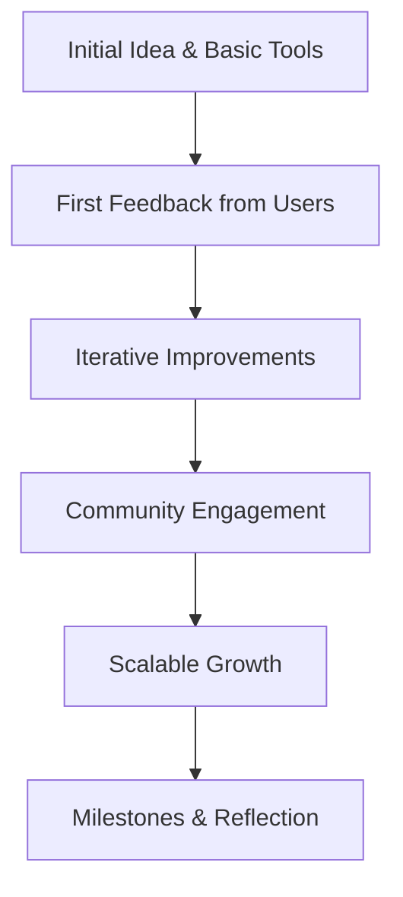

# 1 Year of YouTube — Reflections on System Design Education

---

## 1. **Main Concepts (Overview Section)**

This video serves as a retrospective and celebration of one year dedicated to producing system design content on YouTube. The key topics covered include:

- **Origin Story**: The humble beginnings of the channel and its creators.
- **Growth Journey**: Milestones achieved, such as subscriber count and video output.
- **Community Impact**: The role of the audience in shaping and supporting the channel.
- **Educational Philosophy**: The approach to teaching complex system design topics in an accessible way.
- **Gratitude and Future Outlook**: Thanking the community and hinting at ongoing commitment.

While the video is primarily a reflective piece rather than a technical deep-dive, it offers valuable insights into the process of creating educational content and the importance of community in technical learning.

---

## 2. **Detailed Conceptual Flow (Core Documentation)**

The journey begins with a candid recollection of the channel’s inception. The creator describes starting out with minimal equipment—a simple webcam and a gaming headset—emphasizing that expertise and passion can outweigh production value in the early stages of content creation. The first feedback, humorously suggesting a better microphone, highlights both the rawness of the start and the immediate engagement from viewers.

From these modest beginnings, the channel rapidly evolved. Over a single year, it managed to produce 50 videos and grow its audience to 400,000 subscribers. This growth is not merely a metric of popularity but also a reflection of the demand for clear, accessible system design education. The creators attribute their success to their dedication to making informative and concise content, indicating a teaching philosophy that values clarity and efficiency over verbosity.

Central to this narrative is the role of community. The creator repeatedly acknowledges the supportive nature of the audience, noting that the channel’s trajectory would have been impossible without active engagement and encouragement from viewers. This symbiotic relationship underlines a key aspect of modern technical education: learners and educators are partners in the process, with feedback loops that enhance the quality and relevance of the content.

Finally, the creator expresses heartfelt gratitude, reinforcing a sense of shared achievement and promising continued commitment to delivering high-quality educational resources.

---

## 3. **Simple & Analogy-Based Examples**

To better understand the dynamics described in the video, consider the analogy of gardening. The channel began as a small seed—just an idea supported by basic tools. The first videos were like seedlings, tender and in need of care. Early feedback (such as the suggestion to upgrade the microphone) functioned like sunlight and water, helping the garden of content to grow stronger and more vibrant.

With consistent nurturing—regular video releases and responsiveness to the community—the channel blossomed. Each subscriber and comment acted like pollinators, spreading the word and fueling growth. Over time, what started as a single seed grew into a flourishing garden enjoyed by hundreds of thousands.

---

## 4. **Use in Real-World System Design**

Although the video is not explicitly technical, the lessons within are highly relevant to system design in real-world settings:

- **Iterative Improvement**: Just as the channel started simple and scaled up, robust system design often begins with a minimal viable product (MVP) and iterates based on user feedback.
- **Community-Driven Development**: Engaging users early and often leads to better systems, much like audience feedback improved both content and production quality.
- **Clarity and Simplicity**: The commitment to informative yet crisp videos mirrors best practices in system design documentation—favoring clarity, brevity, and approachability.
- **Celebrating Milestones**: Recognizing achievements and expressing gratitude fosters a positive team culture, motivating further innovation.

**Common Patterns and Use Cases:**
- Agile development cycles, where frequent feedback and small releases shape the product.
- Open-source projects, which thrive on active community collaboration and transparent communication.

**Trade-offs and Challenges:**
- Scaling quality alongside quantity can be challenging, just as producing more videos risks diluting content quality.
- Responding to all feedback can be overwhelming; prioritization becomes key.

**Best Practices and Anti-Patterns:**
- **Best Practice**: Regularly incorporate user feedback to inform the next iteration.
- **Anti-Pattern**: Ignoring early, constructive criticism (e.g., about production quality) can stall growth and erode trust.

---

## 5. **Optional: Advanced Insights**

From an expert perspective, the growth of an educational channel closely parallels the evolution of distributed systems:

- **Feedback Loops**: In both software and content creation, tight feedback loops enable rapid detection and correction of issues.
- **Scalability**: Systems—and communities—must be designed to gracefully handle increased load, whether that’s more users or more viewers.
- **Resilience**: Early setbacks (e.g., equipment limitations or technical bugs) are opportunities to build robustness into future iterations.

Comparing this journey to software system design, it's clear that success stems from a combination of technical competence, user-centric iteration, and an ongoing commitment to quality.

---

## 6. **Analogy Section — Defining All Concepts**

Imagine building a bridge over a river. At first, you might only have a few planks and some rope, just enough to get across. Early travelers might point out wobbly boards (like viewers suggesting a better mic), helping you reinforce weak spots. As more people cross, their feedback teaches you where the bridge needs to be stronger or wider. Over time, with enough help and iteration, the bridge becomes sturdy, elegant, and able to support thousands. Similarly, the channel’s journey—from humble beginnings to a thriving community—demonstrates the power of iterative improvement, responsive design, and collective effort in any complex system, whether it’s software, infrastructure, or education.

---

## **Summary Diagram: Growth Journey as a System Design Flow**

---

## **Conclusion**

This anniversary reflection underscores not only the milestones of a YouTube channel but also foundational principles of effective system design and technical education—beginning simply, embracing feedback, iterating, and fostering a supportive community. Whether building software or sharing knowledge, these lessons pave the way for sustained, meaningful impact.