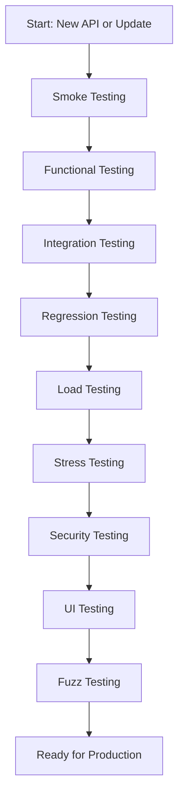

# API Testing: Comprehensive Guide to the 9 Most Popular Types

---

## 1. Main Concepts (Overview Section)

In this guide, you will learn:

- **The role of API testing** in modern software systems and why it is essential.
- The **nine most popular types of API testing**:
    1. **Smoke Testing**
    2. **Functional Testing**
    3. **Integration Testing**
    4. **Regression Testing**
    5. **Load Testing**
    6. **Stress Testing**
    7. **Security Testing**
    8. **UI Testing**
    9. **Fuzz Testing**
- **How each type of testing works** and its purpose within the software development lifecycle.
- **Examples and analogies** for intuitive understanding.
- **Applications in real-world system design**, including best practices, trade-offs, and potential pitfalls.
- **Advanced considerations** and how these testing strategies interrelate to produce resilient, high-quality APIs.

---

## 2. Detailed Conceptual Flow (Core Documentation)

### Introduction: The Hidden Backbone—APIs and Their Reliability

APIs (Application Programming Interfaces) are the invisible threads weaving together today’s digital experiences—from social networks and e-commerce to travel bookings and financial services. While end users interact with polished interfaces, APIs quietly handle the exchange of data and commands in the background, connecting disparate systems and services. Ensuring these APIs function correctly, securely, and efficiently is critical, and this is where **API testing** comes into play.

### The Spectrum of API Testing: From First Glance to Edge Cases

#### 1. Smoke Testing: The Quick Health Check

Before diving deep, it’s vital to confirm that the API is fundamentally operational. **Smoke testing** acts as an initial checkpoint—a “test drive” that verifies basic connectivity and response to simple requests. Think of it as turning the ignition key to see if a car engine starts before inspecting other features. In practice, this may involve sending a basic GET request to a health-check endpoint or ensuring the API is reachable and responds with an expected status code (like HTTP 200 OK).

#### 2. Functional Testing: Verifying Features Work as Promised

Once the basics are confirmed, **functional testing** digs deeper. Here, each function or endpoint of the API is systematically tested against predefined requirements. This means crafting test cases for every expected behavior—such as retrieving a product list, adding an item to a cart, or processing a checkout. The focus is on validating “what” the API does, not “how fast” or “how much.” For example, does the endpoint correctly return all active users? Does authentication work with valid and invalid credentials?

#### 3. Integration Testing: Ensuring Seamless Collaboration

Modern applications rarely operate in isolation; APIs often orchestrate interactions among various internal services or even third-party providers. **Integration testing** checks that these interactions work harmoniously. For instance, in a travel booking platform, integration tests ensure the airline reservation API communicates smoothly with payment processing, customer identity verification, and notification systems. Any misalignment here can cause data mismatches, failed bookings, or broken workflows.

#### 4. Regression Testing: Guarding Against Unintended Side Effects

Software evolves constantly. With every update or bug fix, there’s a risk that new changes inadvertently break existing features—a phenomenon known as regression. **Regression testing** reruns existing test cases on the updated API to detect whether previously passed scenarios now fail. This “safety net” enables teams to iterate rapidly without worrying about undoing past progress. Automated regression test suites are invaluable for continuous integration and deployment pipelines.

#### 5. Load Testing: Simulating Real-World Demand

Once core functionality and integrations are validated, the next question is: can the API handle the expected number of users? **Load testing** answers this by simulating typical or peak user volumes, measuring how the API performs under anticipated traffic. Metrics like response time, throughput, and error rate under load reveal potential bottlenecks or scalability issues. For example, an e-commerce API might be load-tested with thousands of simultaneous users adding items to carts during a holiday sale.

#### 6. Stress Testing: Probing the Breaking Point

While load testing simulates normal or peak usage, **stress testing** intentionally pushes the API far beyond expected limits—bombarding it with massive traffic spikes and edge-case scenarios. The goal is to observe how the system behaves under extreme stress: does it degrade gracefully, or does it crash? Stress testing prepares APIs for the unpredictable, such as viral popularity or coordinated attack attempts. It informs decisions on circuit breaking, throttling, and scaling policies.

#### 7. Security Testing: Fortifying the Vault

APIs often provide access to sensitive operations and data. **Security testing** scrutinizes APIs for vulnerabilities—such as improper authentication, excessive permissions, data leaks, or susceptibility to injection attacks. This proactive approach identifies and closes loopholes before they can be exploited by malicious actors. Just as a bank rigorously tests the strength of its vault, security testing ensures the API’s defenses are robust.

#### 8. UI Testing: Bridging Backend and User Experience

Though APIs are backend components, their performance and reliability directly impact the user interface (UI). **UI testing** verifies that API interactions result in smooth and correct user experiences. For example, a ride-sharing app’s map rendering depends on timely and accurate API responses. UI tests may simulate user journeys end-to-end, validating that API-driven screens load quickly and display correct data.

#### 9. Fuzz Testing: Preparing for the Unexpected

Finally, **fuzz testing** introduces unpredictability. By sending randomly generated, malformed, or unexpected input data to the API, fuzz testing exposes edge cases that might otherwise go unnoticed. This hardens the system against unforeseen usage patterns, such as unusual request formats or data volumes—making the API more resilient to real-world unpredictability.

---

## 3. Simple & Analogy-Based Examples

Imagine building a new car:

- **Smoke testing** is like turning the key to see if the engine starts.
- **Functional testing** checks if the headlights, brakes, and wipers work as intended.
- **Integration testing** ensures the GPS, radio, and climate control work together seamlessly.
- **Regression testing** confirms that fixing a headlight didn’t inadvertently break the brake lights.
- **Load testing** drives the car with a full load of passengers and luggage to see if it maintains speed and control.
- **Stress testing** pushes the car to its limits—accelerating uphill with maximum load.
- **Security testing** checks if the locks and alarms prevent unauthorized access.
- **UI testing** ensures the dashboard displays correct information in real-time.
- **Fuzz testing** is letting unpredictable drivers randomly operate controls to see if the car remains safe and functional.

### Simple Example

Suppose you have an API endpoint `/add-to-cart`. 

- A **smoke test** sends a basic request to see if you get a response.
- **Functional tests** check if adding an available item works, if adding an out-of-stock item fails appropriately, and if the item appears in the user’s cart.
- **Integration tests** verify that adding an item triggers inventory updates and recalculates the cart total.
- **Regression tests** re-run all previous tests after a code update to ensure nothing broke.
- **Load tests** simulate hundreds of users adding items simultaneously.
- **Stress tests** ramp this up to thousands, looking for failures or slowdowns.
- **Security tests** attempt to add items without authentication or try to add restricted items.
- **UI tests** check that the “Add to Cart” button updates the cart icon and list correctly.
- **Fuzz tests** send unexpected data types or malformed requests to see if the API handles them gracefully.

---

## 4. Use in Real-World System Design

### Patterns and Use Cases

- **Continuous Integration (CI) Pipelines:** Automated smoke, functional, and regression tests run with each code commit, preventing broken builds from reaching production.
- **Microservice Architectures:** Integration testing is crucial for ensuring that independently deployed services work together.
- **High-Traffic Platforms:** Load and stress testing inform capacity planning, auto-scaling policies, and incident response procedures.
- **Regulated Industries:** Security and compliance mandates make security testing non-negotiable for APIs handling personal or financial data.

### Design Decisions and Trade-offs

- **Test Coverage vs. Speed:** While comprehensive testing (regression, integration, fuzz) improves reliability, it can slow down deployment cycles. Teams often balance between fast feedback (smoke, basic functional) and thoroughness (full suites).
- **Automated vs. Manual Testing:** Automated tests increase efficiency and consistency but require investment; some security and integration scenarios still benefit from expert manual probing.
- **Environment Parity:** Testing in production-like environments reduces the risk of surprises but increases infrastructure costs.

#### PROs and CONs (with Practical Examples)

| Testing Type         | PROs                                                 | CONs / Challenges                                       | Example                                                   |
|----------------------|------------------------------------------------------|---------------------------------------------------------|-----------------------------------------------------------|
| Smoke                | Fast feedback, early error detection                 | Surface-level only, may miss deeper issues              | Quickly catches API outages after a deployment            |
| Functional           | Ensures features work as intended                    | Can miss inter-service issues                           | Detects if product search returns correct results         |
| Integration          | Catches issues between components                    | Complex to set up, especially with many dependencies    | Finds payment and booking sync errors in travel apps      |
| Regression           | Prevents re-introducing old bugs                     | Test suite maintenance overhead                         | Ensures checkout works after updating user profile logic  |
| Load                 | Validates real-world performance                     | May require costly test environments                    | Simulates Black Friday traffic in e-commerce              |
| Stress               | Prepares for worst-case scenarios                    | Risk of system instability during tests                 | Ensures API survives viral app adoption                   |
| Security             | Protects against breaches, builds trust              | Requires expertise, evolving threat landscape           | Finds token leakage or unauthorized access vulnerabilities|
| UI                   | Directly improves user experience                    | May be brittle to UI changes                            | Ensures fast map loads in ride-sharing apps               |
| Fuzz                 | Catches obscure or rare bugs                         | Hard to interpret results, can generate noise           | Discovers crash with rare malformed input                 |

### Best Practices

- **Automate where possible** to ensure consistent, repeatable tests.
- **Isolate environments** for stress and security testing to prevent impacting production.
- **Regularly update** security and regression tests in response to new threats and features.
- **Monitor test results** and integrate dashboards for real-time visibility.

### Anti-Patterns to Avoid

- **Relying solely on one type of test** (e.g., only functional, ignoring integration or load).
- **Neglecting security** due to perceived complexity or cost.
- **Skipping regression on “minor” changes**, leading to stealthy bugs.
- **Testing only in non-production-like environments**, causing missed real-world issues.

---

## 5. Optional: Advanced Insights

### Deeper Considerations

- **Contract Testing** (not explicitly covered above) is a specialized integration test ensuring that API consumers and providers adhere to agreed interfaces, reducing integration friction in large teams.
- **Chaos Engineering** extends stress/fuzz concepts to broader, system-wide fault injection—forging even greater resilience.

### Comparisons

- **API vs. UI Testing:** API testing is faster and more stable, as UI tests are susceptible to layout changes. However, UI tests are essential for true end-to-end validation.
- **Fuzz vs. Security Testing:** Fuzzing looks for robustness against malformed input, while security testing targets deliberate exploitation vectors.

### Edge Cases

- **Rate Limiting and Throttling:** Stress testing may reveal system behaviors when API rate limits are exceeded, such as temporary bans or error responses.
- **Backward Compatibility:** Regression and integration tests are vital when evolving public APIs to prevent breaking existing clients.

---

### Flow Diagram: API Testing Lifecycle

---

## Analogy Section: All Concepts Unified

Think of developing an API like building and launching a new car:
- You **turn the key (smoke test)** to see if it starts.
- You **test each system (functional test)**—brakes, lights, radio—to make sure they work individually.
- You **try systems together (integration test)**—turn on the GPS, play music, and switch on climate control simultaneously.
- After updating the navigation system, you **retest everything (regression test)** to ensure nothing else broke.
- You **fill the car with passengers and luggage (load test)** to see if performance holds.
- You **push it beyond maximum capacity (stress test)**—up a steep hill in the summer heat.
- You **check the locks and alarms (security test)** to keep thieves at bay.
- You **make sure the dashboard (UI) displays accurate info in real-time (UI test)**.
- Finally, you **let unpredictable drivers try odd combinations (fuzz test)** to see if the car behaves safely even when used unexpectedly.

---

## Conclusion

API testing is a multi-layered discipline that ensures the backbone of digital services remains robust, secure, and reliable. By thoughtfully applying smoke, functional, integration, regression, load, stress, security, UI, and fuzz testing, engineering teams can confidently deliver APIs that power seamless, scalable, and safe user experiences. Each type of testing plays a unique role in the software lifecycle, and together, they form a comprehensive safety net that protects both users and businesses from costly errors and vulnerabilities.