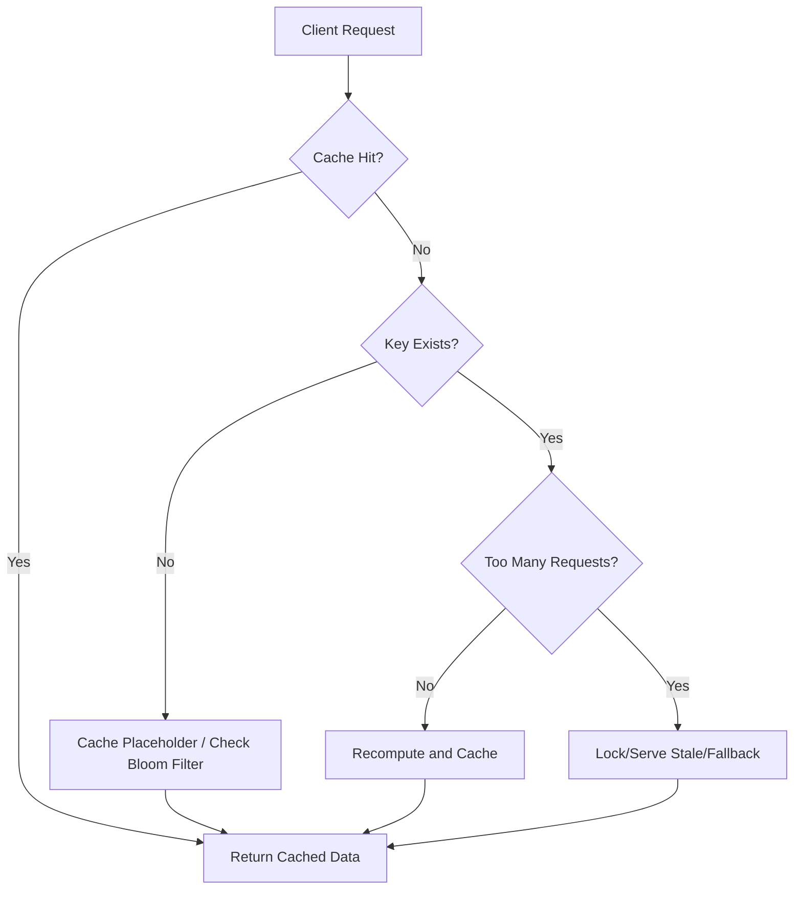

# Caching Pitfalls Every Developer Should Know

---

## 1. Main Concepts (Overview Section)

This documentation covers the fundamental challenges in caching systems, especially as they relate to high-performance software applications. The key topics include:

- **Caching Fundamentals**: A quick recap of what caching is and why it matters in system design.
- **Cache Stampede**: The danger of simultaneous cache regeneration and its impact on system stability.
- **Cache Penetration**: Problems arising from repeated requests for non-existent data.
- **Cache Crash & Avalanche**: System-wide risks when the cache layer fails or expires en masse.
- **Mitigation Strategies**: Practical solutions and patterns—locking, probabilistic early expiration, placeholders, Bloom filters, circuit breakers, redundancy, and prewarming.
- **Distinctions & Analogies**: Clarifying the differences between stampede and avalanche, reinforced with intuitive real-world analogies.
- **Real-World Applications & Best Practices**: How these concepts influence actual system design, with guidance on patterns, trade-offs, and common anti-patterns.

---

## 2. Detailed Conceptual Flow (Core Documentation)

### Introduction: Why Caching Matters

Caching is a foundational technique in performance-centric system design. At its core, a cache is a memory layer that keeps copies of frequently accessed—or computationally expensive—data close at hand. By serving requests from this fast-access storage, systems dramatically reduce load on slower backend databases, delivering snappier response times and supporting far greater user traffic.

To ground this, imagine a web application with millions of user profiles. Without a cache, every profile view would trigger a direct database query, quickly overwhelming backend resources. With caching, the most popular profiles are served instantly from memory, keeping both users and databases happy.

However, caching is not a panacea. While it lowers latency and increases throughput, it introduces several subtle but critical failure modes that, if left unaddressed, can compromise entire systems.

---

### Cache Stampede: When Many Requests Overwhelm a Single Cache Entry

#### The Problem

A **cache stampede** occurs when multiple requests simultaneously detect an expired cache entry and all attempt to recompute or reload the same data at once. Consider a scenario: A web server cluster uses Redis to cache rendered pages. These pages are complex and require heavy backend computation. Under normal traffic, the cache ensures most requests get fast responses. But when a cached page expires, a sudden surge—potentially thousands of threads—tries to rebuild that same page, slamming the database and potentially causing outages.

**Flow Diagram:**

```
[Web Clients] 
     |
     v
[Cache Miss for Expired Key]
     |
     v
[Multiple Threads Trigger Recompute]
     |
     v
[Backend DB Overloaded]
```

#### Solutions

To prevent stampedes, several engineering techniques are employed:

1. **Locking on Cache Miss**  
   When a request experiences a cache miss, it tries to acquire a lock for the specific cache key. Only the lock holder recomputes the value; others must wait, fail fast, or serve stale data.  
   - *Wait*: Other threads wait for the lock to release, then use the freshly cached value.
   - *Fail Fast*: Non-lock holders return an error or fallback, letting the client retry.
   - *Serve Stale*: Temporarily serve the outdated value while recomputation occurs.

   Locking introduces its own complexity: managing distributed locks reliably and efficiently, ensuring no deadlocks or resource leaks.

2. **External Recalculation Processes**  
   Decouple cache refresh logic from user requests. A background worker or scheduled job proactively refreshes near-expiry items, or reacts to cache misses, preventing a user-triggered surge.

3. **Probabilistic Early Expiration**  
   Rather than waiting for strict expiry, each request has a small, increasing chance of proactively recomputing the value as expiration nears. This "staggered refresh" evens out load and avoids synchronized spikes.

---

### Cache Penetration: The Cost of Non-Existent Data

#### The Problem

**Cache penetration** arises when requests target data that does not exist, neither in the cache nor in the database. Without defenses, each such request bypasses the cache and queries the database, wasting resources—especially problematic if attackers or misbehaving clients generate a high volume of such lookups.

#### Solutions

1. **Placeholders for Non-Existent Keys**  
   When a lookup fails, cache a placeholder (e.g., "NOT FOUND") for the missed key, with a sensible TTL (time-to-live). Subsequent requests for the same key are quickly answered from cache, sparing the database.

   The trade-off: if many unique, non-existent keys are queried, placeholders can consume significant cache memory. TTL tuning becomes important to balance protection versus resource usage.

2. **Bloom Filters**  
   A **Bloom filter** is a compact, probabilistic data structure that quickly checks if an element might exist in a set. When new database records are created, their keys are added to the Bloom filter. On each request:
   - If the Bloom filter says "definitely not present," the application immediately returns a miss, skipping both cache and database.
   - If "possibly present," the application proceeds to cache/database as usual.

   Bloom filters are space-efficient and fast, but they allow a small rate of false positives (never false negatives), so occasional unnecessary cache/database queries may still occur.

**Flow Diagram for Bloom Filter Integration:**

```
[Client Request]
     |
     v
[Bloom Filter Check]
  |           |
No           Yes
 |            |
v             v
Return     Check
Miss      Cache/DB
```

---

### Cache Crash & Avalanche: Systemic Failures from Cache Layer Loss

#### The Problem

A **cache crash** occurs when the entire cache layer becomes unavailable—due to hardware failure, software bugs, or operational missteps. Now, every request that previously hit the cache barrels straight into the database, which is rarely provisioned to handle such a load. The result: cascading failures, timeouts, and potential system-wide outages.

Closely related is the **cache avalanche** scenario, where a large portion (or all) of the cache expires or is cleared simultaneously. This can happen due to synchronized TTLs, mass restarts, or cold cache startups. The backend is suddenly hit with a tsunami of requests for many different keys, overwhelming capacity.

**Analogy:** Imagine a crowded theater with a single exit. If everyone tries to leave at once (cache avalanche), chaos and bottlenecks ensue. If only a few people leave at a time (well-staggered expiries), flow is manageable.

#### Solutions

1. **Circuit Breakers**  
   Circuit breakers monitor system health and temporarily reject or limit incoming requests when the database is under duress. This provides breathing room, avoids total meltdown, and protects critical data integrity.

2. **Highly Available Cache Clusters**  
   Employ distributed cache clusters with redundancy and failover. If one node or partition fails, others continue serving data, reducing the risk of total cache loss.

3. **Cache Prewarming**  
   After a cache restart or cold boot, proactively repopulate the cache with high-traffic or critical data before serving live traffic. This staged approach prevents a flood of cache misses from immediately overwhelming the backend.

---

### Distinguishing Stampede from Avalanche

Though both can overwhelm backend systems, the difference lies in scale and timing:

- **Cache Stampede**: Many requests for the same expired cache key surge at once, overwhelming the backend for a single piece of data.
- **Cache Avalanche**: Many requests for many different keys hit the backend together, typically after mass cache expiration or restart.

Understanding this nuance is critical for choosing the right mitigation strategies.

---

## 3. Simple & Analogy-Based Examples

**Simple Example:**
Suppose your e-commerce site caches product pages. If the cache for a best-selling product expires, thousands of users may simultaneously trigger a database query to rebuild the page (cache stampede). If, instead, the entire cache is cleared during a deployment, every product page—popular or not—becomes a direct database hit, causing a cache avalanche.

**Unified Analogy—The Theater Exit:**
Imagine a theater with VIP and general audience doors:
- *Cache Stampede*: All VIPs rush the VIP door the moment it opens after being closed, causing a pile-up at a single point.
- *Cache Avalanche*: After a fire alarm, everyone—VIPs and general audience—tries to exit through all doors at once, overwhelming every exit.

**Bloom Filter Analogy:**
Think of a guest list at a party. The doorman checks the list (Bloom filter). If your name isn’t there, you’re immediately turned away (no DB hit). If your name might be on the list (false positive possible), the doorman asks you for further ID (proceeds to cache/database).

---

## 4. Use in Real-World System Design

### Practical Patterns and Use Cases

- **Web Application Acceleration**: Caching is ubiquitous in web backends (e.g., Redis, Memcached) to store rendered HTML, session data, or API responses.
- **Microservices Communication**: Service-to-service calls often cache data to minimize cross-service latency and failure domains.
- **CDNs (Content Delivery Networks)**: Global caches store static and dynamic content close to users for fast delivery.

### Design Decisions and Trade-Offs

- **TTL Tuning**: Longer cache lifetimes reduce backend load but risk serving stale data; shorter TTLs demand more frequent recomputation and risk stampedes/avalanches.
- **Locking vs. Stale Serving**: Locking prevents duplicate work but can introduce latency and complexity. Serving stale data ensures responsiveness but may violate freshness guarantees.
- **Placeholder vs. Bloom Filter**: Placeholders are simple but memory-hungry if many unique misses occur. Bloom filters add complexity but scale well for large keyspaces.
- **Redundancy and Prewarming**: High-availability cache clusters and prewarming routines add operational overhead but are essential for resilient, high-traffic systems.

### Best Practices

- **Stagger Cache Expirations**: Randomize TTLs to avoid synchronized expirations (and thus avalanches).
- **Monitor and Alert**: Instrument cache hit/miss rates, backend load, and error rates to detect and respond to anomalies quickly.
- **Fail Gracefully**: Use circuit breakers and fallback logic to degrade service smoothly under duress rather than failing catastrophically.

### Anti-Patterns to Avoid

- **Uniform Expiry Times**: Setting identical TTLs for all keys increases avalanche risk.
- **No Locking or Stale Serving**: Failing to handle cache stampede scenarios can cripple the backend.
- **Unlimited Placeholder Caching**: Caching every miss forever leads to cache bloat.

---

## 5. Optional: Advanced Insights

- **Cache Consistency Models**: In distributed caches, choose between strong consistency (higher latency, lower risk of stale data) and eventual consistency (faster, but possible read anomalies).
- **Cache Invalidation**: Invalidate cache entries upon data changes to avoid serving stale or incorrect data—a challenging but crucial task.
- **Comparisons**:  
  - *CDN vs. Application Cache*: CDNs cache at the network edge for static/dynamic content; application caches are closer to the business logic and can store richer, context-aware data.
  - *Bloom Filter vs. Counting Bloom Filter*: Counting variants allow for efficient element deletion, at the cost of greater space and complexity.

**Edge Case Consideration**:  
In highly dynamic systems with rapidly changing data, aggressive caching may backfire—serving outdated data and confusing users. Here, hybrid strategies (short TTLs, real-time invalidation) are essential.

---

# Summary

Caching is a vital tool in building high-performance, scalable systems, but it requires careful design to avoid pitfalls like stampedes, penetration, and avalanches. By applying proven patterns—locking, early expiration, Bloom filters, circuit breakers, redundancy, and prewarming—developers can harness the benefits of caching while safeguarding against its hazards. Always remember to tailor strategies to your system's unique access patterns and failure modes, and never treat caching as a "set and forget" solution.

---

**Flow Diagram: Comprehensive Caching Pitfalls**



---

## Unified Analogy Section

**Caching is like managing a busy theater:**
- The cache is your fast-access VIP door—most guests (requests) breeze through.
- Occasionally, the VIP door closes for cleaning (cache expires). If everyone waits outside and rushes in when it reopens (stampede), chaos ensues.
- If all doors are suddenly closed (cache avalanche/crash), the entire crowd surges to the backstage (database), overwhelming staff.
- Smart theater managers:
  - Stagger cleaning times (random TTLs).
  - Assign ushers (locks) to control VIP access.
  - Keep a list of forbidden guests (Bloom filters/placeholders) to prevent pointless checks.
  - Build extra doors (redundant cache nodes) and pre-assign seats before opening (prewarming).

With thoughtful planning and the right strategies, the show always goes on—swiftly and smoothly.