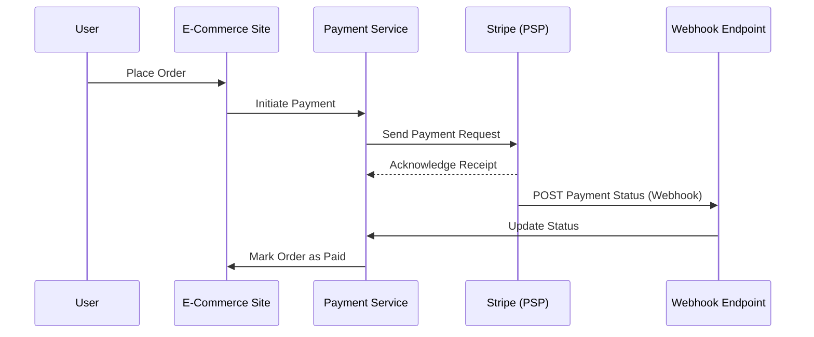

# Webhooks: Modern Event Notification for APIs and System Integration

---

## 1. Main Concepts (Overview Section)

This documentation covers the essentials of webhooks and contrasts them with traditional polling techniques in system integration. The main concepts explored include:

- **The Role of Webhooks in Modern Architectures**: How webhooks enable efficient, event-driven notification between systems.
- **Polling Techniques**: The differences between short polling, long polling, and why they were traditionally used.
- **How Webhooks Work**: The mechanism and flow of webhook-based communication.
- **Best Practices for Webhook Implementation**: Ensuring reliability, security, and idempotence.
- **Real-World Usage Patterns**: How webhooks fit into larger system designs, including trade-offs and hybrid models.
- **Analogy Section**: Everyday metaphors to solidify understanding of webhooks and polling.
- **Advanced Considerations**: Webhooks vs. persistent socket connections, performance, and scalability.

By the end, you’ll understand how webhooks compare to polling, how to implement them correctly, and when they are the right tool for your system.

---

## 2. Detailed Conceptual Flow (Core Documentation)

### Introduction: The Need for Asynchronous Communication

In modern web and API-driven systems, it’s common for one service to need updates from another — often across organizational or network boundaries. Consider an e-commerce website: when a customer places an order, your payment service must interact with an external payment service provider (PSP), such as Stripe, and then update your system once the payment is processed.

The challenge: How does your system learn that the payment provider has completed processing, especially when that process might take seconds (or longer), and you don’t want to block your users or tie up your servers waiting?

#### The Traditional Approach: Polling

##### Short Polling

Short polling is the simplest method: after sending a request (e.g., "please process this payment"), your service repeatedly asks the PSP, “Is it done yet?” This is akin to a child on a car trip constantly asking, “Are we there yet?” — it’s persistent, but inefficient. Each poll costs resources (network, CPU) on both sides, especially when most responses are “not yet.”

##### Long Polling

Long polling improves on this by having your service make a request and then wait — potentially for a long time — until the external service has something to report. The connection stays open, and the PSP only responds when the status changes. This reduces the number of requests but can tie up server resources, as many connections may be held open for extended periods.

#### Enter Webhooks: Event-Driven Notifications

Webhooks invert the polling relationship. Instead of your service asking for updates, you tell the PSP, “When you have news, send it to this URL.” The PSP then makes an HTTP request to your specified webhook endpoint as soon as the event occurs.

This model is often dubbed a "reverse API" or "push API" because the server (PSP) initiates communication to the client (your system), rather than the client polling the server.

The result: no wasted requests or open connections. Your infrastructure only expends resources when there’s meaningful data to process, making webhooks highly efficient for many integration scenarios.

#### Step-by-Step: Webhook Flow in the E-commerce Example

1. **User places an order on your site.**
2. **Your order service calls the payment service.**
3. **Payment service sends payment details to Stripe.**
4. **Stripe processes the payment asynchronously.**
5. **When done, Stripe sends an HTTP POST to your webhook endpoint (e.g., `/webhooks/stripe`).**
6. **Your system handles the notification, updates the order status, and responds with a success code.**

This flow removes the need for constant status checks and streamlines event delivery.

---

## 3. Simple & Analogy-Based Examples

### Simple Example

Suppose your site receives an order and starts a payment process with Stripe. Instead of checking every second (“Is it paid yet?”), you give Stripe a callback URL (`/webhooks/stripe`). As soon as Stripe knows the payment status, it calls your URL with the result. Your system acts only when there’s actual news.

### Analogy Section: Explaining All Concepts

- **Short Polling**: Like repeatedly calling a friend to ask, “Have you left yet?” even though you know the answer probably hasn’t changed.
- **Long Polling**: Like calling your friend and staying on the line until they finally answer, “I’m leaving now.”
- **Webhooks**: Like telling your friend, “Text me when you leave,” and going about your day until you get the message. You don’t waste time or attention waiting.
- **Reverse API**: Instead of you (the client) initiating every conversation, the server reaches out to you when it has something to say — much like getting notified when a package is delivered rather than checking the doorstep every hour.

---

## 4. Use in Real-World System Design

### Common Patterns and Use Cases

- **Third-Party Integrations**: Payment processors (Stripe, PayPal), messaging platforms (Slack), and logistics providers often use webhooks to notify your systems of new events.
- **Event-Driven Architecture**: Webhooks enable decoupled, reactive systems where services communicate asynchronously.
- **Automation Triggers**: Systems like GitHub use webhooks to trigger CI/CD pipelines or alert downstream systems of code changes.

### Design Decisions Influenced by Webhooks

- **Resource Efficiency**: Webhooks reduce unnecessary network traffic and server load compared to polling.
- **Decoupling**: They allow your systems to remain loosely coupled — the sender only needs to know your callback URL, not your internal implementation.
- **Reliability**: Webhooks introduce new reliability challenges, as delivery depends on both parties’ uptime and network connectivity.

### Trade-offs and Challenges

#### PROs:

- **Efficiency**: No wasted polling requests; your system acts only on real events.
- **Scalability**: Handles large numbers of clients/events without increasing request volume linearly.
- **Timeliness**: Faster notification than most polling intervals.

#### CONs:

- **Delivery Uncertainty**: If your webhook endpoint is unavailable, notifications can be lost unless retries or backup polling are used.
- **Security Risks**: Exposes endpoints to the internet; must guard against unauthorized requests and abuse.
- **Idempotency Required**: Webhook events may be delivered multiple times; your handlers must be robust to duplicates.
- **Traffic Spikes**: High-volume events can overwhelm your infrastructure.

##### Practical Example

If Stripe fails to deliver a webhook (e.g., due to your server downtime), you risk missing payment updates. To address this, implement a **fallback polling mechanism**: periodically check the payment status as a backup. Similarly, if your site suddenly becomes popular, a surge of webhook events could overwhelm your order processing logic — use **queues** to buffer and process events asynchronously.

### Best Practices

1. **Backup Polling**: Always have a periodic polling job to catch missed events.
2. **Secure Your Endpoints**: Require authentication tokens or verify signatures to ensure events are from trusted sources.
3. **Idempotency**: Design handlers to safely process repeated deliveries (e.g., by tracking event IDs).
4. **Queue Processing**: Decouple webhook reception from processing using message queues to handle traffic bursts.
5. **Graceful Error Handling**: Return proper HTTP status codes and log failures for monitoring and replay.

### Anti-Patterns to Avoid

- **Assuming Webhook Delivery Is Guaranteed**: Never rely solely on webhooks for critical updates.
- **Ignoring Security**: Open webhook endpoints can be exploited if not properly protected.
- **Synchronous Processing**: Don’t perform heavy operations synchronously in your webhook endpoint — offload to background jobs.

---

## 5. Optional: Advanced Insights

### Webhooks vs. Persistent Socket Connections

Webhooks deliver notifications as discrete HTTP requests, which is suitable for most asynchronous updates. However, for ultra-low-latency, real-time applications (e.g., financial trading, live chat), persistent socket connections (like WebSockets) provide superior performance by maintaining a continuous connection for push-based updates with minimal delay.

**Trade-off**: WebSockets require more complex infrastructure and state management, while webhooks are easier to set up, especially with third-party systems.

### Subtle Behaviors and Edge Cases

- **Event Ordering**: Webhooks may be delivered out of order; design your logic to handle this possibility.
- **Replay Attacks**: Secure webhook endpoints against replayed or forged requests by verifying event signatures and timestamps.
- **Scaling Considerations**: High-volume services should implement rate limiting and backpressure strategies to avoid overload.

---

## Flow Diagram: Webhook Integration in an E-commerce System

---

## Conclusion

Webhooks offer an elegant, efficient alternative to polling for integrating disparate systems and handling asynchronous events. They are especially powerful in event-driven architectures, enabling timely and resource-efficient updates, but require careful attention to reliability, security, and scalability. By understanding their strengths, limitations, and proper implementation strategies, you can significantly improve the responsiveness and maintainability of your platform.