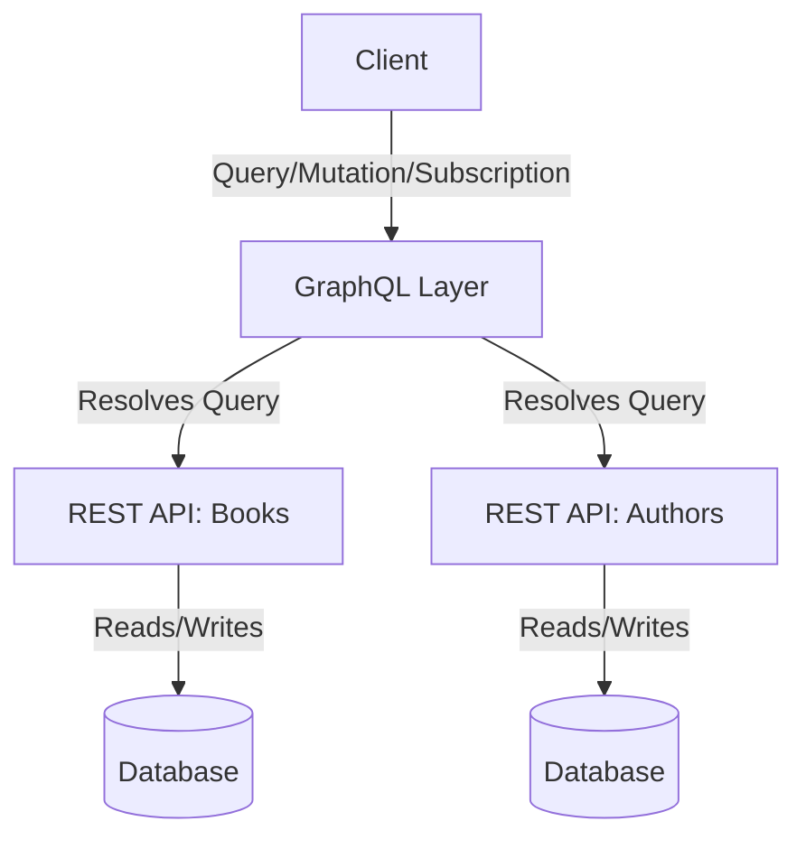

# What Is GraphQL? REST vs. GraphQL

---

## 1. Main Concepts (Overview Section)

This documentation provides a comprehensive overview of GraphQL, focusing on its core principles, how it compares to REST, and practical considerations for system design. The reader will learn:

- **What GraphQL is** and its role in API design
- **How GraphQL and REST are similar and different**
- **Key features of GraphQL:** queries, mutations, and subscriptions
- **How GraphQL schemas work** and the client-driven data-fetching paradigm
- **Practical trade-offs:** advantages, drawbacks, and challenges in real-world adoption
- **Caching, tooling, and security considerations**
- **Simple examples and analogies** to reinforce understanding
- **Best practices and anti-patterns in system architecture involving GraphQL**

---

## 2. Detailed Conceptual Flow (Core Documentation)

### Introduction to GraphQL

GraphQL is a query language for APIs developed by Meta (formerly Facebook) that fundamentally rethinks how clients interact with backend data. Unlike traditional REST APIs, where endpoints represent specific resources or collections, GraphQL provides a unified interface—called a schema—that describes all the data available to clients. Through this schema, clients can request precisely the data they need and nothing more, in a single HTTP request.

This approach positions GraphQL as an intermediary layer between clients (such as web or mobile apps) and backend services. It empowers clients with greater control over data retrieval, reducing overfetching (receiving too much data) and underfetching (needing multiple requests to get all necessary data).

### GraphQL’s Core Components

**Queries** are the heart of GraphQL, allowing clients to specify exactly what data they want to retrieve. Suppose a client needs information about a book and its author. With GraphQL, the client structures a query that outlines which fields for the book and author are needed, and the server responds with data shaped precisely as requested.

**Mutations** are GraphQL’s mechanism for modifying data—such as creating, updating, or deleting records. While queries are read-only, mutations explicitly signal intent to change the underlying data.

**Subscriptions** allow clients to receive real-time updates when data changes. This is useful for applications that need to react immediately to server-side events, such as chat apps or live dashboards.

### REST vs. GraphQL: A Comparative Exploration

Both GraphQL and REST APIs typically communicate via HTTP and can return responses in JSON format, making them superficially similar. However, their philosophies and capabilities diverge in key areas.

**REST** organizes data around resources, each identified by a unique URL. For example, to fetch a book from a bookstore API, a client might send a GET request to `/books/123`. If detailed information about the book’s author is needed, another request to `/authors/456` may be required, unless the book resource already embeds that data.

**GraphQL**, by contrast, decouples data retrieval from specific URLs. Instead, a single endpoint (often `/graphql`) receives queries written in the GraphQL language. The query itself specifies what data is needed, including traversing relationships between types (like book and author) as defined in the schema.

This schema-centric approach means clients are no longer bound by how the server structures endpoints. For example, fetching a book and its author in a single GraphQL query is straightforward, whereas in REST, it might require multiple requests—leading to the notorious “n+1 problem,” where fetching a list of resources and their related entities results in numerous sequential requests.

### The GraphQL Schema: The Contract Between Client and Server

A GraphQL schema is a formal definition of the types, fields, and relationships available in the API. It acts as both documentation and a contract, ensuring that clients know exactly what data they can query and in what shape it will be returned.

For instance, the schema might define a `Book` type with fields like `title`, `isbn`, and an `author` field referencing an `Author` type. When a client sends a query referencing these fields, the server enforces the schema’s rules, guaranteeing consistency.

The power of the schema is that it abstracts the implementation details. Clients only need to know what data can be requested, not how the data is fetched or assembled behind the scenes.

### How GraphQL Changes the Data Fetching Paradigm

With REST, the structure of responses and the inclusion of related resources are dictated by the API designer. Some implementations may include nested resources; others require additional requests. This can lead to inefficiencies, especially as client needs evolve.

GraphQL inverts this relationship: the client specifies not only *which* resource to fetch, but also *which fields* and *related data* should be included. This flexibility minimizes both overfetching (receiving more data than required) and underfetching (having to make multiple requests to get all necessary data).

### Drawbacks and Trade-offs of GraphQL

Despite its benefits, GraphQL introduces several complexities:

- **Tooling Overhead:** Consuming a REST API can be as simple as sending an HTTP request via curl or a browser. GraphQL requires both server and client tooling to parse, validate, and resolve queries. This means more upfront investment and ongoing maintenance.

- **Caching Challenges:** REST APIs commonly leverage HTTP GET requests, which are inherently cacheable by browsers, CDNs, and proxies. GraphQL, by default, sends queries via HTTP POST to a single endpoint, making standard HTTP caching less effective. While advanced caching strategies exist for GraphQL, they are nuanced and require careful design.

- **Performance and Security Risks:** The flexibility of GraphQL queries means clients can inadvertently or maliciously craft expensive queries (e.g., deeply nested requests or large table scans) that strain backend systems. Safeguards like query depth limiting, complexity analysis, and timeouts add further layers of complexity.

- **Not Always Worth the Cost:** For simple CRUD (Create, Read, Update, Delete) APIs or where requirements are stable, the infrastructure and complexity of GraphQL may not provide enough benefit over REST.

---

## 3. Simple & Analogy-Based Examples

Imagine a **restaurant analogy**:

- **REST** is like a fixed menu: each dish (endpoint) is predefined by the chef (API designer). If you want a steak with a side salad, but the menu only offers steak with fries, you must order two dishes or make multiple requests.
- **GraphQL** is more like a customizable meal order: you tell the waiter (GraphQL server) exactly what you want on your plate (query), including only the steak and salad, and that’s what you get in one go.

**Example: Fetching a Book and Author**
- In REST, you might request `/books/1` and receive a book, but need to request `/authors/2` to get details about the author.
- In GraphQL, you send a single query:  
  ```
  {
    book(id: 1) {
      title
      author {
        name
      }
    }
  }
  ```
  The response includes the book and author info in one call.

---

## 4. Use in Real-World System Design

### Patterns and Use Cases

GraphQL shines in scenarios where:

- Clients (web, mobile, third-party) have diverse and evolving data needs.
- Aggregating data from multiple sources or microservices is necessary.
- Overfetching or underfetching data with REST is a recurrent pain point.

Common patterns include:

- **Backend-for-Frontend (BFF):** A GraphQL layer tailored to the needs of specific clients, optimizing data retrieval.
- **API Gateway:** GraphQL serves as a single entry point, abstracting multiple backend services.

### Design Decisions Influenced by GraphQL

- **Schema-First Development:** API evolution is managed through schema migrations.
- **Query Complexity Controls:** Implementing max query depth, whitelisting queries, or cost analysis to prevent resource exhaustion.
- **Custom Caching Strategies:** Using persisted queries, response normalization, or third-party GraphQL-aware caches.

### Trade-offs and Challenges

- **Pros:**
  - Reduces number of API requests for complex data needs.
  - Decouples client and server development cycles.
  - Self-documenting schema improves developer experience.

- **Cons:**
  - Higher upfront and ongoing complexity.
  - More difficult to leverage ubiquitous HTTP caching.
  - Security risks from unbounded queries.

- **Real-World Example:**  
  A large e-commerce platform adopted GraphQL to power both its web and mobile apps, enabling rapid iteration of UI components. However, they needed to invest in sophisticated query cost analysis and monitoring tools to prevent performance regressions as clients began constructing more complex queries.

### Best Practices

- **Safeguard Backend Resources:** Always implement query complexity and depth limits.
- **Optimize for Caching:** Where possible, structure queries and responses for cacheability.
- **Incrementally Adopt:** Start with high-value use cases or as a BFF layer before replacing entire REST APIs.
- **Avoid Anti-Patterns:**
  - Exposing all backend data without access controls.
  - Allowing unbounded or recursive queries.
  - Ignoring schema versioning and deprecation planning.

---

## 5. Optional: Advanced Insights

- **GraphQL vs. RESTful Evolvability:** REST endpoints can be versioned, whereas GraphQL encourages schema evolution via field deprecation, offering more granular backward compatibility.
- **N+1 Problem in GraphQL:** Naive resolvers can lead to backend inefficiencies if not handled with batching or dataloader patterns.
- **Comparison with Alternatives:** Tools like gRPC or OData also aim to solve some REST limitations but with different trade-offs in terms of tooling, transport protocols, and ecosystem maturity.
- **Edge Cases:** Complex queries may bypass caching layers, leading to unexpected backend load. Similarly, subscription management adds persistent connection overhead, which must be accounted for in system design.

---

## 6. Unified Analogy Section

To unify all concepts, think of **REST and GraphQL as two types of travel agencies**:

- **REST** offers pre-packaged tours: you pick a tour (endpoint) and get everything included, whether you want it or not. If you want something extra, you need to book another tour.
- **GraphQL** is a custom trip planner: you specify exactly what you want to see and do (data and fields), and the agency builds a trip tailored to your request in one itinerary.

This analogy highlights why GraphQL can be more efficient and flexible for complex, evolving needs—but also why it requires more planning and oversight to ensure a smooth journey.

---

## 7. Flow Diagram



---

## 8. Conclusion

GraphQL is a powerful alternative to REST for modern API development, offering client-driven queries, flexibility, and a strongly-typed schema. However, its strengths come with significant complexity, especially regarding caching, security, and operational overhead.

Choosing between REST and GraphQL is not about one being categorically better than the other, but about understanding your application’s needs, the trade-offs involved, and the capacity to manage the complexities that GraphQL introduces. Like all major system design decisions, context and thoughtful planning are key.