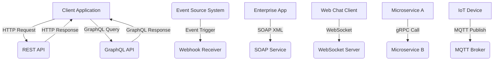

# Top 9 Most Popular API Protocols: A Comprehensive Technical Overview

---

## 1. Main Concepts (Overview Section)

In this documentation, we examine the most popular API protocols shaping modern software systems. The protocols discussed—REST, GraphQL, Webhooks, SOAP, WebSocket, and gRPC—each address unique communication challenges in distributed applications. We’ll also briefly recognize MQTT, AMQP, EDI, and EDA as specialized protocols for particular domains.

The key concepts and flow of this document are:

- **REST:** The foundation of web APIs, focusing on simplicity and scalability.
- **GraphQL:** A flexible query-based protocol addressing REST’s data-fetching limitations.
- **Webhooks:** Event-driven HTTP callbacks enabling near real-time system integration.
- **SOAP:** A strict, standards-based protocol with robust security, preferred in regulated industries.
- **WebSocket:** Real-time, bidirectional communication for latency-sensitive applications.
- **gRPC:** A high-performance, contract-first RPC protocol leveraging HTTP/2 and Protocol Buffers.
- **Other Protocols:** MQTT, AMQP, EDI, EDA—protocols tailored to specific industry or architectural needs.

Throughout, you’ll see how these protocols interrelate, compare, and are selected for real-world system design, along with analogies and practical insights for each.

---

## 2. Detailed Conceptual Flow (Core Documentation)

### REST: The Reliable Workhorse of the Web

REST (Representational State Transfer) is the most widely adopted API protocol, forming the backbone of countless web services. At its core, REST leverages standard HTTP methods—such as GET, POST, PUT, and DELETE—to perform operations on resources, which are typically represented as URLs. Its stateless nature means that each request from client to server contains all the information needed to process it, facilitating horizontal scalability. This simplicity makes REST approachable for developers and easy to integrate with existing web infrastructure.

However, REST’s resource-centric approach can introduce inefficiencies. For example, when a client requires data spread across multiple resources, it may need to make several requests—each incurring network latency. This can lead to **over-fetching** (retrieving more data than needed) or **under-fetching** (requiring multiple requests to assemble needed data), which impacts performance, especially in mobile or bandwidth-constrained scenarios.

### GraphQL: Precision Data Fetching

To solve REST’s data retrieval limitations, GraphQL emerged, crafted by Facebook for more complex front-end requirements. Unlike REST’s fixed endpoints, GraphQL exposes a single endpoint through which clients send queries specifying exactly what data they require. This means clients can avoid both over-fetching and under-fetching, retrieving only the data structures they need in a single round trip.

GraphQL is **strongly typed**—it defines a schema that describes all possible data and operations, enabling robust validation and introspection. It also supports real-time data through **subscriptions**, keeping clients synchronized as changes occur.

The flexibility of GraphQL, however, introduces new challenges. The server must resolve potentially complex, client-specified queries, which can inadvertently overload backend systems if not carefully managed. Additionally, because responses are highly dynamic, traditional HTTP caching strategies (which rely on predictable URLs and payloads) are more difficult to implement, sometimes leading to performance trade-offs.

### Webhooks: Event-Driven Integration

Webhooks shift the paradigm from request-driven to event-driven APIs. They are essentially HTTP callbacks triggered by specific events in an application. For example, when a payment is received, a webhook can notify another system immediately, eliminating the need for constant polling.

This decoupling—where the sender and receiver are only loosely connected—improves scalability and modularity. Webhooks are particularly valuable for integrating third-party services, automation pipelines, or maintaining data consistency across distributed systems.

### SOAP: Contractual Rigor and Security

SOAP (Simple Object Access Protocol) predates REST and remains a stalwart in industries demanding strict standards, such as finance and healthcare. SOAP uses XML to define messages, operations, and data types. It enforces strong typing and includes built-in features for authentication, authorization, and encryption, ensuring data integrity and compliance with regulatory requirements.

Though often seen as heavyweight compared to REST or GraphQL, SOAP’s rigor is indispensable for environments where contracts and security are paramount. Its verbosity and complexity, however, can slow development and performance for lightweight or public web APIs.

### WebSocket: Real-Time, Bidirectional Communication

WebSocket addresses the need for real-time, low-latency communication between clients and servers. Unlike HTTP, which is inherently request/response and stateless, WebSocket establishes a persistent, full-duplex connection. This allows messages to flow instantly in both directions, making it ideal for chat applications, online gaming, live dashboards, and trading platforms where immediacy is critical.

Because the connection remains open, WebSocket can efficiently push updates without the overhead of repeated handshakes or polling.

### gRPC: High-Performance Service-to-Service Communication

gRPC is a modern, contract-first protocol designed for high-speed, inter-service communication, especially within distributed microservices architectures. Built atop HTTP/2, it leverages **Protocol Buffers** (a binary serialization format) to define services and message schemas. This enables type-safe, language-agnostic APIs with low latency and high throughput.

gRPC supports **streaming**—both client-to-server and server-to-client—making it suitable for complex workflows and real-time data pipelines. Its compact, efficient messages and support for multiple programming languages make it a preferred choice for intra-data center communication, but it’s less accessible for open, browser-based clients compared to REST.

### Other Protocols: Tailored Solutions

- **MQTT:** A lightweight publish/subscribe protocol commonly used in IoT for low-bandwidth, high-latency, or unreliable networks.
- **AMQP:** Advanced Message Queuing Protocol, designed for robust, asynchronous messaging in enterprise integrations.
- **EDI (Electronic Data Interchange):** The backbone for standardized data exchange in supply chain and logistics industries.
- **EDA (Event-Driven Architecture):** Not a protocol itself, but a design pattern leveraging events as first-class citizens, often using protocols like Kafka or RabbitMQ.

---

## 3. Simple & Analogy-Based Examples

To cement these concepts, let’s consider a few analogies and examples.

- **REST is like a library checkout desk**: Each time you want information (a book), you go to the desk (endpoint), ask for a specific book (resource), and get it. If you need several books, you have to make multiple trips.
  
- **GraphQL is like a custom order counter at a deli**: Instead of picking from fixed menu items, you specify exactly what you want in your sandwich. You get all your ingredients in one go—no more, no less.

- **Webhooks are the postal service’s notification cards**: When a package arrives (an event), you get a notification delivered to your mailbox (your system), so you don’t have to check the post office every day.

- **SOAP is a notarized contract**: Every message is wrapped with formal documentation, signatures, and seals, ensuring it’s legally binding and secure.

- **WebSocket is a phone call**: Once the call is connected, both parties can talk and listen at the same time, instantly, until the call ends.

- **gRPC is an internal corporate mail system**: Messages are delivered quickly and efficiently between departments, with pre-defined forms and processes, but not designed for external or public communication.

---

## 4. Use in Real-World System Design

### Choosing the Right Protocol

In practical system architecture, protocol selection is driven by the specific needs of the application:

- **Public-facing APIs:** REST remains the default for web and mobile clients due to its simplicity and compatibility with HTTP tooling and browsers.
- **Complex data fetching:** GraphQL is favored in scenarios where front-end teams require flexible, efficient data access—such as social networks or dashboards with nested resources.
- **Event notifications:** Webhooks integrate systems in near real time, ideal for payment gateways, CI/CD pipelines, or SaaS integrations.
- **Enterprise and regulated domains:** SOAP’s strict contracts, security, and reliability are essential for financial transactions, healthcare records, or government workflows.
- **Real-time applications:** WebSocket powers live chat, multiplayer games, and live trading platforms where milliseconds matter.
- **Microservices communication:** gRPC is optimal for service-to-service calls within data centers, supporting high-throughput, low-latency, and strong typing.

### Trade-Offs and Challenges

- **REST vs. GraphQL:** REST is easier to cache and scale, but can be inefficient for complex queries. GraphQL offers precision but can overload servers or complicate caching.
- **Webhooks:** While efficient, webhook consumers must handle idempotency, retries, and security (validating sender authenticity).
- **SOAP:** Offers strong guarantees but can be time-consuming to develop and maintain, especially for simple integrations.
- **WebSocket:** Persistent connections require careful resource management and may pose scaling challenges at high concurrency.
- **gRPC:** Excels in internal networks but is less friendly for browser clients and lacks some HTTP-native features (e.g., human-readable messages).

### Common Patterns, Best Practices, and Anti-Patterns

- **REST:** Use proper HTTP status codes, version APIs, and document endpoints. Avoid deeply nested resources that increase request complexity.
- **GraphQL:** Implement query complexity limits, depth restrictions, and robust monitoring to avoid backend overload.
- **Webhooks:** Secure endpoints with shared secrets, support retries, and log all inbound events for observability.
- **SOAP:** Leverage WSDL for contract management, and use built-in security extensions.
- **WebSocket:** Limit idle connections, implement heartbeats, and monitor for stale connections.
- **gRPC:** Version Protocol Buffers and service definitions; automate code generation for consistency.

#### Anti-Patterns to Avoid

- Overloading REST endpoints with non-resource operations (e.g., RPC-style calls).
- Ignoring pagination and filtering in REST/GraphQL, leading to large payloads.
- Failing to secure webhook or WebSocket endpoints against unauthorized access.
- Using SOAP for lightweight integrations where REST suffices, leading to unnecessary complexity.

---

## 5. Optional: Advanced Insights

### Comparative Analysis

- **REST vs. gRPC:** REST is resource-based and human-readable, ideal for external APIs. gRPC is function-based, efficient, and type-safe, but requires more setup and isn’t as browser-friendly.
- **GraphQL vs. REST:** GraphQL centralizes logic at the API layer, reducing client round trips but complicating backend performance management. REST decentralizes, often requiring more requests but easier scaling and caching.
- **WebSocket vs. Webhooks:** Webhook is push-only and event-driven, while WebSocket is interactive and supports two-way real-time communication.

### Edge Cases

- **GraphQL Introspection:** While helpful for tooling, can expose too much about backend schemas; restrict in production for security.
- **WebSocket Scaling:** At very high scale, load balancers and proxy infrastructure must support sticky sessions or stateful connections.
- **gRPC Backward Compatibility:** Protocol Buffers must be evolved carefully to avoid breaking changes for existing clients.

---

## 6. Flow Diagram: API Protocols in System Integration

---

## 7. All-in-One Analogy Section

To encapsulate, imagine an organization’s communication:

- **REST:** Staff submit requests via standardized forms at the front desk—efficient but sometimes requires multiple forms.
- **GraphQL:** Staff use a custom request slip where they list exactly what they want, getting all details in one transaction.
- **Webhooks:** The mailroom sends out alerts whenever a package arrives, so no one has to keep checking the mailroom.
- **SOAP:** For legal agreements, every communication is notarized and follows strict templates.
- **WebSocket:** Like having a dedicated phone line open between two offices for instant back-and-forth.
- **gRPC:** Departments use a secure, internal, express mail system with pre-agreed formats for efficiency.

---

## Conclusion

Selecting the right API protocol is fundamental to designing robust, scalable, and efficient systems. Understanding the strengths, weaknesses, and ideal use cases for REST, GraphQL, Webhooks, SOAP, WebSocket, gRPC, and other protocols empowers architects and developers to build APIs that meet both current and evolving demands. The optimal choice hinges on balancing simplicity, flexibility, performance, security, and ecosystem compatibility—always guided by the unique requirements of your application domain.